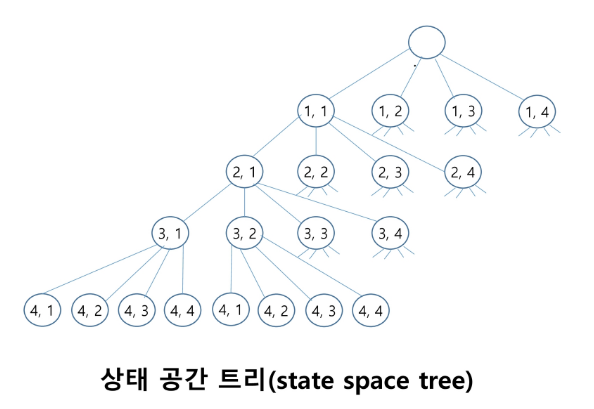

# 백트래킹 (Backtracking)

## 개념

1. 여러가지 선택지들이 존재하는 상황에서 한 가지를 선택
2. 선택이 이루어지면 새로운 선택지들의 집합이 생성됨
3. 이런 선택을 반복하면서 최종 상태에 도달한다.
    - 올바른 선택을 계속하면 목표 상태(Goal State)에 도달한다

### **당첨 리프 노드 찾기**

1. 루트에서 갈 수 있는 노드를 선택한다
2. 꽝 노드까지 도달하면 최근의 선택으로 되돌아와서 다시 시작한다
3. 더 이상의 선택지가 없다면 이전의 선택지로 돌아가서 다른 선택을 한다
4. 루트까지 돌아갔을 경우 더 이상 선택지가 없다면 찾는 답이 없다


### **백트래킹과 DFS(깊이 우선 탐색)과의 차이**

- **어떤 노드에서 출발하는 경로가 해결책으로 이어질 것 같지 않으면 
더 이상 그 경로를 따라가지 않음으로써 시도의 횟수를 줄임 (Prunning : 가지치기)**
- **깊이 우선 탐색이 모든 경로를 추적하는데 비해, 
백트래킹은 불필요한 경로를 조기에 차단**
- **깊이 우선 탐색을 가하기에는 경우의 수가 너무나 많음.**
**즉 `N!`가지 경우의 수를 가진 문제에 대해 깊이 우선 탐색을 가하면 당연히 처리 불가능**
- **백트래킹 알고리즘을 적용하면 일반적으로 경우의 수가 줄어들지만,**
**이 역시 최악의 경우에는 지수 함수 시간을 요구함**

## **문제 제시: N-Queen 문제**

**`n * n` 서양 장기판에서 배치한 Queen들이 서로 위협하지 않도록 
n개의 Queen을 배치하는 문제**

- 어떤 두 Queen도 서로를 위협하지 않아야 한다
- Queen을 배치한 n개의 위치는?


**8-Queens:**

- 퀸 8개를 체스판 안에서 서로를 공격할 수 없도록 배치하는 모든 경우의 수를 구하는 문제
- 후보 해의 수: `64C8` = 4426165368
- 실제 해의 수: 92개
- 44억 개가 넘는 후보 해의 수 속에서 92개를 최대한 효율적으로 찾아내는 것이 관건

**→ 4-Queens으로 축소해서 생각해보자**

- 같은 행에 위치할 수 없음
- 모든 경우의 수 = 4 * 4 * 4 * 4 = 256



- 루트 노드에서 리프 노드까지의 경로는 해답 후보 (candidate soultion)이 되는데,
깊이 우선 탐색을 하여 그 해답 후보 중에서 해답을 찾을 수 있음
- 하지만 이 방법을 사용하면 해답이 될 가능성이 전혀 없는 노드의 후손 노드(descendant)들도 
모두 검색해야 하므로 비효율적

**백트래킹 기법을 활용한 절차**

1. 상태 공간 트리의 깊이 우선 검색을 실시
2. 각 노드가 유망한지를 점검
3. 만일 그 노드가 유망하지 않으면, 그 노드의 부모 노드로 돌아가서 검색을 지속


**상태 공간 트리**


**순수한 깊이 우선 검색 = 155노드**

**백트래킹 = 27노드**

### CODE

```python
def check(row, col):
    # 현재 열에 퀸이 있는지 확인
    for i in range(row):
        if visited[i][col] == 1:
            return False

    # 왼쪽 대각선 확인
    i, j = row - 1, col - 1
    while i >= 0 and j >= 0:
        if visited[i][j] == 1:
            return False
        i -= 1
        j -= 1

    # 오른쪽 대각선 확인
    i, j = row - 1, col + 1
    while i >= 0 and j < N:
        if visited[i][j] == 1:
            return False
        i -= 1
        j += 1

    # # 왼쪽 대각선 확인
    # for i, j in zip(range(row - 1, -1, -1), range(col - 1, -1, -1)):
    #     if visited[i][j] == 1:
    #         return False
    #
    # # 오른쪽 대각선 확인
    # for i, j in zip(range(row - 1, -1, -1), range(col + 1, N)):
    #     if visited[i][j] == 1:
    #         return False

    return True

def dfs(row):
    global cnt

    if row == N:
        cnt += 1
        return

    for col in range(N):
        if check(row, col):
            visited[row][col] = 1
            dfs(row + 1)
            visited[row][col] = 0  # Backtracking

T = int(input())
for tc in range(1, T + 1):
    N = int(input())
    visited = [[0] * N for _ in range(N)]
    cnt = 0

    dfs(0)
    print(f'#{tc} {cnt}')

```

## 문제 제시 2: 부분집합의 합

**{1, 2, 3, 4, 5, 6, 7, 8, 9, 10}의 powerset 중 원소의 합이 10인 부분 집합을 모두 출력하시오**

### CODE: 중복 허용

```python
# 중복 허용

def powerset(s, n, N):
    if n == N:
        return

    if s == 10:
        print(*path)
        return

    if s > 10:
        return

    for i in range(N):
        if arr[i] in path:
            continue
            
        path.append(arr[i])
        powerset(s + arr[i], n + 1, N)
        path.pop()

###########################################################################

path = []
arr = list(range(1, 11))
N = len(arr)

powerset(0, 0, N)
```

- **ANS**
    
    ```
    1 2 3 4
    1 2 4 3
    1 2 7
    1 3 2 4
    1 3 4 2 
    1 3 6
    1 4 2 3
    1 4 3 2
    1 4 5
    1 5 4
    1 6 3
    1 7 2
    1 9
    2 1 3 4
    2 1 4 3
    2 1 7
    2 3 1 4
    2 3 4 1
    2 3 5
    2 4 1 3
    2 4 3 1
    2 5 3
    2 7 1
    2 8
    3 1 2 4
    3 1 4 2
    3 1 6
    3 2 1 4
    3 2 4 1
    3 2 5
    3 4 1 2
    3 4 2 1
    3 5 2
    3 6 1
    3 7
    4 1 2 3
    4 1 3 2
    4 1 5
    4 2 1 3
    4 2 3 1
    4 3 1 2
    4 3 2 1
    4 5 1
    4 6
    5 1 4
    5 2 3
    5 3 2
    5 4 1
    6 1 3
    6 3 1
    6 4
    7 1 2
    7 2 1
    7 3
    8 2
    9 1
    10
    ```
    

### CODE: 중복 제거

```python
# 중복 제거 (dfs)

def powerset(s, n, N):
    if n == N:
        return

    if s == 10:
        print(path)
        return

    if s > 10:
        return

    path.append(arr[n])
    powerset(s + arr[n], n + 1, N)
    path.pop()
    powerset(s, n + 1, N)

####################################################################

path = []
arr = list(range(1, 11))
N = len(arr)

powerset(0, 0, N)

'''
[1, 2, 3, 4]
[1, 2, 7]
[1, 3, 6]
[1, 4, 5]
[1, 9]
[2, 3, 5]
[2, 8]
[3, 7]
[4, 6]
'''
```

# 트리

**트리는 싸이클이 없는 무향 연결 그래프임**

- 두 노드 (or 정점) 사이에는 유일한 경로가 존재
- 각 노드는 최대 하나의 부모 노드가 존재할 수 있다
- 각 노드는 자식 노드가 없거나 하나 이상이 존재할 수 있다

**비선형 구조**

- 원소들 간에 1 : N 관계를 가지는 자료 구조
    - 원소들 간에 계층 관계를 가지는 계층형 자료 구조


**한 개 이상의 노드로 이루어진 유한 집합이며, 다음 조건을 만족**

- 노드 중 부모가 없는 노드를 루트라고 함
- 나머지 노드들은 n ≥ 0개의 분리 집합 T1 … TN으로 분리될 수 있음
    
    
    

**이들 T1, … TN은 각각 하나의 트리가 되며 (재귀적 정의) 루트의 서브 트리 (subtree)라고 함**