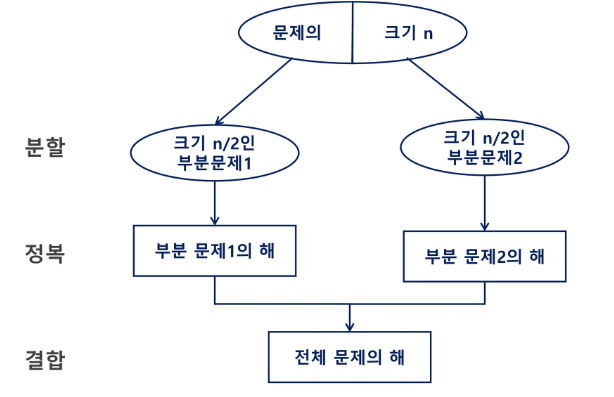
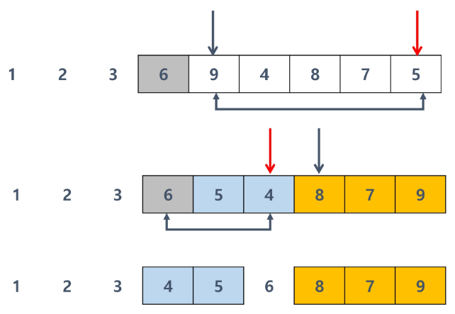

# 분할 정복

```python
n개의 동전들 중에 가짜 동전이 하나 포함돼 있다.
가짜 동전은 진짜 동전에 비해 살짝 가볍다.
동전들의 무게가 동일하다고 할 때 양팔 저울을 이용해서 가짜 동전을 찾아보자
양팔 저울 을 최소로 사용해서 가짜 동전을 찾는 방법은?

-> 반으로 나눠서 가벼운 쪽을 계속 쪼개가면 1개로 충분히 가능함
```

**문제를 분할해서 해결하는 기법(Divide and Conquer)**

- 1805년 12월 2일 아우스터리츠 전투에서 나폴레옹이 사용한 전략
- 우세한 연합군을 공격하기 위해, 나폴레옹은 연합군의 중앙부로 침범해 연합군을 **둘로 나눔**
- 둘로 나뉜 연합군을 **한 부분씩 격파**

**설계 전략**

- **분할 (Divide) :** 해결할 문제를 여러 개의 작은 부분으로 나눔
- **정복 (Conquer) :** 나눈 작은 문제를 각각 해결함
- **통합 (Combine) : (**필요하다면) 해결된 해답을 모음

**Top-down approach 예시**



**언제까지 분할?**

- 더 이상 나눌 수 없을 때 까지 or 더 이상 나눌 필요가 없을 때 까지

**분할 정복 기법 예시 : 거듭 제곱**

- 자연수 C의 n 제곱 값을 구하는 함수를 구현해 보자

1. **반복 (iterative) 알고리즘 : `O(n)`**


```python
def iterative_power(x, n):
		result = 1
		
		for _ in range(n):
				result *= x
				
		return result
		
print(iterative_power(3, 3))
# 27
```

1. 분할 정복 기반 알고리즘 : `O(log^2n)`


```python
def recursive_power(x, n):
		if n == 1: # 지수가 1이면 밑 리턴
				return x
		if n % 2 == 0:  # 지수가 짝수면
				y = recursive_power(x, n // 2)  # 밑의 (지수 // 2)승을 구한 후
				return y * y                    # 제곱
		else:           # 지수가 홀수면
				y = recursive_power(x, (n - 1) // 2)    # 밑의 ((지수 - 1) // 2)승을 구한 후
				return y * y * x                # 그 둘을 곱한 후 밑까지 곱함

print(recursive_power(5, 4))
# 625
```

**대표적인 분할 정복 알고리즘**

- **병합 정렬**
- **퀵 정렬**
- **이진 검색**

# 병합 정렬 (Merge Sort)

**여러 개의 정렬된 자료의 집합을 병합해, 한 개의 정렬된 집합으로 만드는 방식**

**특징**

- **외부 정렬(External Sort)의 기본이 되는 정렬 알고리즘**
- **멀티코어(Multi Core) CPU나 다수의 프로세서에서 정렬 알고리즘을 병렬화하기 위해
병합 정렬 알고리즘이 활용됨**

**활용**

- 자료를 최소 단위의 문제까지 나눈 후에, 차례대로 정렬해 최종 결과를 도출
- top-down 방식

**시간 복잡도**: **`O(n log n)`**

- 트리와 비슷한 구조라 속도가 비슷한 듯

## 병합 정렬 과정

**{69, 10, 30, 2, 16, 8, 31, 22}를 병합 정렬하는 과정**

1. **분할 단계:** 
    - 전체 자료 집합에 대하여, 최소 크기의 부분 집합이 될 때까지 분할 작업을 반복
    
    
    

1. **병합 단계:** 
    - 2개의 부분 집합을 정렬하면서 하나의 집합으로 병합
    - 8개의 부분 집합이 1개로 병합될 때까지 반복
    
    
    
- **나누면 자연스럽게 정렬되기에, 정복 과정이 없음**

## CODE

```python
def merge_sort(m):
    # 리스트의 길이가 1이면 이미 정렬된 상태이므로 그대로 반환
    if len(m) == 1:
        return m
    
    mid = len(m) // 2 # 리스트를 절반으로 나누기 위해 중간 인덱스를 계산
    left = m[:mid]  # 리스트의 앞쪽 절반
    right = m[mid:]  # 리스트의 뒤쪽 절반
    
    # 재귀적으로 왼쪽 부분과 오른쪽 부분을 정렬
    left = merge_sort(left)
    right = merge_sort(right)
    
    # 두 개의 정렬된 리스트를 병합하여 반환
    return merge(left, right)
    
def merge(left, right):
    # 두 리스트를 병합할 결과 리스트를 초기화
    result = [0] * (len(left) + len(right))
    
    # 두 리스트를 순차적으로 비교하여 작은 값을 결과 리스트에 추가
    l = r = 0  # 왼쪽 리스트와 오른쪽 리스트의 인덱스
    while l < len(left) and r < len(right):
        if left[l] < right[r]:      # left[l]이 더 작으면
            result[l + r] = left[l] # 결과 리스트의 적정한 위치에 left[l] 삽입
            l += 1
        else:                        # right[r]이 더 작으면
            result[l + r] = right[r] # 결과 리스트의 적정한 위치에 right[r] 삽입
            r += 1
            
    # 왼쪽 리스트에 남은 요소들을 결과 리스트에 추가
    while l < len(left):
        result[l + r] = left[l]
        l += 1
        
    # 오른쪽 리스트에 남은 요소들을 결과 리스트에 추가
    while r < len(right):
        result[l + r] = right[r]
        r += 1
        
    # 병합된 결과 리스트를 반환
    return result
    
########################################################################

arr = [69, 10, 30, 2, 16, 8, 31, 22]
arr = merge_sort(arr)
print(arr)
```

---

# 퀵 정렬 (Quick Sort)

**주어진 배열을 두 개로 분할하고 각각을 정렬한다.**

→ **병합 정렬과 동일?**

**다른 점**:

1. **병합 정렬은 그냥 두 부분으로 나누는 반면
퀵 정렬은 분할할 때, 기준 아이템(pivot item) 중심으로 분할함**
    - 기준보다 **작은 것은 왼쪽, 큰 것은 오른쪽**에 위치 시킴
2. **각 부분 정렬이 끝난 후, 병합 정렬은 ‘병합’ 후처리 작업이 필요하지만
퀵 정렬은 후처리 작업이 필요하지 않음**

**특징**

- **매우 큰 입력 데이터에 대해서 좋은 성능을 보이는 알고리즘**

**시간 복잡도 : `O(N log N)`**

- **Partitioning이라는 과정을 반복**하면서, **평균적으로 빠른 속도로 정렬**이 됨
- **평균의 경우: `O(N log N)`**
- **최악의 경우: `O(N^2)` :**
    - 왼쪽의 값을 pivot으로 삼아 오름차순 정렬을 하는데,
    배열이 내림차순으로 주어질 경우

## Partitioning

- **작업 1회:** pivot의 위치를 확정 지음

1. **작업 영역을 정함**
    
    
    

1. **작업 영역 중 가장 왼쪽에 있는 수를 Pivot으로 지정:**
    
    
    

1. **Pivot을 기준으로 왼쪽에는 Pivot보다 작은 수를, 오른쪽에는 큰 수를 배치**
    
    
    

- **Partitioning이 끝나면 pivot의 위치는 확정(fix)됨**
    
    → **즉 정렬이 다 끝났을 때에도, pivot의 위치는 지금 위치 그대로 배정됨**
    

**이후 과정**

- **Partitioning 2**
    1. **작업 영역 지정**
        
        
        

1. **Pivot 결정**
    
    
    

1. **Pivot을 기준으로 배치 변경**
    
    
    

1. **Partitioning이 끝났으니, Pivot의 위치는 확정**
    
    
    

- **Partitioning 3**
    1. **작업 영역 지정**
        
        
        

1. **Pivot 결정**
    
    


1. **Pivot을 기준으로 배치 변경**
    - 작업 영역에 혼자이므로, 왼쪽과 오른쪽에 배치할 값이 없음
    
    
    

1. **Partitioning이 끝났으니, Pivot의 위치는 확정**
    
    
    

- **Partitioning 4**
    1. **작업 영역 지정**
        
        
        
    
    1. **Partitioning이 끝났으니, Pivot의 위치는 확정**
        - 작업 영역에 혼자이므로, 해당 값이 Fix가 되고 바로 파티셔닝이 종료됨
        
        
        

- **Partitioning 5**
    1. **작업 영역 지정**
        
        
        

1. **Pivot 결정**
    
    
    

1. **Pivot을 기준으로 배치 변경**
    - 우측에는 Pivot보다 모두 큰 값이므로 변화가 없음
        
        
        

1. **Partitioning이 끝났으니, Pivot의 위치는 확정**
    
    
    

- **Partitioning 6**
    1. **작업 영역 지정**
    
    
    

1. **Pivot 결정**
    
    
    

1. **Pivot을 기준으로 배치 변경**
    - 배치를 바꾼 후 Partitioning이 끝났으니, Pivot의 위치는 fix됨
    
    
    

- Partitioning 7
    1. **작업 영역 지정**
        
        
        

1. **Partitioning이 끝났으니, Pivot의 위치는 확정**
    - 작업 영역에 혼자이므로, 해당 값이 Fix가 되고 바로 파티셔닝이 종료됨
        
        
        

**이런 방식으로 Partitioning을 반복해 Quick Sort가 진행됨**

## 리스트에서의 Partitioning

- 작업 영역을 0 ~ 6으로 정했을 때 예시
    
    
    

- Pivot의 위치를 왼쪽 첫 번째 값으로 결정
    
    
    

### Hoare_partition 알고리즘

```python
arr = [3, 2, 4, 6, 9, 1, 8, 7, 5]
# arr = [11, 45, 23, 81, 28, 34]
# arr = [11, 45, 22, 81, 23, 34, 99, 22, 17, 8]
# arr = [1, 1, 1, 1, 1, 0, 0, 0, 0, 0]

# 피벗: 제일 왼쪽 요소
# 이미 정렬된 배열이나 역순으로 정렬된 배열에서 최악의 성능을 보일 수 있음
def hoare_partition1(left, right):
    pivot = arr[left]  # 피벗을 제일 왼쪽 요소로 설정
    i = left + 1
    j = right

    while i <= j:
        while i <= j and arr[i] <= pivot:
            i += 1

        while i <= j and arr[j] >= pivot:
            j -= 1

        if i < j:
            arr[i], arr[j] = arr[j], arr[i]

    arr[left], arr[j] = arr[j], arr[left]
    return j

# 피벗: 제일 오른쪽 요소
# 이미 정렬된 배열이나 역순으로 정렬된 배열에서 최악의 성능을 보일 수 있음
def hoare_partition2(left, right):
    pivot = arr[right]  # 피벗을 제일 오른쪽 요소로 설정
    i = left
    j = right - 1

    while i <= j:
        while i <= j and arr[i] <= pivot:
            i += 1
        while i <= j and arr[j] >= pivot:
            j -= 1
        if i < j:
            arr[i], arr[j] = arr[j], arr[i]

    arr[i], arr[right] = arr[right], arr[i]
    return i

# 피벗: 중간 요소로 설정
# 일반적으로 더 균형 잡힌 분할이 가능하며, 퀵 정렬의 성능을 최적화할 수 있습니다.
def hoare_partition3(left, right):
    mid = (left + right) // 2
    pivot = arr[mid]  # 피벗을 중간 요소로 설정
    arr[left], arr[mid] = arr[mid], arr[left]  # 중간 요소를 왼쪽으로 이동 (필요 시)
    i = left + 1
    j = right

    while i <= j:
        while i <= j and arr[i] <= pivot:
            i += 1
        while i <= j and arr[j] >= pivot:
            j -= 1
        if i < j:
            arr[i], arr[j] = arr[j], arr[i]

    arr[left], arr[j] = arr[j], arr[left]
    return j

def quick_sort(left, right):
    if left < right:
        pivot = hoare_partition1(left, right)
        # pivot = hoare_partition2(left, right)
        # pivot = hoare_partition3(left, right)
        quick_sort(left, pivot - 1)
        quick_sort(pivot + 1, right)

quick_sort(0, len(arr) - 1)
print(arr)
```

**아이디어:**

- pivot보다 큰 값은 오른쪽, 작은 값은 왼쪽에 위치하도록 한다
    
    
    

- pivot을 두 집합의 가운데에 위치시킨다
    
    
    

**Pibot 선택**

- **왼쪽 끝**
    
    
    

- **오른쪽 끝**
    
    
    

- **임의의 세 개 값 중 중간 값**




### Lomuto_Partition 알고리즘

```python
arr = [3, 2, 4, 6, 9, 1, 8, 7, 5]

def lomuto_partition(left, right):
    pivot = arr[right]

    i = left - 1
    for j in range(left, right):
        if arr[j] <= pivot:
            i += 1
            arr[i], arr[j] = arr[j], arr[i]

    arr[i + 1], arr[right] = arr[right], arr[i + 1]
    return i + 1

def quick_sort(left, right):
    if left < right:
        pivot = lomuto_partition(left, right)
        quick_sort(left, pivot - 1)
        quick_sort(pivot + 1, right)

quick_sort(0, len(arr) - 1)
print(arr)

```


# 이진 검색

**자료의 가운데에 있는 항목의 키 값과 비교해, 
다음 검색의 위치를 결정하고 검색을 계속 진행하는 방법**

- 목적 키를 찾을 때 까지 이진 검색을 순환적으로 반복 수행해
검색 범위를 반으로 줄여가면서 보다 빠르게 검색을 수행

**이진 검색을 하기 위해서는 자료가 정렬된 상태여야 함!!!!**

**특징**

- **정렬된 데이터를 기준으로 특정 값이나 범위를 검색하는데 사용**
- **Lower Bound / Upper Bound (심화 학습 키워드)**
    - **정렬된 배열에서 특정 값 이상 (이하)가 처음으로 나타나는 위치를 찾는 알고리즘**
    - **특정 데이터의 범위 검색 등에서 활용**
    

## 검색 과정

1. **자료의 중앙에 있는 원소를 선택**
2. **중앙 원소의 값과 찾고자 하는 목표 값을 비교**
3. **목표 값이 중앙 원소의 값보다 작으면 자료의 왼쪽 반에 대해서 새로 검색을 수행하고,
크다면 자료의 오른쪽 반에 대해서 새로 검색을 수행**
4. **찾고자 하는 값을 찾을 때 까지 1 ~ 3의 과정을 반복**

**예시: 이진 검색으로 `7`을 찾는 경우**


**예시: 이진 검색으로 `20`을 찾는 경우**


## CODE

### 반복 구조

```python
arr = [2, 4, 7, 9, 11, 19, 23]
# 이진 탐색은 정렬된 데이터에 적용 가능하다.
# arr.sort()

def binary_search(target):
    low = 0
    high = len(arr) - 1
    # 탐색 횟수 카운팅
    cnt = 0

    while low <= high:
        mid = (low + high) // 2
        cnt += 1

        if arr[mid] == target:
            return mid, cnt
        elif arr[mid] > target:
            high = mid - 1
        else:
            low = mid + 1
    return -1, cnt

print(f'9 = {binary_search(9)}')
print(f'2 = {binary_search(2)}')
print(f'20 = {binary_search(20)}')
```

### 재귀 구조

```python
arr = [2, 4, 7, 9, 11, 19, 23]
# 이진 탐색은 정렬된 데이터에 적용 가능하다.
# arr.sort()

def binary_search(low, high, target):
    # 기저조건
    # target 을 발견하지 못하면 종료
    if low > high:
        return -1

    mid = (low + high) // 2

    # 발견했다면
    if target == arr[mid]:
        return mid

    # target 이 mid 보다 작다 == target 이 mid 의 왼쪽에 존재한다 == high 를 mid - 1로
    elif target < arr[mid]:
        return binary_search(low, mid - 1, target)
    else:
        return binary_search(mid + 1, high, target)

print(f'9 = {binary_search(0, len(arr) - 1, 9)}')
print(f'2 = {binary_search(0, len(arr) - 1, 2)}')
print(f'20 = {binary_search(0, len(arr) - 1, 20)}')
```

# 정리:

## 병합 정렬

- **외부 정렬(External Sort)의 기본이 되는 정렬 알고리즘**
- **멀티코어(Multi Core) CPU나 다수의 프로세서에서 정렬 알고리즘을 병렬화하기 위해
병합 정렬 알고리즘이 활용됨**

## 퀵 정렬

- **매우 큰 입력 데이터에 대해서 좋은 성능을 보이는 알고리즘**

## 이진 검색

- **정렬된 데이터를 기준으로 특정 값이나 범위를 검색하는데 사용**
- **Lower Bound / Upper Bound (심화 학습 키워드)**
    - **정렬된 배열에서 특정 값 이상 (이하)가 처음으로 나타나는 위치를 찾는 알고리즘**
    - **특정 데이터의 범위 검색 등에서 활용**