# 그래프

- 그래프는 아이템 (사물 또는 추상적 개념)들과 이들 사이의 연결 관계를 표현
- 그래프는 정점(Vertex)들의 집합과 이들을 연결하는 간선(Edge)들의 집합으로 구성된 자료 구조
    - `|V|` : 정점의 개수, `|E|` : 그래프에 포함된 간선의 개수
    - `|V|`개의 정점을 가지는 그래프는 최대 `|V| (|V| - 1) / 2` 간선이 가능
        - 5개의 정점이 있는 그래프의 최대 간선 수는 `10 (= 5 * 4 / 2)` 개
- 선형 자료구조나 트리 자료구조로 표현하기 어려운 `N : N` 관계를 가지는 원소들을 
표현하기에 용이

## 유형:

- **무향 그래프 (Undirected Graph)**

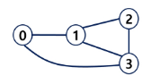

- **유향 그래프 (Directed Graph)**

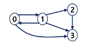

- **가중치 그래프 (Weighted Graph)**

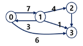

- **사이클 없는 방향 그래프 (DAG, Directed Acyclic Graph)**

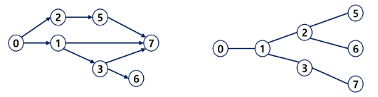

- **완전 그래프**
    - 정점들에 대해 가능한 모든 간선들을 가진 그래프
    

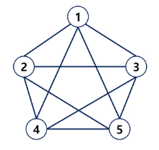

- **부분 그래프**
    - 원래 그래프에서 일부의 정점이나 간선을 제외한 그래프

## 인접 정점

**인접 (Adjacency)**

- **두 개의 정점에 간선이 존재(연결됨)하면 서로 인접해 있다고 함**
- **완전 그래프에 속한 임의의 두 정점들은 모두 인접해 있음**

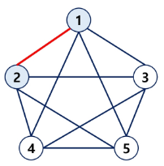

## 경로

- **경로란 간선들을 순서대로 나열한 것**
    - 간선들: `(0, 2)` , `(2, 4)` , `(4, 6)`
    - 정점들: `0 - 2 - 4 - 6`
- **한 정점을 최대한 한 번만 지나는 경로를 단순 경로라고 함**
    - `0 - 2 - 4 - 6` , `0 - 1 - 6`
- **시작한 정점에서 끝나는 경로를 사이클(Cycle)이라고 함**
    - `1 - 3 - 5 - 1`

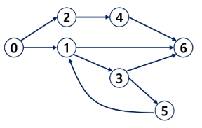

## 표현

- **간선의 정보를 저장하는 방식, 메모리나 성능을 고려해서 결정**

- **인접 행렬 (Adjacent matrix)**
    - `|V| * |V|` 크기의 2차원 배열을 이용해서 간선 정보를 저장
    - 배열의 배열 (포인터 배열)
    
- **인접 리스트 (Adjacent List)**
    - 각 정점마다 해당 정점으로 나가는 간선의 정보를 저장
    
- **간선의 배열**
    - 간선(시작 정점, 끝 정점)을 배열에 연속적으로 저장

### 인접 행렬

**두 정점을 연결하는 간선의 유무를 행렬로 표현**

- **`|V| * |V|` 정방 행렬**
- **행 번호와 열 번호는 그래프의 정점에 대응**
- **두 정점이 인접되어 있으면 `1`, 그렇지 않으면 `0`으로 표현**
- **무향 그래프**
    - i번째 행의 합 = i번째 열의 합 = Vi의 차수
- **유향 그래프**
    - 행 i의 합 = Vi의 진출 차수
    - 열 i의 합 = Vi의 진입 차수

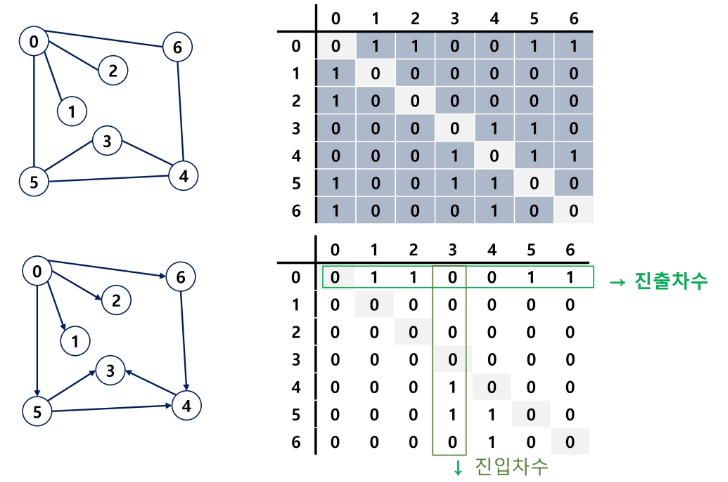

**장점: 연결 여부를 한 번에 탐색할 수 있음, 직관적임**

**단점: 메모리 낭비가 심함**

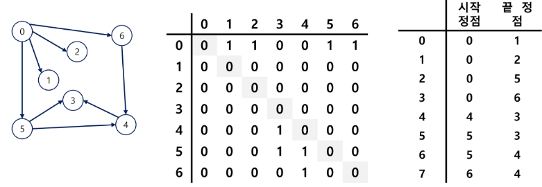

### 인접 리스트

- **각 정점에 대한 인접 정점들을 순차적으로 표현**
- **하나의 정점에 대한 인접 정점들을 각각 노드로 하는 연결 리스트로 저장**
    
    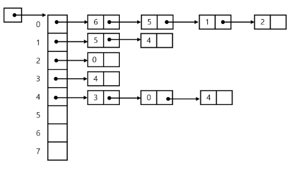
    

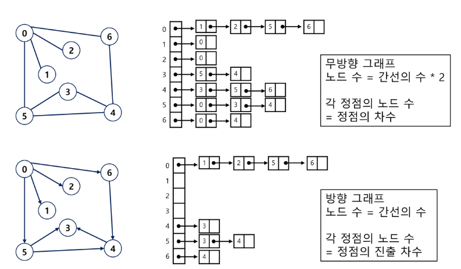

→ 무방향일 때 간선의 수가 2배가 아님, 2배라고 생각해야 한다는 뜻

**장점: 메모리 활용이 효율적**

**단점: 연결 정보 확인이 어려움**

### 정리:

**실제 개발에서는 위 두가지 방법을 선호하지 않음.**

**클래스를 이용한 연결 리스트를 구현해서 사용함**

**실제 개발에서는 추가적인 자료 삽입 및 삭제가 빈번하게 이루어지기 때문 (리스트는 비효율적)**

**다만 코딩 테스트에서는 구현하기 쉽지 않기 때문에, 인접 리스트를 잘 활용하자**

# 그래프 순회 (탐색)

**그래프 순회는 비선형 구조인 그래프로 표현된 모든 자료 (정점)을 빠짐 없이 탐색하는 것을 의미**

(완전 탐색)

- **DFS (깊이 우선 탐색 : Depth First Search)**
- **BFS (너비 우선 탐색 : Breadth First Search)**

## DFS (깊이 우선 탐색)

- **시작 정점의 한 방향으로 갈 수 있는 경로가 있는 곳까지 깊이 탐색해 가다가
더 이상 갈 곳이 없게 되면, 가장 마지막에 만났던 갈림길 간선이 있는 정점으로 되돌아와서
다른 방향의 정점으로 탐색으로 계속 반복하여 결국 모든 정점을 방문하는 순회 방법**
- **가장 마지막에 만났던 갈림길의 정점으로 되돌아가서 다시 깊이 우선 탐색을 반복해야 하므로
후입선출 구조의 STACK 사용**

## BFS (너비 우선 탐색)

- **너비 우선 탐색은 탐색 시작점의 인접한 정점들을 먼저 모두 차례로 방문한 후에,
방문했던 정점을 시작점으로 하여 다시 인접한 정점들을 차례로 방문하는 방식**
- **인접한 정점들에 대해 탐색을 한 후, 차례로 다시 너비 우선 탐색을 진행해야 하므로
선입선출 형태의 자료 구조인 QUEUE를 사용**

### DFS와 BFS

1. **둘 다 되는 문제가 더 많다**
    - `~ 로 갈 수 있는지 구하여라`
        
        → 효율 차이가 크게 나지 않음 (어차피 완전 탐색이니)
        
2. **끝까지 쭉 가는가 vs 퍼져나가는가**
    1. **BFS로만 풀 수 있는 유형:**
        - 지하철 노선도 (퍼져 나가는 유형 - 최소 횟수)

## Union-Find (Disjoint set)

**서로소 집합 (Disjoint-sets) : `서로소 : 공약수가 1밖에 없음`**

- **서로소 또는 상호배타 집합들은 서로 중복 포함된 원소가 없는 집합들임.
다시 말해 교집합이 없음**
- **집합에 속한 하나의 특정 멤버를 통해 각 집합들을 구분
이를 대표자 (Representative)라 함**

### 상호 배타 집합 연산:

- **Make_set(x) : 유일한 멤버 x를 포함하는 새로운 집합을 생성하는 연산**
    
    ```
    Make_set(x):
        P[x] <- x  
    ```
    
- **Find_set(x) : x를 포함하는 집합을 찾는 연산**
    
    ```
    Find_set(x):
        if x == p[x]:
    	      return x
    	  else:
    	      return Find_set(p[x])
    ```
    
    ```
    # 반복
    Find_set(x):
        while x != p[x]:
            x = p[x]
        return x
    ```
    
- **Union(x, y) : x와 y를 포함하는 두 집합을 통합하는 연산**
    
    ```
    Union(x, y):
        p[Find_set(y)] <- Find_set(x)
    ```
    

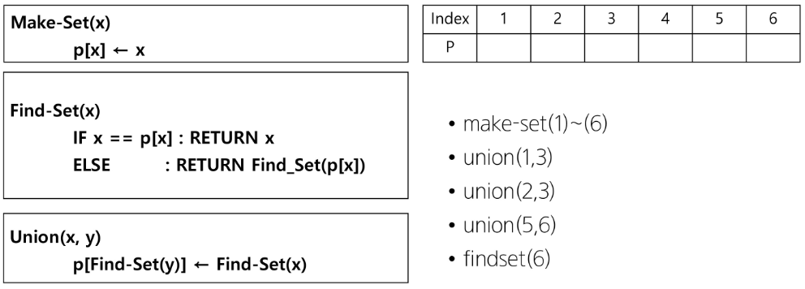

### CODE

```python
def make_set(n):
    p = [i for i in range(n)]  # 각 원소의 부모를 자신으로 초기화
    return p

def find(x):
    if parents[x] == x:
        return x

		# x의 부모가 가리키고 있는 정점부터 다시 대표자를 탐색 (재귀)
    return find(parents[x])

def union(x, y):
    root_x = find(x)
    root_y = find(y) 

    if root_x == root_y:  # 이미 같은 집합이면 끝
        return

    # 다른 집합이라면 더 작은 루트노트에 합친다.
    # 문제에 따라 다름.
    if root_x < root_y: 
        parents[y] = root_x # y가 바라보는 부모는 x의 대표자
    else:
        parents[x] = root_y

# 예제 사용법
n = 7  # 원소의 개수
parents = make_set(n)

union(1, 3)
union(2, 3)
union(5, 6)

print(parents) # 대표자의 수 == 집합의 수

print('find_set(6) = ', find(6))

target_x = 2
target_y = 3

# 원소 1과 원소 2가 같은 집합에 속해 있는지 확인
if find(target_x) == find(target_y):
    print(f"원소 {target_x}과 원소 {target_y}는 같은 집합에 속해 있습니다.")
else:
    print(f"원소 {target_x}과 원소 {target_y}는 다른 집합에 속해 있습니다.")

```

- **상호 배타 집합 예**
    
    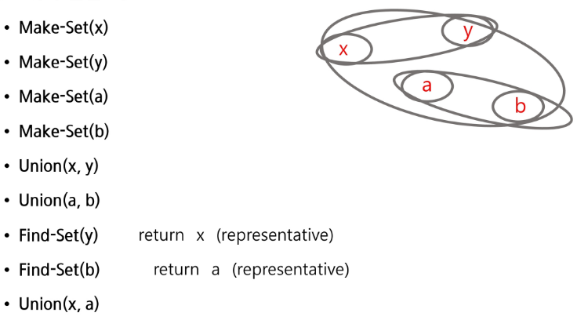
    

### 상호 배타 집합의 표현

**연결 리스트**

- **같은 집합의 원소들은 하나의 연결 리스트로 관리**
- **연결 리스트는 맨 앞의 원소를 집합의 대표 원소로 삼음**
- **각 원소는 집합의 대표 원소를 가리키는 링크를 가짐**
    
    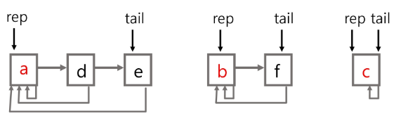
    
- **연결 리스트 연산 예**
    
    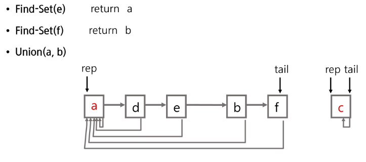
    

**트리** 

- **하나의 집합(a disjoint set)을 하나의 트리로 표현**
- **자식 노드가 부모 노드를 가리키며 루트 노드가 대표자가 됨**
    
    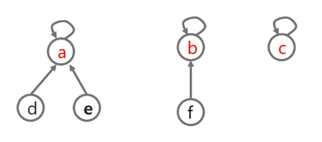
    

- **트리 연산 예**
    
    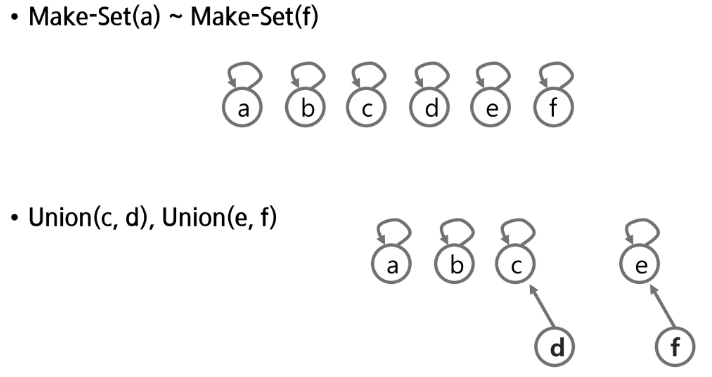
    
    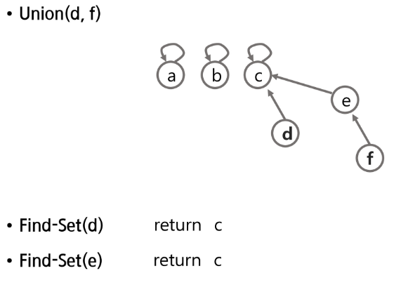
    

- **상호배타 집합을 표현한 트리의 배열을 이용해 저장된 모습**
    
    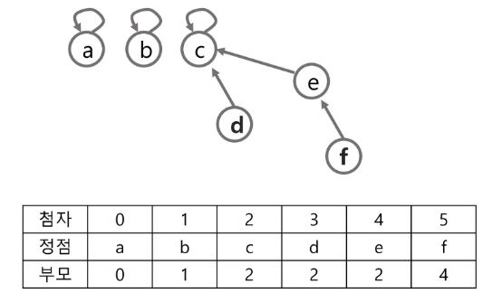
    

### 문제점

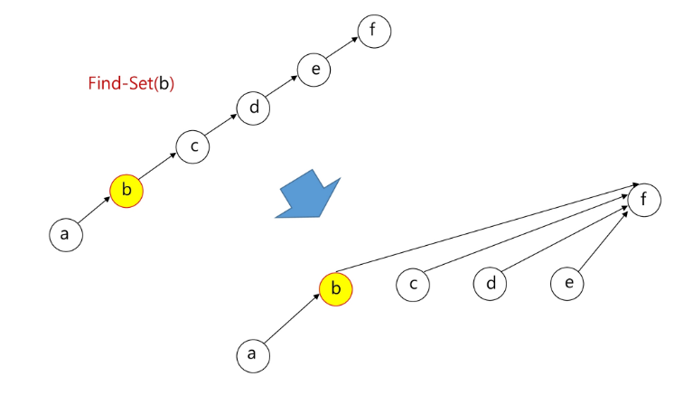

- **한 번에 가도 될 걸 다 거쳐서 가다 보니: 느림 (비효율적)**

**연산의 효율을 높이는 방법**

- **Rank를 이용한 Union (크기가 작은 것을 큰 곳으로)**
    - **각 노드는 자신을 루트로 하는 subtree의 높이를 랭크 Rank라는 이름으로 저장**
    - **두 집합을 합칠 때 Rank가 낮은 집합을 Rank가 높은 집합에 붙임**
    
    - **Rank를 이용한 Union의 예**
    
    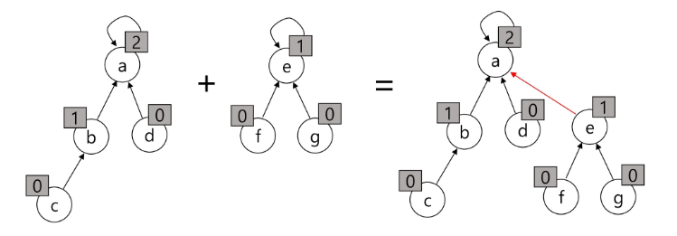
    
    - **랭크를 이용한 Union에서 랭크가 증가하는 예**
    
    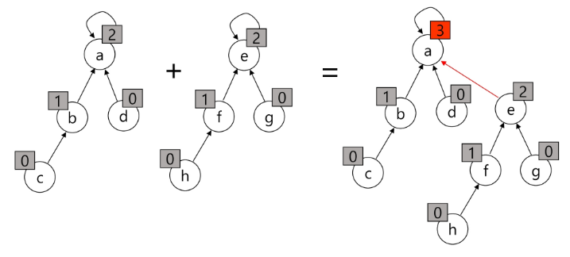
    

```python
def make_set(n):
    p = [i for i in range(n)]  # 각 원소의 부모를 자신으로 초기화
    r = [0] * n
    return p, r

def find(x):
    # 원소의 부모가 자기자신이다 == 자기가 그 그룹의 대표자
    if parents[x] == x:
        return x

    # 경로 압축 (path compression)을 통해 부모를 루트로 설정
    parents[x] = find(parents[x])
    return parents[x]

def union(x, y):
    root_x = find(x)
    root_y = find(y)

    if root_x == root_y:  # 이미 같은 집합이면 끝
        return

    # # rank를 비교하여 더 작은 트리를 큰 트리 밑에 병합
    if ranks[root_x] > ranks[root_y]:
        parents[root_y] = root_x
    elif ranks[root_x] < ranks[root_y]:
        parents[root_x] = root_y
    else:
        # rank가 같으면 한쪽을 다른 쪽 아래로 병합하고 rank를 증가시킴
        parents[root_y] = root_x
        ranks[root_x] += 1

# 예제 사용법
n = 7  # 원소의 개수
parents, ranks = make_set(n)

union(1, 3)
union(2, 3)
union(5, 6)

print('find_set(6) = ', find(6))

target_x = 2
target_y = 3

# 원소 1과 원소 2가 같은 집합에 속해 있는지 확인
if find(target_x) == find(target_y):
    print(f"원소 {target_x}과 원소 {target_y}는 같은 집합에 속해 있습니다.")
else:
    print(f"원소 {target_x}과 원소 {target_y}는 다른 집합에 속해 있습니다.")

```

- **Path compression**
    - **Find-Set을 행하는 과정에서 만나는 모든 노드들이 직접 root를 가리키도록 포인터를 바꿈**
    
    - **Path Compression의 예**

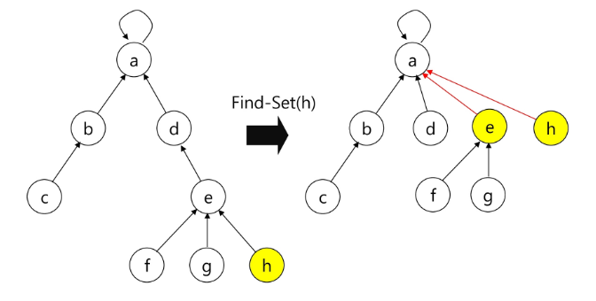

- **Make_set(x) : 유일한 멤버 x를 포함하는 새로운 집합을 생성하는 연산**
    
    ```
    p[x] : 노드 x의 부모 저장
    rank[x] : 루트 노드가 x인 트리의 랭크 값 저장
    
    Make_set(x):
        P[x] <- x  
        rank[x] <- 0
    ```
    
- **Find_set(x) : x를 포함하는 집합을 찾는 연산**
    
    ```
    Find_set(x):
        if x != p[x]:      # x가 루트가 아닌 경우
    	      p[x] <- Find_set(p[x])
    	  return p[x]
    ```
    
    - Find_set 연산은 특정 노드에서 루트까지의 경로를 찾아 가면서 노드의 부모 정보를 갱신
- **Union(x, y) : x와 y를 포함하는 두 집합을 통합하는 연산**
    
    ```
    Union(x, y):
        Link(Find_set(x), Find_set(y))
        
    Link(x, y):
        if rank[x] > rank[y]:    # rank는 트리의 높이
            p[y] <- x
        else:
            p[x] <- y
            if rank[x] == rank[y]:
                rank[y]++
    ```
    

```python
def make_set(n):
    p = [i for i in range(n)]  # 각 원소의 부모를 자신으로 초기화
    r = [0] * n
    return p, r

def find(x):
    # 원소의 부모가 자기자신이다 == 자기가 그 그룹의 대표자
    if parents[x] == x:
        return x

    **# 경로 압축 (path compression)을 통해 부모를 루트로 설정
    parents[x] = find(parents[x])
    return parents[x]**

def union(x, y):
    root_x = find(x)
    root_y = find(y)

    if root_x == root_y:  # 이미 같은 집합이면 끝
        return
        
		# 랭크는 한 쪽이 더 크거나 작은 경우 변동이 발생하지 않
    # # rank를 비교하여 더 작은 트리를 큰 트리 밑에 병합
    if ranks[root_x] > ranks[root_y]:
        parents[root_y] = root_x
    elif ranks[root_x] < ranks[root_y]:
        parents[root_x] = root_y
    else:
        # rank가 같으면 한쪽을 다른 쪽 아래로 병합하고 rank를 증가시킴
        parents[root_y] = root_x
        ranks[root_x] += 1

# 예제 사용법
n = 7  # 원소의 개수
parents, ranks = make_set(n)

union(1, 3)
union(2, 3)
union(5, 6)

print('find_set(6) = ', find(6))

target_x = 2
target_y = 3

# 원소 1과 원소 2가 같은 집합에 속해 있는지 확인
if find(target_x) == find(target_y):
    print(f"원소 {target_x}과 원소 {target_y}는 같은 집합에 속해 있습니다.")
else:
    print(f"원소 {target_x}과 원소 {target_y}는 다른 집합에 속해 있습니다.")

```

# 최소 비용 신장 트리 (MST)

- **그래프에서 최소 비용 문제**
    - 모든 정점을 연결하는 간선들의 가중치의 합이 최소가 되는 트리
    - 두 정점 사이의 최소 비용의 경로 찾기

- **신장 트리**
    - n개의 정점으로 이루어진 무방향 그래프에서 n개의 정점과 n-1개의 간선으로 이루어진 트리
        - 전체 그래프에서 신장 트리는 반드시 하나이다?  : **NO**
        
        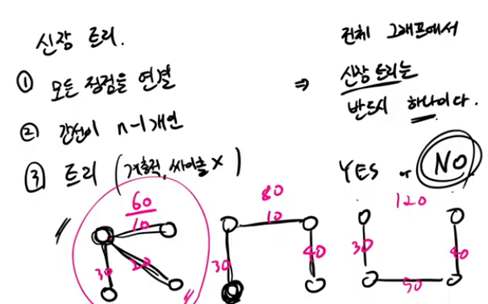
        

- **최소 신장 트리 (Minimum Spanning Tree)**
    - 무방향 가중치 그래프에서 신장 트리를 구성하는 간선들의 가중치의 합이 최소인 신장 트리
        
        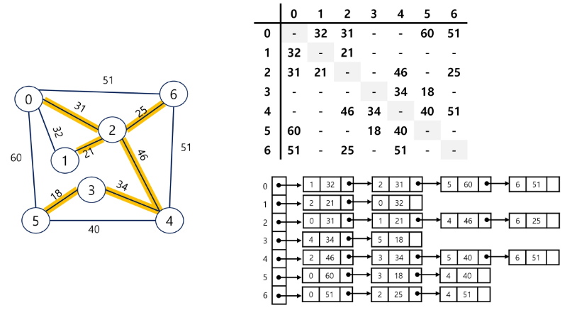
        
        - 가중치를 표현
        
        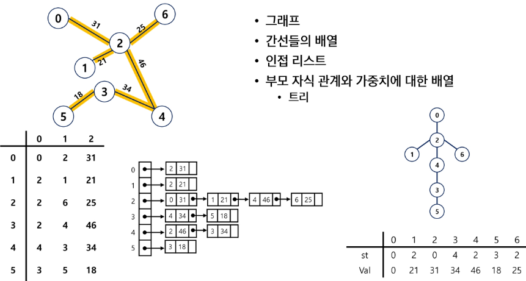
        
    

## MST 구현법

- **2가지 방법이 있음 (Prim / Kruskal)**
    - **공통점: 그리디 방식으로 접근 (작은 것부터 선택)**
    - **차이점:**
        - **Prim 알고리즘 :** **정점을 기준**으로 생각
        - **Kruskal 알고리즘** : **간선을 기준**으로 생각
        

## 1. Prim 알고리즘

- **하나의 정점에서 연결된 간선들 중에 하나씩 선택하면서 MST를 만들어 가는 방식**
    1. 임의 정점을 하나 선택해서 시작
    2. 선택한 정점과 인접하는 정점들 중에 최소 비용의 간선이 존재하는 정점을 선택 
    (BFS + 최소 비용)
    3. 모든 정점이 선택될 때까지 1번 2번 과정을 반복

- **서로소인 2개의 집합 (2 disjoint-sets) 정보를 유지**
    - 트리 정점들(tree vertices) - MST를 만들기 위해 선택된 정점들
    - 비트리 정점들 (nontree vertices) - 선택되지 않은 정점들

### **알고리즘 적용**

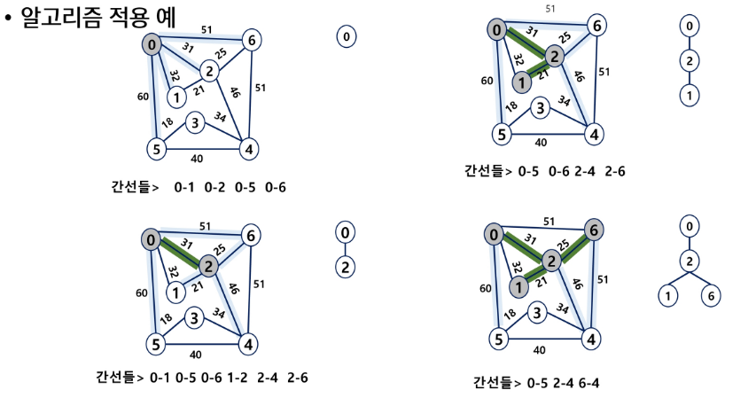

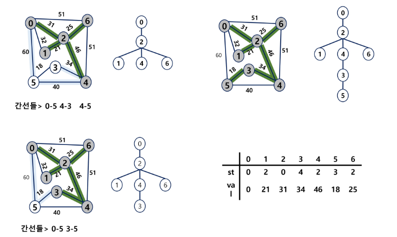

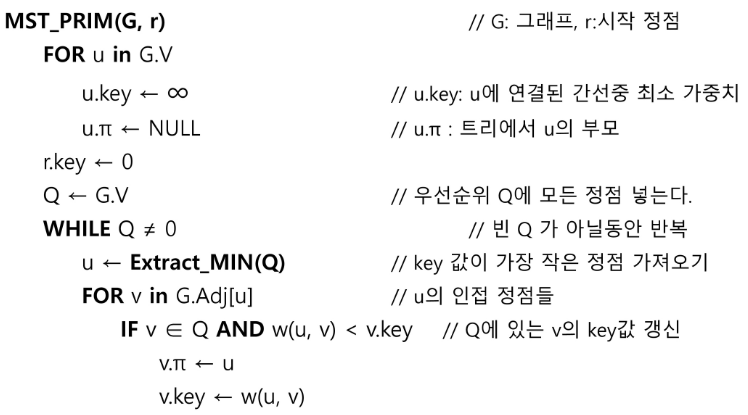

- BFS, Queue 활용
- 가장 가중치가 적은 것을 먼저 꺼내고 싶다:
    - sort : 매 번 O(N log N)
    - 최소 heapq :  (삽입 : O(log N), 삭제 : O(log N))

### CODE

```python
'''
7 11
0 1 32
0 2 31
0 5 60
0 6 51
1 2 21
2 4 46
2 6 25
3 4 34
3 5 18
4 5 40
4 6 51
'''
from heapq import heappush, heappop

def prim(start):
    heap = list()
    MST = [0] * (V)    # visited와 똑같은 것

    # 최소 비용 합계
    sum_weight = 0

    # 힙에서 관리해야 할 데이터
    # 가중치, 정점 정보
    heappush(heap, (0, start)) # 시작점은 가중치가 0이다

    while heap:
        weight, v = heappop(heap) # 현재 시점에서 가중치가 가장 작은 정점이 top
        
        # 이미 방문한 지점이면 통과
        if MST[v]:
            continue

        # 방문 처리
        MST[v] = 1
        # 누적합 추가
        sum_weight += weight

        # 갈수 있는 노드를 보면서
        for next in range(V):
            # 갈 수 없는 지점이면 continue
            if graph[v][next] == 0:
                continue

            # 이미 방문한 지점이면 continue
            if MST[next]:
                continue
						
						# 이제 갈 수 있는 것만 남았음: heap에 추가
            heappush(heap, (graph[v][next], next))

    return sum_weight

###########################################################################

V, E = map(int, input().split())
graph = [[0] * (V) for _ in range(V)] # 인접 행렬로 구현 (인접 리스트로 해도 됨)
for _ in range(E):
    u, v, w = map(int, input().split())
    graph[u][v] = w
    graph[v][u] = w  # 가중치가 있는 무방향 그래프

result = prim(0)
print(f'최소 비용 = {result}')

```

## 2. Kruskal 알고리즘

- 간선을 하나씩 선택해서 MST를 찾는 알고리즘
    1. 최초, 모든 간선을 가중치에 따라 오름차순을 ㅗ정렬
    2. 가중치가 가장 낮은 간선부터 선택하면서 트리를 증가시킴
        - 사이클이 존재하면 다음으로 가중치가 낮은 간선 선택
    3. n - 1개의 간선이 선택될 때 까지 2를 반복

- visited를 사용하지 않음.
- parents (union find)를 사용

### 알고리즘 적용

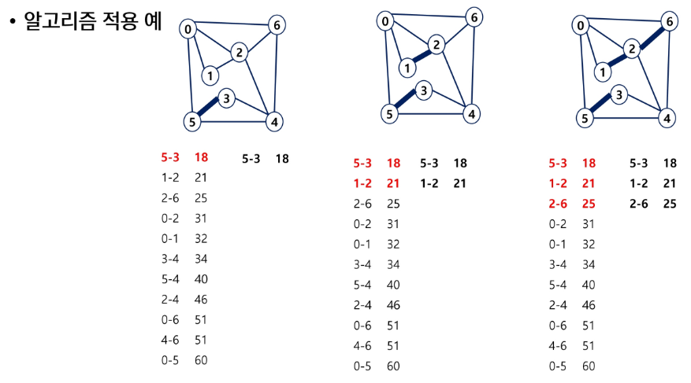

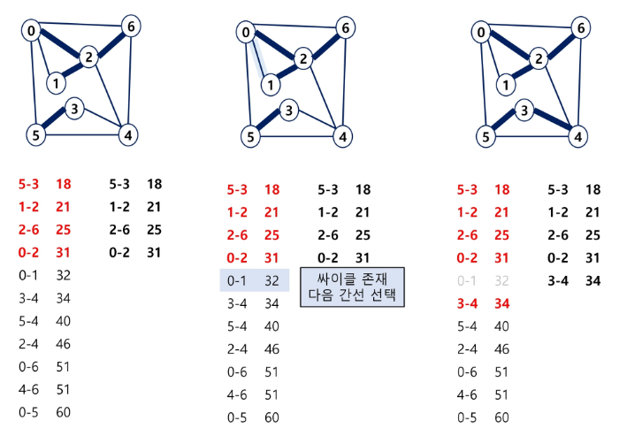

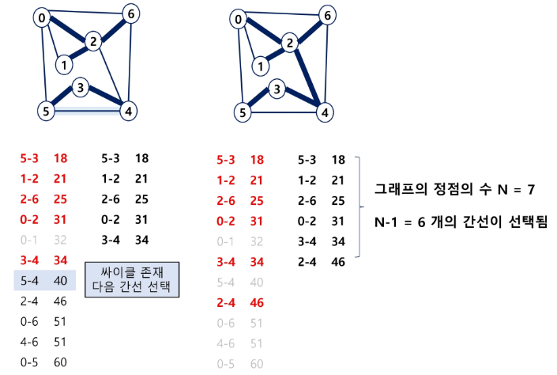

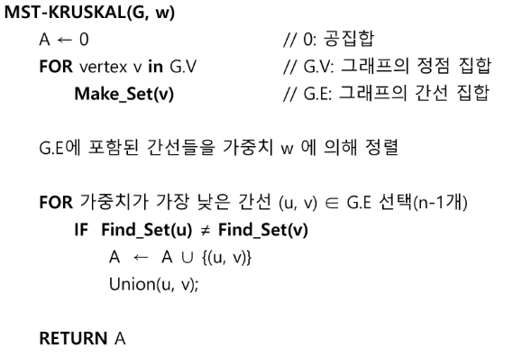

- **간선을 오름차순 정렬**
- **작은 간선부터 방문: Cycle 발생하면 통과**

### CODE

```python
'''
7 11
0 1 32
0 2 31
0 5 60
0 6 51
1 2 21
2 4 46
2 6 25
3 4 34
3 5 18
4 5 40
4 6 51
'''
def find_set(x):
    if parents[x] == x:
        return x

    parents[x] = find_set(parents[x])
    return parents[x]

def union(x, y):
    root_x = find_set(x)
    root_y = find_set(y)

    if root_x == root_y:
        return

    # 더 작은 루트노트에 합친가
    if root_x < root_y:
        parents[root_y] = root_x
    else:
        parents[root_x] = root_y
        
###############################################################################  
        
V, E = map(int, input().split())    # V 마지막 정점, 0~V번 정점. 개수 (V+1)개
edge = []
for _ in range(E):
    u, v, w = map(int, input().split()) # 출발, 도착, 가중치 
    edge.append([u, v, w])              # 간선 정보 모두 묶어서 저장
edge.sort(key=lambda x : x[2])          # 가중치 기준으로 오름차순 정렬
parents = [i for i in range(V)]         # 대표원소 배열

# MST의 간선수 N = 정점 수 - 1
cnt = 0     # 선택한 edge의 수 (사용 이후: N - 1가 되면 신장트리 완성) - 시간 효율을 위해
total = 0   # MST 가중치의 합
print(edge)

for u, v, w in edge:
    # 다른 집합이라면
    if find_set(u) != find_set(v):   # 싸이클이 없다면
		    print(u, v, w)               # 선택한 순서대로 출력
        cnt += 1
        union(u, v)
        total += w
        if cnt == V:  # MST 구성이 끝나면
            break
print(f'최소 비용 = {total}')

```

## 3. 최단 경로

**최단 경로 정의:**

**간선의 가중치가 있는 그래프에서 두 정점 사이의 경로들 중에 간선의 가중치의 합이 최소인 경로**

- **하나의 시작 정점에서 끝 정점까지의 최단 경로**
    - **다익스트라 알고리즘 (dijkstra)**
        - 음의 가중치를 허용하지 않음
    - **벨만-포드 알고리즘 (Bellman-Ford)**
        - 음의 가중치 허용
- **모든 정점들에 대한 최단 경로**
    - **플로이드-워샬 알고리즘 (Floyd-Warshall)**

### Dijkstra 알고리즘

- **시작 정점에서 거리가 최소인 정점을 선택해 나가면서 최단 경로를 구하는 방식**

- **시작 정점(s)에서 끝 정점(t) 까지의 최단 경로에 정점 x가 존재**
- **이 때 , 최단 경로는 s에서 x까지의 최단 경로와, x에서 t까지의 최단 경로로 구성됨**

- **탐욕 기법을 사용한 알고리즘으로 MST의 프림 알고리즘과 유사**

**알고리즘 예**

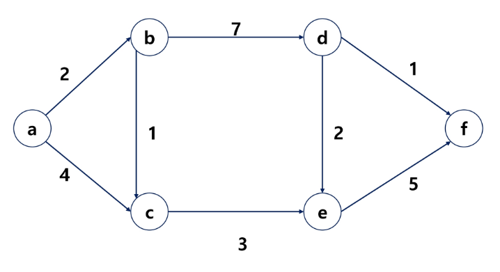

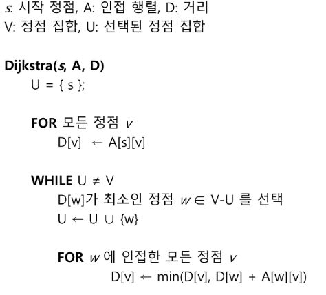

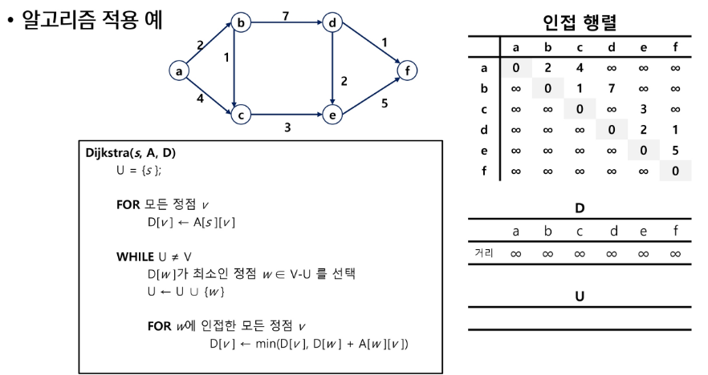

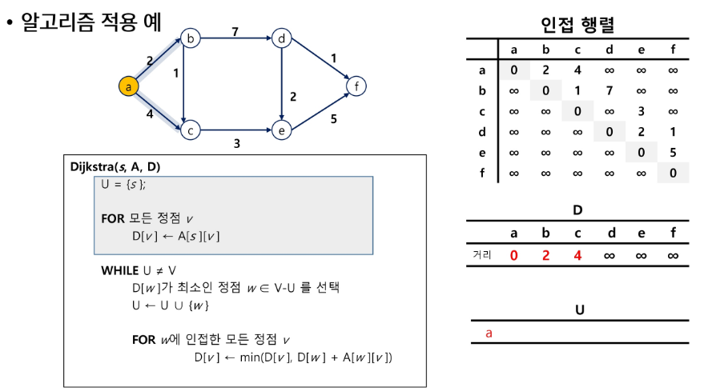

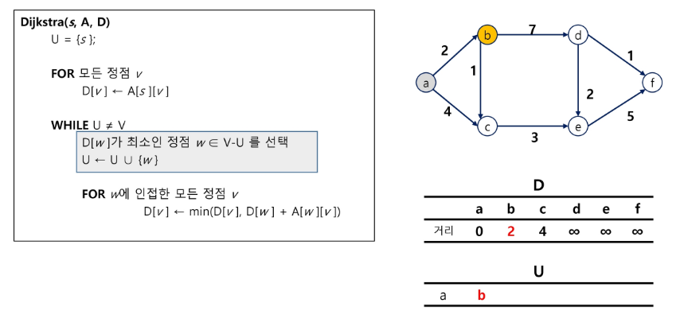

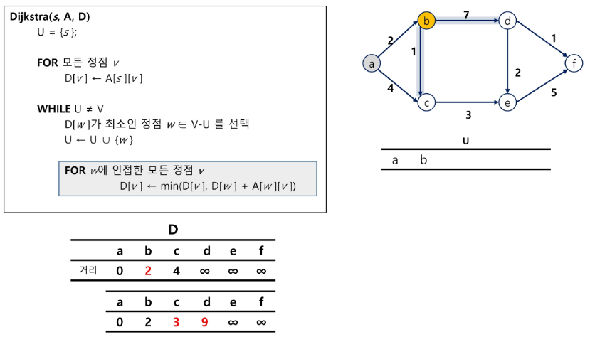

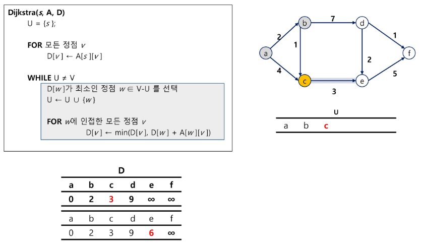

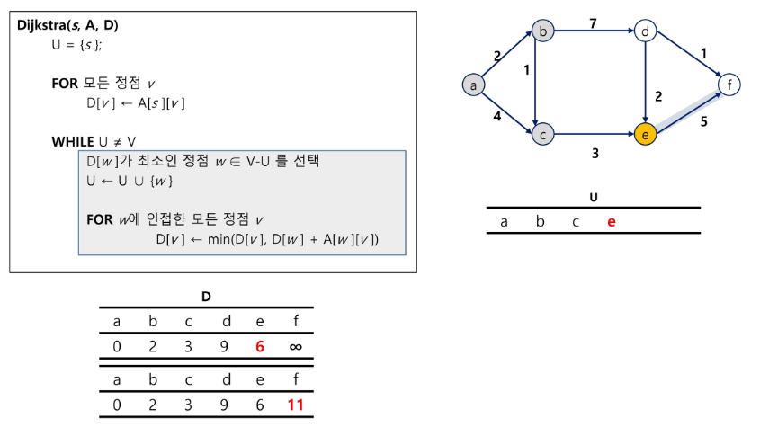

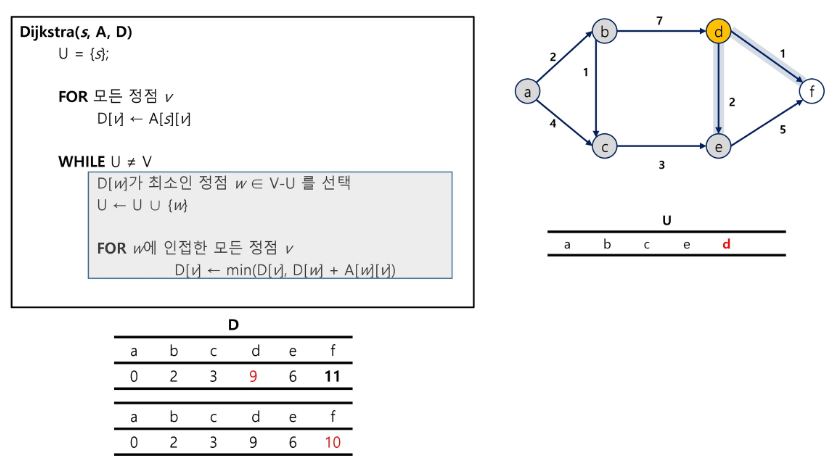

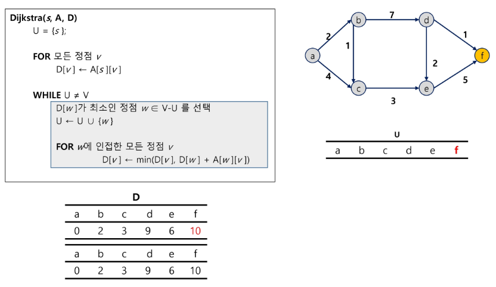

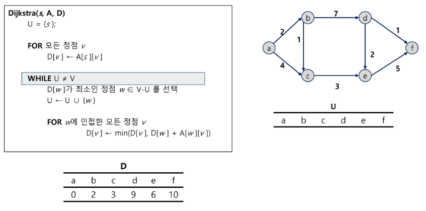

### CODE

```python
'''
6 8
0 1 2
0 2 4
1 2 1
1 3 7
2 4 3
3 4 2
3 5 1
4 5 5
'''
import heapq

def dijkstra(start):
    pq = []
    # 시작 노드 최단 거리는 0
    # heapq 에 리스트로 저장할 때는 맨 앞의 데이터를 기준으로 정렬된다.
    heapq.heappush(pq, (0, start))
    distance[start] = 0  # 시작 노드 최단 거리는 0

    # 우선순위 큐가 빌 때 까지 반복
    while pq:
        # 가장 최단 거리인 노드에 대한 정보 꺼내기
        dist, now = heapq.heappop(pq)
        # 현재 노드가 이미 처리됐다면 skip
        # 예제 그림: c 위치 가중치 3, 4로 도착 가능 [참고]
        if distance[now] < dist:
            continue

        # 현재 노드와 연결된 다른 인접한 노드 확인
        for next in graph[now]:
            next_node = next[0]
            cost = next[1]      # 다음 노드의 가중치

            new_cost = dist + cost    # 누적 값 (현재까지의 누적 값 + 다음 노드 가중치)

            # 다음 노드를 가는 데 더 많은 비용이 드는 경우
            if new_cost >= distance[next_node]:
                continue

            distance[next_node] = new_cost # next_node까지 가는데 비용은 new_cost
            heapq.heappush(pq, (new_cost, next_node))

#########################################################################

INF = int(1e9)  # 무한을 의미하는 값으로 10억

# 노드의 개수, 간선의 개수를 입력받기
n, m = map(int, input().split())
# 시작 노드 번호
start = 0
# 인접리스트 만들기
graph = [[] for i in range(n)]
# 누적거리를 저장할 테이블 - INF 로 저장
distance = [INF] * n

# 간선 정보를 입력
for _ in range(m):
    a, b, w = map(int, input().split())
    graph[a].append([b, w])

# 다익스트라 알고리즘 실행
dijkstra(start)

# 모든 노드로 가기 위한 최단 거리 출력
for i in range(n):
    # 도달할 수 없는 경우, 무한 출력
    if distance[i] == INF:
        print("INF", end=' ')
    else:
        print(distance[i], end=' ')

```