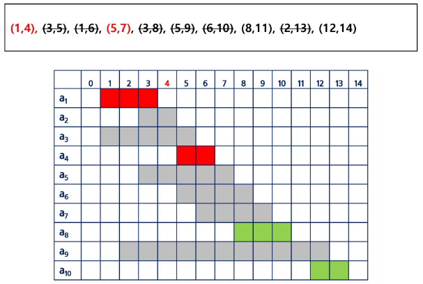

# 반복과 재귀

- **반복과 재귀는 유사한 작업을 수행할 수 있다.**
- **반복은 수행하는 작업이 완료될 때까지 계속 반복**
    - 루프 (for, while 구조)
    - 반복문은 코드를 n번 반복 시킬 수 있다
- **재귀는 주어진 문제의 해를 구하기 위해 동일하면서 더 작은 문제의 해를 이용하는 방법**
    - 하나의 큰 문제를 해결하기 쉬운 더 작은 문제로 쪼개고, 결과를 결합한다
    - 재귀 호출은 n 중 반복문을 만들어낼 수 있다.

```python
# 1 1 ~ 3 3까지 출력하는 프로그램을 작성하시오

for i in range(1, 4):
    for j in range(1, 4):
        print(i, j)
        
# 만약 1 1 1 1 ~ 3 3 3 3이라면?
	# 4중 for문을 쓰면 될 것
	
# 만약 더 길어져서 9줄 혹은 그 이상이라면?
# 입력받은 N에 따라서 길이가 달라지는 경우라면?
```

**반복문으로는 n번 반복을 구현할 수 있고,
재귀호출로 n 중 for문을 구현할 수 있음.**

- N 입력 후 1 1 1 ~ 3 3 3 출력하는 문제는 for문으로 구현이 어려움
- 이런 경우 재귀 호출로 구현할 수 있음

```python
path = []
N = 3

def run(lev):
		if lev == N:
				print(path)
				return
				
		for i in range(1, N + 1):
				path.append(i)
				run(lev + 1)
				path.pop()
				
run(0)
```

### 재귀 함수의 특징:

- **KFC 함수 호출할 때, int 타입 객체를 전달하면 값만 복사가 됨**
    - 아래 예시에서, main 함수의 x와, KFC 함수의 x는 서로 다른 객체임
    
    
    
    ```python
    # 아래 코드의 실행 결과는?
    
    def KFC(x):
        print(x)
        x += 1
        print(x)
    
    x = 3
    KFC(x + 1)
    print(x)
    
    '''
    4
    5
    3
    '''
    ```
    

- **함수가 끝나면, Main으로 되돌아오는 것이 아니라, 해당 함수를 호출했던 곳으로 돌아옴**
    
    
    
    ```python
    def KFC(x):
        print(x)
        x += 1
        BTS(x + 5)
        print(x)
    
    def BTS(x):
        print(x)
    
    x = 3
    KFC(x + 5)
    print(x)
    
    '''
    8
    14
    9
    3
    '''
    ```
    
    ```python
    def BBQ(x):
        x += 10
        print(x)
    
    def KFC(x):
        print(x)
        x += 3
        BBQ(x + 2)
        print(x)
    
    x = 3
    KFC(x + 1)
    print(x)
    
    '''
    4
    19
    7
    3
    '''
    ```
    

### 무한 재귀 호출

```python
def KFC(x):
    x += 1
    KFC(x)

KFC(0)
print('end')

'''
RecursionError: maximum recursion depth exceeded
'''
```

- **재귀 호출의 시작은 무한 재귀 호출을 막는 것부터 시작**
    - **아래 if문을 ‘기저 조건(base case)’이라고 함**

```python
def KFC(x):
    if x == 2:
        return
    print(x)
    KFC(x + 1)
    print(x)

KFC(0)
print('end')

'''
0
1
1
0
end
'''
```

```python
# 0 1 2 3 4 5 5 4 3 2 1 0 을 재귀 호출을 이용해 구현해보자

def KFC(x):
    if x == 6:
        return
    print(x, end=' ')
    KFC(x + 1)
    print(x, end=' ')

KFC(0)

'''
0 1 2 3 4 5 5 4 3 2 1 0 
'''
```

### 재귀 호출 코드의 개수

- **재귀 호출 코드가 1개**

```python
def KFC(x):
    if x == 2:
        return
    KFC(x + 1)
    print(x, end=' ')

KFC(0)

'''
1 0 
'''
```


- **재귀 호출 코드가 2개**

```python
def KFC(x):
    if x == 2:
        return
    KFC(x + 1)
    KFC(x + 1)
    print(x, end=' ')

KFC(0)

'''
1 1 0 
'''
```


- **깊이를 LEVEL이라고 부를 수 있음**

```python
# LEVEL은 3, Branch(나뭇가지)는 4인 형태의 코드

def KFC(x):
		if x == 3:
				return
		
		KFC(x + 1)
		KFC(x + 1)
		KFC(x + 1)
		KFC(x + 1)

KFC(0)
		
# 아래와 같이 for문으로도 구현 가능함

def KFC_For(x):
		if x == 3:
				return
		
		for i in range(4):
				KFC_For(x + 1)

KFC_For(0)
```

**반드시 위 코드의 원리를 이해해야 함**

# 순열

## 중복 순열

- **서로 다른 N개에서, R개를 중복을 허용하고, 순서를 고려해서 나열하는 것**


**중복 순열 구현 원리**

1. 재귀 호출을 할 때마다, 이동 경로를 흔적으로 남김
2. 마지막 레벨에 도착했을 때, 이동 경로를 출력함
    
    
    

### CODE

```python
def KFC(x, N):
    if x == 2:
        print(path)
        return

    for i in range(N):
        path.append(i)
        KFC(x + 1, N)
        path.pop()

N = 3
path = []
KFC(0, N)

'''
[0, 0]
[0, 1]
[0, 2]
[1, 0]
[1, 1]
[1, 2]
[2, 0]
[2, 1]
[2, 2]
'''
```

### 원리

1. 먼저 path라는 전역 리스트를 준비.
그리고 LEVEL 2, Branch 3로 동작하는 재귀 코드를 구현
    
    
    

1. 재귀 호출을 하기 직전에, 이동할 곳의 위치를 path 리스트에 기록한다


1. 재귀 호출 되었음. 그리고 코드가 계속 진행돼, path.append(i)를 수행


1. 두 번 재귀 호출 되었고, 이제 바닥에 도착했으니, 출력하는 코드를 작성


1. 함수가 리턴 되고, 함수가 즉시 종료됨
이후 path에 적은 마지막 기록이 삭제되어야 함


1. 이어서 for문이 진행되고, 변수 i 값은 1이됨
path 배열 마지막에 1이 삽입됨


1. 재귀 호출이 된 후, path 리스트를 출력함


1. 중복 순열 소스코드 완성 
→ [0, 0] 부터 [2, 2]까지 출력하는 소스 코드


```python
# 중복 순열 [1, 1, 1, 1, 1] ~ [4, 4, 4, 4, 4]까지 출력하는 코들르 재귀 호출로 구현

def KFC(x, N):
    if x == 5:
        print(path)
        return

    for i in range(1, N + 1):
        path.append(i)
        KFC(x + 1, N)
        path.pop()

N = 4
path = []
KFC(0, N)

'''
[1, 1, 1, 1, 1]
[1, 1, 1, 1, 2]
[1, 1, 1, 1, 3]
.
.
[4, 4, 4, 4, 3]
[4, 4, 4, 4, 4]
'''
```

## 순열

- **서로 다른 N개에서, R개를 중복 없이, 순서를 고려해서 나열하는 것**


### **중복을 취급하지 않는 순열 구현 방법**

1. **중복 순열 코드**를 작성
2. **중복을 제거하는 코드를 추가**

**중복을 제거하는 원리:**

- **전역 리스트를 사용하면, 이미 선택했던 숫자인지 아닌지 구분할 수 있음** `used, visited`
- **`0`을 선택하고 재귀 호출 한 후에는 또 다시 `0`을 선택하지 못하도록 막아야 함**
    
    
    

1. 이미 사용한 숫자인지 아닌지 구분하는 List 준비
    1. 전역으로 used라는 리스트 준비
    
    ```python
    used = [False, False, False]
    used = [False for _ in range(3)]
    ```
    
    
    

1. 이미 사용한 숫자인지 검사해주는 소스 코드 추가
    - 만약 이미 사용한 숫자일 경우, 재귀 호출을 생략하는 코드를 추가
    
    ```python
    def KFC(x, N):
        if x == 2:
            print(path)
            return
    
        for i in range(N):
            if used[i] == True:
                continue
            path.append(i)
            KFC(x + 1, N)
            path.pop()
    
    N = 3
    path = []
    used = [False for _ in range(3)]
    KFC(0, N)
    ```
    

1. 처음 사용하는 숫자라면 used에 기록을 해줌
2. 모든 처리가 끝나고 돌아왔다면 used에서 기록을 지워줌
    
    ```python
    def KFC(x, N):
        if x == 2:
            print(path)
            return
    
        for i in range(N):
            if used[i] == True:
                continue
            used[i] = True
            path.append(i)
            KFC(x + 1, N)
            path.pop()
            used[i] = False
    
    N = 3
    path = []
    used = [False for _ in range(3)]
    KFC(0, N)
    
    '''
    [0, 1]
    [0, 2]
    [1, 0]
    [1, 2]
    [2, 0]
    [2, 1]
    '''
    ```
    

```python
# type이 1일 경우 N개의 주사위를 던져 나올 수 있는 모든 중복 순열 출력
# type이 2일 경우 N개의 주사위를 던져 나올 수 있는 순열 출력

def dice_1(n, N):
    if n == N:           # c최대 레벨에 도달하면
        print(result)    # 순열 결과 출력
        return
    for i in range(1, 7):
        result.append(i) # result에 해당 i 넣고
        dice_1(n + 1, N) # 재귀
        result.pop()     # 돌아오면 빼줌

def dice_2(n, N):
    if n == N:              # c최대 레벨에 도달하면
        print(result)       # 순열 결과 출력
        return
    for i in range(1, 7):
        if used[i] == True: # 만약 사용했으면 건너뜀
            continue
        result.append(i)    # result에 해당 i 넣고
        used[i] = True      # 사용 표시
        dice_2(n + 1, N)    # 재귀
        result.pop()        # 돌아오면 빼주고
        used[i] = False     # 사용 표시 취소

################################################################

N = 2 # int(input())   # N개의 주사위
TP = int(input())      # 타입

result = []
used = [False for _ in range(7)]

if TP == 1:
    dice_1(0, N)
    '''
    [1, 1]
    [1, 2]
    [1, 3]
    [1, 4]
    [1, 5]
    [1, 6]
    ...
    [6, 5]
    [6, 6]
    '''
elif TP == 2:
    dice_2(0, N)
    '''
    [1, 2]
    [1, 3]
    [1, 4]
    [1, 5]
    [1, 6]
    [2, 1]
    [2, 3]
    ...
    [6, 4]
    [6, 5]
    '''
```

# 완전 탐색 (Brute-Force)

**모든 가능한 경우를 모두 시도해 보아, 정답을 찾아내는 알고리즘**

**예시**)

- **자전거 열쇠 비밀번호 맞추기: 만약 1111 ~ 9999 네 자리 숫자를 맞춰야 한다면?**
    - 4중 for문으로 모두 시도해 본다
- **만약 1 ~ 9로 이뤄진, N자리의 숫자를 모두 맞춰야 한다면?**
    - 순열 코드(재귀)로 구현해 모두 시도해 본다

### 문제 1: 주사위 눈금의 합

**3개의 주사위를 던져 나올 수 있는 중복 순열에 대해, 합이 10 이하가 나오는 경우는 총 몇 가지인가?**

1. **합을 출력하는 코드 작성**


1. **sum이 10 이하일 때만 출력:**
    - 실제로는 전부 탐색하지만, 출력만 하지 않음
        
        ```python
        def dice_sum(n, s, N):
            if n == N:           # 최대 레벨에 도달하면
                if s <= 10:
                    print(s)
                return
            for i in range(1, 7):
                dice_sum(n + 1, s + i, N) # 재귀
        
        N = 3
        
        result  = []
        cnt = 0
        
        dice_sum(0, 0, N)
        print(cnt)
        ```
        

1. **가지치기**
    - 누적 합이 10 넘어가는 순간 더 탐색할 필요가 없어 너 빠른 성능 기대 가능
    
    
    
    ```python
    def dice_sum(n, s, N):
        global cnt
        if n == N:           # 최대 레벨에 도달하면
            if s <= 10:      # 최종 결과가 10 이하일 때
                cnt += 1     # 카운트 증가
            return
        if s > 10:           # 가지치기 (10 이상이면 되돌아감)
            return
        for i in range(1, 7):
            dice_sum(n + 1, s + i, N) # s에 i를 더해서 재귀
    
    N = 3
    
    result  = []
    cnt = 0
    
    dice_sum(0, 0, N)
    
    print(cnt)
    '''
    108
    '''
    ```
    

### 문제 2: 연속 3장의 트럼프 카드

**A, J, Q, K 네 종류의 카드들이 다량으로 쌓여져 있다. 
이 중 5장의 카드를 뽑아 나열하고자 한다.
같은 종류의 카드가 세 장 연속으로 나오는 경우의 수를 구하여라**

```python
def card_arr(n, N):
    global cnt
    if n == N:
        for f in range(N - 2):
            if result_card[f] == result_card[f + 1] == result_card[f + 2]:
                cnt += 1
                return
        return
    for i in range(4):
        result_card.append(i)
        card_arr(n + 1, N)
        result_card.pop()

#########################################################################

N = 5
result_card = []
cnt = 0

card_arr(0, N)

print(cnt)

```

# 집합

## 부분 집합

**집합에 포함된 원소들을 선택하는 것**

- 오른쪽 표는 {A, B, C}로 만들 수 있는 부분집합의 예시
- 부분 집합에는 **아무것도 선택하지 않은 경우도 집합에 포함됨** (공집합)


**집합에서 부분 집합을 찾아내는 구현 방법**

1. **완전 탐색**
    - **재귀 호출을 이용한 완전 탐색**으로, 부분 집합을 구할 수 있다.
    - 실전보다는 **완전 탐색 학습용**으로 추천

1. **Binary Counting**
    - **2진수 & 비트 연산을 이용**해, 부분 집합을 구할 수 있음
    - **부분 집합이 필요할 때 사용하는 추천 방법**

### 부분 집합 구현 (완전 탐색)

- 민철이에게는 3명의 친구가 있다. {MIN, CO, TIM}
함께 영화관에 갈 수 있는 멤버를 구성하고자 한다
모든 경우를 출력해 보자

- O, X로 집합에 포함 시킬지 말지 결정하는 완전 탐색을 이용하여 구현
    
    
    

```python
# Branch: 2개
# Level: 3개

def run(lev):
		if lev == 3:
				print(path)
				return
		
		for i in range(2):
				path.append(arr[i])
				run(lev + 1)
				path.pop()

arr = ['O', 'X']
path = []

run(0)

'''
['O', 'O', 'O']
['O', 'O', 'X']
['O', 'X', 'O']
['O', 'X', 'X']
['X', 'O', 'O']
['X', 'O', 'X']
['X', 'X', 'O']
['X', 'X', 'X']
'''
```

**완성된 소스 코드**

```python
# Branch: 2개
# Level: 3개

def print_name():
    print('{ ', end='')
    for i in range(3):
        if path[i] == 'O':
            print(name[i], end=' ')
    print('}')

def run(lev):
    if lev == 3:
        print_name()
        return

    for i in range(2):
        path.append(arr[i])
        run(lev + 1)
        path.pop()

arr = ['O', 'X']
path = []
name = ['MIN', 'CO', 'TIM']

run(0)

'''
{ MIN CO TIM }
{ MIN CO }
{ MIN TIM }
{ MIN }
{ CO TIM }
{ CO }
{ TIM }
{ }
'''
```

### 부분 집합 구현 (Binary Counting)

- 원소 수에 해당하는 N개의 비트열을 이용한다
- 0 0 1 (C B A)이면 {A}임을 나타냄
- 1 1 0 (C B A)이면 {B, C}임을 나타냄


**집합의 총 개수**

- **만들 수 있는 집합의 총 개수는 `2^n` :** n = 3이라면 총 8개 집합
- `2^n` 은 `1 << n` 공식을 이용해서 빠르게 구할 수 있음

```python
print(pow(2, 3)) # 8
print(1 << 3)    # 8
```

**0b110이 주어지면, BC 출력하는 함수**

- 6 (0b110)에서 비트 연산을 이용해 마지막 한 자리가 1인지 0인지 검사한다

```python
def get_sub(tar):
    for i in range(n):
        if tar & 0x1:
            print(arr[i], end='')
        tar >>= 1

arr = ['A', 'B', 'C']
n = len(arr)

get_sub(6)

# BC
```

**완성된 부분 집합 코드**

- get_sub(0) ~ get_sub(7)까지 호출해 모든 부분 집합을 출력

```python
def get_sub(tar):
    for i in range(n):
        if tar & 0x1:
            print(arr[i], end='')
        tar >>= 1

arr = ['A', 'B', 'C']
n = len(arr)

for tar in range(0, 1 << n):
    print('{', end='')
    get_sub(tar)
    print('}')

'''
{}
{A}
{B}
{AB}
{C}
{AC}
{BC}
{ABC}
'''
```

```python
# 부분집합을 생성하는 다른 방법 
arr = ['A', 'B', 'C']
result = []

for i in range(1<<len(arr)): 
	  subset = [] 
	  for j in range(len(arr)): 
		    if i & (1<<j): 
	      subset.append(arr[j]) 
	  result.append(subset)
  
print(result)
'''
[[], ['A'], ['B'], ['A', 'B'], ['C'], ['A', 'C'], ['B', 'C'], ['A', 'B', 'C']]
'''
```

**원리**

```python
f = ['A', 'B', 'C', 'D']

for i in range(1<<len(f)):
    temp = []
    for j in range(len(f)):
        print('j:', j, '| i:', bin(i), '| 1 << j:', bin(1 << j), '| i & (1 << j):', bin(i & (1 << j)))
        if i & (1 << j):
            temp.append(f[j])
    print(temp)
    print()
```

- 결과
    
    ```python
    j: 0 | i: 0b0 | 1 << j: 0b1 | i & (1 << j): 0b0
    j: 1 | i: 0b0 | 1 << j: 0b10 | i & (1 << j): 0b0
    j: 2 | i: 0b0 | 1 << j: 0b100 | i & (1 << j): 0b0
    j: 3 | i: 0b0 | 1 << j: 0b1000 | i & (1 << j): 0b0
    []
    
    j: 0 | i: 0b1 | 1 << j: 0b1 | i & (1 << j): 0b1
    j: 1 | i: 0b1 | 1 << j: 0b10 | i & (1 << j): 0b0
    j: 2 | i: 0b1 | 1 << j: 0b100 | i & (1 << j): 0b0
    j: 3 | i: 0b1 | 1 << j: 0b1000 | i & (1 << j): 0b0
    ['A']
    
    j: 0 | i: 0b10 | 1 << j: 0b1 | i & (1 << j): 0b0
    j: 1 | i: 0b10 | 1 << j: 0b10 | i & (1 << j): 0b10
    j: 2 | i: 0b10 | 1 << j: 0b100 | i & (1 << j): 0b0
    j: 3 | i: 0b10 | 1 << j: 0b1000 | i & (1 << j): 0b0
    ['B']
    
    j: 0 | i: 0b11 | 1 << j: 0b1 | i & (1 << j): 0b1
    j: 1 | i: 0b11 | 1 << j: 0b10 | i & (1 << j): 0b10
    j: 2 | i: 0b11 | 1 << j: 0b100 | i & (1 << j): 0b0
    j: 3 | i: 0b11 | 1 << j: 0b1000 | i & (1 << j): 0b0
    ['A', 'B']
    
    j: 0 | i: 0b100 | 1 << j: 0b1 | i & (1 << j): 0b0
    j: 1 | i: 0b100 | 1 << j: 0b10 | i & (1 << j): 0b0
    j: 2 | i: 0b100 | 1 << j: 0b100 | i & (1 << j): 0b100
    j: 3 | i: 0b100 | 1 << j: 0b1000 | i & (1 << j): 0b0
    ['C']
    
    j: 0 | i: 0b101 | 1 << j: 0b1 | i & (1 << j): 0b1
    j: 1 | i: 0b101 | 1 << j: 0b10 | i & (1 << j): 0b0
    j: 2 | i: 0b101 | 1 << j: 0b100 | i & (1 << j): 0b100
    j: 3 | i: 0b101 | 1 << j: 0b1000 | i & (1 << j): 0b0
    ['A', 'C']
    
    j: 0 | i: 0b110 | 1 << j: 0b1 | i & (1 << j): 0b0
    j: 1 | i: 0b110 | 1 << j: 0b10 | i & (1 << j): 0b10
    j: 2 | i: 0b110 | 1 << j: 0b100 | i & (1 << j): 0b100
    j: 3 | i: 0b110 | 1 << j: 0b1000 | i & (1 << j): 0b0
    ['B', 'C']
    
    j: 0 | i: 0b111 | 1 << j: 0b1 | i & (1 << j): 0b1
    j: 1 | i: 0b111 | 1 << j: 0b10 | i & (1 << j): 0b10
    j: 2 | i: 0b111 | 1 << j: 0b100 | i & (1 << j): 0b100
    j: 3 | i: 0b111 | 1 << j: 0b1000 | i & (1 << j): 0b0
    ['A', 'B', 'C']
    
    j: 0 | i: 0b1000 | 1 << j: 0b1 | i & (1 << j): 0b0
    j: 1 | i: 0b1000 | 1 << j: 0b10 | i & (1 << j): 0b0
    j: 2 | i: 0b1000 | 1 << j: 0b100 | i & (1 << j): 0b0
    j: 3 | i: 0b1000 | 1 << j: 0b1000 | i & (1 << j): 0b1000
    ['D']
    
    j: 0 | i: 0b1001 | 1 << j: 0b1 | i & (1 << j): 0b1
    j: 1 | i: 0b1001 | 1 << j: 0b10 | i & (1 << j): 0b0
    j: 2 | i: 0b1001 | 1 << j: 0b100 | i & (1 << j): 0b0
    j: 3 | i: 0b1001 | 1 << j: 0b1000 | i & (1 << j): 0b1000
    ['A', 'D']
    
    j: 0 | i: 0b1010 | 1 << j: 0b1 | i & (1 << j): 0b0
    j: 1 | i: 0b1010 | 1 << j: 0b10 | i & (1 << j): 0b10
    j: 2 | i: 0b1010 | 1 << j: 0b100 | i & (1 << j): 0b0
    j: 3 | i: 0b1010 | 1 << j: 0b1000 | i & (1 << j): 0b1000
    ['B', 'D']
    
    j: 0 | i: 0b1011 | 1 << j: 0b1 | i & (1 << j): 0b1
    j: 1 | i: 0b1011 | 1 << j: 0b10 | i & (1 << j): 0b10
    j: 2 | i: 0b1011 | 1 << j: 0b100 | i & (1 << j): 0b0
    j: 3 | i: 0b1011 | 1 << j: 0b1000 | i & (1 << j): 0b1000
    ['A', 'B', 'D']
    
    j: 0 | i: 0b1100 | 1 << j: 0b1 | i & (1 << j): 0b0
    j: 1 | i: 0b1100 | 1 << j: 0b10 | i & (1 << j): 0b0
    j: 2 | i: 0b1100 | 1 << j: 0b100 | i & (1 << j): 0b100
    j: 3 | i: 0b1100 | 1 << j: 0b1000 | i & (1 << j): 0b1000
    ['C', 'D']
    
    j: 0 | i: 0b1101 | 1 << j: 0b1 | i & (1 << j): 0b1
    j: 1 | i: 0b1101 | 1 << j: 0b10 | i & (1 << j): 0b0
    j: 2 | i: 0b1101 | 1 << j: 0b100 | i & (1 << j): 0b100
    j: 3 | i: 0b1101 | 1 << j: 0b1000 | i & (1 << j): 0b1000
    ['A', 'C', 'D']
    
    j: 0 | i: 0b1110 | 1 << j: 0b1 | i & (1 << j): 0b0
    j: 1 | i: 0b1110 | 1 << j: 0b10 | i & (1 << j): 0b10
    j: 2 | i: 0b1110 | 1 << j: 0b100 | i & (1 << j): 0b100
    j: 3 | i: 0b1110 | 1 << j: 0b1000 | i & (1 << j): 0b1000
    ['B', 'C', 'D']
    
    j: 0 | i: 0b1111 | 1 << j: 0b1 | i & (1 << j): 0b1
    j: 1 | i: 0b1111 | 1 << j: 0b10 | i & (1 << j): 0b10
    j: 2 | i: 0b1111 | 1 << j: 0b100 | i & (1 << j): 0b100
    j: 3 | i: 0b1111 | 1 << j: 0b1000 | i & (1 << j): 0b1000
    ['A', 'B', 'C', 'D']
    
    ```
    

**도전**

민철이는 친구 {A, B, C, D, E}가 있다.
이 중 최소 2명 이상의 친구를 선정하여 함께 카페에 가려고 한다

총 몇 가지가 가능할까?

```python
def binary_count(tar):
    cnt = 0 # 1의 개수 카운트
    for i in range(n):
        if tar & 0x1:
            cnt += 1
        tar >>= 1
    return cnt

frd = ['A', 'B', 'C', 'D', 'E']
n = len(frd)

result = 0
for tar in range(1 << n):
    if binary_count(tar) >= 2:
        result += 1

print(result) # 26

############################################################################

f = ['A', 'B', 'C', 'D', 'E']

cnt = 0
for i in range(1<<len(f)):
    temp = 0
    for j in range(len(f)):
        if i & (1<<j):
            temp += 1
    if temp >= 2:
        cnt += 1

print(cnt) # 26
```

# 조합

서로 다른 n개의 원소 중 r개를 순서 없이 골라낸 것을 조합(combination)이라고 부름

### 순열과 조합 차이

- 순열: {’A’, ‘B’, ‘C’, ‘D’, ‘E’} 5명 중 1등, 2등, 3등 뽑기
    - [A B C]와 [C B A]는 다른 경우임
- 조합: 5명 중 3명 뽑기
    - [A B C]와 [C B A]는 같은 경우


### For문으로 조합 구현하기

```python
# 5명 중 3명을 뽑는 조합 (3중 for문으로 구현)

arr = ['A', 'B', 'C', 'D', 'E']

for a in range(5):
    start1 = a + 1
    for b in range(start1, 5):
        start2 = b + 1
        for c in range(start2, 5):
            print(arr[a], arr[b], arr[c])

'''
A B C
A B D
A B E
A C D
A C E
A D E
B C D
B C E
B D E
C D E
'''
```

**→ 조합은 b는 a + 1부터 시작하고, c는 b + 1부터 시작하는 규칙이 존재**

**5명 중 3명을 뽑는 코드는 3중 for문으로 구현 가능함**

**5명 중 n명을 뽑는 코드는 n중 for문으로 구현이 가능: 즉 재귀 호출 구현이 필요**

- Branch: 최대 5개
- Level: n

```python
# 5명 중 n명을 뽑는 조합 (3중 for문으로 구현)
# Branch = 5 / Level = n

# 코드에 start 파라미터를 추가해, 조합 소스 코드를 완성

def run(lev, start):
    if lev == n:
        print(path)
        return

    # 처음 run 함수의 start 값은 0
    # 따라서 0 ~ 5까지 반복하면서 재귀 호출을 함

    # 만약 i가 3이 선택되는 경우는 재귀 호출할 때 start가 4가 됨
    # 따라서 다음 for문은 4부터 수행하게 됨됨
    for i in range(start, 5):
        path.append(arr[i])
        run(lev + 1, i + 1)
        path.pop()

arr = ['A', 'B', 'C', 'D', 'E']
path = []

n = 3

run(0, 0)

'''
['A', 'B', 'C']
['A', 'B', 'D']
['A', 'B', 'E']
['A', 'C', 'D']
['A', 'C', 'E']
['A', 'D', 'E']
['B', 'C', 'D']
['B', 'C', 'E']
['B', 'D', 'E']
['C', 'D', 'E']
'''
```

**도전: 주사위 던지기**

주사위 눈금 N개를 던져서 나올 수 있는 모든 조합을 출력하시오

```python
def run_dice(level, start, n, L):
    if level == n:
        print(path)
        return

    for i in range(start, L):
        path.append(dice[i])
        run_dice(level + 1, i, n, L)
        path.pop()

dice = list(range(1, 7))
L = len(dice)
path = []

n = 3

run_dice(0, 0, n, L)
```

- 출력
    
    ```python
    '''
    [1, 1, 1]
    [1, 1, 2]
    [1, 1, 3]
    [1, 1, 4]
    [1, 1, 5]
    [1, 1, 6]
    
    [1, 2, 2]
    [1, 2, 3]
    [1, 2, 4]
    [1, 2, 5]
    [1, 2, 6]
    
    [1, 3, 3]
    [1, 3, 4]
    [1, 3, 5]
    [1, 3, 6]
    
    [1, 4, 4]
    [1, 4, 5]
    [1, 4, 6]
    
    [1, 5, 5]
    [1, 5, 6]
    
    [1, 6, 6]
    
    [2, 2, 2]
    [2, 2, 3]
    [2, 2, 4]
    [2, 2, 5]
    [2, 2, 6]
    
    [2, 3, 3]
    [2, 3, 4]
    [2, 3, 5]
    [2, 3, 6]
    
    [2, 4, 4]
    [2, 4, 5]
    [2, 4, 6]
    
    [2, 5, 5]
    [2, 5, 6]
    
    [2, 6, 6]
    
    [3, 3, 3]
    [3, 3, 4]
    [3, 3, 5]
    [3, 3, 6]
    
    [3, 4, 4]
    [3, 4, 5]
    [3, 4, 6]
    
    [3, 5, 5]
    [3, 5, 6]
    
    [3, 6, 6]
    
    [4, 4, 4]
    [4, 4, 5]
    [4, 4, 6]
    
    [4, 5, 5]
    [4, 5, 6]
    
    [4, 6, 6]
    
    [5, 5, 5]
    [5, 5, 6]
    
    [5, 6, 6]
    
    [6, 6, 6]
    '''
    ```
    

# Greedy (욕심장이 기법, 알고리즘)

결정이 필요할 때, 현재 기준으로 가장 좋아 보이는 선택지로 결정해 답을 도출하는 알고리즘

### Greedy의 사용

1. **각 단계에서 최적 해를 찾아야 한다**
2. **단계의 결과들을 합하는 방법을 찾아야 한다**
3. **[각 단계의 합 == 전체 문제의 합]이라는 것을 증명해야 함**

### **대표적인 문제 해결 기법**

1. **완전 탐색 (Brute-Force)**
    - 답이 될 수 있는 모든 경우를 시도해보는 알고리즘
2. **Greedy**
    - 결정이 필요할 때 가장 좋아 보이는 선택지로 결정하는 알고리즘
3. **DP**
    - 현재에서 가장 좋아 보이는 것을 선택하는 것이 아니라,
    과거의 데이터를 이용해 현재의 데이터를 만들어내는 문제 해결 기법
4. **분할 정복**
    - 큰 문제를 작은 문제로 나누어 해결하는 문제 해결 기법

### **예시 문제: 동전 교환**

```python
아래 그림과 같이 총 네 종류의 동전이 있다.
손님의 돈을 최소한의 동전 수를 사용해 교환해 주려고 한다.

만약 1730원을 거슬러주기 위해 사용할 수 있는 최소 동전의 수는 몇 개인가?

[10, 50, 100, 500]
```

→ **큰 동전부터 최대한 거슬러 주면 된다.**

이처럼 **좋아 보이는 값을 먼저 선택하는 것**을 Greedy (욕심장이 알고리즘)이라고 한다

**500 * 3 + 100 * 2 + 10 * 3 = 1730 (8개)**

```python
coin_list = [500, 100, 50, 10]
tar = 1730

cnt = 0
for coin in coin_list:
    cnt += tar // coin
    tar %= coin

print(cnt)
# 8
```

**동전이 [5, 20, 100]로 구성돼 있고, 530원을 거슬러 줘야 하는 경우:**

→ 이 경우에도 가장 큰 동전부터 최대한 거슬러주면 됨

**동전이 [5, 20, 70]로 구성돼 있고, 100원을 거슬러 줘야 하는 경우:**

→ **그리디로 접근**한다면 70 * 1 + 10 * 3 = 100 **(4개**)

→ 하지만 **실제 정답**은 50 * 2 = 100 **(2개)**

**결론**

[10, 50, 100, 500]처럼, **모든 동전이 배수 관계인 경우는 Greedy 성립**

[10, 50, 70]처럼 **모든 동전이 배수 관계가 아닌 경우는 Greedy 성립하지 않음**

**→ 그리디 알고리즘은 쉬워 보이나, 예외 없이 모든 경우가 맞는 규칙인지 아닌지 증명은 어려움**

### 예시 문제: 화장실 문제

```python
기숙사에는 하나의 화장실만 존재한다
A ~ D 학생의 각자 평균 화장실 사용 시간은 다음과 같다

- A : 15분
- B : 30분
- C : 50분
- D : 10분
```

```python
# 그리디로 풀 경우, 
# 어떤 기준으로 접근해야 대기 시간의 누적합이 최소가 될 지 고민해보고 직접 구현해보자

time_list = [15, 30, 50, 10]
per = 4

time_list.sort()

result = 0
for i in range(per - 1):
    result += time_list[i] * (per - i - 1)

print(result)
# 90
```

### 예시 문제: Knapsack

```python
도둑들은 보물이 있는 창고에 침입하였다.
도둑들은 최대 30kg까지 짐을 담아갈 수 있다

물건의 개수(N) 그리고 물건 별 무게(W)와 가격(P)가 주어질 때
어떤 물건을 담아야, 도둑이 최대 이득을 볼 수 있을지 구하시오
```


- **만약 Greedy로 접근한다면?**
    - kg당 가치가 가장 높은 것을 먼저 담으면 안 됨.
    - Greedy로 접근하면 안 되는 예외 케이스가 존재함
    - 이 문제는 Greedy로 접근하면 해결할 수 없음. 
    완전 탐색 or DP로 접근해야 함


### 예시 문제: Fractional Knapsack 문제

```python
Knapsack 문제와 달리 
물건을 원하는 만큼 자를 수 있음
```


- **만약 Greedy로 접근한다면?**
    - 이 경우 Greedy가 성립함
    - Kg당 가격이 가장 높은 물건을 최대한 담으면 됨
    
    ```
    kg당 가격이 가장 높은 물건 1:     5kg 사용 (50만원)
    kg당 가격이 1번째로 높은 물건 3:  20kg 사용 (140만원)
    kg당 가격이 2번째로 높은 물건 2:  5kg 사용 (30만원)
    
    50 + 140 + 30 = 220만원 
    ```
    
    ```python
    n = 3 
    target = 30  # Knapsack KG
    things = [(5, 50), (10, 60), (20, 140)]  # (Kg, Price)
    
    # (Price / Kg) 기준으로 내림차순 sort
    things.sort(key=lambda x: (x[1] / x[0]), reverse=True)
    # sort 결과 = [(5, 50), (20, 140), (10, 60)]
    print(things)
    
    total = 0
    for kg, price in things:
        per_price = price / kg
    
        # 만약 가방에 남은 용량이 얼마되지 않는다면,
        # 물건을 잘라 가방에 넣고 끝낸다.
        if target < kg:
            total += target * per_price
            break
    
        total += price
        target -= kg
    
    print(int(total))
    ```
    

### 예시문제: 회의실 배정

```python
회의실이 하나인 회사가 있다
여러 팀들이 원하는 회의실 예약 시간이 주어질 때,
가능한 많은 회의가 열리기 위해서는 회의들을 어떠게 배정해야 할까?
```


- **Greedy 사용 가능:**
    1. 끝나는 시간을 기준으로 오름차순 정렬
    2. 빠르게 끝나는 회의를 선택하여 확정
    3. 이후로 가능한 회의 중, 빠르게 끝나는 회의를 선택하여 확정

**과정**

- 총 10개의 회의 요청이 존재


- 회의 종료시간이 가장 빠른 회의를 먼저 선택하고
종료시간 기준으로 10개의 회의들을 오름차순 정렬


- 종료 시간이 가장 빠른 회읠 찾자마자 확정


- 이제는 4시 이후로부터 회의가 가능


- 4시 이후에 가능한 회의 중 , 가장 빨린 끝나는 회의를 찾아 확정한다.


- 이제부터는 7시 이후로 회의가 가능함



- 7시 이후에 가능한 회의 중, 가장 빨리 끝나는 회의를 찾아 확정한다


- 11시 이후에 가능한 회의 중, 가장 빨리 끝나는 회의를 찾아 확정한다
    
