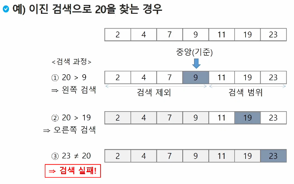

## 알고리즘:

- **유한한 단계를 통해 문제를 해결하기 위한 절차나 방법**
- **주로 컴퓨터 용어로 쓰이며, 컴퓨터가 어떤 일을 수행하기 위한 단계적 방법**

### 좋은 알고리즘:

1. **정확성**: 얼마나 정확하게 동작하는가
2. **작업량:** 얼마나 적은 연산으로 원하는 결과를 얻어내는가
3. **메모리 사용량:** 얼마나 적은 메모리를 사용하는가
4. **단순성:** 얼마나 단순한가
5. **최적성:** 더 이상 개선할 여지 없이 최적화 되었는가

---

## 시간 복잡도:

**알고리즘의 작업량을 표현할 때 사용하는 표현**

- 실제 걸리는 시간을 측정
- 실행되는 명령문의 개수를 계산

### 빅-오(O) 표기법:

- 시간 복잡도 함수 중에서 **가장 큰 영향력을 주는 n에 대한 항**만을 표시
- 계수(Coefficient)는 생략

```
O(3n + 2) = O(3n) = O(n)
최고차항 3n만 선택 후 계수 3 제거

O(2n^2 + 10n + 100) = O(n^2)
O(4) = O(1)
```

- n개의 데이터를 입력 받아 저장한 후 각 데이터를 1씩 증가시킨 후, 각 데이터를 화면에 출력하는 알고리즘의 시간복잡도 : O(n)
- 각기 다른 시간 복잡도의 알고리즘은 아래와 같은 연산수를 보임


---

## 입력 받기:

```python
# 입력이 구분지어져서 오지 않을 경우
card_list = list(map(int, (input())))
--------------------------------------
num = 456789
c = [0] * 12

for i in range(6):
    c[num % 10] += 1
    num //= 10

print(c)
```

## 배열:

**일정한 자료형의 변수들을 하나의 이름으로 열거하여 사용하는 자료 구조**

- 6개의 변수를 사용해야 하는 경우, 이를 배열로 바꾸어 사용하는 예

```python
num0 = 0
num1 = 1
num2 = 2
num3 = 3
num4 = 4
num5 = 5
========
num = [0, 1, 2, 3, 4, 5]
```

### 배열의 필요성:

- 프로그램 내에서 여러 개의 변수가 필요할 때 일일이 다른 변수명을 이용하여 자료에 접근하는 것은 매우 비효율적일 수 있다
- 배열을 사용하면 하나의 선언을 통해서 둘 이상의 변수를 선언할 수 있다.
- 단순히 다수의 변수 선언을 의미하는 것이 아니라, 다수의 변수로는 하기 힘든 작업을 배열을 활용해 쉽게 할 수 있다

### 1차원 배열의 선언:

```python
arr = list()
arr = []
========================================================
arr = [1, 2, 3]
**arr = [0] * 10**  # 크기가 정해진 배열을 선언 (많이 쓰자!)

**'''append는 시간이 많이 걸리는 작업임. 
배열이 많을 때는 append를 쓰지 않는 것이 좋음'''**
========================================================
**'''1차원 배열의 접근'''**

arr[0] = 10 # 배열 arr의 0번 원소에 10을 저장하라
arr[index] = 20 # 배열 arr의 index번 원소에 20을 저장하라
```

- 입력받은 정수를 1차원 배열에 저장하는 방법

```python
**# 첫 줄에 양수의 개수 N이 주어진다.
# 다음 줄에 빈칸으로 구분된 N개의 양수 Ai가 주어진다**

N = int(input())
arr = list(map(int, input().split()))
```

- 연습 문제

```python
# N개의 양의 정수에서 가장 큰 수와 가장 작은 수의 차이를 출력하라.

# 첫 줄에 테스트 케이스의 수 T가 주어진다
# 각 케이스의 첫 줄에 양수의 개수 N이 주어진다
# 다음 줄에 N개의 양수 ai가 주어진다.

T = int(input())
for test_num in range(1, T + 1):
	N = int(input())
	arr = list(map(int, input().split()))
	
	# 배열 내에서 가장 큰 값과 작은 값 찾기
	num_max = arr[0] # 배열의 가장 첫번째 값으로 초기값 할당하는 것 추천
	num_min = arr[0]
	
	# 배열을 돌면서 할당된 값과 비교
	for num in arr:
		if num_min > num:
			num_min = num
		elif num_max < num:
			num_max = num
	
	print(f'#{test_num} {num_max - num_min}')
	
```

### 배열 내에서 가장 큰 값과 작은 값 찾기

```python
arr = list(map(int, input().split()))

# 배열 내에서 가장 큰 값과 작은 값 찾기
num_max = arr[0]
num_min = arr[0]
# 배열의 가장 첫번째 값으로 초기값 할당하는 것 추천
	
# 배열을 돌면서 할당된 값과 비교
for num in arr:
	if num_min > num:
		num_min = num
	elif num_max < num:
		num_max = num
```

### Gravitiy

```python
'''
상자들이 쌓여있는 방이 있다. 
방이 오른쪽으로 90도 회전하여 상자들이 중력의 영향을 받아 낙하한다고 할 떄, 
낙차가 가장 큰 상자를 구하여 낙차를 리턴하는 프로그램을 작성하시오. '''

# 9
# 7 4 2 0 0 6 0 7 0

arr = list(map(int, input().split()))

count_dict = {}
for index, num in enumerate(arr):
	count = 0
	for i in range(index + 1, len(arr) - 1):
		count += 1
		if arr[i] >= num:
			count_dict[num] = count
	
```

---

## 정렬:

2개 이상의 자룔르 특정 기준에 의해 작은 값부터 큰 값(오름차순)

혹은 그 반대의 순서대로(내림차순) 재배열하는 것

### 종류

- 버블 정렬
- 카운팅 정렬
- 선택 정렬
- 퀵 정렬
- 삽입 정렬
- 병합 정렬

---

### 버블 정렬: `O(n^2)`

인접한 두 개의 원소를 비교하며 자리를 계속 교환하는 방식

**절차**

1. 첫 번째 원소부터 인접한 원소끼리 계속 자리를 교환하면서 맨 마지막 자리까지 이동한다.
2. **한 단계가 끝나면 가장 큰 원소가 마지막 자리로 정렬된다**
3. 교환하며 자리를 이동하는 모습이 물 위에 올라오는 거품 모양과 같다고 하여 버블 정렬이라고 한다

**CODE**

```python
arr = [90, 55, 7, 78, 12, 42, 3]

for i in range(len(arr) - 1, 0, -1):
    for j in range(0, i):
        if arr[j] > arr[j + 1]:
            arr[j], arr[j + 1] = arr[j + 1], arr[j]

========================================================
# 함수형

def Bublle_sort(arr, N): # arr = 배열, N은 arr의 길이
	for i in range(N - 1, 0, -1):
		for j in range(0, i):
			if arr[j] > arr[j + 1]:
				arr[j], arr[j + 1] = arr[j + 1], arr[j]
```

### 카운팅 정렬 `O(n + k)`

항목의 순서를 결정하기 위해 집합에 각 항목이 몇 개씩 있는지 세는 작업을 하여,

선형 시간에 정렬하는 효율적인 알고리즘

**주의 사항**

- 정수나, 정수로 표현할 수 있는 자료에 대해서만 사용 가능:
    
    각 항목의 발생 횟수를 기록하기 위해, 정수 항목으로 인덱스 되는 카운트들의 배열을 사용하기 때문
    
- 카운트을 위한 충분한 공간을 할당하려면 집합 내의 가장 큰 정수를 알아야 함

**절차**

1. 각 항목들의 발생 횟수를 세고, 정수 항목들로 직접 인덱스되는 카운트 배열 counts에 저장한다.


1. 정렬된 집합에서 각 항목의 앞에 위치할 항목의 개수를 반영하기 위해,
    
    counts의 원소를 조정한다. (개수를 세고, 개수를 누적)
    

1. data의 값을 역순으로 가져와 해당 값과 같은 counts의 인덱스의 값을 1 감소시키고, 그 값을 temp의 인덱스로 해 data에서 가져온 값을 삽입한다.


**CODE**

```python
datas = [0, 4, 1, 3, 1, 2, 4, 1]
datas_len = 8
max_value = 4

# 최소값부터 최대값까지 전부 담을 수 있을 사이즈로 빈 counts 리스트 생성
counts = [0] * (max_value + 1) # [0, 0, 0, 0, 0]

# datas를 순회하면서 나오는 값을 counts의 인덱스로 삼아 1씩 더해줌
for data in datas:
	counts[data] += 1
print(counts) # [1, 3, 1, 1, 2]

**# counts의 값을 누적 값으로 바꿔준다.**
for i in range(1, len(counts)):
    counts[i] += counts[i - 1]
print(counts) # [1, 4, 5, 6, 8]

**# 만약 내림차순 정렬을 원하면 뒤에서부터 누적값을 만들어주면 됨**
for j in range(len(counts) - 2, -1, -1):
    counts[j] += counts[j + 1]
    
# 정렬할 값을 담을 temp list를 생성
temp = [0] * datas_len

# data의 값을 역순으로 가져와 해당 값과 같은 counts의 인덱스의 값을 1 감소시키고, 
# 그 값을 temp의 인덱스로 해 data에서 가져온 값을 삽입.
for re_data in datas[::-1]:
	counts[re_data] -= 1
	temp[counts[re_data]] = re_data	
**print(temp) # [0, 1, 1, 1, 2, 3, 4, 4]**
```

---

### 선택 정렬 `O(n^2)`

주어진 자료들 중 가장 작은 값의 원소부터 차례대로 선택하여 위치를 교환하는 방식

→ 앞서 살펴본 셀렉션 알고리즘을 전체 자료에 적용한 것


**절차**

1. 주어진 리스트 중에서 최소값을 찾는다.
2. 그 값을 리스트의 맨 앞에 위치한 값과 교환한다.
3. 맨 처음 위치를 제외한 나머지 리스트를 대상으로 위의 과정을 반복한다.


**CODE**

```python
**# 오름차순**
def selection_sort(data):
    for i in range(len(data) - 1):
        min_index = i
        for j in range(i + 1, len(data)):
            if data[min_index] > data[j]:
                min_index = j
        data[i], data[min_index] = data[min_index], data[i]
    return data

**# 내림차순**
def selection_sort_reverse(data):
    for i in range(len(data) - 1):
        max_index = i
        for j in range(i + 1, len(data)):
            if data[max_index] < data[j]:
                max_index = j
        data[i], data[max_index] = data[max_index], data[i]
    return data

A = [10, 25, 64, 22, 11]
B = [9, 2, 3, 1, 6, 4, 3, 3, 7]

print(selection_sort(A))  
# [10, 11, 22, 25, 64]
print(selection_sort(B))
# [1, 2, 3, 3, 3, 4, 6, 7, 9]

print(selection_sort_reverse(A))
# [64, 25, 22, 11, 10]
print(selection_sort_reverse(B))
# [9, 7, 6, 4, 3, 3, 3, 2, 1]
```

---

### 셀렉선 알고리즘

저장되어 있는 자료로붙 k번째로 큰, 작은 원소를 찾는 방법을 의미

→ 최소 값, 최대 값, 혹은 중간 값을 찾는 알고리즘을 의미하기도 한다.

**선택 과정**

셀렉션은 아래와 같은 과정을 통해 이루어짐

- 정렬 알고리즘을 이용해 자료 정렬하기
- 원하는 순서에 있는 원소 가져오기

```python
# k번째로 작은 원소를 찾는 알고리즘

def selectionsort(arr, k) :
    n = len(arr)
    for i in range(k) :
        min_arr = i
        for j in range(i+1, n) :
            if arr[min_arr] > arr[j]:
                min_arr = j
        arr[i], arr[min_arr] = arr[min_arr], arr[i]
    return arr[k-1]
```

### 완전 검색 ( Brute-Force, Generate-and-test )

완전 검색 기법은 문제의 해법으로 생각할 수 있는 모든 경우의 수를 나열해보고 확인해 보는 기법

- 모든 경우의 수를 테스트한 후 최종 해법을 도출
- 일반적으로 경우의 수가 상대적으로 작을 때 유용함

**TIP**

- 모든 경우의 수를 생성하고 테스트하기 때문에, 수행 속도는 느리지만 해답을 찾아내지 못할 확률이 적음.
- 우선 완전 검색으로 접근하여 해답을 도출한 후, 성능 개선을 위해 다른 알고리즘을 사용하고 해답을 확인하는 것이 바람직함.

```python
'''
0~9 사이의 숫자 카드에서 임의의 카드 6장을 풀었을 때,
3장의 카드가 연속적인 번호를 갖는 경우를 run이라고 하고,
3장의 카드가 동일한 번호를 갖는 경우 triplet이라고 한다.

그리고 6장의 카드가 run과 triplet으로만 구성된 경우를 baby-gin이라고 한다

6자리의 숫자를 입력받아 baby-gin 여부를 판단하는 프로그램을 작성하라.
'''

card_list = list(map(int, (input()))) #6676761
card_max = max(card_list)
counts = [0] * (card_max + 1)
print(card_list)

for card_num in card_list:
    counts[card_num] += 1

print(counts) # [0, 0, 0, 0, 0, 0, 4, 2]
# 3이상인 값이 있으면 triplet
for i in range(len(counts)):
    while counts[i] >= 3:
        counts[i] -= 3
        print('tryplet')

# 연속으로 3개가 1 이상이면 run!
for i in range(len(counts) - 2):
    if counts[i] > 0 and counts[i + 1] > 0 and counts[i + 2] > 0:
        counts[i] -= 1
        counts[i + 1] -= 1
        counts[i + 2] -= 1
        print('run')

if sum(counts) == 0:
    print('win')
else:
    print('lose')
```

### 순열:

서로 다른 것들 중 몇 개를 뽑아서 한 줄로 나열하는 것

- `nPr` 서로 다른 n개 중 r개를 택하는 순열
    
    nPr = n * (n - 1) * (n - 2) …*  (n - r + 1)
    
- `nPn = n!`

```python
# {1, 2, 3}을 포함하는 모든 순열을 생성하는 함수:

for i1 in range(1, 4):
	for i2 in range(1, 4):
		if i2 != i1:
			for i3 in range(1, 4):
				if i3 != i1 and i3 != i2:
					print(i1, i2, i3)
```

### 탐욕 알고리즘 (GREEDY)

- 그리디는 최적 해를 구하는 데 사용하는 근시안적인 방법
- 여러 경우 중 하나를 결정해야 할 때마다 그 순간에 최적이라고 생각되는 것을 선택해 나가는 방식으로 진행하여 최종적인 해답에 도달
- 각 선택의 시점에서 이루어지는 결정은 지역적으로는 최적이지만,
그 선택들을 계속 수집하여 최종적인 해답을 만들었다고 하여, 그게 최적이라는 보장은 없음
- 일반적으로 머리 속에 떠오르는 생각을 검증 없이 구현하면 그리디임

**과정**

1. 해 선택: 현재 상태에서 부분 문제의 최적 해를 구한 뒤, 이를 부분 해 집합에 추가
2. 실행 가능성 검사: 새로운 부분 해 집합이 실행 가능한 지를 확인
곧 문제의 제약 조건을 위반하지 않는 지를 검사
3. 해 검사: 새로운 부분 해 집합이 문제의 해가 되는 지를 확인.
아직 전체 문제의 해가 완성되지 않았다면, 1)의 해 선택부터 다시 시작

---

## 2차원 배열

**1차원 List를 묶어 놓은 List**

**2차원 이상의 다 차원 List는 차원에 따라 Index를 선언**

```python
arr = [[0, 1, 2, 3], [4, 5, 6, 7]]
# 2행 4열의 2차원 List
```

**2차원 배열의 선언**

- 세로 길이(행의 개수), 가로 길이(열의 개수)를 필요로 함
- Python에서는 데이터 초기화를 통해 변수 선언과 초기화가 가능함

```python
# 3
# 1 2 3
# 4 5 6
# 7 8 9

N = int(input())
arr_1 = [list(map(int, input().split())) for _ in range(N)]
# [[1, 2, 3], [4, 5, 6], [7, 8, 9]]

-------------------------------------------------------------
# 3
# 123
# 456
# 789

N = int(input())
arr_2 = [list(map(int, input())) for _ in range(N)]
# [[1, 2, 3], [4, 5, 6], [7, 8, 9]]

-------------------------------------------------------------
# 0으로 된 2차원 배열 만들기
x, y = map(int, input().split()) # x = 2, y = 3

arr_3 = [[0] * x for _ in range(y)]
# [[0, 0], [0, 0], [0, 0]]

-------------------------------------------------------------
**# 아래처럼 하면 절 대 안 됨**
arr = [[0] * 3] * 2
# [[0, 0, 0], [0, 0, 0]]

arr[0][0] = 1
# [[1, 0, 0], [1, 0, 0]] 
```

**2차원 배열 출력하기**

```python
arr = [[1, 2, 3], [4, 5, 6]]

for i in range(2):
	print(*arr[i])

# 보통 i는 행, j는 열을 나타내는 경우가 많음
for i in range(2):
	for j in range(3):
		print(arr[i][j]. end = ' ')
	print()
	
'''
1 2 3 
4 5 6 
'''
```

**배열 순회**

```python
# m = 가로, n = 세로
n, m = 3, 4
arr = [[0, 1, 2, 3], [4, 5, 6, 7], [8, 9, 10, 11]]

# 행 우선 순회
for i in range(n):
	for j in range(m):
		print(arr[i][j])
		
# 열 우선 순회
for j in range(m):
	for i in range(n):
		print(arr[i][j])
		
# 지그재그 순회
for i in range(n):
	for j in range(m):
		print(arr[i][j + (m - 1 - 2 * j) * (i % 2)])
		
for i in range(n):
	for j in range(m):
		if i % 2 == 0:
			print(arr[i][j])
		elif i % 2 != 0:
			print(arr[i][m - 1 - j])
```

**델타를 이용한 2차 배열 탐색**

- 2차 배열의 한 좌표에서 4 방향의 인접 배열 요소를 탐색하는 방법
- 인덱스 (i, j)인 칸의 상하좌우 칸 (ni, nj)

- dj[1, 0, -1, 0]
- di[0, 1, 0, -1]


```python
# 상하좌우 요소의 합을 더한 새 배열 만들기
N = 4
arr = [[0, 1, 2, 3], [4, 5, 6, 7], [8, 9, 10, 11], [12, 13, 14, 15]]
new_arr = [[0] * 4 for _ in range(N)]

di = [0, 1, 0, -1]
dj = [1, 0, -1, 0]
for i in range(N):
	for j in range(N):
		elem_sum = arr[i][j]
		for k in range(4):
			ni = i + di[k]
			nj = j + dj[k]
			if 0 <= ni < N and 0 <= nj < N:
				elem_sum += arr[ni][nj]
		new_arr[i][j] = elem_sum

print(new_arr)
# [[5, 8, 12, 12], [17, 25, 30, 27], [33, 45, 50, 43], [33, 48, 52, 40]]

```

**전치 행렬**

```python
arr = [[1, 2, 3], [4, 5, 6], [7, 8, 9]]

for i in range(3):
	for j in range(3):
		if i < j:
			arr[i][j], arr[j][i] = arr[j][i], arr[i][j]
```

**i, j의 크기에 따라 접근하는 원소 비교**


**연습 문제**

```python
'''
N*N 배열의 각 요소에 대해서 그 요소와 이웃한 요소와의 차의 절대값을 구하고,
각 요소의 절대값의 합을 모두 조사한 총합을 구하시오
'''

N = int(input())
arr = [list(map(int, input().split())) for _ in range(N)]

di = [1, 0, -1, 0]
dj = [0, 1, 0, -1]
abs_min_total = 0 

# N * N 배열의 모든 원소에 대해
for i in range(N):
    for j in range(N):
        # i, j의 4방향 원소에 대해
        for k in range(4):
            ni = i + di[k]
            nj = j + dj[k]
            # ni, nj의 값이 인덱스 범위를 넘어가지 않게끔
            if 0 <= ni < N and 0 <= nj < N:
			          # 해당 원소와 인접한 원소의 차의 절대값 구하기
                temp = arr[i][j] - arr[ni][nj]
                if temp < 0:
                    temp *= -1
                abs_min_total += temp

print(abs_min_total)
```

**부분집합 합의 합**

- 유한개의 정수로 이루어진 집합이 있을 때, 이 집합의 부분집합 중에서 그 집합의 원소를 모두 더한 값이 0이 되는 경우가 있는지를 알아보자.

**부분집합의 수**

- 집합의 개수가 n개일 때, 공집합을 포함한 부분집합의 수는 `2^n`
    

```python
# 원소가 4개라면
bit = [0] * 4
for i in range(2):
	bit[0] = i
	for j in range(2):
		bit[1] = j
		for k in range(2):
			bit[2] = k
			for l in range(2):
				bit[3] = l
				print(bit)
```

**비트 연산자**

`&` : 비트 단위로 AND 연산을 함 

`|` : 비트 단위로 OR 연산을 함

`<<` : 피연산자의 비트 열을 왼쪽으로 이동시킴

`>>` : 피연산자의 비트 열을 오른쪽으로 이동시킴

```python
1 << n : `2^n` 
즉, 원소가 n개일 경우의 모든 부분집합의 수를 의미

i & (1 << j) : i의 j번째 비트가 1인지 아닌지를 검사한다.
```

```python
arr = [3, 6, 7, 1, 5, 4]
n = len(arr)

for i in range(1<<n): # range(1, 2^n)의 개념과 비슷?
	for j in range(n):
		if i & (1<<j):
			print(arr[j], end = ', ')
	print()
print()
```

**연습문제**

```python
'''
9개의 정수를 입력받아 부분집합의 합이 0이 되는 것이 존재하는지를
계산하는 함수를 작성
'''
def set_sum(arr_input):
	arr_len = len(arr_input)
	
	for i in range(1<<arr_len):
		for j in range(arr_len)
			if i & (1<<j): # i의 j번째 비트가 1인지 아닌지를 검사한다.
				print(arr[j], end = ', ')
		print()
	print()
	
arr = [-7, -5, 2, 3, 8, -2, 4, 6, 9]
set_sum(arr)
```

---

## 검색

### 순차검색

**일렬로 되어 있는 자료를 순서대로 검색하는 방법**

- 가장 간단하고 직관적인 검색 방법
- 배열이나 연결 리스트 등 순차 구조로 구현된 자료 구조에서 항목을 찾을 때 유용
- 알고리즘이 단순해 구현이 쉽지만, 검색 대상의 수가 많은 경우에는 수행 시간이 급격히 증가해 비효율적임

**정렬되지 않은 경우 `O(n)`**

- 찾고자 하는 원소의 순서에 따라 비교 횟수가 결정됨
- 정렬되지 않은 자료에서의 순차 검색의 평균 비교 횟수: `(n + 1) / 2`

**절차**

1. 첫 번째 원소부터 순서대로 검색 대상과 키 값이 같은 원소가 있는지 비교하면 찾음
2. 키 값이 동일한 원소를 찾으면 그 원소의 인덱스를 반환
3. 자료구조의 마지막에 이를 때까지 검색 대상을 찾지 못하면 검색 실패


**CODE**

```python
# for문 사용
def find_target_1(target, data_list):
	for i in range(0, len(data_list)):
		if target == data_list[i]:
			return i
	return -1

# While문 사용
def find_target_2(target, data_list):
	i = 0
	while i < len(data_list) and data_list[i] != target: # 이 순서 지켜줘야 함!
		i += 1
	if i < len(data_list):
		return i
	else:
		return -1
		
data = [4, 9, 11, 23, 2, 19, 7]

print(find_target(7, data)) # 6
print(find_target(9, data)) # 1
print(find_target(8, data)) # -1
# 만약 해당되는 원소가 없다면, 인덱스에서 사용하지 않는 값을 반환하는게 좋음 '**-1'**
```

**2. 정렬된 경우 `O(n)`**

- 자료가 오름차순으로 정렬된 상태에서 검색을 실시한다고 가정
- 자료를 순차적으로 검색하면서 키 값을 비교하여, 원소의 키 값이 검색 대상의 키 값보다 크면 찾는 원소가 없다는 것이므로 더 이상 검색하지 않고 종료한다
- 정렬이 되어있으므로, 검색 실패를 반환하는 경우 평균 비교 횟수가 반으로 줄어듬


**→ 찾는 값이 있을 경우에는, 정렬하지 않았을 경우와 유사하나, 없을 경우에는 달라짐**

**CODE**

```python
# for문 사용:
def seqeuntial_search_1(target, data_list):
	for i in range(0, len(data_list)):
		if data_list[i] == target:
			return i
		elif data_list[i] > target:
			return -1

# while문 사용
def seqeuntial_search_2(target, data_list):
	i = 0
	# 타겟보다 리스트 요소의 값이 작을 경우에만 인덱스 값을 늘려감
	while i < len(data_list) and data_list[i] < target: # 이 순서 지켜줘야 함!!
		i += 1
	if i < len(data_list) and data_list[i] == target:
		return i
	else:
		return -1
		
data = [2, 4, 7, 9, 11, 19, 23]
	
print(seqeuntial_search_1(23, data)) # 6
print(seqeuntial_search_1(4, data)) # 1
print(seqeuntial_search_1(8, data)) # -1
```

---

### 이진 검색 `O(logN)`

- 이진 검색을 하기 위해서는 **자료가 정렬된 상태여야 함**
    - 이진 검색의 경우 자료에 삽입이나 삭제가 발생했을 때,
    **배열의 상태를 항상 정렬 상태로 유지하는 추가 작업이 필요함**
- 자료의 가운데에 있는 항목의 키 값과 비교하여, 다음 검색의 위치를 결정하고 검색을 계속 진행하는 방법
    - 목적 키를 찾을 때까지 이진 검색을 순환적으로 반복 수행함으로써, 
    검색 범위를 반으로 줄여가면서 보다 빠르게 검색을 수행함

**절차**

- 검색 범위의 시작점과 종료점을 이용해 검색을 반복 수행함




**CODE**

```python
# 반복 구조의 이진검색 코드: 재귀함수 사용 가능하나, 이 경우엔 반복이 효율이 더 좋음
def binary_search(target, data_list):
	start, end = 0, len(data_list) - 1
	
	while start **<=** end: # 남은 구간이 하나라도 있으면..
		mid = (start + end) // 2
		if target == data_list[mid]:
			return mid
		elif target > data_list[mid]:
			start = mid + 1
		elif target < data_list[mid]:
			end = mid - 1
	return -1
	
data = [2, 4, 7, 9, 11, 19, 23]	

print(binary_search(23, data)) # 6
print(binary_search(4, data)) # 1
print(binary_search(8, data)) # -1
```

---

### 인덱스

**원본 데이터에 데이터가 삽입될 경우,
상대적으로 크기가 작은 인덱스 배열을 정렬하기 때문에 속도가 빠름**

→ 대량의 데이터를 매번 정렬하면, 프로그램의 반응은 느려질 수 밖에 없음.
    이러한 성능 저하 문제를 해결하기 위해서는 배열 인덱스를 사용하면 됨

**특징**

- Database에서 유래했고, 테이블에 대한 동작 속도를 높여주는 자료 구조를 의미
- Database 분야가 아닌 곳에서는 Look up table 등의 용어를 사용하기도 함
- 인덱스를 저장하는데 필요한 디스크 공간은 보통 테이블을 저장하는데 필요한 디스크 공간보다 작음. 왜냐하면 인덱스는 키-필드만 갖고 있고, 테이블의 다른 세부 항목은 갖고 있지 않기 때문
- 데이터베이스 인덱스는 **이진 탐색 트리 구조**로 되어있기에, 삽입, 삭제, 정렬이 한 번에 이루어짐

→ 위의 경우 원본 데이터 배열과 별개로, 배열 인덱스를 추가한 예를 보여줌