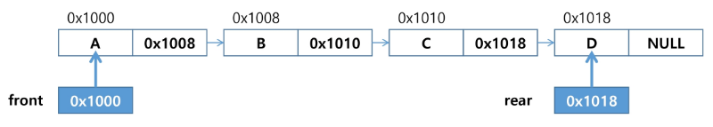

## Queue:

**특성:**

- 스택과 마찬가지로 삽입과 삭제의 위치가 제한적인 자료 구조
    - 큐의 뒤에서는 삽입만 하고, 앞에서는 삭제만 이루어지는 구조
- 선입선출 구조(FIFO: First In First Out)
    - 큐에 삽입한 순서대로 원소가 저장되어, 가장 먼저 삽입된 원소는 가장 먼저 삭제됨
    
    
    

**큐의 기본 연산**

- **삽입:** enQueue
- **삭제:** deQueue

**큐의 주요 연산**

| 연산 | 기능 |
| --- | --- |
| **enQueue(item)** | 큐의 뒤쪽(rear 다음)에 원소를 삽입하는 연산 |
| **deQueue()** | 큐의 앞쪽(front)에서 원소를 삭제하고 반환하는 연산 |
| **createQueue()** | 공백 상태의 Queue를 생성하는 연산 |
| **isEmpty()** | Queue가 공백 상태인지 확인하는 연산 |
| **isFull()** | Queue가 포화 상태인지 확인하는 연산 |
| **Qpeek()** | Queue의 앞쪽(front)에서 원소를 삭제 없이 반환하는 연산 |


### 선형큐:

**1차원 배열을 이용한 큐**

- **Queue의 크기** **= 배열의 크기**
- **front:** 저장된 첫번째 원소의 index
- **rear:** 저장된 마지막 원소의 index

**상태 표현:**

- **초기 상태:** front = rear = -1
- **공백 상태:** front == rear
- **포화 상태:** rear == n - 1 (n: 배열의 크기, n - 1: 배열의 마지막 index)

```python
# 초기 공백 Queue 생성
# - 크기 n인 1차원 배열 생성
# - front와 rear를 -1로 초기화

N = 10
q = [0] * N
front, rear = -1, -1

# enqueue(1)
rear += 1
q[rear] = 1

# enqueue(2)
rear += 1
q[rear] = 2

# enqueue(3)
rear += 1
q[rear] = 3

# dequeue()
front += 1
print(q[front])

# dequeue()
front += 1
print(q[front])

# dequeue()
front += 1
print(q[front])

q2 = []
q2.append(10)
q2.append(20)
print(q2.pop(0))
print(q2.pop(0))
```

### 삽입: enqueue(item)

- 마지막 원소 뒤에 새로운 원소를 삽입
    
    1) **rear값을 하나 증가시켜** 새로운 원소를 삽입할 자리를 마련
    
    2) 그 index에 해당하는 배열 원소 **Q[rear]에 item을 저장**
    
    ```python
    def enQueue(item):
    	global rear
    	if isFull(): print("Queue_Full")
    	else:
    		rear += 1
    		Q[rear] = item
    ```
    

### 삭제: deQueue()

- 가장 앞에 있는 원소를 삭제하기 위해
    
    1) **front 값을 하나 증가시켜** 큐에 남아있는 첫번째 원소 이동
    
    2) 새로운 **첫번째 원소를 리턴함**으로써 삭제와 동일한 기능함
    

### 공백상태 및 포화상태 검사: isEmpty(), isFull()

**공백상태**: front == rear:

**포화상태**: rear == n - 1 (n: 배열의 크기, n - 1: 배열의 마지막 index)

```python
def isEmpty():
	return front == rear

def isFull():
	return rear == len(Q) - 1
```

### 검색: Qpeek()

- 가장 앞에 있는 원소를 검색해 반환하는 연산
- 현재 **front의 한자리 뒤(front + 1)에 있는 원소**: 즉 큐의 첫번째에 있는 원소를 반환
    
    →  front를 증가시키는 건 아님
    

```python
def Qpeek():
	if isEmpty(): print('Queue_Empty')
	else: return Q[front + 1]
```

### 잘못된 포화상태 인식:

- 선형 큐를 이용해서 원소의 삽입과 삭제를 계속할 경우, 배열의 앞부분에 활용할 수 있는 공간이 있음에도 불구하고, rear = n-1인 상태 (포화상태)로 인식해 더 이상의 삽입을 수행하지 않게 됨

**해결 방법 1:**

- 매 연산이 이뤄질 때마다 저장된 원소들을 배열의 앞부분으로 이동시킬 수 있음:
    - 원소 이동에 많은 시간이 소요돼 효율성 감소

**해결 방법 2**:

- 1차원 배열을 사용하되, **논리적으로는 배열의 처음과 끝이 연결되어 원형의 큐를 이룬다고 가정**

### 원형 Queue

**원형 큐의 논리적 구조**


**초기 공백 상태**

- front = rear = 0

**Index의 순환**

- front와 rear의 위치가 배열의 마지막 인덱스인 n - 1을 가리킨 후,
그 다음에는 논리적 순환을 이루어 배열의 처음 인덱스인 0으로 이동해야 함
- 나머지 연산자 (mod : %)를 사용

**front 변수**

- 공백 상태와 포화 상태 구분을 쉽게 하기 위해 **front가 있는 자리는 사용하지 않고 항상 빈자리로**

**삽입 위치 및 삭제 위치**


**초기 공백 원형 queue 생성**

- 크기 n인 1차원 배열 생성
- front와 rear를 0으로 초기화

**공백 상태 및 포화 상태 검사: isEmpty(), isFull()**

- **공백 상태**: front == rear
- **포화 상태:** 삽입할 rear의 다음 위치 == 현재 front

```python
def isEmpty():
	return front == rear
	
def isFull():
	return (rear + 1) % len(cQ) == front
```

**CODE**

```python
Q_size = 4
cQ = [0] * 4
front = rear = 0

# enQueue(1)
rear = (rear + 1) % Q_size
cQ[rear] = 1

# enQueue(2)
rear = (rear + 1) % Q_size
cQ[rear] = 2

# enQueue(3)
rear = (rear + 1) % Q_size
cQ[rear] = 3

# deQueue()
front = (front + 1) % Q_size
print(cQ[front])

# deQueue()
front = (front + 1) % Q_size
print(cQ[front])

# deQueue()
front = (front + 1) % Q_size
print(cQ[front])

# enQueue(10)
rear = (rear + 1) % Q_size
cQ[rear] = 10

# enQueue(20)
rear = (rear + 1) % Q_size
cQ[rear] = 20

print(cQ)
```

### 연결 Queue

단순 연결 리스트(Linked List)를 이용한 Queue:

- Queue의 원소: 단순 연결 리스트의 노드
- Queue의 원소 순서: 노드의 연결 순서, 링크로 연결되어 있음
- front: 첫번째 노드를 가리키는 링크
- rear: 마지막 노드를 가리키는 링크

**상태 표현**

- 초기 상태: front = rear = null
- 공백 상태: front = rear = null




### Deque

- 컨테이너 자료형 중 하나
- deque 객체:
    - 양쪽 끝에서 빠르게 추가와 삭제를 할 수 있는 리스트류 컨테이너
    
- 연산:
    
    
    | append(x) | 오른쪽에 x 추가 |
    | --- | --- |
    | popleft() | 왼쪽에서 요소를 제거하고 반환, 없으면 IndexError |
    
    ```python
    from collections import deque
    
    q = deque()
    q.append(1) # enqueue(1)
    t = q.popleft() # dequeue()
    ```
    

### 우선순위 Queue

**특성**

- 우선순위를 가진 항목들을 저장하는 Queue
- FIFO가 아니라, 우선순위가 높은 순서대로 먼저 나가게 됨

**적용**

- 시뮬레이션
- 네트워크 트래픽 제어
- 운영체제의 태스크 스케쥴링

**구현**

- 배열을 이용한 우선순위 Queue
- 리스트를 이용한 우선순위 Queue

**기본 연산**

- 삽입: enQueue
- 삭제: deQueue


**배열을 이용한 우선순위 Queue**

- 배열을 이용해 자료 저장
- 원소를 삽입하는 과정에서 우선순위를 비교해 적절한 위치에 삽입하는 구조
- 가장 앞에 최고 우선순위의 원소가 위치하게 됨
- 배열을 사용하므로, 삽입이나 삭제가 일어날 때 원소의 재배치 발생
    
    → 이에 소요되는 시간이나 메모리 낭비가 큼
    

### 버퍼

- 데이터를 다른 한 곳으로 전송하는 동안 일시적으로 그 데이터를 보관하는 메모리 영역
- 버퍼링: 버퍼를 활용하는 방식 또는 버퍼를 채우는 동작

**버퍼의 자료 구조**

- 일반적으로 입출력 및 네트워크와 관련된 기능에서 이용
- 순서대로 입력, 출력, 전달되어야 하므로, FIFO 방식의 자료구조인 Queue가 사용됨

## BFS (너비 우선 탐색)

너비 우선 탐색은 탐색 시작점의 인접한 정점들을 먼저 모두 차례로 방문한 후에, 
방문했던 정점을 시작점으로 하여 다시 인접한 정점들을 차례로 방문하는 형식

→ 인접한 정점들에 대해 탐색을 한 후, 차례로 다시 너비 우선 탐색을 진행해야 함

→ 선입선출 형태의 자료구조인 Queue를 활용함

**CODE**

```python
	def BFS(G, v): # 그래프 G, 탐색 시작점 v
		visited = [0] * (n + 1) # n 정점의 개수
		queue = [] # 큐 생성
		queue.append(v) # 시작점 v를 큐에 삽입
		while queue: # 큐가 비어있지 않은 경우
			t = queue.pop(0) # 큐의 첫번째 원소 반환
			**if not visited[t]:** # 방문되지 않은 곳이라면
				visited[t] = True # 방문한 것으로 표시
				visit(t) # 정점 t에서 할 일
				for i in G[t]:  # t와 연결된 모든 정점에 대해
					**if not visited[i]:** # 방문되지 않은 곳이라면
						queue.append(i) # 큐에 넣기
	
'------------------------------------------------------'

	def BFS(G, v, n): # 그래프 G, 탐색 시작점 v, 정점의 개수 n
		visited = [0] * (n + 1) # n 정점의 개수
		queue = [] # 큐 생성
		queue.append(v) # 시작점 v를 큐에 삽입
		visited[v] = 1
		while queue: # 큐가 비어있지 않은 경우
			t = queue.pop(0) # 큐의 첫번째 원소 반환
			visit(t) # 정점 t에서 할 일 # 개인적인 함수 지정인듯 (print, append 등등) 
			for i in G[t]:  # t와 연결된 모든 정점에 대해
				if not visited[i]: # 방문되지 않은 곳이라면
					queue.append(i) # 큐에 넣기
					visited[i] = visited[t] + 1 # n으로부터 1만큼 이동					

# 위 코드는 꺼내고도 check, 넣을 때도 check
# 아래 코드는 그 과정을 간소화 함. (queue에 대해 중복 enqueue를 방지)
# enqueue를 기준으로 visited를 체크 (방문하고 체크가 아님)
```

**연습 문제**


**방문 순서**

```python
'''
7 8
1 2 1 3 2 4 2 5 4 6 5 6 6 7 3 7
'''

def BFS(s, V): # 시작점, 정점 수
    visited = [0] * (V + 1) # visited 생성
    queue = []              # 큐 생성
    queue.append(s)         # 시작점 enqueue
    visited[s] = 1          # 시작점 방문 표시
    while queue:            # queue에 자료가 있는 동안 (탐색할 정점이 남아있으면)
        t = queue.pop(0)    # t를 dequeue
        print(t, end=' ')   # visit(t) # 할 작업
        for w in adjL[t]:   # 뽑은 t에 연결된 곳이 있는지 확인
            if visited[w] == 0: # 만약 뽑은 것이 방문된 적이 없는 곳이라면 (queue에 들어간 적이 없다면)
                queue.append(w) # queue에 enQueue
                visited[w] = 1  # enQueue 된 적이 있음을 표시
    print()

# 마지막 정점번호, 간선 수
V, E = map(int, input().split())
adjL = [[] for _ in range(V + 1)]
input_arr = list(map(int, input().split()))
for e in range(E):
    v1, v2 = input_arr[e * 2], input_arr[e * 2 + 1]
    adjL[v1].append(v2)
    adjL[v2].append(v1) # 무향일 때는 여기까지 추가시켜줘야함

BFS(1, V) # 1번부터 시작을 하고, 마지막 정점을 알려줌 (출발점, 정점 수)
BFS(2, V)
BFS(7, V)
'''
1 2 3 4 5 7 6 
2 1 4 5 3 6 7 
7 6 3 4 5 1 2 
'''
```

**최단 거리**

```python
'''
7 8
1 2 1 3 2 4 2 5 4 6 5 6 6 7 3 7
'''

def BFS(s, V): # 시작점, 정점 수
    visited = [0] * (V + 1) # visited 생성
    queue = []              # 큐 생성
    queue.append(s)         # 시작점 enqueue
    visited[s] = 1          # 시작점 방문 표시
    while queue:            # queue에 자료가 있는 동안 (탐색할 정점이 남아있으면)
        t = queue.pop(0)    # t를 dequeue
        print(t, end=' ')   # visit(t) # 할 작업
        for w in adjL[t]:   # 뽑은 t에 연결된 곳이 있는지 확인
            if visited[w] == 0: # 만약 뽑은 것이 방문된 적이 없는 곳이라면 (queue에 들어간 적이 없다면)
                queue.append(w) # queue에 enQueue
                visited[w] = visited[t] + 1  # enQueue 된 적이 있음을 표시 (간선을 몇 개 거쳤는지: 최단거리)
    print()
    print(visited)

# 마지막 정점번호, 간선 수
V, E = map(int, input().split())
adjL = [[] for _ in range(V + 1)]
input_arr = list(map(int, input().split()))
for e in range(E):
    v1, v2 = input_arr[e * 2], input_arr[e * 2 + 1]
    adjL[v1].append(v2)
    adjL[v2].append(v1) # 무향일 때는 여기까지 추가시켜줘야함

BFS(1, V) # 1번부터 시작을 하고, 마지막 정점을 알려줌 (출발점, 정점 수)
BFS(2, V)
BFS(7, V)

'''
1 2 3 4 5 7 6 
[0, 1, 2, 2, 3, 3, 4, 3]
2 1 4 5 3 6 7 
[0, 2, 1, 3, 2, 2, 3, 4]
7 6 3 4 5 1 2 
[0, 3, 4, 2, 3, 3, 2, 1]
'''
```

**참고 DFS**

```python
def DFS(s, V):                  # s 시작 정점 / V 정점 개수
    visited = [0] * (V + 1)     # 방문한 정점을 표시하기 위함
    stack = []                  # 스택 생성

    print(s, end=' ')
    visited[s] = 1  # 출발지(시작점)을 방문했다고 표시
    visit = s       # visit 현재 정점
    while 1:
        for w in adjL[visit]:       # v에 인접하고, 방문 안 한 w가 있으면
            if visited[w] == 0:
                stack.append(visit) # 현재 정점을 push하고
                visit = w           # w에 방문
                print(visit, end=' ')
                visited[w] = 1      # w에 방문 표시
                break               # for w: visit부터 다시 탐색
        else:                       # 남은 인접 정점이 없어서 break가 걸리지 않은 경우
            if stack:               # 이전 갈림길을 스택에서 꺼내서 (== if top > -1:)
                visit = stack.pop()
            else:                   # 되돌아갈 곳이 없고 남은 갈림길이 없으면 탐색 종료
                break               # while 1:
```

**미로 최단거리 (BFS)**

```python
from collections import deque

def find_start(N, maze):
    for i in range(N):
        for j in range(N):
            if maze[i][j] == 2:
                return i, j

def BFS(si, sj, N):
    visited = [[0] * N for _ in range(N)]
    q = deque()
    q.append((si, sj))
    visited[si][sj] = 1

    di = [1, 0, -1, 0]
    dj = [0, 1, 0, -1]

    while q:
        i, j = q.popleft()
        if maze[i][j] == 3:
            print(visited)
            print(q)
            return visited[i][j] - 1 - 1 # 경로의 빈 칸 수
        for k in range(4):
            mi, mj = i + di[k], j + dj[k]
            if 0 <= mi < N and 0 <= mj < N and maze[mi][mj] != 1 and visited[mi][mj] == 0:
                q.append((mi, mj))
                visited[mi][mj] = visited[i][j] + 1
    return 0 # 도달 못하는 경우

T = int(input())
for tc in range(1, T + 1):
    N = int(input())
    maze = [list(map(int, input())) for _ in range(N)]

    si, sj = find_start(N, maze)
    print(f'#{tc} {BFS(si, sj, N)}')

```

**미로 경로 체크 (DFS)**

```python
# 과연 나는 기억할 것인가
 
def dfs(s_i, s_j, N):
    stack = [] # 되돌아갈 때 사용할 스택
    visited[s_i][s_j] = 1 # 방문 표시
    n_i, n_j = s_i, s_j # 현재위치 표시
 
    di = [1, 0, -1, 0]
    dj = [0, 1, 0, -1]
 
    while 1:
        if maze[n_i][n_j] == 3: # 도착하면
            return 1
        for k in range(4):
            mi, mj = n_i + di[k], n_j + dj[k]
            # 범위를 벗어나지 않고, 해당 위치가 벽이 아니며, 방문하지 않아다면
            if 0 <= mi < N and 0 <= mj < N and maze[mi][mj] != 1 and visited[mi][mj] == 0:
                stack.append([n_i, n_j])    # 스택에 현 위치 삽입
                n_i, n_j = mi, mj           # 이동
                visited[n_i][n_j] = 1       # 방문 표시
                break
        else: # for문을 다 돌았는데 (4방향을 다 봤는데, 없어서 정상 종료 됐따면)
            if stack: # 스택에 자료가 있으면
                n_i, n_j = stack.pop()
            else:  # 없으면
                return 0 # 0 반환
    return -1 # 비정상 종료
    # 마지막 리턴 위치 잘 보자. 왜 안 되나 했네.... ㅜ
 
 
T = int(input())
for tc in range(1, T + 1):
    N = int(input()) # 미로 크기
    maze = [list(map(int, input())) for _ in range(N)]
 
    for i in range(N):
        for j in range(N):
            if maze[i][j] == 2:
                s_i, s_j = i, j
 
    visited = [[0] * N for _ in range(N)]
    # print(visited)
    print(f'#{tc} {dfs(s_i, s_j, N)}')
```