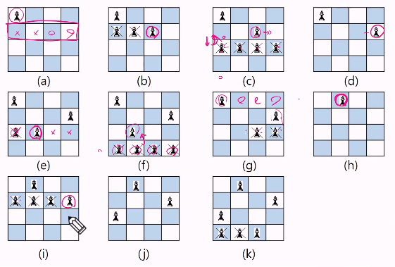

## 스택 (Stack)

- 물건을 쌓아 올리듯 자료를 쌓아 올린 형태의 자료구조
- 스택에 저장된 자료는 **`선형 구조`**를 갖는다
    
    ```python
    **- 선형 구조: 자료 간의 관계가 1대 1의 관계를 가짐
    - 비선형 구조: 자료 간의 관계가 1대 N의 관계를 가진다 (트리)**
    ```
    
- 스택에 자료를 삽입하거나 스택에서 자료를 꺼낼 수 있다
- **마지막에 삽입한 자료를 가장 먼저 꺼낸다** (후입선출: LIFO, Last in First Out)

### 스택을 프로그램에서 구현하기 위해 필요한 자료구조와 연산

- 자료구조: 자료를 선형으로 저장할 저장소
    - 배열을 사용할 수 있다.
    - 저장소 자체를 스택이라 부르기도 함
    - **스택에서 마지막 삽입된 원소의 위치**를 **`top`**이라고 부름

### 연산

- **`삽입 (Push)` :** 저장소에 자료를 저장
- **`삭제 (Pop)` :** 저장소에서 자료를 꺼냄, 꺼낸 자료는 삽입한 자료의 역순으로 꺼냄
- **`isEmpty` :** 스택이 공백인지 아닌지를 확인하는 연산
- **`Peek` :** 스택의 top에 있는 item을 반환하는 연산
    
    
    
    - top의 위치를 잘 기억해보자. -1부터 시작하고 마지막으로 넣은 위치로 옮겨감

### Push:

- **append** 메서드를 통해 리스트의 마지막에 데이터를 삽입 *(쫌 느림)*
    
    ```python
    def push(item):
    	s.append(item)
    ```
    

- 스택에서의 구현:

```python
# 함수형
def push(item, size):
	global top
	top += 1
	if top == size:
		print('overflow!')
		# 실제로는 정리하거나, 스택을 늘리는 작업을 하는 경우가 많음: 위 prt는 디버깅용
		# 문제 해결을 하다 이런 일이 발생하면, 스택의 크기를 잘 못 잡았거나, 과한 push가 원인일 것.
	else:
		stack[top] = item

size = 10
stack = [0] * size
top = -1

push(10, size)

'#####################################'

# 간단한 구현

size2 = 10
stack2 = [0] * size2
top2 = -1

top2 += 1
stack2[top2] = 20 # push(20)
```

### Pop:

- **pop** 메서드를 통해 구현

```python
def s_pop():
	if len(s) == 0:
		# underflow
		return
	else:
		return s.pop()
```

- 스택에서의 구현

```python
# 함수형
def s_pop():
	global top
	if top == -1:
		print('underflow')
		return 0
	else:
		top -= 1 # 리턴하고 감소시킬 수는 없으니까, 먼저 감소시키고
		return stack[top + 1] # 감소하기 전의 값을 리턴
		
print(s_pop())

'#####################################'

# 간단한 구현
if top > -1:
	top -= 1
	print(stack[top + 1])
'---------------------------------------'	

while top >= 0:
	temp = stack[top]
	top -= 1
```

**연습문제**

```python
# 스택을 구현해 보자
# 구현한 스택을 이용해 (1, 2, 3) 3개의 데이터를 스택에 저장하고, 다시 3번 꺼내서 출력해 보자

# 내장 메서드 활용
stack = []
stack.append(1)
stack.append(2)
stack.append(3)

print(stack.pop()) # 3
print(stack.pop()) # 2
print(stack.pop()) # 1

'#####################################'

# 함수형
def my_push(item, size):
	global top
	top += 1
	if top == size:
		return 0
	else:
		stack1[top] = item
		return 0

def my_pop():
	global top
	if top < 0:
		return 0
	else:
		top -= 1
		return stack1[top + 1]

size = 3
stack1 = [0] * size
top = - 1

for num in range(1, 4):
	my_push(num, size)

print(my_pop()) # 3
print(my_pop()) # 2
print(my_pop()) # 1

'#####################################'

# 간단한 구현
size = 3
stack2 = [0] * size
top = -1

for num in range(1, 4):
	top += 1
	stack2[top] = num

while top >= 0:
	temp = stack2[top]
	print(temp)
	top -= 1 
# 3 2 1
```

### 고려 사항

- 1차원 배열을 사용하여 구현할 경우, **구현이 용이하지만 스택의 크기 변경이 어려움**
- 이를 해결하기 위해서는 **저장소를 동적으로 할당해 스택을 구현하면 됨**
    - 동적 연결 리스트를 이용해 구현: 구현이 복잡하지만 메모리를 효율적으로 사용함

### Function Call

- 프로그램에서의 함수 호출과 복귀에 따른 수행 순서를 관리
- 가장 마지막에 호출된 함수가 가장 먼저 실행을 완료하고 복귀하는 후입선출 구조이므로,
후입선출 구조의 스택을 이용해서 수행 순서 관리


- 함수 호출이 발생하면, 호출한 함수 수행에 필요한 지역 변수, 매개 변수 및 수행 후 복귀할 주소 등의 정보를 스택 프레임에 저장하여 시스템 스택에 삽입


- 함수의 실행이 끝나면 시스템 스택의 top 원소(스택 프레임)를 삭제(pop)하면서,
프레임에 저장되어 있던 복귀 주소를 확인하고 복귀
- 함수 호출과 복귀에 따라 이 과정을 반복하여 전체 프로그램 수행이 종료되면
시스템 스택은 공백 스택이 된다


---

## 재귀 호출:

- 필요한 함수가 자신과 같은 경우 **자신을 다시 호출하는 구조**
- 함수에서 실행해야 하는 작업의 특성에 따라 일반적인 호출 방식보다
재귀 호출 방식을 사용해서 함수를 만들면 프로그램의 크기를 줄이고 간단하게 작성

**팩토리얼**

- n에 대한 factorial: 1부터  n까지의 모든 자연수를 곱하여 구하는 연산
- 마지막에 구한 하위 값을 이용해 상위 값을 구하는 작업을 반복


```python
def fact(n):
	if n == 1:
		return 1
	return n * fact(n - 1)
```

**피보나치 수열**

- 0과 1로 시작하고, 이전의 두 수 합을 다음 항으로 하는 수열을 피보나치라 한다

```python
0, 1, 1, 2, 3, 5, 8, 13, ...
```

- 피보나치 수열의 i번째 값을 계산하는 함수 F를 정의하면 다음과 같음.

```python
F(0) = 0, F(1) = 1
F(i) = F(i-1) + F(i-2) for i >= 2
```

- 위의 정의로부터 피보나치 수열의 i번째 항을 반환하는 함수를 재귀함수로 구현할 수 있음

```python
def fibo(n):
	if n < 2: # 2보다 작으면 자기 자신임
		return n7
	else: # 그보다 크면 재귀함수를 호출
		return fibo(n - 1) + fibo(n - 2)
```

### **모든 배열 원소에 접근하기**

```python
def f(i, N):
	if i == N:
		return
	else:
		print(arr[i])
		f(i + 1, N)
		return
```

### 배열에 v가 있으면 1, 없으면 0을 리턴

```python
def(i, N, v):ㅕ+
	if i == N:
		return 0
	elif arr[i] == v:
		return 1
	else:
		return f(i + 1, N, v)
```


---

## Memoization

- 앞에서 구현한 피보나치 수를 구하는 함수를 재귀 함수로 구현할 경우 문제점이 존재
    - 많은 중복 호출 발생 `아래의 예는 O(2^n)`
        
        
        
- 메모이제이션은 컴퓨터 프로그램을 실행할 때 이전에 계산한 값을 메모리에 저장해서,
매번 다시 계산하지 않도록 하여 전체적인 실행 속도를 빠르게 하는 기술
    - 피보나치 수를 구하는 알고리즘에서 fibo(n)의 값을 계산하자마자 저장하면
    실행시간을 `O(n)`으로 줄일 수 있음
- 동적 계획법의 핵심
- 직역: 메모리에 넣기

```python
# memo를 위한 배열을 할당하고, 모두 0으로 초기화 한다
# memo[0]은 0으로, memo[1]은 1로 초기화 한다. (피보나치 수의 특성)

def fibo_memo(n):
	global memo
	if n >= 2 and memo[n] == 0: # fibo(n)이 계산된 적이 없으면
		memo[n] = fibo_memo(n - 1) + fibo_memo(n - 2)
	return memo[n]

memo = [0] * (n + 1)
memo[0] = 0
memo[1] = 1
```

---

## DP(Dynamic Programming)

- 동적 게획 알고리즘은 그리디 알고리즘과 같이 최적화 문제를 해결하는 알고리즘
- 먼저 입력 크기가 작은 부분 문제들을 모두 해결한 후에,
그 해들을 이용해 보다 큰 크기의 부분 문제들을 해결해 최종적으로 문제를 해결하는 알고리즘

**피보나치 수 DP 적용**

- 부분 문제의 답으로부터 본 문제의 답을 얻을 수 있으므로, 최적 부분 구조로 이루어짐
- Memoization을 재귀적 구조에 사용하는 것보다
**반복적 구조로 DP를 구현한 것이 성능 면에서 보다 효율적임**
    - **재귀**적 구조는 내부에 **시스템 호출 스택을 사용하는 오버헤드가 발생**하기 떄문

1. **문제를 부분 문제로 분할함**
    1. Fibo(n) = Fibo(n - 1) + Fibo(n - 2)
    2. Fibo(n - 1) = Fibo(n - 2) + Fibo(n - 3)
    3. Fibo(2) = Fibo(1) + Fibo(0)
    - **Fibo(n) = Fibo(n - 1) + Fibo(n - 2) + Fibo(n - 3) ….. + Fibo(1) + Fibo(0)**
2. **부분 문제로 나눈 일을 끝냈으면, 가자 작은 부분 문제부터 해를 구한다**
3. **그 결과는 테이블에 저장하고, 테이블에 저장된 부분 문제의 해를 이용해 상위 문제의 해를 구함** 
    
    
    

```python
# 피보나치 수 DP 적용 알고리즘
def fibo_dp(n):
	f = [0] * (n + 1)
	f[0] = 0
	f[1] = 1
	for i in range(2, n + 1):
		f[i] = f[i - 1] + f[i - 2]
	return f[n]

n = 900
print(fibo_dp(n))
```

---

**비선형구조인 그래프 구조**는 그래프로 표현된 **모든 자료를 빠짐 없이 검색하는 것이 중요**

- **깊이 우선 탐색: `DFS** (Depth First Search)`
- **너비 우선 탐색: `BFS** (Breadth First Search)`

## DFS (깊이 우선 탐색)

- 시작 정점의 한 방향으로 갈 수 있는 경로가 있는 곳까지 깊**이 탐색해 가다가 더 갈 곳이 없으면,**
가장 **마지막에 만났던 갈림길 간선이 있는 정점으로 되돌아와,** 
**다른 방향의 정점으로 탐색을 반복**해 결국 **모든 정점을 방문**하는 순회 방법
- 가장 마지막에 만났던 갈림길의 정점으로 되돌아가서 다시 깊이 우선 탐색을 반복해야 하므로
**후입 선출 구조의 스택 사용 or 재귀 구조**

### 절차

1. 시작 정점 v를 결정해 방문한다.
2. 정점 v에 인접한 정점 중에서
    1. 방문하지 않은 정점w가 있으면, 정점v를 스택에 push하고 정점 w를 방문한다
    그리고 w를 v로 하여 다시 2번 절차를 반복한다.
    2. 방문하지 않은 정점이 없으면, 탐색의 방향을 바꾸기 위해서
    스택을 pop하여 받은 가장 마지막 방문 정점을 v로 하여 다시 2번 절차를 반복한다.
3. 스택이 공백이 될 때 까지 2번 절차를 반복한다.

### CODE

```python
visited = []
stack = [] 
초기화

dfs(v):
	시작점 v 방문
	visited[v] <= True;
	while {
		if (v의 인접 정점 중 방문 안 한 정점 w가 있으면)
			push(v);
			v <- w; (w에 방문)
			visited[w] <- True;
		else
			if (스택이 비어있지 않으면)
				v <- pop(stack)
			else
				break
	}
end dfs
```

```python
'''
1
7 8
1 2 1 3 2 4 2 5 4 6 5 6 6 7 3 7
'''
def DFS(s, V):                  # s 시작 정점 / V 정점 개수
    visited = [0] * (V + 1)     # 방문한 정점을 표시하기 위함
    stack = []                  # 스택 생성

    print(s, end=' ')
    visited[s] = 1  # 출발지(시작점)을 방문했다고 표시
    visit = s       # visit 현재 정점
    while 1:
        for w in adjL[visit]:       # v에 인접하고, 방문 안 한 w가 있으면
            if visited[w] == 0:
                stack.append(visit) # 현재 정점을 push하고
                visit = w           # w에 방문
                print(visit, end=' ')
                visited[w] = 1      # w에 방문 표시
                break               # for w: visit부터 다시 탐색
        else:                       # 남은 인접 정점이 없어서 break가 걸리지 않은 경우
            if stack:               # 이전 갈림길을 스택에서 꺼내서 (== if top > -1:)
                visit = stack.pop()
            else:                   # 되돌아갈 곳이 없고 남은 갈림길이 없으면 탐색 종료
                break               # while 1:

T = int(input())
for tc in range(1, T + 1):
    V, E = map(int, input().split())
    adjL = [[] for _ in range(V + 1)]

    # 일렬로 나열된 입력을 2개씩 나누기
    arr = list(map(int, input().split()))
    for i in range(E):
        v1, v2 = arr[i * 2], arr[i * 2 + 1]
        adjL[v1].append(v2)
        adjL[v2].append(v1)

    # print(adjL) # [[], [2, 3], [1, 4, 5], [1, 7], [2, 6], [2, 6], [4, 5, 7], [6, 3]]

    DFS(1, V)
		# 1 2 4 6 5 7 3 
```

```python
# 재귀
def dfs(graph, v, visited):
    
    #v는 시작위치
    visited[v] = True
    print(v , end = ' ')
    
    #현재 노드와 연결된 노드를 재귀적으로 호출
    for i in graph[v]:
        if not visited[i]:
            dfs(graph, i, visited)
    
graph = [
    [],
    [2,3,7],
    [1,4,6],
    [1,5,7],
    [2,6],
    [3,7],
    [2,4],
    [1,3]
]

#각 노드가 방문한 정보를 리스트 자료형으로 표현
visited = [False] * 9

print("방문순서")
dfs(graph, 1, visited)

'''--------------------------------------------------------'''

# 각 노드가 연결된 정보를 표현 (2차원 리스트)
graph = [
	[],  # idx 0 은 사용하지 않기 위함
	[2, 3, 8],
	[1, 7],
	[1, 4, 5],
	[3, 5],
	[3, 4],
	[7],
	[2, 6,  8],
	[1, 7]
]

# 각 노드가 방문된 정보를 표현 (1차원 리스트)
visited = [False] * 9  # idx 0 은 사용하지 않기 위해 9(8+1)로 초기화함

# DFS 메서드 정의
def dfs(graph, v, visited):
	# 현재 노드를 방문 처리
	visited[v] = True
	print(v, end=' ')
	# 현재 노드와 연결된 다른 노드를 재귀적으로 방문
	for i in graph[v]:
		if not visited[i]:
			dfs(graph, i, visited)

# 정의된 DFS 함수 호출
dfs(graph, 1, visited)  # 실행결과: 1 2 7 6 8 3 4 5
```

## 계산기 1

- 문자열로된 계산식이 주어질 때, 스택을 이용해 이 계산식의 값을 계산할 수 있음
- 문자열 수식 계산의 일반적 방법:
    - 중위 표기법의 수식을 후위 표기법으로 변경한다

```python
**중위 표기법(infix notation)**
 - 연산자를 피연산자의 가운데 표기하는 방법 # A + B
 
**후위 표기법(postfix notation)**
 - 연산자를 피연산자 뒤에 표기하는 방법 # AB+
```

### 후위 표기법

**중위 표기식의 후위 표기식 변환 방법 1**

- 수식의 각 연산자에 대해서 우선 순위에 따라 괄호르 사용하여 다시 표현한다
- 각 연산자를 그에 대응하는 오른쪽 괄호의 뒤로 이동시킨다
- 괄호르 제거한다
    
    
    

**중위 표기식의 후위 표기식 변환 방법 2 (스택 사용)**

1. **입력 받은 중위 표기식에서 토큰을 읽는다.**
2. **토큰이 피연산자:** 토큰을 출력한다.
3. **토큰이 연산자(괄호 포함)일 때:**
    1. 이 토큰이 스택의 top에 저장되어있는 연산자보다 우선순위가 높으면:
    스택에 push
    2. 스택의 top에 저장되어있는 연산자보다 우선순위가 낮거나 같으면:
    우선순위가 같을 때까지 스택에서 pop한 후, 토큰의 연산자를 스택에 push
    3. 만약 top에 연산자가 없으면: 스택에 push
4. **토큰이 오른쪽 괄호 `)` 이면:**
    1. 스택 top에 `(` 가 올 때 까지 pop 연산을 수행하고 pop한 연산자를 출력
    
    1. 왼쪽 괄호 `(` 를 만나면 `(` 를 pop만하고 출력하지는 않음
5. **중위 표기식에 더 읽을 것이 없다면:** 중지, 있다면 
**중위 표기식에 더 읽을 것이 있다면:** 1부터 다시 반복
6. **스택에 남아있는 연산자를 모두 pop해 출력**

```python
스택 밖의 왼쪽 괄호는 우선 순위가 가장높으며, 
스택 안의 왼쪽 괄호는 우선 순위가 가장 낮다
```

**연산자 우선순위**

- `(` 의 경우:
    - **들어갈 때는 우선 순위가 가장 높음**
    - **스택 내에서는 우선 순위가 가장 낮음**
    


**후위 표기법의 수식을 스택을 이용해 계산**

1. **피연산자를 만나면:** 스택에 **push**
2. **연산자를 만나면:** 필요한 만큼(2개)의 **피연산자를 스택에서 pop하여 연산**하고,
                             연산 **결과를 다시 스택에 push**
3. **수식이 끝나면:** 마지막으로 **스택을 pop하여 출력**


**먼저 pop한 요소가 오른쪽 피연산자, 후에 pop한 요소는 왼쪽 피연산자임**

```python
d = {'+': 1, '-': 1, '*': 2, '/': 2}

for tc in range(1, 11):
    N = int(input()) # 식 길이
    infix_notation = list(input())
    stack = []
    postfix_notation = []
    for a in infix_notation:
        if a in d: # a가 기호라면
            if stack: # 스택에 기호가 하나라도 있다면
                if d[a] > d[stack[-1]]:    # 만약 스택의 마지막에 있는 기호보다 우선 순위가 높다면
                    stack.append(a)         # 스택에 넣음
                else:                       # 스택의 마지막에 있는 기호보다 우선 순위가 낮거나 같다면
                    while len(stack) >= 1 and d[a] <= d[stack[-1]]: # 스택의 마지막에 있는 기호보다 작은 동안
                        postfix_notation.append(stack.pop())        # 스택 자료를 뽑아서 후위 표기식에 넣음
                    stack.append(a)                                 # 위 조건을 탈출하면 해당 연산자를 스택에 삽입
            else:   # 스택에 기호가 없다면 (우선순위 따질 것이 없음) 스택에 기호 ㄴ넣음
                stack.append(a)
        else: # 기호가 아니라면 (== 숫자라면)
            postfix_notation.append(int(a)) # 나중에 편하게 정수로 바꿔서 후위 표기식에 넣음

    while len(stack) >= 1: # 다 돌고 나서 스택에 남아있는 자료가 있다면
        postfix_notation.append(stack.pop()) # 비워질 때까지 뽑음

    # print(stack)
    # print(postfix_notation)
    # print(len(postfix_notation))

    # 후위표기식을 계산하기
    result = []
    b = True
    for a2 in postfix_notation:
        if a2 in d: # 기호면
            # print(result, a2)
            if len(result) >= 2:    # result에서 두개 뽑아서 기호에 맞춰 연산
                y = result.pop()    # 순서 확인 잘 하기
                x = result.pop()
                if a2 == '+':
                    result.append(x + y)
                elif a2 == '-':
                    result.append(x - y)
                elif a2 == '*':
                    result.append(x * y)
                elif a2 == '/':
                    result.append(x // y)
            else: # 만약 result 리스트에 요소가 2개가 밑이라면 잘못된 식이므로 중단
                b = False
                break
        else: # 기호가 아니면 == 숫자면
            result.append(a2)

    if b == True:
        if len(result) == 1: # 알맞게 계산이 돼 result 리스트에 자료가 하나만 남아있다면
            print(f'#{tc} {result[0]}')
        else:
            print(f'#{tc} -1')

'---------------------------------------------------------------------------'

# 함수 도전
def postfix(infix_notation):
    stack = []
    postfix_notation = []
    for a in infix_notation:
        if a in d:  # a가 기호라면
            if stack:  # 스택에 기호가 하나라도 있다면
                if d[a] > d[stack[-1]]:  # 만약 스택의 마지막에 있는 기호보다 우선 순위가 높다면
                    stack.append(a)  # 스택에 넣음
                else:  # 스택의 마지막에 있는 기호보다 우선 순위가 낮거나 같다면
                    while len(stack) >= 1 and d[a] <= d[stack[-1]]:  # 스택의 마지막에 있는 기호보다 작은 동안
                        postfix_notation.append(stack.pop())  # 스택 자료를 뽑아서 후위 표기식에 넣음
                    stack.append(a)  # 위 조건을 탈출하면 해당 연산자를 스택에 삽입
            else:  # 스택에 기호가 없다면 (우선순위 따질 것이 없음) 스택에 기호 ㄴ넣음
                stack.append(a)
        else:  # 기호가 아니라면 (== 숫자라면)
            postfix_notation.append(int(a))  # 나중에 편하게 정수로 바꿔서 후위 표기식에 넣음
    while len(stack) >= 1:  # 다 돌고 나서 스택에 남아있는 자료가 있다면
        postfix_notation.append(stack.pop())  # 비워질 때까지 뽑음

    return postfix_notation

def cal(postfix_notation):
    # 후위표기식을 계산하기
    result = []
    for a2 in postfix_notation:
        if a2 in d: # 기호면
            # print(result, a2)
            if len(result) >= 2:    # result에서 두개 뽑아서 기호에 맞춰 연산
                y = result.pop()    # 순서 확인 잘 하기
                x = result.pop()
                if a2 == '+':
                    result.append(x + y)
                elif a2 == '-':
                    result.append(x - y)
                elif a2 == '*':
                    result.append(x * y)
                elif a2 == '/':
                    result.append(x // y)
            else: # 만약 result 리스트에 요소가 2개가 밑이라면 잘못된 식이므로 중단
                return False
        else: # 기호가 아니면 == 숫자면
            result.append(a2)

    if len(result) == 1: # 알맞게 계산돼 리스트에 한 개만 남아있다면
        return result[0]
    else: # 다 했는데 개수가 틀리면 뭔가 잘 못 된 것
        return False

d = {'+': 1, '-': 1, '*': 2, '/': 2}

for tc in range(1, 11):
    N = int(input()) # 식 길이
    infix_notation = list(input())

    postfix_notation = postfix((infix_notation))

    print(f'#{tc} {cal(postfix_notation)}')

```

## 백트래킹 (Backtracking)

- 해를 찾는 도중에 **막히면**(해가 아니면), **되돌아가서 다시 해를 찾아가는 기법**
- **최적화 문제**와 **결정 문제**를 해결할 수 있음
    - 결정 문제: 문제의 조건을 만족하는 해가 존재하는지 여부를 Y/N로 답하는 문제.
        - 미로, n-Queen, Map-coloring, 부분 집합의 합 문제 등

**백트래킹과 DFS**

- 어떤 노드에서 출발하는 경로가 **해결책으로 이어질 것 같지 않으면, 더 이상 따라가지 않음**
    
    → 시도의 횟수를 줄일 수 있음 (Prunning: 가지치기)
    
- DFS는 모든 경로를 추적하는데 반해, 백트래킹은 불필요한 경로를 조기에 차단
- **DFS를 가하기에는 경우의 수가 많을 때, 백트래킹을 사용하면 그 수를 줄일 수 있음**
- 하지만 **최악의 경우**에는 여전히 지수함수 시간을 요하므로 **처리 불가능할 수도 있음**

### 기법

- 노드의 **유망성을 점검**하고, **유망하지 않다 판단하면 부모 노드로 되돌아가 다음 자식으로 감**
- **유망하지 않은 노드:**  그 노드를 포함한 경로가 해답이 될 수 없음
**유망한 노드:** 해답의 간능성이 있음 유망함
- 가지치기 (Prunning): 유망하지 않은 노드가 포함되는 경로를 더 이상 고려하지 않음

### 절차

1. 상태 공간 트리의 깊이 우선 검색을 실시
2. 각 노드가 유망한지 여부를 점검
3. 만일 그 노드가 유망하지 않으면, 그 노드의 부모 노드로 되돌아가 검색을 지속

---

### 적용

### **미로 찾기**

- 아래 그림과 같이 입구와 출구가 주어진 미로에서 입구부터 출구까지의 경로를 찾는 문제
- 이동할 수 있는 방향은 4방향으로 제ㅊ
    
    
    
    
    
    
    
    
    

**CODE**

```python
# stack
def find_start(N):                      # '2'인 칸 리턴
    for i in range(N):
        for j in range(N):
            if maze[i][j] == '2':       # 미로를 string으로 저장한 경우
                return i, j
    return -1, -1                       # 조건문 안의 return에 대한 디버깅 용도
 
def dfs(i, j, N):
    stack = []                          # 스택 생성, visited는 외부에서 생성 (내부에서 선언해도 무관)
    visited[i][j] = 1                   # 시작점 방문 표시
    while True:                         # 인접 칸으로 갈 수 있으면 경로를 저장하고 이동하는 방식
        if maze[i][j] == '3':
            return 1
        for di, dj in [[0, 1], [1, 0], [0, -1], [-1, 0]]:  # i, j에 인접한 ni, nj 중 이동 가능한 지점
            ni, nj = i + di, j + dj
            # 벽으로 둘러지지 않은 미로, 벽이 아닌 칸
            if 0 <= ni < N and 0 <= nj < N and maze[ni][nj] != '1' and visited[ni][nj] == 0:
                visited[ni][nj] = 1     # v에 인접하고 미방문인 w(=maze[ni][nj])가 있으면
                stack.append([i, j])    # 스택에 경로(= 현재 위치)를 저장하고
                i, j = ni, nj           # w로 이동, v <- w
                break                   # 이동 완료
        else:                           # 이동할 수 있는 칸이 없으면
            if stack:                   # 지나온 칸이 남아 있으면
                i, j = stack.pop()      # 그 칸에서 다른 방향을 탐색
            else:                       # 스택이 빈 경우 (= 출발점으로 되돌아온 경우)
                return 0
    return -1                           # 비정상 탐색 종료
 
T = int(input())
 
for tc in range(1, T+1):
    N = int(input())        # 미로의 가로세로 크기
    maze = [input() for _ in range(N)]          # 미로 자체는 수정 X, visitied[][] 사용
    visited = [[0]*N for _ in range(N)]         # 방문한 칸 표시
    sti, stj = find_start(N)
    result = dfs(sti, stj, N)
    print(f'#{tc} {result}')
```

```python
def fstart(N):
    for i in range(N):
        for j in range(N):
            if maze[i][j] == 2:
                return i, j
    return -1, -1

def dfs2(i, j, N):      # 재귀
    visited[i][j] = 1
    if maze[i][j]==3:
        return 1
    else:
        for di, dj in [[0,1], [1,0], [0,-1], [-1,0]]:
            ni, nj = i+di, j+dj
            if 0<=ni<N and 0<=nj<N and maze[ni][nj]!=1 and visited[ni][nj]==0:
                if dfs2(ni, nj, N):
                    return 1
        return 0

T = int(input())
for tc in range(1, T+1):
    N = int(input())
    maze = [list(map(int, input())) for _ in range(N)]

    # 출발위치 찾기
    sti, stj = fstart(N)

    # 미로 탐색
    #ans = dfs1(sti, stj, N)     # stack을 사용한 dfs1 구현해보기
    #print(f'#{tc} {ans}')
    visited = [[0]*N for _ in range(N)] # dfs2 용
    print(f'#{tc} {dfs2(sti, stj, N)}')
```

---

### **일반 백트래킹 알고리즘**

```python
def checknode(v):
	if promising(v):
		if there is a solution at v:
			write the solution
		else:
			for u in each child of v:
				checknode(u)
```




**순수한 DFS:** 155노드 | **백트래킹:** 27노드

---

### **부분집합**

- 어떤 집합의 공집합과 자기 자신을 포함한 모든 부분집합을 powerset이라고 함
- 구하고자 하는 집합의 원소 개수가 n일 경우: 부분집합의 개수는 `2^n`

**백트래킹 기법으로 powerset 만들기**

- 앞에서 설명한 일반적인 백트래킹 접근 방법을 이용
- n개의 원소가 들어있는 집합의 2^n개의 부분 집합을 만들 때는,
True, False값을 가지는 항목들로 구성된 n개의 배열을 만드는 방법을 이용
- 여기서 배열의 i번째 항목은 i번째의 원소가 부분 집합의 값인지 아닌지를 나타내는 값임


**각 원소가 부분집합에 포함되었는지를 loop를 이용해 확인하고 부분집합을 생성하는 방법**

```python
bit = [0, 0, 0, 0]
for i in range(2):
	bit[0] = i
	for j in range(2):
		bit[1] = j
		for k in range(2):
			bit[2] = k
			for l in range(2):
				bit[3] = l
				print(bit)
```


```python
# 백트래킹을 이용하여 {1,2,3,…,NMAX}에 대한 Powerset 부분집합 만들기

def backtrack(a, k, n):  # a 주어진 배열, k 결정할 원소, n 원소 개수
    c = [0] * MAXCANDIDATES
    
    if k == n:  # 트리의 가장 밑바닥 (위 그림의 경우 k == 3)
        process_solution(a, k)  # 답이면 원하는 작업을 한다
    else:
        # ncandidates (추천된 후보 수)
        ncandidates = construct_candidates(a, k, n, c)  # c: 후보 추천 및 저장
        for i in range(ncandidates):
            a[k] = c[i]
            backtrack(a, k + 1, n)

def construct_candidates(a, k, n, c):
    c[0] = True
    c[1] = False
    return 2

def process_solution(a, k):
    for i in range(k):
        if a[i]:
            print(num[i], end=' ')
    print()

MAXCANDIDATES = 2
NMAX = 4
a = [0] * NMAX
num = [1, 2, 3, 4]
print(backtrack(a, 0, NMAX))
```

```python
# 부분집합을 생성하는 다른 방법 1 (비트 연산: 시간복잡도 높은듯)
arr = [1,2,3] 
result = []
for i in range(1<<len(arr)): 
  subset = []
  for j in range(len(arr)): 
    if i & (1<<j): 
      subset.append(arr[j]) 
  result.append(subset)
print(result)
```

```python
# SWEA 4837
def f(i, V): # V개의 집합에서 i 원소의 포함여부 결정
    if i == V: # 모든 원소에 대해 결정하면
        print(b)
    else:
        b[i] = 1        # a[i] 원소가 부분집합에 포함
        f(i + 1, V)     # 다음 원소를 찾으러 가봐
        b[i] = 0        # a[i] 원소가 부분집합에 포함되지 않음
        f(i + 1, V)
        
def f0(i, V): # V개의 집합에서 i 원소의 포함여부 결정
    if i == V: # 모든 원소에 대해 결정하면
        for i in range(V):
            if b[i]:
                print(arr[i], end=' ')
        print()
    else:
        b[i] = 1        # a[i] 원소가 부분집합에 포함
        f0(i + 1, V)     # 다음 원소를 찾으러 가봐
        b[i] = 0        # a[i] 원소가 부분집합에 포함되지 않음
        f0(i + 1, V)

def f2(i, V, K):
    '''부분집합의 합이 K인 경우를 찾아주는 함수'''
    global cnt  # 경우의 수를 셀 용도: 전역설정으로 올리기 위함
    if i == V:
        s = 0   # 합 더하는 변수
        for j in range(V):
            if b[j]: # a[j]가 포함되면
                s += arr[j]
        if s == K:  # 지금까지 모은 부분집합의 합이 K와 같으면
            cnt += 1
        # print(s)
    else:
        b[i] = 1        # a[i] 원소가 부분집합에 포함
        f2(i + 1, V, K)     # 다음 원소를 찾으러 가봐
        b[i] = 0        # a[i] 원소가 부분집합에 포함되지 않음
        f2(i + 1, V, K)

def f3(i, V, N, K): # i 고려할 원소, V 원소 수, N 부분집합 원소 수, K 찾는 힙
    '''부분집합의 요소가 N개이면서 합이 K인 경우를 찾아주는 함수'''
    global cnt  # 경우의 수를 셀 용도: 전역설정으로 올리기 위함
    if i == V:
        s = 0   # 합 더하는 변수
        c = 0   # 개수 더하는 변수
        for j in range(V):
            if b[j]: # a[j]가 포함되면
                s += arr[j]
                c += 1
        if s == K and c == N:  # 지금까지 모은 부분집합의 합이 K와 같고 개수가 N과 같으면
            cnt += 1
        # print(s)
    else:
        b[i] = 1        # a[i] 원소가 부분집합에 포함
        f3(i + 1, V, N, K)     # 다음 원소를 찾으러 가봐
        b[i] = 0        # a[i] 원소가 부분집합에 포함되지 않음
        f3(i + 1, V, N, K)

T = int(input())
for tc in range(1, T + 1):
    N, K = map(int, input().split()) # N 원소의 수 K 집합의 합
    arr = list(range(1, 13))
    b = [0] * 12 # b[i]: a[i] 원소의 포함 여부 표시
    # print(arr)

    # 재ㅔ귀로 모든 부분집합 만들기
    # f(0, 12) # 총 12개의 원소, a[0]부터 포함 여부 결정하기기

    # 부분집합의 합이 K인 경우의 수 찾기
    cnt = 0
    # f2(0, 12, K)
    # print(cnt)
    f3(0, 12, N, K)
    print(f'#{tc} {cnt}')
```

### 순열

```python
# 집합 {1, 2, 3}에서 모든 순열을 생성하는 함수
# 동일한 숫자가 포함되지 않았을 때, 각 자리수 별로 loop을 이용해 아래와 같이 구현할 수 있음

for i1 in range(1, 4):
	for i2 in range(1, 4):
		if i2 != i1:
			for i3 in range(1, 4):
				if i3 != i1 and i3 != i2:
					print(i1, i2, i3)
```


**조합과 달리 갈림길의 개수가 다름**

- 조합은 항상 2개였으나, 
순열은 3, 2, 1 순으로 작아짐

```python
# 백트래킹을 이용하여 {1,2,3,…,NMAX}에 대한 Permutation 순열 만들기

def backtrack(a, k, n):  # a 주어진 배열, k 결정할 원소, n 원소 개수
    c = [0] * MAXCANDIDATES

    if k == n:  # 트리의 가장 밑바닥 (위 그림의 경우 k == 3)
        for i in range(0, k):
            print(a[i], end=' ')
        print()
    else:
        # ncandidates (추천된 후보 수)
        ncandidates = construct_candidates(a, k, n, c)  # c: 후보 추천 및 저장
        for i in range(ncandidates):
            a[k] = c[i]
            backtrack(a, k + 1, n)

def construct_candidates(a, k, n, c):
    in_perm = [False] * (NMAX + 1)

    for i in range(k):
        in_perm[a[i]] = True

    ncandidates = 0
    for i in range(1, NMAX + 1):
        if in_perm[i] == False:
            c[ncandidates] = i
            ncandidates += 1
    return ncandidates  # 사용된 적이 없는 원소를 추천해 줘야함

def process_solution(a, k):
    for i in range(k):
        if a[i]:
            print(num[i], end=' ')
    print()

MAXCANDIDATES = 3
NMAX = 3
a = [0] * NMAX
num = [1, 2, 3, 4]
print(backtrack(a, 0, NMAX))
```

```python
# 패키지 사용

from itertools import permutations

a = [1, 2, 3, 4]
res = permutations(a, len(a))
print(list(res))  # list와 같이 써야 결과를 볼 수 있다.
```


```python
def f(idx, N):
	if idx == N:
		print(arr)
	else:
		for i in range(idx, N):
			arr[idx], arr[i] = arr[i], arr[idx] # 순서를 바꾸고
			f(idx + 1, N)
			arr[idx], arr[i] = arr[i], arr[idx] # 원상 복구

arr = [1, 2, 3]
N = 3
f(0, N)

'============================================================='

def f(i, N):    # 크기가 N이고 순열을 저장한 p배열에서 p[i]를 결정하는 함수
    if i == N:  #
        print(p)
    else:
        for j in range(i, N):
            p[i], p[j] = p[j], p[i]
            f(i+1, N)   # i+1자리 결정
            p[i], p[j] = p[j], p[i]

p = [0,1,2]
N = 3
f(0, N)

'============================================================='
# 크기가 N이면서 개수가 K개인 순열을 구하는 법

def f(i, N, K): # i 인덱스 (0), N 깊이, K 개수
    if i == K:
        print(p[:K])
    else:
        for j in range(i, N):
            p[i], p[j] = p[j], p[i]
            f(i + 1, N, K)
            p[i], p[j] = p[j], p[i]

N = 5
K = 3
p = list(range(1, N + 1))
f(0, N, K)
```

### 가지치기

- 집합 {1, 2, 3}의 원소에 대해 각 부분집합에서의 포함 여부를 트리로 표현


```python
def ff(i, K):            # bit[i]를 결정하는 함수
    if i == K:          # 모든 원소에 대해 결정하면
        s = 0           # 부분집합의 합 저장을 담당하는 변수
        for j in range(K):
            if bit[j]:  # bit[j]가 0이 아니면
                print(a[j], end=' ')
                s += a[j]
        print(' : ', s)
    else:
        # bit[i] = 1
        # f(i + 1, K)
        # bit[i] = 0
        # f(i + 1, K)
        for j in [1, 0]:
            bit[i] = j
            ff(i + 1, K)

N = 3
a = [1, 2, 3] # 주어진 원소의 집합
bit = [0] * N # 원소의 포함여부를 표시하는 배열

ff(0, N) # N개의 원소에 대해 부분집합을 만드는 함수
```


```python
# 연습문제
# {1, 2, 3, 4, 5, 6, 7, 8, 9, 10}의 부분집합 중 
# 원소의 합이 10인 부분집합을 구하시오

def f(i, k, s, t):   # i 원소 / k 집합의 크기 / s i - 1까지 고려된 합 / t 목표
    global cnt
    if i == k:
        if s > t:    # 고려한 원소의 합이 찾는 합보다 큰 경우 (가지치기)
            return
        elif s == t: # 남은 원소를 고려할 필요가 없는 경우 (가지치기)
            cnt += 1
            return
        if s == t:
            # print(bit)
            cnt += 1
        return
    else:
        bit[i] = 1
        f(i + 1, k, s + A[i], t) # A[i] 포함
        bit[i] = 0
        f(i + 1, k, s, t)        # A[i] 미포함

A = [1, 2, 3, 4, 5, 6, 7, 8, 9, 10]
N = 10

key = 10
cnt = 0 # 합이 key와 같은 부분집합의 수
bit = [0] * N
fcnt = 0
f(0, N, 0, key)

print(cnt)
```

### 순열 가지치기 예시:

```python
# 순열
def f(i, N, s): # N 크기, s = i - 1까지 선택된 원소의 합
    global min_sum
    if i == N:
        # print(arr)
        if min_sum > s:
            min_sum = s
    elif min_sum <= s: # 만약 끝까지 돌기 전인데 이미 목표치를 초과하면 리턴 (가지칙)
        return
    else:
        for j in range(i, N):
            arr[i], arr[j] = arr[j], arr[i]
            f(i + 1, N, s + big_arr[i][arr[i]]) # 기존에 합쳐진 것에 더해, 이번에 결정된 것을 더해 s에 배치후 호출
            arr[i], arr[j] = arr[j], arr[i]

T = int(input())
for tc in range(1, T + 1):
    N = int(input()) # 배열 변 길이
    big_arr = [list(map(int, input().split())) for _ in range(N)]
    arr = list(range(N)) # 0 ~ N 까지 리스트 생성
    min_sum = 101 # 100 넘을 수 없음

    f(0, N, 0) # 시작이니까 0 넣고 시작
    print(f'#{tc} {min_sum}')
    
'============================================================='

# 가지치기 안 한 것
def f(i, N): # K 개수
    global min_sum
    if i == N:
        # print(arr)
        s = 0
        for a in range(N):
            s += big_arr[a][arr[a]]
        if min_sum > s:
            min_sum = s
    else:
        for j in range(i, N):
            arr[i], arr[j] = arr[j], arr[i]
            f(i + 1, N)
            arr[i], arr[j] = arr[j], arr[i]
 
T = int(input())
for tc in range(1, T + 1):
    N = int(input()) # 배열 변 길이
    big_arr = [list(map(int, input().split())) for _ in range(N)]
    arr = list(range(N)) # 0 ~ N 까지 리스트 생성
    min_sum = 101 # 100 넘을 수 없음
 
    f(0, N)
    print(f'#{tc} {min_sum}')
```

### 연습:

```python
# SWEA 4837
def f(i, V): # V개의 집합에서 i 원소의 포함여부 결정
    if i == V: # 모든 원소에 대해 결정하면
        print(b)
    else:
        b[i] = 1        # a[i] 원소가 부분집합에 포함
        f(i + 1, V)     # 다음 원소를 찾으러 가봐
        b[i] = 0        # a[i] 원소가 부분집합에 포함되지 않음
        f(i + 1, V)

def f2(i, V, K):
    '''부분집합의 합이 K인 경우를 찾아주는 함수'''
    global cnt  # 경우의 수를 셀 용도: 전역설정으로 올리기 위함
    if i == V:
        s = 0   # 합 더하는 변수
        for j in range(V):
            if b[j]: # a[j]가 포함되면
                s += arr[j]
        if s == K:  # 지금까지 모은 부분집합의 합이 K와 같으면
            cnt += 1
        # print(s)
    else:
        b[i] = 1        # a[i] 원소가 부분집합에 포함
        f2(i + 1, V, K)     # 다음 원소를 찾으러 가봐
        b[i] = 0        # a[i] 원소가 부분집합에 포함되지 않음
        f2(i + 1, V, K)

def f3(i, V, N, K): # i 고려할 원소, V 원소 수, N 부분집합 원소 수, K 찾는 힙
    '''부분집합의 요소가 N개이면서 합이 K인 경우를 찾아주는 함수'''
    global cnt  # 경우의 수를 셀 용도: 전역설정으로 올리기 위함
    if i == V:
        s = 0   # 합 더하는 변수
        c = 0   # 개수 더하는 변수
        for j in range(V):
            if b[j]: # a[j]가 포함되면
                s += arr[j]
                c += 1
        if s == K and c == N:  # 지금까지 모은 부분집합의 합이 K와 같고 개수가 N과 같으면
            cnt += 1
        # print(s)
    else:
        b[i] = 1        # a[i] 원소가 부분집합에 포함
        f3(i + 1, V, N, K)     # 다음 원소를 찾으러 가봐
        b[i] = 0        # a[i] 원소가 부분집합에 포함되지 않음
        f3(i + 1, V, N, K)

T = int(input())
for tc in range(1, T + 1):
    N, K = map(int, input().split()) # N 원소의 수 K 집합의 합
    arr = list(range(1, 13))
    b = [0] * 12 # b[i]: a[i] 원소의 포함 여부 표시
    # print(arr)

    # 재ㅔ귀로 모든 부분집합 만들기
    # f(0, 12) # 총 12개의 원소, a[0]부터 포함 여부 결정하기기

    # 부분집합의 합이 K인 경우의 수 찾기
    cnt = 0
    # f2(0, 12, K)
    # print(cnt)
    f3(0, 12, N, K)
    print(f'#{tc} {cnt}')
```