**SW 문제 해결 역량이란?**

- 많은 제약 조건과 요구 사항을 이해하고, 최선의 방법을 찾아내는 능력
- **프로그래머가 사용하는 언어나 라이브러리, 자료구조, 알고리즘에 대한 지식을
적재 적소에 퍼즐을 배치하듯 이들을 연결하여 큰 그림을 만드는 능력**
- 문제 해결 역량은 추상적인 기술임
    - 프로그래밍 언어, 알고리즘처럼 명확히 정의된 실체가 없음
    - 무작정 알고리즘을 암기하고 문제를 풀어본다고 향상되지 않음
- **문제 해결 역량을 향상시키기 위해 많은 훈련이 필요함**

**문제 해결 과정**

1. 문제를 읽고 **이해**.
2. 문제를 익숙한 용어로 **재정의.**
3. 어떻게 해결할지 **계획**을 세움. *(자료구조, 알고리즘)*
4. 계획을 **검증**.
5. 프로그램으로 **구현**.
6. 어떻게 풀었는지 돌아보고, **개선할 방법이 있는지 찾아본다**.

**발생할 수 있는 문제점**

1. 한 번 틀린 방식으로 갔다가 못 돌아오는 경우
2. 설계가 안 되는 경우
3. 설계는 되지만 구현이 안 되는 경우

**SW 문제 해결 능력을 기르는 이유**

- 코딩을 더 잘하게 하는 능력을 기르기 위함
- 문제를 풀면서 기본 문법 & 자료구조 & 알고리즘을 더 능숙하게 쓸 수 있도록 훈련

**전략**

1. 완벽한 문제 이해
2. 종이와 펜을 이용한 설계 (어떻게 구현할 지 계획)
3. 설계한 대로 구현 & 디버깅

# 시간 복잡도

## 알고리즘:

**유한한 단계를 통해 문제를 해결하기 위한 절차나 방법.
주로 컴퓨터 용어로 쓰이며, 컴퓨터가 어떤 일을 수행하기 위한 단계적 방법을 말함**

→ **어떠한 문제를 해결하기 위한 절차**

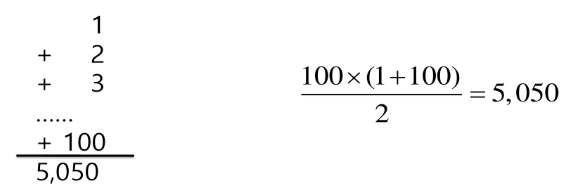

- **위 두 방법 중에서 뭐가 더 좋을까?**
    
    여러 의견이 있겠지만, 알고리즘에 한정해서는 오른쪽 방법이 더 좋음
    
    → 변수를 덜 쓰고, 빠르기 때문
    

### 알고리즘의 효율

- **공간적 효율성과 시간적 효율성**
    - **공간적 효율성:** 연산량 대비 얼마나 **적은 메모리 공간**을 요하는가
    - **시간적 효율성:** 연산량 대비 얼마나 **적은 시간**을 요하는가
- **효율성을 뒤집어 표현하면 복잡도(Complexity):**
    - 복잡도가 높을 수록 효율성은 저하

### 복잡도의 점근적 표기

- 시간 (또는 공간) 복잡도는 입력 크기에 대한 함수로 표기하는데,
이 함수는 주로 여러 개의 항을 가지는 다항식
- 이를 단순한 함수로 표현하기 위해 점근적 표기(Asymptotic Notation)를 사용
- 입력 크기 N이 무한대로 커질 때의 복잡도를 간단히 표현하기 위해 사용하는 표기법
    - **`O(Big-Oh)`**
    - **`Ω(Big-Omega)`**
    - **`Θ(Big_Theta)`**

**아래 코드는 몇 번 반복될까?** `N번`

```python
N = int(input()

for i in range(N):
		print(i, end=' ')
```

**O(Big-Oh) 표기**

- O-표기는 복잡도의 점근적 상한을 나타냄
- 복잡도가 **`f(N) = 2N^2 - 7N + 4`** 라면, f(N)의 O-표기는 **`O(N^2)`**
- f(N)의 단순화된 표현은 **`N^2`** 임
- 단순화된 함수 **`N^2`**에 임의의 상수 c를 곱한 **`cN^2`**이 N이 증가함에 따라 f(N)의 상한이 됨 (단 c > 0)
    
    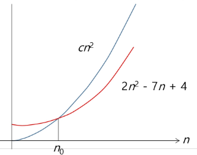
    

```python
N = int(input())

for i in range(N):
		print(i, end = ' ')

for j in range(N):
		print(j, end = ' ')
			
for k in range(N):
		print(k, end = ' ')
		
**# 실제 : O(3N)
# 빅오 표기 : O(N)**
```

```python
N = int(input())

for i in range(N):
		for j in range(N):
				print(i, end = ' ')
			
		for k in range(N):
				print(i, end = ' ')
				
**# 실제 : O(2 * N^2)
# 빅오 표기 : O(N^2)**
```

```python
# 상수 횟수 반복하는 코드:
N = int(input())

for i in range(50):
		print(i)
		
# 실제 : O(50)
# 빅오 표기 : O(1)
```

**빅오 표기법을 `O(5N)` 과 같이 표현하기도 함**

- 5배수 강조해서 표현하고 싶을 때:
    - 알고리즘 성능을 미세하게 비교하고 싶은 경우

**빅오 표기법으로 성능 비교하기**

- 어떤 알고리즘이 더 좋은 성능을 낼까?
    
    
    

**→ N의 값이 1 이상이면 왼쪽의 알고리즘이 더 좋을 것임**

- 만약 다만 N이 크지 않은게 확실하고 (ex: 5),
오른쪽의 코드가 설계하는데 시간이 훨씬 짧게 든다면?
    
    → **오른쪽의 코드가 더 좋은 것일 수도 있음:**
    
    → **상황에 맞춰 적절한 알고리즘을 사용하자**
    

### 자주 사용하는 O-표기

| **O(1)** | **상수 시간 (Constant time)** |
| --- | --- |
| **O(log N)** | **로그 (대수) 시간 (Logarithmic time)** |
| **O(N)** | **선형 시간 (Linear time)** |
| **O(N log N)** | **로그선형 시간 (Log-linear time)** |
| **O(N^2)** | **제곱 시간 (Quadratic time)** |
| **O(N^3)** | **세제곱 시간 (Cubic time)** |

**O(N)**

- 만약 N이 10000이라면 몇 번 반복하는 프로그램일까?
    
    **→ 10000회**
    

**O(N^2)**

- 만약 N이 10000이라면 몇 번 반복하는 프로그램일까?
    
    **→ 10000 * 10000 = 100000000 (1억)**
    

**O(log N)**

- 만약 N이 10000이라면 몇 번 반복하는 프로그램일까?
    - 알고리즘 이론에서 Log의 밑수는 10이 아니라 2임

**O(log N)은 O(1)보다는 느리지만, 유사한 성능을 보인다고 결론낼 수 있음**

**O(N log N)은 O(N)보다는 느리지만, 유사한 성능을 보인다고 결론낼 수 있음**

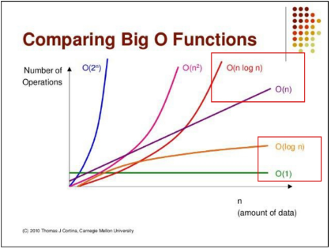

### 효율적인 알고리즘이 필요한 이유

- 10억 개의 숫자를 정렬하는데 PC에서 O(N^2) 알고리즘은 300여년이 걸리는데 반해
O(N log N) 알고리즘은 5분만에 정렬함
    
    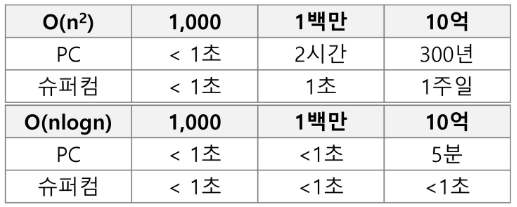
    
- 효율적인 알고리즘은 슈퍼 컴퓨터보다 더 큰 가치가 있다
- 값 비싼 H/W의 기술 개발보다 효율적인 알고리즘 개발이 훨씬 더 경제적임

# 진수

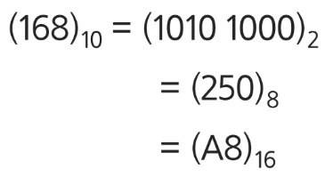

| 10진수 | 사람이 사용하는 진수, 수 하나를 0 ~ 9로 표현 |
| --- | --- |
| 2진수 | 컴퓨터가 사용하는 진수, 수 하나를 0, 1로 표현 |
| 8진수 | 2진수를 더 가독성 있게 사용, 0 ~ 7 |
| 16진수 | 2진수를 더 가독성 있게 사용, 0 ~ 9, A ~ F |

**16진수를 사용하는 이유**

- **2진수를 사람이 이해하기 쉽도록, 10진수로 변환 시:**
    
    → 인간이 이해하기는 편하지만, **연산이 오래 걸림**
    
- **2진수를 사람이 이해하기 편하도록, 16진수로 변환 시:**
    
    → 인간이 이해하기 어렵지만, **연산 속도가 매우 빠름**
    

### 진수 관련 용어

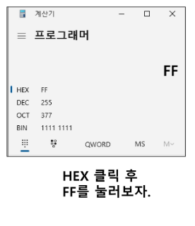

| HEX | 16진수 |
| --- | --- |
| DEC | 10진수 |
| OCT | 8진수 |
| BIN | 2진수 |

### 진법 변환

**10진수 → 타 진수로 변환**

- 원하는 타진법의 수로 나눈 뒤, 나머지를 거꾸로 읽기
    
    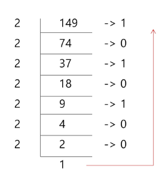
    
- **코드로 만들어보기**

```python
tar = 149
result = []

while tar != 0:
    result.append(tar % 2)
    tar //= 2

result.reverse()

print(result) 
# [1, 0, 0, 1, 0, 1, 0, 1]
```

**2진수를 10진수로 변환**

- 수기로 계산할 수 있어야 함
    
    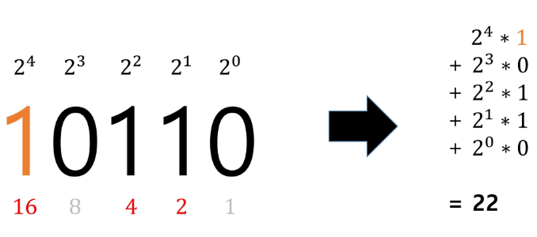
    

**16진수 ↔ 2진수 변환**

- **2진수 ↔ 10진수 간 변환은 연산이 많으나,
2진수 ↔ 16진수 간 변환은 연산이 없다.**
- **진법 변환을 빠르게 하려면 우측 진수 표를 암기하는 것을 권장**

- **16진수를 입력 받으면 2진수로 출력해주는 프로그램 작성하는 방법:**
    
    오른쪽 표에서 2진수 부분을 전부 리스트에 저장해두고 구현
    

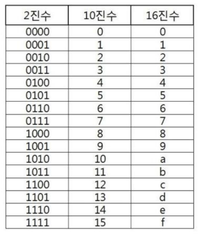

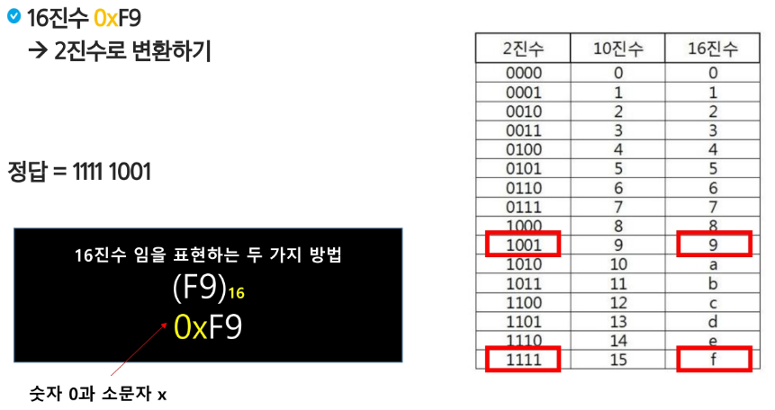


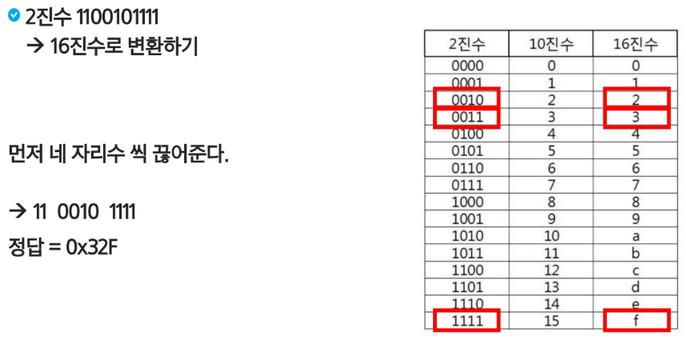

# 비트 연산

## 비트 & 바이트

- 1bit: 0과 1을 표현하는 정보의 단위
- 1Byte: 8 bit를 묶어 1Byte라고 한다

```
1001011011011100 = 16bit = 2Byte
```

## 비트 연산

- 컴퓨터의 CPU는 0과 1로 다루어져 동작 되며,
내부적으로 비트 연산을 사용해 덧셈, 뺄셈, 곱셈 등을 계산함
- 사칙 연산과 비트 연산은 부호는 같을 수 있어도 분명히 다름. 
프로그래밍에서 비트 연산을 활용한 코딩 방법을 익혀보자

| **연산자** | **역할** | **부호** | **기능** | 예시 |
| --- | --- | --- | --- | --- |
| **AND** | **a AND b:** 둘 다 1일 때만 1 | **`&`** | **비트 단위로 AND 연산 수행** | **`A & B`** |
| **OR** | **a OR b:** 둘 중 하나만 1이면 1 | **`|`** | **비트 단위로 OR 연산 수행** | **`A | B`** |
| **XOR** | **a XOR b**: 둘이 같은 경우 0 | **`^`** | **비트 단위로 XOR 연산 수행** | **`A * B`** |
| **NOT** | **NOT a: 모든 비트를 반전** | `~` |  | `~A` |
| **Left Shift** |  | **`<<`** | 특정 수 만큼 비트를 왼쪽으로 밀어냄 | **`a << b`** |
| **Right Shift** |  | **`>>`** | 특정 수 만큼 비트를 오른쪽으로 밀어냄 | **`a >> b`** |

### 파이썬에서 진수 변환해 출력하기

- 2진수: `0b` 를 접두사로 붙여 표현
- 8진수: `0o` 를 접두사로 붙여 표현
- 16진수: `0x` 를 접두사로 붙여 표현

```python
**# 10진수를 2진수로 변환**
print(bin(10)) **# 0b1010**

**# 10진수를 16진수로 변환**
print(hex(10)) **# 0xa**
```

```python
**# 2진수를 10진수로 변환**
print(int('1011', 2)) **# 11**

**# 16진수를 10진수로 변환**
print(int('b', 16))   **# 11**
```

### AND와 OR

**파이썬 구현**

- **`7 & 5`** → 2진수로 표현하면 `0b111 & 0b101`
    
    **→ 5**
    
- **`7 | 5`** → 2진수로 표현하면 `0b111 | 0b101`
    
    **→ 7**
    

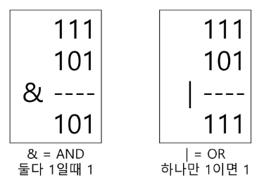

### XOR와  NOT

- **`11 ^ 13`** → 2진수로 표현하면 **`0b1011 ^ 0b1101`**
    
    **→  6 `0b110`**
    
- **`~(0001 1111)` → `1110 0000`**

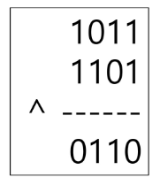

**어떤 값이던 특정 수로 2회 XOR하면 원래 수로 돌아옴**

```python
print(7070 ^ 1004) # 6258
print(6258 ^ 1004) # 7070
```

**파이썬에서 NOT 연산자 수행하기**

→ 파이썬에서 **`~4`** 를 수행하면 **`-5`** 가 출력됨

1. **`4` == `0b0100`** (MSB: 양수임으로 0)
2. NOT 연산자로 인해 **`0b1011`** 이 됨
3. MSB는 1이 되었고 (음수), 나머지 비트는 **`011`** 임
4. 나머지 비트에 대해 2의 보수를 취함 **`0b011 -> 0b100` → `0b100 + 1 = 0b101`**
5. **따라서 `0b1101 == -5` 가 됨**

**암호화에 사용되는 XOR**

- ex) 친구 1과 친구 2는 서로 비밀 코드를 1004로 약속하는 경우


### 비트 연산자

**`<<` Left Shift :** 특정 수 만큼 비트를 왼쪽으로 밀어냄

- **`1 << n`  :** 2^n 의 값을 가짐

**`>>` Right Shift:** 특정 수 만큼 비트를 오른쪽으로 밀어냄

```python
print(int('1101', 2)) **# 13

# 2진수 1101를 왼쪽으로 2회 이동**
print(bin(0b1101 << 2)) **# 0b110100 (52) == 13 * (2 ** 2)**

**# 2진수 1101를 오른쪽으로 2회 이동**
print(bin(0b1101 >> 2)) **# 0b11 (3)** 
```

**비트 연산 응용**

- **`1 << n`  :**
    - **`2^n`** 의 값을 가짐
    - 임베디드 분야에서 계산을 빠르게 하기 위해 사용

- **`i & (1 << n)` :**
    - i의 n번째 비트가 1인지 아닌지를 확인할 수 있음
    
    ```python
    # example
    
    print(1101 & (1 << 2)) **# 4 == 0b0100**
    # 1101에서 2번 bit가 1인지 확인 가능함
    # 결과 값이 0보다 크면 n번째 비트는 1임이 확정됨
    ```
    

### 음수 표현법

- **컴퓨터는** **음수를 ‘2의 보수’로 관리**
- **맨 앞자리 bit (MSB)는 음수 or 양수를 구분하는 비트임**
    
    → 뺄셈의 연산 속도를 올릴 수 있으며, +0과 -0을 따로 취급하지 않기 위해 사용
    
    ```python
    # -5 ~ 5까지 2진수 출력 코드
    
    def B_bit_print(i):
        output = ''
        for j in range(7, -1, -1):
            if i & (1 << j):
                output += '1'
            else:
                output += '0'
        print(output)
    
    for i in range(-5, 6):
        print(f'{i} = ', end='')
        B_bit_print(i)
    
    # 출력 값
    '''
    -5 = 11111011
    -4 = 11111100
    -3 = 11111101
    -2 = 11111110
    -1 = 11111111 
    0 = 00000000
    1 = 00000001
    2 = 00000010
    3 = 00000011
    4 = 00000100
    5 = 00000101
    '''
    ```
    

**2의 보수 예시**

- `10001` 의 2의 보수:
    1.  수를 전부 뒤집고 **`01110`**
    2. 1을 더함 **`01111 (01110 + 1)`**

- **`1111000`** 의 2의 보수:
    1.  수를 전부 뒤집고 **`0000111`**
    2. 1을 더함 **`0001000 (0000111 + 1)`**

**2의 보수를 취한 수를, 한 번 더 2의 보수를 취하면 원래 값으로 돌아옴**

- `10001` 의 2의 보수:
    1.  수를 전부 뒤집고 **`01110`**
    2. 1을 더함 **`01111 (01110 + 1)`**

- **`01111` 의 2의 보수:**
    1.  수를 전부 뒤집고 **`10000`**
    2. 1을 더함 **`10001 (10000 + 1)`**


`-5`를 2의 보수로 표현하는 방법 (수를 8bit로 저장한다고 가정)

> 1. 수 **`5`**를 2진수로 표현 (**0000 0101**)
> 2. **`-5`**는 음수이기에, MSB를 **1**로 바꿔줌 (**1000 0101**)
> 3. 나머지 7bit에 대해, 수를 뒤집고 **1**을 더해주면 됨 (2의 보수)
> 4. 수 **`5`(7bit)** == **`000 0101`**을 뒤집으면 **`111 1010`**이고, **1**을 더하면 **`111 1011`**이 됨
> 5. MSB 뒤에 합쳐줌 (**`1111 1011`**)


# 실수

**파이썬에서 실수 출력 방법**

- 파이썬은 f-string 문법을 지향
    
    ```python
    t1 = 10
    t2 = 3.141592
    
    print(f'변수 값은 {t1} 입니다.')
    print(f'변수 값은 {t2} 입니다.')
    # 변수 값은 10 입니다.
    # 변수 값은 3.141592 입니다.
    ```
    

### 소수점 출력 방법

- `t2:.2f` : `t2` 의 값을 소수점 둘째 자리에서 반올림해 표현
    
    ```python
    t1 = 10
    t2 = 3.141592
    
    print(f'변수 값은 {t1} 입니다.')
    print(f'변수 값은 {t2:.2f} 입니다.')
    # 변수 값은 10 입니다.
    # 변수 값은 3.14 입니다.
    ```
    

### 파이썬에서의 실수 표현 범위

**파이썬은 다른 언어와 달리, 내부적으로 더 큰 규모의 자료 구조를 사용해
훨씬 넓은 범위의 실수를 표현할 수 있음**

- 최대로 표현할 수 있는 값은 `약 1.8 * 10^308` 이고,
이 이상은 inf로 표현
    
    ### 컴퓨터는 실수를 내부적으로 근사적으로 관리
    
- 최소로 표현할 수 있는 값은 `약 5.0 * 10^-324` 이고, 
이 이하는 0으로 표현

**실수는 정확한 값이 아니라 근사 값으로 저장되는데,
이 때 생기는 작은 오차가 계산 과정에서 다른 결과를 가져옴**

```python
print(0.1 + 0.1 + 0.1 == 0.3) # False
```

**소수점이 있는 10진수를 2진수로 변환 예시**

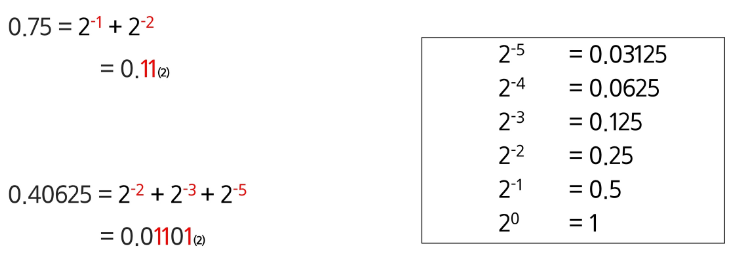

**소수점을 포함한 2진 실수를 10진수로 변환하는 예시**

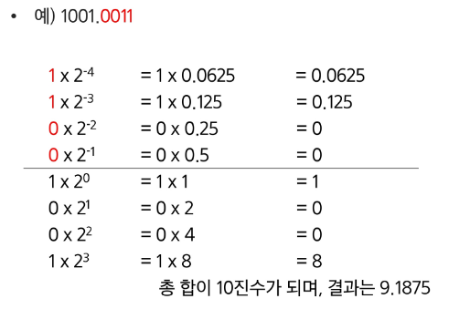

### 실수의 표현

- 컴퓨터는 실수를 표현하기 위해 **부동 소수점(floating-point)표기법을 사용**함
이 표기법은 **IEEE 754** 이라는 컴퓨터에서 부동 소수점을 표기하는 **국제 표준**임
- 부동 소수점 표기 방식은 **소수점의 위치를 고정시켜 표현**하는 방식
    - 소수점의 위치를 왼쪽의 가장 유효한 숫자 다음으로 고정시키고 
    밑수의 지수승으로 표현
    
    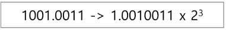
    

### IEEE 754

실수를 저장하기 위한 형식 (IEEE 765, 32bit - Single Precision 표기법 기준)

- 32bit 구조
    
    
    
    - 부호 1비트 : 0이면 양수, 1이면 음수
    - 지수부(exponent) : 부동 소수점의 크기 + bias값
    - 가수부(mantissa) : 실질적 수

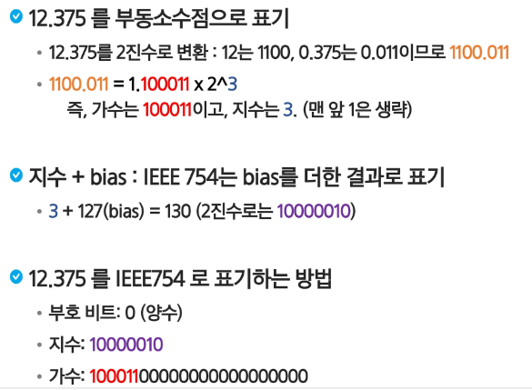

### 정리

**컴퓨터는 실수를 근사적으로 표현**

- **이진법으로 표현할 수 없는 형태의 실수는
정확한 값이 아니라 근사 값으로 저장됨**
- **이 때 생기는 작은 오차가 계산 과정에서 다른 결과를 가져옴**

**실수 자료형의 유효 자릿수**

- **32bit 실수형 유효 자릿수** (10진수) → **약 6자리** (C++)
- **64bit 실수형 유효 자릿수** (10진수) → **약 15자리** (C++, JAVA)
- **파이썬에서는 내부적으로 더 많은 비트를 사용해서
훨씬 넓은 범위의 실수를 표현할 수 있음!**