## 컴퓨터에서의 문자 표현

- 메모리는 숫자만을 저장할 수 있음
- 글자의 모양 그대로 비트맵으로 저장하는 것은 메모리 낭비가 심할 것
- 각 문자에 의해서 대응되는 숫자를 정해 놓고 이것을 메모리에 저장하는 방법을 사용
    
    `영어가 대소문자 합쳐서 52자이므로 6bit면 모두 표현할 수 있다`
    

### **코드 체계**

- 네트워크가 발전하기 전 미국에서는 각 지역 별로 코드 체계를 정해 두고 사용했음
- 인터넷이 발전하면서 서로 간에 정보를 주고 받을 때 정보를 달리 해석한다는 문제 발생

### ASCII

- 위와 같은 혼동을 피하기 위해 제정된 표준안 (1967년)
- ASCII는 7-bit 인코딩으로 128문자를 표현:
    - 출력 불가능한 제어 문자 : 33개
    - 출력 가능한 문자 : 95개
        
        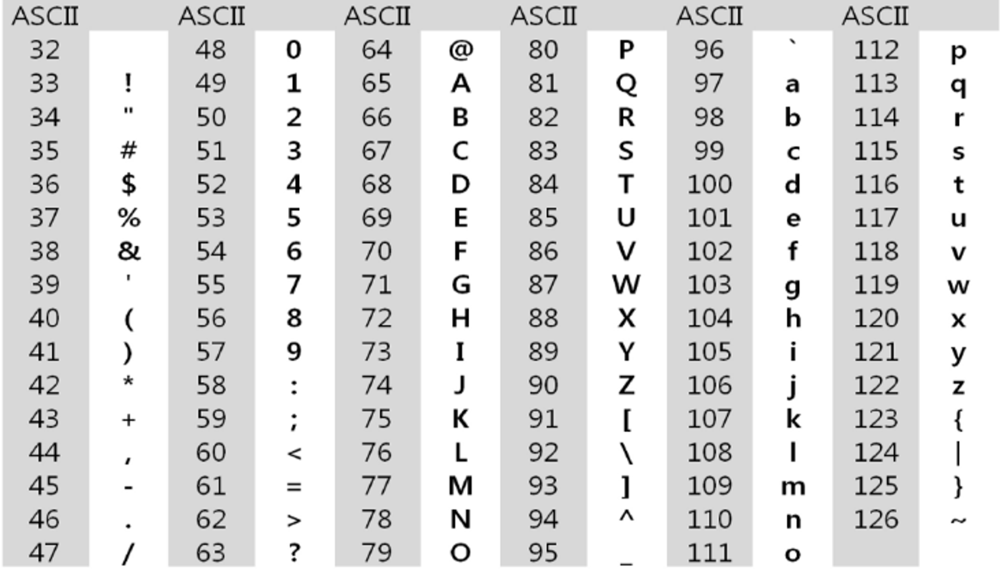
        

### 확장 ASCII:

- 표준 문자 이외의 악센트, 도형, 특수 기호 등 부가적인 문자를 128개 추가할 수 있게 하는 부호
- 표준 ASCII = 7-bit, 확장 ASCII = 8-bit → **추가적인 문자 표현 가능**
- 컴퓨터 생산자와 소프트웨어 개발자가 여러가지 다양한 문자에 할 당할 수 있도록 함
    
    → 이렇게 할당된 학장 부호는 서로 다른 프로그램이나 컴퓨터 사이에 교환되지 못함
    

**표준 ASCII는 마이크로 컴퓨터 하드웨어 및 소프트웨어 사이에서 세계적으로 통용되나
확장 ASCII는 프로그램이나 컴퓨터 등이 그것을 해독할 수 있도록 설계되어 있어야만 해독 가능**

### 유니코드

**오늘날 대부분의 컴퓨터는 문자를 읽고 쓰는데 ASCII 형식을 사용**

그러나 미국 외의 다른 나라에서도 **자국의 문자를 표현하기 위해 코드 체계를 만들어서 사용**하게 됨→ 우리나라도 한글 코드 체계를 만들어 사용했고, **조합형, 완성형** 두 종류를 가지고 있었음

- ASCII 제정 당시와 비슷하게, 국가 간 정보를 주고 받을 때 문제 발생
- 자국의 코드 체계가 타 국가가 가지고 있지 않으면 정보를 잘못 해석할 수 있었음
    
    **→ 다국어 처리를 위한 표준 제정 : 유니코드** 
    

**유니코드도 다시 Character Set으로 분류됨**

- USC-2 / USC-4
- 유니코드를 저장하는 변수의 크기를 정의하나, 바이트 순서에 대해서는 표준화 하지 못함
    
    → 파일 인식시 이 파일이 USC-2, USC-4인지 인식하고,
    각 경우를 구분해서 모두 다르게 구현해야 하는 문제 발생
    
    **유니코드의 적당한 외부 인코딩 필요**
    

**유니코드 인코딩**

- **UTF-8: (in web)**
    - Min : 8-bit, Max: 32bit (1 Byte * 4)
- **UTF-16: (in windows, java)**
    - Min : 16-bit, Max: 32bit (2 Byte * 2)
- **UTF-32: (in unix)**
    - Min : 32-bit, Max: 32bit (4 Byte * 4)

**Python 인코딩**

- 2.x 버전 - ASCII → #-*- coding: utf-8 -*- (첫 줄에 명시)
- 3.x 버전 = 유니코드 UTF-8 → 생략 가능

**다른 인코딩 방식으로 처리 시, 첫 줄에 작성하는 위 항목에 원하는 인코딩 방식을 지정해주면 됨**

---

## 문자열

### 문자열의 분류

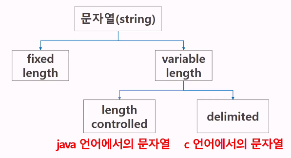

**java에서 String 클래스에 대한 메모리 배치** 

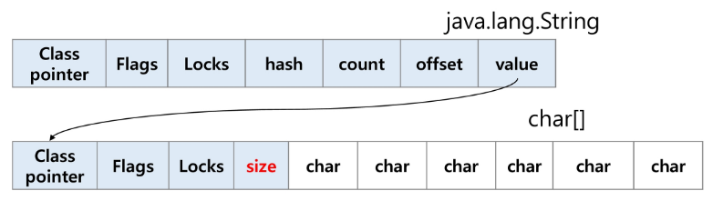

- 그림에서 보이듯, java.lang.String 클래스에는 기본적인 객체 메타 데이터 외에도, 네가지 필드들이 포함돼 있음.
    - **hash:** hash값
    - **count:** 문자열의 길이
    - **offset:** 문자열 데이터의 시작점
    - **value:** 문자열 배열에 대한 참조

**C언어에서 문자열 처리**

- 문자열은 문자들의 배열 형태로 구현된 응용 자료형
- 문자 배열에 문자열을 저장할 때는 항상 **마지막에 끝을 표시하는 Null문자(’\0’)**를 넣어줘야 함.
    
    `char ary[]={'a', 'b', 'c', '\0'};` 또는 `char ary[]="abc"`
    
- 문자열 처리에 필요한 연산을 함수 형태로 제공
    
    `strlen(), strcpy(), strcmp() ...`
    
- ASCII 코드로 저장

**strlen() 함수 만들어 보기**

```python
# '\0'을 만나면 '\0'을 제외한 글자 수를 리턴
# while을 사용해서 완성해보기
def strlen(input_list):
	count = 0
	while input_list[count] != '\0':
		count += 1
	return count
		
a = ['a', 'b', 'c', '\0']
print(strlen(a)) # 3
```

**Java(객체 지향 언어)에서의 문자열 처리**

- 문자열 데이터를 저장, 처리해주는 클래스를 제공
- String 클래스를 사용
    
    `String str="abc" //`  또는 `String str = new String("abc")`
    
- 문자열 처리에 필요한 연산을 연산자, 메소드 형태로 제공
    
    `+` , `length()` , `replace()` , `split()` , `substring()`
    
- 유니코드(UTF16, 2byte)로 저장

**Python에서의 문자열 처리**

- char 타입 없음
- 텍스트 데이터의 취급 방법이 통일돼 있음
- 문자열 기호:
    
    `'` ,  `"` ,  `'''` ,  `"""`
    
    `+` : 연결 (문자열 + 문자열 : 이어 붙여주는 역할)
    
    `*` : 반복 (문자열 * 수 : 수만큼 문자열이 반복)
    
- 문자열은 시퀀스 자료형으로 분류, 시퀀스 자료형에서 사용할 수 있는 인덱싱, 슬라이싱 가능
- 문자열은 튜플과 같이 불변 특성
- 유니코드(UTF8)로 저장

**문자열 뒤집기**

- 자기 문자열을 뒤집는 방법
- 새로운 빈 문자열을 만들어 소스의 뒤에서부터 읽어 타겟에 쓰는 방법
- 자기 문자열을 이용할 경우는 swap을 위한 임시 변수가 필요, 
반복 수행을 문자열 길이의 반만을 수행해야 함

```python
s = 'Reverse this strings'

print(s[::-1])
# sgnirts siht esreveR

# for문 사용해보기
n = len(s)

for i in range(n):
	print(s[-1 - i], end = '')
# sgnirts siht esreveR
```

**문자열 비교**

- **c:** strcmp() 함수를 제공
- **java:** equals() 메서드 제공
- **python:** **`==`** , **`is`**  제공

```python
# while을 사용해 문자열 비교 함수를 만들어보자
def my_strcmp(str_1, str_2):
    i = 0
    n = min(len(str_1), len(str_2))

    while len(str_1) == len(str_2) and i < n and str_1[i] == str_2[i]:
        i += 1
    if i == n:
        print(0)
    else:
        print(-1)

my_strcmp('abc', 'abc')
```

**ASCII**

**`ort(elem)`** : elem의 ASCII 코드 값을 반환

**`chr(num)`** : ASCII 코드의 num에 해당하는 값을 반환

**int()와 같은 c의 atoi() 만들기**

```python
def atoi(input_s):
	i = 0
	for elem in input_s:
		i = i * 10 + ord(elem) - ord('0')
	return i
	
s = '123'
result = atoi(s)

print(result) # 123
print(result + 1) # 124
```

**str() 함수를 사용하지 않고, c의 itoa()를 구현해 보자**

```python
# 양의 점수를 입력 받아 문자열로 변환하는 함수
# 입력 값: 변환할 정수 값, 변환된 문자열을 저장할 문자 배열
# 반환 값: 없음
# 음수를 입력했을 때도 고려해보기
```

---

## 패턴 매칭에 사용되는 알고리즘

### Brute Force (고지식한 알고리즘) `O(MN)`

- 본문 문자열을 처음부터 끝까지 차례대로 순회하면서 
패턴 내의 문자들을 일일이 비교하는 방식으로 동작)
    
    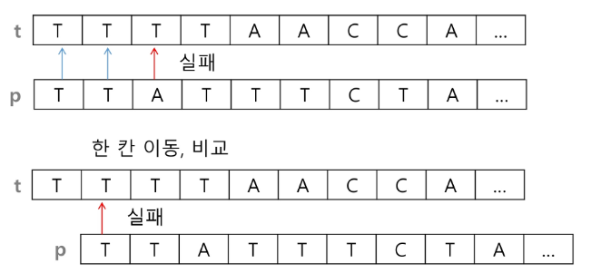
    

```python
# '패턴 p와 일치하는 부분의 개수'

t = 'TTTTTABTTAATTAC'
p = 'TTA'

cnt = 0
for i in range(len(t) - len(p) + 1): # 비교 시작 위치
    for j in range(len(p)):
        if t[i + j] != p[j]:
            break # for j, 다음 글자부터 비교 시작
    **else: # for j, 중단없이 반복되면**
        cnt += 1 # 패턴 개수 1 증가

print(cnt) # 3

#########################################################
def f(t, p):
    '''
    패턴 p와 일치하는 구간의 시작 인덱스 리턴,
    일치하는 경우가 없으면 -1 리턴
    '''
    N = len(t)
    M = len(p)

    for i in range(N - M + 1):
        for j in range((M)):
            if t[i + j] != p[j]:
                break
        else:
            return i
    return -1

t = 'TTTTTATTAATA'
p = 'TTA'
print(f(t, p))
```

```python
def brute_force(pattern, target):
	i = 0 # target의 인덱스
	j = 0 # pattern의 인덱스
	cnt = 0
	while  i < len(target) and j < len(pattern):
		if target[i] != pattern[j]:
			i = i - j
			j = -1
		i = i + 1
		j = j + 1
		if j == len(p):
			cnt += 1
		else:
			return cnt
			

pattern = 'is' # 찾을 패턴
target = 'This is a book~!' # 전체 텍스트
print(brute_force(pattern, target))
```

### KMP 알고리즘 `O(M + N)`

- 불일치가 발생한 텍스트 스트링의 앞 부분에 어떤 문자가 있는지를 미리 알고 있으므로,
불일치가 발생한 앞 부분에 대하여 다시 비교하지 않고 매칭을 수행
- 패턴을 전처리하여 배열 next[M]을 구해서 시작을 최소화함
    - next[M] : 불일치가 발생했을 경우 이동할 다음 위치

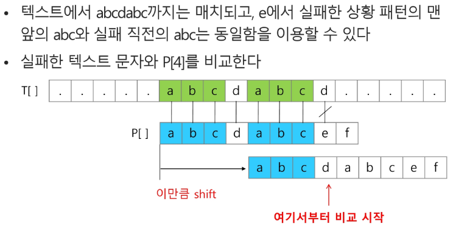

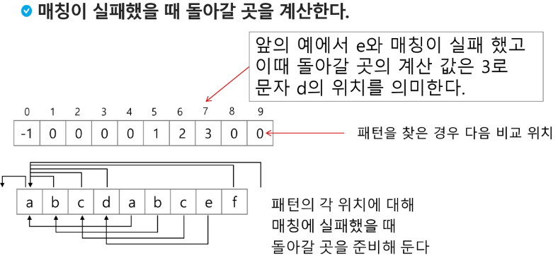

```python
def kmp(t, p):
    N = len(t)
    M = len(p)
    lps = [0] * (M + 1)

    j = 0 # 일치한 개수 == 비교할 패턴 위치
    lps[0] = -1
    for i in range(1, M):
        lps[i] = j
        if p[i] == p[j]:
            j += 1
        else:
            j = 0
    lps[M] = j

    # search
    i = 0
    j = 0
    while i < N and j <= M:
        if j == -1 or t[i] == p[j]: # 첫글자가 불일치했거나, 일치하면
            i += 1
            j += 1
        else:  # 불일치
            j = lps[j]
        if j == M: # 패턴을 찾을 경우
            print(i - M, end=' ')
            j = lps[j]

    print()
    return

t = 'zzzabcdabcdabcefabcdabcef'
p = 'abcdabcef'
kmp(t, p) # 7 16
```

### 보이어-무어 알고리즘

- **오른쪽에서 왼쪽으로 비교**
- 대부분의 상용 소프트웨어에서 채택하고 있는 알고리즘
- 보이어-무어 알고리즘은 패턴에 오른쪽 끝에 있는 문자가 불일치하고, 
**이 문자가 패턴 내에 존재하지 않는 경우, 이동 거리는 무려 패턴의 길이 만큼이 된다.**
- 보이어 무어 알고리즘은 텍스트 문자를 다 보지 않아도 됨
    - 최악의 경우 `O(mn)`
    - 일반적으로 `O(n)` 보다 시간이 덜 듦

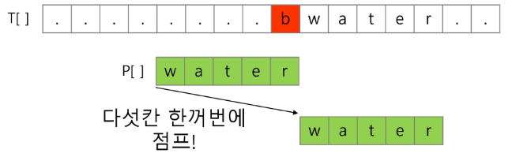

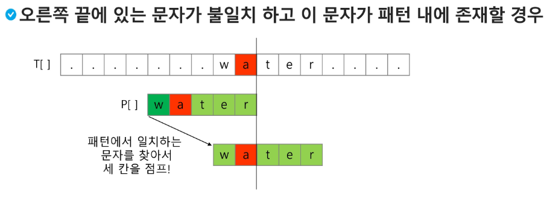

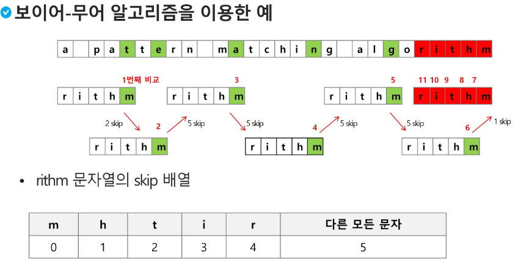

## 문자열 암호화

### 시저 암호:

- 줄리어스 시저가 사용했다고 하는 암호
- **평문으로 사용되고 있는 알파벳을 일정한 문자 수만큼 평행 이동시킴으로써 암호화를 행함**

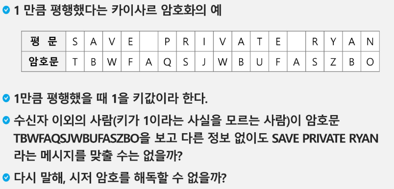

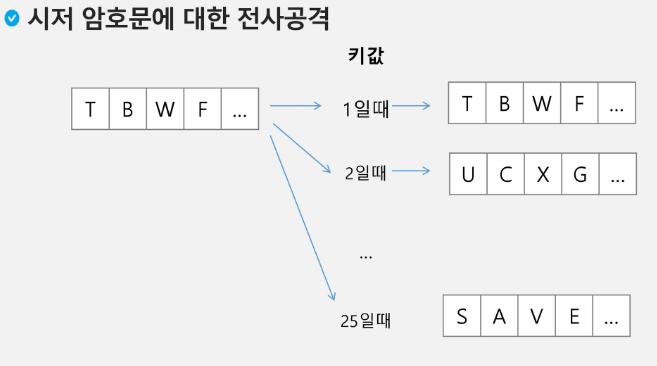

### 문자 변환표를 이용한 암호화 (단일 치환 암호)

- 단순한 카이사르 암호화보다 훨씬 강력한 암호화 기법

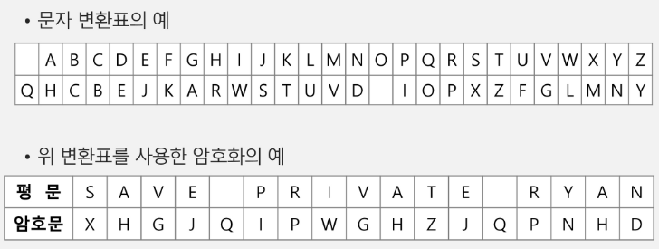

- 복호화 하기 위해서는 모든 키의 조합(key space)가 필요
- 단일 치환 암호의 키 총 수는 1초에 10억개 이상을 적용하는 속도로 조사해도 120억년 이상 소요

### BIT열의 암호화

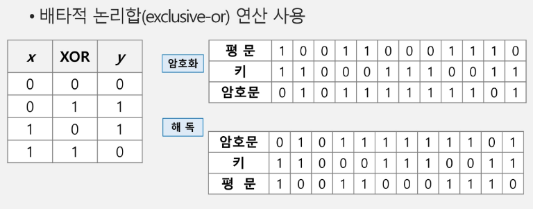