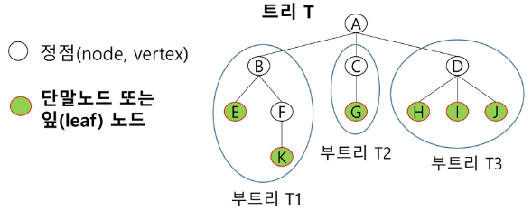
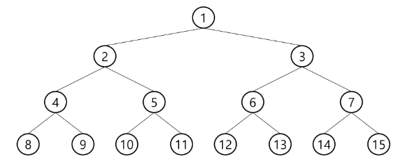

# 트리 (Tree)

**개념**

- **비선형 구조**
- 원소들 간에 **1:N 관계**를 가지는 자료 구조
- 원소들 간에 계층 관계를 가지는 **계층형 자료 구조**
    
    → 트리는 **사이클이 없음**
    
- 상위 원소에서 **하위 원소로 내려가면서 확장**되는 나무 모양의 구조

**정의**

- 한 개 이상의 노드로 이루어진 유한 집합이며 다음 조건을 만족한다.
    - 노드 중 최상위 노드를 루트(Root)라고 한다.
    - 나머지 노드들은 N(≥0)개의 분리 집합 T1 … Tn으로 분리될 수 있다.
- 이들 T1 … Tn은 각각 하나의 트리가 되며 (재귀적 정의) 루트의 부 트리(subtree)라 한다



**용어**

- **노드(node) :** 트리의 원소
    - *트리 T의 노드: A, B, C, D, E, F, G, H, I, J, K*
- **간선(edge) :** 노드를 연결하는 선. 부모 노드와 자식 노드를 연결

- **루트 노드(root node) :** 트리의 시작 노드(A)

- **형제 노드(sibling node) :** 같은 부모 노드의 자식 노드들 (B, C, D)

- **서브 트리(subtree) :** 부모 노드와 연결된 간선을 끊었을 때 생성되는 트리

- **조상 노드 :** 간선을 따라 루트 노드까지 이르는 경로에 있는 모든 노드들
    - *K의 조상 노드 : F, B, A*
- **자손 노드 :** 서브 트리에 있는 하위 레벨의 노드들
    - *B의 자손 노드 : E, F, K*
    - 직계의 경우 부모 - 자식 노드로 표현하는 경우가 많음
    
- **차수(degree) :**
    - **노드의 차수:** 노드에 연결된 자식 노드의 수
        - *B의 차수 : 2 | C의 차수 : 1*
    - **트리의 차수:** 트리에 있는 노드의 차수 중에서 가장 큰 값
        - *트리 T의 차수: 3*
    - **단말 노드(LEAF)**: 차수가 0인 노드 (자식 노드가 없는 노드)
    
- **높이:**
    - **노드의 높이:** 루트에서 노드에 이르는 간선의 수, 노드의 레벨
        - *B의 높이: 1 | F의 높이: 2*
    - **트리의 높이**: 트리에 있는 노드의 높이 중에서 가장 큰 값 (최대 레벨)
        - *트리 T의 높이: 3*
    
    
    

## 이진 트리


- 모든 노드들이 **‘최대’** **2개의 서브 트리를 갖는** 특별한 형태의 트리
- 각 노드가 자식 노드를 최대한 2개 까지만 가질 수 있는 트리
    - 왼쪽 자식 노드 (left child node)
    - 오른쪽 자식 노드 (right child node)

**특성**

- 레벨 i에서 노드의 최대 개수는 2개 `2^i`
- 높이가 h인 이진 트리가 가질 수 있는 노드의 최소 개수는 `h + 1` 개가 되며,
최대 개수는 `2^(h + 1) - 1` 개가 된다.

### 종류

**포화 이진 트리 (Full Binary Tree)**



- 모든 레벨에 노드가 포화 상태로 차 있는 이진 트리
- 높이가 h일 때, 최대의 노드 개수인  `2^(h + 1) - 1` 의 노드를 가진 이진 트리
    - 높이 3일 때 15개의 노드
- 루트를 1번으로 하여  `2^(h + 1) - 1`  까지 정해진 위치에 대한 노드 번호를 가짐

**완전 이진 트리(Complete Binary Tree)**

- 높이가 h이고 노드 수가 n개일 때 (단 `2^h ≤ n ≤ 2^(h + 1)- 1`),
포화 이진 트리의 노드 번호 1번부터 n번까지 빈 자리가 없는 이진 트리
    
    
    
    ex) 노드가 10개인 완전 이진 트리
    

**편향 이진 트리 (Skewed Binary Tree)**

- 높이 h에 대한 최소 개수 개수의 노드를 가지면서 한쪽 방향의 자식 노드만을 가진 이진 트리
    - 왼쪽 편향 이진 트리 | 오른쪽 편향 이진 트리
    
    
    

### 순회

- 트리의 각 노드를 중복되지 않게 전부 방문(visit)하는 것을 말하는데,
트리는 비선형 구조이기 때문에 선형 구조에서와 같이 선후 연결 관계를 알 수 없음

→ 트리의 노드들을 체계적으로 방문하는 것

**전위 순회: `VLR`**


- 부모 노드 방문 후, 자식 노드를 좌/우 순서로 방문
- 방법:
    - 현재 노드 n을 방문하여 처리 → V
    - 현재 노드 n의 왼쪽 서브 트리로 이동 → L
    - 현재 노드 n의 오른쪽서브 트리로 이동 → R
    
    ```python
    def pre_order(T):
        if T:
            print(T, end = ' ') 
            pre_order(left[T])
            pre_order(right[T])
    ```
    

**중위 순회: `LVR`**


- 왼쪽 자식 노드, 부모 노드, 오른쪽 자식 노드 순으로 방문
    - 현재 노드 n의 왼쪽 서브 트리로 이동 → L
    - 현재 노드 n을 방문하여 처리 → V
    - 현재 노드 n의 오른쪽서브 트리로 이동 → R
    
    ```python
    def pre_order(T):
        if T:
            pre_order(left[T])
            print(T, end = ' ')
            pre_order(right[T])
    ```
    

**후위 순회: `LRV`**


- 자식 노드를 좌/우 순서로 방문한 후, 부모 노드로 방문
    - 현재 노드 n의 왼쪽 서브 트리로 이동 → L
    - 현재 노드 n의 오른쪽 서브 트리로 이동 → R
    - 현재 노드 n을 방문하여 처리 → V
    
    ```python
    def pre_order(T):
        if T:
            pre_order(left[T])
            pre_order(right[T])
            print(T, end = ' ')
    ```
    

### 표현

**배열을 이용한 이진 트리 표현**

- 이진 트리의 각 노드 번호를 다음과 같이 부여
- 루트의 번호를 1로 함
- 레벨 n에 있는 노드에 대해 왼쪽부터 오른쪽으로 `2^n` ~ `2^(n+1) - 1` 까지 번호를 차례로 부여
    
    
    
- **노드 번호의 성질**
    - 노드 번호가 i인 노드의 부모 노드 번호: `i / 2`
    - 노드 번호가 i인 노드의 왼쪽 자식 노드 번호: `2^i`
    - 노드 번호가 i인 노드의 오른쪽 자식 노드 번호: `2^i + 1`
    - 레벨 n의 노드 번호 시작 번호: `2^n`


→ 배열이 너무 크고 낭비되는 경우가 많음

**부모 번호를 인덱스로 자식 번호를 저장: `left / right`**


**자식 번호를 인덱스로 부모 번호를 저장: `par`** 


***→ par 배열을 쓰는 이유: 루트(조상) 찾는 목적***


- **배열을 이용한 이진트리 표현의 단점:**
    - 편향 이진 트리의 경우에는 사용하지 않는 배열 원소에 대한 메모리 공간 낭비 발생
    - 트리의 중간에 새로운 노드를 삽입하거나, 기존의 노드를 삭제할 경우
    배열의 크기 변경 어려워서 비효율적임

```python
**# left / right 버전**

'''
13
1 2 1 3 2 4 3 5 3 6 4 7 5 8 5 9 6 10 6 11 7 12 11 13
'''

def pre_order(node): # 전위 순회 (부모 -> 왼쪽 -> 오른쪽)
    if node == 0:
        return
    print(node, end=' ')    # 전위 순회
    pre_order(left[node])
    # print(node, end=' ')  # 중위 순회
    pre_order(right[node])
    # print(node, end=' ')  # 후위 순회

#################################################################################

N = int(input()) # 정점의 개수 (정점: 1 ~ N번)
arr = list(map(int, input().split()))

par = [0] * (N + 1)
left = [0] * (N + 1)    # 부모를 index로 왼쪽 자식 번호를 저장할 리스트
right = [0] * (N + 1)   # 부모를 index로 오른쪽 자식 번호를 저장할 리스트
# ex) left[3] = 2 : 3번 부모의 왼쪽 자식은 2번

for i in range(N - 1): # 간선의 개수: 정점 개수 - 1
    parent, child = arr[i * 2], arr[(i * 2) + 1]
    if left[parent] == 0:       # 해당 부모 index에 왼쪽 자식이 없다면,
        left[parent] = child    # 왼쪽에 삽입
    else:                       # 해당 부모 index에 왼쪽에 자식이 있다면
        right[parent] = child   # 오른쪽에 삽입
    par[child] = parent         #

print('left', left)     # left [0, 2, 4, 5, 7, 8, 10, 12, 0, 0, 0, 13, 0, 0]
print('right', right)   # right [0, 3, 0, 6, 0, 9, 11, 0, 0, 0, 0, 0, 0, 0]
print('par', par)       # par [0, 0, 1, 1, 2, 3, 3, 4, 5, 5, 6, 6, 7, 11]

c = N
while par[c]!=0:        # 부모가 있으면
    print(c)
    c = par[c]          # 부모를 새로운 자식으로 두고
root = c                # 더이상 부모가 없으면 root
print(root) # 1

pre_order(root)
```

**연결 리스트를 이용한 이진 트리의 표현**

- 배열을 이용한 이진 트리 표현의 단점을 보완
- 연결 자료 구조를 이용한 이진 트리의 표현
    - 이진 트리의 모든 노드는 최대 2개의 자식 노드를 가지므로,
    일정한 구조의 단순 연결 리스트 노드를 사용해 구현
        
        
        


→ 완전 이진 트리의 연결 리스트 표현

```python
**# 연결 리스트를 이용한 이진 트리 코드**

from collections import deque

class TreeNode:
    def __init__(self, key):
        self.key = key  # 노드의 값
        self.left = None  # 왼쪽 자식 노드를 가리킴
        self.right = None  # 오른쪽 자식 노드를 가리킴

class BinaryTree:
    def __init__(self):
        self.root = None  # 트리의 루트 노드

    # 새로운 노드를 삽입하는 함수 (레벨 순서 삽입)
    def insert(self, key):
        new_node = TreeNode(key)
        if self.root is None:
            self.root = new_node
            return

        # 레벨 순서로 트리를 탐색하기 위해 큐를 사용
        queue = deque([self.root])

        while queue:
            node = queue.popleft()

            # 왼쪽 자식이 비어있으면 삽입
            if node.left is None:
                node.left = new_node
                break
            else:
                queue.append(node.left)

            # 오른쪽 자식이 비어있으면 삽입
            if node.right is None:
                node.right = new_node
                break
            else:
                queue.append(node.right)

    def inorder_traversal(self):
        # 중위 순회를 통해 트리의 노드들을 출력하는 함수
        return self._inorder_traversal(self.root, [])

    def _inorder_traversal(self, node, result):
        if node:
            self._inorder_traversal(node.left, result)
            result.append(node.key)
            self._inorder_traversal(node.right, result)
        return result

# 예제 사용법
if __name__ == "__main__":
    tree = BinaryTree()
    tree.insert(50)
    print("Inorder Traversal:", tree.inorder_traversal())
    tree.insert(30)
    print("Inorder Traversal:", tree.inorder_traversal())
    tree.insert(20)
    print("Inorder Traversal:", tree.inorder_traversal())
    tree.insert(40)
    print("Inorder Traversal:", tree.inorder_traversal())
    tree.insert(70)
    print("Inorder Traversal:", tree.inorder_traversal())
    tree.insert(60)
    print("Inorder Traversal:", tree.inorder_traversal())
    tree.insert(80)

    print("Inorder Traversal:", tree.inorder_traversal())
```

```python
# 연결 리스트를 이용한 이진 트리 코드

from collections import deque

class TreeNode:
    def __init__(self, key):
        self.key = key  # 노드의 값
        self.left = None  # 왼쪽 자식 노드를 가리킴
        self.right = None  # 오른쪽 자식 노드를 가리킴

class BinaryTree:
    def __init__(self): # BinaryTree 객체가 생성될 때 호출
        self.root = None  # 기본적으로 갖는 루트 노드: None으로 설정해 비어있음을 나타냄

    # 새로운 노드를 삽입하는 함수 (레벨 순서 삽입)
    def insert(self, key):
        new_node = TreeNode(key) # TreeNode를 이용해 생성된 새 노드
        if self.root is None:  # 트리가 비어있으면 (self.root가 None인 경우)
            self.root = new_node # new_node를 루트 노드로 설정하고 반환
            return

        # 만약 트리가 비어있지 않은 경우: Deque를 사용해 레벨 순서로 트리를 탐색
        queue = deque([self.root]) # 루트 노드를 큐에 추가

        while queue: # 큐에 자료가 있는 동안
            node = queue.popleft() # 큐에서 노드를 꺼냄

            if node.left is None:    # 왼쪽 자식이 비어있으면
                node.left = new_node # 삽입
                break
            else:                       # 비어있지 않으면
                queue.append(node.left) # 왼쪽 자식을 큐에 추가해 다음 노드를 탐색할 수 있도록 함

            if node.right is None:    # 오른쪽 자식이 비어있으면
                node.right = new_node # 삽입
                break
            else:                        # 비어있지 않으면
                queue.append(node.right) # 오른쪽 자식을 큐에 추가해 다음 노드를 탐색할 수 있도록 함

    def inorder_traversal(self):
        '''중위 순회를 통해 트리의 노드들을 출력하는 함수'''
        return self._inorder_traversal(self.root, []) # (트리의 루트 노드, 결과를 저장할 리스트)

    def _inorder_traversal(self, node, result):
        if node: # 노드가 존재하면
            self._inorder_traversal(node.left, result)  # 왼쪽 서브트리의 노드를 중위 순회
            result.append(D[node.key])                  # 결과 추가
            self._inorder_traversal(node.right, result) # 오른쪽 서브 트리의 노들르 중위 순회
        return result

for tc in range(1, 11):
    N = int(input())
    D = {}
    tree = BinaryTree() # 클래스 호출

    for _ in range(N):
        node, node_v, *adjL = input().split()
        node = int(node)
        D[node] = node_v
        tree.insert(node) # 클래스 매서드

    print(f'#{tc}', ''.join(tree.inorder_traversal()))

```

**인접 리스트를 활용한 이진 트리의 표현**

- 그래프처럼 푼다

```python
**# 인접 리스트를 이용 (DFS)**

'''
13
1 2 1 3 2 4 3 5 3 6 4 7 5 8 5 9 6 10 6 11 7 12 11 13
'''

def dfs(node):
    if node == -1:
        return

    preorder.append(node)
    dfs(graph[node][0])
    inorder.append(node)
    dfs(graph[node][1])
    postorder.append(node)

N = int(input())
E = N - 1
arr = list(map(int, input().split()))
graph = [[] for _ in range(N + 1)]
# append 를 통해 갈 수 있는 경로를 추가하기
for i in range(E):
    p, c = arr[i * 2], arr[i * 2 + 1]
    graph[p].append(c)

# 없는 경우 -1로 데이터를 저장하기 위한 코드("좌우 경로가 있는가 ?")
# 탐색 시 index 오류를 방지하기 위해 없는 경로를 -1로 저장하였습니다.
for i in range(N + 1):
    while len(graph[i]) < 2:
        graph[i].append(-1)

preorder = []
inorder = []
postorder = []

dfs(1)

print(*inorder)
print(*preorder)
print(*postorder)
```

## 이진 탐색 트리 (BST: Binary Search Tree)

- DATA들을 빠르게 검색할 수 있도록 체계적으로 저장을 해 두고,
최대 `O(log n)` 의 빠른 속도로 값을 검색할 수 있는 자료 구조
- 빠르게 검색될 수 있도록, 특정 규칙을 갖는 이진 트리 형태로 값을 저장해 둔다.

**List vs BST**

|  | LIST | BST |
| --- | --- | --- |
| 삽입 | O(n), 단 맨 끝 삽입은 O(1) | 평균 O(log n) |
| 삭제 | O(n), 단 맨 끝 삭제는 O(1) | 평균 O(log n) |
| 탐색 | O(n) | 평균 O(log n) |

→ BST는 리스트보다 더 빠른 삽입 / 삭제 / 탐색이 가능함 (트리의 높이 만큼만 탐색)

- 파이썬 공식 Library에는 BST 자료 구조가 내장되어있지 않아, 직접 구현해야 함

### SET 동작 원리

1. **insert(3)** 
    1. 처음 등장하는 값은 root에 저장됨
    2. 이후 비교할 노드 값 보다 target 값이 더 큰 경우 우측 자식 노드로 배정되고
    그렇지 않으면 왼쪽 자식 노드로 배정됨
    
    
    
2. **insert(5)**
    
    
    
    
    
    - 값 5는 root의 노드 값 3보다 크기 때문에, 우측 자식 노드로 배정
    
3. **insert(1)**
    
    
    
    
    
    - 값 1은, root의 노드 값 3보다 작기 때문에, 왼쪽 자식 노드로 배정

1. **insert(2)**
    1. root부터 시작해, 자기 자리를 찾아 배치됨
    
    
    

1. **insert(7)**
    
    
    

1. **insert(4)**
    
    
    

1. **insert(-5)**
    
    
    

### 탐색 연산:

1. **find(13)**


**BST에서 DFS 중위 순회를 하게 되면, key 값이 작은 순서대로 탐색이 가능함**


- dummy 노드는 편지를 받자마자 즉시 되돌려 준다고 생각하면 쉬움
- 때문에 바닥 노드는 자기 자신을 확인하는 것

**탐색 성능**

- **탐색 / 삭제 / 삽입 시간은 트리의 높이 만큼 시간이 걸림: `O(h)`**
- **평균의 경우: `O(log N)`** → 이진 트리가 균형적으로 생성되어 있음
- **최악의 경우: `O(N)`** → 한 쪽으로 치우친 경사 이진 트리의 경우 (순차 탐색과 같음)

### 삭제 연산

- 아래 트리에 대하여 13, 12, 9를 차례로 삭제해 보자
    
    
    

| **값** | **경우** | **동작** |
| --- | --- | --- |
| **13** | **리프 노드 삭제** | **그냥 삭제** |
| **12** | **자식이 하나 있는 노드** | **삭제하고자 하는 노드의 자식[15]과 부모[9]를 연결 후 삭제** |
| **9** | **자식이 두 개 있는 노드** | **삭제하고자 하는 노드의 왼쪽 서브 트리의 가장 큰 값[6] or 오른쪽 서브 트리의 가장 작은 값[13]을 삭제하고자 하는 노드에 삽입 후 옮겨진 노드 삭제** |

**시간 복잡도: `O(log N)`**

**→ 탐색하고 삭제하기 때문**

### CODE

```python
'''
7
3 5 1 2 7 4 -5
'''

class Node:
    def __init__(self, key):
        self.key = key      # 노드의 값
        self.left = None    # 왼쪽 자식 노드를 가리킴
        self.right = None   # 오른쪽 자식 노드를 가리킴

class BinarySearchTree:
    def __init__(self):     # BinarySearchTree 객체가 생성될 때 호출
        self.root = None    # 기본적으로 갖는 루트 노드: None으로 설정해 비어있음을 나타냄

    def insert(self, key):
        '''새로운 노드를 삽입하는 함수'''
        if self.root is None:               # 루트가 비어있으면 (self.root가 None인 경우)
            self.root = Node(key)           # Node(key)를 호출해 좌우 자식이 비어있는 객체를 생성 후 루트로 삼음
        else:                               # 루트가 설정돼 있으면
            self._insert(self.root, key)    # 루트와 키로 삽입 함수 호출

    def _insert(self, node, key):
        if key < node.key:  # 입력받은 값이 만약 현재 바라보는 노드 값보다 작은데,
            if node.left is None:               # 노드의 왼쪽 자식이 비어있으면
                node.left = Node(key)           # 삽입
            else:                               # 왼쪽 자식이 비어있지 않으면 (자식이 있으면)
                self._insert(node.left, key)    # 왼쪽 자식을 바라보는 노드로 해서 재귀 호출
        else:               # 만약 입력받은 값이 현재 바라보는 노드 값보다 작지 않은데,
            if node.right is None:              # 노드의 오른쪽 자식이 비어있으면
                node.right = Node(key)          # 삽입
            else:                               # 오른쪽 자식이 비어있지 않으면 (자식이 있으면)
                self._insert(node.right, key)   # 왼쪽 자식을 바라보는 노드로 해서 재귀 호출

    def search(self, key):
        return self._search(self.root, key)

    def _search(self, node, key):
        if node is None or node.key == key:         # None이거나 (dummy) 찾고자 하는 key가 노드의 key와 같다면
            return node                             # 노드 반환
        if key < node.key:                          # 현재 바라보는 노드의 값보다 key가 작으면
            return self._search(node.left, key)     # 왼쪽 자식을 바라보는 노드로 해서 search 함수 재호출
        else:                                       # 현재 바라보는 노드의 값보다 key가 작지 않으면
            return self._search(node.right, key)    # 오른쪽 자식을 바라보는 노드로 해서 search 함수 재호출

    def inorder_traversal(self):
        '''중위 순회'''
        self._inorder_traversal(self.root)

    def _inorder_traversal(self, node):
        if node: # 노드가 존재하면
            self._inorder_traversal(node.left)  # 왼쪽 서브트리의 노드를 중위 순회
            print(node.key, end=' ')            # 결과 추가
            self._inorder_traversal(node.right) # 오른쪽 서브 트리의 노드를 중위 순회

####################################################################################

N = int(input())
arr = list(map(int, input().split()))

bst = BinarySearchTree()

for num in arr:
    bst.insert(num)

print("중위 순회 결과:", end=' ')
bst.inorder_traversal()  # 중위 순회: -5 1 2 3 4 5 7

# 탐색 예제
key = 5
result = bst.search(key)
if result:
    print(f"\n키 {key} 찾음.")
else:
    print(f"\n키 {key} 못 찾음.")

```

### **정리**

- 탐색 작업을 효율적으로 하기 위한 자료 구조
- 모든 원소는 서로 다른 유일한 key를 가짐
    - 왼쪽 서브 트리 key < 루트 노드 key < 오른쪽 서브 트리 key
    - 왼쪽 서브 트리와 오른쪽 서브 트리도 이진 탐색 트리임
    - 이진 탐색 트리의 경우 완전 이진 트리를 보장하지 않음
- 삽입을 위해 **root부터 바닥 노드까지 탐색**을 하며 자기 위치를 찾음
    
    → 트리의 **높이(h)만큼 탐색 시간이 걸림:**
    
    **트리의 높이: `log N ~ N`**
    
    `2^h - 1` = 노드 수(N) → `log N = h`
    
- **중위 순회하면 오름차순**으로 정렬된 값을 얻을 수 있음
    
    

# 힙 (heap)

**완전 이진 트리에 있는 노드 중에서 키 값이 가장 큰 노드나, 작은 노드를 찾기 위해서 만든 자료 구조**

### **최대 힙(max heap)**

- key 값이 가장 큰 노드를 찾기 위한 완전 이진 트리
- 부모 노드의 key 값 > 자식 노드의 key 값
- ROOT: key 값이 가장 큰 노드


### **최소 힙(min heap)**

- key 값이 가장 작은 노들르 찾기 위한 완전 이진 트리
- 부모 노드의 key 값 < 자식 노드의 key 값
- ROOT: key 값이 가장 작은 노드


- **힙은 항상 완전 이진 트리 형태**


   **→ 1. 완전 이진 트리가 아님** 

   **→ 2. 최소 힙, 최대 힙 둘 다 아님**

## 연산

### 삽입

- 힙에서의 삽입 연산은 뒤에서부터 이루어짐


- 자리 정렬 시 최대 힙의 경우 자식 노드 중 더 큰 값과 자리를 바꿈 (최소 힙은 반대)

### 삭제

- 루트 노드의 원소만을 삭제할 수 있음
- 루트 노드의 원소를 삭제해 반환
- 힙의 종류에 따라 최대 값 or 최소 값을 구할 수 있음


### CODE

```python
'''
7
20 15 19 4 13 11 17

7
20 15 19 4 13 11 23
'''

# 최대힙
def enq(n):
    global last
    last += 1   # 마지막 노드 추가 (완전 이진 트리 유지) : len 연산을 피하기 위해
    h[last] = n # 마지막 노드에 데이터 삽입
    print(h, last)
    c = last    # 부모>자식 비교를 위해
    p = c//2    # 부모 번호 계산 (자식의 인덱스 번호를 이용해 부모 인덱스 구하기)
    while p >= 1 and h[p] < h[c]:   # 부모가 있는데, 더 작으면 (제자리를 찾거나, 루트일 때 까지)
        h[p], h[c] = h[c], h[p]     # 교환
        c = p
        p = c//2

def deq():
    global last
    tmp = h[1]      # 루트의 키값 보관 (마지막 노드 값을 복사)
    h[1] = h[last]
    last -= 1
    p = 1           # 새로 옮긴 루트
    c = p*2
    while c <= last:  # 자식이 있으면
        if c+1 <= last and h[c] < h[c+1]: # 오른쪽 자식이 있고 더 크면
            c += 1
        if h[p] < h[c]:     # 부모가 더 작으면
            h[p], h[c] = h[c], h[p] # swap
            p = c
            c = p*2
        else:
            break
    return tmp      # 뽑은 값 반환

N = int(input())          # 필요한 노드 수
arr = list(map(int, input().split()))

h = [0]*(N+1)   # 최대 힙: 완전 이진 트리 보장 -> 1차원 리스트로 구현 가능 (N 노드의 자식: N * 2, N * 2 + 1)
last = 0        # 힙의 마지막 노드 번호

for num in arr:
    enq(num)

print(h)

while last > 0:
    print(deq(), end=' ')

```

```python
'''
7
20 15 19 4 13 11 17

7
20 15 19 4 13 11 23
'''

# 최소힙
def enq(n):
    global last
    last += 1   # 마지막 노드 추가(완전이진트리 유지)
    h[last] = n # 마지막 노드에 데이터 삽입
    c = last    # 부모>자식 비교를 위해
    p = c//2    # 부모번호 계산
    while p >= 1 and h[p] > h[c]:   # 부모가 있는데, 더 크면
        h[p], h[c] = h[c], h[p]  # 교환
        c = p
        p = c//2

def deq():
    global last
    tmp = h[1]   # 루트의 키값 보관
    h[1] = h[last]
    last -= 1
    p = 1           # 새로 옮긴 루트
    c = p*2
    while c <= last:  # 자식이 있으면
        if c+1 <= last and h[c] > h[c+1]:  # 오른쪽자식이 있고 더 작으면
            c += 1
        if h[p] > h[c]:
            h[p], h[c] = h[c], h[p]
            p = c
            c = p*2
        else:
            break
    return tmp

N = int(input())          # 필요한 노드 수
arr = list(map(int, input().split()))

h = [0]*(N+1)   # 최대힙
last = 0        # 힙의 마지막 노드 번호

for num in arr:
    enq(num)

print(h)

while last > 0:
    print(deq(), end=' ')

```

```python
# 라이브러리 사용
'''
7
20 15 19 4 13 11 17

7
20 15 19 4 13 11 23
'''
# import heapq
from heapq import heappush, heappop

N = int(input())          # 필요한 노드 수
arr = list(map(int, input().split()))

heap = []  # 최대힙을 구현하기 위한 리스트

# 최소힙 ( 기본 )
for num in arr:
    heappush(heap, num)

print([x for x in heap])  # 힙의 내부 상태를 출력 (음수로 저장된 상태)

while heap:
    print(heappop(heap), end=' ')

print('\n------------------------------------')

# 최대힙
# 삽입 시 음수로 곱하여 저장 (제일 큰 수가 제일 작아짐)
# 삭제 후 음수값을 곱하여 출력 (다시 원래 수로 복구하여 출력)
for num in arr:
    heappush(heap, -num)

print([-x for x in heap])  # 힙의 내부 상태를 출력 (음수로 저장된 상태)

while heap:
    print(-heappop(heap), end=' ')

# 우선 순위를 정하고 싶은 데이터를 튜플의 앞에 넣으면 됨
# (1, 'A'), (3, 'C'), (5, 'E')
```

### 정리

- **한 번의 연산: `O(log N)` | 전체 연산: `O(N * log N)`**
- 완전 이진 트리로 구현된 자료 구조
- 키 값이 가장 큰 노드나, 작은 노드를 찾기에 적합함
- 최대 힙의 경우 항상 가장 큰 key 값을 가진 노드가 루트에 존재하고
최소 힙의 경우 항상 가장 작은 key 값을 가진 노드가 루트에 존재함
- **힙의 key를 우선 순위로 활용해 우선 순위 큐를 구현할 수 있음**