# Many to many relationships

**한 테이블의 0개 이상의 레코드가 다른 테이블의 0개 이상의 레코드와 관련된 경우**

**→ 양 쪽 모두에서 N:1 관계를 가짐 `N:M` , `M:N`**

## `N:1` 모델의 한계

### 의사와 환자 간 모델 관계

1. **한 명의 의사에게 여러 환자가 예약할 수 있도록 설계**
    
    ```python
    # hospitals/models.py
    
    class Doctor(models.Model):
        name = models.TextField()
    
        def __str__(self):
            return f'{self.pk}번 의사 {self.name}'
    
    class Patient(models.Model):
        doctor = models.ForeignKey(Doctor, on_delete=models.CASCADE)
        name = models.TextField()
    
        def __str__(self):
            return f'{self.pk}번 환자 {self.name}'
    ```
    

1. **의사와 환자 데이터 생성**
    
    ```bash
    doctor1 = Doctor.objects.create(name='allie')
    doctor2 = Doctor.objects.create(name='barbie')
    patient1 = Patient.objects.create(name='carol', doctor=doctor1)
    patient2 = Patient.objects.create(name='duke', doctor=doctor2)
    
    In [5]: doctor1
    Out[5]: <Doctor: 1번 의사 allie>
    
    In [6]: doctor2
    Out[6]: <Doctor: 2번 의사 barbie>
    
    In [7]: patient1
    Out[7]: <Patient: 1번 환자 carol>
    
    In [8]: patient2
    Out[8]: <Patient: 2번 환자 duke>
    ```
    
    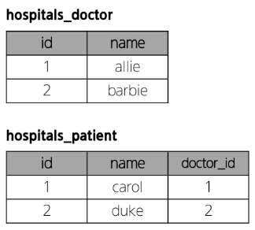
    

1. **1번 환자가 두 의사 모두에게 진료를 받고자 한다면, 환자 테이블에 1번 환자 데이터가 중복으로 입력될 수 밖에 없음**

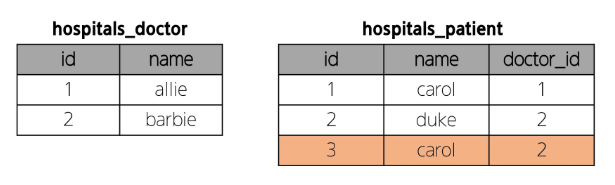

1. **동시에 예약을 남길 수는 없을까?**
    
    ```bash
    patient4 = Patient.objects.create(name='duke', doctor=doctor1, doctor2)
    
        patient4 = Patient.objects.create(name='duke', doctor=doctor1, doctor2)
                                                                              ^
    SyntaxError: positional argument follows keyword argument
    ```
    
    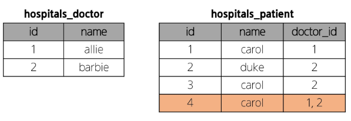
    

### `N:1` 의 한계 상황

- 동일한 환자이지만, 다른 의사에게도 진료 받기 위해 예약하기 위해서는
객체를 하나 더 만들어 진행해야 함
- 외래 키 컬럼에 ‘1, 2’ 형태로 저장하는 것은 DB 타입 문제로 불가능
    
    → 예약 테이블을 따로 만들자
    

## 중개 모델

### 1. 예약 모델 생성

- 환자 모델의 외래 키를 삭제하고, 별도의 예약 모델을 새로 생성
- 예약 모델은 의사와 환자에 각각 `N:1` 관계를 가짐

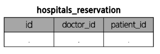

```python
# hospitals/models.py

from django.db import models

class Doctor(models.Model):
    name = models.TextField()

    def __str__(self):
        return f'{self.pk}번 의사 {self.name}'

# 외래키 삭제
class Patient(models.Model):
    name = models.TextField()

    def __str__(self): 
        return f'{self.pk}번 환자 {self.name}'

# 중개모델 작성
class Reservation(models.Model):
    doctor = models.ForeignKey(Doctor, on_delete=models.CASCADE)
    patient = models.ForeignKey(Patient, on_delete=models.CASCADE)

    def __str__(self):
        return f'{self.doctor_id}번 의사의 {self.patient_id}번 환자'
```

### 2. 예약 데이터 생성

- **데이터 베이스 초기화 후 Migration 진행 및 shell_plus 실행**
- **의사와 환자 생성 후 예약 만들기**

```bash
In [3]: doctor1 = Doctor.objects.create(name='allie')

In [4]: patient1 = Patient.objects.create(name='carol')

In [5]: Reservation.objects.create(doctor=doctor1, patient=patient1)
Out[5]: <Reservation: 1번 의사의 1번 환자>
```

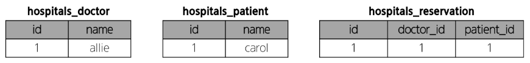

### 3. 예약 정보 조회

- **의사와 환자가 예약 모델을 통해 각각 본인의 진료 내역 확인**

```bash
# 의사 -> 예약 정보 찾기
In [6]: doctor1.reservation_set.all()
Out[6]: <QuerySet [<Reservation: 1번 의사의 1번 환자>]>

# 환자 -> 예약 정보 찾기
In [7]: patient1.reservation_set.all()
Out[7]: <QuerySet [<Reservation: 1번 의사의 1번 환자>]>
```

### 4. 추가 예약 생성

- **1번 의사에게 새로운 환자 예약 생성**
    
    ```bash
    In [8]: patient2 = Patient.objects.create(name='duke')
    
    In [9]: Reservation.objects.create(doctor=doctor1, patient=patient2)
    Out[9]: <Reservation: 1번 의사의 2번 환자>
    ```
    
    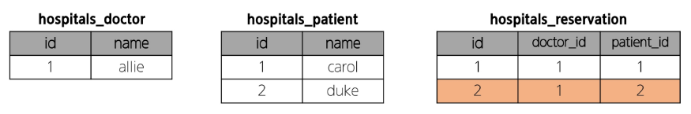
    

### 5. 예약 정보 조회

- **1번 의사의 예약 정보 조회**

```bash
In [10]: doctor1.reservation_set.all()
Out[10]: <QuerySet [<Reservation: 1번 의사의 1번 환자>, <Reservation: 1번 의사의 2번 환자>]>
```

**Django에서는 `ManyToManyField` 로 중개모델을 자동으로 생성**

## ManyToManyField

### `ManyToManyField()`

**`M:N` 관계 설정 모델 필드**

### 1. 환자 모델에 `ManyToManyField` 작성

- **의사 모델에 작성해도 상관 없음 : 참조/역참조 관계만 잘 기억할 것**

```python
# hospitals/models.py

from django.db import models

class Doctor(models.Model):
    name = models.TextField()

    def __str__(self):
        return f'{self.pk}번 의사 {self.name}'

class Patient(models.Model):
    # ManyToManyField 작성
    doctors = models.ManyToManyField(Doctor)
    name = models.TextField()

    def __str__(self):
        return f'{self.pk}번 환자 {self.name}'
```

### 2. 데이터 베이스 초기화 후, Migrations 진행 및 shell_plus 실행

- **생성된 중개 테이블 `hospitals_patient_doctors` 확인**
    
    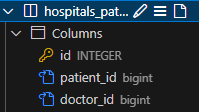
    

### 3. 데이터 생성

- **의사 1명과 환자 2명 생성**

```python
In [1]: doctor1 = Doctor.objects.create(name='allie')

In [2]: patient1 = Patient.objects.create(name='carol')
In [3]: patient2 = Patient.objects.create(name='duke')
```

- **예약 생성 (환자가 예약)**

```python
# patient1이 doctor1에게 예약
In [4]: patient1.doctors.add(doctor1)

# patient1 - 자신이 예약한 의사 목록 확인
In [5]: patient1.doctors.all()
Out[5]: <QuerySet [<Doctor: 1번 의사 allie>]>

# doctor1 - 자신의 예약된 환자 목록 확인
In [6]: doctor1.patient_set.all()
Out[6]: <QuerySet [<Patient: 1번 환자 carol>]>
```

- **예약 생성 (의사가 예약)**

```python
# doctor1이 patient2를 예약 (역참조)
In [7]: doctor1.patient_set.add(patient2)

# doctor1 - 자신의 예약 환자 목록 확인
In [8]: doctor1.patient_set.all()
Out[8]: <QuerySet [<Patient: 1번 환자 carol>, <Patient: 2번 환자 duke>]>

# patient2 - 자신이 예약한 의사 목록 확인
In [10]: patient2.doctors.all()
Out[10]: <QuerySet [<Doctor: 1번 의사 allie>]>

# patient1 - 자신이 예약한 의사 목록 확인
In [11]: patient1.doctors.all()
Out[11]: <QuerySet [<Doctor: 1번 의사 allie>]>
```

- **중개 테이블에서 예약 현황 확인**
    
    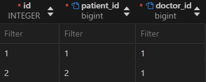
    

### 4. 데이터 삭제

- **예약 취소하기 (삭제)**
    - 이전에는 Reservations을 찾아서 지워야 했다면, 이제는 `.remove()` 로 삭제 가능

```python
# doctor1이 patient1 진료 예약 취소
In [12]: doctor1.patient_set.remove(patient1)

# doctor1 - 자신의 예약 환자 목록 확인
In [13]: doctor1.patient_set.all()
Out[13]: <QuerySet [<Patient: 2번 환자 duke>]>

# patient1 - 자신이 예약한 의사 목록 확인
In [14]: patient1.doctors.all()
Out[14]: <QuerySet []>
```

```python
# patient2가 doctor1 진료 예약 취소
In [15]: patient2.doctors.remove(doctor1)

# patient2 - 자신이 예약한 의사 목록 확인
In [16]: patient2.doctors.all()
Out[16]: <QuerySet []>

# doctor1 - 자신의 예약 환자 목록 확인
In [17]: doctor1.patient_set.all()
Out[17]: <QuerySet []>
```

**만약 예약 정보에 병의 증상, 예약일 등의 추가 정보가 포함되어야 한다면?**

## `through` argument

**중개 테이블에 ‘추가 데이터’를 사용해 `M:N` 관계를 형성하려는 경우에 사용**

### 1. Reservation Class 작성 및 through 설정

- **이제는 예약 정보에 ‘증상’과 ‘예약일’이라는 추가 데이터가 생김**

```python
# hospitals.models.py

from django.db import models

class Doctor(models.Model):
    name = models.TextField()

    def __str__(self):
        return f'{self.pk}번 의사 {self.name}'

class Patient(models.Model):
    doctors = models.ManyToManyField(Doctor, through='Reservation')
    name = models.TextField()

    def __str__(self):
        return f'{self.pk}번 환자 {self.name}'

class Reservation(models.Model):
    doctor = models.ForeignKey(Doctor, on_delete=models.CASCADE)
    patient = models.ForeignKey(Patient, on_delete=models.CASCADE)
    **symptom = models.TextField()
    reserved_at = models.DateTimeField(auto_now_add=True)**

    def __str__(self):
        return f'{self.doctor.pk}번 의사의 {self.patient.pk}번 환자'
```

### 2. 데이터 베이스 초기화 후 Migrations 진행 및 shell_plus 실행

### 3. 데이터 생성

- 의사 1명과 환자 2명 생성

```python
In [1]: doctor1 = Doctor.objects.create(name='allie')
In [2]: patient1 = Patient.objects.create(name='carol')
In [3]: patient2 = Patient.objects.create(name='duke')
```

### 4. 예약 생성:

- **Reservation class를 통한 예약 생성**
    
    ```python
    **In [4]: reservation1 = Reservation(doctor=doctor1, patient=patient1, symptom='headache')    
    In [5]: reservation1.save()**
    
    In [6]: doctor1.patient_set.all()
    Out[6]: <QuerySet [<Patient: 1번 환자 carol>]>
    
    In [7]: patient1.doctors.all()
    Out[7]: <QuerySet [<Doctor: 1번 의사 allie>]>
    ```
    

- **Patient 또는 Doctor의 인스턴스를 통한 예약 생성 (through_defaults)**
    
    ```python
    **In [8]: patient2.doctors.add(doctor1, through_defaults={'symptom': 'flu'})**
    
    In [9]: doctor1.patient_set.all()
    Out[9]: <QuerySet [<Patient: 1번 환자 carol>, <Patient: 2번 환자 duke>]>
    
    In [10]: patient2.doctors.all()
    Out[10]: <QuerySet [<Doctor: 1번 의사 allie>]>
    ```
    

- **생성된 예약 확인**
    
    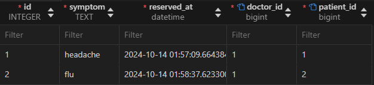
    

### 5. 예약 취소

- **생성과 마찬가지로 의사와 환자 모두 각각 예약 삭제 가능**

```python
의사가 예약 취소
In [11]: doctor1.patient_set.remove(patient1)

In [12]: doctor1.patient_set.all()
Out[12]: <QuerySet [<Patient: 2번 환자 duke>]>

In [13]: patient1.doctors.all()
Out[13]: <QuerySet []>

# 환자가 예약 취소
In [14]: patient2.doctors.remove(doctor1)

In [15]: doctor1.patient_set.all()
Out[15]: <QuerySet []>

In [16]: patient2.doctors.all()
Out[16]: <QuerySet []>
```

## `M:N` 관계 주요 사항

- **`M:N` 관계로 맺어진 두 테이블에는 물리적인 변화가 없음**
- **`ManyToManyField` 는 중개 테이블을 자동으로 생성**
- **`ManyToManyField` 는 `M:N` 관계를 맺는 두 모델 어디에 위치해도 상관 없음**
    - 대신 필드 작성 위치에 따라 참조와 역참조 방향을 주의할 것
- **`N:1` 은 완전한 종속의 관계였지만, 
`M:N` 은 종속적인 관계가 아님**
    - ‘의사에게 진찰 받는 환자 & 환자를 진찰하는 의사’ 와 같이 2가지 형태로 표현 가능

# `ManyToManyField`

`ManyToManyField(to, **options)` : `M:N` 관계 설정 시 사용하는 모델 필드

## 특징:

- **양방향 관계**
    - 어느 모델에서든 관련 객체에 접근할 수 있음
- **중복 방지**
    - 동일한 관계는 한 번만 저장됨

## 대표 인자

### 1. `related_name`

- 역참조시 사용하는 manager name을 변경

```python
# hospitals/models.py

class Doctor(models.Model):
    name = models.TextField()

    def __str__(self):
        return f'{self.pk}번 의사 {self.name}'

class Patient(models.Model):
    # ManyToManyField - related_name 작성
    doctors = models.ManyToManyField(Doctor, **related_name='patients'**)
    name = models.TextField()

    def __str__(self):
        return f'{self.pk}번 환자 {self.name}'
```

```python
# 변경 전
In [1]: doctor.patient_set.all()

# 변경 후 (변경 후 이전 manager name은 사용 불가)
In [2]: doctor.patients.all()
```

### 2. `symmetrical`

- 관계 설정 시 대칭 유무 설정
- `ManyToManyField` 가 동일한 모델을 가리키는 정의에서만 사용
- 기본 값: `True`

```python
# 예시

class Person(models.Model):
		friends = models.ManyToManyField('self')
		# friends = models.ManyToManyField('self', symmetrical=False)
```

- `True` 일 경우:
    - source 모델의 인스턴스가 target 모델의 인스턴스를 참조하면 
    자동으로 target 모델 인스턴스도 sorce 모델 인스턴스를 자동으로 참조하도록 함 (대칭)
    - 즉 내가 당신의 친구라면 자동으로 당신도 내 친구가 됨
- `False` 일 경우:
    - `True` 와 반대: 대칭되지 않음
        
        ```python
        - source 모델: 관계를 시작하는 모델
        - target 모델: 관계의 대상이 되는 모델
        ```
        

### 3. `through`

- 사용하고자 하는 중개 모델을 지정
- 일반적으로 “추가 데이터를 `M:N` 관계와 연결하려는 경우”에 활용

```python
# hospitals/models.py

from django.db import models

class Doctor(models.Model):
    name = models.TextField()

    def __str__(self):
        return f'{self.pk}번 의사 {self.name}'

class Patient(models.Model):
    # ManyToManyField - related_name 작성
    doctors = models.ManyToManyField(Doctor, **through='Reservation'**)
    name = models.TextField()

    def __str__(self):
        return f'{self.pk}번 환자 {self.name}'

class Reservation(models.Model):
    doctor = models.ForeignKey(Doctor, on_delete=models.CASCADE)
    patient = models.ForeignKey(Patient, on_delete=models.CASCADE)
    symptom = models.TextField()
    reserved_at = models.DateTimeField(auto_now_add=True)

    def __str__(self):
        return f'{self.doctor.pk}번 의사의 {self.patient.pk}번 환자'
```

## `M:N` 에서의 대표 조작 methods

- **`add()`**
    - 관계 추가
    - 지정된 객체를 관련 객체 집합에 추가

- **`remove()`**
    - 관계 제거
    - 관련 객체 집합에서 지정된 모델 객체를 제거

# 좋아요 기능 구현

## 모델 관계 설정

Article(M) - User(N) : 0개 이상의 게시글은 0명 이상의 회원과 관련

→ 게시글은 회원으로부터 0개 이상의 좋아요를 받을 수 있고
    회원은 0개 이상의 게시글에 좋아요를 누를 수 있음

### Article 클래스에 ManyToManyField 작성

```python
# articles/models.py

from django.db import models
from django.conf import settings

# Create your models here.
class Article(models.Model):
    user = models.ForeignKey(
        settings.AUTH_USER_MODEL, on_delete=models.CASCADE
    )
    **like_users = models.ManyToManyField(settings.AUTH_USER_MODEL)**
    title = models.CharField(max_length=10)
    content = models.TextField()
    created_at = models.DateTimeField(auto_now_add=True)
    updated_at = models.DateTimeField(auto_now=True)

class Comment(models.Model):
    article = models.ForeignKey(Article, on_delete=models.CASCADE)
    user = models.ForeignKey(
        settings.AUTH_USER_MODEL, on_delete=models.CASCADE
    )
    content = models.CharField(max_length=200)
    created_at = models.DateTimeField(auto_now_add=True)
    updated_at = models.DateTimeField(auto_now=True)

```

### 작성하고 Migrations 진행하면 Error 발생

```python
$ python manage.py makemigrations
SystemCheckError: System check identified some issues:

ERRORS:
articles.Article.like_users: (fields.E304) Reverse accessor 'User.article_set' for 'articles.Article.like_users' clashes with reverse accessor for 'articles.Article.user'.
        HINT: Add or change a related_name argument to the definition for 'articles.Article.like_users' or 'articles.Article.user'.
articles.Article.user: (fields.E304) Reverse accessor 'User.article_set' for 'articles.Article.user' clashes with reverse accessor for 'articles.Article.like_users'.
        HINT: Add or change a related_name argument to the definition for 'articles.Article.user' or 'articles.Article.like_users'.
(venv) 
```

**역참조 매니저 충돌**

- like_users 필드 생성 시 자동으로 역참조 매니저 `.article_set` 가 생성됨
- 그러나 이전 `N:1(Article-User)` 관계에서 이미 같은 이름의 매니저를 사용 중
    - `user.article_set.all()` : 해당 유저가 작성한 모든 게시글 조회
- ‘user가 작성한 글 (`user.article_set`)’ 과
’user가 좋아요한 글 (`user.article_set`)’을 구분할 수 없게 됨

```python
- **N:1**
    - 유저가 작성한 게시글
    - `user.article_set.all()`
**- M:N**
    - 유저가 좋아요 한 게시글
    - `user.article_set.all()`
```

**→ user와 관계된 ForeignKey 혹은 ManyToManyField 둘 중 하나에 `related_name` 필요**

### related_name 작성 후 Migration 재진행

```python
# articles/models.py

from django.db import models
from django.conf import settings

# Create your models here.
class Article(models.Model):
    user = models.ForeignKey(
        settings.AUTH_USER_MODEL, on_delete=models.CASCADE
    )
    like_users = models.ManyToManyField(settings.AUTH_USER_MODEL, **related_name='like_articles'**)
    title = models.CharField(max_length=10)
    content = models.TextField()
    created_at = models.DateTimeField(auto_now_add=True)
    updated_at = models.DateTimeField(auto_now=True)

class Comment(models.Model):
    article = models.ForeignKey(Article, on_delete=models.CASCADE)
    user = models.ForeignKey(
        settings.AUTH_USER_MODEL, on_delete=models.CASCADE
    )
    content = models.CharField(max_length=200)
    created_at = models.DateTimeField(auto_now_add=True)
    updated_at = models.DateTimeField(auto_now=True)

```

- **생성된 중개 테이블 확인**
    
    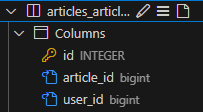
    

### 위에서 작성한 User-Article 간 사용 가능한 전체 related manager

- **`article.user`**
    - 게시글을 작성한 유저: `N:1`
- **`user.article_set`**
    - 유저가 작성한 게시글 (역참조) - `N:1`
- **`article.like_users`**
    - 게시글을 좋아요 한 유저 - `M:N`
- **`user.like_articles`**
    - 유저가 좋아요 한 게시글 (역참조) - `M:N`

## 기능 구현

```python
# articles/urls.py

from django.urls import path
from . import views

app_name = 'articles'
urlpatterns = [
    path('', views.index, name='index'),
    path('<int:pk>/', views.detail, name='detail'),
    path('create/', views.create, name='create'),
    path('<int:pk>/delete/', views.delete, name='delete'),
    path('<int:pk>/update/', views.update, name='update'),
    path('<int:pk>/comments/', views.comments_create, name='comments_create'),
    path(
        '<int:article_pk>/comments/<int:comment_pk>/delete/',
        views.comments_delete,
        name='comments_delete',
    ),
    **path('<int:article_pk>/likes/', views.likes, name='likes'),**
]

```

```python
# articles/views.py

@login_required
def likes(request, article_pk):
    # 어떤 글에 좋아요를 눌렀는지 게시글 조회
    article = Article.objects.get(pk=article_pk)
    
    # 만약 게시글에 좋아요가 눌러져 있었다면 좋아요 제거
    if request.user in article.like_users.all():
        article.like_users.remove(request.user)
    else: # 아니라면 좋아요 추가
        article.like_users.add(request.user)
    return redirect('articles:index')
```

```html
<!-- articles/index.html -->

  
    <p>작성자: {{ article.user.username }}</p>
    <p>글 번호: {{ article.pk }}</p>
    <a href="">
      <p>글 제목: {{ article.title }}</p>
    </a>
    <p>글 내용: {{ article.content }}</p>
    **<p>좋아요: {{ article.like_users.count }} </p>
    <form action="" method="POST">
      
      
        <input type="submit" value='좋아요 취소'>
      
        <input type="submit" value='좋아요'>
      
    </form>**
    <hr>
  
```

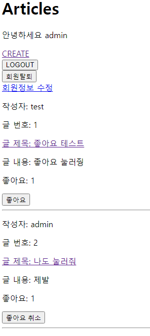

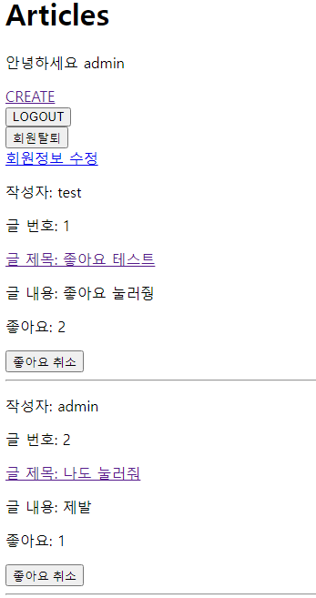

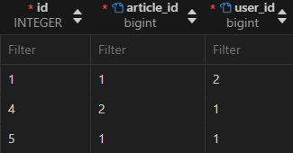