# 팔로우 기능 구현

## 프로필 페이지

### 프로필 구현

```python
# accounts/urls.py

from django.urls import path
from . import views

app_name = 'accounts'
urlpatterns = [
    ...
    **path('profile/<username>/', views.profile, name='profile'),**
    # <str:username> <- 기본 값은 문자열임
]
```

```python
# accounts/views.py

from django.shortcuts import render, redirect
from django.contrib.auth import get_user_model

def profile(request, username):
    # 어떤 유저의 프로필을 보여줄 건지 username을 사용해서 유저를 조회
    User = get_user_model()
    person = User.objects.get(username=username)
    context = {
        'person': person,
    }
    return render(request, 'accounts/profile.html', context)
```

```html
<!-- accounts/profile.html -->

<body>
  <h1>{{ person.username }}님의 프로필</h1>
  <hr>

  <h2>{{ person.username }}가 작성한 게시글</h2>
  
    <div>{{ article.title }}</div>
  
  <hr>

  <h2>{{ person.username }}가 작성한 댓글</h2>
  
    <div>{{ comment.content }}</div>
  
  <hr>

  <h2>{{ person.username }}가 좋아요한 게시글</h2>
  
    <div>{{ like_article.title }}</div>
  
</body>
```

```html
<!-- articles/index.html -->


    <p>안녕하세요 {{ user.username }}</p>
    **<a href="">내 프로필</a>**
    <a href="">CREATE</a>

```

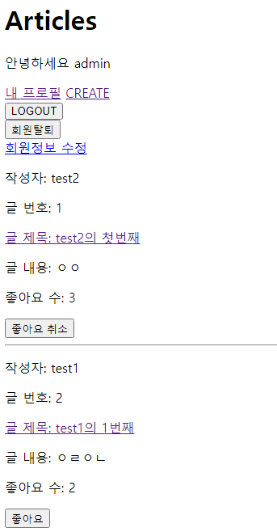

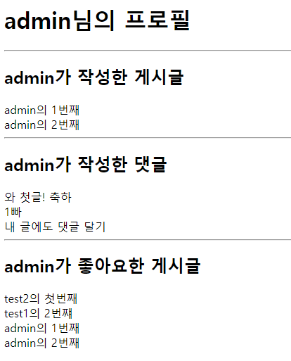

## 모델 관계 설정

**`User(M) - User(M)` : 0명 이상의 회원은 0명 이상의 회원과 관련**

**→ 회원은 0명 이상의 팔로워를 가질 수 있고, 0명 이상의 다른 회원들을 팔로잉 할 수 있음**

1. **ManyToManyField 작성**

```python
# accounts/models.py

from django.db import models
from django.contrib.auth.models import AbstractUser

class User(AbstractUser):
    followings = models.ManyToManyField("self", symmetrical=False, related_name='followers')
 
# related_name 지정 안 한다면
# user1.followings.all()
# user1.user_set.all()
```

- **참조**
    - 내가 팔로우 하는 사람들 (followings)
- **역참조**
    - 상대방 입장에서 나는 팔로워 중 한 명 (followers)

**바뀌어도 상관 없으나 관계 조회 시 생각하기 편한 방향으로 정한 것**

1. **Migrations  진행 후 중개 테이블 확인**
    
    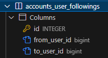
    

## 기능 구현

```python
# accounts/urls.py

from django.urls import path
from . import views

app_name = 'accounts'
urlpatterns = [
    ...
    path('profile/<username>/', views.profile, name='profile'),
    **path('<int:user_pk>/follow/', views.follow, name='follow'),**
]
```

```python
# accounts/views.py

from django.shortcuts import render, redirect
from django.contrib.auth import get_user_model

def profile(request, username):
    # 어떤 유저의 프로필을 보여줄 건지 username을 사용해서 유저를 조회
    User = get_user_model()
    person = User.objects.get(username=username)
    context = {
        'person': person,
    }
    return render(request, 'accounts/profile.html', context)

**def follow(request, user_pk):**
    # 팔로우 대상
    **User = get_user_model()
    you = User.objects.get(pk=user_pk)**
    # 나
    **me = request.user
    if me != you:**
        # 내가 상대방의 팔로워 목록에 있다면, 팔로우 취소
        **if me in you.followers.all():
            you.followers.remove(me)**    # me.followings.remove(you)
****        # 내가 상대방의 팔로워 목록에 없다면, 팔로우
        **else:
            you.followers.add(me)**       # me.followings.add(you)
    **return redirect('accounts:profile', you.username)**
```

- **프로필 유저의 팔로잉, 팔로워 수 & 팔로우, 언팔로우 버튼 작성**

```html
<!-- accounts/profile.html -->

<body>
  <h1>{{ person.username }}님의 프로필</h1>
  <div>
    <p>팔로잉: {{ person.followings.count }}</p>
    <p>팔로워: {{ person.followers.count }}</p>
  </div>
  
    <div>
      <form action="" method='POST'>
        
        
          <input type="submit" value='Unfollow'>
        
          <input type="submit" value='Follow'>
        
      </form>
    </div>
    <hr>
  
</body>
```

- **프로필 이동 링크 추가**

```html
<!-- articles/index.html -->

<body>
  <h1>Articles</h1>

  
    <p>안녕하세요 {{ user.username }}</p>
    **<a href="">내 프로필</a>**
    <a href="">CREATE</a>
    <form action="" method="POST">
      
      <input type="submit" value="LOGOUT">
    </form>
    <form action="" method="POST">
      
      <input type="submit" value="회원탈퇴">
    </form>
    <a href="">회원정보 수정</a>
  
    <a href="">LOGIN</a>
    <a href="">회원가입</a>
  

  
  
    **<a href="">
      <p>작성자: {{ article.user.username }}</p>
    </a>**
    <p>글 번호: {{ article.pk }}</p>
    <a href="">
      <p>글 제목: {{ article.title }}</p>
    </a>
    <p>글 내용: {{ article.content }}</p>
    <p>좋아요 수: {{ article.like_users.count }}</p>
     좋아요 form 버튼 
    <form action="" method="POST">
      
      
        <input type="submit" value="좋아요 취소">
      
        <input type="submit" value="좋아요">
      
    </form>
    <hr>
  

</body>
```

- **실행**
    
    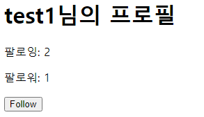
    
    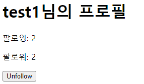
    
    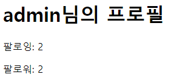
    

# Fixtures

**Django가 데이터 베이스로 가져오는 방법을 알고 있는 데이터 모음**

**→ 데이터는 데이터 베이스 구조에 맞추어 작성 되어있음**

### 초기 데이터 제공

Fixtures의 사용 목적

**초기 데이터의 필요성**

- **협업하는 유저 A, B가 있다고 가정**
    1. **A가 먼저 프로젝트를 작업 후 원격 저장소에 push 진행**
        - gitignore로 인해 DB는 업로드하지 않기 때문에, A가 생성한 데이터도 업로드 X
    2. **B가 원격 저장소에서 A가 push한 프로젝트를 pull (clone)**
        - 결과적으로 B는 DB가 없는 프로젝트를 받게 됨
- **이처럼 프로젝트의 앱을 처음 설정할 때 동일하게 준비 된 데이터로
데이터 베이스를 미리 채우는 것이 필요한 순간이 있음**

**→ Django에서는 fixtures를 사용해 앱에 초기 데이터(initial data)를 제공**

### 사전 준비

- `M:N` 까지 모두 작성된 Django 프로젝트에서
유저, 게시글, 댓글 등 각 데이터를 최소 2~3개 이상 생성해두기

## dumpdata

**데이터베이스의 모든 데이터를 추출**

### 작성 예시

`$ python manage.py dumpdata [app_name[.ModelName] [app_name[.ModelName] ...]] > file.json`

```bash
$ python manage.py dumpdata --indent 4 articles.article > articles.json
$ python manage.py dumpdata --indent 4 articles.comment > comments.json
$ python manage.py dumpdata --indent 4 accounts.user > users.json
```

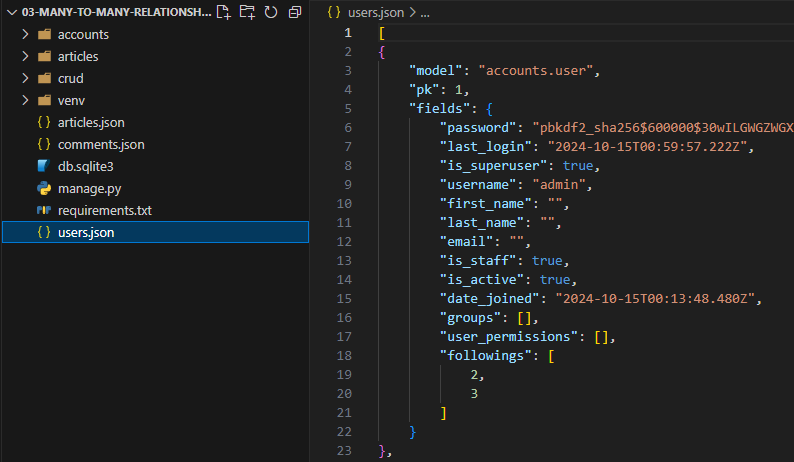

**주의: Fixtures 파일을 직접 만들지 말 것**

**→ 반드시 dumpdata 명령어를 사용해서 생성**

## loaddata

**Fixtures 데이터를 데이터  베이스로 불러오기**

### Fixtures 파일 기본 경로

**`app_name/fixtures/`**

**→ Django는 설치된 모든 app의 디렉토리에서 fixtures 폴더 이후의 경로로 
    fixtures 파일을 찾아 load**

### loaddata 활용

1. **db.sqlite3 파일 삭제 후 migrate 진행**
    
    해당 경로로 fixture 파일 이동
    
    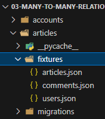
    

1. **load 진행 후 데이터가 잘 입력되었는지 확인**
    
    ```bash
    $ python [manage.py](http://manage.py/) loaddata articles.json users.json comments.json
    ```
    

- **한글 관련한 오류 발생시 대처 방법**
    
    ```bash
    UnicodeDecodeError: 'utf-8' codec can't decode byte 0xc0 in position 114: invalid start byte
    ```
    
    ```bash
    $ python -Xutf8 manage.py dumpdata [생략]
    ```
    

### loaddata 순서 주의 사항

- **만약 loaddata를 한 번에 실행하지 않고 별도로 실행한다면
모델 관계에 따라 load 순서가 중요할 수 있음**
    - comment는 article에 대한 key 및 user에 대한 key가 필요
    - article은 user에 대한 key가 필요
- **즉 현재 모델 관계에서는 user → article → comment 순으로 data를 load해야함**
    
    ```bash
    $ python [manage.py](http://manage.py/) loaddata users.json 
    $ python [manage.py](http://manage.py/) loaddata articles.json 
    $ python [manage.py](http://manage.py/) loaddata comments.json
    ```
    

# Improve Query

**Query 개선하기:**

**→ 같은 결과를 얻기 위해 DB측에 보내는 query 개수를 점차 줄여 조회하기**

### 사전 준비

- fixtures 데이터
    - 게시글 10개 / 댓글 100개 / 유저 5개
- 모델 관계
    - `N:1` - `Article:User` / `Comment:Article` / `Comment:Article`
    - `N:M` - `Article:User`

```bash
**$ python manage.py migrate
$ python manage.py loaddata users.json articles.json comments.json**
Installed 115 object(s) from 3 fixture(s)
**$ python manage.py runserver**
```

## annotate

- **SQL의 `GROUP BY` 를 사용**
- **쿼리셋의 각 객체에 계산된 필드를 추가**
- **집계 함수(Count, Sum 등)와 함께 자주 사용됨**

### annotate 예시

```bash
Book.objects.annotate(num_authors=Count('authors'))
```

- **의미**
    - 결과 객체에 `num_authors` 라는 새로운 필드를 추가
    - 이 필드는 각 책과 연관된 저자의 수를 계산
- **결과**
    - 결과에는 기존 필드와 함께 `num_authors` 필드를 가지게 됨
    - `book.num_authors` 로 해당 책의 저자 수에 접근할 수 있게 됨

### 문제 상황

- **default** 2.34 ms (12 queries including 10 similar )
    
    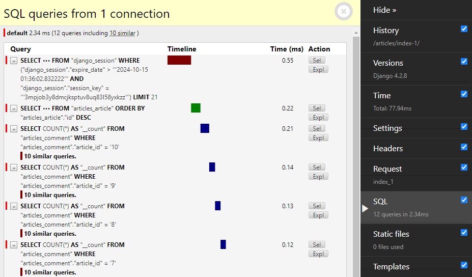
    

- **문제 원인:**
    - 각 게시글마다 댓글 개수를 반복 평가
        
        ```html
        <!-- index_1.html -->
        
        **<p>댓글개수 : {{ article.comment_set.count }}</p>**
        ```
        

- **문제 해결:**
    - 게시글을 조회하면서 댓글 개수까지 한 번에 조회해서 가져오기
        
        ```python
        from django.shortcuts import render
        from .models import Article, Comment
        from django.db.models import Count
        
        def index_1(request):
            # articles = Article.objects.order_by('-pk')
            **articles = Article.objects.annotate(Count('comment')).order_by('-pk')**
            context = {
                'articles': articles,
            }
            return render(request, 'articles/index_1.html', context)
        ```
        
        ```html
        <!-- index_1.html -->
        
        **<p>댓글개수 : {{ article.comment__count }}</p>**
        ```
        
    
    - **default** 0.74 ms (1 query )
        
        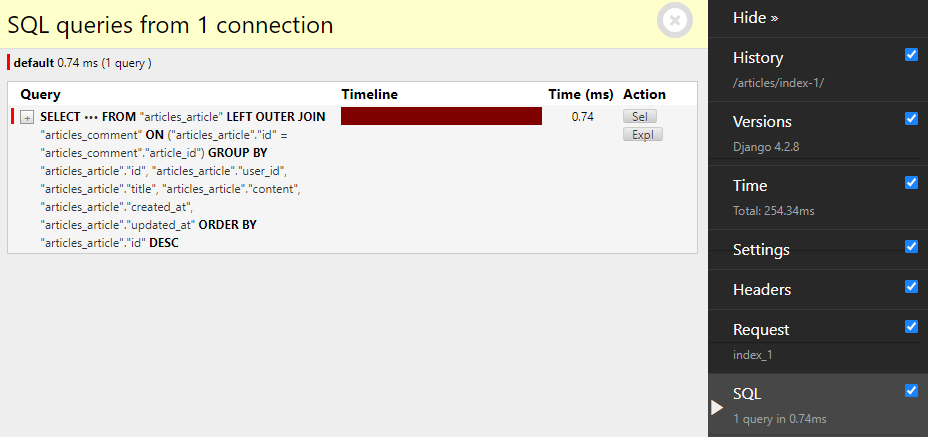
        

## select_related

- SQL의 `INNER JOIN` 을 사용
- `1:1` 또는 `N:1` 참조 관계에서 사용
    - ForeignKey나 OneToOneField 관계에 대해 JOIN을 수행
- 단일 쿼리로 관련 객체를 함께 가져와 성능을 향상

### select_related 예시

```python
Book.objects.select_related('publisher')
```

- 의미
    - Book 모델과 연관된 Publisher 모델의 데이터를 함께 가져옴
    - ForeignKey 관계인 ‘publisher’를 JOIN하여 단일 쿼리 만으로 데이터를 조회
- 결과
    - Book 객체를 조회할 때 연관된 Publisher 정보도 함께 로드
    - `book.publisher.name`과 같은 접근이 추가적인 데이터 베이스 쿼리 없이 가능

### 문제 상황

- **default** 2.29 ms (11 queries including 10 similar and 8 duplicates )
    
    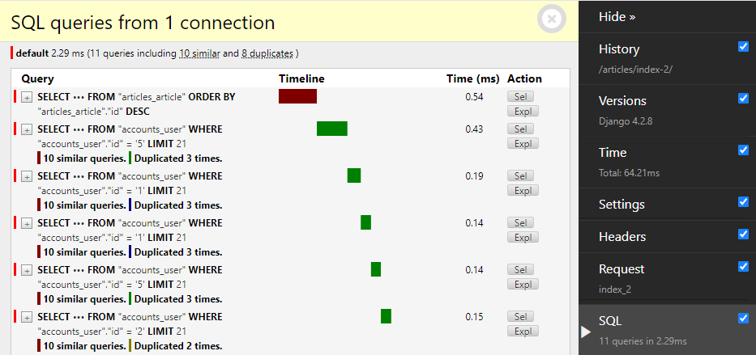
    

- **문제 원인:**
    - 각 게시글마다 작성한 유저명까지 반복 평가
        
        ```html
        <!-- index_2.html -->
        
        
          **<h3>작성자 : {{ article.user.username }}</h3>**
          <p>제목 : {{ article.title }}</p>
          <hr>
        
        ```
        

- **문제 해결:**
    - 게시글을 조회하면서 유저 정보까지 한 번에 조회해서 가져오기
        
        ```python
        from django.shortcuts import render
        from .models import Article, Comment
        from django.db.models import Count
        
        def index_2(request):
            # articles = Article.objects.order_by('-pk')
            **articles = Article.objects.select_related('user').order_by('-pk')**
            context = {
                'articles': articles,
            }
            return render(request, 'articles/index_2.html', context)
        ```
        
        ```html
        <!-- index_1.html -->
        
        **<p>댓글개수 : {{ article.comment__count }}</p>**
        ```
        
    
    - **default** 0.58 ms (1 query )
        
        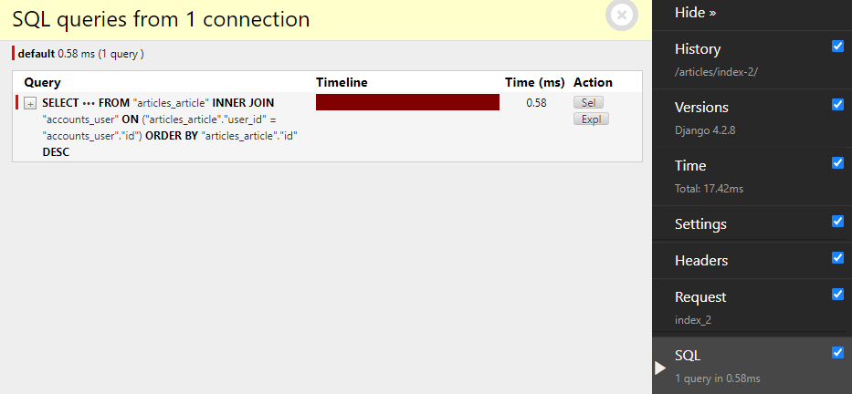
        

## prefetch_related

- **SQL이 아닌 Python을 사용한 JOIN을 진행**
    - 관련 객체들을 미리 가져와 메모리에 저장하여 성능을 향상
- **`M:N` 또는 `N:1` 역참조 관계에서 사용**
    - ManyToManyField나 역참조 관계에 대해 별도의 쿼리를 실행

### prefetch_related 예시

```python
Book.objects.prefetch_related('authors')
```

- 의미
    - Book과 Author는 ManyToMany 관계로 가정
    - Book 모델과 연관된 모든 Author 모델의 데이터를 미리 가져옴
    - Django가 별도의 쿼리로 Author 데이터를 가져와 관계를 설정
- 결과
    - Book 객체를 조회한 후, 연관된 모든 Author 정보가 미리 로드 됨
    - `for author in book.authors.all()` 같은 반복이 추가적인 데이터 베이스 쿼리 없이 실행됨

### 문제 상황

- **default** 2.48 ms (11 queries including 10 similar )
    
    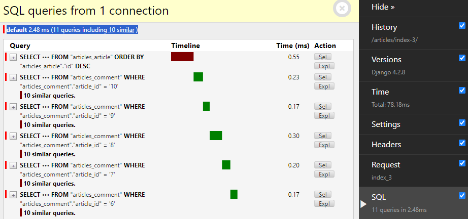
    

- **문제 원인:**
    - 각 게시글 출력 후 각 게시글의 댓글 목록까지 개별적으로 모두 평가
        
        ```html
        <!-- index_3.html -->
        
        <h1>Articles</h1>
        
          <p>제목 : {{ article.title }}</p>
          <p>댓글 목록</p>
          **
            <p>{{ comment.content }}</p>
          **
          <hr>
        
        ```
        

- **문제 해결:**
    - 게시글을 조회하면서 참조된 댓글까지 한 번에 조회해서 가져오기
        
        ```python
        from django.shortcuts import render
        from .models import Article, Comment
        from django.db.models import Count
        
        def index_3(request):
            # articles = Article.objects.order_by('-pk')
            **articles = Article.objects.prefetch_related('comment_set').order_by('-pk')**
            context = {
                'articles': articles,
            }
            return render(request, 'articles/index_3.html', context)
        ```
        
    
    - **default** 0.95 ms (2 queries )
        
        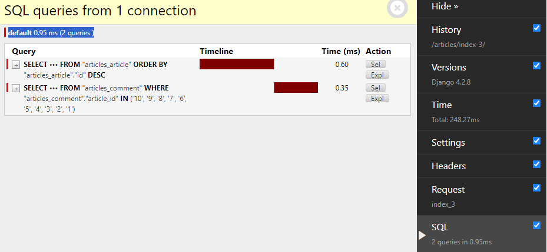
        

## select_related & prefetch_related

### 문제 상황

- **default** 21.46 ms (111 queries including 110 similar and 100 duplicates )
    
    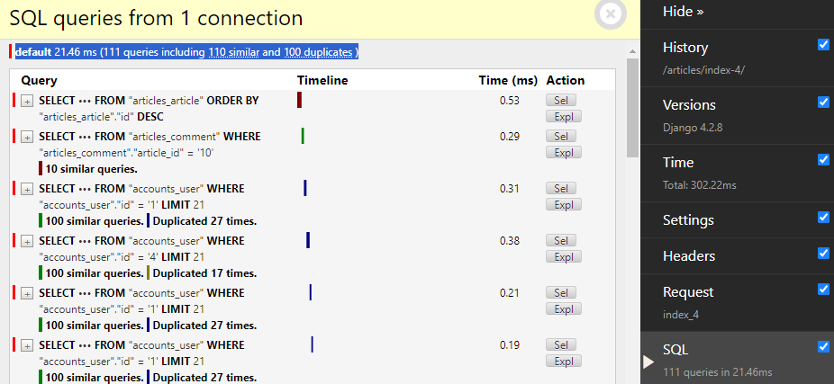
    

- **문제 원인:**
    - 각 게시글 + 각 게시글의 댓글 목록 + 댓글의 작성자를 단계적으로 평가
        
        ```html
        <!-- index_4.html -->
        
        <h1>Articles</h1>
        
          <p>제목 : {{ article.title }}</p>
          <p>댓글 목록</p>
          **
            <p>{{ comment.user.username }} : {{ comment.content }}</p>
          **
          <hr>
        
        ```
        

- **문제 해결 1단계:**
    - 게시글을 조회하면서 참조된 댓글까지 한 번에 조회
        
        ```python
        from django.shortcuts import render
        from .models import Article, Comment
        from django.db.models import Count
        from django.db.models import Prefetch
        
        def index_4(request):
            # articles = Article.objects.order_by('-pk')
            **articles = Article.objects.prefetch_related('comment_set').order_by('-pk')**
        
            context = {
                'articles': articles,
            }
            return render(request, 'articles/index_4.html', context)
        ```
        
    
    - **default** 17.65 ms (102 queries including 100 similar and 100 duplicates )
        - 아직 각 댓글을 조회하면서 각 댓글의 작성자를 중복 조회 중
        
        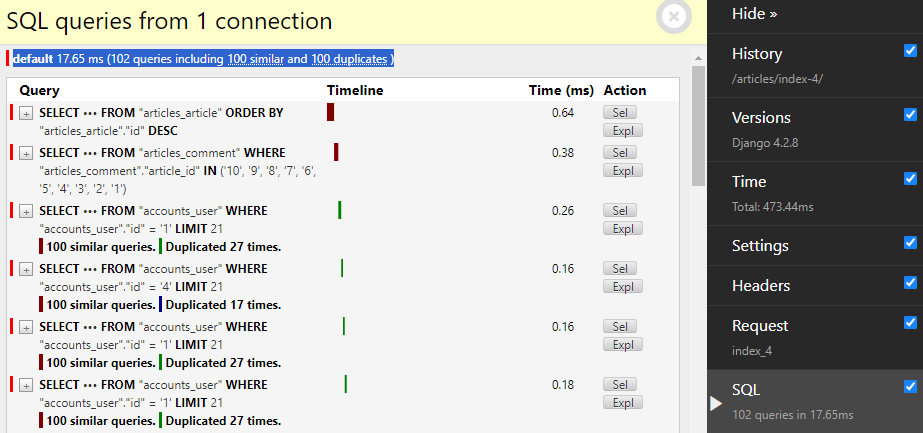
        

- **문제 해결 2단계:**
    - 게시글 + 각 게시글의 댓글 목록 + 댓글의 작성자를 한 번에 조회
        
        ```python
        from django.shortcuts import render
        from .models import Article, Comment
        from django.db.models import Count
        from django.db.models import Prefetch
        
        def index_4(request):
            articles = Article.objects.prefetch_related(
                Prefetch('comment_set', queryset=Comment.objects.select_related('user'))
            ).order_by('-pk')
        
            context = {
                'articles': articles,
            }
            return render(request, 'articles/index_4.html', context)
        
        ```
        
    
    - **default** 0.99 ms (2 queries )
        
        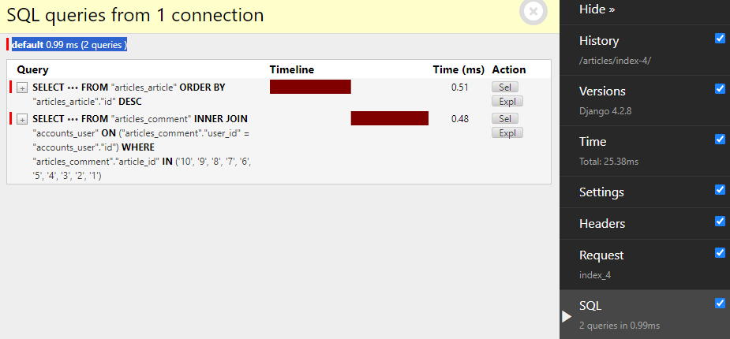
        

# 참고

## `.exists()`

- QuerySet에 결과가 하나 이상 존재하는지 여부를 확인하는 메서드
- 결과가 포함되어 있으면 True, 포함되어 있지 않으면 False 반환

### 특징

- 데이터 베이스에 최소한의 쿼리만 실행하여 효율적
- 전체 QuerySet을 평가하지 않고 결과의 존재 여부만 확인

→ 대량의 QuerySet에 있는 특정 객체 검색에 유용

### 적용

```python
# articles/views.py

# 적용 전
def likes(request, article_pk):
    article = Article.objects.get(pk=article_pk)
    **if request.user in article.like_users.all():**
        article.like_users.remove(request.user)
    else:
        article.like_users.add(request.user)
    return redirect('articles:index')

# 적용 후
def likes(request, article_pk):
    article = Article.objects.get(pk=article_pk)
    **if article.like_users.filter(pk=request.user.pk).exists():**
        article.like_users.remove(request.user)
    else:
        article.like_users.add(request.user)
    return redirect('articles:index')
```

```python
# articles/views.py

# 적용 전
def follow(request, user_pk):
    User = get_user_model()
    you = User.objects.get(pk=user_pk)
    me = request.user
    if me != you:
        if me in you.followers.all():
            you.followers.remove(me)    # me.followings.remove(you)
        else:
            you.followers.add(me)       # me.followings.add(you)
    return redirect('accounts:profile', you.username)
    
# 적용 후
def follow(request, user_pk):
    User = get_user_model()
    you = User.objects.get(pk=user_pk)
    me = request.user
    if me != you:
        **if you.followers.filter(pk=me.pk).exists():**
            you.followers.remove(me)    # me.followings.remove(you)
        else:
            you.followers.add(me)       # me.followings.add(you)
    return redirect('accounts:profile', you.username)
```

## 한꺼번에 dump 진행

```bash
# 3개의 모델을 하나의 json 파일로
$ python manage.py dumpdata --indent 4 articles.article articles.comment accounts.user > data.json

# 모든 모델을 하나의 json 파일로
$ python manage.py dumpdata --indent 4 > data.json
```

## loaddata 시 encoding codec 관련 에러 발생

### 1. dumpdata시 추가 옵션 작성

```bash
$ python -Xutf8 manage.py dumpdata [생략]
```

### 2. 메모장 활용

1. 메모장으로 json 파일 열기
2. 다른 이름으로 저장 
3. 인코딩을 UTF8로 선택 후 저장