`Article(N) - User(1)` : 0개 이상의 게시글은 1명의 회원에 의해 작성될 수 있다

`Comment(N) - User(1)` : 0개 이상의 댓글은 1명의 회원에 의해 작성될 수 있다.

# Article & User

## 모델 관계 설정

### User 모델을 참조하는 2가지 방법

- **`get_user_model()`**
- **`settings.AUTH_USER_MODEL`**
    - django 프로젝트 내부적인 구동 순서와 반환 값에 따른 이유
        
        **→ User 모델은 직접 참조하지 않는다.**
        
        |  | **`get_user_model()`**  | **`settings.AUTH_USER_MODEL`** |
        | --- | --- | --- |
        | **반환 값** | **`User Object` 
        (객체)** | **`accounts.User`
        (문자열)** |
        | **사용 위치** | **`models.py`가 아닌
        다른 모든 위치** | **`models.py`** |

### Article - User 모델 관계 설정

1. User 외래 키 정의
    
    ```python
    from django.db import models
    **from django.conf import settings**
    
    class Article(models.Model):
        **user = models.ForeignKey(settings.AUTH_USER_MODEL, on_delete=models.CASCADE)**
        title = models.CharField(max_length=10)
        content = models.TextField()
        created_at = models.DateTimeField(auto_now_add=True)
        updated_at = models.DateTimeField(auto_now=True)
    ```
    

1. Migration

```bash
$ python manage.py makemigrations
It is impossible to add a non-nullable field 'user' to comment without specifying a default. This is because the database needs something to populate existing rows.
Please select a fix:
 1) Provide a one-off default now (will be set on all existing rows with a null value for this column)
 2) Quit and manually define a default value in models.py.
Select an option:
```

- 기존에 테이블이 있는 상황에서 필드를 추가하려 하기 때문에 발생하는 과정
- 기본적으로 모든 필드에는 `NOT NULL` 제약 조건이 있기 때문에 데이터가 없이는 새로운 필드가 추가되지 못함
- `1` 을 입력하고 Enter 진행 (다음 화면에서 직접 기본 값 입력)

```bash
Please enter the default value as valid Python.
The datetime and django.utils.timezone modules are available, so it is possible to provide e.g. timezone.now as a value.      
Type 'exit' to exit this prompt
```

- 추가하는 외래 키 필드에 어떤 데이터를 넣을 것인지 직접 입력해야 함
- 마찬가지로 `1` 을 입력하고 Enter 진행
    
    → 기존에 작성된 게시글이 있다면 모두 1번 회원이 작성한 것으로 처리됨
    

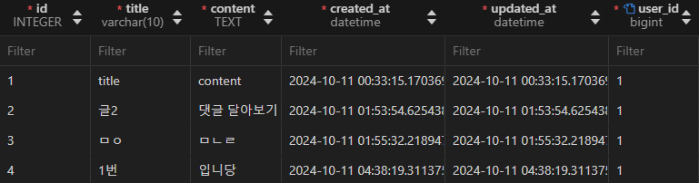

- `articles_article` 테이블에 `user_id` 필드 생성 확인

## 게시글 CREATE

1. 기존 `ArticleForm` 출력 변화 확인
    - User 모델에 대한 외래 키 데이터 입력을 위한 불필요한 input이 출력됨
        
        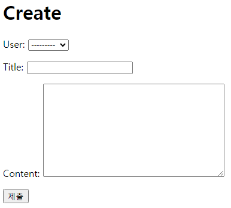
        

1. `ArticleForm` 출력 필드 수정
    
    ```python
    # articles/forms.py
    
    from django import forms
    from .models import Article, Comment
    
    class ArticleForm(forms.ModelForm):
        class Meta:
            model = Article
            **fields = ('title', 'content',)**
    ```
    

1. 게시글 작성 시 에러 발생
    
    → `user_id` 필드 데이터가 누락되었기 때문
    
    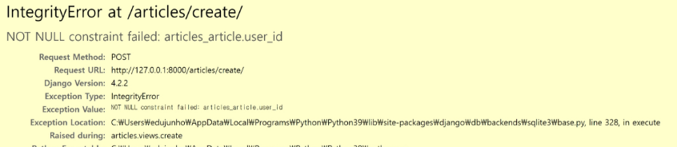
    

1. 게시글 작성 시 작성자 정보가 함께 저장될 수 있도록 `save` 의 `commit` 옵션 활용
    
    ```python
    # articles/views.py
    
    from django.shortcuts import render, redirect
    from django.contrib.auth.decorators import login_required
    from .models import Article, Comment
    from .forms import ArticleForm, CommentForm
    
    @login_required
    def create(request):
        if request.method == 'POST':
            form = ArticleForm(request.POST)
            if form.is_valid():
                **article = form.save(commit=False)
                article.user = request.user
                article.save()**
                return redirect('articles:detail', article.pk)
        else:
            form = ArticleForm()
        context = {
            'form': form,
        }
        return render(request, 'articles/create.html', context)
    ```
    

1. 게시글 작성 후 테이블 확인

## 게시글 READ

- 각 게시글의 작성자 이름 출력
    
    ```html
    <!-- articles/index.html -->
    
    
      **<p>작성자: {{ article.user.username }}</p>**
      <p>글 번호: {{ article.pk }}</p>
      <a href="">
        <p>글 제목: {{ article.title }}</p>
      </a>
      <p>글 내용: {{ article.content }}</p>
      <hr>
    
    ```
    

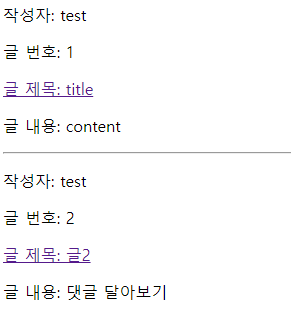

## 게시글 UPDATE

- **게시글 수정 요청 사용자와 게시글 작성 사용자를 비교해 
본인의 게시글만 수정할 수 있도록 하기**
    
    ```python
    # articles/views.py
    
    from django.shortcuts import render, redirect
    from django.contrib.auth.decorators import login_required
    from .models import Article, Comment
    from .forms import ArticleForm, CommentForm
    
    @login_required
    def update(request, pk):
        article = Article.objects.get(pk=pk)
        # 현재 수정을 요청하는 사용자와 게시글의 작성자가 같은지 비교
        **if request.user == article.user:**
            if request.method == 'POST':
                form = ArticleForm(request.POST, instance=article)
                if form.is_valid():
                    form.save()
                    return redirect('articles:detail', article.pk)
            else:
                form = ArticleForm(instance=article)
        **else: # 게시글 작성자와 다르다면 메인 페이지로 리다이렉트
            return redirect('articles:index')**
        
        context = {
            'article': article,
            'form': form,
        }
        return render(request, 'articles/update.html', context)
    ```
    

- **해당 게시글의 작성자가 아니라면, 수정/삭제 버튼을 출력하지 않도록 하기**
    
    ```html
    <!-- articles/detail.html -->
    
    ****
      <a href="">수정</a><br>
      <form action="" method="POST">
        
        <input type="submit" value="삭제">
      </form>
      <hr>
    ****
    ```
    

## 게시글 DELETE

- **삭제를 요청하려는 사람과 게시글을 작성한 사람을 비교해
본인의 게시글만 삭제할 수 있도록 하기**

```python
# articles/views.py

from django.shortcuts import render, redirect
from django.contrib.auth.decorators import login_required
from .models import Article, Comment
from .forms import ArticleForm, CommentForm

@login_required
def delete(request, pk):
    article = Article.objects.get(pk=pk)
    if request.user == article.pk:
        article.delete()
    return redirect('articles:index')
```

# Comment & User

```python
from django.urls import path
from . import views

app_name = 'articles'
urlpatterns = [
    path('', views.index, name='index'),
    path('<int:pk>/', views.detail, name='detail'),
    path('create/', views.create, name='create'),
    path('<int:pk>/delete/', views.delete, name='delete'),
    path('<int:pk>/update/', views.update, name='update'),
    path('<int:pk>/comments/', views.comments_create, name='comments_create'),
    path('<int:article_pk>/comments/<int:comment_pk>/delete/', views.comments_delete, name='comments_delete'),
]
```

## 모델 관계 설정

- **User 외래 키 정의 후 migrate**

```python
from django.db import models
from django.conf import settings

class Article(models.Model):
    user = models.ForeignKey(settings.AUTH_USER_MODEL, on_delete=models.CASCADE)
    title = models.CharField(max_length=10)
    content = models.TextField()
    created_at = models.DateTimeField(auto_now_add=True)
    updated_at = models.DateTimeField(auto_now=True)

class Comment(models.Model):
****    article = models.ForeignKey(Article, on_delete=models.CASCADE)
    **user = models.ForeignKey(settings.AUTH_USER_MODEL, on_delete=models.CASCADE)**
    content = models.CharField(max_length=200)
    created_at = models.DateTimeField(auto_now_add=True)
    updated_at = models.DateTimeField(auto_now=True)
```

- **Migration 후 `article_comment` 테이블에 `user_id` 확인**
    
    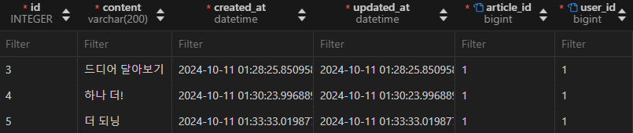
    

## 댓글 CREATE

1. **댓글 작성**
    
    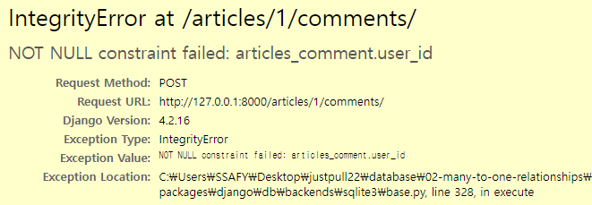
    
    - 댓글 작성 시 이전에 게시글 작성 할 때와 동일한 에러 발생
    - 댓글의 `user_id` 필드 데이터가 누락되었기 때문

1. **댓글 작성 시 작성자 정보가 함께 저장될 수 있도록 작성**

```python
# articles/views.py

from django.shortcuts import render, redirect
from django.contrib.auth.decorators import login_required
from .models import Article, Comment
from .forms import ArticleForm, CommentForm

def comments_create(request, pk):
    article = Article.objects.get(pk=pk)
    comment_form = CommentForm(request.POST)
    if comment_form.is_valid():
        # 외래 키 데이터를 넣는 타이밍이 필요
        # 외래 키를 넣으려면 2가지 조건이 필요
        # 1. comment 인스턴스 필요
        # 2. save 메서드가 호출되기 전이어야 함
        # 그런데 comment 인스턴스는 save 메서드가 호출되어야 생성됨
        comment = comment_form.save(commit=False)
        comment.article = article
        **comment.user = request.user**
        comment.save()
        return redirect('articles:detail', article.pk)
    context = {
        'article': article,
        'comment_form': comment_form
    }
    # redirect는 에러 정보를 전송할 수 없음
    return render(request, 'articles/detail.html', context)
```

1. **댓글 작성 후 테이블 확인**
    
    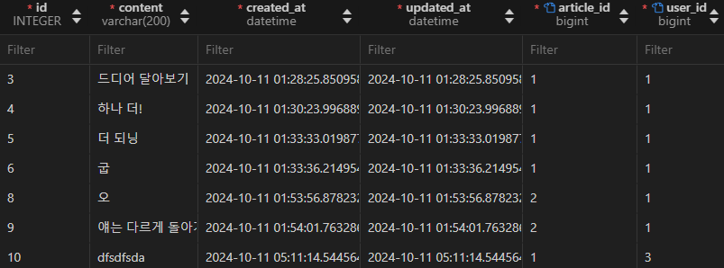
    

## 댓글 READ

- **댓글 출력 시 댓글 작성자와 함께 출력**

```html
<!-- articles/detail.html -->

 댓글 출력 
<h4>댓글 목록</h4>
<p>{{ comments|length }}개의 댓글이 있습니다.</p>
<ul>
  
    **<li>{{ comment.user.username }} - {{ comment.content }}</li>**
     댓글 삭제 
    <form action="">
      
      <input type="submit" value='DELETE'>
    </form>
  
    <p>댓글이 없어요</p>
  
</ul>
<hr>
```

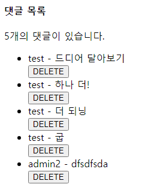

## 댓글 DELETE

- **댓글 삭제 요청 사용자와 댓글 작성 사용자를 비교하여
본인의 댓글만 삭제할 수 있도록 하기**

```python
# articles/views.py

from django.shortcuts import render, redirect
from django.contrib.auth.decorators import login_required
from .models import Article, Comment
from .forms import ArticleForm, CommentForm

def comments_delete(request, article_pk, comment_pk):
    comment = Comment.objects.get(pk=comment_pk)
    **if comment.user == request.user:**
        comment.delete()
    return redirect('articles:detail', article_pk)
```

- **해당 댓글의 작성자가 아니라면, 댓글 삭제 버튼을 출력하지 않도록 함**

```html
<!-- articles/detail.html -->

 댓글 출력 
<h4>댓글 목록</h4>
<p>{{ comments|length }}개의 댓글이 있습니다.</p>
<ul>
  
    <li>{{ comment.user.username }} - {{ comment.content }}</li>
     댓글 삭제 
    ****
      <form action="">
        
        <input type="submit" value='DELETE'>
      </form>
    ****
  
    <p>댓글이 없어요</p>
  
</ul>
<hr>
```

# View decorators

View 함수의 동작을 수정하거나 추가 기능을 제공하는데 사용되는 Python 데코레이터

**→ 코드의 재사용성을 높이고 View 로직을 간결하게 유지**

## Allowed HTTP methods

**특정 HTTP method로만 View 함수에 접근할 수 있도록 제한하는 데코레이터**

```
1. require_http_methods(["METHOD1", "METHOD2", ... ])
	- 지정된 HTTP method만 허용
2. require_safe()
	- GET과 HEAD method만 허용
3. require_POST()
	- POST method만 허용
```

### 주요 특징:

- **지정되지 않은 HTTP method로 요청이 들어오면 
`HttpResponseNotAllowed (405)` 반환**
- **대분자로 HTTP method를 지정**

### `require_http_methods()`

- 지정된 HTTP method만 허용
    
    ```python
    from django.views.decorators.http import require_http_methods
    
    @require_http_methods(['GET', 'POST'])
    def func(request):
    	pass
    ```
    

### `require_safe()`

- GET과 HEAD method만 허용
    
    ```python
    from django.views.decorators.http import require_safe
    
    @require_safe
    def func(request):
    	pass
    ```
    

### `require_POST()`

- POST method만 허용
    
    ```python
    from django.views.decorators.http import require_POST
    
    @require_POST
    def func(request):
    	pass
    ```
    
- 예시:
    
    ```python
    # articles/views.py
    
    from django.shortcuts import render, redirect
    from django.contrib.auth.decorators import login_required
    **from django.views.decorators.http import require_POST**
    
    from .models import Article, Comment
    from .forms import ArticleForm, CommentForm
    
    **@require_POST**
    def comments_delete(request, article_pk, comment_pk):
        comment = Comment.objects.get(pk=comment_pk)
        if comment.user == request.user:
            comment.delete()
        return redirect('articles:detail', article_pk)
    
    @login_required
    **@require_POST**
    def delete(request, pk):
        article = Article.objects.get(pk=pk)
        if request.user == article.pk:
            article.delete()
        return redirect('articles:index')
    
    ```
    

### `require_GET` 대신 `require_safe` 를 권장하는 이유

- 웹 표준 준수
    - GET과 HEAD는 ‘안전한(safe)’ method로 분류됨
- 호환성
    - 일부 소프트웨어는 HEAD 요청에 의존

→ 웹 표준을 준수하고, 더 넓은 범위의 클라이언트와 호환되며,
    안전한 HTTP method만을 허용하는 view 함수를 구현할 수 있음

# ERD

**`Entity-Relationship Diagram`**

- **데이터 베이스의 구조를 시각적으로 표현하는 도구**
- **Entity(개체), 속성, 그리고 Entity 간의 관계를 그래픽 형태로 나타내어
시스템의 논리적 구조를 모델링하는 다이어그램**

## 구성 요소

1. **엔티티(Entity)**
    - 데이터 베이스에 저장되는 객체나 개념
    - ex) 고객, 주문, 제품
2. **속성(Attribute)**
    - 엔티니의 특성이나 성질
    - ex) 고객(이름, 주소, 전화번호)
3. **관계(Relationship)**
    - 엔티티 간의 연관성
    - ex) 고객이 ‘주문’한 제품

### 개체와 속성

- 개체: 회원(USER)
- 속성: 회원 번호(id), 이름(name), 주소(address)
    - 개체가 지닌 속성 및 속성의 데이터 타입

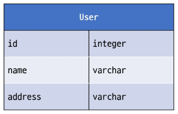

### 관계

회원과 댓글 관의 관계:

→ 회원이 ‘작성’한 댓글

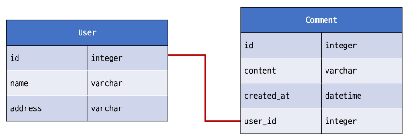

## Cardinality

**한 Entity나 다른 Entity 간의 수적 관계를 나타내는 표현**

### 주요 유형:

- 일대일 (one-to-one, 1:1)
- 다대일 (many-to-one, N:1)
- 다대다 (many-to-many, M:N)

### Cardinality 표현

- 선의 끝부분에 표시되며 일반적으로 숫자나 기호(까마귀 발)로 표현됨
    
    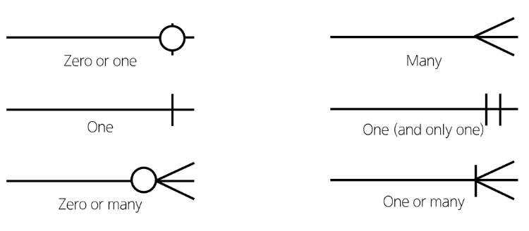
    

**Cardinality 적용**

- 회원은 여러 댓글을 작성한다.
- 각 댓글은 하나의 회원만 존재한다.
    
    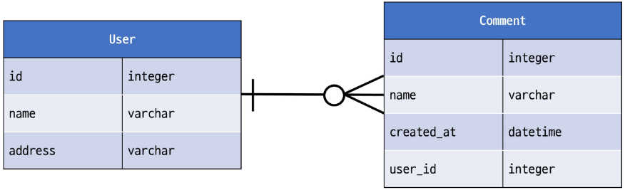
    

## ERD의 중요성

- **데이터 베이스 설계의 핵심 도구**
- **시각적 모델링으로 효과적인 의사 소통 지원**
- **실제 시스템 개발 전 데이터 구조 최적화에 중요**

## ERD 제작 사이트

- **Draw.io**
    - 별도의 회원 가입 없이 사용 가능
    - 다양한 다이어그램 템플릿
    - https://app.diagrams.net/
    
- **ERDCloud**
    - 실시간 협업 기능 지원
    - https://www.erdcloud.com/