# 데이터 베이스

체계적인 데이터 모음

## 데이터

저장이나 처리에 효율적인 형태로 변환된 정보

**증가하는 데이터 사용량**

- 배달의 민족 국내 주문 건수 (2020) : 6억 8천만 건
- 넷플릭스 구독자 2억 3840만명이 1000억 시간 시청 (2023 1 ~ 6월)
    
    → 전세계 모든 데이터의 약 90%는 2015년 이후 생산된 것 (IBM)
    

**데이터 센터의 성장**

- 네이버: 제 2 데이터 센터에 6500억 투자 (2020)
- 카카오: 제 1 데이터 센터와 제 2 데이터 센터에 1.5조 투가 (2022)
    
    → 전 세계 데이터 센터 시장 2022년부터 2026년까지 연 평균 20% 이상 성장 예상
    

**데이터를 잘 저장하고 관리하여 활용할 수 있는 기술이 중요해짐**

## 기존의 데이터 저장 방식

### 1. 파일

- 어디에서나 쉽게 사용 가능
- 데이터를 구조적으로 관리하기는 어려움

```
/개인정보.txt

이름: 김한울
나이: 56
사는 곳: 서울

이름: 이슬기
나이: 21
사는 곳: 부산

이름: 박지수
나이: 36
사는 곳: 경기
```

### 2. 스프레드 시트

- 테이블의 열과 행을 사용해 데이터를 구조적으로 관리 가능

| id | name | age | city |
| --- | --- | --- | --- |
| 1 | 김한울 | 56 | 서울 |
| 2 | 이슬기 | 21 | 부산 |
| 3 | 박지수 | 36 | 경기 |

**스프레드 시트의 한계**

- 크기:
    - 일반적으로 약 100만 행까지만 저장 가능
- 보안:
    - 단순히 파일이나 링크 소유 여부에 따른 단순한 접근 권한 기능 제공
- 정확성
    - 만약 공식적으로 `부산`의 지명이 `부상`으로 바뀌었다고 가정:
    - 이 변경으로 인해 테이블 모든 위치에서 해당 값을 업데이트 해야 함
    - `찾기 및 바꾸기` 기능을 사용해 바꿀 수 있지만, 
    만약 데이터가 여러 시트에 분산되어 있다면 누락이 생기는 등의 추가 문제 발생 가능

# 관계형 데이터 베이스

Relational Database

## 데이터 베이스 역할

**데이터를 저장(구조적 저장)하고 조작(CRUD)**

## 관계형 데이터 베이스

**데이터 간에 관계가 있는 데이터 항목들의 모음**

- 테이블, 행, 열의 정보를 구조화하는 방식
- **서로 관련된 데이터 포인터를 저장**하고 이에 대한 **액세스를 제공**
    
    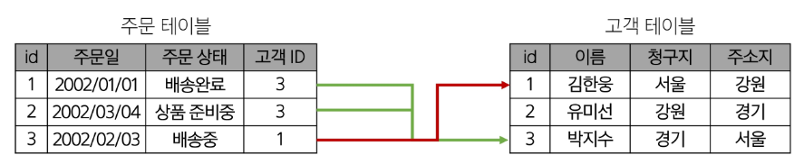
    

### 관계

여러 테이블 간의 (논리적) 연결

### 관계로 할 수 있는 것

- 이 관계로 인해 두 테이블을 사용해 데이터를 다양한 형식으로 조회할 수 있음
    - 특정 날짜에 구매한 모든 고객 조회
    - 지난 달에 배송일이 지연된 고객 조회 등

**고객 데이터 간 비교를 위해서는 어떤 값을 활용해야 할까**

→  고객들 중 동명이인이나 같은 주소지가 있을 수 있음

**→ 각 데이터에 고유한 식별 값을 부여하기 (기본 키: Primary Key)**

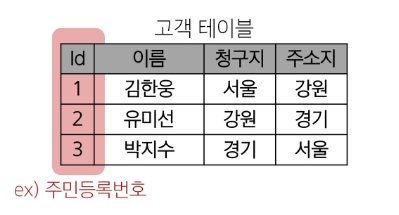

고객이 주문한 주문 데이터가 테이블에 저장되어 있을 때 누가 어떤 주문을 했는지 확인하는 법

→ 마찬가지로 동명이인이 있다면?

**→ 주문 정보에 고객의 고유한 식별 값을 저장하기 (외래 키, Foreign Key)**

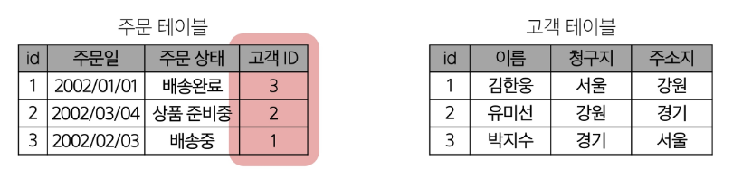

## 관계형 데이터 베이스 관련 키워드

### 1. Table (aka Relation)

- 데이터를 기록하는 곳
    
    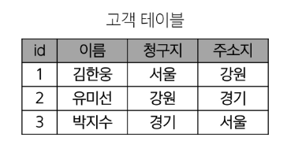
    

### 2. Field (aka Column, Attribute)

- 각 필드에는 고유한 데이터 형식(타입)이 지정됨
    
    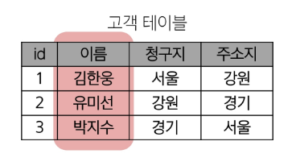
    

### 3. Record (aka Row, Tuple)

- 각 레코드에는 구체적인 데이터 값이 저장됨
    
    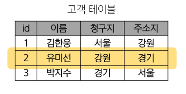
    

### 4. Database (aka Schema)

- 테이블의 집합
    
    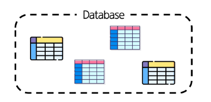
    

### 5. Primary Key (기본 키, PK)

- 각 레코드의 고유한 값
- 관계형 데이터 베이스에서 레코드의 식별자로 활용
    
    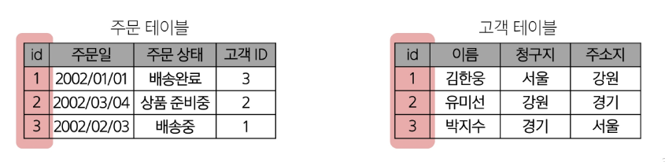
    

### 6. Foreign Key (외래 키, FK)

- 테이블의 필드 중 다른 테이블의 레코드를 식별할 수 있는 키
- 다른 테이블의 기본 키를 참조
- 각 레코드에서 서로 다른 테이블 간의 관계를 만드는 데 사용

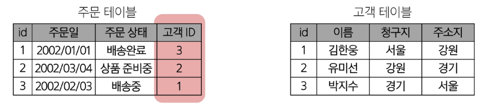

## RDBMS

**Relational Database Management System
관계형 데이터 베이스를 관리하는 소프트웨어 프로그램**

### DBMS

**Database Management System
데이터를 관리하는 소프트웨어 프로그램**

- 데이터 저장 및 관리를 용이하게 하는 시스템
- 데이터 베이스와 사용자 간의 인터페이스 역할
- 사용자가 데이터 구성, 업데이트, 모니터링, 백업, 복구 등을 할 수 있도록 도움

### **RDBMS 서비스 종류**

- SQLite
- MySQL
- PostgreSQL
- Oracle Database 등

### SQLite

경량의 오픈 소스 데이터 베이스 관리 시스템

→ 컴퓨터나 모바일 기기에 내장되어 간단하고 효율적인 데이터 저장 및 관리를 제공

## 데이터 베이스 정리

- Table은 데이터가 기록되는 곳
- Table에는 행에서 고유하게 식별 가능한 기본 키라는 속성이 있으며,
외래 키를 사용해 각 행에서 서로 다른 테이블 간의 관계를 만들 수 있음
- 데이터는 기본 키 또는 외래 키를 통해, 결합(join) 될 수 있는 여러 테이블에 걸쳐 구조화 됨

## SQL

**Structure Query Language
데이터 베이스에 정보를 저장하고 처리하기 위한 프로그래밍 언어**

```
**Structure Query Language
테이블의 형태로 구조화된 관계형 데이터 베이스에게 요청을 질의(요청)**
```


### SQL Syntax


1. SQL 키워드는 대소문자를 구분하지 않음
    - 하지만 대문자로 작성하는 것을 권장 (명시적 구분)
2. 각 SQL Statements의 끝에는 세미 콜론 `;` 필요
    - 세미콜론은 각 SQL Statements을 구분하는 방법 (명령어의 마침표)

## SQL Statements

**SQL을 구성하는 가장 기본적인 코드 블록**


- 해당 예시 코드는 SELECT Statement라 부름
- 이 Statement는 SELECT, FROM 2개의 keyword로 구성 됨

## 수행 목적에 따른 SQL Statements 4가지 유형

1. DDL - 데이터 정의
2. DQL - 데이터 검색
3. DML - 데이터 조작
4. DCL - 데이터 제어

| 유형 | 역할 | SQL 키워드 |
| --- | --- | --- |
| DDL
(Data Definition Language) | 데이터의 기본 구조
및 형식 변경 | `CREATE`
`DROP`
`ALTER` |
| DQL
(Data Query Language) | 데이터 검색 | `SELECT` |
| DML
(Data Manipulation Language) | 데이터 조작
(추가, 수정, 삭제) | `INSERT`
`UPDATE`
`DELETE` |
| DCL
(Data Control Language) | 데이터 및 작업에 대한
사용자 권한 제어 | `COMMIT`
`ROLLBACK`
`GRANT`
`REVOKE` |

### Query

- 데이터 베이스로부터 정보를 요청하는 것
- 일반적으로 SQL로 작성하는 코드를 쿼리문(SQL문) 이라고 함

### SQL 표준

- SQL은 미국 국립 표준 협회(ANSI)와 국제 표준화 기구(ISO)에 의해 표준이 채택됨
- 모든 RDBMS에서 SQL 표준을 지원
- 다만 각 RDBMS마다 독자적인 기능에 따라 표준을 벗어나는 문법이 존재하니 주의

# Single Table Queries

**SQL Statements 유형**

| DQL
(Data Query Language) | 데이터 검색 | `SELECT` |
| --- | --- | --- |

# Querying data

## `SELECT`

`SELECT statement`

**테이블에서 데이터를 조회**

```sql
SELECT 
  select_list
FROM
  table_name;
```

- **`SELECT` 키워드 이후 데이터를 선택하려는 필드를 하나 이상 지정**
- **`FROM` 키워드 이후 데이터를 선택하려는 테이블의 이름을 지정**

### 활용

1. **테이블 `employees`에서 `LastName` 필드의 모든 데이터를 조회**

```sql
SELECT 
  LastName
FROM
  employees;
```

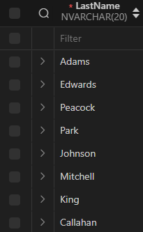

1. **테이블 `employees`에서 `LastName`, `FirstName` 필드의 모든 데이터를 조회**

```sql
SELECT
  LastName, FirstName
FROM
  employees;
```

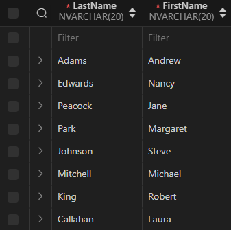

1. **테이블 `employees`에서 모든 필드 데이터를 검색**

```sql
SELECT
  *
FROM
  employees;
```

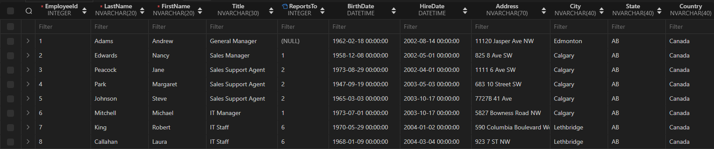

1. **테이블 `employees`에서 `FirstName` 필드의 모든 데이터를 조회
(단, 조회 시 `FirstName`이 아닌 `이름` 으로 출력될 수 있도록 변경)**

```sql
SELECT 
  FirstName AS '이름'
FROM
  employees;
```

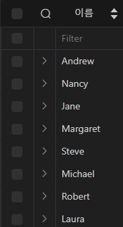

1. **테이블 `trarks` 에서 `Name`, `Milliseconds` 필드의 모든 데이터 조회
(단, `Milliseconds` 필드는 60000으로 나눠 분 단위 값으로 출력)**

```sql
SELECT
  Name,
  Milliseconds / 60000 AS '재생 시간(분)'
FROM
  tracks;
```

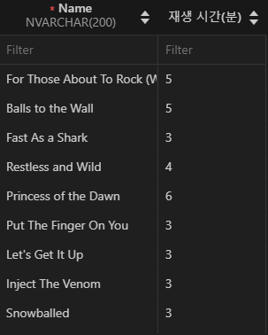

### `SELECT` 정리

- 테이블의 데이터를 조회 및 반환
- `*` (asterisk)를 사용해 모든 필드 선택 가능

# Sorting data

## `ORDER BY`

**`ORDER BY statement` 
조회 결과의 레코드를 정렬**

**`ORDER BY` systax**

- **`FROM` clause 뒤에 위치**
- **하나 이상의 Column을 기준으로 결과를 오름차순(ASC, 기본 값), 내림차순(DESC)로 정렬**

```sql
SELECT
	select_list
FROM
	table_name
ORDER BY
	column1 [ASC|DESC],
	column2 [ASC|DESC]
	...;
```

### 활용

1. **테이블 `employees`에서 `FirstName` 필드의 모든 데이터를 오름차순으로 조회**

```sql
SELECT
  FirstName
FROM
  employees
ORDER BY
  FirstName;
```

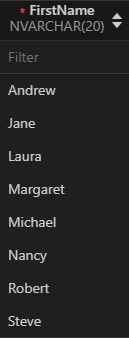

1. **테이블 `employees`에서 `FirstName` 필드의 모든 데이터를 내림차순으로 조회**

```sql
SELECT
  FirstName
FROM
  employees
ORDER BY
  FirstName DESC;
```

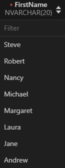

1. **테이블 `customers`에서 
`Country` 필드를 기준으로 내림차순 정렬한 다음, `City` 필드 기준으로 오름차순 정렬하여 조회**

```sql
SELECT
  Country,
  City
FROM
  customers
ORDER BY
  Country DESC, City
```

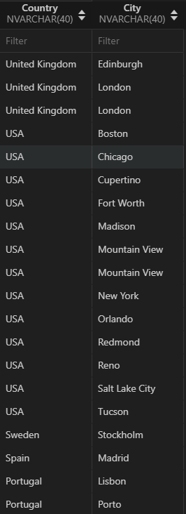

1. **테이블 `tracks`에서 `Milliseconds` 필드를 기준으로 내림차순 정렬한 다음,
`Name`, `Milliseconds` 필드의 모든 데이터를 조회
(단 `Milliseconds` 필드는 60000으로 나눠 분 단위 값으로 출력)**

```sql
SELECT
  Name,
  Milliseconds / 60000 AS '재생 시간(분)'
FROM
  tracks
ORDER BY
  Milliseconds DESC;
```

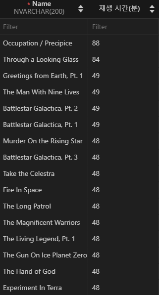

### 정렬에서의 `NULL`

**`Null` 값이 존재할 경우 오름차순 정렬 시 결과에 `NULL` 이 먼저 출력**

```sql
SELECT
  ReportsTo
FROM
  employees
ORDER BY
  ReportsTo;
```

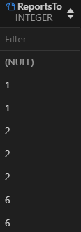

### `SELECT` statement 실행 순서


1. 테이블에서 `FROM`
2. 조회하여 `SELECT`
3. 정렬 `ORDER BY`

# Filtering data

### Filtering data 관련 keywords

| **Clause** | **Operator** |
| --- | --- |
| `DISTINCT`
`WHERE`
`LIMIT` | `BETWEEN`
`IN`
`LIKE`
`Comparision`
`Logical` |

## `DISTINCT`

`DISTINCT statement`
조회 결과에서 중복된 레코드를 제거

**`DISTINCT` Syntax**

```sql
SELECT DISTINCT
	select_list
FROM
	table_name;
```

- **`SELECT` 키워드 바로 뒤에 작성해야 함**
- **`SELECT DISTINCT` 키워드 다음에 고유한 값을 선택하려는 하나 이상의 필드를 지정**

### `DISTINCT` 활용

1. **테이블 `customers`에서 `Country` 필드의 모든 데이터를 오름차순 조회**

```sql
SELECT
  Country
FROM
  customers
ORDER BY
  Country;
```

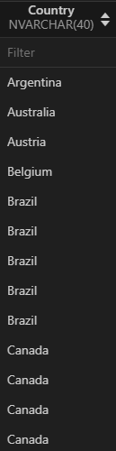

1. **테이블 `customers`에서 `Country` 필드의 모든 데이터를 중복 없이 오름차순 조회**

```sql
SELECT DISTINCT
  Country
FROM
  customers
ORDER BY
  Country;
```

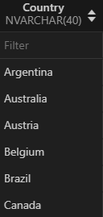

## `WHERE`

**`WHERE Statement`
조회 시 특정 검색 조건을 지정**

`WHERE` Syntax

```sql
SELECT
	select_list
FROM
	table_name
WHERE
	search_condition;
```

- **`FROM` clause 뒤에 위치**
- **`search_condition` 은 비교 연산자, 논리 연산자 (`AND` , `OR` , `NOT` 등)를 사용하는 구문이 사용됨**

### `WHERE` 활용

1. **테이블 `customers`에서 `City` 필드 값이 `Prague`인 데이터의 `LastName`, `FirstName`, `City` 조회**

```sql
SELECT
  LastName,
  FirstName,
  City
FROM
  customers
WHERE
  City = 'Prague';
```

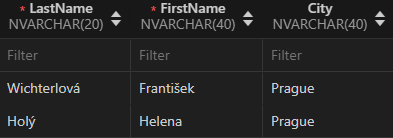

1. **테이블 `customers`에서 
City 필드 값이 `Prague`가 아닌 데이터의 `LastName`, `FirstName`, `City` 조회**

```sql
SELECT
  LastName,
  FirstName,
  City
FROM
  customers
WHERE
  City != 'Prague';
```

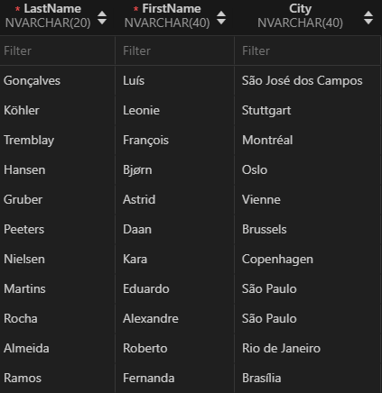

1. **테이블 `customers`에서 `Company` 필드 값이 `NULL`이고 
`Country` 필드 값이 `USA`인 데이터의 `LastName`, `FirstName`, `Company`, `Country` 조회**

```sql
SELECT
  LastName,
  FirstName,
  Company,
  Country
FROM
  customers
WHERE
  Company IS NULL
  AND Country = 'USA';
```

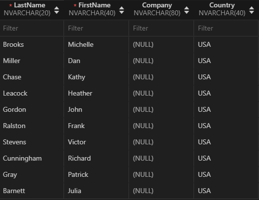

1. **테이블 `customers`에서 `Company` 필드 값이 `NULL`이거나
`Country` 필드 값이 `USA`인 데이터의 `LastName`, `FirstName`, `Company`, `Country` 조회**

```sql
SELECT
  LastName,
  FirstName,
  Company,
  Country
FROM
  customers
WHERE
  Company IS NULL
  OR Country = 'USA';
```

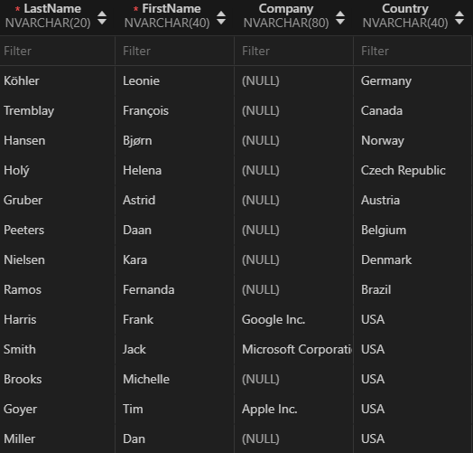

1. **테이블 `tracks`에서 `Bytes` 필드 값이 10000 이상, 500000 이하인 데이터의 `Name`, `Bytes` 조회**

```sql
SELECT
  Name,
  Bytes
FROM
  tracks
WHERE
  Bytes BETWEEN 10000 AND 500000
  -- Bytes >= 10000
  -- AND Bytes <= 500000
```

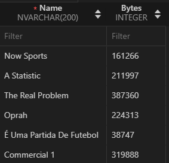

1. **테이블 `tracks`에서 `Bytes` 필드 값이 10000 이상, 500000 이하인 데이터의 
`Name`, `Bytes`를 `Bytes` 기준으로 오름차순 조회**

```sql
SELECT
  Name,
  Bytes
FROM
  tracks
WHERE
  Bytes BETWEEN 10000 AND 500000
ORDER BY
  Bytes;
```

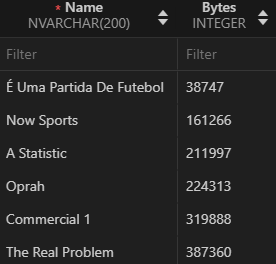

- **`ORDER BY`는 조회 이후의 결과에 사용**

1. **테이블 `customers`에서 `Country` 필드 값이
`Canada` 또는 `Germany` 또는 `France`인 데이터의 `LastName`, `FirstName`, `Country` 조회**

```sql
SELECT
  LastName,
  FirstName,
  Country
FROM
  customers
WHERE
  Country IN ('Canada', 'Germany', 'France')
  -- Country = 'Canada'
  -- OR Country = 'Germany'
  -- OR Country = 'France';
```

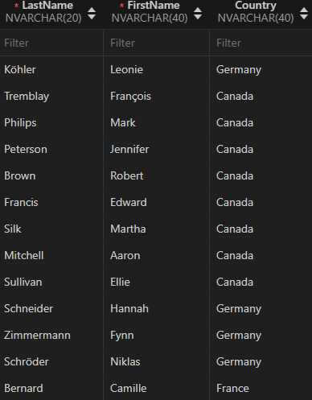

1. **테이블 `customers`에서 `Country` 필드 값이
`Canada` 또는 `Germany` 또는 `France`가 아닌 데이터의 `LastName`, `FirstName`, `Country` 조회**

```sql
SELECT
  LastName,
  FirstName,
  Country
FROM
  customers
WHERE
  Country NOT IN ('Canada', 'Germany', 'France');
  -- Country != 'Canada'
  -- OR Country != 'Germany'
  -- OR Country != 'France';
```

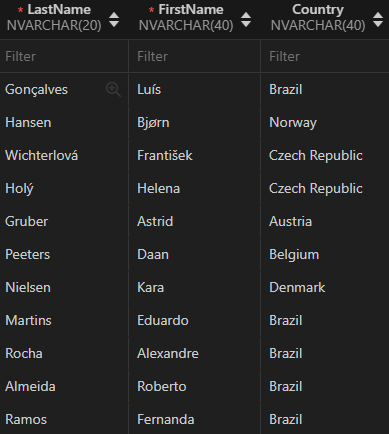

1. **테이블 `customers`에서 
`LastName` 필드 값이 `‘son’`으로 끝나는 데이터의 `LastName`, `FirstName` 조회**

```sql
SELECT
  LastName,
  FirstName
FROM
  customers
WHERE
  LastName LIKE '%son';
```

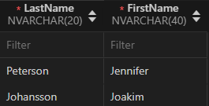

1. **테이블 `customers`에서 
`FirstName` 필드 값이 4자리이면서 `‘a’`로 끝나는 데이터의  `LastName`, `FirstName` 조회**

```sql
SELECT
  LastName,
  FirstName
FROM
  customers
WHERE
  FirstName LIKE '___a';
```

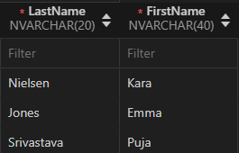

### Filtering Operator

### `Comparison Operators`

- **비교 연산자**
    
    **`=, >=, <=, !=, IS, LIKE, IN, BETWEEN ... AND`**
    

- **논리 연산자**
    
    **`AND(&&), OR(||), NOT(!)`**
    

- **`IN` : 값이 특정 목록 안에 있는지 확인**

- **`LIKE` : 값이 특정 패턴에 일치하는지 확인 (Wildcards와 함께 사용)**
    - **`Wildcard Characters`**
        - **`%` : 0개 이상의 문자열과 일치하는지 확인**
        - **`_` : 단일 문자와 일치하는지 확인**

## `LIMIT`

**조회하는 레코드 수를 제한**

**`LIMIT` syntax**

```sql
SELECT
	select_list
FROM
	table_name
LIMIT [offset, ] row_count;
```

- 하나 또는 두 개의 인자를 사용 (0 또는 양의 정수)
- row_count는 조회하는 최대 레코드 수를 지정

**`LIMIT` & `OFFSET` 예시**

```sql
SELECT
	select_list
FROM
	table_name
LIMIT 2, 5;
```

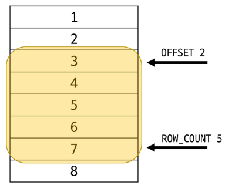

### `LIMIT` 활용

1. **테이블 `tracks`에서 `TrackId`, `Name`, `Bytes` 필드 데이터를 
`Bytes` 기준 내림차순으로 7개만 조회**

```sql
SELECT
  TrackId,
  Name,
  Bytes
FROM
  tracks
ORDER BY Bytes DESC
LIMIT 7;
```

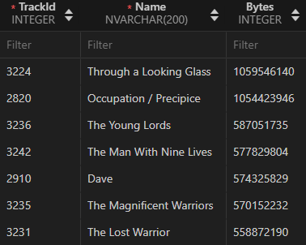

1. **테이블 `tracks`에서 `TrackId`, `Name`, `Bytes` 필드 데이터를 
`Bytes` 기준 내림차순으로 4번째부터 7번째 데이터만 조회**

```sql
SELECT
  TrackId,
  Name,
  Bytes
FROM
  tracks
ORDER BY Bytes DESC
LIMIT 3, 4;
```

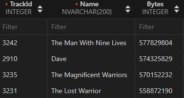

# Grouping data

## `GROUP BY`

`GROUP BY clause` : 레코드를 그룹화하여 요약본 생성 (집게 함수와 함께 사용)

### Aggregation Functions

**집계 함수**

값에 대한 계산을 수행하고, 단일한 값을 반환하는 함수

`SUM, AVG, MAX, MIN, COUNT`

`GROUP BY` systax

```sql
SELECT
	c1, c2, ... cn, aggregate_functions(ci)
FROM
	table_name
GROUP BY
	c1, c2, ..., cn;
```

- `FROM` 및 `WHERE` 절 뒤에 배치
- `GROUP BY` 절 뒤에 그룹화 할 필드 목록을 작성

### `GROUP BY` 예시

1. **`Country` 필드를 그룹화**

```sql
SELECT
  Country
FROM
  customers
GROUP BY
  Country;
```

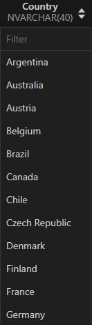

1. **`COUNT` 함수가 각 그룹에 대한 집계된 값을 계산**

```sql
SELECT
  Country, COUNT(*)
FROM
  customers
GROUP BY
  Country;
```

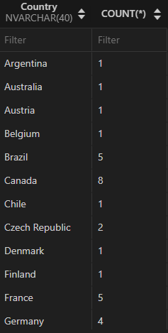

### **`GROUP BY` 활용**

1. **테이블 `tracks`에서 `Composer` 필드를 그룹화해 
각 그룹에 대한 `Bytes`의 평균 값을 내림차순 조회**
    
    ```sql
    SELECT
      Composer,
      AVG(Bytes)
    FROM
      tracks
    GROUP BY
      Composer
    ORDER BY
      AVG(Bytes) DESC;
     
    ######################################## 
     
    SELECT
      Composer,
      AVG(Bytes) AS avgOfBytes
    FROM
      tracks
    GROUP BY
      Composer
    ORDER BY
      avgOfBytes DESC;
    ```
    
    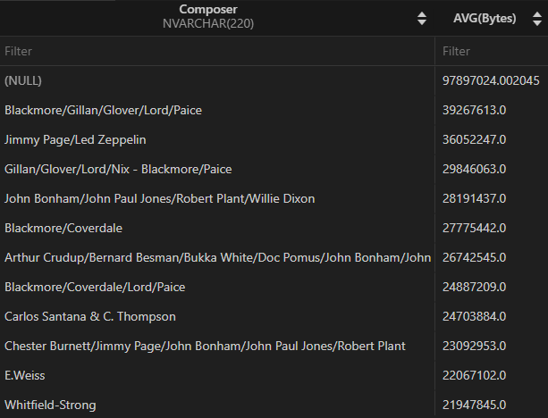
    

1. **테이블 `tracks`에서 `Composer` 필드를 그룹화하여
각 그룹에 대한 `Milliseconds` 평균 값이 10 미만인 데이터 조회
(단, `Milliseconds` 필드는 60000으로 나눠 분 단위 값의 평균으로 계산)**
    
    ```sql
    SELECT
      Composer,
      AVG(Milliseconds / 60000) AS avgOfMinute
    FROM
      tracks
    GROUP BY
      Composer
    HAVING
      avgOfMinute < 10;
    ```
    
    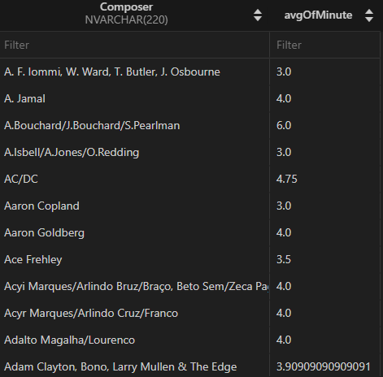
    

- **`HAVING` clause**
    - 집계 항목에 대한 세부 조건을 지정
    - 주로 `GROUP BY` 와 함께 사용되며 `GROUP BY`가 없다면 `WHERE` 처럼 동작

## `SELECT` statement 실행 순서


1. **테이블에서 `FROM`**
2. **특정 조건에 맞추어 `WHERE`**
3. **그룹화 하고 `GROUP BY`**
4. **만약 그룹 중에서 조건이 있다면 맞추고 `HAVING`**
5. **조회하여 `SELECT`**
6. **정렬하고 `ORDER BY`**
7. **특정 위치의 값을 가져옴 `LIMIT`**

# 개인 메모

**age가 30세 이상이면서, 
balance가 age가 30세 이상인 사용자들의 평균 balance보다 높은 사용자의 정보를 조회하시오.**

```sql
SELECT
  *
FROM
  users
WHERE
  age >= 30
  AND balance > (SELECT AVG(balance) 
                  FROM users 
                  WHERE age >= 30
```