# Managing Tables

### SQL Statements 유형

| DDL
(Data Definition Language) | 데이터의 기본 구조
및 형식 변경 | `CREATE
DROP
ALTER` |
| --- | --- | --- |

# Create a table

## `CREATE TABLE`

`CREATE TABLE statement` : 테이블 생성

**`CREATE TABLE` syntax**

- 각 필드에 적용할 데이터 타입 작성
- 테이블 및 필드에 대한 제약 조건(constraints) 작성

### `CREATE TABLE` 활용

1. example 테이블 생성 및 확인

```sql
CREATE TABLE example(
  ExamId INTEGER PRIMARY KEY AUTOINCREMENT,
  LastName VARCHAR(50) NOT NULL,
  FirstName VARCHAR(50) NOT NULL
);
```

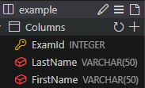

1. 테이블 schema(구조) 확인

```sql
PRAGMA table_info('example');
```

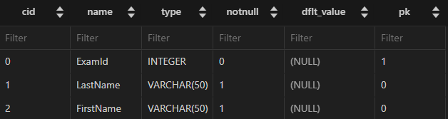

- **`cid`**
    - `Column ID` 를 의미: 각 컬럼의 고유한 식별자를 나타내는 정수 값
    - 직접 사용하지 않으며, PRAGMA 명령과 같은 메타 데이터 조회에서 출력 값으로 활용

### SQLite 데이터 타입

1. **`NULL`** : 아무런 값도 포함하지 않음을 나타냄
2. **`INTEGER`** : 정수
3. **`REAL`** : 부동 소수점
4. **`TEXT`** : 문자열
5. **`BLOB`** : 이미지, 동영상, 문서 등의 바이너리 데이터

### Constraints

제약 조건: 테이블의 필드에 적용되는 규칙 또는 제한 사항

→ 데이터의 무결성을 유지하고 데이터 베이스의 일관성을 보장

- **`PRIMARY KEY`**
    - 해당 필드를 기본 키로 지정
    - `INTEGER` 타입에만 적용되며, `INT`, `BIGINT` 등과 같은 정수 유형을 적용되지 않음
- **`NOT NULL`**
    - 해당 필드에 `NULL` 값을 허용하지 않도록 지정
- **`FOREIGN KEY`**
    - 다른 테이블과의 외래 키 관계를 정의

### `AUTOINCREMENT` keyword

자동으로 고유한 정수 값을 생성하고, 할당하는 필드 속성

**`AUTOINCREMENT` 특징**

- 필드의 자동 증가를 나타내는 특수한 키워드
- 주로 `PRIMARY KEY` 필드에 적용
- `INTEGER PRIMARY KEY AUTOINCREMENT`가 작성된 필드는 
항상 새로운 레코드에 대해 이전 최대 값보다 큰 값을 할당
- 삭제된 값은 무시되며 재사용 할 수 없게 됨

# Modifying table fields

## `ALTER TABLE`

`ALTER TABLE statement` : 테이블 및 필드 조작

### `ALTER TABLE` 역할

| **명령어** | **역할** |
| --- | --- |
| **`ALTER TABLE ADD COLUMN`** | **필드 추가** |
| **`ALTER TABLE RENAME COLUMN`** | **필드 이름 변경** |
| **`ALTER TABLE DROP COLUMN`** | **필드 삭제** |
| **`ALTER TABLE RENAME TO`** | **테이블 이름 변경** |

### **`ALTER TABLE ADD COLUMN` syntax**

```sql
ALTER TABLE
	table_name
ADD COLUMN
	column_definition;
```

- `ADD COLUMN` 키워드 이후 추가하고자 하는 새 필드 이름과 데이터 타입 및 제약 조건 작성
- 단 추가하고자 하는 필드에 `NOT NULL` 제약 조건이 있을 경우, `NULL`이 아닌 기본 값 설정 필요

### **`ALTER TABLE ADD COLUMN` 활용**

1. **`example 테이블`에 다음 조건에 맞는 `Country` 필드 추가**
    
    ```sql
    ALTER TABLE
      example
    ADD COLUMN
      Country VARCHAR(100) NOT NULL DEFAULT 'default value';
    ```
    

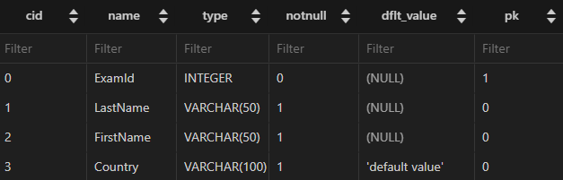

- 테이블 생성시 정의한 필드는 기본 값이 없어도 `NOT NULL` 제약 조건으로 생성되며
내부적으로 `Default Value`는 `NULL`로 설정됨

1. **example 테이블에 다음 조건에 맞는 Age, Address 필드 추가**
    
    ```sql
    ALTER TABLE
      example
    ADD COLUMN
      Age INTEGER NOT NULL DEFAULT 0;
    
    ALTER TABLE
      example
    ADD COLUMN
      Address VARCHAR(100) NOT NULL DEFAULT 'default value';
    ```
    
    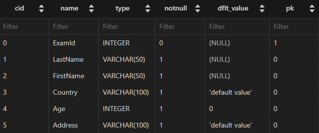
    
    **→ SQLite는 단일 문을 사용해 한 번에 여러 필드를 추가할 수 없음**
    

### **`ALTER TABLE RENAME COLUMN` syntax**

```sql
ALTER TABLE
	table_name
RENAME COLUMN
	current_name TO new_name
```

- `RENAME COLUMN` 키워드 뒤에 이름을 바꾸려는 필드의 이름을 지정하고
TO 키워드 뒤에 새 이름을 지정

### **`ALTER TABLE RENAME COLUMN` 활용**

1. **`example 테이블 Address 필드의 이름`을 `PostCode`로 변경**
    
    ```sql
    ALTER TABLE
      example
    RENAME COLUMN
      Address To PostCode;
    ```
    
    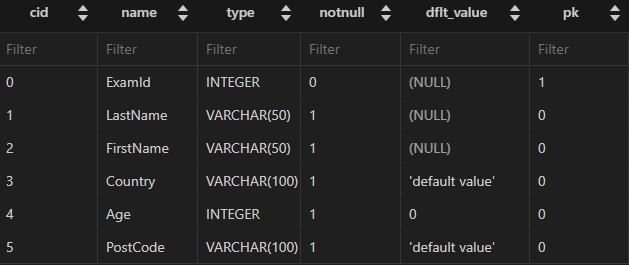
    

### **`ALTER TABLE DROP COLUMN` syntax**

```sql
ALTER TABLE
	table_name
DROP COLUMN
	column_name
```

- `DROP COLUMN` 키워드 뒤에 삭제할 필드 이름 지정

### **`ALTER TABLE DROP COLUMN` 활용**

1. **`example 테이블`의 `PostCode` 필드를 삭제**
    
    ```sql
    ALTER TABLE
      example
    DROP COLUMN
      PostCode;
    
    ```
    
    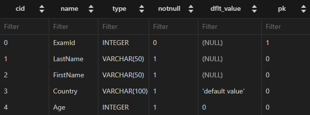
    

### **`ALTER TABLE RENAME TO` syntax**

```sql
ALTER TABLE
	table_name
RENAME TO
	new_table_name
```

- `RENAME TO` 키워드 뒤에 새로운 테이블 이름 지정

### **`ALTER TABLE RENAME TO` 활용**

1. **`example 테이블` 이름을 `new_examples`로 변경**

```sql
ALTER TABLE
  example
RENAME TO
  new_examples;
  
PRAGMA table_info('new_examples');
```

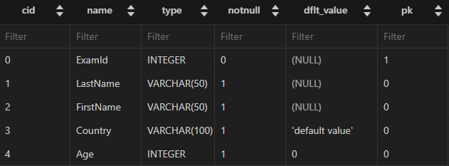

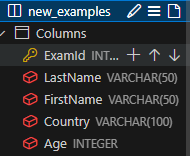

# Delete a table

## `DROP TABLE`

`DROP TABLE statement` : 테이블 삭제

### `DROP TABLE` syntax

```sql
DROP TABLE
	table_name;
```

- `DROP TABLE` statement 이후 삭제할 테이블 이름 작성

### `DROP TABLE` 활용

1. **`new_examples 테이블` 삭제**
    
    ```sql
    DROP TABLE
      new_examples;
    ```
    

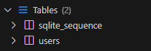

# 참고

## 타입 선호도(Type Affinity)

- **Column에 데이터 타입이 명시적으로 지정되지 않았거나 지원하지 않을 때,
SQLite가 자동으로 데이터 타입을 추론하는 것**
    
    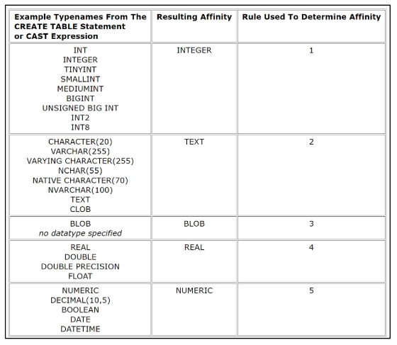
    

### SQLite 타입 선호도의 목적

1. **유연한 데이터 타입 지원**
    - 데이터 타입을 명시적으로 지정하지 않고도 데이터를 저장하고 조회할 수 있음
    - COLUMN에 저장되는 값의 특성을 기반으로 데이터 타입을 유추
2. **간편한 데이터 처리**
    - **`INTEGER` Type Affinity**를 가진 열에 문자열 데이터를 저장해도
    SQLite는 자동으로 숫자를 변환하여 처리
3. **SQL 호환성**
    - 다른 데이터베이스 시스템과 호환성을 유지

## NOT NULL 제약을 반드시 사용해야 하는가

- `NO`
- 하지만 데이터 베이스를 사용하는 프로그램에 따라 
`NULL`을 저장할 필요가 없는 경우가 많으므로, 대부분 `NOT NULL`을 정의
- 값이 없다는 표현을 테이블에 기록하는 것은
0 이나 빈 문자열 등을 사용하는 것으로 대체하는 것을 권장

# Modifying Data

### SQL Statements 유형

| DML
(Data Manipulation Language) | 데이터 조작
(추가, 수정, 삭제) | `INSERT
UPDATE
DELETE`  |
| --- | --- | --- |

# Insert data

## `INSERT`

### 사전 준비

- 실습 테이블 생성
    
    ```sql
    CREATE TABLE articles (
      id INTEGER PRIMARY KEY AUTOINCREMENT,
      title VARCHAR(100) NOT NULL,
      content VARCHAR(100) NOT NULL,
      createdAt DATE NOT NULL
    );
    
    PRAGMA table_info('articles');
    ```
    
    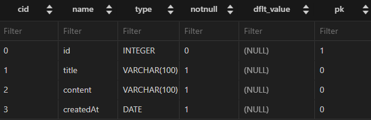
    

**`INSERT statement` : 테이블 레코드 삽입**

### `INSERT` syntax

```sql
INSERT INTO table_name (c1, c2, ...)
VALUES (v1, v2, ...);
```

- INSERT INTO 절 다음에 테이블 이름과 괄호 안에 필드 목록 작성
- VALUES 키워드 다음 괄호 안에 해당 필드에 삽입할 값 목록 작성

### `INSERT` 활용

1. articles 테이블에 다음과 같은 데이터 입력
    
    ```sql
    INSERT INTO
      articles (title, content, createdAt)
    VALUES
      ('hello', 'world', '2000-01-01');
    ```
    
    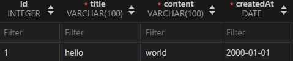
    

1. articles 테이블에 다음과 같은 데이터 추가 입력
    
    ```sql
    INSERT INTO
      articles (title, content, createdAt)
    VALUES
      ('title1', 'content1', '1900-01-01'),
      ('title2', 'content2', '1800-01-01'),
      ('title3', 'content3', '1700-01-01');
    ```
    
    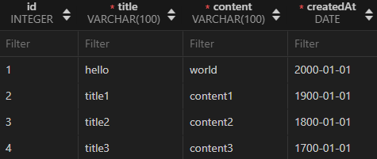
    

1. DATE 함수를 사용해 artuckes 테이블에 다음과 같은 데이터 추가 입력
    
    ```sql
    INSERT INTO
      articles (title, content, createdAt)
    VALUES
      ('mytitle', 'mycontent', DATE());
    ```
    
    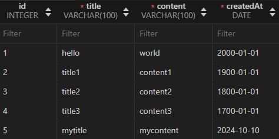
    

### 참고: SQLite의 날짜와 시간

- SQLite에는 날짜 | 시간을 저장하기 위한 별도 데이터 타입이 없음
- 대신 날짜 및 시간에 대한 함수를 사용해
표기 형식에 따라 TEXT , REAL , INTEGER 값으로 저장

# Update Data

## `UPDATE`

**`UPDATE statement` :** 테이블 레코드 수정

### `UPDATE` syntax

```sql
UPDATE
	table_name
SET
	column_name = expression,
[WHERE
	condition];
```

- SET 절 다음에 수정할 필드와 새 값을 지정
- WHERE 절에서 수정할 레코드를 지정하는 조건 작성
- WHERE 절을 작성하지 않으면 모든 레코드를 수정

### `UPDATE` 활용

1. articles 테이블 1번 레코드의 title 필드 값을 update Title로 변경
    
    ```sql
    UPDATE
      articles
    SET
      title = 'update Title'
    WHERE
      id = 1;
    ```
    
    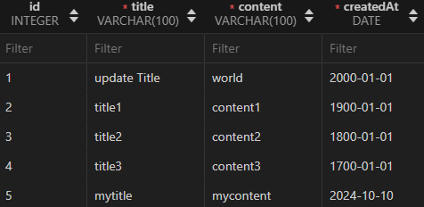
    

1. articles 테이블 2번 레코드의 title, content 필드 값을 
각각 update Title, update Content로 변경
    
    ```sql
    UPDATE
      articles
    SET
      title = 'update Title',
      content = 'update Content'
    WHERE
      id = 2;
    ```
    
    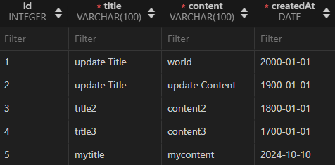
    

# Delete data

## `DELETE`

**`DELETE statement` :** 테이블 레코드 삭제

### `DELETE` syntax

```sql
DELETE FROM
	table_name
[WHERE
	condition];
```

- DELETE FROM 절 다음에 테이블 이름 작성
- WHERE 절에서 삭제할 레코드를 지정하는 조건 작성
- WHERE 절을 작성하지 않으면 모든 레코드를 삭제

### `DELETE` 활용

1. articles 테이블의 1번 레코드 삭제
    
    ```sql
    DELETE FROM
      articles
    WHERE
      id = 1;
    ```
    
    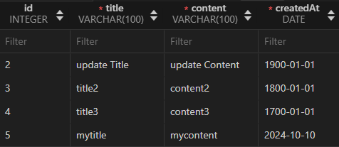
    

1. articles 테이블에서 작성일이 오래된 순으로 레코드 2개 삭제
    
    ```sql
    DELETE FROM
      articles
    WHERE id IN (
      SELECT id 
      FROM articles
      ORDER BY createdAt
      LIMIT 2
    );
    ```
    
    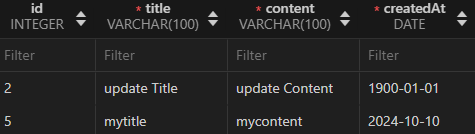
    

# Multi table queries

# Join

**관계 : 여러 테이블 간의 논리적 연결**

### 관계의 필요성

- **커뮤니티 게시판에 필요한 데이터 생각해보기**
    
    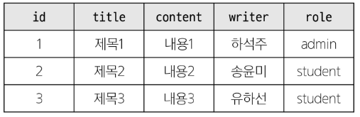
    

```sql
SELECT 
	*
FROM
	table
WHERE
	writer = '하석주';
```

- **‘하석주’가 작성한 모든 게시글을 조회하기**
    
    → 동명이인이 있거나, 특정 데이터가 수정된다면?
    

- **테이블을 나누어서 분류**
    
    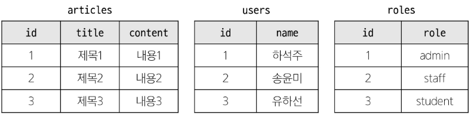
    

- **articles와 users 테이블에 각각 userId, roleId 외래 키 필드 작성**
    
    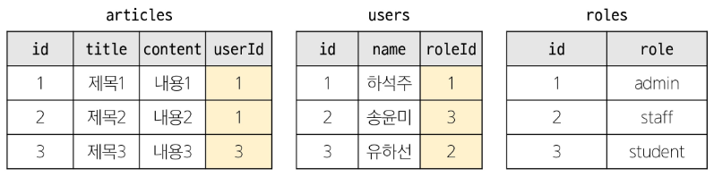
    
    - **관리자인 사람만 보고 싶다면?**
        
        → roleId가 1인 데이터 조회
        
    - **하석주라는 사람이 권미숙으로 개명한다면?**
        
        → users에서 한 번만 변경하면 자동으로 모두 변경
        

### JOIN이 필요한 순간

- 테이블을 분리하면 데이터 관리는 용이해질 수 있으나, 출력 시에는 문제가 있음
- 테이블 한 개 만을 출력할 수 밖에 없어, 다른 테이블과 결합해 출력하는 것이 필요해짐
    
    **→ 이 때 `JOIN` 사용**
    

# Joining Tables

## `JOIN`

**`JOIN clause`** : 둘 이상의 테이블에서 데이터를 검색하는 방법

### 사전 준비

1. **users 및 articles 테이블 생성**

```sql
CREATE TABLE users (
  id INTEGER PRIMARY KEY AUTOINCREMENT,
  name VARCHAR(50) NOT NULL
);

CREATE TABLE articles (
  id INTEGER PRIMARY KEY AUTOINCREMENT,
  title VARCHAR(50) NOT NULL,
  content VARCHAR(100) NOT NULL,
  userId INTEGER NOT NULL,
  FOREIGN KEY (userId) 
    REFERENCES users(id)
);
```


1. **각 테이블에 실습 데이터 입력**

```sql
INSERT INTO 
  users (name)
VALUES 
  ('하석주'),
  ('송윤미'),
  ('유하선');

INSERT INTO
  articles (title, content, userId)
VALUES 
  ('제목1', '내용1', 1),
  ('제목2', '내용2', 2),
  ('제목3', '내용3', 1),
  ('제목4', '내용4', 4),
  ('제목5', '내용5', 1);
```

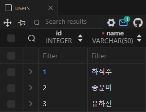

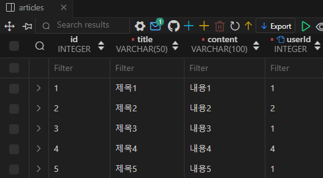

## `INNER JOIN`

**`INNER JOIN clause`** : 
두 테이블에서 값이 일치하는 레코드에 대해서만 결과를 반환

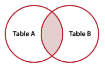

### `INNER JOIN` syntax

```sql
SELECT
	select_list
FROM
	table_a
INNER JOIN table_b
	ON table_b.fk = table_a.pk
```

- FROM 절 이후 메인 테이블 지정 (table_a)
- INNER JOIN 절 이후 메인 테이블과 JOIN할 테이블을 지정 (table_b)
- ON 키워드 이후 JOIN 조건을 작성
- JOIN 조건은 table_a와 table_b 간의 레코드를 일치 시키는 규칙을 지정

### `INNER JOIN` 예시

1. 작성자가 있는 (존재하는 회원) 모든 게시글을 작성자 정보와 함께 조회
    
    ```sql
    SELECT 
    	*
    FROM
    	articles
    INNER JOIN users
    	ON users.id = articles.userId
    ```
    
    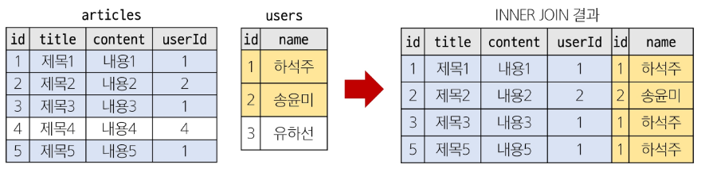
    
    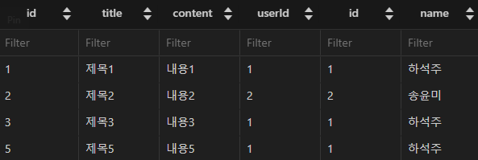
    

### `INNER JOIN` 활용

1. 회원이 작성한 모든 게시글의 작성자를 출력

```sql
SELECT articles.title, users.name
FROM articles
INNER JOIN users
  ON users.id = articles.userId;
```

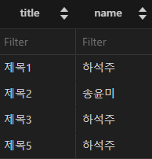

1. 1번 회원(하석주)가 작성한 모든 게시글의 제목과 작성자 명을 조회

```sql
SELECT articles.title, users.name
FROM articles
INNER JOIN users
  ON users.id = articles.userId
  **WHERE users.id = 1;**
```

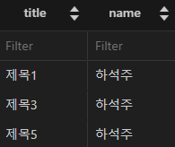

## `LEFT JOIN`

**`LEFT JOIN clause` :**
오른쪽 테이블의 일치하는 레코드와 함께
왼쪽 테이블의 모든 레코드 반환

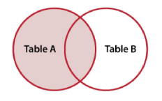

### `LEFT JOIN` syntax

```sql
SELECT
	select_list
FROM
	table_a
LEFT JOIN table_b
	ON table_b.fk = table_a.pk;
```

- FROM 절 이후 왼쪽 테이블 지정 (table_a)
- LEFT JOIN 절 이후 오른쪽 테이블 지정 (table_b)
- ON 키워드 이후 JOIN 조건을 작성
    - 왼쪽  테이블의 각 레코드를 오른쪽 테이블의 모든 레코드와 일치시킴

### `LEFT JOIN` 예시

- 모든 게시글을 작성자 정보와 함께 조회
    
    ```sql
    SELECT * FROM articles
    LEFT JOIN users
    	ON users.id = articles.userId;
    ```
    
    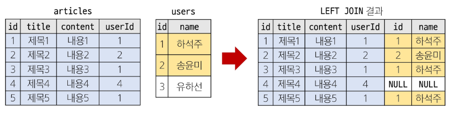
    
    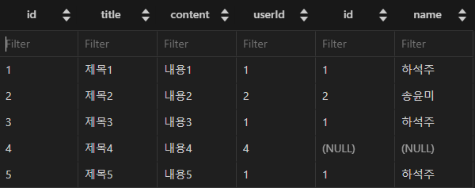
    

### `LEFT JOIN` 특징

- **왼쪽 테이블의 모든 레코드를 표기**
- **오른쪽 테이블과 매칭되는 레코드가 없으면 NULL을 표시**

### `LEFT JOIN` 활용

**게시글을 작성한 이력이 없는 회원 정보 조회**

1. **게시글을 작성한 이력 확인**
    
    ```
    SELECT 
      *
    FROM
      users
    LEFT JOIN articles
      ON articles.userId = users.id;
    ```
    
    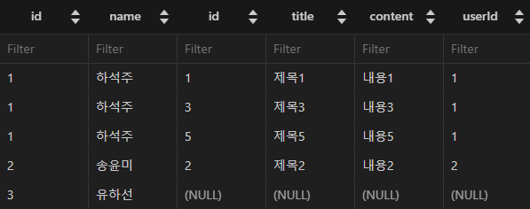
    

1. **게시글 작성 이력이 없는 회원 정보 조회**
    
    ```sql
    SELECT 
      *
    FROM
      users
    LEFT JOIN articles
      ON articles.userId = users.id
      WHERE articles.userId IS NULL;
    ```
    
    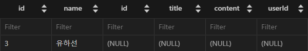
    

1. **게시글 작성 이력이 없는 회원 이름 출력**

```sql
SELECT 
  users.name
FROM
  users
LEFT JOIN articles
  ON articles.userId = users.id
  WHERE articles.userId IS NULL;
```

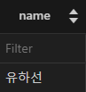