# COOKIE & SESSION

## HTTP

**HTML 문서와 같은 리소스들을 가져올 수 있도록 해주는 규약**

**웹(www)에서 이루어지는 모든 데이터 교환의 기초**

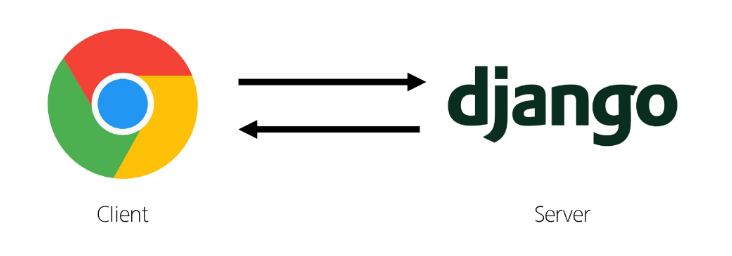

우리가 Web Page를 둘러볼 때
우리는 서버와 서로 연결되어 있는 상태가 아님.

### HTTP 특징

1. **비 연결 지향 (connectionlnss)**
    - 서버는 요청에 대한 응답을 보낸 후 연결을 끊음
2. **무상태 (stateless)**
    - 연결을 끊는 순간 클라이언트와 서버 간의 통신이 끝나며 상태 정보가 유지되지 않음

**→ 상태가 없다?**

- 장바구니에 담은 상품을 유지할 수 없음
- 로그인 상태를 유지할 수 없음

## 쿠키

### **쿠키(Cookie)**

**서버가 사용자의 웹 브라우저에 전송하는 작은 데이터 조각**

→ 서버가 제공하여 클라이언트 측에서 저장되는 작은 데이터 파일

→ 사용자 인증, 추적, 상태 유지 등에 사용되는 데이터 저장 방식

### 쿠키 동작 예시

1. 브라우저가 웹 서버에 웹 페이지를 요청
    
    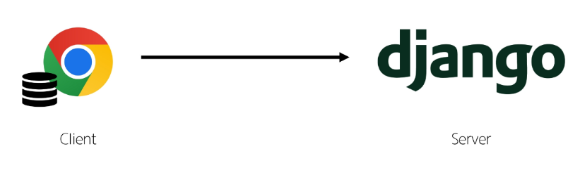
    

1. 웹 서버는 요청된 페이지와 함께 쿠키를 포함한 응답을 브라우저에게 전송
    
    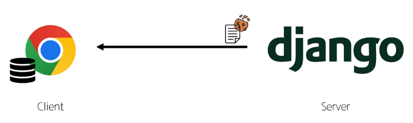
    

1. 브라우저는 받은 쿠키를 저장소에 저장
쿠키의 속성 (만료 시간, 도메인, 주소 등)도 함께 저장됨
    
    
    

1. 이후 브라우저가 같은 웹 서버에 웹 페이지를 요청할 때,
저장된 쿠키 중 해당 요청에 적용 가능한 쿠키를 포함해서 같이 전송
    
    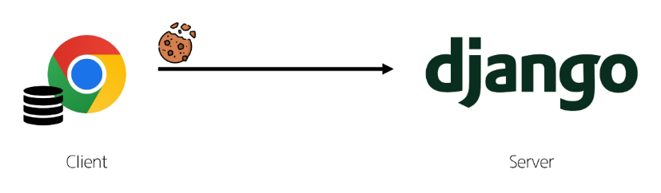
    

1. 웹 서버는 받은 쿠키 정보를 확인하고, 
필요에 따라 사용자 식별, 세션 관리 등을 수행
    
    
    

1. 웹 서버는 요청에 대한 응답을 보내며, 
필요한 경우 새로운 쿠키를 설정하거나 기존 쿠키를 수정할 수 있음
    
    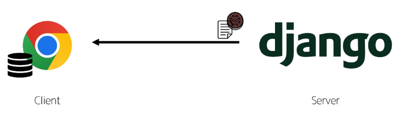
    

### 쿠키를 이용한 장바구니 예시

1. 장바구니에 상품 담기

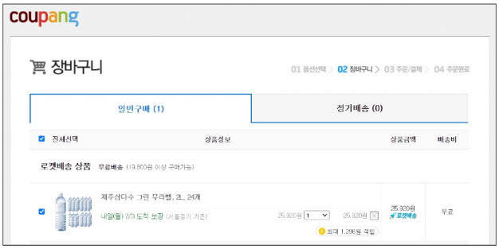

1. 개발자 도구 - Network 탭 - cartView.pang 확인
    - 서버는 응답과 함께 Set-Cookie 응답 헤더를 브라우저에게 전송
        
        → 이 헤더는 클라이언트에게 쿠키를 저장하라고 전달하는 것
        
        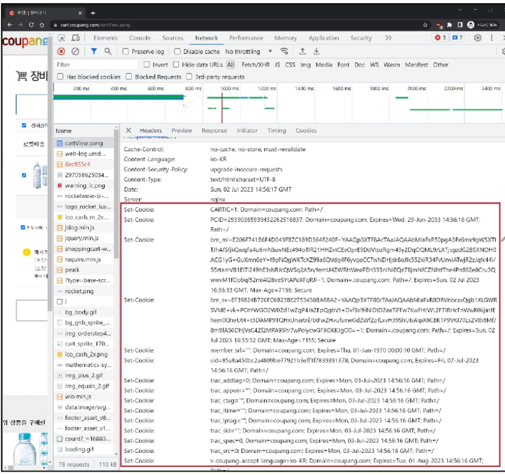
        
        - Cookie 데이터 자세히 확인
        
        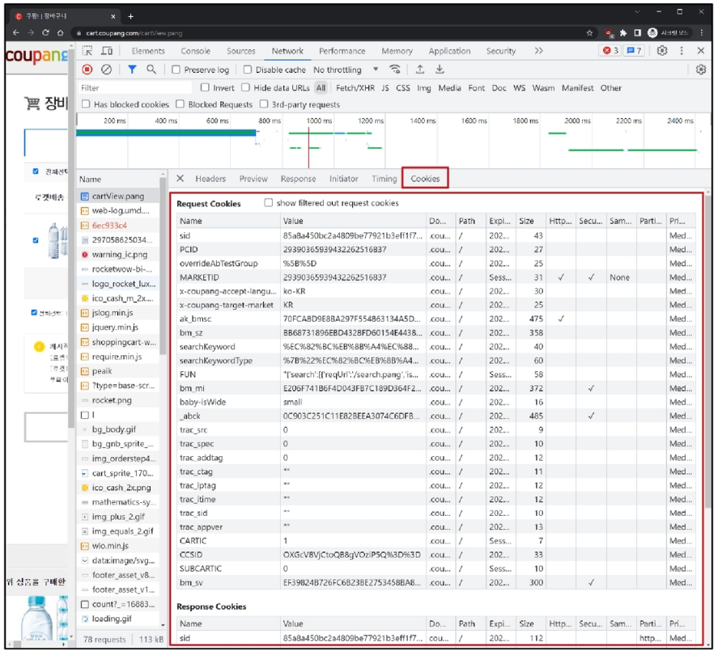
        

1. 메인 페이지 이동: 장바구니 유지 상태 확인
    
    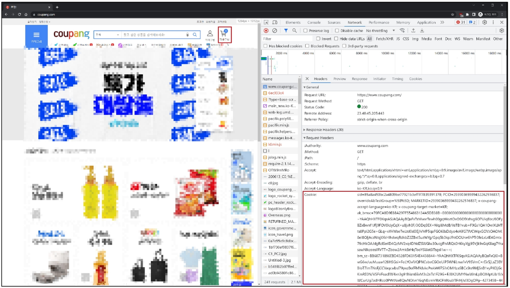
    

1. 개발자 도구 - Application 탭 - Cookies - 마우스 우측 버튼 - Clear - 새로고침
    
    → 장바구니가 비워짐
    
    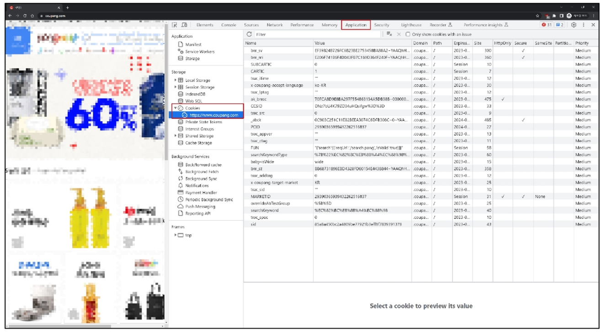
    

### 쿠키의 작동 원리와 활용

1. **쿠키의 저장 방식**
    - 브라우저(클라이언트)는 쿠키를 KEY-VALUE의 데이터 형식으로 저장
    - 쿠키에는 이름, 값 외에도 만료 시간, 도메인, 경로 등의 추가 속성이 포함됨
2. **쿠키 전송 과정**
    - 서버는 HTTP 응답 헤더의 Set-Cookie 필드를 통해 클라이언트에게 쿠키를 전송
    - 브라우저는 받은 쿠키를 저장해 두었다가, 동일한 서버에 재 요청 시 HTTP 요청
    Header의 Cookie 필드에 저장된 쿠키를 함께 전송
3. **쿠키의 주요 용도**
    - 두 요청이 동일한 브라우저에서 들어왔는지 아닌지를 판단할 때 주로 사용됨
    - 이를 이용해 사용자의 로그인 상태를 유지할 수 있음
    - 상태가 없는(stateless) HTTP 프로토콜에서 상태 정보를 기억 시켜주는 역할

**→ 서버에게 계속 `로그인된 사용자`라는 인증 정보가 담긴 쿠키를 매 요청마다 계속 보내는 것**

### 쿠키 사용 목적

1. **세션 관리 (Session Management)**
    - 로그인, 아이디 자동 완성, 공지 하루 안 보기, 팝업 체크, 장바구니 등의 정보 관리
2. **개인화 (Personalization)**
    - 사용자 선호 설정 (언어 설정, 테마 등) 저장
3. **트래킹 (Tracking)**
    - 사용자 행동을 기록 및 분석

## 세션

### 세션 (Session)

**서버 측에서 생성되어 클라이언트와 서버 간의 상태를 유지
상태 정보를 저장하는 데이터 저장 방식**

→ 쿠키에 세션 데이터를 저장해 매 요청 시마다 세션 데이터를 함께 보냄

### 세션 작동 원리

1. 클라이언트가 로그인 요청 후 인증에 성공하면 서버가 session 데이터를 생성 후 저장
2. 생성된 session 데이터에 인증할 수 있는 session id를 발급
3. 발급한 session id를 클라이언트에게 응답 (데이터는 서버에 저장, 열쇠만 주는 것)
4. 클라이언트는 응답 받은 session id를 쿠키에 저장
5. 클라이언트가 다시 동일한 서버에 접속하면
요청과 함께 쿠키 (session id가 저장된)를 서버에 전달
6. 쿠키는 요청 때마다 서버에 함께 전송되므로 
서버에서 session id를 확인해 로그인 되어있다는 것을 계속해서 확인하도록 함

```
**서버 측에서는 세션 데이터를 생성 후 저장하고 이 데이터에 접근할 수 있는 세션 ID를 생성
이 ID를 클라이언트 측으로 전달하고, 클라이언트는 쿠키에 이 ID를 저장 

이후 클라이언트가 같은 서버에 재요청할 때마다 저장해 두었던 쿠키도 요청과 함께 전송**
-> 로그인 상태 유지를 위해 로그인 되어 있다는 사실을 입증하는 데이터를 매 요청마다 보내는 것
```

## 쿠키와 세션의 목적

**클라이언트와 서버 간의 상태 정보를 유지하고 사용자를 식별하기 위해 사용**

# Django Authentication System

```python
**from django.contrib.auth import UserAdmin, login, logout
from django.contrib.auth import update_session_auth_hash, get_user_model**
# login(request, form.get_user())
# logout(request)
# update_session_auth_hash(request, updated_user) // updated_user = form.save()

**from django.contrib.auth.models import AbstrackUser 

from django.contrib.auth.forms import AuthenticationForm, PasswordChangeForm
from django.contrib.auth.forms import UserCreationForm, UserChangeForm**
# AuthenticationForm() // AuthenticationForm(request, request.POST)
# PasswordChangeForm(request.user) // PasswordChangeForm(request.user, request.POST)
# UserCreationForm() // UserCreationForm(request.POST)
# UserChangeForm(instance=request.user) // UserChangeForm(request.POST, instance=request.user)

**from django.contrib.auth.decorators import login_required**
```

## Django Authentication System

사용자 인증과 관련된 기능을 모아 놓은 시스템

Authentication (인증) : 사용자가 자신이 누구인지 확인하는 것 (신원 확인)

## 사전 준비

1. 두 번째 app `accounts` 생성 및 등록
    
    → `auth` 와 관련된 경로나 키워드들을 django 내부적으로 `accounts` 라는 이름으로 사용하고 있기 때문에, 되도록 `accounts` 로 지정하는 것을 권장
    
    ```python
    # accounts/urls.py
    
    from django.urls import path
    from . import views
    
    **app_name = 'accounts'
    urlpatterns = [
    
    ]**
    ```
    
    ```python
    # crud/urls.py
    
    from django.contrib import admin
    from django.urls import path, include
    
    urlpatterns = [
        path('admin/', admin.site.urls),
        path('articles/', include('articles.urls')),
        **path('accounts/', include('accounts.urls')),**
    ]
    ```
    

# Custom User model

## User model 대체하기

### 기본 User Model의 한계

- 우리는 지금까지 별도의 User 클래스 정의 없이, 내장된 auth 앱에 작성된 User 클래스를 사용함
- Django의 기본 User 모델은 username, password 등 제공되는 필드가 매우 제한적
- 추가적인 사용자 정보(생년월일, 주소, 나이 등)가 필요하다면 
이를 위해 기본 User Model를 변경하기 어려움
    
    **→ 별도의 설정 없이 사용할 수 있어 간편하지만, 개발자가 직접 수정하기 어려움**
    

### 내장된 auth 앱

```python
# settings.py

INSTALLED_APPS = [
    'articles',
    'accounts',
    'django_extensions',
    'django.contrib.admin',
    **'django.contrib.auth',**
    'django.contrib.contenttypes',
    'django.contrib.sessions',
    'django.contrib.messages',
    'django.contrib.staticfiles',
]
```

### User Model 대체의 필요성

- 프로젝트의 특정 요구사항에 맞춰 사용자 모델을 확장할 수 있음
- 예를 들어 이메일을 username으로 사용하거나, 다른 추가 필드를 포함시킬 수 있음

### Custom User Model로 대체하기

- **`AbstrackUser` 클래스를 상속받는 `User` 클래스 작성**
    
    → 기존 User 클래스도 `AbstrackUser` 를 상속받기 때문에,
        커스텀 User 클래스도 기존 User 클래스와 완전히 같은 모습을 가지게 됨
    
    ```python
    # accounts/models.py
    
    from django.db import models
    **from django.contrib.auth.models import AbstractUser**
    
    **class User(AbstractUser):
        pass**
    ```
    

- **Django 프로젝트에서 사용하는 기본 User 모델을 우리가 작성한 User 모델로 사용할 수 있도록 `AUTH_USER_MODEL` 값을 변경**
    
    → 수정 전 기본 값은 `auth.User`
    
    ```python
    # settings.py
    
    **AUTH_USER_MODEL = 'accounts.User'**
    ```
    

- **admin site에 대체한 User 모델 등록**
    
    → 기본 User 모델이 아니기 때문에, 등록하지 않으면 admin 페이지에 출력되지 않기 때문
    
    ```python
    # accounts/admin.py
    
    from django.contrib import admin
    **from django.contrib.auth.admin import UserAdmin
    from .models import User**
    
    # Register your models here.
    **admin.site.register(User, UserAdmin)**
    ```
    

**`AUTH_USER_MODEL`** : Django 프로젝트의 User를 나타내는데 사용하는 모델을 지정하는 속성 

### 주의:

**프로젝트 중간에 AUTH_USER_MODEL을 변경할 수 없음**

→ 이미 프로젝트가 진행되고 있을 경우, 데이터베이스 초기화 후 진행

**사용하는 User 테이블의 변화**

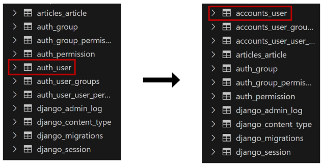

**프로젝트를 시작하며 반드시 User 모델을 대체해야 한다**

- Django는 새 프로젝트를 시작하는 경우, 
비록 기본 User 모델이 충분하더라도 커스텀 User 모델을 설정하는 것을 강력하게 권장하고 있음
- 커스텀 User 모델은 기본 User 모델과 동일하게 작동하면서도
필요한 경우 나중에 맞춤 설정할 수 있기 때문
    
    → 단, User 모델 대체 작업은 
        프로젝트의 모든 migrations 혹은 첫 migrate를 실행하기 전에 이 작업을 마쳐야 함
    

# 아래 로직 전체 코드

```python
# crud/urls.py

from django.contrib import admin
from django.urls import path, include
from accounts import views

urlpatterns = [
    path('admin/', admin.site.urls),
    path('articles/', include('articles.urls')),
    path('accounts/', include('accounts.urls')),
    path('<int:user_pk>/password/', views.change_password, name='change_password'),
]
```

```python
# articles/urls.py

from django.urls import path
from . import views

app_name = 'articles'
urlpatterns = [
    path('', views.index, name='index'),
    path('<int:pk>/', views.detail, name='detail'),
    path('create/', views.create, name='create'),
    path('<int:pk>/delete/', views.delete, name='delete'),
    path('<int:pk>/update/', views.update, name='update'),
]
```

```python
# articles/views.py

from django.shortcuts import render, redirect

from .models import Article
from .forms import ArticleForm
from django.contrib.auth.decorators import login_required

# Create your views here.
def index(request):
    articles = Article.objects.all()
    context = {
        'articles': articles,
    }
    return render(request, 'articles/index.html', context)

def detail(request, pk):
    article = Article.objects.get(pk=pk)
    context = {
        'article': article,
    }
    return render(request, 'articles/detail.html', context)

@ login_required
def create(request):
    if request.method == 'POST':
        form = ArticleForm(request.POST)
        if form.is_valid():
            article = form.save()
            return redirect('articles:detail', article.pk)
    else:
        form = ArticleForm()
    context = {
        'form': form,
    }
    return render(request, 'articles/create.html', context)

@ login_required
def update(request, pk):
    article = Article.objects.get(pk=pk)
    if request.method == 'POST':
        form = ArticleForm(request.POST, instance=article)
        if form.is_valid():
            form.save()
            return redirect('articles:detail', article.pk)
    else:
        form = ArticleForm(instance=article)
    context = {
        'article': article,
        'form': form,
    }
    return render(request, 'articles/update.html', context)

@ login_required
def delete(request, pk):
    article = Article.objects.get(pk=pk)
    article.delete()
    return redirect('articles:index')
```

```python
# accounts/urls.py

from django.urls import path
from . import views

app_name = 'accounts'
urlpatterns = [
    path('login/', views.login, name='login'),
    path('logout/', views.logout, name='logout'),
    path('signup/', views.signup, name='signup'),
    path('delete/', views.delete, name='delete'),
    path('update/', views.update, name='update'),
]
```

```python
# accounts/views.py

from django.shortcuts import render, redirect
from django.contrib.auth.forms import AuthenticationForm, PasswordChangeForm
from .forms import CustomUserCreationForm, CustomUserChangeForm
from django.contrib.auth import login as auth_login
from django.contrib.auth import logout as auth_logout
from django.contrib.auth import update_session_auth_hash
from django.contrib.auth.decorators import login_required

# Create your views here.
def login(request):
    if request.user.is_authenticated: # 속성 값이라 호출 필요 X
        return redirect('articles:index')
    if request.method == 'POST':
        form = AuthenticationForm(request, request.POST)
        if form.is_valid():
            auth_login(request, form.get_user())
            return redirect('articles:index')
    else:
        form = AuthenticationForm()
    context = {
        'form': form,
    }
    return render(request, 'accounts/login.html', context)

@ login_required
def logout(request):
    auth_logout(request)
    return redirect('articles:index')

def signup(request):
    if request.user.is_authenticated: # 속성 값이라 호출 필요 X
        return redirect('articles:index')
    if request.method == "POST":
        form = CustomUserCreationForm(request.POST)
        if form.is_valid():
            user = form.save()
            auth_login(request, user)
            return redirect('articles:index')
    else:
        form = CustomUserCreationForm()
    context = {
        'form': form,
    }
    return render(request, 'accounts/signup.html', context)

@ login_required
def delete(request):
    # 누가 회원 탈퇴를 요청한 건지 User 모델에서 검색할 필요가 없다
    # request 객체에 요청을 보내는 user 정보가 함께 들어있기 때문
    request.user.delete()
    auth_logout(request)
    return redirect('articles:index')

@ login_required
def update(request):
    if request.method == "POST":
        form = CustomUserChangeForm(request.POST, instance=request.user)
        if form.is_valid():
            form.save()
            return redirect('articles:index')
    else:
        form = CustomUserChangeForm(instance=request.user)
    context = {
        'form': form,
    }
    return render(request, 'accounts/update.html', context)

@ login_required
def change_password(request, user_pk):
    if request.method == 'POST':
        form = PasswordChangeForm(request.user, request.POST)
        if form.is_valid():
            updated_user = form.save()
            update_session_auth_hash(request, updated_user)
            return redirect('articles:index')
    else:
        form = PasswordChangeForm(request.user)
    context = {
        'form': form,
    }
    return render(request, 'accounts/change_password.html', context)
```

# Login

## Login

로그인은 Session을 Create하는 과정

### `AuthenticationForm()`

로그인 인증에 사용할 데이터를 입력 받는 built-in form

## 로그인 페이지 작성

```html
<!-- accounts/login.html -->

<!DOCTYPE html>
<html lang="en">
<head>
  <meta charset="UTF-8">
  <meta name="viewport" content="width=device-width, initial-scale=1.0">
  <title>Document</title>
</head>
<body>
  <h1>로그인</h1>
  <form action="" method='POST'>
    
    {{ form.as_p }}
    <input type="submit" value='로그인'>
  </form>
</body>
</html>
```

```python
# accounts/urls.py

from django.urls import path
from . import views

app_name = 'accounts'
urlpatterns = [
    path('login/', views.login, name='login')
]
```

```python
# accounts/views.py

from django.shortcuts import render, redirect
**from django.contrib.auth.forms import AuthenticationForm
from django.contrib.auth import login as auth_login**

**def login(request):
    if request.method == 'POST':
        # ModelForm과 달리 첫번째 인자가 request.POST가 아님
        # 무조건 첫번째에 request 요청 데이터가 들어가야 함
        form = AuthenticationForm(request, request.POST)
        if form.is_valid():
            # 만약 인증된 사용자라면 로그인 진행(세션 데이터 생성)
            # auth_login(request, 인증된 유저 객체)
            auth_login(request, form.get_user())
            return redirect('articles:index')
    else:
        form = AuthenticationForm()
    context = {
        'form': form,
    }
    return render(request, 'accounts/login.html', context)**
```

**`login(request, user)` :** 

**`AuthenticationForm`을 통해 인증된 사용자를 로그인 하는 함수**

**`get_user()` :**

**`AuthenticationForm` 의 인스턴스 메서드**

→ 유효성 검사를 통과했을 경우 로그인한 사용자 객체를 반환

## 세션 데이터 확인하기

1. 로그인 후 발급받은 세션 확인
    - `django_session` 테이블에서 확인
    
    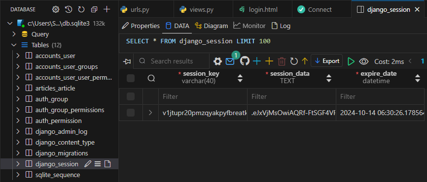
    

1. 브라우저에서 확인
    - 개발자 도구 - Application - Cookies
    
    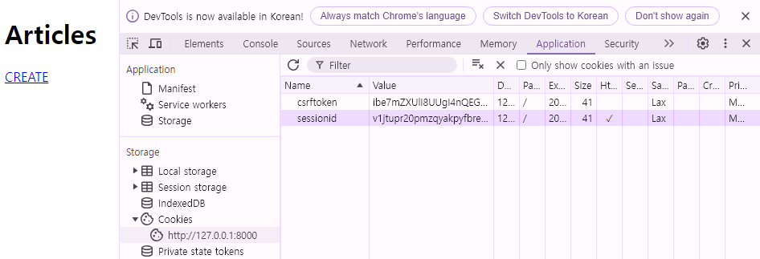
    

## 로그인 링크 작성

- 메인 페이지에 로그인 페이지로 갈 수 있는 링크 작성

```html
<!-- articles/index.html -->

<!DOCTYPE html>
<html lang="en">
<head>
  <meta charset="UTF-8">
  <meta name="viewport" content="width=device-width, initial-scale=1.0">
  <title>Document</title>
</head>
<body>
  <h1>Articles</h1>
  <a href="">CREATE</a>
  **<a href="">LOGIN</a>**
  
    <p>글 번호: {{ article.pk }}</p>
    <a href="">
      <p>글 제목: {{ article.title }}</p>
    </a>
    <p>글 내용: {{ article.content }}</p>
    <hr>
  
</body>
</html>
```

# Logout

## Logout

**로그아웃은 Session을 Delete하는 과정**

`logout(request)` 

1. DB에서 현재 요청에 대한 Session Data를 삭제
2. 클라이언트의 쿠키에서도 Session ID를 삭제

## 로그아웃 로직 작성

```html
<!-- articles/index.html -->

<!DOCTYPE html>
<html lang="en">
<head>
  <meta charset="UTF-8">
  <meta name="viewport" content="width=device-width, initial-scale=1.0">
  <title>Document</title>
</head>
<body>
  <h1>Articles</h1>
  <a href="">CREATE</a>
  <a href="">LOGIN</a>
  **<form action="" method='POST'>
    
    <input type="submit" value="LOGOUT">
  </form>**
  
    <p>글 번호: {{ article.pk }}</p>
    <a href="">
      <p>글 제목: {{ article.title }}</p>
    </a>
    <p>글 내용: {{ article.content }}</p>
    <hr>
  

</body>
</html>
```

```python
# accounts/urls.py

from django.urls import path
from . import views

app_name = 'accounts'
urlpatterns = [
    path('login/', views.login, name='login'),
    **path('logout/', views.logout, name='logout'),**
]
```

```python
# accounts/vies.py

from django.shortcuts import render, redirect
from django.contrib.auth.forms import AuthenticationForm
from django.contrib.auth import login as auth_login
**from django.contrib.auth import logout as auth_logout**

# Create your views here.
def login(request):
    if request.method == 'POST':
        # ModelForm과 달리 첫번째 인자가 request.POST가 아님
        # 무조건 첫번째에 request 요청 데이터가 들어가야 함
        form = AuthenticationForm(request, request.POST)
        if form.is_valid():
            # 만약 인증된 사용자라면 로그인 진행(세션 데이터 생성)
            # auth_login(request, 인증된 유저 객체)
            auth_login(request, form.get_user())
            return redirect('articles:index')
    else:
        form = AuthenticationForm()
    context = {
        'form': form,
    }
    return render(request, 'accounts/login.html', context)

**def logout(request):
    # 세션 데이터 삭제
    auth_logout(request)
    return redirect('articles:index')**
```

## 세션 데이터 확인하기

- **로그아웃 버튼을 누르면 세션 데이터 삭제됨**

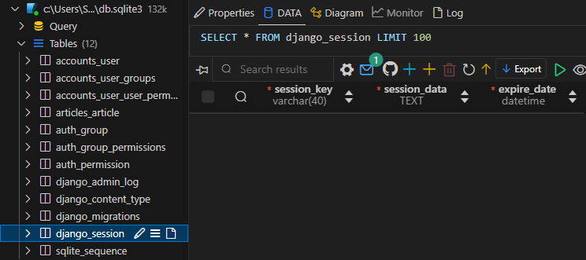

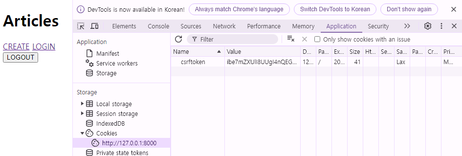

# Template with Authentication data

## 템플릿과 인증 데이터

### Template with Authentication data

**템플릿에서 인증 관련 데이터를 출력하는 방법**

## 현재 로그인 되어있는 유저 정보 출력하기

```html
<!-- articles/index.html -->

<!DOCTYPE html>
<html lang="en">
<head>
  <meta charset="UTF-8">
  <meta name="viewport" content="width=device-width, initial-scale=1.0">
  <title>Document</title>
</head>
<body>
  <p>안녕하세요 {{ user.username }}님!</p>
</body>
</html>
```

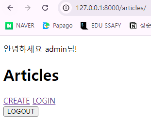

- **`user` 라는 context 데이터를 사용할 수 있는 이유는?**
    
    **→ Django가 미리 준비한 context 데이터가 존재하기 때문 (context processors)**
    

### context processors

- 템플릿이 렌더링 될 떄 호출 가능한 context 데이터 목록
- 작성된 context 데이터는 기본적으로 template에서 사용 가능한 변수로 포함됨
    
    → django에서 자주 사용하는 데이터 목록을 미리 template에 load해둔 것
    

# 회원 가입

## 회원 가입

**User 객체를 Create 하는 과정**

### `UserCreationForm()`

회원 가입 시 사용자 입력 데이터를 받는 **`built-in ModelForm`**

## 회원 가입 페이지 작성

```html
<!-- accounts/signup.html -->

<!DOCTYPE html>
<html lang="en">
<head>
  <meta charset="UTF-8">
  <meta name="viewport" content="width=device-width, initial-scale=1.0">
  <title>Document</title>
</head>
<body>
  <h1>회원 가입</h1>
  <form action="" method="POST">
    
    {{ form.as_p }}
    <input type="submit">
  </form>
</body>
</html>
```

```python
# accounts/urls.py

from django.urls import path
from . import views

app_name = 'accounts'
urlpatterns = [
    **path('signup/', views.signup, name='signup'),**
]

```

```python
# accounts/views.py

from django.shortcuts import render, redirect
**from django.contrib.auth.forms import UserCreationForm

def signup(request):
    if request.method == "POST":
        form = UserCreationForm(request.POST)
        if form.is_valid():
            form.save()
            return redirect('articles:index')
    else:
        form = UserCreationForm()
    context = {
        'form': form,
    }
    return render(request, 'accounts/signup.html', context)**
```

### 회원 가입 로직 에러

- 회원 가입 시도 후 아래 에러 페이지 확인
    
    ```
    Manager isn't available; 'auth.User' has been swapped for 'accounts.User'
    ```
    
    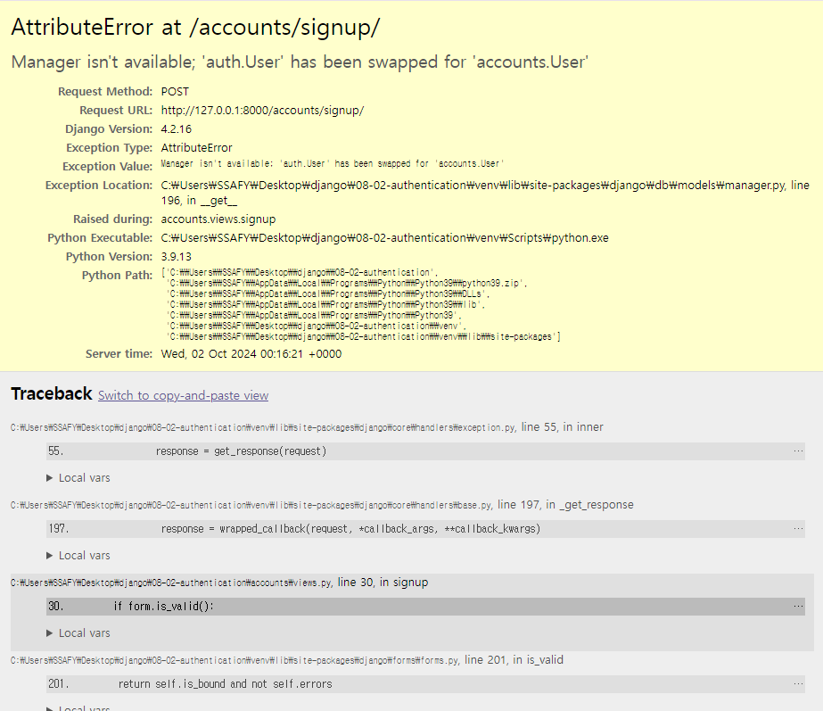
    

- 회원 가입에 사용하는 `UserCreationForm` 이 대체한 custom 모델이 아닌,
과거 Django의 기본 유저 모델로 인해 작성된 class 이기 때문
    
    ```python
    class Meta:
    		model = User
    		fields = ("username",)
    		field_classes = {"username": UsernameField}
    ```
    

### 다시 작성해야 하는 Form

**커스텀 유저 모델을 사용하기 위해 다시 작성해야 하는 Form**

- `UserCreationForm`
- `UserChangeForm`

→ 두 Form 모두 `class Meta: model = User`가 작성된 Form이기 때문에 재작성 필요

- Custom User Model을 사용할 수 있또록 상속 후 일부분만 재작성

```python
from django.contrib.auth.forms import UserCreationForm
from django.contrib.auth.forms import UserChangeForm

# Django는 User 모델을 직접 참조하는 것을 권장하지 않음
# from .models import User

# Django는 User 모델을 간접적으로 참조할 수 있는 방법을 별도로 제공
from django.contrib.auth import get_user_model # 현재 활성화된 User 모델을 import

class CustomUserCreationForm(UserCreationForm):
    class Meta(UserCreationForm.Meta): # UserCreationForm의 Meta 클래스 상속
        model = get_user_model()

class CustomUserChangeForm(UserChangeForm):
    class Meta(UserChangeForm.Meta):
        model = get_user_model()
```

**`get_user_model()` :** 현재 프로젝트에서 활성화된 사용자 모델(active user model)을 반환하는 함수

**User 모델을 직접 참조하지 않는 이유**

- **`get_user_model()`**을 사용해 **`User`** 모델을 참조하면 
**`커스텀 User 모델`**을 자동으로 반환해주기 때문
- Django는 필수적으로 **`User class`**를 직접 참조하는 대신 
**`get_user_model()`**을 사용해 참조해야 한다고 강조하고 있음

### 회원 가입 로직 완성

- **`CustomUserCreationForm`**으로 변경
    
    ```python
    # accounts/views.py
    
    from django.shortcuts import render, redirect
    from .forms import CustomUserCreationForm
    
    def signup(request):
        if request.method == "POST":
            form = CustomUserCreationForm(request.POST)
            if form.is_valid():
                form.save()
                return redirect('articles:index')
        else:
            form = CustomUserCreationForm()
        context = {
            'form': form,
        }
        return render(request, 'accounts/signup.html', context)
    ```
    

# 회원 탈퇴

User 객체를 Delete 하는 과정

## 회원 탈퇴 로직 작성

```html
<!-- accounts/delete.html -->

<!DOCTYPE html>
<html lang="en">
<head>
  <meta charset="UTF-8">
  <meta name="viewport" content="width=device-width, initial-scale=1.0">
  <title>Document</title>
</head>
<body>
  <h1>회원 가입</h1>
  <form action="" method="POST">
    
    {{ form.as_p }}
    <input type="submit">
  </form>
</body>
</html>
```

```python
# accounts/urls.py

from django.urls import path
from . import views

app_name = 'accounts'
urlpatterns = [
    **path('delete/', views.delete, name='delete'),**
]

```

```python
# accounts/views.py

from django.shortcuts import render, redirect

**def delete(request):
    # 누가 회원 탈퇴를 요청한 건지 User 모델에서 검색할 필요가 없다
    # request 객체에 요청을 보내는 user 정보가 함께 들어있기 때문
    request.user.delete()
    return redirect('articles:index')**
```

# 회원 정보 수정

**User 객체를 Update하는 과정**

### `UserChangeForm()`

회원 정보 수정 시 사용자 입력 데이터를 받는 **`built-in ModelForm`**

## 회원 정보 수정 페이지 작성

```html
<!-- accounts/update.html -->

<!DOCTYPE html>
<html lang="en">
<head>
  <meta charset="UTF-8">
  <meta name="viewport" content="width=device-width, initial-scale=1.0">
  <title>Document</title>
</head>
<body>
  <h1>회원 정보 수정</h1>
  <form action="" method="POST">
    
    {{ form.as_p }}
    <input type="submit">
  </form>
</body>
</html>
```

```python
# accounts/urls.py

from django.urls import path
from . import views

app_name = 'accounts'
urlpatterns = [
    **path('update/', views.update, name='update'),**
]
```

```python
# accounts/views.py

from django.shortcuts import render, redirect
from .forms import CustomUserCreationForm, CustomUserChangeForm

def update(request):
    if request.method == "POST":
        form = CustomUserChangeForm(request.POST, instance=request.user)
        if form.is_valid():
            form.save()
            return redirect('articles:index')
    else:
        form = CustomUserChangeForm(instance=request.user)
    context = {
        'form': form,
    }
    return render(request, 'accounts/update.html', context)
```

### 다시 작성해야 하는 Form

**커스텀 유저 모델을 사용하기 위해 다시 작성해야 하는 Form**

- `UserCreationForm`
- `UserChangeForm`

→ 두 Form 모두 `class Meta: model = User`가 작성된 Form이기 때문에 재작성 필요

- Custom User Model을 사용할 수 있또록 상속 후 일부분만 재작성

```python
from django.contrib.auth.forms import UserCreationForm
from django.contrib.auth.forms import UserChangeForm

# Django는 User 모델을 직접 참조하는 것을 권장하지 않음
# from .models import User

# Django는 User 모델을 간접적으로 참조할 수 있는 방법을 별도로 제공
from django.contrib.auth import get_user_model # 현재 활성화된 User 모델을 import

class CustomUserCreationForm(UserCreationForm):
    class Meta(UserCreationForm.Meta): # UserCreationForm의 Meta 클래스 상속
        model = get_user_model()

class CustomUserChangeForm(UserChangeForm):
    class Meta(UserChangeForm.Meta):
        model = get_user_model()
```

**`get_user_model()` :** 현재 프로젝트에서 활성화된 사용자 모델(active user model)을 반환하는 함수

**User 모델을 직접 참조하지 않는 이유**

- **`get_user_model()`**을 사용해 **`User`** 모델을 참조하면 
**`커스텀 User 모델`**을 자동으로 반환해주기 때문
- Django는 필수적으로 **`User class`**를 직접 참조하는 대신 
**`get_user_model()`**을 사용해 참조해야 한다고 강조하고 있음

### 문제점

- **회원 정보 수정 페이지 확인**
    
    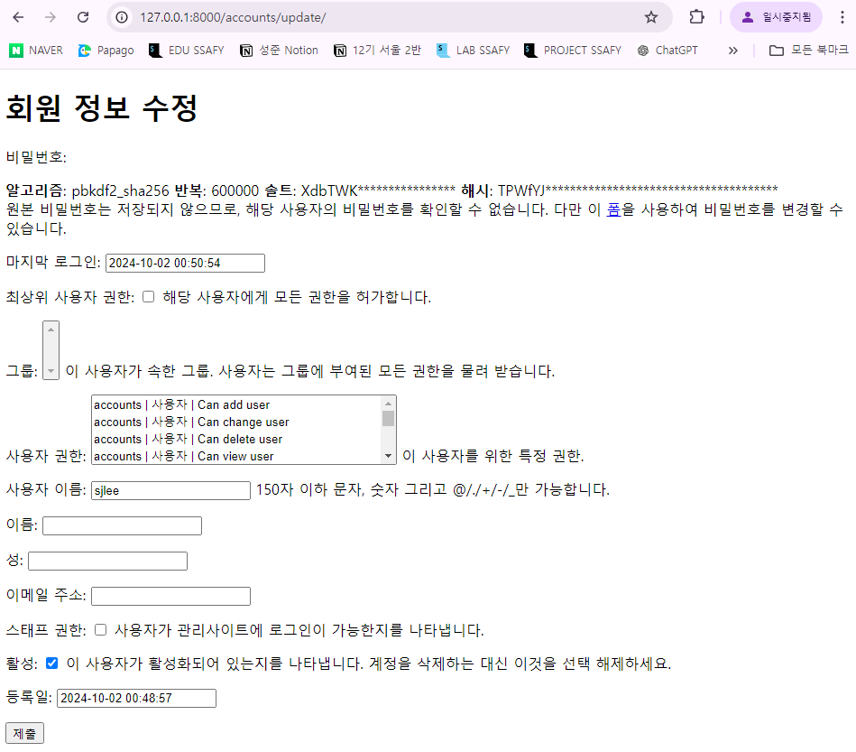
    

**`UserChangeForm` 사용 시 문제점**

- User 모델의 모든 정보들 (fields)까지 모두 출력됨
- 일반 사용자들이 접근해서는 안되는 정보는 출력하지 않도록 해야 함

**→ `CustomUserChangeForm` 에서 출력 필드를 다시 조정하기** 

### `CustomUserChangeForm` 출력 필드 재정의

```python
# accounts/forms.py

**from django.contrib.auth.forms import UserCreationForm
from django.contrib.auth.forms import UserChangeForm

# Django는 User 모델을 직접 참조하는 것을 권장하지 않음
# from .models import User

# Django는 User 모델을 간접적으로 참조할 수 있는 방법을 별도로 제공**
from django.contrib.auth import get_user_model # 현재 활성화된 User 모델을 import

class CustomUserCreationForm(UserCreationForm):
    class Meta(UserCreationForm.Meta): # UserCreationForm의 Meta 클래스 상속
        model = get_user_model()

****class CustomUserChangeForm(UserChangeForm):
    class Meta(UserChangeForm.Meta):
        model = get_user_model()
        **fields = ('first_name', 'last_name', 'email',)**
```

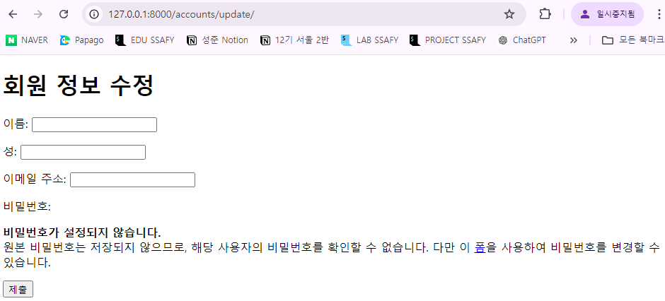

# 비밀번호 변경

인증된 사용자의 Session 데이터를 Update 하는 과정

### `PasswordChangeForm()`

비밀번호 변경 시 사용자 입력 데이터를 받는 `built-in Form`

## 비밀번호 변경 페이지 작성

- Django는 비밀번호 변경 페이지를 회원정보 수정 form 하단에서 별도 주소로 안내
    
    → `/user_pk/password/`
    

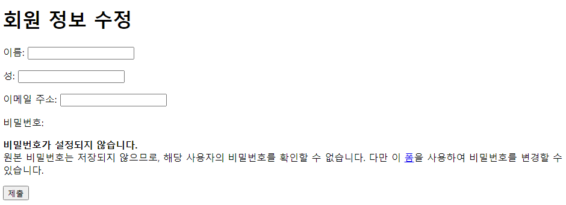

```

```html
<!-- accounts/change_password.html -->

<!DOCTYPE html>
<html lang="en">
<head>
  <meta charset="UTF-8">
  <meta name="viewport" content="width=device-width, initial-scale=1.0">
  <title>Document</title>
</head>
<body>
  <h1>비밀번호 변경</h1>
  <form action="" method="POST">
    
    {{ form.as_p }}
    <input type="submit">
  </form>
</body>
</html>

```

```python
**# crud/urls.py**

from django.contrib import admin
from django.urls import path, include
**from accounts import views**

urlpatterns = [
    path('admin/', admin.site.urls),
    path('articles/', include('articles.urls')),
    path('accounts/', include('accounts.urls')),
    **path('<int:user_pk>/password/', views.change_password, name='change_password'),**
]
```

```python
# accounts/views.py

from django.shortcuts import render, redirect
from django.contrib.auth.forms import AuthenticationForm, PasswordChangeForm

def change_password(request, user_pk):
    if request.method == 'POST':
        form = PasswordChangeForm(request.user, request.POST)
        if form.is_valid():
            form.save()
            return redirect('articles:index')
    else:
        form = PasswordChangeForm(request.user)
    context = {
        'form': form,
    }
    return render(request, 'accounts/change_password.html', context)
```

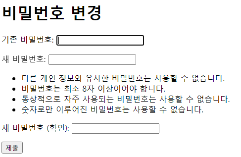

**→ 실행해보면 비밀번호가 바뀌나, 로그아웃이 됨**

## 세션 무효화 방지

### 암호 변경 시 세션 무효화

- 비밀번호가 변경되면 기존 세션과의 회원 인증 정보가 일치하지 않게 되어 버려
로그인 상태가 유지되지 못하고 로그아웃 처리됨
- 비밀번호가 변경되면서 기존 세션과의 회원 인증 정보가 일치하지 않기 때문

### `update_session_auth_hash(request, user)`

**암호 변경 시 세션 무효화를 막아주는 함수**

→ 암호가 변경되면 새로운 password의 Session Data로 기존 Session을 자동으로 갱신

**적용**

```python
# accounts/views.py

from django.shortcuts import render, redirect
from django.contrib.auth.forms import AuthenticationForm, PasswordChangeForm
**from django.contrib.auth import update_session_auth_hash**

def change_password(request, user_pk):
    if request.method == 'POST':
        form = PasswordChangeForm(request.user, request.POST)
        if form.is_valid():
            **updated_user = form.save()
            update_session_auth_hash(request, updated_user)**
            return redirect('articles:index')
    else:
        form = PasswordChangeForm(request.user)
    context = {
        'form': form,
    }
    return render(request, 'accounts/change_password.html', context)
```

- 적용하면 비밀번호를 변경해도 로그인이 유지됨
    
    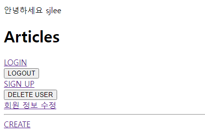
    

# 인증된 사용자에 대한 접근 제한

## `is_authenticated` 속성

**사용자가 인증 되었는지 여부를 알 수 있는 User Model의 속성**

**→ 모든 User 인스턴스에 대해 항상 `True`인 읽기 전용 속성**

**→ 비인증 사용자에 대해서는 항상 `False`**

### 적용하기

- **로그인과 비로그인 상태에서 화면에 출력되는 링크를 다르게 설정하기**
    
    ```html
    <!-- articles/index.html -->
    
    <!DOCTYPE html>
    <html lang="en">
    <head>
      <meta charset="UTF-8">
      <meta name="viewport" content="width=device-width, initial-scale=1.0">
      <title>Document</title>
    </head>
    <body>
      <h1>Articles</h1>
      
        <p>안녕하세요 {{ user.username }}</p>
        <form action="" method="POST">
          
          <input type="submit" value="LOGOUT">
        </form>
        <form action="" method='POST'>
          
          <input type="submit" value='DELETE USER'>
        </form>
        <a href="">회원 정보 수정</a>
        <hr>
        <a href="">CREATE</a>
      
      
        <a href="">LOGIN</a>
        <a href="">SIGN UP</a>
        <hr>
    
      
    
      
        <p>글 번호: {{ article.pk }}</p>
        <a href="">
          <p>글 제목: {{ article.title }}</p>
        </a>
        <p>글 내용: {{ article.content }}</p>
        <hr>
      
    </body>
    </html>
    ```
    

- **인증된 사용자라면 로그인 / 회원가입 로직을 수행할 수 없도록 하기**
    
    ```python
    # accounts/views.py
    
    from django.shortcuts import render, redirect
    from django.contrib.auth.forms import AuthenticationForm, PasswordChangeForm
    from django.contrib.auth import login as auth_login
    from django.contrib.auth import logout as auth_logout
    
    def login(request):
        **if request.user.is_authenticated: # 속성 값이라 호출 필요 X
            return redirect('articles:index')**
        if request.method == 'POST':
            form = AuthenticationForm(request, request.POST)
            if form.is_valid():
                auth_login(request, form.get_user())
                return redirect('articles:index')
        else:
            form = AuthenticationForm()
        context = {
            'form': form,
        }
        return render(request, 'accounts/login.html', context)
    
    def signup(request):
        **if request.user.is_authenticated: # 속성 값이라 호출 필요 X
            return redirect('articles:index')**
        if request.method == "POST":
            form = CustomUserCreationForm(request.POST)
            if form.is_valid():
                form.save()
                return redirect('articles:index')
        else:
            form = CustomUserCreationForm()
        context = {
            'form': form,
        }
        return render(request, 'accounts/signup.html', context)
    ```
    

## `login_required` 데코레이터

**인증된 사용자에 대해서만 view 함수를 실행시키는 데코레이터**

**→ 비인증 사용자의 경우 `/accounts/login/` 주소로 `redirect` 시킴**

### 적용하기

- **인증된 사용자만 게시글을 작성/수정/삭제 할 수 있도록 수정**
    
    ```python
    # articles/views.py
    
    from django.shortcuts import render, redirect
    from .models import Article
    from .forms import ArticleForm
    **from django.contrib.auth.decorators import login_required**
    
    **@ login_required**
    def create(request):
        if request.method == 'POST':
            form = ArticleForm(request.POST)
            if form.is_valid():
                article = form.save()
                return redirect('articles:detail', article.pk)
        else:
            form = ArticleForm()
        context = {
            'form': form,
        }
        return render(request, 'articles/create.html', context)
    
    **@ login_required**
    def update(request, pk):
        article = Article.objects.get(pk=pk)
        if request.method == 'POST':
            form = ArticleForm(request.POST, instance=article)
            if form.is_valid():
                form.save()
                return redirect('articles:detail', article.pk)
        else:
            form = ArticleForm(instance=article)
        context = {
            'article': article,
            'form': form,
        }
        return render(request, 'articles/update.html', context)
    
    **@ login_required**
    def delete(request, pk):
        article = Article.objects.get(pk=pk)
        article.delete()
        return redirect('articles:index')
    
    ```
    

- **인증된 사용자만 로그아웃/탈퇴/수정/비밀번호 변경할 수 있도록 수정**
    
    ```python
    from django.shortcuts import render, redirect
    from django.contrib.auth.forms import AuthenticationForm, PasswordChangeForm
    from .forms import CustomUserCreationForm, CustomUserChangeForm
    from django.contrib.auth import login as auth_login
    from django.contrib.auth import logout as auth_logout
    from django.contrib.auth import update_session_auth_hash
    **from django.contrib.auth.decorators import login_required**
    
    **@ login_required**
    def logout(request):
        auth_logout(request)
        return redirect('articles:index')
    
    **@ login_required**
    def delete(request):
        # 누가 회원 탈퇴를 요청한 건지 User 모델에서 검색할 필요가 없다
        # request 객체에 요청을 보내는 user 정보가 함께 들어있기 때문
        request.user.delete()
        return redirect('articles:index')
    
    **@ login_required**
    def update(request):
        if request.method == "POST":
            form = CustomUserChangeForm(request.POST, instance=request.user)
            if form.is_valid():
                form.save()
                return redirect('articles:index')
        else:
            form = CustomUserChangeForm(instance=request.user)
        context = {
            'form': form,
        }
        return render(request, 'accounts/update.html', context)
    
    **@ login_required**
    def change_password(request, user_pk):
        if request.method == 'POST':
            form = PasswordChangeForm(request.user, request.POST)
            if form.is_valid():
                updated_user = form.save()
                update_session_auth_hash(request, updated_user)
                return redirect('articles:index')
        else:
            form = PasswordChangeForm(request.user)
        context = {
            'form': form,
        }
        return render(request, 'accounts/change_password.html', context)
    ```
    

# 참고

## 쿠키의 수명

### 쿠키 종류별 Lifetime(수명)

1. **Session cookie**
    - 현재 세션(current session)이 종료되면 삭제됨
    - 브라우저 종료와 함께 session이 삭제됨
2. **Persistent cookies**
    - Expires 속성에 지정된 날짜 혹은 Max-Age 속성에 지정된 기간이 지나면 삭제됨

## 쿠키와 보안

### 쿠키의 보안 장치

- **제한된 정보**
    - 쿠키에는 보통 중요하지 않은 정보만 저장 (사용자 ID나 세션 번호 같은 것)
- **암호화**
    - 중요한 정보는 서버에서 암호화해서 쿠키에 저장
- **만료 시간**
    - 만료 시간을 설정 시간이 지나면 자동으로 삭제
- **도메인 제한**
    - 쿠키는 특정 웹사이트에서만 사용할 수 있도록 설정할 수 있음

### 쿠키와 개인정보 보호

- 많은 국가에서 쿠키 사용에 대한 사용자 동의를 요구하는 법규를 시행
- 웹 사이트는 쿠키 정책을 명시하고, 필요한 경우 사용자의 동의를 얻어야 함

## Django에서의 Session 관리

### Session in Django

- Django는 `database-backed sessions` 저장 방식을 기본 값으로 사용
- session 정보는 DB의 django_session 테이블에 저장
- Django는 요청 안에 특정 session id를 포함하는 쿠키를 사용해서
각각의 브라우저와 사이트가 연결된 session 데이터를 알아냄

**→ Django는 우리가 Session 메커니즘(복잡한 동작 원리)의 대부분을 생각하지 않게끔 도와줌**

## `AuthenticationForm` 내부 코드

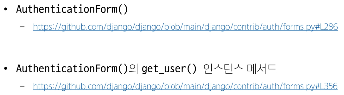

## `AbstractUser`  class

**관리자 권한과 함께 완전한 기능을 가지고 있는 `User model`을 구현하는 ‘추상’ 기본 클래스**

### Abstract base classes (추상 기본 class)

- **몇 가지 공통 정보를 여러 다른 모델에 넣을 때 사용하는 class**
- **데이터베이스 테이블을 만드는 데 사용되지 않으며,
대신 다른 모델의 기본 class로 사용되는 경우 해당 필드가 하위 class의 필드에 추가됨**

### User Model 상속 관계

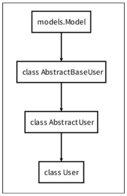

## User 모델 대체하기 Tip

- **User 모델을 대체하는 순서를 숙지하기 어려울 경우
해당 공식 문서를 보며 순서대로 진행하는 것을 권장**

## `is_authenticated`

- **메서드가 아닌 속성 값임을 주의**

## 회원 가입 후 자동 로그인

- 회원 가입 성공한 user 객체를 활용해 Login 진행
    
    ```python
    from django.shortcuts import render, redirect
    from .forms import CustomUserCreationForm, CustomUserChangeForm
    from django.contrib.auth import login as auth_login
    
    def signup(request):
        if request.user.is_authenticated: # 속성 값이라 호출 필요 X
            return redirect('articles:index')
        if request.method == "POST":
            form = CustomUserCreationForm(request.POST)
            if form.is_valid():
                **user = form.save()
                auth_login(request, user)**
                return redirect('articles:index')
        else:
            form = CustomUserCreationForm()
        context = {
            'form': form,
        }
        return render(request, 'accounts/signup.html', context)
    ```
    

## 회원 탈퇴 개선

**현재 탈퇴를 진행 하더라도 Session은 남아있음. (탈퇴는 로그아웃 하는 것이 아니기 때문)**

- 사용자 객체 삭제 이후 로그아웃 함수 호출
- 단 **`탈퇴(1) 후 로그아웃(2)`** 의 순서가 바뀌면 안 됨
    - 먼저 로그아웃이 진행되면 해당 요청 객체 정보가 없어지기 때문에
    탈퇴에 필요한 유저 정보 또한 없어지기 때문

```python
# accounts/views.py

from django.shortcuts import render, redirect
from django.contrib.auth import logout as auth_logout
from django.contrib.auth.decorators import login_required

@ login_required
def delete(request):
    **request.user.delete()
    auth_logout(request)**
    return redirect('articles:index')
```

## `PasswordChangeForm` 인자 순서

- `PaasswordChangeForm` 이 다른 `Form` 과 달리 user 객체를 첫 번째 인자로 받는 이유
- 부모 클래스인 `SetPasswordForm`의 생성자 함수 구성을 따르기 때문
    
    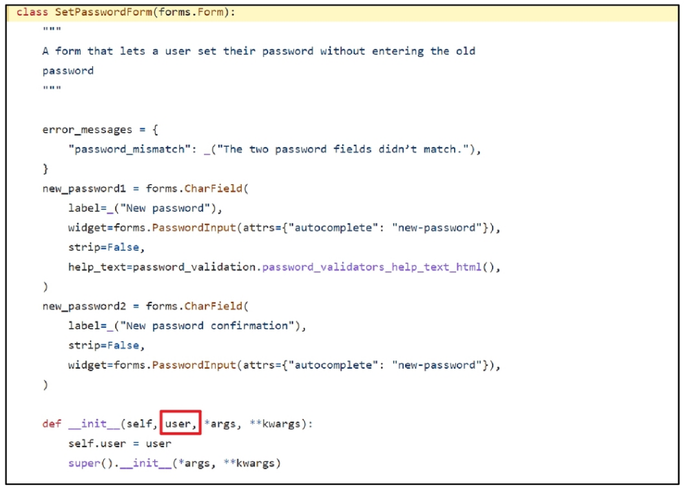
    

## Auth built-in form github 코드

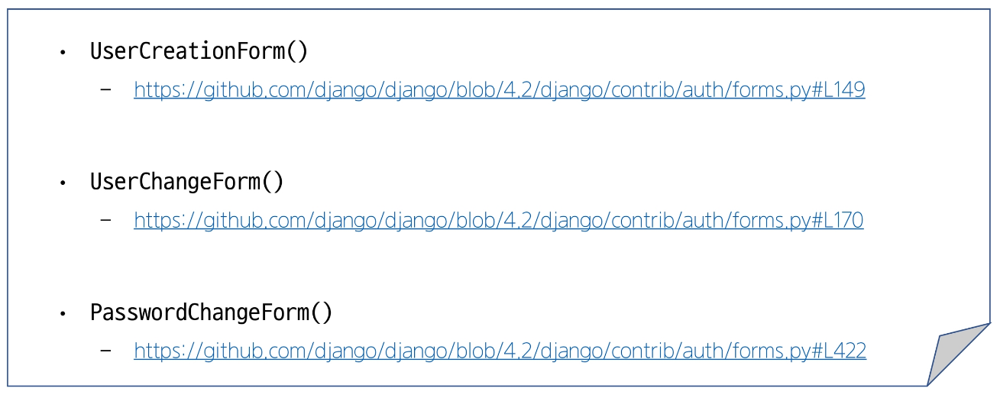