# REST API

## API

**`Application Programming Interface`
두 소프트웨어가 서로 통신할 수 있게 하는 메커니즘**

**→ `클라이언트 - 서버`처럼 서로 다른 프로그램에서 요청과 응답을 받을 수 있도록 만든 체계**

### 예시

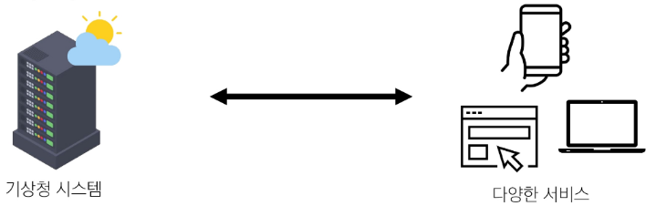

- **기상 데이터가 들어있는 기상청의 시스템**
    - 스마트폰의 날씨 앱, 웹 사이트의 날씨 정보 등 다양한 서비스들이 
    이 기상청 시스템으로부터 데이터를 요청해서 받아감

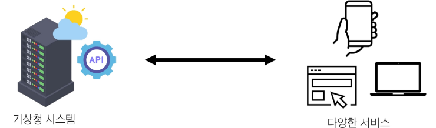

- **날씨 데이터를 얻으려면?**
    - 기상청 시스템에는 정보들을 요청하는 지정된 형식이 있음
    - 지역, 날짜, 조회할 내용들(온도, 바람 등)을 제공하는 매뉴얼
- **`이렇게 요청을 보내면 이렇게 정보를 제공해 줄 것이다` 라는 매뉴얼**
    - 소프트웨어와 소프트웨어 간 지정된 정의(형식)으로 소통하는 수단 : API

**→ 스마트폰의 날씨 앱은 기상청에서 제공하는 API를 통해 기상청 시스템과 대화하여 
    매일 최신 날씨 정보를 표시할 수 있음**

### 역할

- 예를 들어 우리 집 냉장고에 전기를 공급해야 한다고 가정
- 그냥 냉장고의 플러그를 소켓에 꽂으면 제품이 작동함
- 중요한 것은 우리가 가전 제품에 ‘전기를 공급하기 위한 배선 작업을 하지 않는다’는 것
- 이는 매우 위험하면서도 비효율적인 일이기 때문
    
    **→ 복잡한 코드를 추상화하여 대신 사용할 수 있는 몇 가지 더 쉬운 구문을 제공**
    

### Web API

- **웹 서버 또는 웹 브라우저를 위한 API**
- **현대 웹 개발은 하나부터 열까지 직접 개발하기보다 여러 Open API들을 활용하는 추세**
- **대표적인 Thrid Party Open API 서비스 목록**
    - Youtube API
    - Google Map API
    - Naver Papago API
    - Kakao Map API

## REST API

**REST라는 설계 디자인 약속을 지켜 구현한 API**

**REST : `Representational State Transfer`**

**API Server를 개발하기 위한 일종의 소프트웨어 설계 방법론 : 규칙 X**

→ **API Server를 설계하는 구조가 서로 다르니 이렇게 맞춰 설계하자**

### RESTful API

`Representational State Transfer Application Programming Interface`

- **REST 원리를 따르는 시스템을 RESTful 하다고 부름**
- **`자원을 정의`하고 `자원에 대한 주소를 지정`하는 전반적인 방법을 서술**

**→ 각각 API 서버 구조를 작성하는 모습이 너무 다르니, 어느 정도 약속을 만들어서 다 같이 통일하자**

### REST API 실제 활용 예시

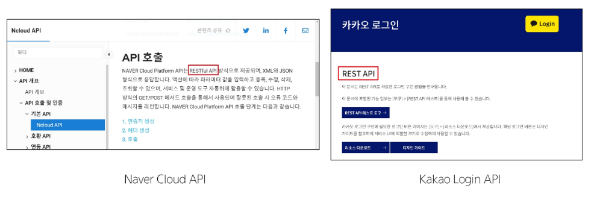

### REST에서 자원을 정의하고 주소를 지정하는 방법

1. **자원의 ‘식별’**
    - URI
2. **자원의 ‘행위’**
    - HTTP Methods
3. **자원의 ‘표현’**
    - JSON 데이터 (궁극적으로 표현되는 데이터 결과물)

## 자원의 식별

### URI

**인터넷에서 리소스(자원)을 식별하는 문자열**

**`Uniform Resource Identifier` : 통합 자원 식별자**

**→ 가장 일반적인 URI는 웹 주소로 알려진 URL**

### URL

**웹에서 주어진 리소스의 주소**

**`Uniform Resource Locator` : 통합 자원 위치**

**→ 네트워크 상에 리소스가 어디 있는지를 알려주기 위한 약속**

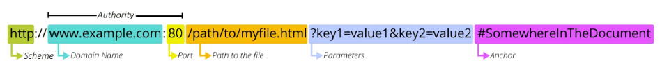

### Schema(or Protocol)

- **브라우저가 리소스를 요청하는데 사용해야 하는 규약**
- **URL의 첫 부분은 브라우저가 어떤 규약을 사용하는 지를 나타냄**
- **기본적으로 웹은 `http(s)` 를 요구**
    - 메일을 열기 위한 `mailto:`
    - 파일을 전송하기 위한 `ftp:` 등 다른 프로토콜도 존재

### Domain Name

- **요청 중인 웹 서버를 나타냄**
- **어떤 웹 서버가 요구되는 지를 가리키며 직접 IP 주소를 사용하는 것도 가능하지만,
사람이 외우기 어렵기 때문에 주로 Domain Name으로 사용**
    
    ex) 도메인 [`google.com`](http://google.com) 의 IP 주소는 `142.251.42.142`
    

### Port

- **웹 서버의 리소스에 접근하는데 사용되는 기술적인 문(Gate)**
- **HTTP 프로토콜의 표준 포트**
    - `HTTP` - 80
    - `HTTPS` - 443
- **표준 포트만 작성 시 생략 가능**

### Path

- **웹 서버의 리소스 경로**
- **초기에는 실제 파일이 위치한 물리적 위치를 나타냈지만,
오늘 날에는 실제 위치가 아닌 추상화된 형태의 구조를 표현**
    
    ex) `/articles/create/` 주소가 실제 `articles` 폴더 안의 `create` 폴더 안을 나타내는 것은 X
    

### Parameters

- **웹 서버에 제공하는 추가적인 데이터**
- **`&` 기호로 구분되는 `key - value` 쌍 목록**
- **서버는 리소스를 응답하기 전에 이러한 파라미터를 사용하여 추가 작업을 수행할 수 있음**

### Anchor

- **일종의 ‘북마크’를 나타내며 브라우저에 해당 지점에 있는 콘텐츠를 표시**
- **부분 식별자 `#` 이후 부분은 서버에 전송되지 않음**
    - `#` : fragment identifier, 부분 식별자
- https://docs.djangoproject.com/en/4.2/intro/install/#quick-install-guide 요청에서
`#quick-install-guide` 서버에 전달되지 않고 브라우저에게 해당 지점으로 이동할 수 있도록 함

## 자원의 행위

### HTTP Request Methods

**리소스에 대한 행위(수행하고자 하는 동작)를 정의**

→ **`HTTP verbs` 라고도 함**

**대표 HTTP Request Methods**

1. **`GET`**
    - 서버에 리소스의 표현을 요청
    - `GET` 을 사용하는 요청은 데이터만 검색해야 함
2. **`POST`**
    - 데이터를 지정된 리소스에 제출
    - 서버의 상태를 변경
3. **`PUT`**
    - 요청한 주소의 리소스를 수정
4. **`DELETE`**
    - 지정된 리소스를 삭제

### HTTP response status codes

**특정 HTTP 요청이 성공적으로 완료 되었는지 여부를 나타냄**

**분류**

1. **Informational responses (100~199)**
2. **Successful responses (200~299)**
3. **Redirection messages (300~399)**
4. **Client error responses (400~499)**
5. **Server error responses (500~599)**

## 자원의 표현

**그동안 서버가 응답(자원을 표현)했던 것**

- **지금까지 Django 서버는 사용자에게 `페이지(html)`만 응답하고 있었음**
- **하지만 서버가 응답할 수 있는 것은 페이지 뿐만 아니라 다양한 데이터 타입을 응답할 수 있음**
- **REST API는 이 중에서도 `JSON` 타입으로 응답하는 것을 권장**

### 응답 데이터 타입의 변화

1. 페이지(html) 만을 응답하는 서버

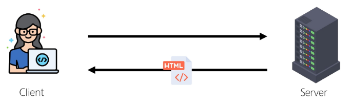

1. 이제는 `JSON` 데이터를 응답하는 REST API 서버로의 변환

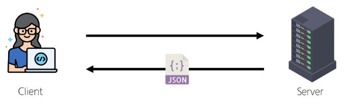

1. **Django는 더 이상 Template 부분에 대한 역할을 담당하지 않게 되며,
Front-end와 Back-end가 분리되어 구성됨**

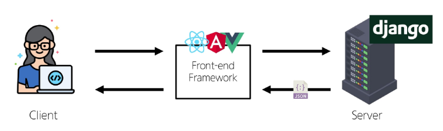

1. 이제부터 Django를 사용해 RESTful API 서버를 구축할 것

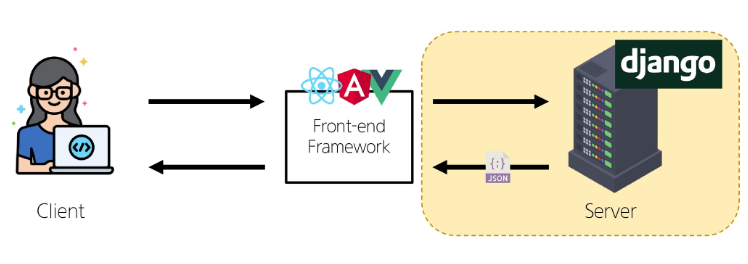

## json 데이터 응답

### 사전 준비

- 가상 환경 생성, 활성화 및 패키지 설치
- migrate 진행
- 준비된 fixtures 파일을 load하여 실습용 초기 데이터 입력
`$ python [manage.py](http://manage.py) loaddata articles.json`
- http://127.0.0.1:8000/api/v1/articles/ 요청 후 응답 확인
    
    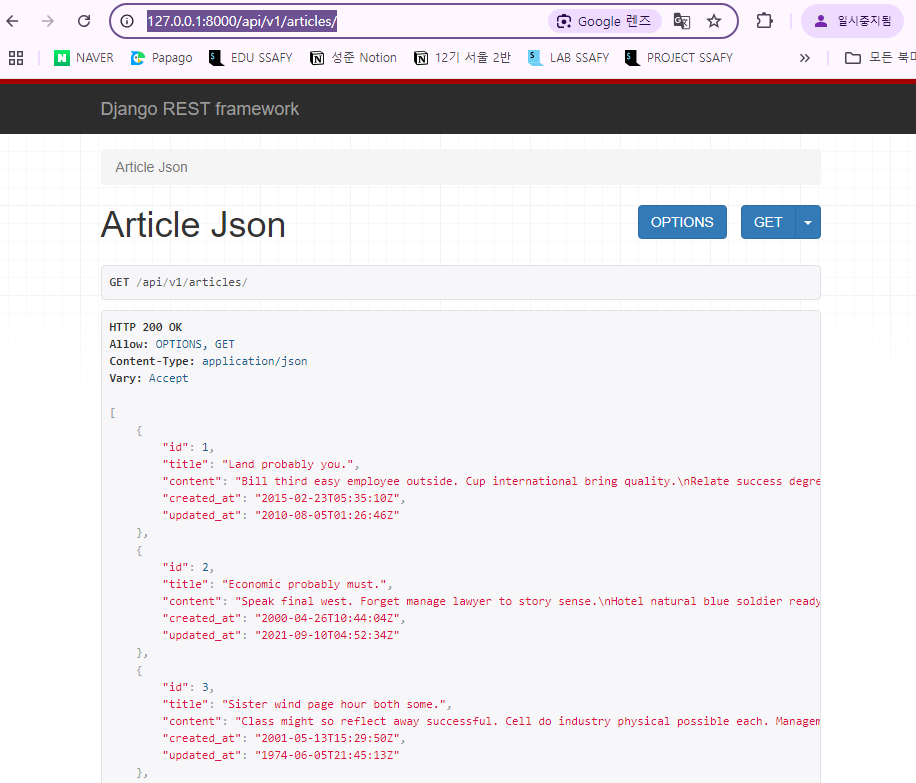
    

### Python으로 json 데이터 처리하기

- 준비된 `python-request-sample.py` 확인

```python
# python-request-sample.py

import requests
from pprint import pprint

response = requests.get('http://127.0.0.1:8000/api/v1/articles/')

# json을 python 타입으로 변환
result = response.json()

print(type(result))
# pprint(result)
# pprint(result[0])
# pprint(result[0].get('title'))
```

```bash
$ python python-request-sample.py 
<class 'list'>
# 응답을 list 타입으로 변환(쓸 수 있게끔)
```

# DRF with Single Model

## DRF

**`Django REST framework` : 
Django에서 RESTful API 서버를 쉽게 구축할 수 있도록 도와주는 오픈소스 라이브러리**

### 프로젝트 준비

- 사전 준비된 drf 프로젝트 기반 시작
1. 가상 환경 생성, 활성화 및 패키지 설치
2. https://www.django-rest-framework.org/

```python
$ pip install djangorestframework markdown django-filter
```

```python
# drf/settings.py

INSTALLED_APPS = [
    'articles',
    **'rest_framework',**
    "django.contrib.admin",
    "django.contrib.auth",
    "django.contrib.contenttypes",
    "django.contrib.sessions",
    "django.contrib.messages",
    "django.contrib.staticfiles",
]
```

1. migrate 진행
2. 준비된 fixtures 파일을 load하여 실습용 초기 데이터 입력
`$ python [manage.py](http://manage.py) loaddata articles.json`

### Postman 설치 및 안내

**Postman**

- **API 개발 및 테스트를 위한 서비스**
- **요청 데이터 구성, 응답 확인, 환경 설정, 자동화 테스트 등 다양한 기능을 제공**

**Postman 설치:**

- https://www.postman.com/downloads/

1. Workspaces → My workspace

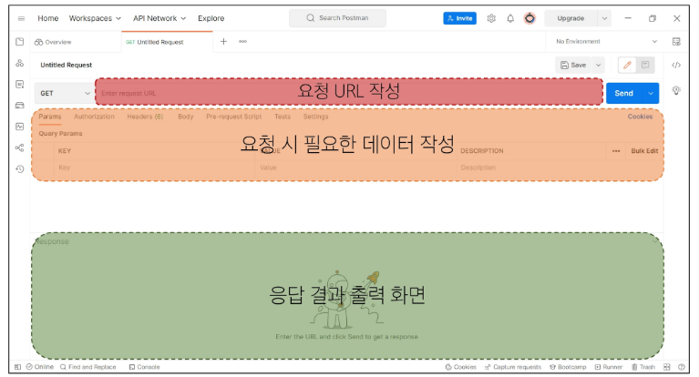

## Serialization

**직렬화:** 
**여러 시스템에서 활용하기 위해, 
데이터 구조나 객체 상태를 나중에 재구성할 수 있는 포맷으로 변환하는 과정**

**→ 어떠한 언어나 환경에서도 나중에 다시 쉽게 사용할 수 있는 포맷으로 변환하는 과정**

### Serialization 예시

데이터 구조나 객체 상태를 나중에 재구성할 수 있는 포맷으로 변환하는 과정

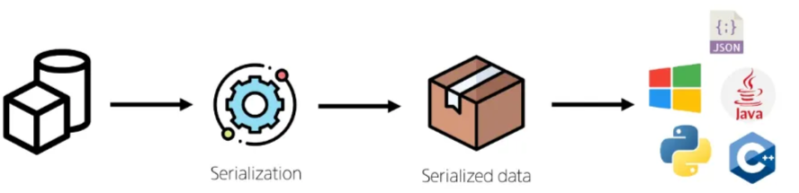

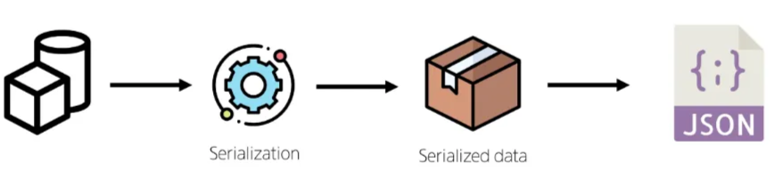

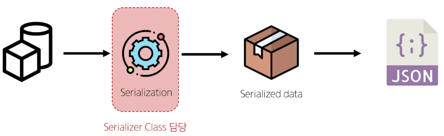

### **`Serializer`**

**Serialization을 진행하여 Serialized data를 반환해주는 클래스**

### **`ModelSerializer`**

**Django 모델과 연결된 Serializer 클래스**

**→ Serializer와 달리 사용자 입력 데이터를 받아 자동으로 모델 필드에 맞추어 Serializaion을 진행**

**`ModelSerializer class` 사용 예시**

- Article 모델을 토대로 직렬화를 수행하는 ArticleSerializer 정의

→ 게시글 데이터 목록 제공

```python
# articles/serializers.py
# serializers.py의 위치나 파일명은 자유롭게 작성 가능

from rest_framework import serializers
from .models import Article

class ArticleListSerializer(serializers.ModelSerializer):
    class Meta:
        model = Article
        fields = '__all__'
```

# CRUD with ModelSerializer

### URL과 HTTP requests methods 설계

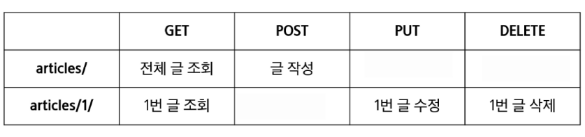

## 전체 코드

```python
# articles/serializers.py

from rest_framework import serializers
from .models import Article

class ArticleListSerializer(serializers.ModelSerializer):
    class Meta:
        model = Article
        fields = ('id', 'title', 'content',)

class ArticleSerializer(serializers.ModelSerializer):
    class Meta:
        model = Article
        fields = '__all__'
```

```python
# articles/urls.py

from django.urls import path
from articles import views

urlpatterns = [
    path('articles/', views.article_list),
    path('articles/<int:article_pk>/', views.article_detail),
]
```

```python
# articles/views.py

from rest_framework import status
from rest_framework.response import Response
from rest_framework.decorators import api_view

from .models import Article
from .serializers import ArticleListSerializer, ArticleSerializer

@api_view(['GET', 'POST'])
def article_list(request):
    if request.method == 'GET':
        articles = Article.objects.all() # 전체 게시글 조회 (타입: 쿼리셋)
        # 변환하기 쉬운 포맷을 전환(직렬화)
        serializer = ArticleListSerializer(articles, many=True)
        return Response(serializer.data)
    
    elif request.method == 'POST':
        # 모델 시리얼라이저를 사용해서 사용자 입력 데이터를 받아 직렬화를 진행
        serializer = ArticleSerializer(data=request.data)
        if serializer.is_valid(): # 유효성 검사
            serializer.save()
            # 저장 성공 후 201 응답 상태 코드를 반환
            return Response(serializer.data, status=status.HTTP_201_CREATED)
        # 유효성 검사 실패 후 400 응답 상태 코드를 반환
        return Response(serializer.errors, status=status.HTTP_400_BAD_REQUEST)

@api_view(['GET', 'DELETE', 'PUT'])
def article_detail(request, article_pk):
    # 단일 게시글 조회
    article = Article.objects.get(pk= article_pk)
    if request.method == 'GET':
        # 직렬화 진행
        serializer = ArticleSerializer(article)
        return Response(serializer.data)

    elif request.method == 'DELETE':
        article.delete()
        return Response(status=status.HTTP_204_NO_CONTENT)
    
    elif request.method == 'PUT':
        serializer = ArticleSerializer(article, data=request.data, partial=True)
        # serializer = ArticleSerializer(instance=article, data=request.data, partial=True)

        if serializer.is_valid():
            serializer.save()
            # 저장 성공후 200 응답 상태 코드를 반환(기본 값)
            return Response(serializer.data)
        # 유효성 검사 실패 후 400 응답 상태 코드를 반환
        return Response(serializer.errors, status=status.HTTP_400_BAD_REQUEST)

```

## `GET` method - 조회

### GET - LIST

- 게시글 데이터 목록 조회하기
- 게시글 데이터 목록을 제공하는 `ArticleListSerializer` 정의

```python
# articles/serializers.py

from rest_framework import serializers
from .models import Article

class ArticleListSerializer(serializers.ModelSerializer):
    class Meta:
        model = Article
        fields = ('id', 'title', 'content',)
```

```python
# articles/urls.py

from django.urls import path
from articles import views

urlpatterns = [
    **path('articles/', views.article_list),**
]
```

```python
# articles/views.py

from rest_framework.response import Response
from rest_framework.decorators import api_view

from .models import Article
from .serializers import ArticleListSerializer

@api_view(['GET'])
def article_list(request):
    # 전체 게시글 조회 (타입: 쿼리셋)
    articles = Article.objects.all()
    # 변환하기 쉬운 포맷을 전환(직렬화)
    serializer = ArticleListSerializer(articles, many=True)
    return Response(serializer.data)
```

- **`many` 옵션**
    - Serialize 대상이 QuerySet인 경우 입력
- **`data` 속성**
    - Serialized data 객체에서 실제 데이터를 추출
- **`api_view` decorator**
    - DRF view 함수에서는 필수로 작성되며, view 함수를 실행하기 전 HTTP 메서드를 확인
    - 기본적으로 GET 메서드만 허용되며, 
    다른 메서드 요청에 대해서는 `405 Method Not Allowed` 로 응답
    - DRF view 함수가 응답해야 하는 HTTP 메서드 목록을 작성

- http://127.0.0.1:8000/api/v1/articles/ 요청 후 응답 확인
    
    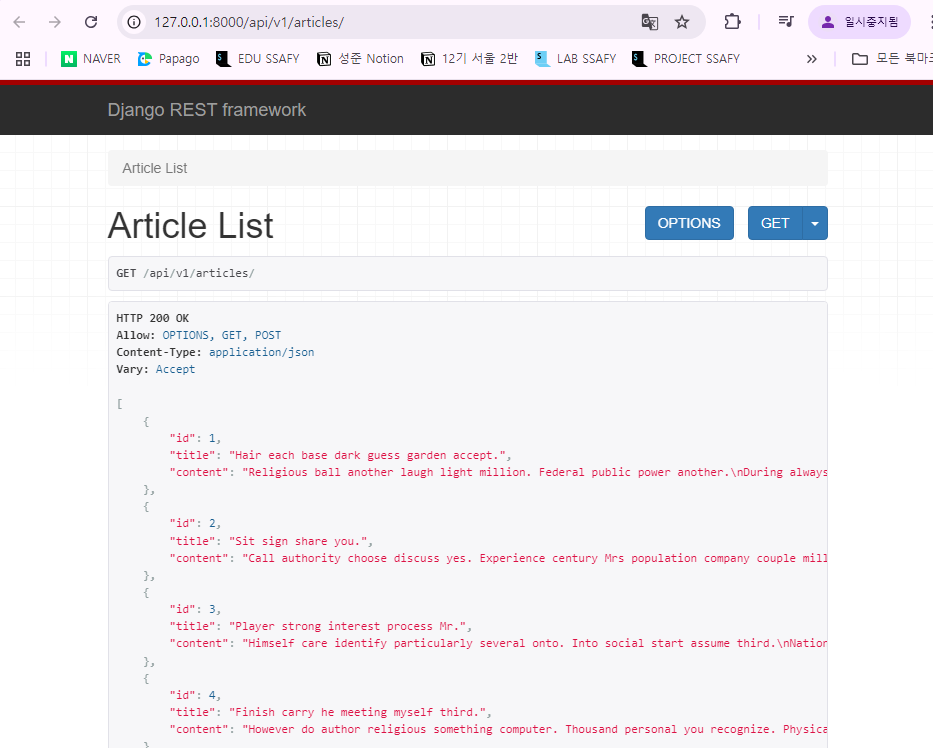
    
    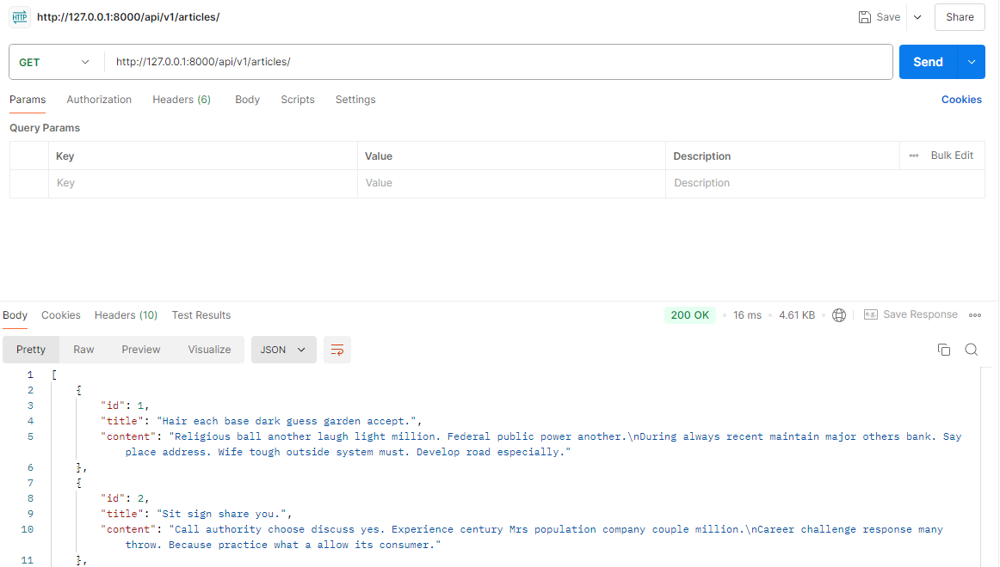
    

### GET - Detail

- 단일 게시글 데이터 조회하기
- 각 게시글의 상세 정보를 제공하는 ArticleSerializer 정의

```python
# articles/serializers.py

from rest_framework import serializers
from .models import Article

class ArticleSerializer(serializers.ModelSerializer):
    class Meta:
        model = Article
        fields = '__all__'
```

```python
# articles/urls.py

from django.urls import path
from articles import views

urlpatterns = [
    path('articles/', views.article_list),
    **path('articles/<int:article_pk>/', views.article_detail),**
]
```

```python
# articles/views.py

from rest_framework.response import Response
from rest_framework.decorators import api_view

from .models import Article
from .serializers import ArticleListSerializer, ArticleSerializer

@api_view(['GET'])
def article_list(request):
    # 전체 게시글 조회 (타입: 쿼리셋)
    articles = Article.objects.all()
    # 변환하기 쉬운 포맷을 전환(직렬화)
    serializer = ArticleListSerializer(articles, many=True)
    return Response(serializer.data)

**@api_view(['GET'])
def article_detail(request, article_pk):**
    # 단일 게시글 조회
    **article = Article.objects.get(pk= article_pk)**
    # 직렬화 진행
    **serializer = ArticleSerializer(article)
    return Response(serializer.data)**
```

- http://127.0.0.1:8000/api/v1/articles/1/ 요청 후 응답 확인
    
    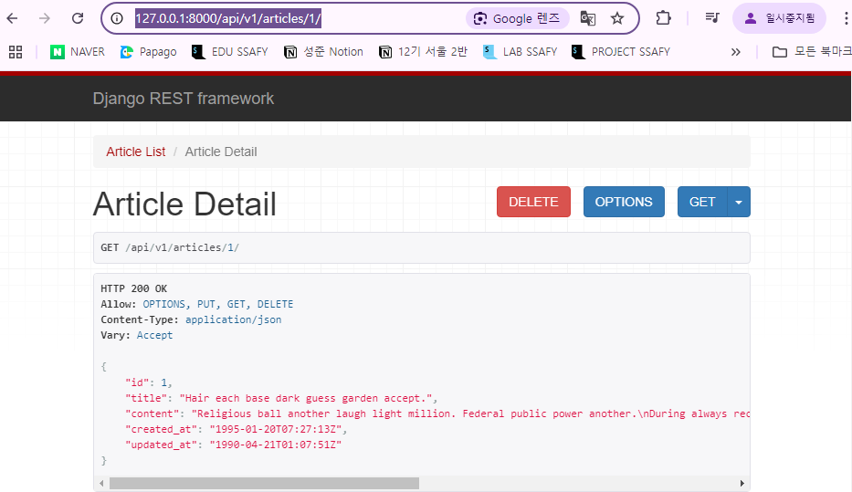
    
    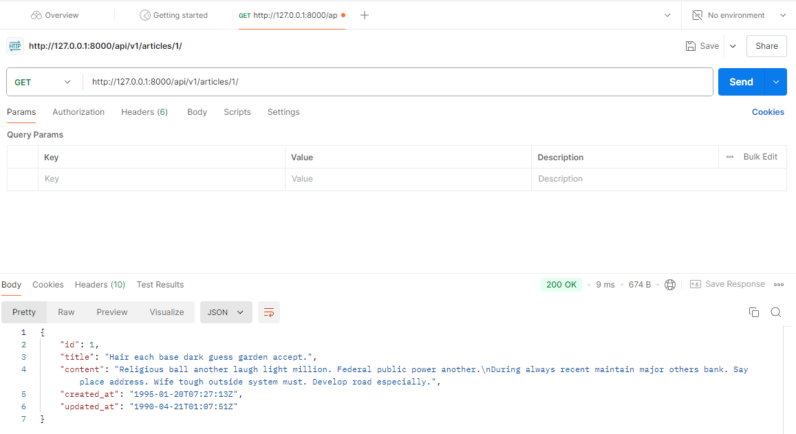
    

### 과거 view 함수와의 응답 데이터 비교

**과거) HTML에 출력되도록 페이지와 함께 응답했던 view 함수**

```python
def index(request):
		articles = Article.objects.all()
		context = {
				'articles': articles,
		}
		return render(request, 'articles/index.html', context)
```

**현재) JSON 데이터로 serialization 하여 페이지 없이 응답하는 view 함수**

```python
@api_view(['GET'])
def article_list(request):
		articles = Article.objects.all()
		serializer = ArticleListSerializer(articles, many=True)
		return Response(serializer.data)
```

## POST method - 생성

### POST

- 게시글 데이터 생성하기
    - `201 created` : 데이터 생성에 성공했을 경우
    - `400 Bad request` : 데이터 생성에 실패했을 경우

- article_list view 함수 구조 변경 (method에 따른 분기 처리)

```python
from rest_framework import status
from rest_framework.response import Response
from rest_framework.decorators import api_view

from .models import Article
from .serializers import ArticleListSerializer, ArticleSerializer

**@api_view(['GET', 'POST'])**
def article_list(request):
    **if request.method == 'GET':**
        articles = Article.objects.all() # 전체 게시글 조회 (타입: 쿼리셋)
        # 변환하기 쉬운 포맷을 전환(직렬화)
        serializer = ArticleListSerializer(articles, many=True)
        return Response(serializer.data)
    
    **elif request.method == 'POST':**
        # 모델 시리얼라이저를 사용해서 사용자 입력 데이터를 받아 직렬화를 진행
        **serializer = ArticleSerializer(data=request.data)
        if serializer.is_valid():** # 유효성 검사
            **serializer.save()**
            # 저장 성공 후 201 응답 상태 코드를 반환
            **return Response(serializer.data, status=status.HTTP_201_CREATED)**
        # 유효성 검사 실패 후 400 응답 상태 코드를 반환
        **return Response(serializer.errors, status=status.HTTP_400_BAD_REQUEST)**
```

- http://127.0.0.1:8000/api/v1/articles/ (POST) 응답 확인
    
    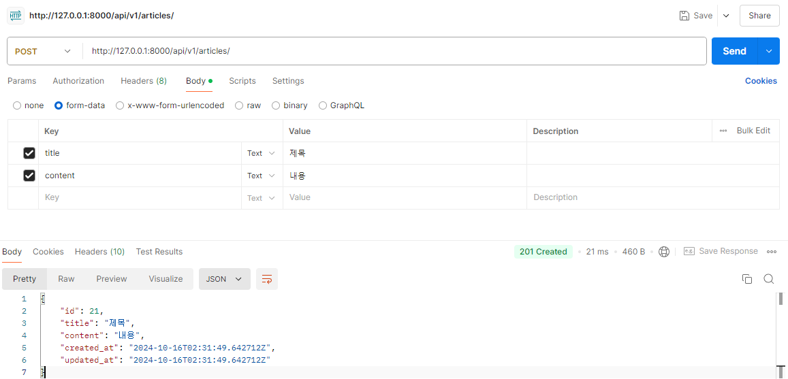
    

- http://127.0.0.1:8000/api/v1/articles/21/  요청 후 새로 생성된 게시글 데이터 확인
    
    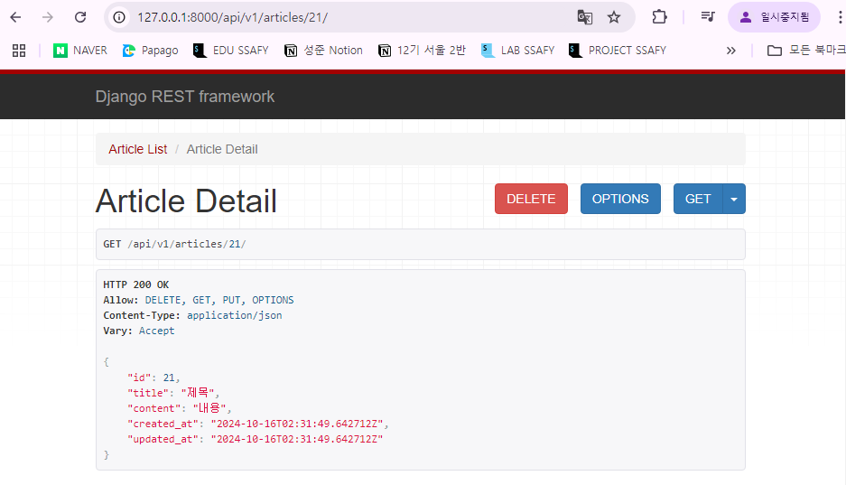
    

## DELETE method - 삭제

### DELETE

- 게시글 데이터 삭제하기
- `204 No Content` : 요청에 대한 데이터 삭제가 성공했을 경우

```python
# articles/views.py

from rest_framework import status
from rest_framework.response import Response
from rest_framework.decorators import api_view

from .models import Article
from .serializers import ArticleListSerializer, ArticleSerializer

**@api_view(['GET', 'DELETE'])**
def article_detail(request, article_pk):
    # 단일 게시글 조회
    article = Article.objects.get(pk= article_pk)
    **if request.method == 'GET':**
        # 직렬화 진행
        serializer = ArticleSerializer(article)
        return Response(serializer.data)

    **elif request.method == 'DELETE':
        article.delete()
        return Response(status=status.HTTP_204_NO_CONTENT)**
```

- http://127.0.0.1:8000/api/v1/articles/21/ (DELETE) 요청 후 응답 확인
    
    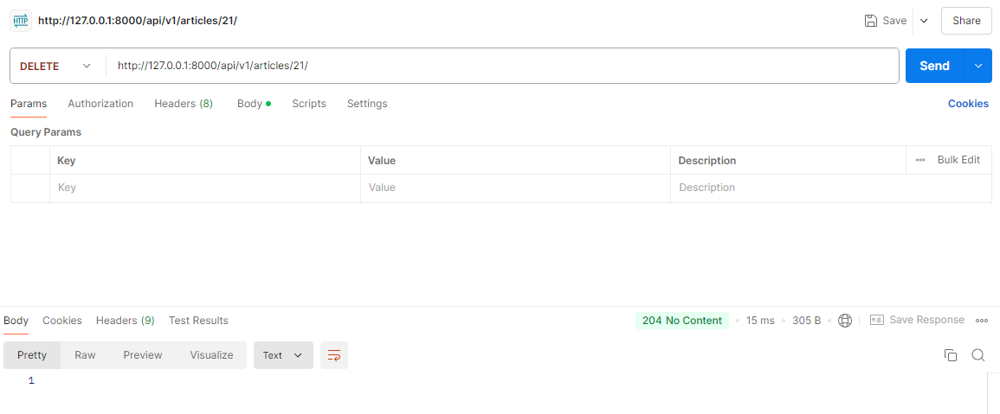
    

- http://127.0.0.1:8000/api/v1/articles/21/  응답 확인
    
    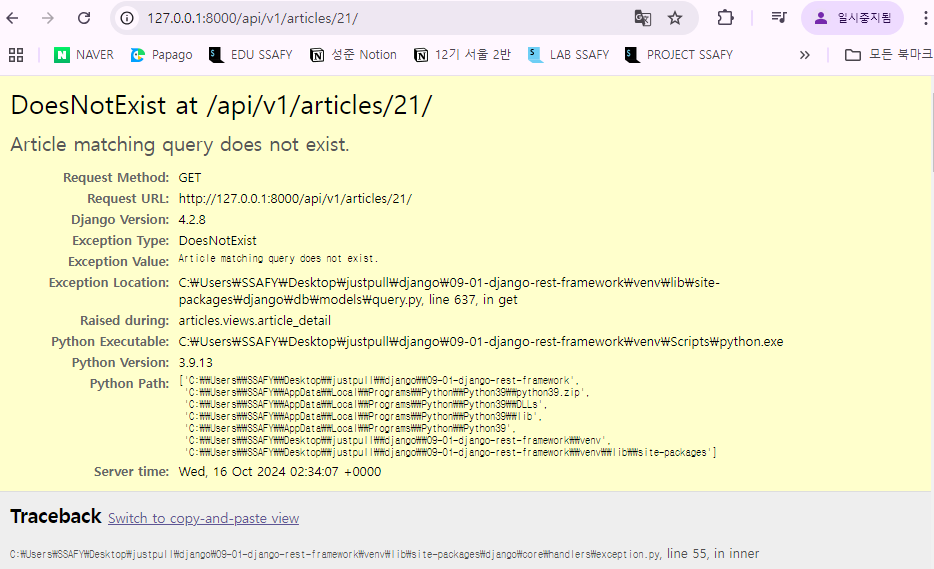
    

## PUT method - 수정

- 게시글 데이터 수정하기
- `200 OK` : 요청에 대한 데이터 수정이 성공했을 경우

```python
# articles/views.py

from rest_framework import status
from rest_framework.response import Response
from rest_framework.decorators import api_view

from .models import Article
from .serializers import ArticleListSerializer, ArticleSerializer

@api_view(['GET', 'POST'])
def article_list(request):
    if request.method == 'GET':
        articles = Article.objects.all() # 전체 게시글 조회 (타입: 쿼리셋)
        # 변환하기 쉬운 포맷을 전환(직렬화)
        serializer = ArticleListSerializer(articles, many=True)
        return Response(serializer.data)
    
    elif request.method == 'POST':
        # 모델 시리얼라이저를 사용해서 사용자 입력 데이터를 받아 직렬화를 진행
        serializer = ArticleSerializer(data=request.data)
        if serializer.is_valid(): # 유효성 검사
            serializer.save()
            # 저장 성공 후 201 응답 상태 코드를 반환
            return Response(serializer.data, status=status.HTTP_201_CREATED)
        # 유효성 검사 실패 후 400 응답 상태 코드를 반환
        return Response(serializer.errors, status=status.HTTP_400_BAD_REQUEST)

**@api_view(['GET', 'DELETE', 'PUT'])**
def article_detail(request, article_pk):
    # 단일 게시글 조회
    article = Article.objects.get(pk= article_pk)
    **if request.method == 'GET':**
        # 직렬화 진행
        serializer = ArticleSerializer(article)
        return Response(serializer.data)

    **elif request.method == 'DELETE':**
        article.delete()
        return Response(status=status.HTTP_204_NO_CONTENT)
    
    **elif request.method == 'PUT':
        serializer = ArticleSerializer(article, data=request.data, partial=True)**
        # serializer = ArticleSerializer(instance=article, data=request.data, partial=True)

        **if serializer.is_valid():
            serializer.save()**
            # 저장 성공후 200 응답 상태 코드를 반환(기본 값)
            **return Response(serializer.data)**
        # 유효성 검사 실패 후 400 응답 상태 코드를 반환
        **return Response(serializer.errors, status=status.HTTP_400_BAD_REQUEST)**

```

- `partial` argument
    - 부분 업데이트를 허용하기 위한 인자
    - 예를 들어 `partial` 인자 값이 False일 경우, 
    게시글 title만을 수정하려고 해도 반드시 content 값도 요청 시 함께 전송해야 함
    - 기본적으로 serializer는 모든 필수 필드에 대한 값을 전달 받기 때문
        - 즉, 수정하지 않는 다른 필드 데이터도 모두 전송해야 하며, 
        그렇지 않으면 유효성 검사에서 오류가 발생

- http://127.0.0.1:8000/api/v1/articles/1/  (PUT) 응답 확인
    
    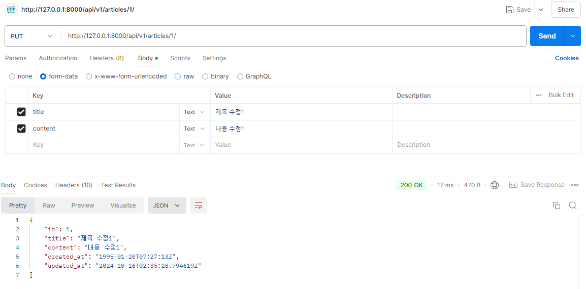
    

- http://127.0.0.1:8000/api/v1/articles/1/  (GET) 수정된 데이터 확인
    
    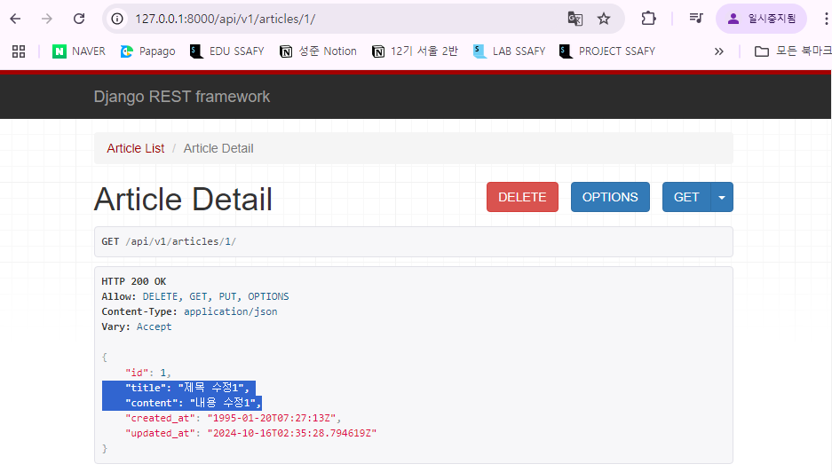
    

# 참고

## `raise_exception`

- `is_valid()` 의 선택 인자
- 유효성 검사를 통과하지 못할 경우 `ValidationError` 예외를 발생 시킴
- DRF에서 제공하는 기본 예외 처리기에 의해 자동으로 처리되며, 
기본적으로 `HTTP 400` 응답을 반환

```python
# articles/views.py

from rest_framework import status
from rest_framework.response import Response
from rest_framework.decorators import api_view

from .models import Article
from .serializers import ArticleListSerializer, ArticleSerializer

@api_view(['GET', 'POST'])
def article_list(request):
    if request.method == 'GET':
        articles = Article.objects.all() # 전체 게시글 조회 (타입: 쿼리셋)
        # 변환하기 쉬운 포맷을 전환(직렬화)
        serializer = ArticleListSerializer(articles, many=True)
        return Response(serializer.data)
    
    elif request.method == 'POST':
        # 모델 시리얼라이저를 사용해서 사용자 입력 데이터를 받아 직렬화를 진행
        serializer = ArticleSerializer(data=request.data)
        if serializer.is_valid(**raise_exception=True**): # 유효성 검사
            serializer.save()
            # 저장 성공 후 201 응답 상태 코드를 반환
            return Response(serializer.data, status=status.HTTP_201_CREATED)
            
        **# 아래 생략 가능해짐**
        # 유효성 검사 실패 후 400 응답 상태 코드를 반환
        # return Response(serializer.errors, status=status.HTTP_400_BAD_REQUEST)
```

