# DRF with `N:1` Relation

## 아래 전체 코드

```python
# articles/models.py

from django.db import models

class Article(models.Model):
    title = models.CharField(max_length=10)
    content = models.TextField()
    created_at = models.DateTimeField(auto_now_add=True)
    updated_at = models.DateTimeField(auto_now=True)

class Comment(models.Model):
    article = models.ForeignKey(Article, on_delete=models.CASCADE)
    content = models.TextField()
    created_at = models.DateTimeField(auto_now_add=True)
    updated_at = models.DateTimeField(auto_now=True)
```

```python
# articles/serializers.py

from rest_framework import serializers
from .models import Article, Comment

class ArticleListSerializer(serializers.ModelSerializer):
    class Meta:
        model = Article
        fields = (
            'id',
            'title',
            'content',
        )

class ArticleSerializer(serializers.ModelSerializer):
    class CommentDetailSerializer(serializers.ModelSerializer):
        class Meta:
            model = Comment
            fields = ('id', 'content',)
    
    comment_set = CommentDetailSerializer(many=True, read_only=True)
    number_of_comments = serializers.IntegerField(source='comment_set.count', read_only=True)

    class Meta:
        model = Article
        fields = '__all__'

class CommentSerializer(serializers.ModelSerializer):
    class ArticleTitleSerializer(serializers.ModelSerializer):
        class Meta:
            model = Article
            fields = ('title',)

    article = ArticleTitleSerializer(read_only=True) 

    class Meta:
        model = Comment
        fields = '__all__'
```

```python
# articles/urls.py

from django.urls import path
from articles import views

urlpatterns = [
    path('articles/', views.article_list),
    path('articles/<int:article_pk>/', views.article_detail),
    path('comments/', views.comment_list),
    path('comments/<int:comment_pk>/', views.comment_detail),
    path('articles/<int:article_pk>/comments/', views.comment_create),
]
```

```python
# articles/views.py

from rest_framework.response import Response
from rest_framework.decorators import api_view
from rest_framework import status

from .models import Article, Comment
from .serializers import ArticleListSerializer, ArticleSerializer, CommentSerializer

from django.shortcuts import get_object_or_404, get_list_or_404

@api_view(['GET', 'POST'])
def article_list(request):
    if request.method == 'GET':
        articles = get_list_or_404(Article)
        serializer = ArticleListSerializer(articles, many=True)
        return Response(serializer.data)

    elif request.method == 'POST':
        serializer = ArticleSerializer(data=request.data)
        if serializer.is_valid(raise_exception=True):
            serializer.save()
            return Response(serializer.data, status=status.HTTP_201_CREATED)

@api_view(['GET', 'DELETE', 'PUT'])
def article_detail(request, article_pk):
    article = get_object_or_404(Article, pk=article_pk)

    if request.method == 'GET':
        serializer = ArticleSerializer(article)
        return Response(serializer.data)

    elif request.method == 'DELETE':
        article.delete()
        return Response(status=status.HTTP_204_NO_CONTENT)

    elif request.method == 'PUT':
        serializer = ArticleSerializer(
            article, data=request.data, partial=True
        )
        if serializer.is_valid(raise_exception=True):
            serializer.save()
            return Response(serializer.data)
        

@api_view(['GET'])
def comment_list(request):
    comments = get_list_or_404(Comment)
    serializer = CommentSerializer(comments, many=True)
    return Response(serializer.data)

@api_view(['GET', 'DELETE', 'PUT'])
def comment_detail(request, comment_pk):
    comment = get_object_or_404(Comment, pk=comment_pk)
    if request.method == 'GET':
        serializer = CommentSerializer(comment)
        return Response(serializer.data)
    
    elif request.method == 'DELETE':
        comment.delete()
        return Response(status=status.HTTP_204_NO_CONTENT)

    elif request.method == 'PUT':
        serializer = CommentSerializer(comment, data=request.data)
        if serializer.is_valid(raise_exception=True):
            serializer.save()
            return Response(serializer.data) # 기본값: 200

@api_view(['POST'])
def comment_create(request, article_pk):
    article = get_object_or_404(Article, pk=article_pk)
    serializer = CommentSerializer(data=request.data)
    if serializer.is_valid(raise_exception=True):
        serializer.save(article=article)
        return Response(serializer.data, status=status.HTTP_201_CREATED)
```

## 사전 준비

- Comment 클래스 정의 및 데이터 베이스 초기화
    
    ```python
    # articles/models.py
    
    from django.db import models
    
    class Article(models.Model):
        title = models.CharField(max_length=10)
        content = models.TextField()
        created_at = models.DateTimeField(auto_now_add=True)
        updated_at = models.DateTimeField(auto_now=True)
    
    **class Comment(models.Model):
        article = models.ForeignKey(Article, on_delete=models.CASCADE)
        content = models.TextField()
        created_at = models.DateTimeField(auto_now_add=True)
        updated_at = models.DateTimeField(auto_now=True)**
    ```
    

### URL 및 HTTP request method 구성

| URL | GET | POST | PUT | DELETE |
| --- | --- | --- | --- | --- |
| `comments/` | 댓글 목록 조회 |  |  |  |
| `comments/1/` | 단일 댓글 조회 |  | 단일 댓글 수정 | 단일 댓글 삭제 |
| `articles/1/comments/` |  | 댓글 생성 |  |  |

## `GET` method

### GET - List

**댓글 목록 조회를 위한 CommentSerializer 정의**

```python
# articles/serializers.py

from rest_framework import serializers
from .models import Article, Comment

class ArticleListSerializer(serializers.ModelSerializer):
    class Meta:
        model = Article
        fields = (
            'id',
            'title',
            'content',
        )

class ArticleSerializer(serializers.ModelSerializer):
    class Meta:
        model = Article
        fields = '__all__'

**class CommentSerializer(serializers.ModelSerializer):
    class Meta:
        model = Comment
        fields = '__all__'**
```

```python
# articles/urls.py

from django.urls import path
from articles import views

urlpatterns = [
    path('articles/', views.article_list),
    path('articles/<int:article_pk>/', views.article_detail),
    **path('comments/', views.comment_list),**
]
```

```python
# articles/views.py

from rest_framework.response import Response
from rest_framework.decorators import api_view
from rest_framework import status

from .models import Article, Comment
from .serializers import ArticleListSerializer, ArticleSerializer, CommentSerializer

**@api_view(['GET'])
def comment_list(request):
    comments = Comment.objects.all()
    serializer = CommentSerializer(comments, many=True)
    return Response(serializer.data)**
```

- http://127.0.0.1:8000/api/v1/comments/ `GET`  응답 확인
    
    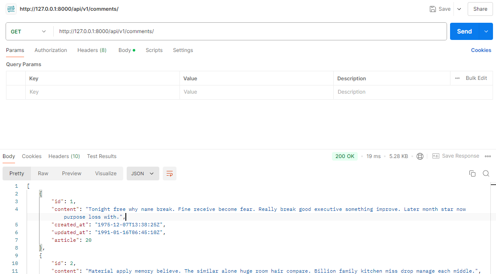
    
    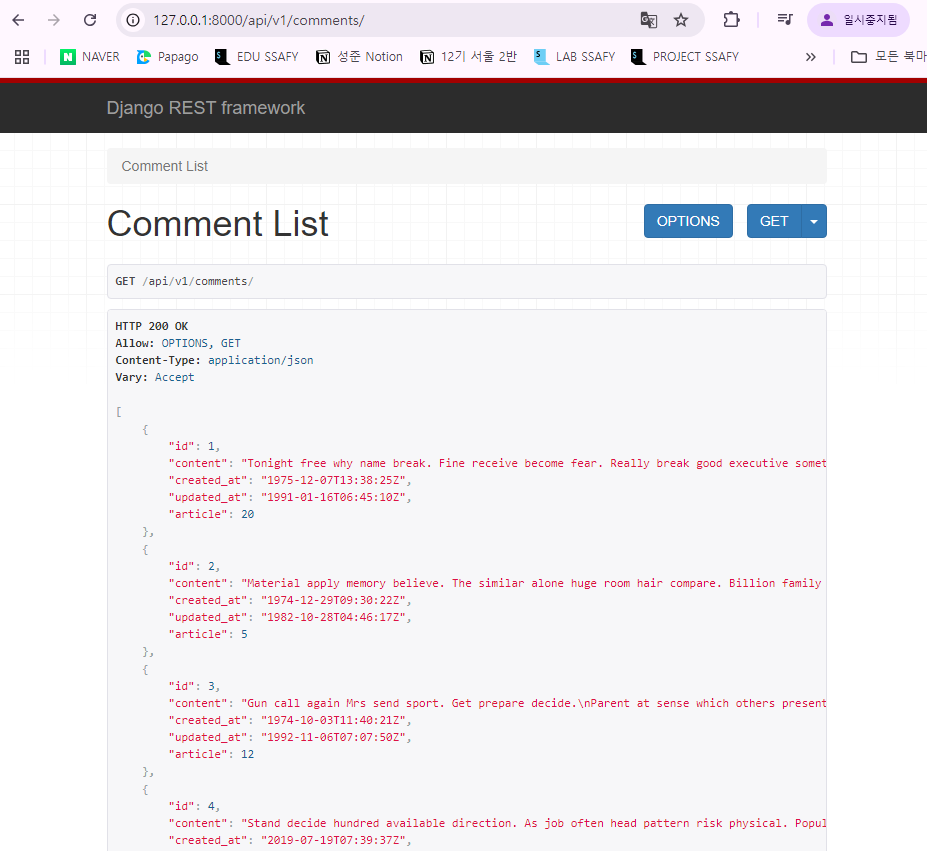
    

### GET - Detail

**단일 댓글 조회를 위한 url 및 view 함수 작성**

```python
# articles/urls.py

from django.urls import path
from articles import views

urlpatterns = [
    path('articles/', views.article_list),
    path('articles/<int:article_pk>/', views.article_detail),
    path('comments/', views.comment_list),
    **path('comments/<int:comment_pk>/', views.comment_detail),**
]
```

```python
# articles/views.py

from rest_framework.response import Response
from rest_framework.decorators import api_view
from rest_framework import status

from .models import Article, Comment
from .serializers import ArticleListSerializer, ArticleSerializer, CommentSerializer

**@api_view(['GET'])
def comment_detail(request, comment_pk):
    comment = Comment.objects.get(pk=comment_pk)
    serializer = CommentSerializer(comment)
    return Response(serializer.data)**
```

- http://127.0.0.1:8000/api/v1/comments/1/ `GET` 응답 확인
    
    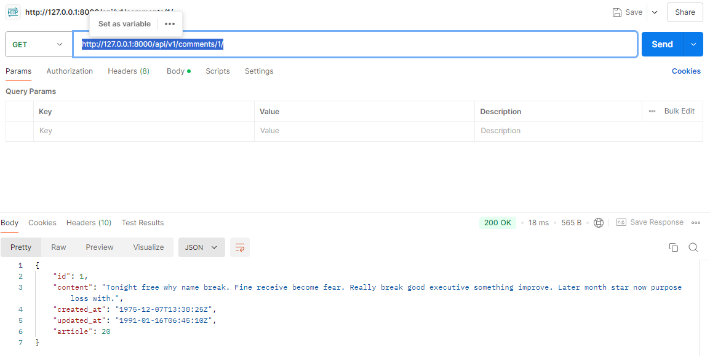
    
    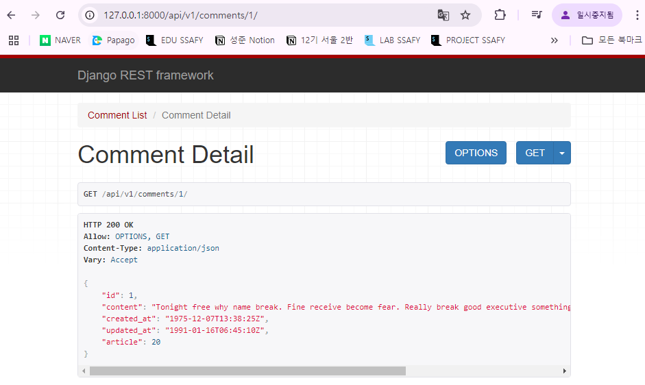
    

## `POST` method

**단일 댓글 생성을 위한 url 및 view 함수 작성**

```python
# articles/urls.py

from django.urls import path
from articles import views

urlpatterns = [
    path('articles/', views.article_list),
    path('articles/<int:article_pk>/', views.article_detail),
    path('comments/', views.comment_list),
    path('comments/<int:comment_pk>/', views.comment_detail),
    **path('articles/<int:article_pk>/comments/', views.comment_create),**
]
```

```python
# articles/views.py

from rest_framework.response import Response
from rest_framework.decorators import api_view
from rest_framework import status

from .models import Article, Comment
from .serializers import ArticleListSerializer, ArticleSerializer, CommentSerializer

**@api_view(['POST'])
def comment_create(request, article_pk):**
    # 게시글 조회
    **article = Article.objects.get(pk=article_pk)**
    # 사용자 입력 데이터를 직렬화 (사용자가 입력한 댓글 데이터)
    **serializer = CommentSerializer(data=request.data)
    if serializer.is_valid(raise_exception=True):**
        # 외래 키 데이터 입력 후 저장
        **serializer.save(article=article)
        return Response(serializer.data, status=status.HTTP_201_CREATED)**
```

- **`serializer`의 인스턴스 `save()` 메서드는 
특정 `Serializer` 인스턴스를 저장하는 과정에서 추가 데이터를 받을 수 있음**

- http://127.0.0.1:8000/api/v1/articles/1/comments/ `POST` 응답 확인
    
    → 상태 코드 400 응답 확인
    
    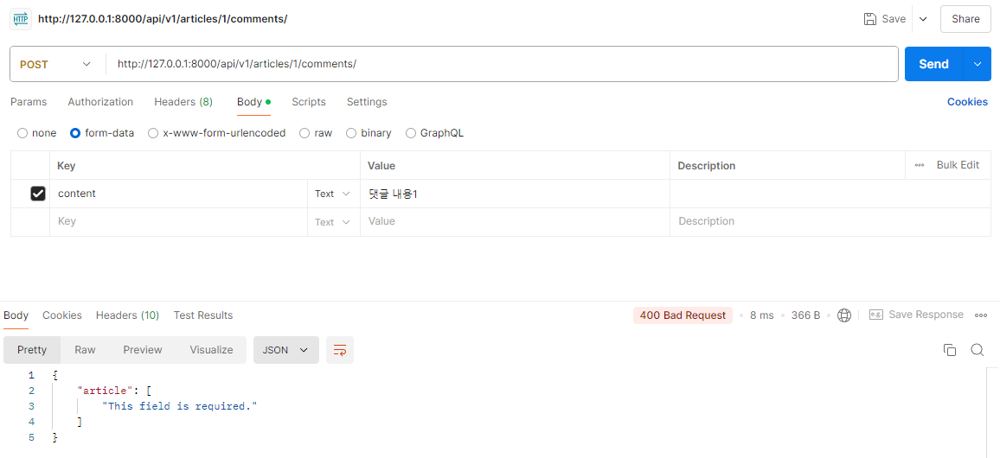
    
- **`CommentSerializer` 에서 외래 키에 해당하는 `article` field 또한 사용자로부터 입력 받도록 설정되어 있기 때문에, 서버 측에서는 누락되었다고 판단한 것**
- **fields에 작성된 필드는 모두 유효성 검사 목록에 추가됨 (`’__all__’` 포함)**
- **유효성 검사 목록에서 제외 필요**
- **article field를 읽기 전용 필드로 설정하기**

### 읽기 전용 필드 (`read_only_fields`)

- **데이터를 전송 받은 시점에
’유효성 검사 목록에서 제외’시키고, ‘데이터 조회 시에는 출력’하는 필드**
    
    ```python
    # articles/serializers.py
    
    class CommentSerializer(serializers.ModelSerializer):
        class Meta:
            model = Comment
            fields = '__all__'
            # 외래 키 필드를 읽기 전용 필드로 지정
            # 외래키 데이터는 유효성 결과에서는 제외하지만 결과 데이터에는 표현하고 싶음
            **read_only_fields = ('article',)**
    ```
    

- http://127.0.0.1:8000/api/v1/articles/1/comments/ `POST` 재요청 후 응답 확인
    
    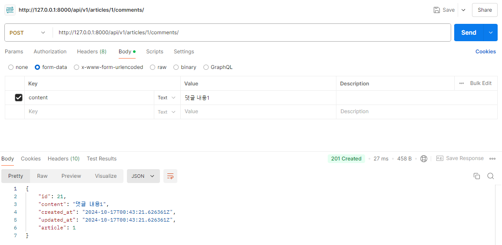
    
    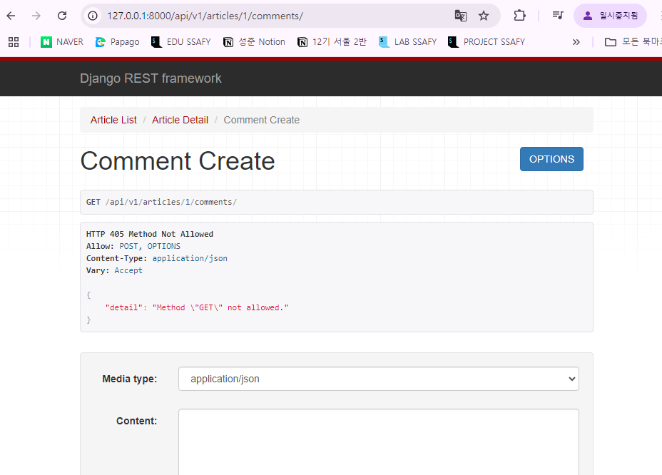
    

## `DELETE` * `PUT` method

- **단일 댓글 삭제 및 수정을 위한 view 함수 작성**

```python
# articles/view.py

from rest_framework.response import Response
from rest_framework.decorators import api_view
from rest_framework import status

from .models import Article, Comment
from .serializers import ArticleListSerializer, ArticleSerializer, CommentSerializer

@api_view(['GET'])
def comment_list(request):
    comments = Comment.objects.all()
    serializer = CommentSerializer(comments, many=True)
    return Response(serializer.data)

**@api_view(['GET', 'DELETE', 'PUT'])
def comment_detail(request, comment_pk):
    comment = Comment.objects.get(pk=comment_pk)
    if request.method == 'GET':
        serializer = CommentSerializer(comment)
        return Response(serializer.data)
    
    elif request.method == 'DELETE':
        comment.delete()
        return Response(status=status.HTTP_204_NO_CONTENT)

    elif request.method == 'PUT':
        serializer = CommentSerializer(comment, data=request.data)
        if serializer.is_valid(raise_exception=True):
            serializer.save()
            return Response(serializer.data) # 기본값: 200**

@api_view(['POST'])
def comment_create(request, article_pk):
    article = Article.objects.get(pk=article_pk)
    serializer = CommentSerializer(data=request.data)
    if serializer.is_valid(raise_exception=True):
        serializer.save(article=article)
        return Response(serializer.data, status=status.HTTP_201_CREATED)
```

- http://127.0.0.1:8000/api/v1/comments/21/ `DELETE` 응답 확인
    
    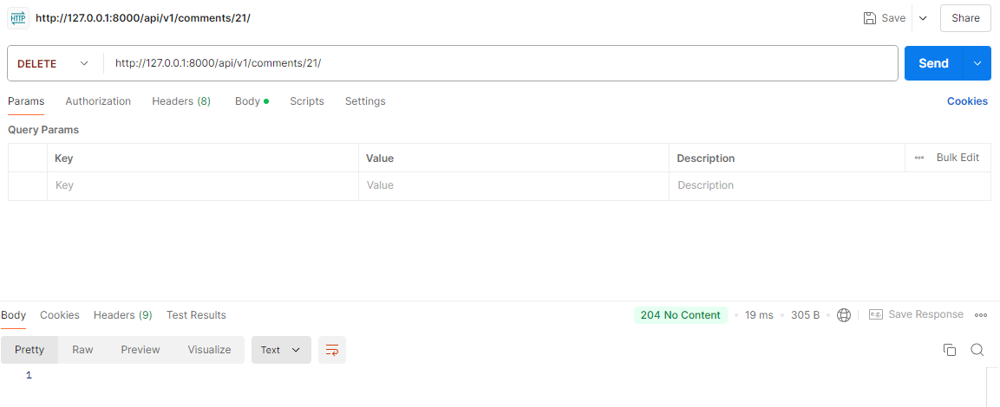
    

- http://127.0.0.1:8000/api/v1/comments/1/ `PUT` 응답 확인
    
    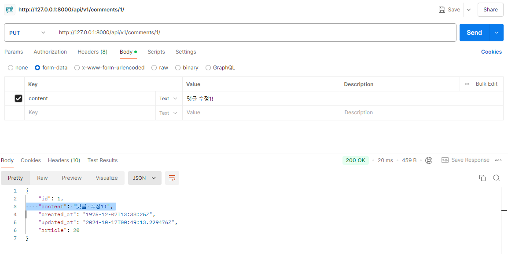
    
    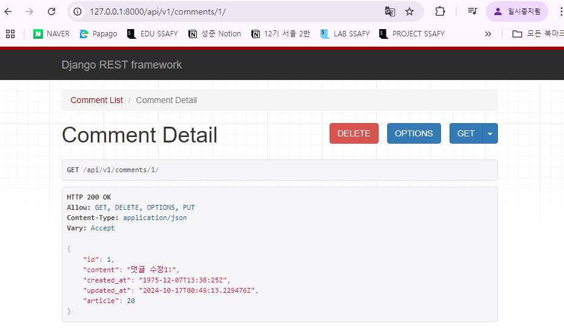
    

## 응답 데이터 재구성

### 댓글 조회 시 게시글 출력 내역 변경

- **댓글 조회 시 게시글 번호만 제공해 주는 것이 아닌 ‘게시글의 제목’까지 제공하기**
    
    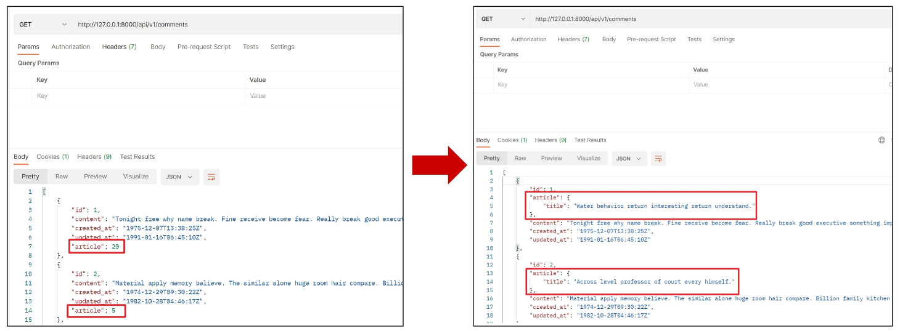
    

- 필요한 데이터를 만들기 위한 Serializer는 내부에서 추가 선언이 가능
    
    ```python
    # articles/serializers.py
    
    from rest_framework import serializers
    from .models import Article, Comment
    
    class ArticleListSerializer(serializers.ModelSerializer):
        class Meta:
            model = Article
            fields = (
                'id',
                'title',
                'content',
            )
    
    class ArticleSerializer(serializers.ModelSerializer):
        class Meta:
            model = Article
            fields = '__all__'
    
    class CommentSerializer(serializers.ModelSerializer):
        **class ArticleTitleSerializer(serializers.ModelSerializer):
            class Meta:
                model = Article
                fields = ('title',)**
    
        # 기존 article 데이터 값을 override
        # 그런데 기존 필드를 override 하게 되면 Meta 클래스의 read_only_fields를 사용할 수 없음
        # 모델 시리얼라이저의 read_only 인자 값으로 재설정
        **article = ArticleTitleSerializer(read_only=True)** 
    
        class Meta:
            model = Comment
            fields = '__all__'
            # read_only_fields = ('article',)
    
    ```
    

- http://127.0.0.1:8000/api/v1/comments/21/ `GET` 응답 확인
    
    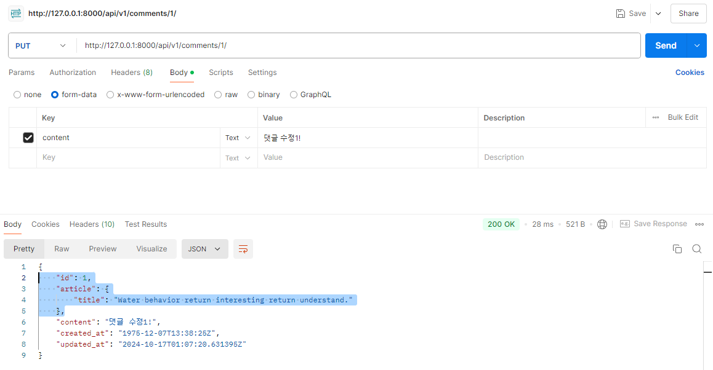
    

# 역참조 데이터 구성

## 단일 게시글 + 댓글 목록

**단일 게시글 조회 시 해당 게시글에 작성된 댓글 목록도 함께 붙여서 응답**

- **`Nested relationships`** (역참조 매니저 활용)
    - 모델 관계상으로 참조하는 대상은 참조되는 대상의 표현에 포함되거나 중첩될 수 있음
    - 이러한 중첩된 관계는 `serializers` 필드로 사용하여 표현 가능
    
    ```python
    # articles/serializers.py
    
    from rest_framework import serializers
    from .models import Article, Comment
    
    class ArticleListSerializer(serializers.ModelSerializer):
        class Meta:
            model = Article
            fields = (
                'id',
                'title',
                'content',
            )
    
    class ArticleSerializer(serializers.ModelSerializer):
        **class CommentDetailSerializer(serializers.ModelSerializer):
            class Meta:
                model = Comment
                fields = ('id', 'content',)**
    
        # comment_set 역참조 데이터를 override
        # 쿼리셋 형태의 데이터이고, 유효성 검사 대상이 아니기 때문에 조건 작성해줘야 함
        **comment_set = CommentDetailSerializer(many=True, read_only=True)**
    
        class Meta:
            model = Article
            fields = '__all__'
    
    class CommentSerializer(serializers.ModelSerializer):
        class ArticleTitleSerializer(serializers.ModelSerializer):
            class Meta:
                model = Article
                fields = ('title',)
    
        article = ArticleTitleSerializer(read_only=True) 
    
        class Meta:
            model = Comment
            fields = '__all__'
    ```
    

- http://127.0.0.1:8000/api/v1/articles/17/  `GET` 응답 확인
    
    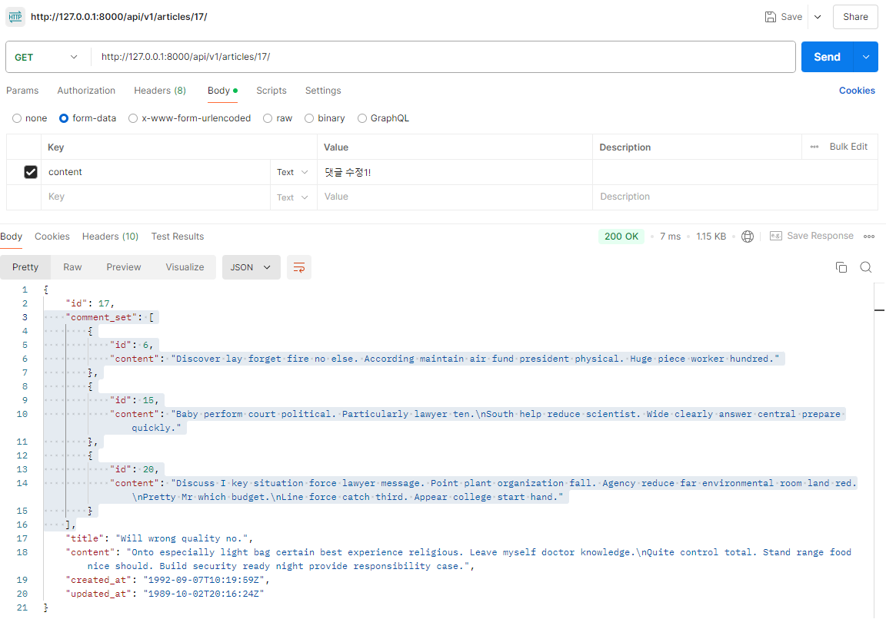
    
    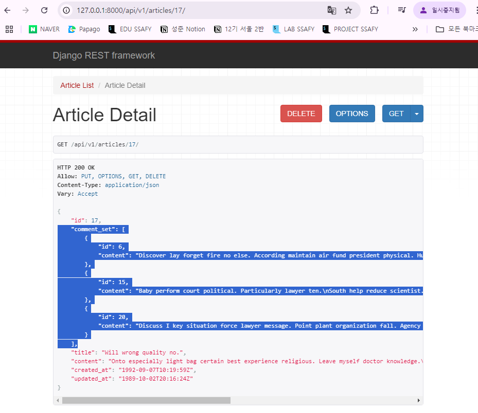
    

## 단일 게시글 + 댓글 개수

**단일 게시글 조회 시 해당 게시글에 작성된 댓글 개수도 함께 붙여서 응답**

- 댓글 개수에 해당하는 새로운 필드 생성

```python
# articles/serializers.py

from rest_framework import serializers
from .models import Article, Comment

class ArticleListSerializer(serializers.ModelSerializer):
    class Meta:
        model = Article
        fields = (
            'id',
            'title',
            'content',
        )

class ArticleSerializer(serializers.ModelSerializer):
    class CommentDetailSerializer(serializers.ModelSerializer):
        class Meta:
            model = Comment
            fields = ('id', 'content',)
    
    comment_set = CommentDetailSerializer(many=True, read_only=True)
    
    # 댓글 개수 제공을 위한 새로운 필드 생성
    **number_of_comments = serializers.IntegerField(source='comment_set.count', read_only=True)**

    class Meta:
        model = Article
        fields = '__all__'

class CommentSerializer(serializers.ModelSerializer):
    class ArticleTitleSerializer(serializers.ModelSerializer):
        class Meta:
            model = Article
            fields = ('title',)

    article = ArticleTitleSerializer(read_only=True) 

    class Meta:
        model = Comment
        fields = '__all__'
```

- http://127.0.0.1:8000/api/v1/articles/17/ `GET` 응답 확인
    
    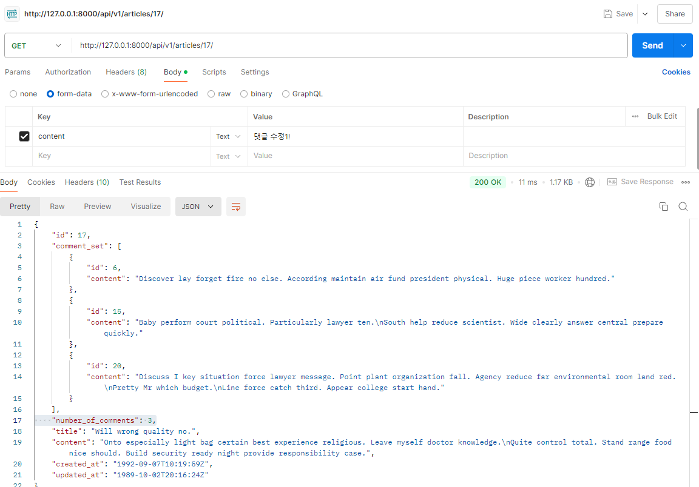
    
    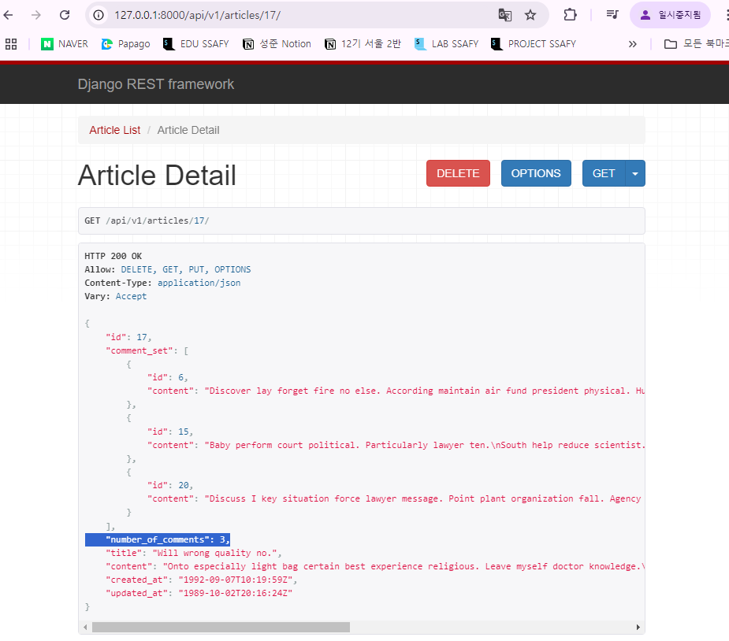
    

### `source` argument

- 필드를 채우는 데 사용할 속성의 이름
- 점 표기법(dotted notation)을 사용하여 속성을 탐색할 수 있음
    
    ```python
    # articles/serializers.py
    
    class ArticleSerializer(serializers.ModelSerializer):
        class CommentDetailSerializer(serializers.ModelSerializer):
            class Meta:
                model = Comment
                fields = ('id', 'content',)
        
        comment_set = CommentDetailSerializer(many=True, read_only=True)
        
        number_of_comments = serializers.IntegerField(**source='comment_set.count'**, read_only=True)
    
        class Meta:
            model = Article
            fields = '__all__'
    ```
    

### `(주의)` 읽기 전용 필드 지정 이슈

- 특정 필드를 override 혹은 추가한 경우 `read_only_fields` 는 동작하지 않음
    
    → 이런 경우 새로운 필드에 `read_only` 키워드 인자로 작성해야 함
    
    ```python
    # articles/serializers.py
    
    class CommentSerializer(serializers.ModelSerializer):
        class ArticleTitleSerializer(serializers.ModelSerializer):
            class Meta:
                model = Article
                fields = ('title',)
    
        **article = ArticleTitleSerializer(read_only=True)** 
    
        class Meta:
            model = Comment
            fields = '__all__'
            **# read_only_fields = ('article',) <<< 작동 X**
    ```
    

## 읽기 전용 필드

### 읽기 전용 필드를 사용하는 이유

- **사용자에게 입력으로는 받지 않지만 제공은 해야 하는 경우**
- **새로운 필드 값을 만들어 제공해야 하는 경우**

**특징 & 주의 사항**

- **유효성 검사에서 제외됨**
- **단, 유효성 검사에서 제외된다고 해서 반드시 ‘생성’ 로직에서만 사용이 국한되는 것은 아님**

### `read_only_fields` 속성 사용처

- **기존 외래 키 필드 값을 그대로 응답 데이터에 제공하기 위해 지정하는 경우**

### `read_only` 인자 사용처

- **기존 외래 키 필드 값의 결과를 다른 값으로 덮어쓰는 경우**
- **새로운 응답 데이터 값을 제공하는 경우**

# API 문서화

## OpenAPI Specification `OAS`

**RESTful API를 설명하고 시각화 하는 표준화된 방법**

**→ API에 대한 세부 사항을 기술할 수 있는 공식 표준**

**OAS 기반 API에 대한 문서를 생성하는 데 도움을 주는 오픈 소스 프레임워크**

- **Swagger**
- **Redoc**


## 문서화 활용

### `drf-spectacular` 라이브러리

**DRF 위한 OpenAPI 3.0 구조 생성을 도와주는 라이브러리**

1. **설치 및 등록**
    
    `$ pip install drf-spectacular`
    
    ```python
    # settings.py
    
    INSTALLED_APPS = [
        'articles',
        'rest_framework',
        **'drf_spectacular',**
    		...
    ]
    ```
    

1. **관련 설정 코드 입력 (OpenAPI 구조 자동 생성 코드)**
    
    ```python
    # settings.py
    
    REST_FRAMEWORK = {
        # YOUR SETTINGS
        'DEFAULT_SCHEMA_CLASS': 'drf_spectacular.openapi.AutoSchema',
    }
    
    # 아래는 선택
    SPECTACULAR_SETTINGS = {
        'TITLE': 'Your Project API',
        'DESCRIPTION': 'Your project description',
        'VERSION': '1.0.0',
        'SERVE_INCLUDE_SCHEMA': False,
        # OTHER SETTINGS
    }
    ```
    

1. **swagger, redoc 페이지 제공을 위한 url 작성**
    
    ```python
    # drf/urls.py
    
    **from drf_spectacular.views import SpectacularAPIView, SpectacularRedocView, SpectacularSwaggerView**
    from django.contrib import admin
    from django.urls import path, include
    
    urlpatterns = [
        path("admin/", admin.site.urls),
        path('api/v1/', include('articles.urls')),
    
        # YOUR PATTERNS
        **path('api/schema/', SpectacularAPIView.as_view(), name='schema'),**
        
        # Optional UI:
        **path('swagger-ui/', SpectacularSwaggerView.as_view(url_name='schema'), name='swagger-ui'),
        path('redoc/', SpectacularRedocView.as_view(url_name='schema'), name='redoc'),
    ]**
    ```
    

1. [**http://127.0.0.1:8000/swagger-ui/](http://127.0.0.1:8000/swagger-ui/) 페이지 확인**
    
    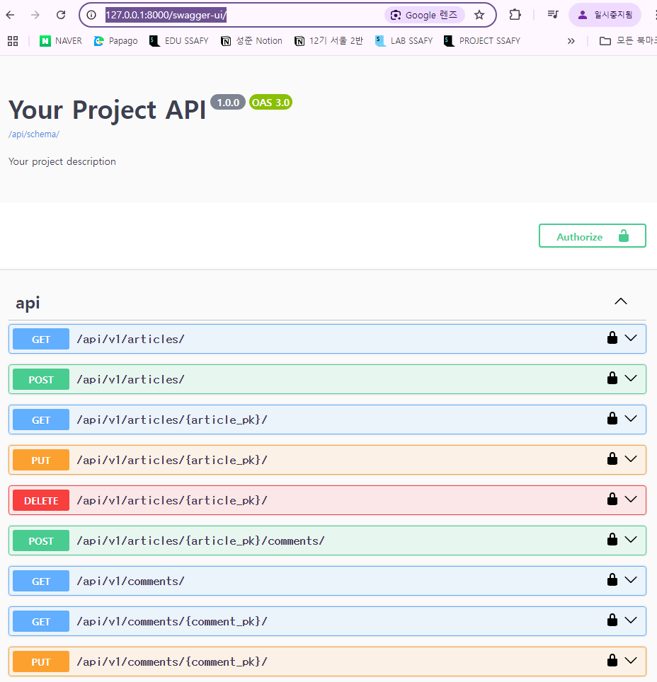
    

1. [**http://127.0.0.1:8000/redoc/](http://127.0.0.1:8000/redoc/) 페이지 확인**
    
    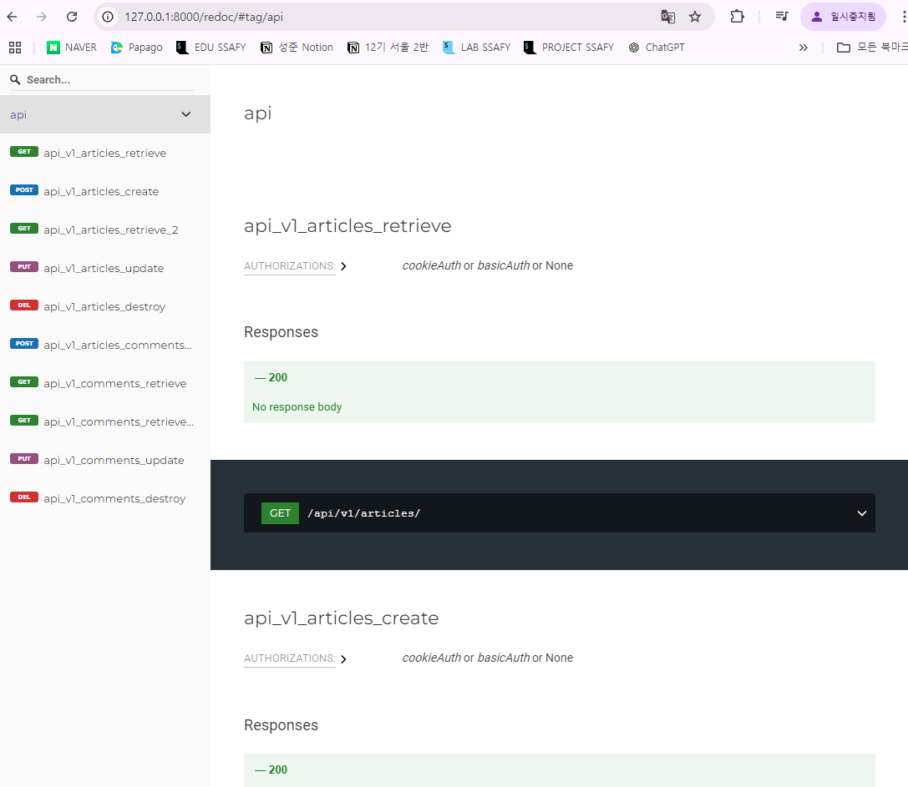
    

### 설계 우선 접근법

- **OAS의 핵심 이점**
- **API를 먼저 설계하고 명세를 작성한 후, 이를 기반으로 코드를 구현하는 방식**
- **API의 일관성을 유지하고, API 사용자는 더 쉽게 API를 이해하고 사용할 수 있음**
- **또한, API가 어떻게 작동하는 지를 시각적으로 보여주는 문서를 생성할 수 있으며,
이는 API를 이해하고 테스트하는 데 매우 유용**

**⇒ 이런 목적으로 사용되는 도구가 `Swagger-UI` 또는 `ReDoc`**

# 참고

## 올바르게 404 응답하기

### Django shortcuts functions

- **`render()`**

- **`redirect()`**

- **`get_object_or_404()`**
    
    ```
    **get method 특징:** 
    - 조회한 **객체가 없을 때 DoesNotExist** 예외 발생
    - 조회한 **객체가 2개 이상일 때 Multiple**
    
    **서버는 예외가 발생하면 코드가 중단.. (500)**
    
    **해결책:
    - 예외 처리**
    ```
    
    - 모델 manager objects에서 `get()`을 호출하지만,
    해당 객체가 없을 땐 `DoesNotExist` 예외 대신 `Http404`를 raise함
    
    ```python
    # articles/views.py
    
    from rest_framework.response import Response
    from rest_framework.decorators import api_view
    from rest_framework import status
    
    from .models import Article, Comment
    from .serializers import ArticleListSerializer, ArticleSerializer, CommentSerializer
    
    **from django.shortcuts import get_object_or_404, get_list_or_404**
    
    @api_view(['GET', 'POST'])
    def article_list(request):
        if request.method == 'GET':
            articles = Article.objects.all()
            serializer = ArticleListSerializer(articles, many=True)
            return Response(serializer.data)
    
        elif request.method == 'POST':
            serializer = ArticleSerializer(data=request.data)
            if serializer.is_valid(raise_exception=True):
                serializer.save()
                return Response(serializer.data, status=status.HTTP_201_CREATED)
    
    @api_view(['GET', 'DELETE', 'PUT'])
    def article_detail(request, article_pk):
        **article = get_object_or_404(Article, pk=article_pk)**
    
        if request.method == 'GET':
            serializer = ArticleSerializer(article)
            return Response(serializer.data)
    
        elif request.method == 'DELETE':
            article.delete()
            return Response(status=status.HTTP_204_NO_CONTENT)
    
        elif request.method == 'PUT':
            serializer = ArticleSerializer(
                article, data=request.data, partial=True
            )
            if serializer.is_valid(raise_exception=True):
                serializer.save()
                return Response(serializer.data)
            
    
    @api_view(['GET'])
    def comment_list(request):
        comments = Comment.objects.all()
        serializer = CommentSerializer(comments, many=True)
        return Response(serializer.data)
    
    @api_view(['GET', 'DELETE', 'PUT'])
    def comment_detail(request, comment_pk):
        **comment = get_object_or_404(Comment, pk=comment_pk)**
        if request.method == 'GET':
            serializer = CommentSerializer(comment)
            return Response(serializer.data)
        
        elif request.method == 'DELETE':
            comment.delete()
            return Response(status=status.HTTP_204_NO_CONTENT)
    
        elif request.method == 'PUT':
            serializer = CommentSerializer(comment, data=request.data)
            if serializer.is_valid(raise_exception=True):
                serializer.save()
                return Response(serializer.data) # 기본값: 200
    
    @api_view(['POST'])
    def comment_create(request, article_pk):
        **article = get_object_or_404(Article, pk=article_pk)**
        serializer = CommentSerializer(data=request.data)
        if serializer.is_valid(raise_exception=True):
            serializer.save(article=article)
            return Response(serializer.data, status=status.HTTP_201_CREATED)
    ```
    
- **`get_list_or_404()`**
    - 모델 manager objects에서 `filter()` 의 결과를 반환하고,
    해당 객체가 없을 땐 `Http404`를 raise함
    
    ```python
    # articles/views.py
    
    from rest_framework.response import Response
    from rest_framework.decorators import api_view
    from rest_framework import status
    
    from .models import Article, Comment
    from .serializers import ArticleListSerializer, ArticleSerializer, CommentSerializer
    
    **from django.shortcuts import get_object_or_404, get_list_or_404**
    
    @api_view(['GET', 'POST'])
    def article_list(request):
        if request.method == 'GET':
            **articles = get_list_or_404(Article)**
            serializer = ArticleListSerializer(articles, many=True)
            return Response(serializer.data)
    
        elif request.method == 'POST':
            serializer = ArticleSerializer(data=request.data)
            if serializer.is_valid(raise_exception=True):
                serializer.save()
                return Response(serializer.data, status=status.HTTP_201_CREATED)
    
    @api_view(['GET', 'DELETE', 'PUT'])
    def article_detail(request, article_pk):
        article = get_object_or_404(Article, pk=article_pk)
    
        if request.method == 'GET':
            serializer = ArticleSerializer(article)
            return Response(serializer.data)
    
        elif request.method == 'DELETE':
            article.delete()
            return Response(status=status.HTTP_204_NO_CONTENT)
    
        elif request.method == 'PUT':
            serializer = ArticleSerializer(
                article, data=request.data, partial=True
            )
            if serializer.is_valid(raise_exception=True):
                serializer.save()
                return Response(serializer.data)
            
    
    @api_view(['GET'])
    def comment_list(request):
        **comments = get_list_or_404(Comment)**
        serializer = CommentSerializer(comments, many=True)
        return Response(serializer.data)
    
    @api_view(['GET', 'DELETE', 'PUT'])
    def comment_detail(request, comment_pk):
        comment = get_object_or_404(Comment, pk=comment_pk)
        if request.method == 'GET':
            serializer = CommentSerializer(comment)
            return Response(serializer.data)
        
        elif request.method == 'DELETE':
            comment.delete()
            return Response(status=status.HTTP_204_NO_CONTENT)
    
        elif request.method == 'PUT':
            serializer = CommentSerializer(comment, data=request.data)
            if serializer.is_valid(raise_exception=True):
                serializer.save()
                return Response(serializer.data) # 기본값: 200
    
    @api_view(['POST'])
    def comment_create(request, article_pk):
        # 게시글 조회
        article = get_object_or_404(Article, pk=article_pk)
        # 사용자 입력 데이터를 직렬화 (사용자가 입력한 댓글 데이터)
        serializer = CommentSerializer(data=request.data)
        if serializer.is_valid(raise_exception=True):
            # 외래 키 데이터 입력 후 저장
            serializer.save(article=article)
            return Response(serializer.data, status=status.HTTP_201_CREATED)
    ```
    

- **존재하지 않는 게시글 조회 요청**
    
    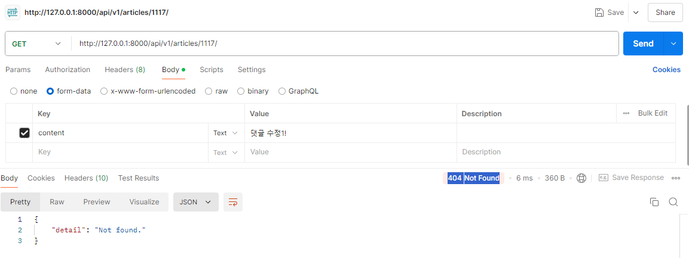
    
    - **이전에는 상태 코드 500을 응답했지만, 현재는 404를 응답**
    
- **클라이언트에게 ‘서버가 오류가 발생하여 요청을 수행할 수 없다(500)’ 라는 원인이 정확하지 않은 에러를 제공하기 보다는,
적절한 예외 처리를 통해 클라이언트에게 보다 정확한 에러 현황을 전달하는 것도 매우 중요한 개발 요소 중 하나이기 때문**

## 복잡한 ORM 활용

### 복잡한 ORM 활용 시 권장 방식

- **복잡한 query나 로직은 view 함수에서 진행**
    - 여러 모델을 조인하거나 복잡한 집계가 필요한 경우 view 함수에서 처리
    - 필요한 경우 view 함수에서 `select_related()` 나 `prefetch_related()` 를 사용하여 query를 최적화
    
- **`Serializer` 는 기본적인 데이터 변환을 담당**
    - `Serializer` 만으로는 복잡한 query를 처리하기 어려움