# Django Form

## HTML ‘form’

지금까지 사용자로부터 데이터를 제출 받기 위해 활용한 방법

그러나 **비정상적, 혹은 악의적인 요청을 필터링 할 수 없음**

→ **유효한 데이터인지 확인이 필요**

### 유효성 검사

**수집한 데이터가 정확하고 유효한지 확인하는 과정**

**유효성 검사 구현의 어려움**

- 유효성 검사를 구현하기 위해서는 **입력 값, 형식, 중복, 범위, 보안 등 많은 것들을 고려해야 함**
    
    → 이런 과정과 기능을 직접 개발하는 것이 아닌, **Django가 제공하는 Form을 사용**
    

## Django ‘Form’

**사용자 입력 데이터를 수집하고 처리 및 유효성 검사를 수행하기 위한 도구**

→ **유효성 검사를 단순화하고 자동화 할 수 있는 기능을 제공**

### Form Class 정의

```python
# articles/forms.py

from django import forms 

class ArticleForm(forms.Form):
    title = forms.CharField(max_length=10)
    content = forms.CharField()
```

### [views.py](http://views.py) 반영

```python
# articles/views.py

from django.shortcuts import render, redirect
# 모델 클래스 가져오기
from .models import Article
**from .forms import ArticleForm**

**def new(request):
    # 게시글 작성 페이지 응답
    form = ArticleForm()
    context = {
        'form': form,
    }
    return render(request, 'articles/new.html', context)**
```

### new.html 반영

```html
<!-- articles/new.html -->

<!DOCTYPE html>
<html lang="en">
<head>
  <meta charset="UTF-8">
  <meta name="viewport" content="width=device-width, initial-scale=1.0">
  <title>Document</title>
</head>
<body>
  <h1>New</h1>
  <form action="" method="POST">
    
    **{{ form }}** 
     <div>
      <label for="title">Title: </label>
      <input type="text" name="title" id="title">
    </div>
    <div>
      <label for="content">Content: </label>
      <textarea name="content" id="content"></textarea>
    </div> 
    <input type="submit">
  </form>
</body>
</html>
```

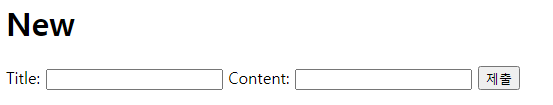

### `.as_p`

label, input 쌍을 특정 HTML 태그로 감싸는 옵션

```html
<!-- articles/new.html -->

<!DOCTYPE html>
<html lang="en">
<head>
  <meta charset="UTF-8">
  <meta name="viewport" content="width=device-width, initial-scale=1.0">
  <title>Document</title>
</head>
<body>
  <h1>New</h1>
  <form action="" method="POST">
    
    **{{ form.as_p }}**
    <input type="submit">
  </form>
</body>
</html>
```

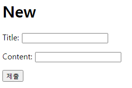

### Form Class가 대체하는 것

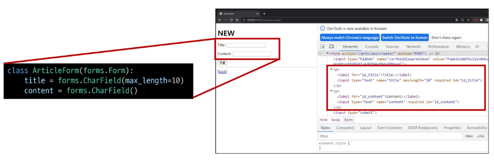

## Widgets

**HTML `input` element의 표현을 담당**

### Widget 적용

- **Widget은 단순히 input 요소의 속성 및 출력 되는 부분을 변경하는 것**
    
    ```python
    # articles/forms.py
    
    from django import forms 
    
    class ArticleForm(forms.Form):
        title = forms.CharField(max_length=10)
        content = forms.CharField(**widget=forms.Textarea**)
    ```
    
    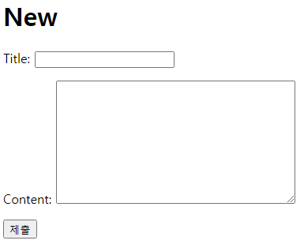
    

# Django ModelForm

| Form | ModelForm |
| --- | --- |
| **사용자 입력 데이터를 DB에 저장하지 않을 때** | **사용자 입력 데이터를 DB에 저장해야 할 때** |
| *검색, 로그인* | *게시글 작성, 회원 가입* |

## ModelForm

**Model과 연결된 Form을 자동으로 생성해주는 기능을 제공**

→ **`Form` + `Model`** 

**Meta Data: 데이터의 데이터**

### ModelForm Class 정의

- **기존 ArticleForm 클래스 수정**
    
    ```python
    # articles/forms.py
    
    **from django import forms 
    from .models import Article
    
    class ArticleForm(forms.ModelForm):
        class Meta:             # Model Form의 데이터를 작성하는 곳
            model = Article     # 인스턴스를 생성하는 것이 아니라서, 괄호를 열고 닫을 필요 X
            fields = '__all__'  # field 안 됨. 
            
    # models의 Article 모델을 해석해서 ModelForm을 생성해주는 원리**
    ```
    
    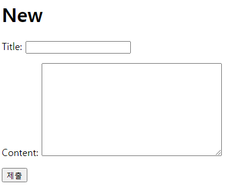
    

## Meta class

**ModelForm의 정보를 작성하는 곳**

### 속성

**`fields` : 포함할 것들을 지정**

```python
# articles/forms.py

from django import forms 
from .models import Article

class ArticleForm(forms.ModelForm):
    class Meta:             
        model = Article    
        fields = ('title',) 
```

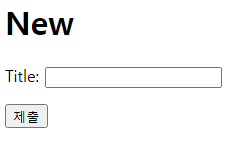

**`exclude` :  제외할 것들을 지정**

```python
# articles/forms.py

from django import forms 
from .models import Article

class ArticleForm(forms.ModelForm):
    class Meta:             
        model = Article    
        exclude = ('title',) 
```

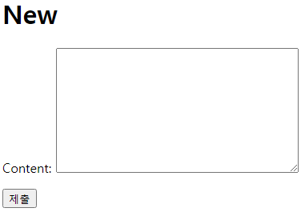

### Meta Class 주의사항

- **Django에서 `ModelForm`에 대한 추가 정보나 속성을 작성하는 클래스 구조를 
`Meta` 클래스로 작성했을 뿐이며,
파이썬의 `inner class`와 같은 문법적인 관점으로 접근하지 말 것.**

## ModelForm 적용

### Create Logic

```python
# articles/views.py

from django.shortcuts import render, redirect
from .models import Article
**from .forms import ArticleForm**

**def create(request):**
    # 1. 사용자 요청으로부터 입력 데이터를 추출
    #    모델 폼 인스턴스 생성 (+ 사용자 입력 데이터를 통째로 인자로 작성)
    **form = ArticleForm(request.POST)**
    
    # title = request.POST.get('title')
    # content = request.POST.get('content')
    
    # 2. 유효성 검사: is_valid()는 boolean을 반환
    **if form.is_valid():**             # 만약 True라면
        **article = form.save()**       # 저장
        **return redirect('articles:detail', article.pk)**
    # 만약 유효성 검사를 실패했다면 (False)
    **context = {
        'form': form, # is_valid()는 실패했을 경우 실패한 내역을 같이 제공하기 때문에
    }
    return render(request, 'articles/new.html', context)**
    
```

- input에 공백을 입력 후 제출 시 에러 메시지 출력 확인:
    
    → 유효성 검사의 결과
    
    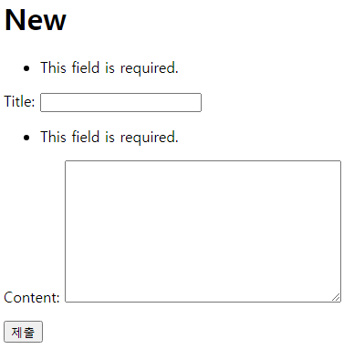
    

**`is_valid()` : 여러 유효성 검사를 실행하고, 데이터가 유효한지 여부를 `Boolean`으로 반환**

**공백 데이터가 유효하지 않은 이유와 에러 메시지가 출력되는 과정**

- 모델 필드에는 기본적으로 **빈 값을 허용하지 않는 제약조건이 설정**되어 있음
- **빈 값은 `is_valid()`에 의해 False로 평가**되고 
**`form` 객체에는 그에 맞는 에러 메시지가 포함돼 다음 코드로 진행**됨
    
    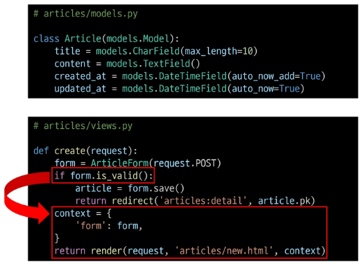
    

### Edit Logic

```python
# articles/view.py

from django.shortcuts import render, redirect
from .models import Article
from .forms import ArticleForm

def edit(request, pk):
    # 어떤 게시글을 수정할지 조회
    article = Article.objects.get(pk=pk)
    form = ArticleForm(instance=article) 
    
    # 기존에 썼던 데이터를 가져오려면 instance 값에 기존 데이터를 넣어줘야 함
    context = {
        'article': article,
        'form': form,
    }
    return render(request, 'articles/edit.html', context)
```

```html
<!-- articles/edit.html -->

<!DOCTYPE html>
<html lang="en">
<head>
  <meta charset="UTF-8">
  <meta name="viewport" content="width=device-width, initial-scale=1.0">
  <title>Document</title>
</head>
<body>
  <h1>Edit</h1>
  <form action="" method="POST">
    
    {{ form.as_p }}
     <div>
      <label for="title">Title: </label>
      <input type="text" name="title" id="title" value="{{ article.title }}">
    </div>
    <div>
      <label for="content">Content: </label>
      <textarea name="content" id="content">{{ article.content }}</textarea>
    </div> 
    <input type="submit" value="수정">
  </form>
  <hr>
  <a href="">[back]</a>
</body>
</html>
```

### Update Logic

```python
# articles/view.py

from django.shortcuts import render, redirect
from .models import Article
from .forms import ArticleForm

def update(request, pk):
    # 1. 어떤 게시글 수정할지 조회
    article = Article.objects.get(pk=pk)

    # 1. 모델폼 인스턴스 생성 (+ 사용자 입력 데이터 & 기존 데이터)
    form = ArticleForm(request.POST, instance=article) # instance를 넣어주면 수정하는 것으로 인식

    # 2. 유효성 검사
    if form.is_valid():
        form.save()
        return redirect('articles:detail', article.pk)
    context = {
        'article': article,
        'form': form,
    }
    return render(request, 'articles/edit.html', context)
```

**`save()` : 데이터베이스 객체를 만들고 저장하는 `ModelForm`의 인스턴스 메서드**

**`save()` 메서드가 생성과 수정을 구분하는 법:**

키워드 인자 `instance` 여부를 통해 생성할 지, 수정할 지를 결정

```python
# CREATE

form = ArticleForm(request.POST)
form.save()
```

```python
# UPDATE

form = ArticleForm(request.POST, instance=article)
form.save()
```

## Django Form 정리

- 사용자로부터 데이터를 수집하고 처리하기 위한 강력하고 유연한 도구
- `HTML form`의 생성, 데이터 유효성 검사 및 처리를 쉽게 할 수 있도록 도움

# HTTP 요청 다루기

## View 함수 구조 변화

**new & create view 함수 간 공통점과 차이점**

**`공통점` : 데이터 생성을 구현하기 위함**

**`차이점` :**

**`new`      : GET method 요청만 처리**

**`create` : POST method 요청만 처리**

**→ HTTP request method 차이점을 활용해 동일한 목적을 가지는 2개의 view 함수를 하나로 구조화**

## new & create 함수 결합

1. **new와 create view 함수의 공통점과 차이점을 기반으로 하나의 함수로 결합**

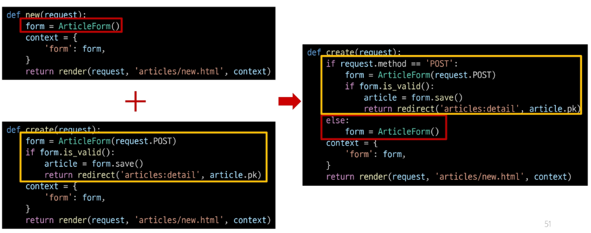

```python
# articles/views.py

from django.shortcuts import render, redirect
from .models import Article
from .forms import ArticleForm

# (두 함수의 유일한 차이점: request method에 따라 분기)
def create(request):
    # 요청 메서드가 POST일 때 : 과거 create 함수
    if request.method == 'POST':
        form = ArticleForm(request.POST)
        
        if form.is_valid():
            article = form.save()
            return redirect('articles:detail', article.pk)

    # 요청 메서드가 POST가 아닐 때 : new 함수 (GET, PUT, DELETE 등의 다른 메서드 존재) 
    else: 
        form = ArticleForm()
    context = {
        'form': form,
    }
    return render(request, 'articles/new.html', context)
```

- `context` 에 담기는 `form` 은
    1. `is_valid()` 를 통과하지 못해 에러 메시지를 담은 `form` 이거나
    2. `else` 문을 통한 `form` 인스턴스
        
        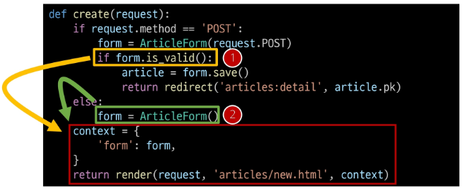
        

1. **사용하지 않게 된 new url 제거**

```python
# articles/urls.py

from django.urls import path
from . import views

app_name = 'articles'
urlpatterns = [
    path('', views.index, name='index'),
    path('<int:pk>/', views.detail, name='detail'),
    # path('new/', views.new, name='new'),
    path('create/', views.create, name='create'),
    path('<int:pk>/delete/', views.delete, name='delete'),
    path('<int:pk>/edit/', views.edit, name='edit'),
    path('<int:pk>/update/', views.update, name='update'),
]
```

1. **new 관련 키워드를 create로 변경**

```html
<!-- articles/index.html -->

<!DOCTYPE html>
<html lang="en">
<head>
  <meta charset="UTF-8">
  <meta name="viewport" content="width=device-width, initial-scale=1.0">
  <title>Document</title>
</head>
<body>
  <h1>Articles</h1>
  **<a href="">CREATE</a>**
   <p>{{ articles }}</p> 
  
    <p>글 번호: {{ article.pk }}</p>
    <a href="">
      <p>글 제목: {{ article.title }}</p>
    </a>
    <p>글 내용: {{ article.content }}</p>
    <hr>
  

</body>
</html>

```

```html
<!-- articles/create.html -->

<!DOCTYPE html>
<html lang="en">
<head>
  <meta charset="UTF-8">
  <meta name="viewport" content="width=device-width, initial-scale=1.0">
  <title>Document</title>
</head>
<body>
  **<h1>CREATE</h1>**
  **<form action="" method="POST">**
    
    {{ form.as_p }}
    <input type="submit">
  </form>
</body>
</html>

```

```python
# articles/views.py

from django.shortcuts import render, redirect
from .models import Article
from .forms import ArticleForm

def create(request):
    if request.method == 'POST':
        form = ArticleForm(request.POST)
        if form.is_valid():
            article = form.save()
            return redirect('articles:detail', article.pk)
    else: 
        form = ArticleForm()
    context = {
        'form': form,
    }
    **return render(request, 'articles/create.html', context)**
```

### request method에 따른 요청의 변화

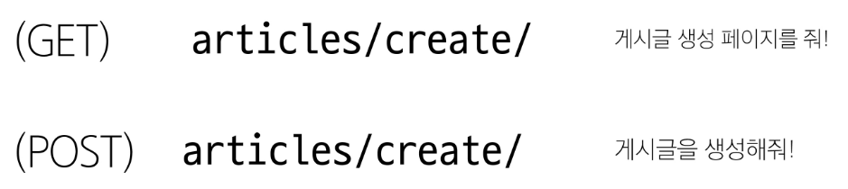

## edit & update 함수 결합

1. **기존 edit과 update view 함수 결합**

```python
# articles/views.py

from django.shortcuts import render, redirect
from .models import Article
from .forms import ArticleForm

def update(request, pk):
    article = Article.objects.get(pk=pk)
    if request.method == 'POST':
        form = ArticleForm(request.POST, instance=article) # instance를 넣어주면 수정하는 것으로 인식

        if form.is_valid():
            form.save()
            return redirect('articles:detail', article.pk)
    
    else:
        form = ArticleForm(instance=article) 
    context = {
        'article': article,
        'form': form,
    }
    return render(request, 'articles/update.html', context)
```

1. **사용하지 않게 된 new url 제거**

```python
# articles/urls.py

from django.urls import path
from . import views

app_name = 'articles'
urlpatterns = [
    path('', views.index, name='index'),
    path('<int:pk>/', views.detail, name='detail'),
    # path('new/', views.new, name='new'),
    path('create/', views.create, name='create'),
    path('<int:pk>/delete/', views.delete, name='delete'),
    **# path('<int:pk>/edit/', views.edit, name='edit'),**
    path('<int:pk>/update/', views.update, name='update'),
]
```

1. **new 관련 키워드를 create로 변경**

```html
<!-- articles/detail.html -->

<!DOCTYPE html>
<html lang="en">
<head>
  <meta charset="UTF-8">
  <meta name="viewport" content="width=device-width, initial-scale=1.0">
  <title>Document</title>
</head>
<body>
  <h1>Detail</h1>
  <h3>{{ article.pk }}번째 글</h3>
  <hr>
  <p>제목: {{ article.title }}</p>
  <p>내용: {{ article.content }}</p>
  <p>작성일: {{ article.created_at }}</p>
  <p>수정일: {{ article.updated_at }}</p>
  <hr>
  **<a href="">수정</a><br>**
  <form action="" method="POST">
    
    <input type="submit" value="삭제">
  </form>
  <a href="">[back]</a>
</body>
</html>
```

```html
<!-- articles/update.html -->

<!DOCTYPE html>
<html lang="en">
<head>
  <meta charset="UTF-8">
  <meta name="viewport" content="width=device-width, initial-scale=1.0">
  <title>Document</title>
</head>
<body>
  <h1>Update</h1>
  **<form action="" method="POST">**
    
    {{ form.as_p }}
    <input type="submit" value="수정">
  </form>
  <hr>
  <a href="">[back]</a>
</body>
</html>
```

```python
# articles/views.py

from django.shortcuts import render, redirect
from .models import Article
from .forms import ArticleForm

def update(request, pk):
    article = Article.objects.get(pk=pk)
    if request.method == 'POST':
        form = ArticleForm(request.POST, instance=article) # instance를 넣어주면 수정하는 것으로 인식
        if form.is_valid():
            form.save()
            return redirect('articles:detail', article.pk)
    else:
        form = ArticleForm(instance=article) 
    context = {
        'article': article,
        'form': form,
    }
    **return render(request, 'articles/update.html', context)**
```

# 참고

## ModelForm의 키워드 인자 구성

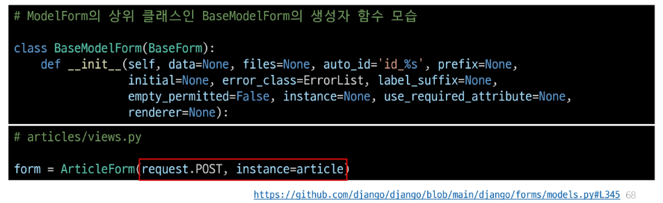

- **`data` : 첫번째에 위치한 키워드 인자이기에 생략 가능**
- **`instance` : 9번째에 위치한 키워드 인자이기 때문에 생략할 수 없었음**

## Widget 응용

```python
# articles/forms.py

from django import forms 
from .models import Article

class ArticleForm(forms.ModelForm):
    title = forms.CharField(
        label='제목',
        widget=forms.TextInput(
            attrs={
                'class': 'my-title',
                'placeholder': '제목을 입력해주세요.',
                'maxlength': 10,
            }
        )
    )

    content = forms.CharField(
        label='내용',
        widget=forms.Textarea(
            attrs={
                'class': 'my-content',
                'placeholder': '내용을 입력해주세요.',
                'rows': 5,
                'cols': 50,
            }
        ),
        error_messages={'required': '빈 내용은 입력할 수 업습니다.'},
    )

    class Meta:             
        model = Article    
        fields = '__all__'
```

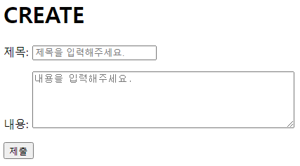

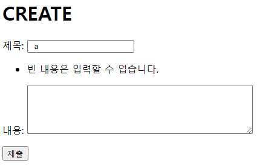

## 필드를 수동으로 렌더링

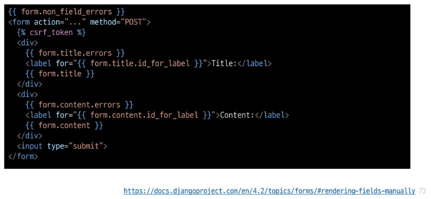

# 메모

둘의 차이점이 뭐지? 

위는 안 되고, 아래는 됨.

```python
**# forms.py**

from django import forms
from .models import Todo

class TodoForm(forms.ModelForm):
    **# is_completed = forms.BooleanField(
    #     widget=forms.HiddenInput()        
    #     )**

    class Meta:
        model = Todo
        fields = '__all__'
        **widgets = {'is_completed': forms.HiddenInput()}**
        
###########################################################################
        
**# views.py**

from django.shortcuts import render, redirect
from .models import Todo
from .forms import TodoForm

def create(request):
    if request.method == 'POST':
        form = TodoForm(request.POST)
        **if form.is_valid():**
            todo = form.save()
            return redirect('todos:detail', todo.pk)
    else:
        form = TodoForm()
    context = {
        'form': form
    }
    return render(request, 'todos/create.html', context)
```

위랑 아래는 `.is_valid()` 에 걸리는 시점의 차이.

위에 쓰면 유효성 검사에 걸리고, 아래에 쓰면 검사 하기 전에 `false`가 지정되기 때문에 통과함