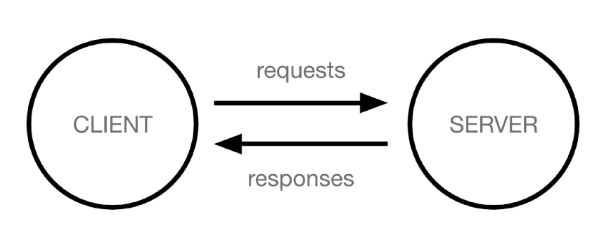
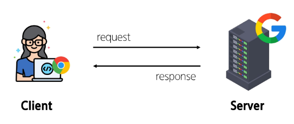
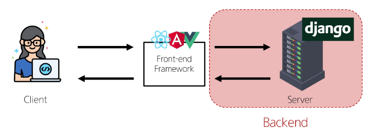
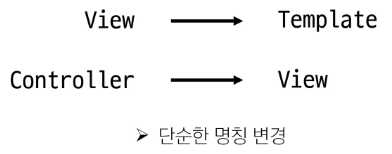
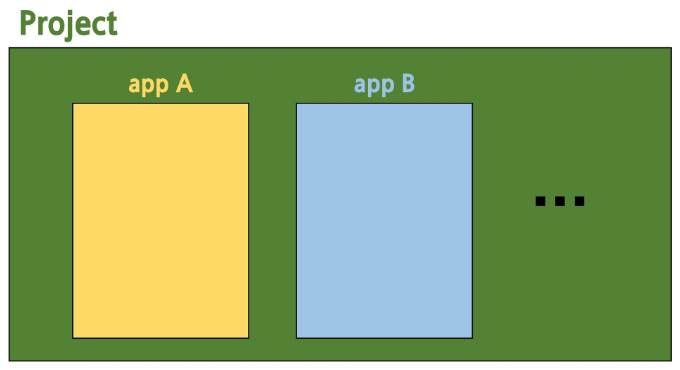
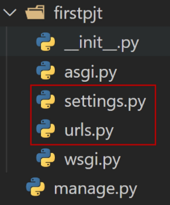
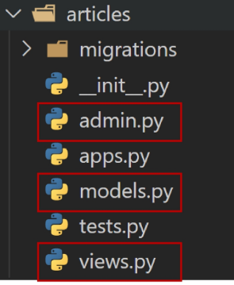
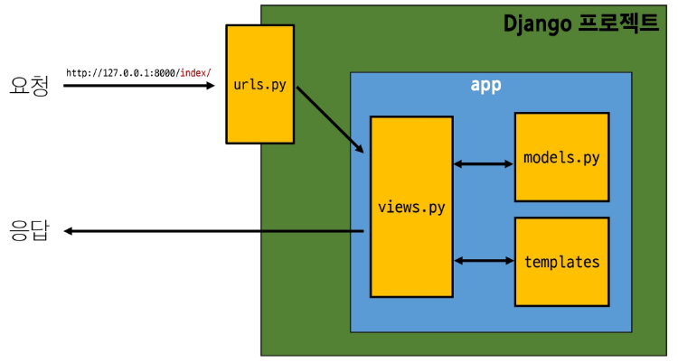
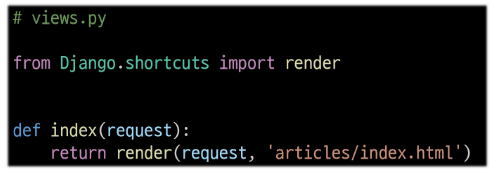
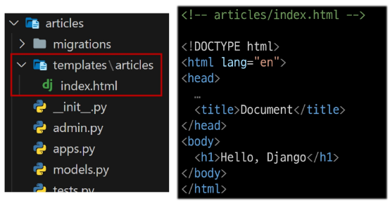

# Web Application

### Web application (Web Service) 개발

- 인터넷을 통해 사용자에게 제공되는 소프트웨어 프로그램을 구축하는 과정
- 다양한 디바이스 (모바일, PC 등)에서 웹 브라우저를 통해 접근하고 사용할 수 있음

## 클라이언트와 서버

### 웹의 동작 방식

**‘클라이언트 - 서버’ 구조**



**Client :** 서비스를 요청하는 주체 (웹 사용자의 인터넷이 연결된 장치,  웹 브라우저 등)

**Server :** 클라이언트의 요청에 응답하는 주체 (웹 페이지, 앱을 저장하는 컴퓨터 등)

**웹 페이지를 보게 되는 과정**



```
1. 웹 브라우저(클라이언트)에서 'google.com'를 입력 후 엔터
2. 웹 브라우저는 인터넷에 연결된 전세계 어딘가에 있는 구글 컴퓨터(서버)에게 
	 '메인 홈페이지.html' 파일을 달라고 요청
3. 요청을 받은 구글 컴퓨터는 데이터베이스에서 '메인 홈페이지.html'파일을 찾아 응답
4. 웹 브라우저는 전달받은 '메인 홈페이지.html' ㅎ파일을 사람이 볼 수 있도록
	 해석해주고, 사용자는 구글의 메인 페이지를 보게 됨 
```

## Frontend & Backend



# Framework

## Web Frameword

**웹 어플리케이션을 빠르게 개발할 수 있도록 도와주는 도구**
(개발에 필요한 기본 구조, 규칙, 라이브러리 등을 제공)

**웹 서비스 개발에 필요한 것**

- **웹 서비스 개발에 필요한 다양한 기술**
    - 로그인 / 로그아웃 / 회원 관리 / 데이터 베이스 / 보안 등
- **모든 기능을 직접 개발하기에는 현실적 어려움 존재**
- **현대 웹 개발의 핵심:**
    
    **→ 잘 만들어진 도구를 효과적으로 활용하는 능력**
    

## Django framework

Python 기반의 대표적인 웹 프레임워크

**Django를 사용하는 이유**

- **다양성**
    - Python 기반으로 웹, 모바일 앱 백엔드, API 서버 및 빅데이터 관리 등 광범위한 서비스 개발에 적합
- **확장성**
    - 대량의 데이터에 대해 빠르고 유연하게 확장할 수 있는 기능을 제공
- **보안**
    - 취약점으로부터 보호하는 보안 기능이 기본적으로 내장돼 있음
- **커뮤니티 지원**
    - 개발자를 위한 지원, 문서 및 업데이트를 제공하는 활성화된 커뮤니티
- **검증된 웹 프레임워크**
    - 대규모 트래픽 서비스에서도 안정적인 서비스 제공
        
        
        
- **가장 인기있는 Backend Frameword (2024)**
    
    
    

## 가상 환경

Python 애플리케이션과 그에 따른 패키지들을 격리해서 관리할 수 있는 독립적인 실행 환경

**가상 환경이 필요한 경우**

```
1. 한 개발자가 2개의 프로젝트 (A와 B)를 진행해야 함
2. 프로젝트 A는 requests 패키지 버전 1를 사용해야 함
3. 프로젝트 B는 requests 패키지 버전 2를 사용해야 함
4. 하지만 파이썬 환경에서 패키지는 1개의 버전만 존재할 수 있음

-> A와 B 프로젝트의 다른 패키지 버전 사용을 위한 독립적인 개발 환경이 필요
```

```
1. 한 개발자가 2개의 프로젝트 (A와 B)를 진행해야 함
2. 프로젝트 A는 water라는 패키지를 사용해야 함
3. 프로젝트 B는 fire라는 패키지를 사용해야 함
4. 하지만 파이썬 환경에서 water 패키지와 fire패키지를 함께 사용하면 충돌이 발생함

-> A와 B 프로젝트의 다른 패키지 충돌을 피하기 위해 독립적인 개발 환경이 필요
```

**Python 환경 구조 예시**


### 가상환경 만들기

1. **가상 환경 `venv` 생성**
    - `venv`라는 이름의 가상 환경 생성
    - 임의 이름으로 생성이 가능하나, 관례적으로 `venv`라는 이름을 사용
    
    ```bash
    **$ python -m venv venv** 
    ```
    

1. **가상 환경 활성화**
    - 활성화 명령어는 OS에 따라 다르니 주의
    
    ```bash
    # Windows 
    **$ source venv/Scripts/activate** 
    
    # Mac / Linux
    **$ source venv/bin/activate**
    
    # 가상 환경 비활성화
    $ deactivate
    ```
    

1. **환경에 설치된 패키지 목록 확인**
    
    ```bash
    **$ pip list**
    
    Package    Version
    ---------- -------
    pip        22.0.4
    setuptools 58.1.0
    
    # 활성화하게 되면 설치된 pip 개수가 확 줄어듦
    ```
    

1. **설치된 패키지 목록 생성**
    - 현재 python 환경에 설치된 모든 패키지와 그 버전을 텍스트 파일로 저장
    - `requirements.txt` : 생성될 파일 이름 (관례적으로 사용)
    
    ```bash
    $ pip freeze > requirements.txt
    ```
    
2. **번외**
    
    **패키지 목록 기반 설치**
    
    - 생성된 `requirements.txt`로 다른 환경에서 동일한 환경 구성
    - 가상 환경 활성화 후 `requirements.txt`에 작성된 목록을 기반으로 설치
    
    ```bash
    $ pip install -r requirements.txt 
    ```
    

**패키지 목록이 필요한 이유**

```
1. 2명의 개발자가 하나의 프로젝트를 함께 개발한다고 가정
2. 팀원 A가 먼저 가상 환경을 생성 후 프로젝트르 설정하고 관련된 패키지를 설치하고 개발하다가
	 협업을 위해 github에 프로젝트를 push함
3. 팀원 B는 해당 프로젝트를 clone받고 실행해보려고 하지만 실행되지 않음
4. 팀원 A가 이 프로젝트를 위해 어떤 패키지를 설치했고, 어떤 버전을 설치했는지
	 A의 가상 환경 정보를 알 수 없음
	 
-> 가상 환경에 대한 정보: 즉 패키지 목록이 공유되어야 함 
```

**의존성 패키지**

- 한 소프트웨어 패키지가 다른 패키지의 기능이나 코드를 사용하기 때문에
그 패키지가 존재해야만 제대로 작동하는 관계
- 사용하려는 패키지가 설치되지 않았거나, 호환되는 버전이 아니면
오류가 발생하거나 예상치 못한 동작을 보일 수 있음

**의존성 패키지 예시**

- requests 설치 후 설치되는 패키지 목록 변화 (단순히 1개만 설치되는 것이 아님)


### 가상 환경 주의 및 권장 사항

1. 가상 환경에 “들어가고 나오는” 것이 아니라, 사용할 환경을 `On/Off` 로 전환하는 개념
    - 가상 환경 활성화는 현재 터미널 환경에만 영향을 끼침
    - 새 터미널 창을 열면 다시 활성화해야 함
2. 가상 환경은 ‘방’이 아니라 ‘도구 세트’
    - 활성화는 특정 도구 세트를 선택하는 것
3. 프로젝트마다 별도의 가상 환경 사용
4. 일반적으로 가상 환경 폴더 `venv`는 관련된 프로젝트와 동일한 경로 위치
5. 가상 환경 폴더 `venv`는 `gitignore`에 작성되어 원격 저장소에 공유되지 않음
    - 저장소 크기를 줄여 효율적인 협업과 배포를 가능하게 하기 위함 (`requirements.txt`를 공유)

### 의존성 패키지 관리의 중요성

**개발 환경에서는 각각의 프로젝트가 사용하는 패키지와 그 버전을 정확히 관리하는 것이 중요**

**→ 가상 환경 & 의존성 패키지 관리**

### Django 프로젝트 생성 및 서버 실행

1. Django 설치

```bash
$ pip install django
```

1. 프로젝트 생성 ( `manage.py`와 동일한 경로에서 진행 )

```bash
$ django-admin startproject firstpjt . 
```

1. 서버 실행  ( `manage.py`와 동일한 경로에서 진행 )

```bash
$ python manage.py runserver
```

# Django Design Pattern

## Design Pattern (디자인 패턴)

**소프트웨어 설계에서 발생하는 문제를 해결하기 위한 일반적인 해결책
(공통적인 문제를 해결하는데 쓰이는 형식화된 관행)**

**→ 애플리케이션의 구조는 이렇게 정의하자**

### MVC 디자인 패턴 **(Model, View, Controller)**

**애플리케이션을 구조화하는 대표적인 패턴**
(`데이터` & `사용자 인터페이스` & `비즈니스 로직`을 분리)

→ 시각적 요소와 뒤에서 실행되는 로직을 서로 영향 없이,
    독립적이고 쉽게 유지 보수할 수 있는 애플리케이션을 만들기 위해

### MTV 디자인 패턴 (Model, Template, View)

**Django에서 애플리케이션을 구조화하는 패턴**
(기존 MVC 패턴과 동일하나, 단순히 명칭을 다르게 정의한 것)



## Project & App



**만약 온라인 커뮤니티 카페를 만든다면?**


### Django project:

**애플리케이션의 집합 (DB 설정, URL 연결, 전체 앱 설정 등을 처리)**

### Django Application:

**독립적으로 작동하는 기능 단위 모듈**
(각자 특정한 기능을 담당하며, 다른 App들과 함께 하나의 프로젝트를 구성)

### App을 사용하기 위한 순서

1. **App 생성**
    - App의 이름은 `복수형`으로 지정하는 것을 권장
    
    ```bash
    $ python manage.py startapp articles
    ```
    

1. **App 등록**
    - 반드시 App을 생성한 후에 등록해야 함 (등록 후 생성은 불가능)
    - 직접 만든 App은 앞쪽에 배치하는 것이 관례 (구동 순서)
    
    ```python
    # settings.py 
    
    # Application definition
    
    INSTALLED_APPS = [
        'articles',
        'django.contrib.admin',
        'django.contrib.auth',
        'django.contrib.contenttypes',
        'django.contrib.sessions',
        'django.contrib.messages',
        'django.contrib.staticfiles',
    ]
    ```
    

### 프로젝트 구조

- `settings.py`
    - 프로젝트의 모든 설정을 관리
- `urls.py`
    - 요청 들어오는 URL에 따라
    이에 해당하는 적절한 views를 연결
- `__init__.py`
    - 해당 폴더를 패키지로
    인식하도록 설정하는 파일
- `asgi.py`
    - 비동기식 웹 서버와의 연결 관련 설정
- `wsgi.py`
    - 웹 서버와의 연결 관련 설정
- `manage.py`
    - Django 프로젝트와 다양한 방법으로
    상호 작용하는 커맨드라인 유틸리티
    



### 앱 구조

- `admin.py`
    - 관리자용 페이지 설정
- `models.py`
    - DB와 관련된 Model을 정의
    - MTV 패턴의 ‘M’
- `views.py`
    - HTTP 요청을 처리하고 
    해당 요청에 대한 응답을 반환
    (url, model, template과 연계)
    - MTV 패턴의 ‘V’



- `apps.py`
    - 앱의 정보가 작성된 곳
- `tests.py`
    - 프로젝트 테스트 코드를 작성하는 곳

# 요청과 응답

## Django에서의 요청과 응답




### 1. URLs


[**http://127.0.0.1:8000/index/](http://127.0.0.1:8000/index/) 로 요청이 왔을 때,
request 객체를 views 모듈의 index view 함수에게 전달하며 호출**

### 2. View



**view 함수가 정의되는 곳**

특정 경로에 있는 template과 request 객체를 결합해 응답 객체를 반환

- *모든 view 함수는 첫 번째 인자로 요청 객체를 필수적으로 받음*
- *매개 변수 이름이 `request` 가 아니어도 괜찮으나, 권장하지 않음*

### 3. Template



1. `articles` App 폴더 안에 `templates` 폴더 생성 
(반드시 `templates`이어야 하며, 개발자가 직접 생성해야 함)
2. `templates` 폴더 안에 `articles` 폴더 생성
3. `articles` 폴더 안에 템플릿 파일 생성

**Django에서 template을 인식하는 경로 규칙**

`app폴더/templates/articles/index.html`

`app폴더/templates/example.html`

- Django는 빨간색으로 지정된 지점까지는 기본 경로로 인식하기 때문에,
view 함수에서 template 경로 작성 시 이 지점 이후의 경로를 작성해야 함
    
    
    

## 정리


**데이터 흐름에 따라 코드 작성하기**

**`URLs → View → Template`**


# 참고

## Django 프로젝트 생성 전 루틴

```
1. 가상환경 생성
2. 가상환경 활성화
3. Django 설치
4. 패키지 목록 파일 생성
	 (패키지 설치할 때마다 진행)
5. .gitignore 파일 생성 (첫 add 전)
6. git 저장소 생성 (git init)
7. Django 프로젝트 생성
```

```bash
# 1. 가상환경 생성
$ python -m venv venv

# 2. 가상환경 활성화
$ source venv/Scripts/activate

# 3. Django 설치
$ pip install django
$ pip install -r requirements.txt

# 4. 패키지 목록 파일 생성 (패키지 설치할 때마다 진행)
$ pip freeze > requirments.txt

# 5. .gitignore 파일 생성 (첫 add 전)

# 6. git 저장소 생성 
$ git init

# 7. Django 프로젝트 생성
$ django-admin startproject firstpjt .
```

## 가상 환경을 사용하는 이유

- 의존성 관리
    - 라이브러리 및 패키지를 각 프로젝트마다 독립적으로 사용 가능
    
- 팀 프로젝트 협업
    - 모든 팀원이 동일한 환경과 의존성 위에서 작업하여 버전 간 충돌을 방지

## Django 관련

### LTS (Long-Term Support)

- 프레임 워크나 라이브러리 등의 소프트웨어에서 장기간 지원되는 
안정적인 버전을 의미할 때 사용
- 대규모 프로젝트에서는 소프트웨어 업그레이드에 많은 비용과 시간이 필요하기 때문에,
안정적이고 장기간 지원되는 버전이 필요
- https://www.djangoproject.com/download/

### Django는 Full Stack Framework인가

- 맞음
- 하지만 Django가 제공하는 Frontend 기능은
다른 전문적인 Frontend Framework들에 비해서는 매우 미흡
- 엄밀히 하자면 Full Stack 영역에서 Backend에 속한다고 볼 수 있음
- Full Stack 혹은 Backend Framework라고 부름

### render 함수

- 주어진 템플릿을 주어진 컨텍스트 데이터와 결합하고,
렌더링 된 텍스트와 함께 HttpResponse 응답 객체를 반환하는 함수

```python
render(request, template_name, context)
```

1. **`request`**
    - 응답을 생성하는데 사용되는 요청 객체
2. **`template_name`**
    - 템플릿 이름의 경로 (str로 작성)
3. **`context`**
    - 템플릿에서 사용할 데이터 (dict로 작성)

## MTV 디자인 패턴 정리


- Model
    - 데이터와 관련된 로직을 관리
    - 응용 프로그램의 데이터 구조를 정의하고 데이터 베이스의 기록을 관리
- Template
    - 레이아웃과 화면을 처리
    - 화면 상의 사용자 인터페이스 구조와 레이아웃을 정의
- View
    - Model & Template과 관련한 로직을 처리해서 응답을 반환
    - 클라이언트의 요청에 대해 처리를 분기하는 역할
        
        ```
        [예시]
        데이터가 필요하다면 model에 접근해서 데이터를 가져오고,
        가져온 데이터를 template로 보내 화면을 구성하고,
        구성된 화면을 응답으로 만들어 클라이언트에게 반환 
        ```
        

## Trailing Comma

### 정의

- `후행 쉼표`
- 리스트, 딕셔너리, 튜플 등의 자료 구조에서 마지막 요소 뒤에 쉼표를 추가하는 것
- 문법적으로 아무런 영향을 주지 않음
- 일반적으로 선택 사항임 (단일 요소 튜플을 만들 때는 예외)

### 사용하는 이유

- 새로운 요소를 추가하거나 순서를 변경할 때 편리
- 값의 목록, 인자 ,또는 import항목들이 
시간이 지남에 따라 확장될 것으로 예상되는 경우에 주로 사용
- 여러 줄에 걸쳐 작성된 데이터 구조에서 유용하며, 
코드의 가독성과 유지-보수성을 향상 시키는 데에 도움
- 일반적인 패턴은 각 값(등)을 별도의 줄에 배치하고, 항상 후행 쉼표를 추가한 뒤, 
닫는 괄호 / 대괄호 / 중괄호를 다음 줄에 배치하는 것
- 닫는 구분 기호와 같은 줄에 후행 쉼표를 두는 것은 권장하지 않음
    
    
    

## Django의 규칙

1. `urls.py` 에서 각 url 문자열 경로를 반드시 `/`  로 끝남
2. [`view.py`](http://view.py) 에서 모든 view 함수는 첫번째 인자로 요청 객체를 받음
    - 매개 변수 이름은 반드시 `request`로 지정하기
3. Django는 특정 경로에 있는 `template` 파일만 읽어올 수 있음
    - 특정 경로: `app폴더/templates/`

## 프레임워크의 규칙

- 프레임워크를 사요할 때는 일정한 규칙을 따라야 하며,
이는 저마다의 설계 철학이나 목표를 반영하고 있음
    - 일관성 유지, 보안 강화, 유지 보수성 향상, 최적화 등과 같은 이유

**→ 프레임 워크는 개발자에게 도움을 주는 도구와 환경을 제공하기 위해 규칙을 정해 놓은 것이며
    우리는 이를 잘 활용하여, 특정 기능을 구현하는 방법을 표준화하고 
    개발 프로세스를 단순화 할 수 있도록 해야 함**