# Model

## Model Class

### 모델을 통한 DB(데이터 베이스) 관리

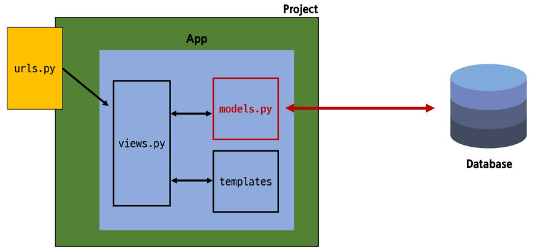

## Django Model

**DB의 테이블을 정의하고 데이터를 조작할 수 있는 기능들을 제공**

→ 테이블 구조를 설계하는 **청사진 (blueprint)**

### Model Class 작성

```python
# articles/models.py

from django.db import models

# Create your models here.
class Article(models.Model): # django.db.models 모듈의 Model이라는 부모 클래스를 상속 받음
    title = models.CharField(max_length=10)
    content = models.TextField()
```

- **작성한 모델 클래스는 최종적으로 DB에 다음과 같은 테이블 구조를 만듦**
    
    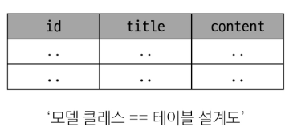
    
- **`class Article(models.Model):`**
    - **`django.db.models`** 모듈의 **`Model`**이라는 부모 클래스를 상속 받음
    - **`Model`**은 **`model`**에 관련된 모든 코드가 이미 작성되어있는 클래스
        
        → 개발자는 가장 중요한 테이블 구조를 어떻게 설계할 지에 대한 코드만 작성하도록 
            하기 위한 것 (상속을 활용한 프레임 워크의 기능 제공)
        
    
- **`title =` , `content =`**
    - Class 변수 명
        - 테이블의 각 필드(열) 이름

- **`CharField(max_length=10)` , `TextField()`**
    - Model Field
        - 데이터베이스 테이블의 열(column)을 나타내는 가장 중요한 구성 요소
        - **`데이터의 유형`**과 **`제약 조건`**을 정의

# Model Field

**DB 테이블의 필드(열)을 정의하며, 
해당 필드에 저장되는 `데이터 타입(Field Types)`과 `제약 조건(Field Options)`을 정의**

## Field Types

**데이터 베이스에 저장될 `데이터의 종류` 를 정의**

```python
class Article(models.Model): # django.db.models 모듈의 Model이라는 부모 클래스를 상속 받음
    title = models**.CharField(**max_length=10**)**
    content = models**.TextField()**
```

### 주요 필드 유형

**Django 공식 문서: https://docs.djangoproject.com/en/5.1/ref/models/fields/**

- **문자열 필드**
    - **`CharField` :** **제한된 길이의 문자열을 저장** 
                        (필드의 최대 길이를 결정하는 max_length는 필수)
    - **`TextField` : 길이 제한이 없는 대용량 텍스트를 저장**
                        (무한대는 아니며, 사용하는 시스템에 따라 달라짐)
    
- **숫자 필드**
    - **`IntegerField`**
    - **`FloatField`**
    
- **날짜/시간 필드**
    - **`DataField`**
    - **`TimeFiled`**
    - **`DataTimeField`**
    
- **파일 관련 필드**
    - **`FileField`**
    - **`ImageField`**

## Field Options

**필드의 `동작` 과 `제약 조건` 을 정의**

```python
class Article(models.Model): # django.db.models 모듈의 Model이라는 부모 클래스를 상속 받음
    title = models.CharField(**max_length=10**)
    content = models.TextField()
```

### 주요 필드 옵션

- **`null`** : 데이터베이스에서 NULL 값을 허용할지 여부를 결정 (기본 값: False)
- **`blank`** : form에서 빈 값을 허용할지 여부를 결정 (기본 값: False)
- **`default`** : 필드의 기본 값을 설정

### 제약 조건 (Constraint)

**특정 규칙을 강제하기 위해 테이블의 열이나 행에 적용되는 규칙이나 제한 사항**

→ 숫자만 저장되도록, 문자가 100자까지만 저장되도록 하는 등

# Migrations

**model 클래스의 변경 사항(필드 생성, 수정, 삭제 등)을 DB에 최종 반영하는 방법**

## Migrations 과정

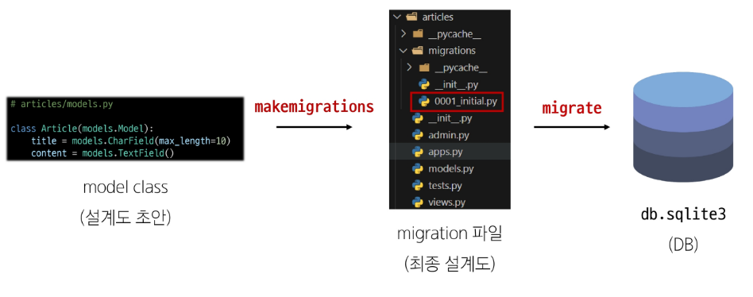

## Migrations 핵심 명령어

- **`$ python [manage.py](http://manage.py) makemigrations` :**
    
    **model class를 기반으로 최종 설계도(migration) 작성**
    

- **`$ python [manage.py](http://manage.py) migrate` :**
    
    **최종 설계도를 DB에 전달하여 반영**
    

### Migrate 후 DB 내에 생성 된 테이블 확인

**Article 모델 클래스로 만들어진 articles_article 테이블**

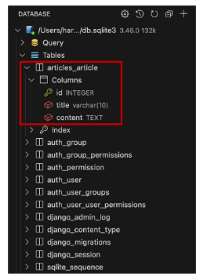

### 첫 migrate 시 출력 내용이 많은 이유

**→ Django 프로젝트가 동작하기 위해 
    미리 작성돼 있는 기본 내장 app에 대한 migration 파일들이 함께 migrate 되기 때문**

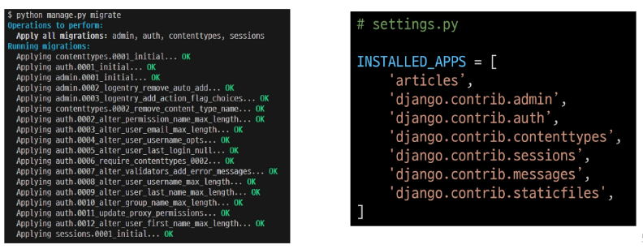

## 추가 Migrations

**이미 생성된 테이블에 필드를 추가해야 한다면?**

### 추가 모델 필드 작성

```python
# articles/models.py

from django.db import models

# Create your models here.
class Article(models.Model): # django.db.models 모듈의 Model이라는 부모 클래스를 상속 받음
    title = models.CharField(max_length=10)
    content = models.TextField()
    **create_at = models.DateTimeField(auto_now_add=True)
    updated_at = models.DateTimeField(auto_now=True)**
```

1. **`DateTimeField` 의 필드 옵션 (Optional)**
    - **`auto_now`** : **데이터가 저장될 때마다 자동으로 현재 날짜 시간을 저장**
    - **`auto_now_add`** : **데이터가 처음 생성될 때만 자동으로 현재 날짜 시간을 저장**

1. **이미 기본 테이블이 존재하기 때문에, 필드를 추가할 때 필드의 기본 값 설정이 필요**

```bash
**$ python manage.py makemigrations**

It is impossible to add the field 'created_at' with 'auto_now_add=True' to article without providing a default. This is because the database needs something to populate existing rows.
 1) Provide a one-off default now which will be set on all existing rows
 2) Quit and manually define a default value in models.py.
Select an option: 1
```

- 1번은 현재 대화를 의존하면서 직접 기본 값을 입력하는 방법
- 2번은 현재 대화에서 나간 후 models.py에 기본 값 관련 설정을 하는 방법

1. **추가하는 필드의 기본 값을 입력해야 하는 상황**

```bash
Please enter the default value as valid Python.
Accept the default 'timezone.now' by pressing 'Enter' or provide another value.
The datetime and django.utils.timezone modules are available, so it is possible to provide e.g. timezone.now as a value.
Type 'exit' to exit this prompt
[default: timezone.now] >>>
```

- 날짜 데이터이기 때문에 직접 입력하기 보다는, 
Django가 제안하는 기본 값을 사용하는 것을 권장
- 아무것도 입력하지 않고 enter를 누르면 Django가 제안하는 기본 값으로 설정됨

1. **`migrations` 과정 종료 후 2번째 `migration` 파일이 생성됨을 확인**

```bash
Migrations for 'articles':
  articles\migrations\0002_article_created_at_article_updated_at.py
    - Add field created_at to article
    - Add field updated_at to article
```

- 이처럼 Django는 설계도를 쌓아가면서 추후 문제가 생겼을 시
복구하거나 되돌릴 수 있도록 함 ( `git commit`과 유사 )

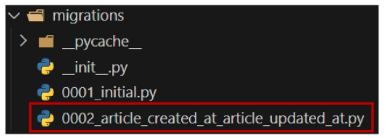

1. **`migrate` 후 테이블 필드 변화 확인**

```bash
**$ python manage.py migrate**
```

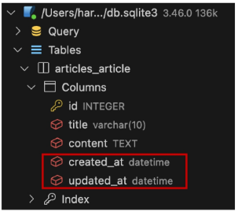

### 주의 사항

**`model class에 변경(1)이 생겼다면, 반드시 새로운 설계도를 생성(2)하고, 이를 DB에 반영(3)해야 함`**

1. **`model class 변경` → 2. `makemigrations` → 3. `migrate`**

## Automatic admin interface

**Django가 추가 설치 및 설정 없이 자동으로 제공하는 관리자 인터페이스**

→ 데이터 확인 및 테스트 등을 진행하는데 매우 유용

1. **admin 계정 생성**

```bash
**$ python manage.py createsuperuser**
Username (leave blank to use 'ssafy'):  
Email address: sj@lee.com
Password: 
Password (again):
This password is too short. It must contain at least 8 characters.
This password is too common.
This password is entirely numeric.
Bypass password validation and create user anyway? [y/N]: y
Superuser created successfully.
```

- email은 선택 사항
- 비밀번호 입력 시 보안 상 터미널에 출력 되지 않으니 무시해도 좋음

1. **DB에 생성된 admin 계정 확인**

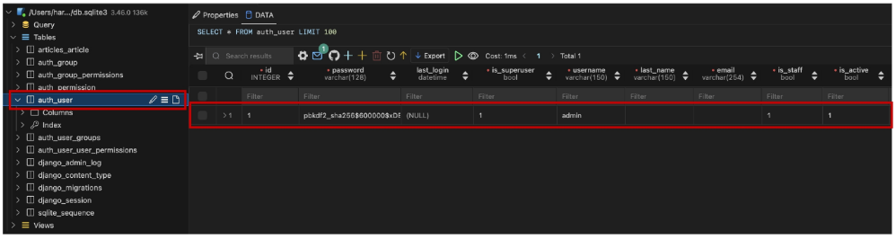

1. **admin에 모델 class 등록**

```python
from django.contrib import admin
**from .models import Article**

# Register your models here.
**admin.site.register(Article)** 
```

- `admin.py`에 작성한 모델 클래스를 등록해야만 admin site에서 확인 가능

1. **admin site 로그인 후 등록된 모델 클래스 확인**

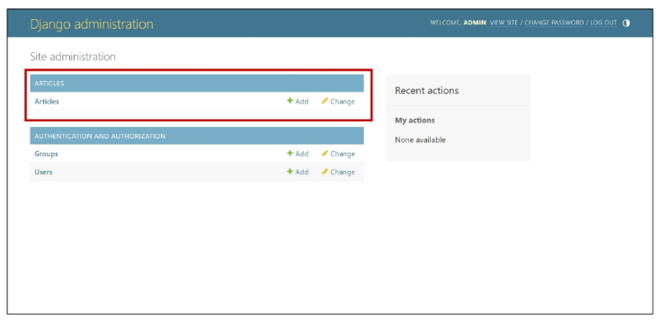

1. **데이터 생성, 수정, 삭제 테스트**

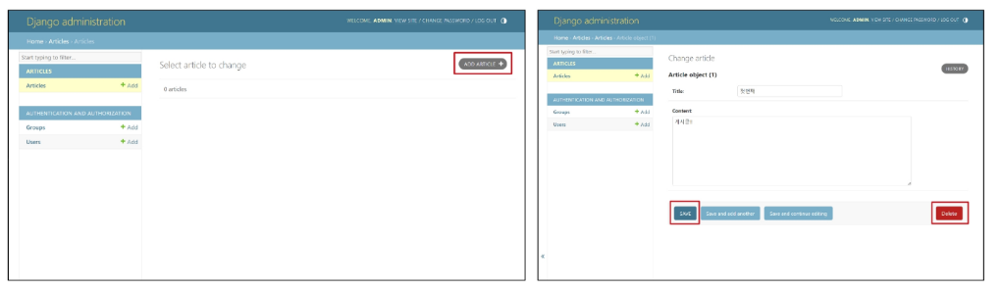

1. **테이블 확인**

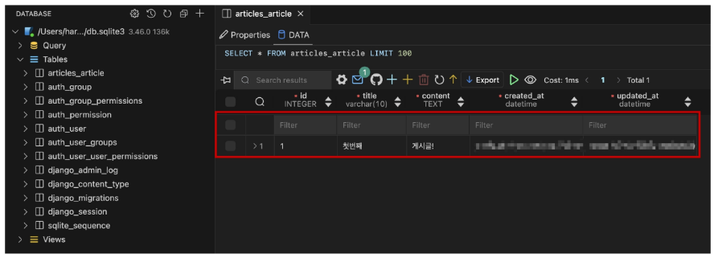

# 참고

## 데이터 베이스 초기화

1. **`migration 파일` 삭제**
2. **`db.sqlite3 파일` 삭제**
- 아래 파일과 폴더를 지우지 않도록 주의
    - **`__init__.py`**
    - **`migrations 폴더`**

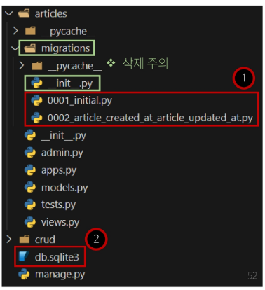

## Migrations 기타 명령어

**`$ python [manage.py](http://manage.py) showmigrations`**

- `migrations` 파일들이 `migrate` 됐는지, 안 됐는지 여부를 확인하는 명령어
- **`X` 표시가 있으면 `migrate` 가 완료**됐음을 의미

**`$ python [manage.py](http://manage.py) sqlmigrate articles 0001`**

- 해당 `migrations` 파일이 `SQL 언어(DB에서 사용하는 언어)`로 어떻게 번역 돼 
DB에 전달되는지 확인하는 명령어

## SQLite

**데이터베이스 관리 시스템 중 하나이며, Django의 기본 데이터 베이스로 사용됨**
(**파일**로 존재하며 **가볍고 호환성**이 좋음)