# ORM

**Object-Relational-Mapping**

**객체 지향 프로그래밍 언어를 사용하여 호환되지 않는 유형의 시스템 간에 데이터를 변환하는 기술**

### ORM의 역할

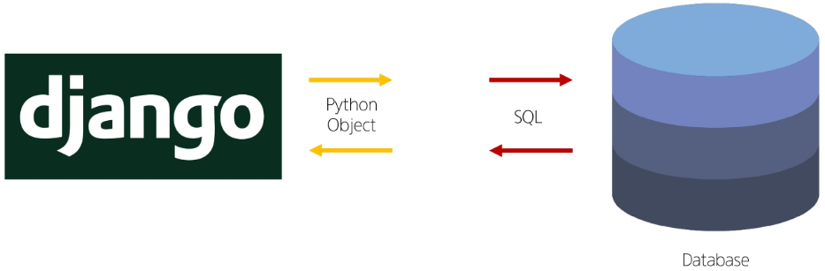

- Django와 DB간에 사용하는 언어가 다르기 때문에, 소통 불가

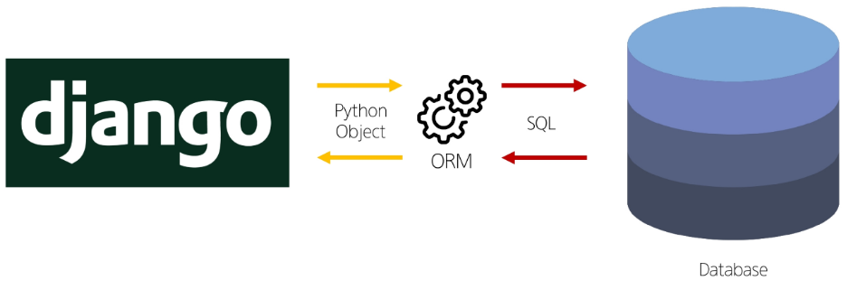

- **Django에 내장된 ORM이 중간에서 이를 해석**

# QuerySet API

**ORM에서 데이터를 검색, 필터링, 정렬 및 그룹화 하는 데 사용하는 도구**

**→ API를 사용해서 SQL이 아닌 Python 코드로 데이터를 처리**

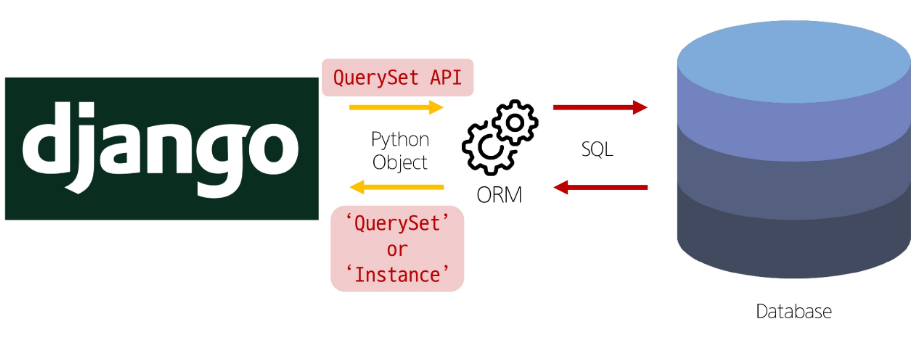

### QuerySet API 구문

```python
Article.object.all()
# Model class. Manager. Queryset API
```

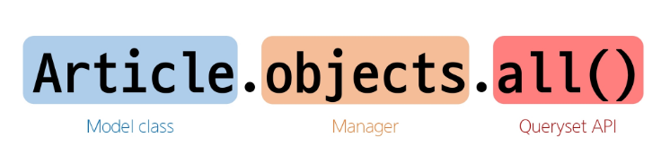

### QuerySet API 구문 동작 예시

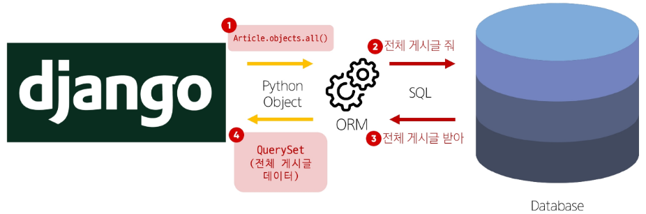

### Query

- 데이터베이스에 특정한 데이터를 보여 달라는 **요청**
- “쿼리 문을 작성한다.”
    
    → 원하는 데이터를 얻기 위해 데이터베이스에 요청을 보낼 코드를 작성한다
    
- 파이썬으로 작성한 코드가 `ORM`에 의해 `SQL`로 변환되어 데이터베이스에 전달되며,
데이터베이스의 응답 데이터를 `ORM`이 `QuerySet`이라는 자료 형태로 변환해 우리에게 전달

### QuerySet

- 데이터베이스에게서 **전달 받은 객체 목록(데이터 모음)**
    
    → **순회가 가능**한 데이터로써 **1개 이상의 데이터를 불러와 사용할 수 있음.**
    
- Django ORM을 통해 만들어진 자료형
- 데이터베이스가 단일한 객체를 반환할 때는 QuerySet이 아닌 모델(Class)의 인스턴스로 반환됨

**QuerySet API는 
Python의 모델 클래스와 인스턴스를 활용해, DB에 데이터를 저장, 조회, 수정, 삭제하는 것**

### CRUD

소프트웨어가 가지는 기본적인 데이터 처리 기능

- Create (저장)
- Read (조회)
- Update (갱신)
- Delete (삭제)

# QuerySet API 실습

## 사전 준비

### 외부 라이브러리 설치 및 설정

```bash
pip install ipython django-extensions
```

```python
# settings.py

INSTALLED_APPS = [
    'articles',
    'django_extensions',
    ...,
}
```

```bash
pip freeze > requirements.txt
```

### Django shell 실행

```bash
python manage.py shell_plus
```

**Django shell:** Django 환경 안에서 실행되는 Python shell

(입력하는 **QuerySet API 구문이 Django 프로젝트에 영향을 미침**)

## 데이터 객체 만들기

### 1.

```bash
# Article(class)로부터 article(instance) 생성
In [1]: article = Article()

In [2]: article
Out[2]: <Article: Article object (None)>

# 특정 테이블에 새로운 행을 추가해 데이터 추가
In [3]: article.title = 'first'      # 인스턴스 변수(title)에 값을 할당
In [4]: article.content = 'django!'  # 인스턴스 변수(content)에 값을 할당

In [6]: article.title
Out[6]: 'first'

In [7]: article.content
Out[7]: 'django!'

# save를 하지 않으면 아직 DB에 값이 저장되지 않음
In [9]: Article.objects.all()
Out[9]: <QuerySet []>

# save를 호출하고 저장된 것을 확인
In [10]: article.save()
In [11]: article
Out[11]: <Article: Article object (1)>

# 인스턴스 article을 활용해 인스턴스 변수 활용하기(article.title / .content / .created_at)
In [12]: article.id
Out[12]: 1

In [13]: article.pk
Out[13]: 1

In [14]: Article.objects.all()
Out[14]: <QuerySet [<Article: Article object (1)>]>
```

### 2.

```bash
In [15]: article = Article(title = 'second', content = 'django!!!')

# 아직 저장되어 있지 않음
In [16]: article
Out[16]: <Article: Article object (None)>

In [17]: article.pk

In [18]: article.id

In [19]: article.title
Out[19]: 'second'

In [20]: article.content
Out[20]: 'django!!!'

# save를 호출해야 비로서 DB에 데이터가 저장됨.
# 테이블에 한 행(레코드)이 쓰여진 것
In [21]: article.save()

In [22]: article
Out[22]: <Article: Article object (2)>

# 값 확인
In [23]: article.pk
Out[23]: 2

In [24]: Article.objects.all()
Out[24]: <QuerySet [<Article: Article object (1)>, <Article: Article object (2)>]>
```

### 3. create() 매서드 활용

```bash
# 위 2가지 방법과 달리 바로 저장 이후 바로 생성된 데이터가 반환됨
In [25]: Article.objects.create(title='third', content='django!!3!!')
Out[25]: <Article: Article object (3)>

In [26]: Article.objects.all()
Out[26]: <QuerySet [<Article: Article object (1)>, <Article: Article object (2)>, <Article: Article object (3)>]>
```

## 메서드

### 저장 메서드

- **`save()`**
    
    객체를 데이터베이스에 저장하는 인스턴스 메서드
    

### 조회 메서드

- **Return new QuerySets**
    - **`all()`**
        
        전체 데이터 조회
        
        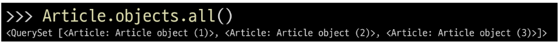
        
    
    - **`filter()`**
        
        주어진 매개 변수와 일치하는 객체를 포함하는 QuerySet 반환
        
        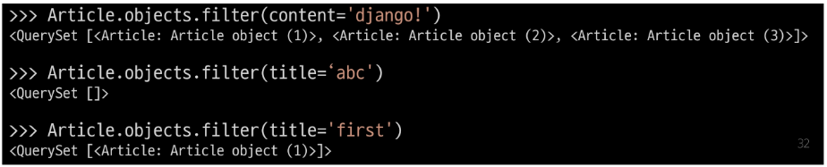
        

- **Do not return QuerySets**
    - **`get()`**
        
        주어진 매개 변수와 일치하는 객체를 반환
        
        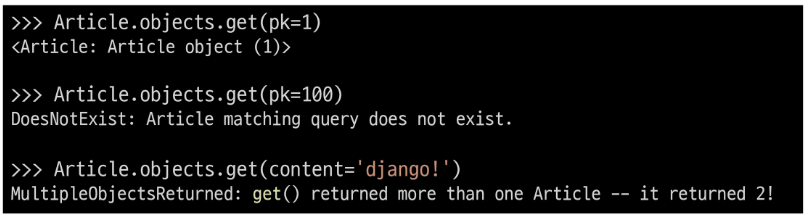
        
        - 특징
        
        ```
        **객체를 찾을 수 없으면 DoesNotExist** 예외를 발생시키고,
        **둘 이상의 객체를 찾으면 MultipleObjectsReturnded** 예외를 발생시킴
        
        위와 같은 특징을 가지고 있기 때문에  
        **primary key와 같이 고유성(uniqueness)를 보장하는 조회에서 사용**해야 함
        ```
        

[https://velog.io/@may_soouu/Django-메소드-정리](https://velog.io/@may_soouu/Django-%EB%A9%94%EC%86%8C%EB%93%9C-%EC%A0%95%EB%A6%AC)

### 데이터 수정

인스턴스 변수를 변경 후 `save()` 메서드 호출

```bash
# 수정할 인스턴스 조회
In [40]: article = Article.objects.get(pk=2)

In [41]: article
Out[41]: <Article: Article object (2)>

In [42]: article.title
Out[42]: 'second'

# 수정할 인스턴스 변수를 변경
In [43]: article.content = 'ssafy!!!!!!'

In [44]: article.content
Out[44]: 'ssafy!!!!!!'

# 저장
In [45]: article.save()
```

### 데이터 삭제

삭제하려는 데이터 조회 후 delete 메서드 호출

```bash
In [47]: article = Article.objects.get(pk=3)

In [48]: article.delete()
Out[48]: (1, {'articles.Article': 1})

In [49]: article
Out[49]: <Article: Article object (None)>

# 삭제한 데이터는 더 이상 조회할 수 없음
In [50]: Article.objects.get(pk=3)
DoesNotExist: Article matching query does not exist.
```

- 한 번 삭제된 `pk`값 (`id`) 는 다시는 재사용 되지 않음
    - 1과 2가 있는 상태에서, 2를 삭제 후 새로 생성해도 2가 아닌 3을 사용
    

# ORM with view

Django shell에서 연습했던 QuerySet API를 직접 view 함수에서 사용하기

## 전체 게시글 조회

```python
# articles/views.py

from django.shortcuts import render
from .models import Article
# 현재 디렉토리에 있는 models.py에서 Article class를 가져오기

# Create your views here.
def index(request): 
    # 게시글 전체 조회 요청 to DB
    articles = Article.objects.all()
    context = {
        'articles':articles,
    }
    return render(request, 'articles/index.html', context)
```

```html
<!-- articles/index.html -->

<!DOCTYPE html>
<html lang="en"> 
<head>
  <meta charset="UTF-8">
  <meta name="viewport" content="width=device-width, initial-scale=1.0">
  <title>Document</title>
</head>
<body>
  <h1>안녕하세요</h1>
  <p>{{ articles }}</p>
  <hr>
  
    <p>{{ article }}</p>
    <p>글 번호: {{ article.pk }}</p>
    <p>작성 일자: {{ article.created_at }}</p>
    <p>수정 일자: {{ article.updated_at }}</p>
    <p>글 제목: {{ article.title }}</p>
    <p>글 내용: {{ article.content }}</p>
    <hr>
  
</body>
</html>
```

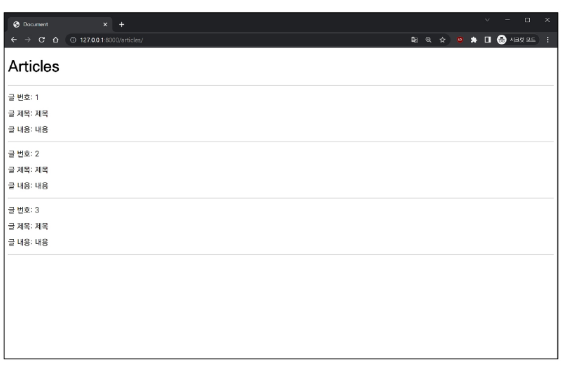

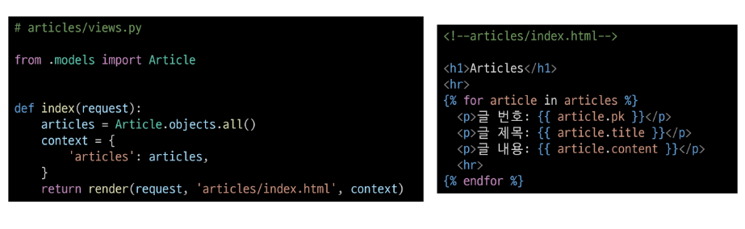

## 단일 게시글 조회

```python
# articles/urls.py

from django.urls import path
from . import views

app_name = 'articles'
urlpatterns = [
    path('', views.index, name='index'),
    path('<int:pk>/', views.detail, name='detail'),
]
```

```python
# articles/views.py

from django.shortcuts import render
# 모델 클래스 가져오기
from .models import Article

# Create your views here.
def index(request):
    # 게시글 전체 조회 요청 to DB
    articles = Article.objects.all()
    context = {
        'articles': articles,
    }
    return render(request, 'articles/index.html', context)

def detail(request, pk):
    article = Article.objects.get(pk=pk) # 왼쪽 pk는 사실 id임(id=pk) : 오른쪽 pk는 인자로 넘어온 pk
    context = {
        'article': article,
    }
    return render(request, 'articles/detail.html', context)
```

```html
<!-- templates/articles/detail.html -->

<!DOCTYPE html>
<html lang="en">
<head>
  <meta charset="UTF-8">
  <meta name="viewport" content="width=device-width, initial-scale=1.0">
  <title>Document</title>
</head>
<body>
  <h1>Detail</h1>
  <p>{{ article }}</p>
  <p>몇 번째 글: {{ article.pk }}</p>
  <p>제목: {{ article.title }}</p>
  <p>저장일: {{ article.created_at }}</p>
  <p>수정일: {{ article.updated_at }}</p>
  <p>내용: {{ article.content }}</p>
  <hr>
  <a href="">[Back]</a>
</body>
</html>
```

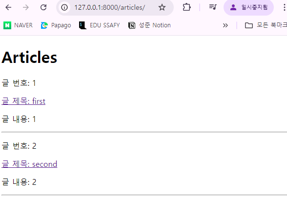


# 참고

## Field lookups

- Query에서 조건을 구성하는 방법
- QuerySet 메서드 filter(), exclude() 및 get()에 대한 키워드 인자로 지정됨

```python
# 내용에 'dja'가 포함된 모든 게시글 조회
Articles.objects.filter(content__contains='dja')

# 제목이 he로 시작하는 모든 게시글 조회
Articles.objects.filter(title__startswith='he')
```

https://docs.djangoproject.com/en/4.2/ref/models/querysets/#field-lookups

## ORM, QuerySet API를 사용하는 이유

1. 데이터베이스 추상화
    - 특정 데이터베이스 시스템에 종속되지 않고 일관된 방식으로 데이터를 다룰 수 있음
2. 생산성 향상
    - 복잡한 SQL 쿼리를 직접 작성하는 대신 Python 코드로 데이터베이스 작업을 수행 가능
3. 객체 지향적 접근
    - 데이터베이스 테이블을 Python 객체로 다룰 수 있어 객체 지향 프로그래밍의 이점을 활용할 수 있음

## Shell에서 데이터 순회하기

```bash
In [17]: book = Book() 

In [18]: book.title = '세번째 책'

In [19]: book.author = '세번째 저자'

In [20]: book.pubdate = '2024-09-23'

In [21]: book.price = 15500

In [22]: book.adult = 0

In [23]: book.save()

In [24]: books = Book.objects.all()

In [25]: for i in range(len(books)):
    ...:     print(books[i].title)
    ...:
첫번째 책
두번째 책
세번째 책
```

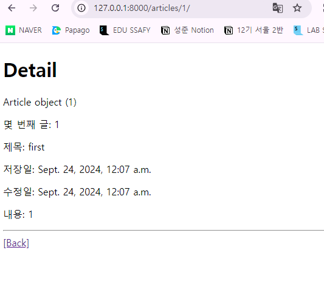