# Read

**Django shell에서 연습했던 QuerySet API를 직접 view 함수에서 사용하기**

## 전체 게시글 조회

```python
# articles/views.py

from django.shortcuts import render
from .models import Article
# 현재 디렉토리에 있는 models.py에서 Article class를 가져오기

# Create your views here.
def index(request): 
    # 게시글 전체 조회 요청 to DB
    articles = Article.objects.all()
    context = {
        'articles':articles,
    }
    return render(request, 'articles/index.html', context)
```

```html
<!-- articles/index.html -->

<!DOCTYPE html>
<html lang="en"> 
<head>
  <meta charset="UTF-8">
  <meta name="viewport" content="width=device-width, initial-scale=1.0">
  <title>Document</title>
</head>
<body>
  <h1>안녕하세요</h1>
  <p>{{ articles }}</p>
  <hr>
  
    <p>{{ article }}</p>
    <p>글 번호: {{ article.pk }}</p>
    <p>작성 일자: {{ article.created_at }}</p>
    <p>수정 일자: {{ article.updated_at }}</p>
    <p>글 제목: {{ article.title }}</p>
    <p>글 내용: {{ article.content }}</p>
    <hr>
  
</body>
</html>
```


## 단일 게시글 조회

```python
# articles/urls.py

from django.urls import path
from . import views

app_name = 'articles'
urlpatterns = [
    path('', views.index, name='index'),
    **path('<int:pk>/', views.detail, name='detail'),**
]
```

```python
# articles/views.py

from django.shortcuts import render
# 모델 클래스 가져오기
from .models import Article

# Create your views here.
def index(request):
    # 게시글 전체 조회 요청 to DB
    articles = Article.objects.all()
    context = {
        'articles': articles,
    }
    return render(request, 'articles/index.html', context)

**def detail(request, pk):
    article = Article.objects.get(pk=pk) # 왼쪽 pk는 사실 id임(id=pk) : 오른쪽 pk는 인자로 넘어온 pk
    context = {
        'article': article,
    }
    return render(request, 'articles/detail.html', context)**
```

```html
<!-- templates/articles/detail.html -->

<!DOCTYPE html>
<html lang="en">
<head>
  <meta charset="UTF-8">
  <meta name="viewport" content="width=device-width, initial-scale=1.0">
  <title>Document</title>
</head>
<body>
  <h1>Detail</h1>
  <p>{{ article }}</p>
  <p>몇 번째 글: {{ article.pk }}</p>
  <p>제목: {{ article.title }}</p>
  <p>저장일: {{ article.created_at }}</p>
  <p>수정일: {{ article.updated_at }}</p>
  <p>내용: {{ article.content }}</p>
  <hr>
  <a href="">[Back]</a>
</body>
</html>
```


# Create

### Create 로직을 구현하기 위해 필요한 view 함수의 개수는?

**`new` : 사용자 입력 데이터를 받을 페이지를 렌더링**

**`create` : 사용자가 입력한 요청 데이터를 받아 DB에 저장**

### 상세

```python
# articles/urls.py

from django.urls import path
from . import views

app_name = 'articles'
urlpatterns = [
    path('', views.index, name='index'),
    path('<int:pk>/', views.detail, name='detail'),
    **path('new/', views.new, name='new'),
    path('create/', views.create, name='create'),**
]
```

```python
# articles/views.py

from django.shortcuts import render
# 모델 클래스 가져오기
from .models import Article

# Create your views here.
def index(request):
    # 게시글 전체 조회 요청 to DB
    articles = Article.objects.all()
    context = {
        'articles': articles,
    }
    return render(request, 'articles/index.html', context)

def detail(request, pk):
    article = Article.objects.get(pk=pk) # 왼쪽 pk는 사실 id임(id=pk) : 오른쪽 pk는 인자로 넘어온 pk
    context = {
        'article': article,
    }
    return render(request, 'articles/detail.html', context)

**def new(request):
    # 게시글 작성 페이지 응답
    return render(request, 'articles/new.html')

def create(request):
    # 1. 사용자 요청으로부터 입력 데이터를 추출 (catch)
    title = request.GET.get('title')
    content = request.GET.get('content')

    # 저장 1
    # article = Article()
    # article.title = title
    # article.content = content
    # article.save()

    # 저장 2 << 2번 쓰자: 유효성 검사 고려
    article = Article(title=title, content=content)
    article.save()

    # 저장 3
    # Article.objects.create(title=title, content=content)

    # 2. 추출한 입력 데이터를 활용해 DB에 저장 요청
    return render(request, 'articles/create.html')**
```

```html
<!-- templates/articles/new.html -->

<!DOCTYPE html>
<html lang="en">
<head>
  <meta charset="UTF-8">
  <meta name="viewport" content="width=device-width, initial-scale=1.0">
  <title>Document</title>
</head>
<body>
  <h1>NEW</h1>
  <form action="" method="GET">  
    <input type="text" name='title'> 
    <textarea name="content" id=""></textarea>
    <input type="submit">
  </form>
   
  name 속성은 데이터를 전송할 때 key로 동작 
  
</body>
</html>
```

```html
<!-- templates/articles/create.html -->

<!DOCTYPE html>
<html lang="en">
<head>
  <meta charset="UTF-8">
  <meta name="viewport" content="width=device-width, initial-scale=1.0">
  <title>Document</title>
</head>
<body>
  <h1>작성이 완료되었습니다.</h1>
</body>
</html>
```

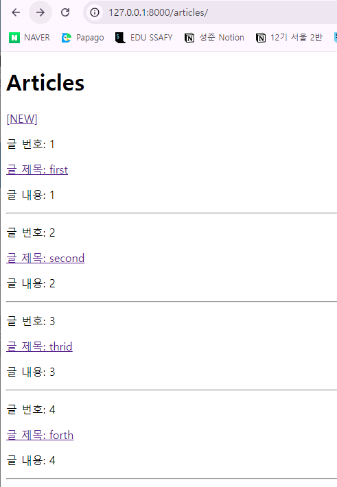

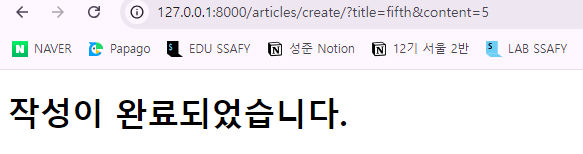

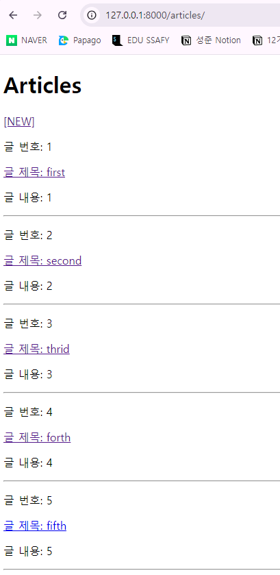

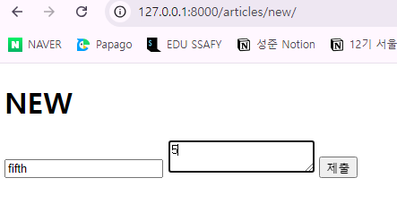

# HTTP request methods

**`http` : 네트워크 상에서 데이터(리소스)를 주고 받기 위한 약속**

## **HTTP request methods**

- 데이터에 대해 수행을 원하는 작업(행동)을 나타내는 것
    - 서버에게 원하는 작업의 종류를 알려주는 역할
- 클라이언트가 웹 서버에 특정 동작을 요청하기 위해 사용하는 표준 명령어
- 대표 메서드: `GET` , `POST`

### `GET` method

**서버로부터 데이터를 요청하고 받아오는데(조회) 사용**

**특징**

1. **데이터 전송**
    - URL의 쿼리 문자열(Query String)을 통해 데이터를 전송
    - [http://http//127.0.0.1:8000/articles/create/?title=제목&content=내용](http://http//127.0.0.1:8000/articles/create/?title=%EC%A0%9C%EB%AA%A9&content=%EB%82%B4%EC%9A%A9)
2. **데이터 제한**
    - URL 길이에 제한이 있어 대량의 데이터 전송에는 적합하지 않음
3. **브라우저 히스토리**
    - 요청 URL이 브라우저 히스토리에 남음
4. **캐싱**
    - 브라우저는 GET 요청의 응답을 로컬에 저장할 수 있음
    - 동일한 URL로 다시 요청할 때, 서버에 접속하지 않고 저장된 결과를 사용
    - 페이지 로딩 시간을 크게 단축

**사용 예시**

- 검색 쿼리 전송
- 웹 페이지 요청
- API에서 데이터 조회

### `POST` method

**서버에 데이터를 제출하여 리소스를 변경(생성, 수정, 삭제) 하는 데 사용**

**특징**

1. **데이터 전송**
    - HTTP Body를 통해 데이터를 전송
2. **데이터 제한**
    - GET에 비해 더 많은 양의 데이터를 전송할 수 있음
3. **브라우저 히스토리**
    - POST 요청은 브라우저 히스토리에 남지 않음
4. **캐싱**
    - POST 요청은 기본적으로 캐시할 수 없음
    - POST 요청이 일반적으로 서버의 상태를 변경하는 작업을 수행하기 때문

**사용 예시**

- 로그인 정보 제출
- 파일 업로드
- 새 데이터 생성 (ex: 새 게시글 작성)
- API에서 데이터 변경 요청

### `GET` & `POST`

- `GET`과 `POST`는 각각의 특성에 맞게 적절히 사용해야 함
- `GET` : 데이터 조회
- `POST` : 데이터 생성 or 수정

### POST 메서드 적용

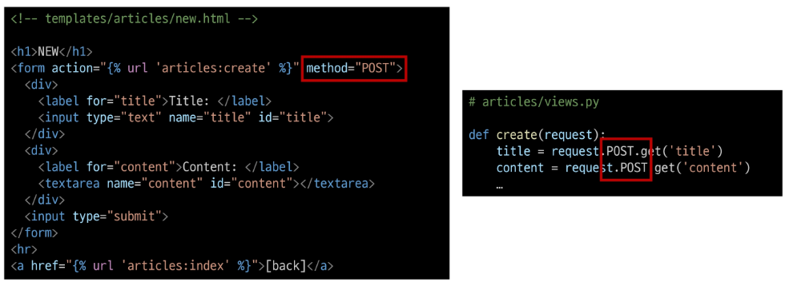

**→ 작성하면 403 Error 발생**

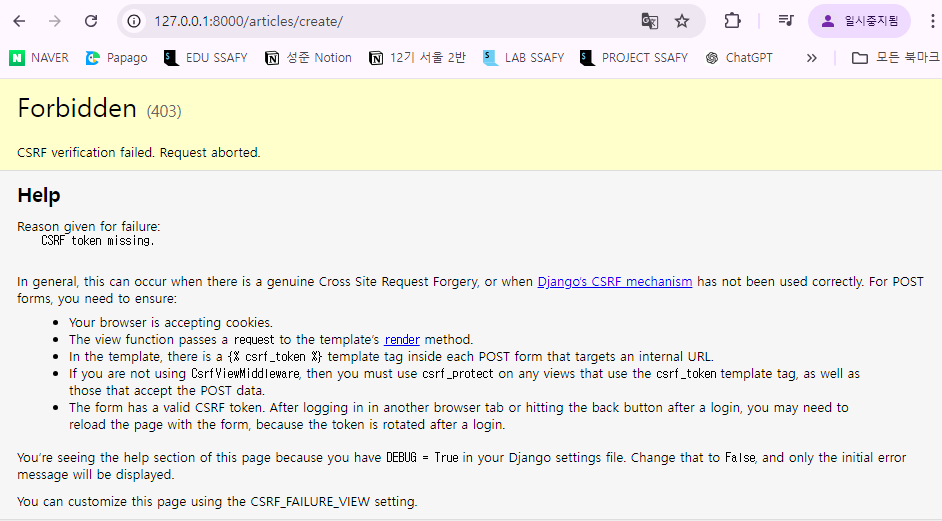

**거절 이유: `CSRF token`이 누락되었다**

# HTTP response status code

**서버가 클라이언트의 요청에 대한 처리 결과를 나타내는 3자리 숫자**

## 역할

- 클라이언트에게 요청 처리 결과를 명확히 전달
- 문제 발생 시 디버깅에 도움
- 웹 애플리케이션의 동작을 제어하는데 사용

### 403 Forbidden

**서버에 요청이 전달되었지만, 권한 때문에 거절되었다는 것을 의미**

## CSRF

**Cross-Site-Request-Forgery**

**사이트 간 요청 위조**

**→ 사용자가 자신의 의지와 무관하게 공격자가 의도한 행동을 하여
특정 웹 페이지를 보안에 취약하게 하거나, 수정, 삭제 등의 작업을 하게 만드는 공격 방법**

### CSRF Token 적용

- DTL의 **`csrf_token`** 태그를 사용해 사용자에게 손쉽게 토큰 값을 부여
- 요청 시 토큰 값도 함께 서버로 전송될 수 있도록 하는 것

```html
<!DOCTYPE html>
<html lang="en">
<head>
  <meta charset="UTF-8">
  <meta name="viewport" content="width=device-width, initial-scale=1.0">
  <title>Document</title>
</head>
<body>
  <h1>NEW</h1>
  <form action="" method="**POST**">  
    ** <<<<<<<**
    <input type="text" name='title'> 
    <textarea name="content" id=""></textarea>
    <input type="submit">
  </form>
   
  name 속성은 데이터를 전송할 때 key로 동작 
  
</body>
</html>
```


### 요청 시 CSRF Token을 함께 보내야 하는 이유

- Django 서버는 해당 요청이 DB에 데이터를 하나 생성하는(**DB에 영향을 주는) 요청에 대해**
**’Django가 직접 제공한 페이지에서 데이터를 작성하고 있는 것인지’에 대한 확인 수단 필요**
- 겉모습이 똑같은 위조 사이트나 **정상적이지 않은 요청에 대한 방어 수단**
- **기존:**
    - 요청 데이터 → 게시글 작성
- **변경:**
    - 요청 데이터 + 인증 토큰 → 게시글 작성

### POST일 때만 Token을 확인하는 이유

- POST는 단순 조회를 위한 `GET`과 달리
**특정 리소스에 변경(생성, 수정, 삭제)을 요구하는 의미**와 **기술적인 부분**을 가지고 있기 때문
- **DB에 조작**을 가하는 요청은 반드시 **인증 수단**이 필요
    
    **→ 데이터베이스에 대한 변경 사항을 만드는 요청이기 때문에
        토큰을 사용해 최소한의 신원 확인을 하는 것**
    

### 게시글 작성 결과

- 게시글 생성 후 개발자 도구를 사용해 Form Data가 전송되는 것 확인
    
    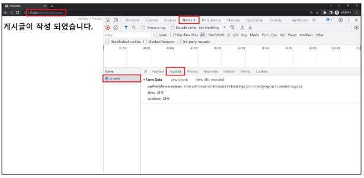
    
- 더 이상 **URL에 Query String 형태로 보냈던 데이터가 표기되지 않음**
    - **`GET`**
        
        
        
    - **`POST`**
        
        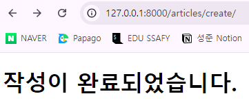
        

# Redirect

**`현재`: 게시글 작성 후 완료를 알리는 페이지가 응답되는 상황**

→ 게시글을 조회하는 것이 아닌, 작성 요청이기 때문에, 
    게시글 저장 후 페이지를 응답하는 것은 POST 요청에 대한 적절한 응답이 아님

**→ 서버는 데이터 저장 후 페이지를 응답하는 것이 아닌 사용자를 적절한 기존 페이지로 보내야 함**

‘사용자를 보낸다’ → ‘사용자가 GET 요청을 한 번 더 보내도록 해야 한다’
* 실제로 서버가 클라이언트를 직접 다른 페이지로 보내는 것이 아닌
클라이언트가 GET 요청을 한 번 더 보내도록 응답하는 것

## `redirect()`

**클라이언트가 인자에 작성된 주소로 다시 요청을 보내도록 하는 함수**

### `redirect()` 함수 적용

```python
# articles/views.py

from django.shortcuts import render, **redirect**
# 모델 클래스 가져오기
from .models import Article

def create(request):
    # 1. 사용자 요청으로부터 입력 데이터를 추출 (catch)
    title = request.POST.get('title')
    content = request.POST.get('content')
    article = Article(title=title, content=content)
    article.save()

    **# 방금 생성한 게시글로 리다이렉트
    return redirect('articles:detail', article.pk) 
    
    # 메인 페이지로 가는 리다이렉트
    # return redirect('articles:index')** 
```

### `redirect()` 동작 원리

1. redirect 응답을 받은 클라이언트는 **detail url로 다시 요청을 보내게 됨**
2. 결과적으로 **detail view 함수가 호출되어 detail view 함수의 반환 결과인 detail 페이지를 응답**
    
    → 결국 사용자는 게시글 작성 후 작성된 게시글의 detail 페이지로 이동하는 것으로 느낌
    

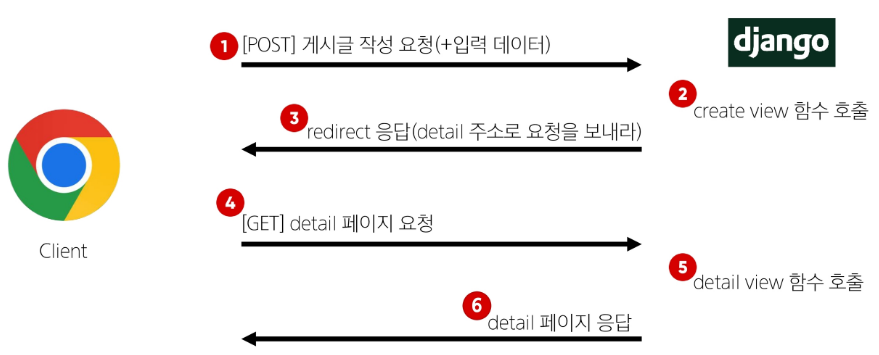

### 게시글 작성 결과

- 게시글 작성 후 생성된 게시글의 detail 페이지로 redirect 되었는지 확인
- **create 요청 이후에 detail로 다시 요청을 보냈다**는 것을 알 수 있음
    
    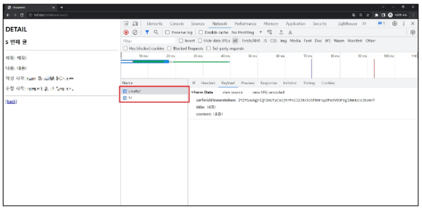
    

# Delete

### Delete 기능 구현

**삭제, 수정은 조회가 우선되어야 하기 때문에 variable routing이 필요**

```python
# articles/urls.py

from django.urls import path
from . import views

app_name = 'articles'
urlpatterns = [
    path('', views.index, name='index'),
    path('<int:pk>/', views.detail, name='detail'),
    path('new/', views.new, name='new'),
    path('create/', views.create, name='create'),
    **path('<int:pk>/delete/', views.delete, name='delete'),**
]
```

```python
# articles/views.py

from django.shortcuts import render, **redirect**
# 모델 클래스 가져오기
from .models import Article

# Create your views here.
**def delete(request, pk):
    # 어떤 게시글 삭제할지 조회
    article = Article.objects.get(pk=pk)

    # 조회한 게시글 삭제 후 메인페이지로 리다이렉트
    article.delete()
    return redirect('articles:index')**
```

```html
<!-- templates/articles/detail.html -->

<!DOCTYPE html>
<html lang="en">
<head>
  <meta charset="UTF-8">
  <meta name="viewport" content="width=device-width, initial-scale=1.0">
  <title>Document</title>
</head>
<body>
  <h1>Detail</h1>
  <p>{{ article }}</p>
  <p>몇 번째 글: {{ article.pk }}</p>
  <p>제목: {{ article.title }}</p>
  <p>저장일: {{ article.created_at }}</p>
  <p>수정일: {{ article.updated_at }}</p>
  <p>내용: {{ article.content }}</p>
  <hr>
  ** POST 요청은 form밖에 못함 (a는 GET) 
  <form action="" method="POST">
    
    <input type="submit" value="삭제">
  </form>**
  <a href="">[Back]</a>
</body>
</html>
```

# Update

### Update 로직을 구현하기 위해 필요한 view 함수의 개수는?

**`edit` : 사용자 입력 데이터를 받을 페이지를 렌더링**

**`update` : 사용자가 입력한 데이터를 받아 DB에 저장**

## Update  구현

**삭제, 수정은 조회가 우선되어야 하기 때문에 variable routing이 필요**

```python
# articles/urls.py

from django.urls import path
from . import views

app_name = 'articles'
urlpatterns = [
    path('', views.index, name='index'),
    path('<int:pk>/', views.detail, name='detail'),
    path('new/', views.new, name='new'),
    path('create/', views.create, name='create'),
    path('<int:pk>/delete/', views.delete, name='delete'),
    **path('<int:pk>/edit/', views.edit, name='edit'),
    path('<int:pk>/update/', views.update, name='update'),**
]

```

```python
**# articles/views.py**

from django.shortcuts import **render, redirect**
# 모델 클래스 가져오기
from .models import Article

# Create your views here.
**def edit(request, pk):
    # 어떤 게시글 수정할지 조회
    article = Article.objects.get(pk=pk)
    context = {
        'article': article,
    }
    return render(request, 'articles/edit.html', context)

def update(request, pk):
    # 1. 어떤 게시글 수정할지 조회
    article = Article.objects.get(pk=pk)

    # 2. 사용자로부터 받은 새로운 입력 데이터 추출
    title = request.POST.get('title')
    content = request.POST.get('content')

    # 3. 기존 게시글의 데이터를 사용자로 받은 데이터로 새로 할당
    article.title = title
    article.content = content

    # 4. 저장
    article.save()

    # 5. 수정한 페이지로 리다이렉트
    return redirect('articles:detail', article.pk)**
```

```html
<!-- templates/articles/detail.html -->

<!DOCTYPE html>
<html lang="en">
<head>
  <meta charset="UTF-8">
  <meta name="viewport" content="width=device-width, initial-scale=1.0">
  <title>Document</title>
</head>
<body>
  <h1>Detail</h1>
  <p>{{ article }}</p>
  <p>몇 번째 글: {{ article.pk }}</p>
  <p>제목: {{ article.title }}</p>
  <p>저장일: {{ article.created_at }}</p>
  <p>수정일: {{ article.updated_at }}</p>
  <p>내용: {{ article.content }}</p>
  <hr>
   POST 요청은 form밖에 못함 (a는 GET) 
  <form action="" method="POST">
    
    <input type="submit" value="삭제">
  </form>
  **<form action="" method="POST">
    
    <input type="submit" value="수정">
  </form>**
  <a href="">[Back]</a>
</body>
</html>
```

```html
<!-- templates/articles/edit.html -->

<!DOCTYPE html>
<html lang="en">
<head>
  <meta charset="UTF-8">
  <meta name="viewport" content="width=device-width, initial-scale=1.0">
  <title>Document</title>
</head>
**<body>
  <h1>EDIT</h1>
  <form action="" method="POST">  
    
    <input type="text" name='title' value={{ article.title }}> 
    <textarea name="content" id="">{{ article.content }}</textarea>
    <input type="submit" value="수정">
  </form>
</body>**
</html>
```

# 참고

## `GET` & `POST`

|  | GET | POST |
| --- | --- | --- |
| 데이터 전송 방식 | URL의 **Query string parameter** | **HTTP body** |
| 데이터 크기 제한 | 브라우저 제공 URL의 최대 길이 | 제한 없음 |
| 사용 목적 | 데이터 검색 및 조회 | 데이터 제출 및 변경 |

## `GET` 요청이 필요한 경우

- **캐싱 및 성능**
    - GET 요청은 캐시(Cache)될 수 있고, 이전에 요청한 정보를 새로 요청하지 않고 사용 가능
    - 동일한 검색 결과를 여러 번 요청하는 경우 GET 요청은 캐시를 활용해 더 빠르게 응답 가능
- **가시성 및 공유**
    - GET 요청은 URL에 데이터가 노출되어 있기 때문에
    사용자가 해당 URL을 북마크하거나 다른 사람과 공유하기 용이
- **RESTful API 설계**
    - HTTP 메서드의 의미에 따라 동작하도록 디자인된 API의 일관성을 유지할 수 있음

## HTTP request methods를 활용한 효율적인 URL 구성

동일한 URL 한 개로 method에 따라 서버에 요구하는 행동을 다르게 요구 (Restful API에서 재등장)

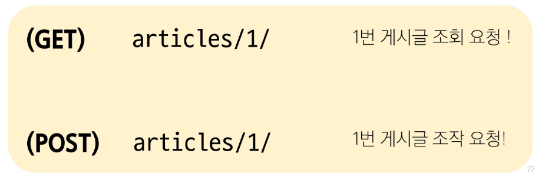

### 실제 활용 예시

TMDB API 가이드 문서 예시

https://developer.themoviedb.org/reference/intro/getting-started

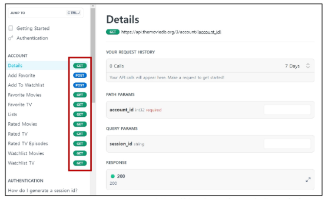

## 캐시(Cache)

- 데이터나 정보를 임시로 저장해두는 메모리나 디스크 공간
- 이전에 접근한 데이터를 빠르게 검색하고 접근할 수 있도록 함