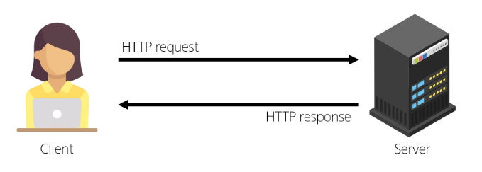
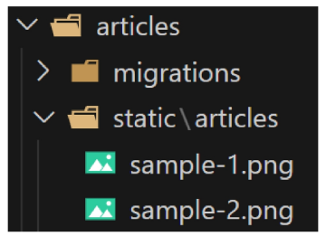
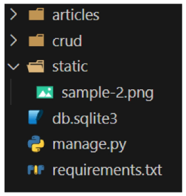
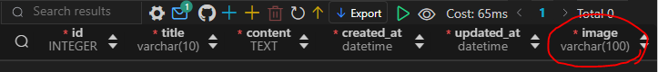
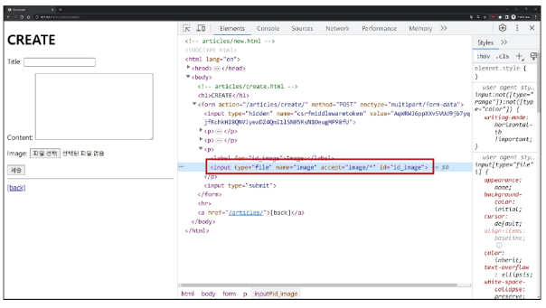
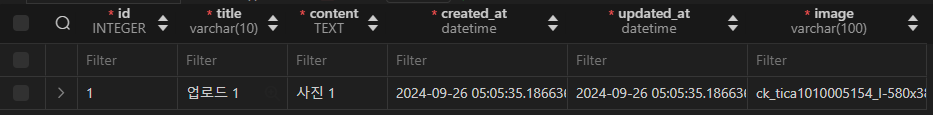
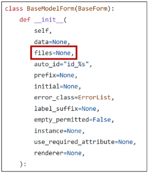

# Stactic Files

**정적 파일**

서버 측에서 변경되지 않고 고정적으로 제공되는 파일 (이미지, JS, CSS)

## Static files 제공하기

### 웹 서버와 정적 파일

- 웹 서버의 기본 동작은 **특정 위치(URL)에 있는 자원을 요청(HTTP reqeust) 받아서**
**응답 (HTTP response)을 처리하고 제공하는 것**
- 이는 ‘**자원에 접근 가능한 주소가 있다**’는 의미
- **웹 서버는 요청 받은 URL로 서버에 존재하는 정적 자원을 제공**함
    
    **→ 정적 파일을 제공하기 위한 경로(URL)가 있어야 함**
    
    
    

## Static files 경로

### 기본 경로

**`app폴더/static/`**

- **예시**
    - `articles/static/articles/` 경로에 이미지 파일 배치



**`Static tag` :**

- static files 경로는 DTL의 **`static tag`를 사용해야 함**
- built-in tag가 아니기 때문에 **`load tag`를 사용해 import 후 사용 가능**

- **주의 사항:**
    - **상속 구조가 우선 되어야 함**
    - `base.html`에 load 하더라도 자식 템플릿에 적용되지 않음 → **문서마다 직접 달아야 함**
    
    ```html
     
    ****
    
    
      ****
    
    ```
    

**`STATIC_URL` :**

**기본 경로 및 추가 경로에 위치한 정적 파일을 참고하기 위한 URL**

→ **실제 파일이나 디렉토리 경로가 아니며, URL로만 존재**

```python
# settings.py

STATIC_URL = 'static/'
```

```
**http://127.0.0.1:8000/static/articles/sample-1.png
URL + STATIC_URL + 정적파일 경로** 
```

### 추가 경로

**`settings.py/STATICFILES_DIRS`에 문자열 값으로 추가 경로 설정**

**`STATICFILES_DIRS` :** 

**정적 파일의 기본 경로 외에 추가적인 경로 목록을 정의하는 리스트**

```python
# settings.py

STATICFILES_DIRS = [
    # Python 객체지향 경로 시스템
    BASE_DIR / 'static',
]
```

**추가 경로에 이미지 파일 배치**



`static tag` 를 사용해 이미지 파일에 대한 경로 제공

```html
  
****


    ****

```

```
**http://127.0.0.1:8000/static/sample-2.png** 
```

### 정적 파일을 제공하려면 요청에 응답하기 위한 URL이 필요

# Media Files

**사용자가 웹에서 업로드하는 정적 파일 (user-uploaded files)**

## 이미지 업로드

**`ImageField()` : 이미지 업로드에 사용하는 모델 필드**

**→ 이미지 객체가 직접 DB에 저장되는 것이 아닌, ‘이미지 파일의 경로’ 문자열이 저장됨**



### 미디어 파일을 제공하기 전 준비사항

1. **settings.py에 `MEDIA_ROOT`, `MEDIA_URL` 설정**
2. **작성한 `MEDIA_ROOT`와 `MEDIA_URL`에 대한 URL 설정**

**`MEDIA_ROOT` : 미디어 파일들이 위치하는 디렉토리의 절대 경로**

```python
# settings.py

MEDIA_ROOT = BASE_DIR / 'media'
```

**`MEDIA_URL` :** 

**`MEDIA_ROOT` 에서 제공되는 미디어 파일에 대한 주소를 생성 (`STATIC_URL`과 동일한 역할)**

**`STATIC_URL` 은 미리 배치된 파일에 대한 경로를 생성한다면**
**`MEDIA_URL` 은 사용자가 업로드한 파일에 대한 경로 생성**

```python
# settings.py

MEDIA_URL = 'media/'
```

### `MEDIA_ROOT`와 `MEDIA_URL`에 대한 URL 지정

**업로드된 파일의 URL:  `settings.MEDIA_URL`**

**MEDIA_URL을 통해 참조하는 파일의 실제 위치: `settings.MEDIA_ROOT`**

```python
# crud/urls.py << 프로젝트의 urls.py

**from django.conf import settings
from django.conf.urls.static import static**

urlpatterns = [
    path('admin/', admin.site.urls),
    path('articles/', include('articles.urls')),
] **+ static(settings.MEDIA_URL, document_root=settings.MEDIA_ROOT)**
  **# static(URL 주소, 미디어 파일의 실제 위치)**
```

### 이미지 업로드

```python
# articles/models.py

from django.db import models

# Create your models here.
class Article(models.Model):
    title = models.CharField(max_length=10)
    content = models.TextField()
    **image = models.ImageField(blank=True)** 
    created_at = models.DateTimeField(auto_now_add=True)
    updated_at = models.DateTimeField(auto_now=True)
    **# 기존 필드 사이에 작성해도 실제 테이블 생성 시에는 가장 우측(뒤)에 추가됨**
```

- **`blank=True` 속성을 작성해 빈 문자열이 저장될 수 있도록 제약 조건 설정**
    
    → 게시글 작성 시 **이미지 업로드 없이도 작성할 수 있도록 하기 위함**
    

### `Migration` 진행

```bash
**$ pip install pillow**

$ python manage.py migrate
$ python manage.py migrate

$ pip freeze > requirements.txt
```

- **ImageField를 사용하려면 반드시 Pillow 라이브러리가 필요**

### `form` 요소의 `enctype` 속성 추가

```html
<!-- articles/create.html -->

<!DOCTYPE html>
<html lang="en">
<head>
  <meta charset="UTF-8">
  <meta name="viewport" content="width=device-width, initial-scale=1.0">
  <title>Document</title>
</head>
<body>
  <h1>Create</h1>
  **<form action="" method="POST" enctype="multipart/form-data">**
    
    {{ form.as_p }}
    <input type="submit">
  </form>
</body>
</html>

```

- **`enctype`은 데이터 전송 방식을 결정하는 속성**
    - 인코딩 타입의 기본 값으로는 파일을 전송할 수 없음

### ModelForm의 2번째 인자로 요청 받은 파일 데이터 작성

```python
# articles/views.py

from django.shortcuts import render, redirect
from .models import Article
from .forms import ArticleForm

def create(request):
    if request.method == 'POST':
        # 파일 데이터는 request.POST에 담기지 않음
        **form = ArticleForm(request.POST, request.FILES)**
        if form.is_valid():
            article = form.save()
            return redirect('articles:detail', article.pk)
    else:
        form = ArticleForm()
    context = {
        'form': form,
    }
    return render(request, 'articles/create.html', context)
```

- **`ModelForm`의 상위 클래스 `BaseModelForm`의 생성자 함수의 2번째 위치 인자로 
파일을 받도록 설정되어 있음**

### 이미지 업로드 input 확인



### 이미지 업로드 결과 확인



## 업로드 이미지 제공

- **`url` 속성을 통해 업로드 파일의 경로 값을 얻을 수 있음**
- **`article.image.url` : 업로드 파일의 경로**
- **`article.image`        : 업로드 파일의 파일 이름**

- 이미지를 업로드하지 않은 게시물은 detail 템플릿을 렌더링 할 수 없음
- 이미지 데이터가 있는 경우에만 이미지를 출력할 수 있도록 처리
    
    ```html
    <!-- articles.detail.html -->
    
    <!DOCTYPE html>
    <html lang="en">
    <head>
      <meta charset="UTF-8">
      <meta name="viewport" content="width=device-width, initial-scale=1.0">
      <title>Document</title>
    </head>
    <body>
      **
        
      **
      <h1>Detail</h1>
      <h3>{{ article.pk }}번째 글</h3>
      <hr>
      <p>제목: {{ article.title }}</p>
      <p>내용: {{ article.content }}</p>
      <p>작성일: {{ article.created_at }}</p>
      <p>수정일: {{ article.updated_at }}</p>
      <hr>
      <a href="">수정</a><br>
      <form action="" method="POST">
        
        <input type="submit" value="삭제">
      </form>
      <a href="">[back]</a>
    </body>
    </html>
    ```
    

## 업로드 이미지 수정

### 수정 페이지 `form` 요소에 `enctype` 속성 추가

```html
<!-- articles/update.html -->

<!DOCTYPE html>
<html lang="en">
<head>
  <meta charset="UTF-8">
  <meta name="viewport" content="width=device-width, initial-scale=1.0">
  <title>Document</title>
</head>
<body>
  <h1>Update</h1>
  **<form action="" method="POST" enctype="multipart/form-data">**
    
    {{ form.as_p }}
    <input type="submit" value="수정">
  </form>
  <hr>
  <a href="">[back]</a>
</body>
</html>
```

### `update view` 함수에서 업로드 파일에 대한 추가 코드 작성

```python
# articles/views.py

from django.shortcuts import render, redirect
from .models import Article
from .forms import ArticleForm

def update(request, pk):
    article = Article.objects.get(pk=pk)
    if request.method == 'POST':
        **form = ArticleForm(request.POST, request.FILES, instance=article)**
        if form.is_valid():
            form.save()
            return redirect('articles:detail', article.pk)
    else:
        form = ArticleForm(instance=article)
    context = {
        'article': article,
        'form': form,
    }
    return render(request, 'articles/update.html', context)
```

# 참고

## `upload_to`

- `ImageField()` 의 `upload_to` 속성을 사용해 다양한 추가 경로 설정
- 

```python
# articles/models.py

from django.db import models

# Create your models here.
class Article(models.Model):
		# 1. 기본 경로 설정 (media 루트 이후로의 경로: 없을 경우 새 폴더 생성)
    image = models.ImageField(blank=True, upload_to='images/')
    
    # 2. 업로드 날짜로 경로 설정 (media 루트 이후에 날짜별로 폴더 생성)
    image = models.ImageField(blank=True, upload_to='%Y/%m/%d/')
    
    # 3. 함수 형식으로 경로 설정
    image = models.ImageField(blank=True, upload_to=articles_image_path)
    
    
    def articles_images_path(instance, filename):
		    return f'images/{instance.user.username}/{filename}'
```

## `request.FILES` 가 2번째 위치 인자인 이유

- `ModelForm` 의 상위 클래스 `BaseModelForm` 의 생성자 함수 키워드 인자 참고
    
    
    

NoReverseMatch : 

url만 확인하자 (url, views.py, 인자)

NOT NULL CONSTRAINT:

db는 Null값을 받지 않도록 하는 제약이 있음:

위 에러가 발생하면 데이터를 보내고 있지 않거나 (input의 name 실종), 
서버가 모르는 이름으로 보낼 때(name의 key 값이 틀리거나)