# Template System

## Django Template System

**데이터 표현을 제어하면서, 표현과 관련된 부분을 담당**

### HTML의 콘텐츠를 변수 값에 따라 변경하기

```html
<!-- articles/index.html -->

<body>
  <h1>안녕하세요! {{ name }}</h1>
</body>
```

```python
# articles/views/py

# Create your views here.
def index(request):
    context = {
        'name': 'alice',
    }
    return render(request, 'articles/index.html', context)
```

## Django Template Language (DTL)

**Template에서 조건, 반복, 변수 등의 프로그래밍적 기능을 제공하는 시스템**

### DTL Syntax

**Variable**

- render 함수의 3번째 인자로 딕셔너리 데이터를 사용
- 딕셔너리 key에 해당하는 문자열이 template에서 사용 가능한 변수명이 됨
- dot **** **`.`** 을 사용해 변수 속성에 접근할 수 있음
    - **`{{ variable }}` , `{{ variable.attribute }}` ←** 딕셔너리 안에 또 딕셔너리가 있다던가 등..

**Filters**

- 표시할 변수를 수정할 때 사용 (변수 + | + 필터)
- chained(연결)이 가능하며 일부 필터는 인자를 받기도 함
- 약 60개의 built-in template filters를 제공
    - **`{{ variable|filter }}` , `{{ name|truncatewords:30 }}` ←** 30자까지 문자열을 자른다.

**Tags**

- 반복 또는 논리를 수행하여 제어 흐름을 만듦
- 일부 태그는 시작과 종료 태그가 필요
- 약 24개의 built-in template tags를 제공
    - **`` , `` , ``**

**Comments**

- DTL에서의 주석
    
    **`{# name #}` , ` .. `**
    

# Template 상속

### 기본 템플릿 구조의 한계

- **만약 모든 템플릿에 bootstrap을 적용하려면?**
    
    → 모든 템플릿에 bootstrap CDN을 작성해야 할까?
    

## 템플릿 상속 (Template Inheritance)

**페이지의 공통 요소를 포함, 하위 템플릿이 재정의 할 수 있는 공간을 정의하는, 기본 `skeleton` 템플릿을 
작성하여 상속 구조를 구축**

## 상속 구조 만들기

### **base.html**

skeleton 역할을 하게 되는 상위 템플릿 

```html
<!-- articles/base.html -->

<!DOCTYPE html>
<html lang="en">
<head>
  <meta charset="UTF-8">
  <meta name="viewport" content="width=device-width, initial-scale=1.0">
  <title>Document</title>
  <link href="https://cdn.jsdelivr.net/npm/bootstrap@5.3.3/dist/css/bootstrap.min.css" rel="stylesheet" integrity="sha384-QWTKZyjpPEjISv5WaRU9OFeRpok6YctnYmDr5pNlyT2bRjXh0JMhjY6hW+ALEwIH" crossorigin="anonymous">
</head>
<body>
  
  
  <script src="https://cdn.jsdelivr.net/npm/bootstrap@5.3.3/dist/js/bootstrap.bundle.min.js" integrity="sha384-YvpcrYf0tY3lHB60NNkmXc5s9fDVZLESaAA55NDzOxhy9GkcIdslK1eN7N6jIeHz" crossorigin="anonymous"></script>
</body>
</html>
```

### **기존 하위 Template**

```html
<!-- articles/index.html -->




  <h1>안녕하세요! {{ name }}</h1>

```

```html
<!-- articles/dinner.html -->

**

**
  <h1>Dinner</h1>
  <p>{{ picked }} 메뉴는 {{ picked|length }}글자 입니다.</p>
  <p>{{ foods }}</p>
  <ul>
    
    <li>{{ food }}</li>
    
  </ul>

  
    <p>메뉴가 소진 되었습니다.</p>
  
    <p>아직 주문이 가능합니다.</p>
  

```

## 상속 관련 DTL 태그

### `extends`

**``**

**자식(하위) 템플릿이 부모 템플릿을 확장한다는 것을 알림**

- 반드시 자식 템플릿 최상단에 작성되어야 함
- 2개 이상 사용 불가

### **`block`**

**`` ``**

**하위 템플릿에서 재정의 할수 있는 블록을 정의**

- 상위 템플릿에 작성하며, 하위 템플릿이 작성할 수 있는 공간을 지정하는 것

# HTML form

## 요청과 응답

### 데이터를 보내고 가져오기

**HTML ‘form’ element를 통해 사용자와 애플리케이션 간의 상호작용 이해하기**

**HTML ‘form’은 HTTP 요청을 서버에 보내는 가장 편리한 방법**

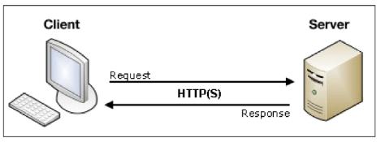


### 실제 웹 서비스에서 form이 사용되는 예시

네이버 & 구글의 로그인 화면에서 사용하는 HTML form 요소

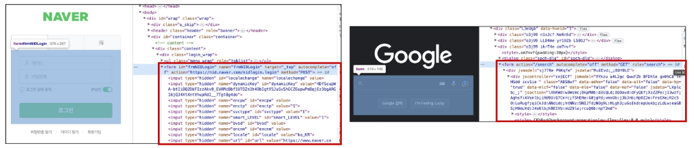

## `form` Element

사용자로부터 할당된 데이터를 서버로 전송

→ 웹에서 사용자 정보를 입력하는 여러 방식

[text, password, checkbox 등을 제공]

### fake Naver 실습

```python
# urls.py

urlpatterns = [
    path("admin/", admin.site.urls),
    path('index/', views.index),
    path('dinner/', views.dinner),
    path('search/', views.search)
]
```

```python
views.py

def search(request):
    return render(request, 'articles/search.html')
```

```html
<!-- articles/search.html -->




  <h1>Fake Naver</h1>
  <form action="https://search.naver.com/search.naver" method="GET"> 
  {#form action="요청을 보낼 서버의 주소" method="GET" << 기본 값#}
    <input type="text" name="query">
    <input type="submit">
  </form>


```

### **form의 핵심 속성** `action` & `method`

**데이터를 어디 (action)로 어떤 방식(method)로 요청할지**

- **`action`**
    - 입력 데이터가 전송될 URL을 지정(목적지)
    - 만약 이 속성을 지정하지 않으면 데이터는 현재 form이 있는 페이지의 URL로 보내짐
    
- **`method`**
    - 데이터를 어떤 방식으로 보낼 것인지 정의
    - 데이터의 HTTP request methods (**GET, POST**)를 지정

## `input` Element

사용자의 데이터를 입력 받을 수 있는 요소

- **`type`** 속성 값에 따라 다양한 유형의 입력 데이터를 받음
    - **`text` , `password` , `checkbox` , `submit`**

### input의 핵심 속성 `name`

- **`name`**
    - 사용자가 **입력한 데이터에 붙이는 이름(key)**
    - 데이터를 제출했을 때 **서버는 name 속성에 설정된 값을 통해서**만
    사용자가 **입력한 데이터에 접근할 수 있음**

## Query String Parameters

- 사용자의 **입력 데이터를 URL 주소에 파라미터를 통해 서버로 보내는 방법**
- 문자열은 `&` 로 연결된 key=value 쌍으로 구성되며,
기본 URL과는 `?` 로 구분됨
    
    `https://host:port/path**?key=value&key=value**`
    

## form 활용

**사용자 입력 데이터를 받아 그대로 출력하는 서버 만들기**

### **throw 로직 작성**

```python
# urls.py

urlpatterns = [
    path('throw/', views.throw)
]
```

```python
# views.py
     
def throw(request):
    return render(request, 'articles/throw.html')
```

```html
<!-- articles/throw.html -->




  <h1>Throw</h1>
  <form action="http://127.0.0.1:8000/catch/" method="GET">
   <form action="/catch/" method="GET"> 

    <input type="text" name="message">
    <input type="submit">
  </form>

```

### **catch 로직 작성**

```python
# urls.py

urlpatterns = [
    path('catch/', views.catch)
]
```

```python
# views.py

def catch(request):
    # 사용자가 요청보낸 데이터를 추출해서 context 딕셔너리에 세팅
    message = request.GET.get('message')
    context = {
        'message': message
    }
    return render(request, 'articles/catch.html', context)
```

```html
<!-- articles/catch.html -->




  <h1>Catch</h1>
  <p>당신이 입력한 데이터는 '{{ message }}'입니다.</p>

```

### **HTTP request 객체**

form으로 전송한 데이터 뿐만 아니라
Django로 들어오는 모든 요청 관련 데이터가 담겨있음 

- view 함수의 첫 번째 인자로 전달

**request 객체 살펴보기**

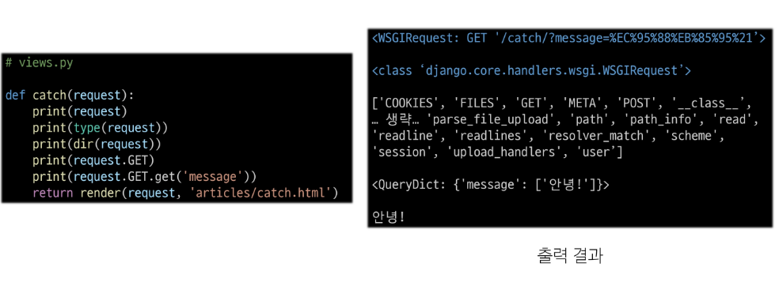

**request 객체에서 form 데이터 추출**

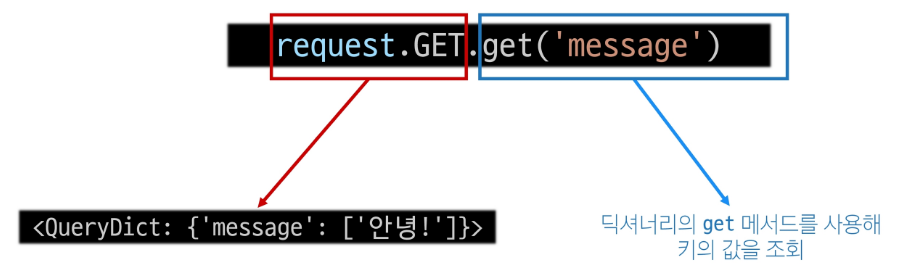

### throw - catch 간 요청과 응답 정리

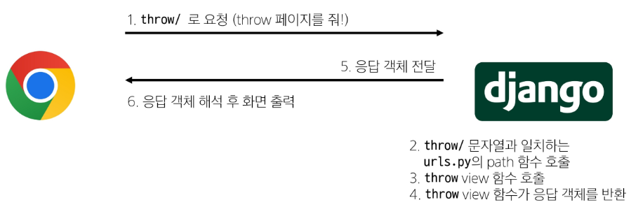

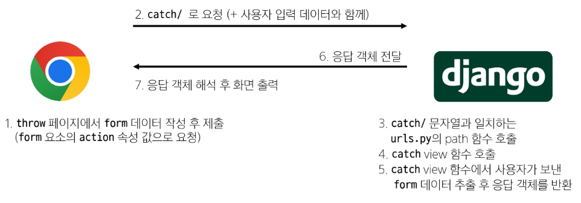

---

# Django URLs

요청과 응답에서 Django URLs의 역할

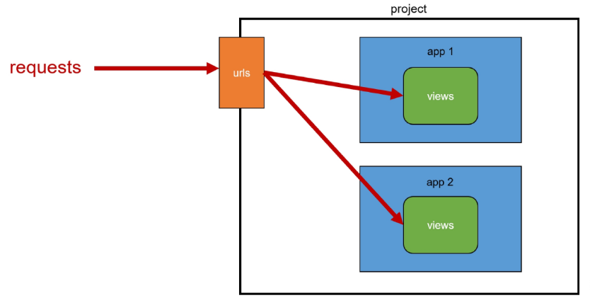

## URL dispathcer

**URL 패턴을 정의하고 해당 패턴이 일치하는 요청을 처리할 view 함수를 연결 (매핑)**

- dispatcher : 운항 관리자, 분배기

## Variable Routing

**URL 일부에 변수를 포함시키는 것**

- 변수는 view 함수의 인자로 전달할 수 있음

템플릿의 많은 부분이 중복되고, URL의 일부만 변경되는 상황이라면
계속해서 비슷한 URL과 템플릿을 작성해 나가야 할까?

```python
url patterns = [
	path('articles/1/', ...)
	path('articles/2/', ...)
	path('articles/3/', ...)
	path('articles/4/', ...)
	path('articles/5/', ...)
	...
]
```

### Variable Routing 작성법

`<path_converter:variable_name>`

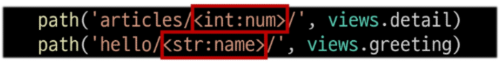

### Path converters

**URL 변수의 타입을 지정**

- str, int 등 5가지 타입 지원
- **기본 값 : str (생략 가능)**

### Variable Routing 실습 (str)

```python
# urls.py

urlpatterns = [
    path('hello/<str:name>/', views.greeting)
]
```

```python
# views.py

def greeting(request, name):
    context = {
        'name': name,
    }
    return render(request, 'articles/greeting.html', context)
```

```html
<!-- articles/greeting.html -->




  <h1>Greeting</h1>
  <p>{{ name }}님 안녕하세요.</p>

```

### Variable Routing 실습 (int)

```python
# urls.py

urlpatterns = [
    path('articles/<int:num>/', views.detail)
]
```

```python
# views.py

def detail(request, num):
    context = {
        'num': num,
    }
    return render(request, 'articles/detail.html', context)
```

```html
<!-- articles/detail.html -->




  <h1>Detail</h1>
  <h3>{{ num }}번 글 입니다.</h3>

```

## App과 URL

### App URL mapping

각 앱에 URL을 정의하는 것

→ 프로젝트와 각 앱의 URL을 나누어 관리를 편하게 하기 위함 

**2번째 앱 pages 생성 후 발생할 수 있는 문제**

- view 함수 이름이 같거나, 같은 패턴의 URL 주소를 사용하게 되는 경우
    
    ```python
    # firstpjt/urls.py
    
    from articles import views as articles_views
    from pages import views as pages_views
    
    urlpatterns = [
    	...,
    	path('pages', pages_view.index),
    ]
    ```
    
- 위 코드와 같이 해결할 수 있으나 더 좋은 방법이 필요
    
    → URL을 각자 App에서 관리하자
    

**기존 URL 구조**

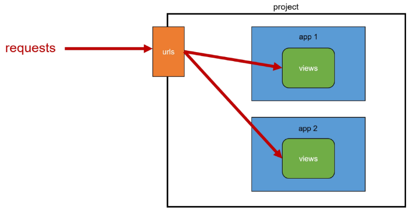

**변경된 URL 구조**

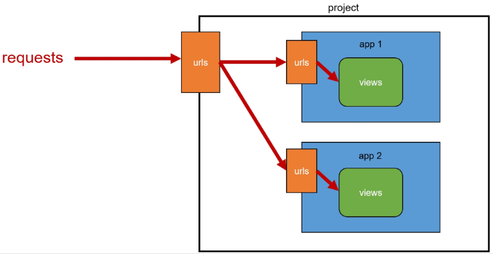

**URL 구조 변화**

```python
# firstpjt/urls.py

from django.contrib import admin
from django.urls import path, include
from articles import views

urlpatterns = [
    # path("admin/", admin.site.urls),
    # path('index/', views.index),
    # path('dinner/', views.dinner),
    # path('search/', views.search),
    # path('throw/', views.throw),
    # path('catch/', views.catch),
    # path('hello/<str:name>/', views.greeting),
    # path('articles/<int:num>/', views.detail),
    path('articles/', include('articles.urls')),
    path('pages/', include('pages.urls')),
]
```

```python
# articles/urls.py

from django.urls import path
from . import views

urlpatterns = [
    # path("admin/", admin.site.urls),
    path('index/', views.index),
    path('dinner/', views.dinner),
    path('search/', views.search),
    path('throw/', views.throw),
    path('catch/', views.catch),
    path('hello/<str:name>/', views.greeting),
    path('articles/<int:num>/', views.detail),
]
```

```python
# pages/urls.py

from django.urls import path
from . import views

urlpatterns = [
    path('index/', views.index)
]
```

### **`include()`**

**프로젝트 내부 앱들의 URL을 참조할 수 있도록 매핑하는 함수**

→ URL의 일치하는 부분까지 잘라내고,
    남은 문자열 부분은 후속 처리를 위해 include된 URL로 전달

```python
# firstpjt/urls.py

from django.urls import path, **include**

urlpatterns = [
    path('admin/', admin.site.urls),
    **path('articles/', include('articles.urls')),
    path('pages/', include('pages.urls')),**
]
```

## URL 이름 지정

**URL 구조 변경에 따른 문제점**

- 기존 `articles/` 주소가 `articles/index/` 로 변경됨에 따라 
해당 url을 사용하는 모든 위치를 찾아가 변경해야 함
    
    **→ URL에 이름을 지어주면 이름만 기억하면 되지 않을까?**
    

```python
# 이름 부여 전
path('articles/', include('articles.urls'))

# 이름 부여 후
path('articles/, views.index, name='index)
```

### Naming URL Patterns

**URL에 이름을 지정하는 것 (path 함수의 name 인자를 정의해서 사용)**

**Naming URL patterns 적용**

```python
# articles/url.py

from django.urls import path
from . import views

urlpatterns = [
    # path("admin/", admin.site.urls),
    path('index/', views.index, name='index'),
    path('dinner/', views.dinner, name='dinner'),
    path('search/', views.search, name='search'),
    path('throw/', views.throw, name='throw'),
    path('catch/', views.catch, name='catch'),
    path('hello/<str:name>/', views.greeting, name='detail'),
    path('articles/<int:num>/', views.detail, name='greeting')
]
```

```python
# pages/url.py

from django.urls import path
from . import views

urlpatterns = [
    path('index/', views.index, name='index')
]
```

**URL 표기 변화**

**url을 작성하는 모든 곳에서 변경** 

→ a 태그의 href 속성 값 뿐만 아니라, form의 action 속성 등도 포함

```html
<!-- 변경 전 -->
<!-- articles/index.html -->




  <h1>안녕하세요! {{ name }}</h1>
  <a href="/dinner/">dinner</a>
  <a href="/search/">search</a>
  <a href="/throw/">throw</a>

```

```html
<!-- 변경 후 -->
<!-- articles/index.html -->




  <h1>안녕하세요! {{ name }}</h1>
  <a href="">dinner</a>
  <a href="">search</a>
  <a href="">throw</a>

```

## DTL URL tag

주어진 URL 패턴의 이름과 일치하는 절대 경로 주소를 반환

``

**url tag 적용 후 브라우저 출력 확인**

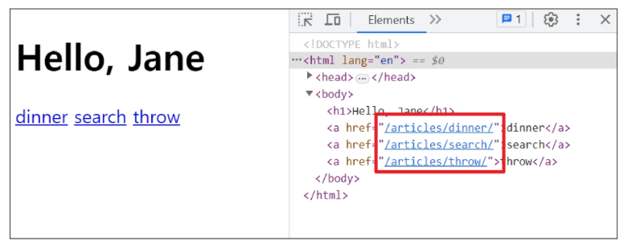

## URL 이름 공간

### app_name 속성

**URL 이름 지정 후 남은 문제**

- `articles` 앱의 url 이름과, `pages` 앱의 url 이름이 같은 상황
- 단순히 이름 만으로는 완벽하게 분리할 수 없음
    
    → 이름에 성`key` 을 붙이자
    

```python
# articles/urls.py

path('index/', views.index, name='index')
```

```python
# pages/urls.py

path('index/', views.index, name='index')
```

**app_name 속성 지정하기**

```python
# articles/urls.py

app_name = 'articles'
urlpattern = [
...
]
```

```python
# pages/urls.py

app_name = 'pages'
urlpattern = [
...
]
```

**URL tag의 최종 변화**

마지막으로 url 태그가 사용하는 모든 곳의 표기 변경하기

``


# 참고

## 추가 템플릿 경로 지정

```python
# settings.py

TEMPLATES = [
    {
        "BACKEND": "django.template.backends.django.DjangoTemplates",
        "DIRS": [
            # 객체 지향적 경로 작성법
            **BASE_DIR / 'my-templates',**
        ],
        "APP_DIRS": True,
        "OPTIONS": {
            "context_processors": [
                "django.template.context_processors.debug",
                "django.template.context_processors.request",
                "django.contrib.auth.context_processors.auth",
                "django.contrib.messages.context_processors.messages",
            ],
        },
    },
]
```

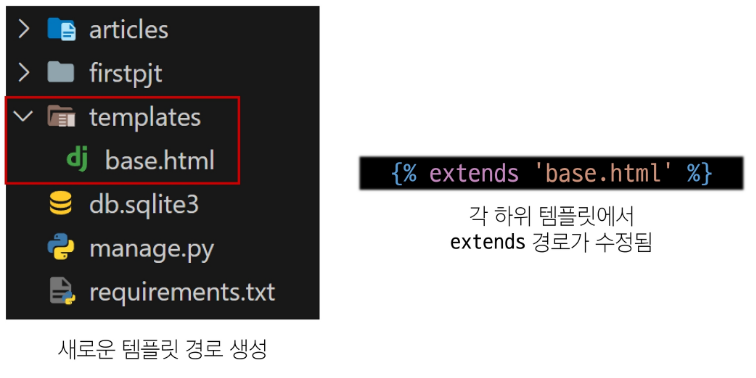

### BASE_DIR

**settings에서 경로 지정을 편하게 하기 위해 최상단 지점을 지정해 둔 변수**

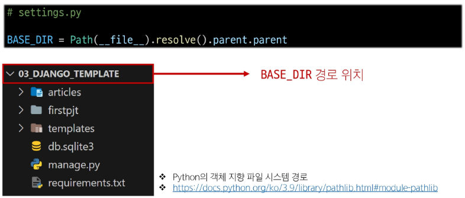

## DTL 주의 사항

- Python처럼 일부 프로그래밍 구조 `(if, for 등)` 를 사용할 수 있지만
명칭을 그렇게 설계했을 뿐이지, Python 코드로 실행되는 것도 아니며, 관련되지도 않음.
- 프로그래밍적 로직이 아니라 **표현을 위한 것**임을 명심
- **프로그래밍적 로직은 되도록 `view 함수` 내에서 작성 및 처리할 것**

## URL의 Trailing Slashes

- **Django는 URL 끝에 `/` 가 없다면 자동으로 붙임**
- “기술적인 측면에서, [`foo.com/bar`](http://foo.com/bar) 와 [`foo.com/bar/`](http://foo.com/bar/) 는 서로 다른 URL”
    
    → 검색 엔진 로봇이나 웹 트래픽 분석 도구에서는 이 두 주소를 서로 다른 페이지로 보기 때문
    
- 그래서 Django는 **검색 엔진이 혼동하지 않게 하기 위해 무조건 붙이는 방식을 선택**
- 그러나 **모든 FrameWork가 이런 방식으로 동작하지는 않으니 주의하자**