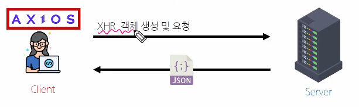

# Ajax와 서버

**`Ajax`** : Asynchronous JavaScript and XML

비동기적인 웹 애플리케이션 개발에 사용하는 기술

### Ajax를 활용한 클라이언트 서버 간 동작

- XML 객체 생성 및 요청 → Ajax 요청 처리 → 응답 데이터 생성 → JSON 데이터 응답 → Promise 객체 데이터를 활용해 DOM 조작 (웹 페이지의 일부분만을 다시 로딩)
    
    
    

# Ajax witth follow

```html
<!-- accounts/profile.html -->

<!DOCTYPE html>
<html lang="en">
<head>
  <meta charset="UTF-8">
  <meta name="viewport" content="width=device-width, initial-scale=1.0">
  <title>Document</title>
</head>
<body>
  <h1>{{ person.username }}의 프로필</h1>
  <div>
    팔로잉 : <span id='followings-count'>{{ person.followings.all|length }} </span> 
    / 팔로워 : <span id='followers-count'>{{ person.followers.all|length }}</span> 
  </div>

  
    <div>
      <form id="follow-form" data-user-id="{{ person.pk }}">
        
        
          <input type="submit" value="언팔로우" class='follow-input'>
        
          <input type="submit" value="팔로우" class='follow-input'>
        
      </form>
    </div>
  

   유저가 작성한 게시글 
  <h2>{{ person.username }} 작성한 게시글</h2>
  
    <p>{{ article }}</p>
  

  <hr>

   유저가 작성한 댓글 
  <h2>{{ person.username }} 작성한 댓글</h2>
  
    <p>{{ comment }}</p>
  

  <hr>

   유저가 좋아요한 게시글 
  <h2>{{ person.username }} 좋아요한 게시글</h2>
  
    <p>{{ article }}</p>
  

  <a href="">[back]</a>
  <script src="https://cdn.jsdelivr.net/npm/axios/dist/axios.min.js"></script>
  <script>
    // 1. 팔로우 버튼 선택
    const formTag = document.querySelector('#follow-form')

    // 7. csrf token 선택
    const csrftoken = document.querySelector('[name=csrfmiddlewaretoken]').value
    console.log('CSRF Token:', csrftoken)

    // 2. 팔로우 버튼에 이벤트 리스너를 부착 (submit 이벤트 감지)
    formTag.addEventListener('submit', function (event) {
      // 3. submit 이벤트의 기본 동작 취소
      event.preventDefault()
      
      // 5. HTML에서 준비한 user의 pk를 조회
      const userId = event.currentTarget.dataset.userId
      // const userId = this.dataset.userId
      // const userId = formTag.dataset.userId
      console.log(userId)

      // 4. axios 준비
      axios({
        method: 'post',
        // 6. HTML에서 전달해서 할당한 pk 값으로 URL 완성
        url: `/accounts/${userId}/follow/`,
        // 8. 선택한 csrftoken 값을 요청 headers에 세팅
        headers: {'X-CSRFToken': csrftoken},
      })
        .then((response) => {
          console.log(response)
          // 11. django로부터 응답 받은 팔로우 상태 정보
          console.log(response.data)
          // 12. 팔로우 상태 정보 데이터에 따라 팔로우 버튼을 조작
          const isFollowed = response.data.is_followed
          const followBtn = document.querySelector('.follow-input')
          if (isFollowed === true) {
            followBtn.value = '언팔로우'
          } else {
            followBtn.value = '팔로우'
          }
          // 13 팔로워, 팔로잉 수 선택
          const followingsCountTag = document.querySelector('#followings-count')
          const followersCountTag = document.querySelector('#followers-count')
          
          // 15. Django가 응답한 팔로잉, 팔로워 수 데이터를 활용해 DOM 변경
          followingsCountTag.textContent = response.data.followings_count
          followersCountTag.textContent = response.data.followers_count
        })
        .catch((error) => {
          console.log(error)
        })
    })
  </script>
</body>

</html>

```

```python
# accounts/views.py

from django.http import JsonResponse

def follow(request, user_pk):
    User = get_user_model()
    you = User.objects.get(pk=user_pk)
    me = request.user

    if me != you:
        # 9. JS에게 팔로우 상태 여부를 전달할 데이터 작성
        if me in you.followers.all():
            you.followers.remove(me)
            # me.followings.remove(you)
            is_followed = False
        else:
            you.followers.add(me)
            # me.followings.add(you)
            is_followed = True
        context = {
            # 팔로워 수와 팔로잉 수에 대한 데이터 작성
            'is_followed': is_followed,
            'followings_count': you.followings.count(),
            'followers_count': you.followers.count(),
        }
        # 10. JSON 데이터로 응답
        return JsonResponse(context)
    return redirect('accounts:profile', you.username)
```

### 사전 준비

1. M:N까지 진행한 Django 프로젝트 준비
2. 가상환경 생성 및 활성화, 패키지 설치

### Ajax 적용

**프로필 페이지에 axios CDN 작성**

```html
<!-- accounts/profile.html -->
 
<body>
  <a href="">[back]</a>
  <script src="https://cdn.jsdelivr.net/npm/axios/dist/axios.min.js"></script>
  <script>
  </script>
</body>
```

- **기존**:
    - HTML의 form 태그를 사용해 POST 메서드로 데이터를 제출 (submit)
- **변경**:
    - axios를 사용해 POST 메서드로 데이터를 제출
    - form의 method, action 속성이 불필요
    - 팔로우 버튼에 submit 이벤트가 발생하면 (이벤트 리스너)
    - Django가 JSON 데이터를 응답
    - JS에서 응답받은 JSON 데이터를 활용해 팔로우 버튼을 조작 (DOM)

**form 요소 선택을 위해 id 속성 및 선택**

- **action과 method 속성은 삭제**
    
     → 요청은 axios로 대체되기 때문
    
    ```html
    
      <div>
        <form id="follow-form">
          
          
            <input type="submit" value="언팔로우">
          
            <input type="submit" value="팔로우">
          
        </form>
      </div>
    
    
    <script src="https://cdn.jsdelivr.net/npm/axios/dist/axios.min.js"></script>
      <script>
        // 1. 팔로우 버튼 선택
        **const formTag = document.querySelector('#follow-form')**
    
        // 2. 팔로우 버튼에 이벤트 리스너를 부착 (submit 이벤트 감지)
        **formTag.addEventListener('submit', function (event) {**
          // 3. submit 이벤트의 기본 동작 취소
          **event.preventDefault()**
    
          // 4. axios 준비
          **axios({
            method: 'post',
            url: `accounts/${유저id}/follow/`
          })
        })**
      </script>
    ```
    

**axios 요청 코드 작성**

- **url에 작성할 user_pk 가져오기 (HTML ⇒ JavaScript)**
    
    ```html
    
      <div>
        **<form id="follow-form" data-user-id="{{ person.pk }}">**
          
          
            <input type="submit" value="언팔로우">
          
            <input type="submit" value="팔로우">
          
        </form>
      </div>
    
    <script src="https://cdn.jsdelivr.net/npm/axios/dist/axios.min.js"></script>
    <script>
      // 1. 팔로우 버튼 선택
      const formTag = document.querySelector('#follow-form')
    
      // 2. 팔로우 버튼에 이벤트 리스너를 부착 (submit 이벤트 감지)
      formTag.addEventListener('submit', function (event) {
        // 3. submit 이벤트의 기본 동작 취소
        event.preventDefault()
        
        // 5. HTML에서 준비한 user의 pk를 조회
        **const userId = event.currentTarget.dataset.userId
        // const userId = this.dataset.userId
        // const userId = formTag.dataset.userId
        console.log(userId)**
    
        // 4. axios 준비
        axios({
          method: 'post',
          // 6. HTML에서 전달해서 할당한 pk 값으로 URL 완성
          **url: `accounts/${userId}}/follow/`**
        })
      })
    </script>
    ```
    
    - **`data-*` 사용 예시**
        
        ```html
        <div data-my-id="my-data"></div>
        <script>
        	const myId = event.target.dataset.myId
        </script>
        ```
        
        - 모든 사용자 지정 데이터는 JavaScript에서 dataset 속성을 통해 접근
        - 주의 사항:
            1. 대소문자 여부에 상관없이 ‘xml’ 문자로 시작 불가
            2. 세미콜론 포함 불가
            3. 대문자 포함 불가

- **문서상 input hidden 타입으로 존재하는 csrf token 데이터를 axios로 전송**
    - https://docs.djangoproject.com/en/5.1/howto/csrf/
    
    ```html
    <script src="https://cdn.jsdelivr.net/npm/axios/dist/axios.min.js"></script>
    <script>
      // 1. 팔로우 버튼 선택
      const formTag = document.querySelector('#follow-form')
    
      // 7. csrf token 선택
      **const csrftoken = document.querySelector('[name=csrfmiddlewaretoken]').value**
    
      // 2. 팔로우 버튼에 이벤트 리스너를 부착 (submit 이벤트 감지)
      formTag.addEventListener('submit', function (event) {
        // 3. submit 이벤트의 기본 동작 취소
        event.preventDefault()
        
        // 5. HTML에서 준비한 user의 pk를 조회
        const userId = event.currentTarget.dataset.userId
        // const userId = this.dataset.userId
        // const userId = formTag.dataset.userId
        console.log(userId)
    
        // 4. axios 준비
        axios({
          method: 'post',
          // 6. HTML에서 전달해서 할당한 pk 값으로 URL 완성
          url: `accounts/${userId}}/follow/`,
          // 8. 선택한 csrftoken 값을 요청 headers에 세팅
          **headers: {'X-CSRFToken': csrftoken},**
        })
      })
    </script>
    ```
    

- 팔로우 버튼을 토글하기 위해서는 현재 팔로우 상태인지, 
언팔로우 상태인지에 대한 상태 확인이 필요
    
    → Django의 view 함수에서 팔로우 여부를 파악할 수 있는 변수를 추가로 생성해
        JSON 타입으로 응답하기
    

# Ajax witth Like

```html
<!-- articles/index.html -->

<!DOCTYPE html>
<html lang="en">
<head>
  <meta charset="UTF-8">
  <meta name="viewport" content="width=device-width, initial-scale=1.0">
  <title>Document</title>
</head>
<body>
  <h1>Articles</h1>

  
    <p>안녕하세요 {{ user.username }}</p>
    <a href="">내 프로필</a>

    <a href="">CREATE</a>
    <form action="" method="POST">
      
      <input type="submit" value="LOGOUT">
    </form>
    <form action="" method="POST">
      
      <input type="submit" value="회원탈퇴">
    </form>
    <a href="">회원정보 수정</a>
  
    <a href="">LOGIN</a>
    <a href="">회원가입</a>
  

  <article class='article-container'>
    
      <a href="">
        <p>작성자: {{ article.user.username }}</p>
      </a>
      <p>글 번호: {{ article.pk }}</p>
      <a href="">
        <p>글 제목: {{ article.title }}</p>
      </a>
      <p>글 내용: {{ article.content }}</p>
       좋아요 form 버튼 
      <form data-article-id="{{ article.pk }}"> 
         5. 좋아요 버튼의 action, method 삭제 
         9. JS에 게시글 id를 전달하기 
        
        
           15. 각 좋아요 버튼을 구별할 수 있는 id 속성 만들기 
          <input type="submit" value="좋아요 취소" id="like-{{ article.pk }}">
        
          <input type="submit" value="좋아요" id="like-{{ article.pk }}">
        
        </form>
      <hr>
    
  </article>
  <script src="https://cdn.jsdelivr.net/npm/axios/dist/axios.min.js"></script>
  <script>
    // 1. 게시글 버튼을 모두 포함하는 최상위 요소를 선택
    const articleContainer = document.querySelector('.article-container')
    // 6. csrf token 선택
    const csrftoken = document.querySelector('[name=csrfmiddlewaretoken]').value
    // console.log('CSRF Token:', csrftoken)

    // 2. 선택한 최상위 요소에 이벤트 핸들러를 부착
    articleContainer.addEventListener('submit', function (event) {
      // 3. submit 이벤트 기본 동작 취소
      event.preventDefault()

      // 10. HTML에서 전달한 게시글 id 받기
      const articleId = event.target.dataset.articleId
      console.log(articleId)
      // 4. axios 요청 작성
      axios({
        method: 'post',
        // 11. 전달받은 게시글 id로 url 완성
        url: `/articles/${articleId}/likes/`,
        // 7. 선택한 csrftoken 값을 요청 headers에 세팅
        headers: {'X-CSRFToken': csrftoken},
      })
        .then((response) => {
          console.log(response)
          console.log(response.data)
          // 14. django에게 응답받은 좋아요 상태 정보 저장
          const isLiked = response.data.is_liked
          // 16. 좋아요 버튼 선택
          const likeBtn = document.querySelector(`#like-${articleId}`)
          // 17. 좋아요 상태 정보에 따라 버튼 변경
          if (isLiked === true) {
            likeBtn.value = '좋아요 취소'
          } else {
            likeBtn.value = '좋아요'
          }
        })
        .catch((error) => {
          console.log(error)
        })
    })
  </script>
</body>
</html>

```

```python
# articles/views.py

from django.http import JsonResponse

def likes(request, article_pk):
    article = Article.objects.get(pk=article_pk)

    # 12. 좋아요 상태 여부를 JS에 응답할 데이터 세팅
    if request.user in article.like_users.all():
        article.like_users.remove(request.user)
        is_liked = False
    else:
        article.like_users.add(request.user)
        is_liked = True
    # 13. 세팅한 데이터를 JSON 형식으로 응답
    context = {
        'is_liked': is_liked,
    }
    return JsonResponse(context)
```