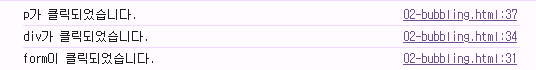
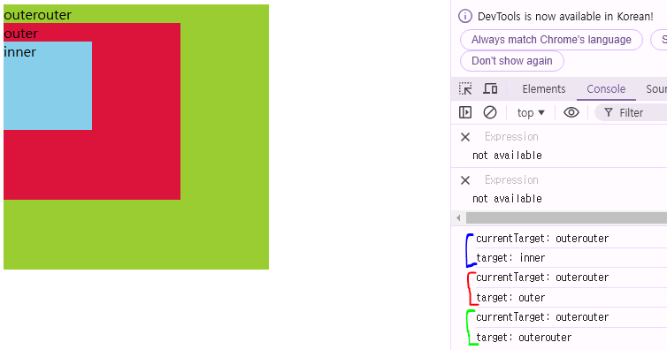
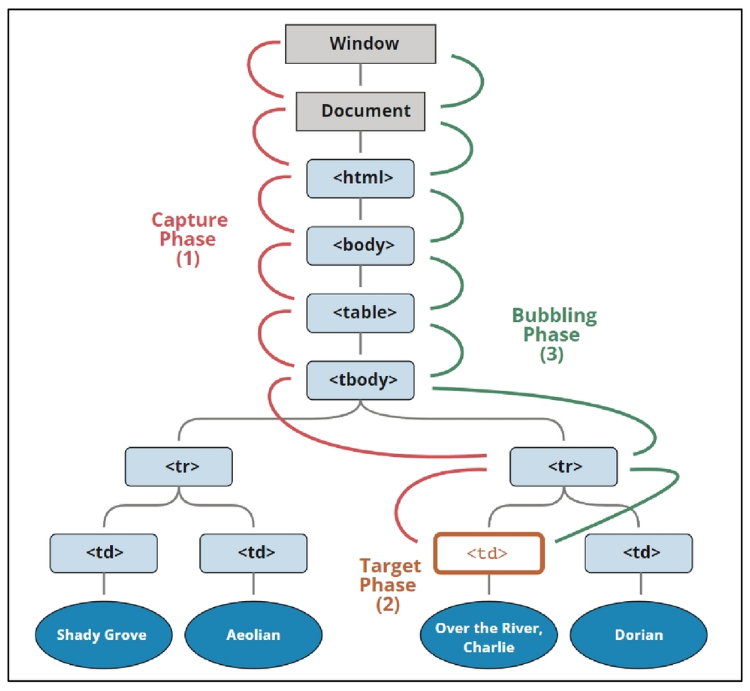
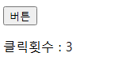
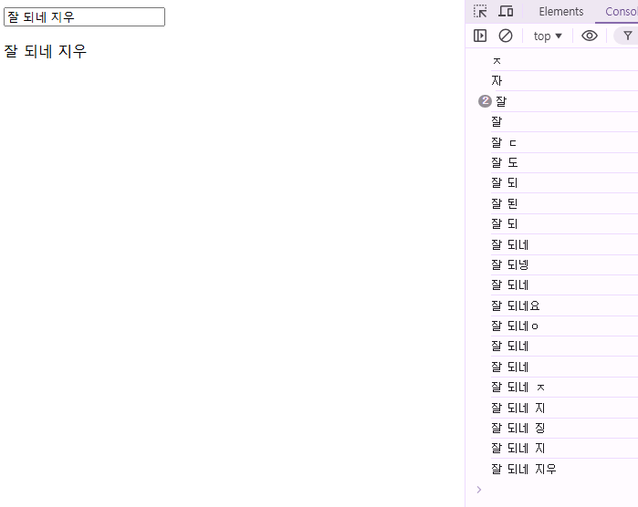
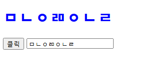
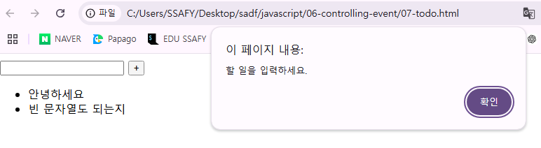
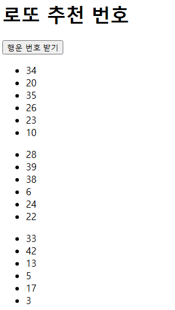

# 이벤트

### 웹에서의 Event

- 화면을 스크롤 하는 것
- 버튼을 클릭했을 때 팝업 창이 출력되는 것
- 마우스 커서의 위치에 따라 드래그 앤 드롭하는 것
- 사용자의 키보드 입력 값에 따라 새로운 요소를 생성하는 것

**→ 웹에서의 모든 동작은 이벤트 발생과 함께 한다**

## Event 객체

### `event` object

**무언가 일어났다는 신호, 사건**

- **(DOM에서 이벤트가 발생했을 때 생성되는 객체)**
    
    **→ 모든 DOM 요소는 이러한 event를 만들어 냄** 
    
- **이벤트 종류**
    - `mouse` , `input` , `keyboard` , `touch` …

**DOM 요소에서 `event`가 발생하면
해당 `event`는 연결된 이벤트 처리기 (`event handler`)에 의해 처리 됨**

## `event handler`

특정 이벤트가 발생했을 때 실행되는 함수

→ 사용자의 행동에 어떻게 반응할 지를 JavaScript 코드로 표현한 것

### `.addEventListener()`

**특정 이벤트를 DOM 요소가 수신할 때마다 콜백 함수를 호출**

→ 대표적인 이벤트 핸들러 중 하나

**`EventTarget.addEventListener(type, handler)`**

**`DOM 요소, 수신할 이벤트, 콜백 함수`**

- `대상에 특정 이벤트가 발생하면, 지정한 이벤트를 받아 할 일을 등록한다`

**`addEventListener` 인자**

```jsx
element.addEventListener('click', function (event) {
	// 이벤트 처리 로직
})
```

- **`type`**
    - 수신할 이벤트 이름
    - 문자열로 작성 (ex: ‘click’)
- **`handler`**
    - 발생한 이벤트 객체를 수신하는 콜백 함수
    - 이벤트 핸들러는 자동으로 `event` 객체를 매개 변수로 받음

**`addEventListener` 활용**

- **버튼을 클릭하면 버튼 요소 출력하기**
    
    → 버튼에 이벤트 처리기를 부착하여 클릭 이벤트가 발생하면 이벤트가 발생한 버튼 정보를 출력
    
    ```jsx
    <button id="btn">버튼</button>
    
    <script>
      // 1. 버튼 선택
      const btn = document.querySelector('#btn')
    
      // 2. 콜백 함수
      const detectClick = function (event) {
        console.log(event) // PointerEvent {isTrusted: true, pointerId: 1, width: 1, height: 1, pressure: 0, …}
        console.log(event.currentTarget)  // <button id="btn">버튼</button>
        console.log(event.target)         // <button id="btn">버튼</button>
        console.log(this)                 // <button id="btn">버튼</button>
      }
    
      // 3. 버튼에 이벤트 핸들러를 부착
      btn.addEventListener('click', detectClick)
    ```
    
    - 요소에 **`addEventListener`** 를 연결하게 되면 내부의 `this` 값은 연결된 요소를 가리키게 됨
    (`event` 객체의 `currentTarget` 속성 값과 동일)

**`addEventListener` 의 콜백 함수 특징**

- 이벤트 핸들러 내부의 `this`는 이벤트 리스너에 연결된 요소 (currentTarget)를 가리킴
- 이벤트가 발생하면 `event` 객체가 생성되어 첫 번째 인자로 전달
    - `event` 객체가 필요 없는 경우 생략 가능
- 반환 값 없음

# 버블링

### 개요

- `form > div > p` 형태로 중첩된 구조에 각각 이벤트 핸들러가 연결되어 있을 경우
만약 `<p>` 요소를 클릭하면 어떻게 될까?

```jsx
<form id="form">
  form
  <div id="div">
    div
    <p id="p">p</p>
  </div>
</form>

<script>
  const formElement = document.querySelector('#form')
  const divElement = document.querySelector('#div')
  const pElement = document.querySelector('#p')

  const clickHandler1 = function (event) {
    console.log('form이 클릭되었습니다.')
  }
  const clickHandler2 = function (event) {
    console.log('div가 클릭되었습니다.')
  }
  const clickHandler3 = function (event) {
    console.log('p가 클릭되었습니다.')
  }

  formElement.addEventListener('click', clickHandler1)
  divElement.addEventListener('click', clickHandler2)
  pElement.addEventListener('click', clickHandler3)
</script>
```

- **`<p>` 요소만 클릭했는데도 불구하고 모든 핸들러가 동작함**
    - **왜 `<p>` 만 클릭했는데, 부모 요소 `div, form` 에 할당된 핸들러까지 동작하는가**
        
        
        
        **→ 최하위의 `p` 요소를 클릭하면 `p -> div -> form` 순서로 
            3개의 이벤트 핸들러가 모두 순차적으로 동작했던 것 (버블링)**
        

## 버블링 (Bubbling)

- 한 요소에 이벤트가 발생하면, 이 요소에 할당된 핸들러가 동작하고
이어서 부모 요소의 핸들러가 동작하는 현상
- 가장 최상단의 조상 요소(`document`)를 만날 때까지 이 과정이 반복되면서
요소 각각에 할당된 핸들러가 동작

→ 이벤트가 제일 깊은 곳에 있는 요소에서 시작해 부모 요소를 거슬러 올라가며 발생하는 것이
    마치 물 속 거픔과 닮았기 때문

**이벤트가 정확히 어디서 발생했는지 접근할 수 있는 방법**

- `event.currentTarget`
- `event.target`

### `currentTarget` & `target` 속성

- **`currentTarget`**
    - ‘현재’ 요소
    - 항상 이벤트 핸들러가 연결된 요소만을 참조하는 속성
    - `this`와 같음
    
- **`target`**
    - 이벤트가 발생한 가장 안쪽의 요소(target)를 참조하는 속성
    - 실제 이벤트가 시작된 요소
    - 버블링이 진행되어도 변하지 않음

**예시**



```jsx
<head>
  <style>
    #outerouter {
      width: 300px;
      height: 300px;
      background-color: yellowgreen;
    }

    #outer {
      width: 200px;
      height: 200px;
      background-color: crimson;
    }

    #inner {
      width: 100px;
      height: 100px;
      background-color: skyblue;
    }
  </style>
</head>

<body>
  <div id="outerouter">
    outerouter
    <div id="outer">
      outer
      <div id="inner">inner</div>
    </div>
  </div>

  <script>
    const outerOuterElement = document.querySelector('#outerouter')
    const outerElement = document.querySelector('#outer')
    const innerElement = document.querySelector('#inner')

    const clickHandler = function (event) {
      console.log('currentTarget:', event.currentTarget.id)
      console.log('target:', event.target.id)
    }

    outerOuterElement.addEventListener('click', clickHandler)
  </script>
</body>
```

- 세 요소 중 가장 최상위 요소인 `outerouter` 요소에만 핸들러가 연결

- 각 요소를 클릭했을 때 `event`의 `target`과 `currentTarget` 차이 비교
    - **`currentTarget` :** 핸들러가 연결된 `outerouter` 요소만을 가리킴
    - **`target` :** 실제 이벤트가 발생하는 요소를 가리킴

- 핸들러는 `outerouter` 에만 연결되어 있지만,
하위 요소 `outer` 와 `inner` 를 클릭해도 해당 핸들러가 동작함

→ 클릭 이벤트가 어디서 발생했든 상관 없이, 
    `outerouter` 까지 이벤트가 버블링 되어 핸들러를 실행시키기 때문

## 캡처링과 버블링

### 캡처링 (capturing)

이벤트가 하위 요소로 전파되는 단계 (버블링과 반대)



- `table`의 하위 요소 `td` 를 클릭하면 이벤트는 먼저 최상위 요소부터 아래로 전파됨 (캡처링)
- 실제 이벤트가 발생한 지점(`event.target`)에서 실행된 후 다시 위로 전파 (버블링)
    - 이 전파 과정에서 상위 요소에 할당된 이벤트 핸들러들이 호출되는 것

**→ 캡처링은 실제 개발자가 다루는 경우가 거의 없으므로 버블링에 집중하자**

## 버블링의 필요성

### 버블링이 필요한 이유

- 만약 다음과 같이 각자 다른 동작을 수행하는 버튼이 여러 개가 있다고 가정
    
    ```jsx
    <div> 
    	<button></button>
    	<button></button>
    	...
    	<button></button>
    	<button></button>
    </div>
    ```
    
- 그렇다면 각 버튼마다 서로 다른 이벤트 핸들러를 할당해야 할까?

**각 버튼의 공통 조상인 `div` 요소에 이벤트 핸들러 단 하나만 할당하기**

```jsx
<body>
  <div>
    <button>버튼1</button>
    <button>버튼2</button>
    <button>버튼3</button>
    <button>버튼4</button>
    <button>버튼5</button>
  </div>
  <script>
    **const divTag = document.querySelector('div')

    const clickHandler = function (event) {
      console.log(event.target)
    }

    divTag.addEventListener('click', clickHandler)**
  </script>
</body>
```

- 요소의 공통 조상에 이벤트 핸들러를 단 하나만 할당하면,
여러 버튼 요소에서 발생하는 이벤트를 한꺼번에 다룰 수 있음
- 공통 조상에 할당한 핸들러에서 `event.target` 을 이용하면
실제 어떤 버튼엣서 이벤트가 발생했는지 알 수 있기 때문

# event handler 활용

## event handler 활용 실습

1. **버튼을 클릭하면 숫자를 1씩 증가해서 출력하기**
    
    ```jsx
    <body>
      <button id="btn">버튼</button>
      <p>클릭횟수 : <span id="counter">0</span></p>
    
      <script>
        // 1. 초기 값
        let countNumber = 0
    
        // 2. 버튼 요소 선택  
        const button = document.querySelector('#btn')
    
        // 3. 이벤트 핸들러의 콜백 함수
        const clickHandler = function (event) {
          // 3.1 숫자를 1씩 증가
          countNumber++
    
          // 3.2 숫자를 컨텐츠로 가지고 있는 span 태그 선택
          const spanTag = document.querySelector('#counter')
    
          // 3.3 span 태그의 콘텐츠 값을 countNumber 값으로 변경(할당)
          spanTag.textContent = countNumber
        }
    
        // 4. 선택한 버튼에 이벤트 핸들러 부착
        button.addEventListener('click', clickHandler)
      </script>
    </body>
    ```
    
    
    
2. **사용자 입력 값을 실시간으로 출력하기**
    
    ```jsx
    <body>
      <input type="text" id="text-input">
      <p></p>
      
      <script>
        // 1. input 요소를 선택 (이벤트가 발생하는 지점)
        const inputTag = document.querySelector('#text-input')
    
        // 2. p 요소 선택
        const pTag = document.querySelector('p')
    
        // 3. 콜백 함수 (input 요소에 input 이벤트가 발생할 때마다 실행될 코드)
        const inputHandler = function (event) {
          // console.log(event) // InputEvent
          // console.log(event.currentTarget) // <input type="text" id="text-input">
          // console.log(this) // <input type="text" id="text-input">
    
          // 3-1. 이벤트 객체에서 사용자가 입력한 값을 찾아 저장
          console.log(event.currentTarget.value)
          const inputData = event.currentTarget.value
    
          // 3-2. 선택한 p 요소의 텍스트 콘텐트에 할당
          pTag.textContent = inputData
        }
    
        // 4. 선택한 input 요소에 이벤트 핸들러를 부착
        inputTag.addEventListener('input', inputHandler)
      </script>
    </body>
    ```
    
    
    
3. **사용자 입력 값을 실시간으로 출력하기 + 버튼을 클릭하면 출력된 값의 CSS 스타일을 변경하기**
    
    ```jsx
    <body>
      <h1></h1>
      <button id="btn">클릭</button>
      <input type="text" id="text-input">
    
      <script>
        // 1. input 구현
        // 1-1. input & h1 요소 선택
        const inputTag = document.querySelector('#text-input')
        const h1Tag = document.querySelector('h1')
    
        // 1-2 콜백 함수
        const inputHandler = function (event) {
          // 1-2-1. 사용자 입력 데이터 추출
          const inputData = event.currentTarget.value
    
          // 1-2-2. input 요소에 이벤트 핸들러 부착
          h1Tag.textContent = inputData
        }
    
        // 1-3 input 요소에 이벤트 핸들러 부착
        inputTag.addEventListener('input', inputHandler)
    
        // 2. click 구현
        // 2-1. 버튼 요소 선택
        const btn = document.querySelector('#btn')
    
        // 2-2. 콜백 함수
        const clickHandler = function (event) {
          // 2-2-1. h1 요소의 클래스 목록에 blue 문자열 전환
          h1Tag.classList.toggle('blue')
        }
    
        // 2-3. 버튼에 이벤트 핸들러 부착
        btn.addEventListener('click', clickHandler)
    
      </script>
    </body>
    ```
    
    
    
4. **todo 프로그램 구현**
    
    ```jsx
    <body>
      <input type="text" class="input-text">
      <button id="btn">+</button>
      <ul></ul>
    
      <script>
        // 1. 필요한 요소들 선택
        const inputTag = document.querySelector('.input-text')
        const btnTag = document.querySelector('#btn')
        const ulTag = document.querySelector('ul')
    
        // 2. 콜백 함수 (실제 todo 데이터를 생성 후 추가하는 로직)
        const addTodo = function (event) {
          // 2-1. 사용자 입력 데이터 저장
          const inputData = inputTag.value // 버튼에 부착하는 콜백함수기 때문에, event나 this로 접근하면 안 됨
    
          // bonus. 빈 문자열 입력 방지 및 경고 표시
          // .trim() = 공백 제거
          if (inputData.trim()) {
            // 2-2. li 태그를 생성 후 li 태그의 textContext에 사용자 입력 데이터 할당 후 ul에 추가
            const liTag = document.createElement('li')
            liTag.textContent = inputData
            ulTag.appendChild(liTag)
    
            // 2-3. todo 추가 후에 input에 작성한 데이터를 초기화
            inputTag.value = ''
          } else {
            alert('할 일을 입력하세요.') // == window.alert
          }
        }
    
        // 3. 버튼에 이벤트 핸들러 부착
        btn.addEventListener('click', addTodo)
      </script>
    </body>
    ```
    
    
    
5. **로또 번호 생성기 구현**
    
    ```jsx
    <body>
      <h1>로또 추천 번호</h1>
      <button id="btn">행운 번호 받기</button>
      <div></div>
    
      <script src="https://cdn.jsdelivr.net/npm/lodash@4.17.21/lodash.min.js"></script>
      <script>
        // 1. 필요한 모든 요소를 선택
        const btn = document.querySelector('#btn')
        const divTag = document.querySelector('div')
    
        // 2. 로또 번호를 생성하는 함수
        const getNumbers = function () {
          // 2-1. 1부터 45까지의 배열을 생성
          const numbers = _.range(1, 46)
    
          // 2-2. 45개의 요소 중 랜덤으로 6개를 추출 후 리턴
          const sixNumbers = _.sampleSize(numbers, 6)
          return sixNumbers
        }
    
        // 3. 로또 번호를 화면에 출력하는 콜백 함수
        const getLottery = function (event) {
          // 3-1. 추출한 6개 로또 번호 할당
          const numbers = getNumbers()
    
          // 3-2. 6개의 list 요소를 담을 ul 태그를 생성
          const ulTag = document.createElement('ul')
          
          // 3-3. 추출한 6개의 로또 번호를 반복하면서 li 태그를 생성 후 ul 태그에 자식으로 추가
          numbers.forEach((number) => {
            const liTag = document.createElement('li')
            liTag.textContent = number
            ulTag.appendChild(liTag)
          })
    
          // 완성된 ulTag를 div 태그에 자식으로 추가
          divTag.appendChild(ulTag)
        }
    
        // 4. 버튼 요소에 이벤트 핸들러를 부착
        btn.addEventListener('click', getLottery)
      </script>
    </body>
    ```
    
    
    
    - https://lodash.com/
    

## `currentTarget` 주의 사항

- `console.log()` 로 `event` 객체를 출력할 경우, `currentTarget` 키의 값은 `null` 을 가짐
- `currentTarget` 은 이벤트가 처리되는 동안에만 사용할 수 있기 때문
- 대신 `console.log(event.currentTarget)`을 사용하여 콘솔에서 확인 가능

→ `currentTarget` 이후의 속성 값들은 `target` 을 참고해서 사용하기

## lodash

https://lodash.com/

- 모듈성, 성능 및 추가 기능을 제공하는 JavaScript 유틸리티 라이브러리
- array, object 등 자료 구조를 다룰 때 사용하는 유용하고 간편한 함수들을 제공

## 이벤트 기본 동작 취소하기

- HTML의 각 요소가 기본적으로 가지고 있는 이벤트가 때로는 방해가 되는 경우가 있어
이벤트의 기본 동작을 취소할 필요가 있음
- 예시
    - `form` 요소의 제출 이벤트를 취소하여 페이지 새로고침을 막을 수 있음
    - `a` 요소를 클릭할 때 페이지 이동을 막고 추가 로직을 수행할 수 있음

### `.preventDefault()`

**해당 이벤트에 대한 기본 동작을 실행하지 않도록 지정**

### 이벤트 동작 취소 실습

- `copy` 이벤트 동작 취소
    - 콘텐츠를 복사하는 것을 방지
    
    ```jsx
    <h1>중요한 내용</h1>
    
    <form id="my-form">
      <input type="text" name="username">
      <button type="submit">Submit</button>
    </form>
    
    <script>
      // 1
      const h1Tag = document.querySelector('h1')
    
      h1Tag.addEventListener('copy', function (event) {
        console.log(event)
        event.preventDefault()
        alert('복사 할 수 없습니다.')
      })
    </script>
    ```
    

- `form` 제출 시 페이지 새로고침 동작 취소
    - `form` 요소의 `submit` 동작(action 값으로 요청)을 취소 시킴
    
    ```jsx
    <h1>중요한 내용</h1>
    
    <form id="my-form">
      <input type="text" name="username">
      <button type="submit">Submit</button>
    </form>
    
    <script>
      // 2
      const formTag = document.querySelector('#my-form')
    
      const handleSubmit = function (event) {
        event.preventDefault()
      }
    
      formTag.addEventListener('submit', handleSubmit)
    
    </script>
    ```
    

# 참고

## `addEventListener` 에서의 화살표 함수 주의 사항

- 화살표 함수는 자신만의 `this`를 생성하지 않음
- 대신, 화살표 함수가 정의된 곳의 상위 스코프의 `this`를 그대로 사용
- 대부분의 경우, 이는 전역 객체(브라우저에서는 window)를 가리키게 됨
- 해결책:
    - 일반 함수로 사용하기
    - 화살표 함수일 경우 `event.currentTarget` 을 사용하기
    
    ```jsx
    element.addEventListener('click', function () {
    	console.log(this) // <button>fuction</button>
    }
    
    element.addEventListener('click', () => {
    	console.log(this) // window
    }
    ```