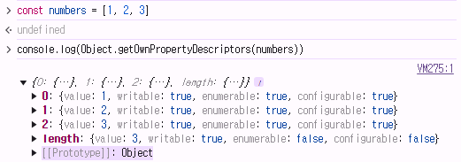

# 참조 자료형

**Reference Type**

**객체의 주소가 저장되는 자료형 (가변, 주소가 복사)**

- 객체를 생성하면 객체의 메모리 주소를 변수에 할당
    
    → 변수 간에 서로 영향을 미침
    
    ```jsx
    // 참조 자료형
    const arr1 = [1, 2, 3]
    const arr2 = arr1
    arr2.push(4)
    
    console.log(arr1) // [1, 2, 3, 4]
    console.log(arr2) // [1, 2, 3, 4]
    
    const obj1 = { name: 'Alice', age: 30 }
    const obj2 = obj1
    obj2.age = 40
    
    console.log(obj1.age) // 40
    console.log(obj2.age) // 40
    ```
    

# 함수

Function : 참조 자료형에 속하며 모든 함수는 Function object

## 구조

```jsx
function name([param[, param,[..., param]]]) {
	statements
	return value
}
```

- function 키워드
- 함수의 이름
- 함수의 매개 변수
- 함수의 body를 구성하는 statements
- return 값이 없다면 undefined를 반환

## 선언

### 선언식

function declaration

```jsx
function funcName () {
	statements
}
```

```jsx
// 함수 선언식
function add (num1, num2) {
  return num1 + num2
}
console.log(add(3, 9)) **// 12**
```

- **호이스팅 됨**
    
    ```jsx
    console.log(add(3, 9))
    
    function add (num1, num2) {
      return num1 + num2
    }
    **// 작동함**
    ```
    
- **코드의 구조와 가독성 면에서는 표현식에 비해 장점이 있음**

### 표현식

function expression

```jsx
const funcName = function () {
 statements
}
```

```jsx
// 함수 표현식
const sub = function (num1, num2) {
  return num1 - num2
}
console.log(sub(3, 9)) **// -6**
```

- **호이스팅 되지 않음**
    - 변수 선언만 호이스팅 되고, 함수 할당은 실행 시점에 이루어짐
    
    ```jsx
    console.log(sub(3, 9))
    
    const sub = function (num1, num2) {
      return num1 - num2
    }
    **// Uncaught ReferenceError: Cannot access 'sub' before initialization**
    ```
    
- **함수 이름이 없는 익명 함수를 사용할 수 있음**

**함수 표현식 사용을 권장하는 이유**

- **예측 가능성**
    - 호이스팅의 영향을 받지 않아 코드의 실행 흐름을 더 명확하게 예측할 수 있음
    
- **유연성**
    - 변수에 할당되므로 함수를 값으로 다루기 쉬움
    
- **스코프 관리**
    - 블록 스코프를 가지는 `let` 이나 `const` 와 함께 사용하여 더 엄격한 스코프 관리가 가능

## 매개 변수

### 기본 함수 매개 변수

Default function parameter

- 전달하는 인자가 없거나, `undefined` 가 전달될 경우 이름 붙은 매개 변수를 기본 값으로 초기화
    
    ```jsx
    // 기본 함수 매개변수
    const greeting = function (name = 'Anonymous') {
      return `Hi ${name}`
    }
    
    console.log(greeting()) // Hi Anonymous
    console.log(greeting('Sungjoon')) **// Hi Sungjoon**
    ```
    

### 나머지 매개 변수

Rest parameters

- 임의의 수의 인자를 ‘배열’로 허용하여 가변 인자를 나타내는 방법

**작성 규칙**

- 함수 정의 시 나머지 매개 변수는 하나만 작성할 수 있음
- 나머지 매개 변수는 함수 정의에서 매개 변수 마지막에 위치해야 함

```jsx
// 나머지 매개변수 (가변 인자)
const myFunc = function (param1, param2, ...restParams) {
  return [param1, param2, restParams]
}

console.log(myFunc(1, 2, 3, 4, 5)) **// [1, 2, [3, 4, 5]]**
console.log(myFunc(1, 2)) **// [1, 2, []]**
```

### 매개 변수와 인자 개수가 불일치 할 때

- **JS는 매개변수와 인자의 개수 불일치를 허용**

**매개 변수 개수 > 인자 개수**

```jsx
// 1. 매개변수 개수 > 인자 개수
const threeArgs = function (num1, num2, num3) {
  return [num1, num2, num3]
}

console.log(threeArgs())      **// [undefined, undefined, undefined]**
console.log(threeArgs(1))     **// [1, undefined, undefined]**
console.log(threeArgs(2, 3))  **// [2, 3, undefined]**
```

**→ 누락된 인자는 `undefined` 로 할당**

**매개 변수 개수 < 인자 개수**

```jsx
// 2. 매개변수 개수 < 인자 개수
const noArgs = function () {
  return 0
}

console.log(noArgs(1, 2, 3)) **// 0**

const twoArgs = function (num1, num2) {
  return [num1, num2]
}

console.log(twoArgs(1, 2, 3)) **// [1, 2]**
```

**→ 초과 입력된 인자는 사용하지 않음**

## Spread Syntax

### 전개 구문

- `...`
- 배열이나 문자열과 같이 반복 가능한 항목을 펼치는 것 (확장, 전개)
- 전개 대상에 따라 역할이 다름
    
    → 배열이나 객체의 요소를 개별적인 값으로 분리하거나
        다른 배열이나 객체의 요소를 현재 배열이나 객체에 추가하는 등
    

### 전개 구문 활용처

1. **함수와의 사용**
    - 함수 호출 시 인자 확장
        
        ```jsx
        // 1. 인자 확장 (함수 호출 시)
        function myFunc(x, y, z) {
          return x + y + z
        }
        
        let numbers = [1, 2, 3]
        console.log(myFunc(...numbers)) **// 6**
        console.log(myFunc(numbers[0], numbers[1], numbers[2])) **// 6**
        
        let numbers2 = [1, 2]
        console.log(...numbers2) **// 1 2**
        console.log(myFunc(...numbers2)) **// NaN**
        console.log(myFunc(numbers2[0], numbers2[1])) **// NaN**
        ```
        
    
    - 나머지 매개 변수 (압축)
        
        ```jsx
        // 2. 나머지 매개변수 (함수 선언 시)
        const myFunc2 = function(x, y, ...restArgs) {
          return [x, y, restArgs]
        }
        
        console.log(myFunc2(1, 2, 3, 4, 5)) **// [1, 2, [3, 4, 5]]**
        console.log(myFunc2(1, 2)) **// [1, 2, []]**
        ```
        

1. **객체와의 사용** 
2. **배열과의 사용**

## 화살표 함수 표현식

**`Arrow Function Expressions`**

**함수 표현식의 간결한 표현법**

```jsx
const arrow = function (name) {
	return `hello, ${name}`
}

// 위 함수를 화살표 함수로 변경
const arrow = name => `hello, ${name}`
```

### 화살표 함수 작성 과정

1. **`function` 키워드 제거 후 매개 변수와 중괄호 사이에 화살표 `=>` 작성**
2. **함수의 매개 변수가 하나 뿐이라면, 매개 변수의 `()` 제거 가능**
단 생략하지 않는 것을 권장
3. **함수 본문의 표현식이 한 줄이라면 `{}` 와 `return` 제거 가능**
    
    ```jsx
    const arrow1 = function (name) {
      return `hello, ${name}`
    }
    
    // 1. function 키워드 삭제 후 화살표 작성
    const arrow2 = (name) => {
      return `hello, ${name}`
    }
    
    // 2. 인자의 소괄호 삭제 (인자가 1개일 경우에만 가능)
    const arrow3 = name => {
      return `hello, ${name}`
    }
    
    // 3. 중괄호와 return 삭제 (함수 본문이 return을 포함한 표현식 1개일 경우에만 가능)
    const arrow4 = name => `hello, ${name}`
    
    console.log(arrow1('Sungjoon')) // hello, Sungjoon
    console.log(arrow2('Sungjoon')) // hello, Sungjoon
    console.log(arrow3('Sungjoon')) // hello, Sungjoon
    console.log(arrow4('Sungjoon')) // hello, Sungjoon
    ```
    

# 객체

## 개요

`Object`

키로 구분된 데이터 집합을 저장하는 자료형

## 구조 및 속성

### 객체 구조

- 중괄호 `{}` 를 이용해 작성
- 중괄호 안에는 `key: value` 쌍으로 구성된 속성(property)를 여러 개 작성 가능
- `key` 는 문자형만 허용
- `value` 는 모든 자료형 허용
    
    ```jsx
    const user = {
      name: 'Alice',
      'key with space': true,
      greeting: function() {
        return 'hello'
      }
    }
    ```
    

### 속성 참조

- `.` 또는 대괄호 `[]` 로 객체 요소 접근
- `key` 이름에 띄어쓰기 같은 구분자가 있으면 대괄호 접근만 가능
    
    ```jsx
    // 조회
    console.log(user.name) // Alice
    console.log(user['key with space']) // true
    
    // 추가
    user.address = 'korea'
    console.log(user) // {name: 'Alice', key with space: true, address: 'korea', greeting: ƒ}
    
    // 수정
    user.name = 'Bella'
    console.log(user) // {name: 'Bella', key with space: true, address: 'korea', greeting: ƒ}
    
    // 삭제
    delete user.name
    console.log(user) // {key with space: true, address: 'korea', greeting: ƒ}
    ```
    

### `in` 연산자

- 속성이 객체에 존재하는지 여부를 확인
    
    ```jsx
    // in 연산자
    
    // {key with space: true, address: 'korea', greeting: ƒ}
    console.log('greeting' in user) // true
    console.log('country' in user) // false
    console.log('address' in user) // true
    console.log('korea' in user) // false
    ```
    

## 메서드

`Method` 

**객체 속성에 정의된 함수**

→ `this` 키워드를 사용해 객체에 대한 특정한 작업을 수행할 수 있음

### Method 사용 예시

- `object.method()` 방식으로 호출
- 메서드는 객체를 ‘행동’할 수 있게 함
    
    ```jsx
    // 메서드 호출
    console.log(user.greeting()) // hello
    ```
    

### `this`

**함수나 메서드를 호출한 객체를 가리키는 keyword**

→ 함수 내에서 객체의 속성 및 메서드에 접근하기 위해 사용

```jsx
// Method & this 예시
const person = {
  name: 'Alice',
  greeting: function () {
    return `Hello my name is ${this.name}`
  },
}

console.log(person.greeting()) // Hello my name is Alice
```

**JavaScript에서 `this` 는 함수를 “호출하는 방법”에 따라 가리키는 대상이 다름**

| 호출 방법 | 대상 |
| --- | --- |
| 단순 호출 | 전역 객체 |
| 메서드 호출 | 메서드를 호출한 객체 |

**1. 단순 호출 시 `this`**

- 가리키는 대상 ⇒ 전역 객체
    
    ```jsx
    // 1.1 단순 호출 시 this
    const myFunc = function () {
      return this
    }
    console.log(myFunc()) // window
    ```
    

**2. 메서드 호출 시 `this`**

- 가리키는 대상 ⇒ 메서드를 호출한 객체
    
    ```jsx
    // 1.2 메서드 호출 시 this
    const myObj = {
      data: 1,
      myFunc: function () {
        return this
      }
    }
    console.log(myObj.myFunc()) // myObj
    ```
    

**중첩된 함수에서의 `this` 문제점과 해결책**

```jsx
**// 2. 중첩된 함수에서의 this

// 2.1 일반 함수**
const myObj2 = {
  numbers: [1, 2, 3],
  myFunc: function () {
    this.numbers.forEach(function (number) {
      console.log(this) // window
    })
  }
}
console.log(myObj2.myFunc())
// forEach의 인자로 작성된 함수는 일반적인 함수 호출이기 때문에
// this가 전역 객체를 가리킴

**// 2.2 화살표 함수**
const myObj3 = {
  numbers: [1, 2, 3],
  myFunc: function () {
    this.numbers.forEach((number) => {
      console.log(this) // myObj3
    })
  }
}
console.log(myObj3.myFunc())
// 화살표 함수는 자신만의 this를 가지지 않기 때문에
// 외부 함수(myFunc)에서 this 값을 가져옴
```

### 정리

- **JavaScript의 함수는 호출될 때 `this` 를 암묵적으로 전달 받음**
- **JavaScript에서 `this` 는 함수가 “호출되는 방식”에 따라 결정되는 현재 객체를 나타냄**
- **Python의 `self` 와 Java의 `this` 가 선언 시 이미 값이 정해지는 것에 비해
JavaScript의 `this`는 함수가 호출되기 전까지 값이 할당되지 않고, 호출 시에 결정됨
(동적 할당)**
- **`this` 가 미리 정해지지 않고 호출 방식에 의해 결정되는 것**
    - 장점:
        - 함수(메서드)를 하나만 만들어 여러 객체에서 재사용할 수 있음
    - 단점:
        - 이런 유연함이 실수로 이어질 수 있음
    
    **→ 개발자는 `this` 의 동작 방식을 충분히 이해하고 장점을 취하면서 실수를 피하는 데 집중**
    

## 추가 객체 문법

### 1. 단축 속성

- 키 이름과 값으로 쓰이는 변수의 이름이 같은 경우, 단축 구문을 사용할 수 있음
    
    ```jsx
    // 1. 단축 속성
    const name = 'Alice'
    const age = 30
    
    const user1 = {
      name: name,
      age: age
    }
    
    const user2 = {
      name,
      age,
    }
    
    console.log(user1) // {name: 'Alice', age: 30}
    console.log(user2) // {name: 'Alice', age: 30}
    ```
    

### 2. 단축 메서드

- 메서드 선언 시 `function` 키워드 생략 가능
    
    ```jsx
    // 2. 단축 메서드
    const myObj1 = {
      myFunc: function () {
        return 'Hello'
      }
    }
    
    const myObj2 = {
      myFunc() {
        return 'Hello'
      }
    }
    
    console.log(myObj1.myFunc()) // Hello
    console.log(myObj2.myFunc()) // Hello
    ```
    

### 3. 계산된 속성 (computed property name)

- `key` 가 대괄호 `[]` 로 둘러싸여 있는 속성
    
    → 고정된 값이 아닌 변수 값을 사용할 수 있음
    
    ```jsx
    // 3. 계산된 속성
    const product = prompt('물건 이름을 입력해주세요')
    const prefix = 'my'
    const suffix = 'property'
    
    const bag = {
      [product]: 5,
      [prefix + suffix]: 'value',
    }
    
    console.log(bag) // {연필: 5, myproperty: 'value'}
    ```
    

### 4. 구조 분해 할당 (destructing assignment)

- 배열 또는 객체를 분해하여 객체 속성을 변수에 쉽게 할당할 수 있는 문법
    
    ```jsx
    // 4. 구조 분해 할당
    const userInfo = {
      firstName: 'Alice',
      userId: 'alice123',
      email: 'alice123@gmail.com'
    }
    
    // const firstName = userInfo.name
    // const userId = userInfo.userId
    // const email = userInfo.email
    
    // const { firstName } = userInfo
    // const { firstName, userId } = userInfo
    const { firstName, userId, email } = userInfo 
    
    console.log(firstName, userId, email) // Alice alice123 alice123@gmail.com
    ```
    
- 함수의 매개 변수로 객체 구조 분해 할당 활용 가능
    
    ```jsx
    // 구조 분해 할당 활용 - "함수 매개변수"
    const person = {
      name: 'Bob',
      age: 35,
      city: 'London',
    }
    
    function printInfo({ name, age, city }) {
      console.log(`이름: ${name}, 나이: ${age}, 도시: ${city}`)
    }
    
    // 함수 호출 시 객체를 구조 분해하여 함수의 매개변수로 전달
    printInfo(person) // 이름: Bob, 나이: 35, 도시: London
    ```
    

### 5. Object with `전개 구문`

- 객체 복사
    - 객체 내부에서 객체 전개
- 얕은 복사에 활용 가능
    
    ```jsx
    // 5. 전개 구문 - "객체 복사"
    const obj = { b: 2, c: 3, d: 4 }
    const newObj = {a: 1, ...obj, e: 5}
    
    console.log(newObj) // {a: 1, b: 2, c: 3, d: 4, e: 5}
    ```
    

### 6. 유용한 객체 메서드

- `Object.keys()`
- `Object.values()`
    
    ```jsx
    // 6. 유용한 객체 메서드 (Object.keys(), Object.values())
    const profile = {
      name: 'Alice',
      age: 30
    }
    
    console.log(Object.keys(profile)) // ['name', 'age']
    console.log(Object.values(profile)) // ['Alice', 30]
    ```
    

### 7. Optional chaining (`?.`)

- 속성이 없는 중첩 객체를 에러 없이 접근할 수 있는 바법
- 만약 참조 대상이 `null` 또는 `undefined` 라면 에러가 발생하는 것 대신
평가를 멈추고 `undefined` 를 반환
    
    ```jsx
    const user = {
      name: 'Alice',
      greeting: function () {
        return 'hello'
      }
    }
    
    console.log(user.address.street) // Uncaught TypeError: Cannot read properties of undefined (reading 'street')
    console.log(user.address?.street) // undefined
    
    console.log(user.nonMethod()) // Uncaught TypeError: user.nonMethod is not a function
    console.log(user.nonMethod?.()) //undefined
    ```
    
- 만약 Optional chaining을 사용하지 않는다면 
아래와 같이 `&&` 연산자를 사용해야 함
    
    ```jsx
    console.log(user.address && user.address.street) // undefined
    ```
    

- **장점**
    - 참조가 누락될 가능성이 있는 경우,
    연결된 속성으로 접근할 때 더 짧고 간단한 표현식을 작성할 수 있음
    - 어떤 속성이 필요한지에 대한 보증이 확실하지 않은 경우에
    객체의 내용을 보다 편리하게 탐색할 수 있음
- **주의 사항**
    - Optional chaning은 존재하지 않아도 괜찮은 대상에만 사용해야 함 (남용 X)
        - 왼쪽 평가 대상이 없어도 괜찮은 경우에만 선택적으로 사용
        - 중첩 객체를에러 없이 접근하는 것이 사용 목적이기 때문
        
        ```jsx
        // Bad
        user?.address?.street
        
        // Good
        user.address?.street
        ```
        
    - Optional chaining 앞의 변수는 반드시 선언되어 있어야 함

## JSON

`JavaScript Object Notation`

- `Key-Value` 형태로 이루어진 자료 표기법
- JavaScript의 Object와 유사한 구조를 가지고 있지만, `JSON`은 형식이 있는 문자열
- JavaScript에서 `JSON`을 사용하기 위해서는 Object 자료형으로 변경해야 함

### Object ↔ JSON 변환하기

```jsx
const jsObject = {
  coffee: 'Americano',
  iceCream: 'Cookie and cream'
}

// Object -> JSON
const objToJson = JSON.stringify(jsObject)
console.log(objToJson)  // {"coffee":"Americano","iceCream":"Cookie and cream"}
console.log(typeof objToJson)  // string

// JSON -> Object
const jsonToObj = JSON.parse(objToJson)
console.log(jsonToObj)  // { coffee: 'Americano', iceCream: 'Cookie and cream' }
console.log(typeof jsonToObj)  // object
```

# 배열

`Object`: 키로 구분된 데이터 집합을 저장하는 자료형

→ 이제는 순서가 있는 collection이 필요

## Array

순서가 있는 데이터 집합을 저장하는 자료구조

### 배열 구조

- 대괄호 `[]` 를 이용해 작성
- 요소의 자료형은 제약 없음
- `length` 속성을 사용해 배열에 담긴 요소 개수 확인 가능
    
    ```jsx
    const names = ['Alice', 'Bella', 'Cathy']
    
    console.log(names) // ['Alice', 'Bella', 'Cathy']
    console.log(names[0]) // Alice
    console.log(names[1]) // Bella
    console.log(names[2]) // Cathy
    
    // 길이
    console.log(names.length) // 3
    
    // 수정
    names[1] = 'Dan'
    console.log(names) // ['Alice', 'Dan', 'Cathy']
    ```
    

### 배열 메서드

| **메서드** | **역할** |
| --- | --- |
| **`push` / `pop`** | 배열의 끝 요소를 추가 / 제거 |
| **`unshift` / `shift`**  | 배열 앞 요소를 추가 / 제거 |

**`push()`** : 배열 끝에 요소를 추가

```jsx
// push
names.push('Dan')
console.log(names) // ['Alice', 'Bella', 'Dan']
```

**`pop()`** : 배열 끝 요소를 제거하고, 제거한 요소를 반환

```jsx
// pop
console.log(names.pop()) // Cathy
console.log(names) // ['Alice', 'Bella']
```

**`unshift()`** : 배열 앞에 요소를 추가

```jsx
// unshift
names.unshift('Eric')
console.log(names) // ['Eric', 'Bella', 'Dan']
```

**`shift()`** : 배열 앞의 요소를 제거하고, 제거한 요소를 반환

```jsx
// shift
console.log(names.shift()) // Alice
console.log(names) // ['Bella', 'Dan']
```

# Array Helper Methods

**배열 조작을 보다 쉽게 수행할 수 있는 특별한 메서드 모음**

- **ES6에 도입**
- **배열의 각 요소를 순회하며 각 요소에 대해 함수(콜백 함수)를 호출**
- **대표 메서드**
    - `forEach()` , `map()` , `filter()` , `every()` , `some()` , `reduce()` 등
- **메서드 호출 시 인자로 함수(콜백 함수)를 받는 것이 특징**

## 콜백 함수

**`Callback Function` : 다른 함수에 인자로 전달되는 함수**

→ 외부 함수 내에서 호출되어, 일종의 루틴이나 특정 작업을 진행

### 콜백 함수 예시

**python에서도 콜백 함수와 유사한 구조가 있었음**

```python
numbers = [1, 2, 3]

def square(number): 
  return number**2

new_numbers = list(map(square, numbers))
print(new_numbers)
```

**JavaScript**

```jsx
const numbers1 = [1, 2, 3]
numbers1.forEach(function (number) {
  console.log(number ** 2)
})
// 1 4 9

//////////////////////////////////////////////

const numbers2 = [1, 4, 9]

const callBackFunc = function (number) {
  console.log(Math.sqrt(number))
}

numbers2.forEach(callBackFunc)
// 1 2 3
```

## 주요 Array Helper Methods

| **메서드** | **역할** |
| --- | --- |
| **`forEach`** | - 배열 내의 모든 요소 각각에 대해 함수(콜백 함수)를 호출
- 반환 값 없음 |
| **`map`** | - 배열 내의 모든 요소 각각에 대해 함수(콜백 함수)를 호출
- 함수 호출 결과를 모아 새로운 배열을 반환 |

### `forEach()`

**배열의 각 요소를 반복하며, 모든 요소에 대해 함수를 호출**

**`forEach` 구조**

**`arr.forEach(callback[item[, index[, array]]))`**

```jsx
array.forEach(function (item, index, array) {
	// do something
}
```

- **콜백 함수는 3가지 매개 변수로 구성**
    - `item` : 처리할 배열의 요소
    - `index` : 처리할 배열 요소의 인덱스 (선택 인자)
    - `array` : forEach를 호출한 배열 (선택 인자)
    
- **반환 값: `undefined`**

**`forEach` 예시**

```jsx
const names = ['Alice', 'Bella', 'Cathy']

// 일반 함수 표기 (함수 내에서 this를 쓰면, window가 출력)
names.forEach(function (name) {
  console.log(`안녕하세요, ${name}님!`)
})

// 화살표 함수 표기 (this 고려, 화살표 함수는 자신의 this를 가지지 않음)
names.forEach((name) => {
  console.log(`안녕하세요, ${name}님!`)
})

/*
안녕하세요, Alice님!
안녕하세요, Bella님!
안녕하세요, Cathy님!
*/
```

- `f**orEach` 의 인자를 모두 활용**
    
    ```jsx
    const names = ['Alice', 'Bella', 'Cathy']
        
    // 활용
    names.forEach((name, index, array) => {
      console.log(`${name}, ${index}, ${array}`)
    })
    
    /*
    Alice, 0, Alice,Bella,Cathy
    Bella, 1, Alice,Bella,Cathy
    Cathy, 2, Alice,Bella,Cathy
    */
    ```
    

### `map()`

**배열의 모든 요소에 대해 함수를 호출하고, 
반환된 호출 결과 값을 모아 새로운 배열을 반환**

**`map` 구조**

**`arr.map(callback(item[, index[, array]]))`**

```jsx
const newArr = array.map(function (item, index, array) {
	// do something
}
```

- **`forEach` 의 매개 변수와 동일**
- **반환 값**
    - 배열의 각 요소에 대해 실행한 “callback의 결과를 모은 새로운 배열"
        
        **→ `forEach` 동작 원리와 같지만,
            `forEach` 와 달리 새로운 배열을 반환**
        

**`map` 예시**

- **배열을 순회하며 각 객체의 `name` 속성 값을 추출하기 (`for…of` 와 비교)**
    
    ```jsx
    // 1. for...of 와 비교
    const persons = [
      { name: 'Alice', age: 20 },
      { name: 'Bella', age: 21 }
    ]
    
    // 1.1 for...of
    let result1 = []
    for (const person of persons) {
      result1.push(person.name)
    }
    console.log(result1) // ['Alice', 'Bella']
    
    // 1.2 map
    const result2 = persons.map(function (person) {
      return person.name
    })
    console.log(result2) // ['Alice', 'Bella']
    ```
    

- **화살표 함수 사용**
    
    ```jsx
    // 2. 화살표 함수 표기
    const names = ['Alice', 'Bella', 'Cathy']
    
    const result3 = names.map(function (name) {
      return name.length
    })
    
    const result4 = names.map((name) => {
      return name.length
    })
    
    console.log(result3) // [5, 5, 5]
    console.log(result4) // [5, 5, 5]
    ```
    

- **커스텀 함수 사용**
    
    ```jsx
    // 3. 커스텀 콜백 함수
    const numbers = [1, 2, 3]
    
    const myCallBackFunc = function (number) {
      return number * 2
    }
    
    const doubleNumber = numbers.map(myCallBackFunc)
    
    console.log(doubleNumber) // [2, 4, 6]
    ```
    

**python의 map 함수와 비교**

- **python의 `map`에 `square` 함수를 인자로 넘겨, 
numbers 배열의 각 요소를 `square` 함수의 인자로 사용하였음**
    
    ```python
    numbers = [1, 2, 3]
    
    def square(number): 
      return number**2
    
    new_numbers = list(map(square, numbers))
    
    print(new_numbers)  
    # [2, 4, 9]
    ```
    

- **`map` 메서드에 `myCallBackFunc` 함수를 인자로 넘겨,
numbers 배열의 각 요소를 `myCallBackFunc` 함수의 인자로 사용하였음**
    
    ```jsx
    const numbers = [1, 2, 3]
    
    const myCallBackFunc = function (number) {
      return number ** 2
    }
    
    const doubleNumber = numbers.map(myCallBackFunc)
    
    console.log(doubleNumber) 
    // [2, 4, 9]
    ```
    

## 배열 순회 종합

| **방식** | **특징** | **비고** |
| --- | --- | --- |
| **`for loop`** | - 배열의 인덱스를 이용해 각 요소에 접근
- `break` , `continue` 사용 가능 |  |
| **`for...of`** | - 배열 요소에 바로 접근 가능
- `break` , `continue` 사용 가능 |  |
| **`forEach()`** | - 간결하고 가독성이 높음
- callBack 함수를 이용해서 각 요소를 조작하기 용이
- `break` , `continue` 사용 불가 | **사용 권장** |

### 기타 Array Helper Methods

| **메서드** | **역할** |
| --- | --- |
| **`filter`** | 콜백 함수의 반환 값이 참인 요소들만 모아서 새로운 배열을 반환 |
| **`find`** | 콜백 함수의 반환 값이 참이면 해당 요소를 반환 |
| **`some`** | 배열의 요소 중 적어도 하나라도 콜백 함수를 통과하면 `true` 를 반환하며 즉시 배열 순회 중지
반만 모두 통과하지 못하면 `false` 를 반환 |
| **`every`** | 배열의 모든 요소가 콜백 함수를 통과하면 `true` 를 반환
반면에 하나라도 통과하지 못하면 즉시 `false` 를 반환하고 배열 순회 중지 |

## 배열 with 전개 구문

### 배열 복사

```jsx
// 배열 복사 (with 전개 구문)
let parts = ['어깨', '무릎']
let lyrics = ['머리', ...parts, '발']

console.log(lyrics) // [ '머리', '어깨', '무릎', '발' ]
```

# 참고

## 화살표 함수 심화

```jsx
// 1. 인자가 없다면 () or _ 로 표시 가능
const noArgs1 = () => 'No args'
const noArgs2 = _ => 'No args'

console.log(noArgs1()) // No args
console.log(noArgs1()) // No args

// 2-1 object를 return 한다면 return을 명시적으로 작성해야 함 // 중괄호가 있으니까..
const returnObject1 = () => { return { key : 'value' } }

console.log(returnObject1()) // {key: 'value'}

// 2-2 return을 작성하지 않으려면 객체를 소괄호로 감싸야 함
const returnObject2 = () => ({ key: 'value' })

console.log(returnObject2()) // {key: 'value'}

const objectKey = returnObject2()
console.log(objectKey)     // {key: 'value'}
console.log(objectKey.key) // value
```

## 클래스

**객체를 생성하기 위한 템플릿**

→ 객체의 속성, 메서드를 정의하는 청사진 역할

### 특징

- ES6에서 도입
- 생성자 함수를 사용하여 객체를 생성하는 이전의 방식을 객체 지향적으로 표현하고자 만들어짐
- 그래서 클래스는 내부적으로 생성자 함수를 기반으로 동작

### 클래스의 필요성

- JS에서 객체를 하나 생성한다고 한다면?
    - 하나의 객체를 선언하여 생성
        
        ```jsx
        const member1 = {
        	name: 'Alice',
        	age: 22,
        }
        ```
        
- 동일한 형태의 객체를 또 만든다면?
    - 또 다른 객체를 선언해서 생성해야 함
        
        ```jsx
        const member2 = {
        	name: 'Bella',
        	age: 20,
        }
        ```
        

### 기본 문법

1. `class` 키워드
2. `class` 이름
3. 생성자 메서드
    - `constrictor()`
    
    ```jsx
    // 클래스
    class Member {
      constructor(name, age) {
        this.name = name,
        this.age = age
      }
      sayHi() {
        console.log(`Hi, I am ${this.name}`)
      }
    }
    
    const member3 = new Member('Alice', 20)
    
    console.log(member3) // Member { name: 'Alice', age: 20 }
    console.log(member3.name) // Alice
    member3.sayHi() // Hi I am Alice
    ```
    

### `new` 연산자

`const instance = new ClassName(arg1, arg2)`

- 클래스나 생성자 함수를 사용하여 새로운 객체를 생성
- 클래스의 `constructor()` 는 `new` 연산자에 의해 자동으로 호출되며
특별한 절차 없이 객체를 초기화 할 수 있음
- `new` 없이 클래스를 호출하면 `TypeError` 발생

## 콜백 함수의 이점

### 콜백 함수 구조를 사용하는 이유

1. **함수의 재사용성 측면**
    - 함수를 호출하는 코드에서 콜백 함수의 동작을 자유롭게 변경할 수 있음
    - `map` 함수는 콜백 함수를 인자로 받아 배열의 각 요소를 순회하며 콜백 함수를 실행
    - 이 때, 콜백 함수는 각 요소를 변환하는 로직을 담당하므로,
    `map` 함수를 호출하는 코드는 간결하고 가독성이 높아짐

1. **비동기적 측면**
    
    ```jsx
    // 비동기적 측면
    console.log('a')
    
    setTimeout(() => {
      console.log('b')
    }, 3000)
    // 3초 뒤에 실행
    
    console.log('c')
    
    // 출력 결과
    // a
    // c
    // b (3초 뒤에 뜸: 중간에 코드가 중지되지 않으므로, c가 뜨는 것을 방해하지 않음)
    ```
    
    - `setTimeout` 함수는 콜백 함수를 인자로 받아 일정 시간이 지난 후에 실행됨
    - 이 때, `setTimeout` 함수는 비동기적으로 콜백 함수를 실행하므로,
    다른 코드의 실행을 방해하지 않음

## forEach에서 break하는 대안

- **`forEach` 에서는 `break` 키워드를 사용할 수 없음**
- **대신 `some` 과 `every` 의 특징을 활용해 마치 `break` 를 사용하는 것처럼 활용 가능함**

### `some` 활용

**`some` : 콜백 함수가 `true` 를 반환하면 즉시 순회를 중단**

```jsx
const array = [1, 2, 3, 4, 5]

// some
// - 배열의 요소 중 적어도 하나라도 콜백 함수를 통과하는지 테스트
// ex) 배열에 짝수가 있는가?
// - 콜백 함수가 배열 요소 적어도 하나라도 참이면 true를 반환하고 순회 중지
// - 그렇지 않으면 false를 반환
const isEvenNumber = array.some(function (number) {
  console.log(number)
  return number % 2 == 0 // 짝수라면, true를 반환하고 중단
})

console.log(isEvenNumber) // 1 2 true
```

```jsx
const names = ['Alice', 'Bella', 'Cathy']

// 1. some
// - 콜백 함수가 true를 반환하면 some 메서드는 즉시 중단하고 true를 반환
names.some(function (name) {
  console.log(name)
  if (name === 'Bella') {
    return true
  }
  return false
})

// Alice Bella
```

### `every` 활용

**`every` : 콜백 함수가 `false` 를 반환하면 즉시 순회를 중단**

```jsx
const array = [1, 2, 3, 4, 5]

// every
// - 배열의 모든 요소가 콜백 함수를 통과하는지 테스트
// ex) 배열의 모든 요소가 짝수인가?
// - 콜백 함수가 모든 배열 요소에 대해 참이면 true를 반환
// - 그렇지 않으면 false를 반환하고 순회 중지

const isAllEvenNumber = array.every(function (number) {
  console.log(number)
  return number % 2 == 0
})

console.log(isAllEvenNumber) // 1 false
```

```jsx
const names = ['Alice', 'Bella', 'Cathy']

// 2. every
// - 콜백 함수가 false를 반환하면 every 메서드는 즉시 중단하고 false를 반환
names.every(function (name) {
  console.log(name)
  if (name === 'Bella') {
    return false
  }
  return true
})

// Alice Bella
```

## 배열도 객체

- 배열도 키와 속성들을 담고 있는 참조 타입의 객체
- 배열의 요소를 대괄호 접근법을 사용해 접근하는 건 객체 문법과 같음
    - 배열의 key는 숫자 (index)
- 숫자형 key를 사용함으로써 배열은 객체 기본 기능 이외에도
”순서가 있는 컬렉션”을 제어하게 해주는 특별한 메서드를 제공하는 것

**→ 배열은 인덱스를 `key`로 가지며, `length` 속성을 갖는 특수한 객체**



# ForEach 연습

```jsx
// forEach를 사용하여 전체 학생의 평균 점수를 계산하세요.
const students = [
  { name: '김철수', score: 85 },
  { name: '이영희', score: 92 },
  { name: '박민수', score: 78 },
  { name: '정지원', score: 90 }
]

let numberOfStudents = students.length
let totalScore = 0

students.forEach((student) => {
  totalScore += student.score
})

const result = totalScore / numberOfStudents
console.log(result) // 86.25
```

```jsx
// forEach를 사용하여 다음 작업을 수행하세요:
// 1. 짝수는 2배로 증가
// 2. 홀수는 3을 더하기
// 결과를 새 배열에 저장 (map도 사용 가능)
const numbers = [1, 2, 3, 4, 5]

// const -> 재선언 재할당 불가능: 
// 참조 자료형에 값을 추가하는 것은 주소가 바뀌는 재할당의 원리가 아님
const newArr = []

numbers.forEach((number) => {
  if (number % 2 === 0) {
    newArr.push(number * 2)
  } else {
    newArr.push(number + 3)
  }
})

console.log(newArr) // [4, 4, 6, 8, 8]
```