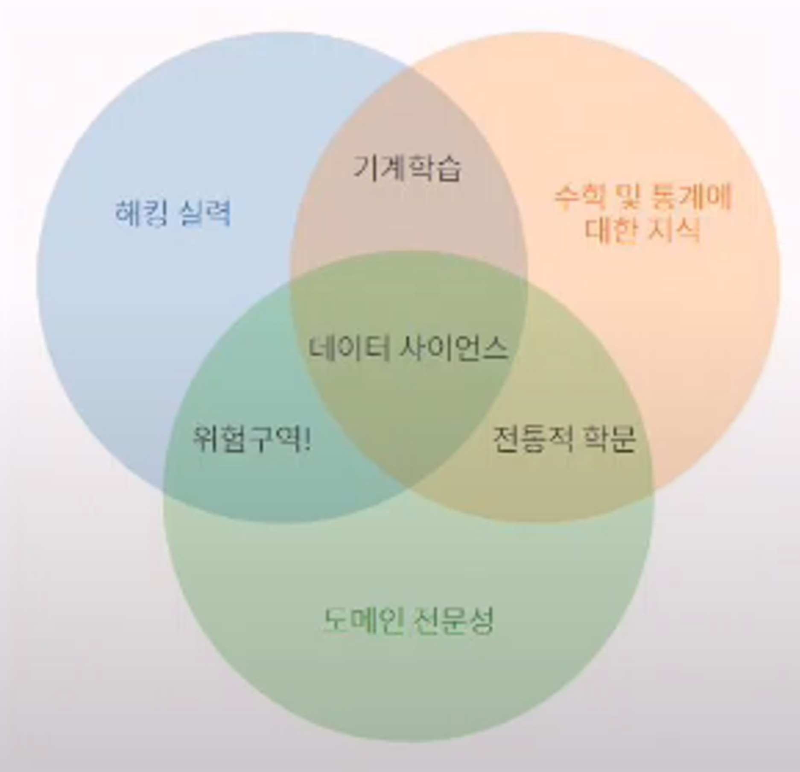

## 데이터 사이언스 (자료 과학)

---

- **다양한 데이터로부터 새로운 지식과 정보를 추출하기 위해**
    
    **과학적 방법론, 프로세스, 알고리즘, 시스템을 동원하는 융합 분야**
    
- 컴퓨터 과학, 통계학,수학 등 다양한 학문의 원리와 기술을 활용
    
    
    

---

### **필요한 정보를 추출하는 5가지 단계:**

1. **문제 정의:** 해결하고자 하는 문제 정의
2. **데이터 수집**: 문제 해결에 필요한 데이터 수집
3. **데이터 전처리(정제)**: 실질적인 분석을 수행하기 위해 **데이터를** **가공**하는 단계
    - 수집한 데이터의 오류 제거(결측치, 이상치), 데이터 형식 변환 등
4. **데이터 분석**: 전처리가 완료된 데이터에서 필요한 정보를 추출하는 단계 (AI 예측 모델)
5. **결과 해석 및 공유**: 의사 결정에 활용하기 위해 결과를 해석하고 시각화 후 공유하는 단계

---

### 데이터 수집:

1. **웹 스크래핑(Web Scraping):** 웹 페이지에서 데이터를 추출하는 기술
2. **웹 크롤링(Web Crawling):** 웹 페이지를 자동으로 탐색하고 데이터를 수집하는 기술
3. **Open API:** 공개된 API를 통해 데이터를 수집
4. **데이터 공유 플랫폼:** 다양한 사용자가 데이터를 공유하고 활용할 수 있는 온라인 플랫폼
    - 종류: [**캐글(Kaggle)**](https://www.kaggle.com/), Data world, **데이콘(Dacon)**, 공공데이터포털 등
    - 경진 대회도 많이 개최함

---

### CSV

- 몇 가지 필드를 **`,`로 구분한 텍스트 데이터 및 텍스트 파일**
- 일반적으로 **표 형식의 데이터**를 CSV 형태로 많이 사용
- **저장, 전송 및 처리 속도가 빠르며, 처리 가능한 프로그램이 다양함**

```python
이름, 생년, 월, 일, 성별
이성준, 1997, 5, 25, 남
이호준, 1999, 1, 17, 남
```

---

### 데이터 전처리 (정제)

- 분석을 진행하기 전 데이터를 정제하는 단계
- 다음과 같은 과정을 포함
    - 불완전하거나 오류가 있는 데이터를 제거하여 데잍으 ㅣ품질을 개선
    - 중복 데이터 제거
    - 분석하기 적절한 형식으로 데이터를 변환
- 데이터 전처리 및 분석에 사용되는 PYTHON 패키지
    - **`Numpy`, `Pandas`, `Matplotlib`**

### 자주 활용되는 PYTHON PACKAGE

**반드시 알아둘 것**

- **`Numpy` :**
    - 수학 계산용 패키지.
    - `Pandas`와 `Matplotlib`을 활용하기 위해 활용
- **`Pandas` :**
    - 원하는 데이터만 추출하거나 데이터를 분석할 때 활용
- **`Matplotlib` :**
    - 그래프를 그려주는 패키지

### Numpy:

**다차원 배열을 쉽게 처리하고 효율적으로 사용할 수 있도록 지원하는 파이썬 패키지**

**장점:**

- Numpy 행렬 연산은 데이터가 많을수록 **Python 반복문에 비해 훨씬 빠르다**
- **다차원 행렬 자료 구조를 제공**하여 개발하기 편하다

**특징:**

- CPython(공식 사이트의 Python)에서만 사용 가능
- **행렬 인덱싱**(Array_Indexing) 기능 제공

[**pjt02/1.Numpy_Basic 참고**](https://github.com/SJLee-0525/try_hw/blob/master/pjt/pjt02/live-code/numpy%26pandas/1.Numpy_Basic.ipynb)

---

### Pandas:

**Numpy의 한계:**

- **유연성**(데이터에 레이블을 붙이거나, 누락된 데이터로 작업)이 **부족**
- 그룹화, 피벗 등 **구조화가 부족**

**Pandas는 마치 프로그래밍 버전의 엑셀을 다루듯 고성능의 데이터 구조를 만들 수 있음**

Numpy 기반으로 만들어진 패키지: 

- **Series(1차원 배열)과 DataFrame(2차원 배열) 이라는 효율적인 자료 구조 제공**

[**pjt02/2.Pandas_Basic 참고**](https://github.com/SJLee-0525/try_hw/blob/master/pjt/pjt02/live-code/numpy%26pandas/2.Pandas_Basic.ipynb)

[**pjt02/3.Pandas_Advanced 참고**](https://github.com/SJLee-0525/try_hw/blob/master/pjt/pjt02/live-code/numpy%26pandas/3.Pandas_Advanced.ipynb)

---

### Matplotlib

- 파이썬에서 데이터 시각화를 위해 가장 널리 사용되는 라이브러리
- 다양한 종류의 그래프와 도표를 생성 / 데이터를 시각적으로 표현 가능

```python
pip install matplotlib
```

[**pjt02/4.Matplotlib_Basic 참고**](https://github.com/SJLee-0525/try_hw/blob/master/pjt/pjt02/live-code/numpy%26pandas/4.matplotlib_basic.ipynb)

https://docs.google.com/document/d/1mX-WxuoGs8Hy-QalhHcvuV17n50uGI2Sg_GHofgiePE/edit