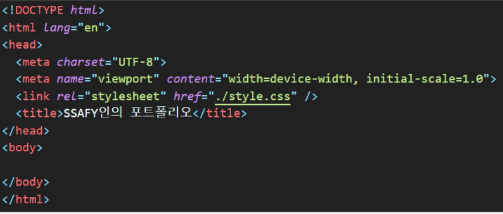

## 기본 구조 만들기

### 1. 파일 생성

1. index.html과 style.css를 생성
    1. emmet을 활용해 html 기본 템플릿을 자동완성 합니다
    2. style.css를 사용할 수 있도록 link 요소를 추가합니다
    
    
    

### 2. 전체 구조 만들기

1. 시맨틱 태그를 적절히 활용해 영역을 구분


*이 외에도 더 다양한 시멘틱 태그들이 존재함*

- 검색, gpt 활용
    
    ```html
    PROMPT
    
    개발자 자기 소개 페이지를 만드력고 해
    메뉴바, 꼬리말, 포트폴리오, 사용 기술을 넣을 거야
    
    시멘틱 태그 추천해줘 ...
    ```
    

```html
**- 포트폴리오 사이트에 다음과 같은 내용이 포함돼 있다고 가정**
	- 메뉴
	- 메인 콘텐츠
	- 자기 소개
	- 나의 기술 스택 소개
	- 진행한 프로젝트
	- 연락처 남기기
	- 꼬리말

- **아래와 같이 작성할 수 있음**	
<!DOCTYPE html>
<html>
  <head>
    <title>My Page</title>
    <style>
      .frontpage,
      .my-intro
      .skills
      .project
      .contact {
        height: 300px;
      }

      .frontpage,
      .skills,
      .contact {
        background-color: lightgray;
      }
    </style>
  </head>
  <body>
    <header class="header">
      <nav>네비게이션 바</nav>
    </header>
    <main id="frontpage" class="frontpage">FrontPage</main>
    <section id="my-intro" class="my-intro">My-intro</section>
    <section id="skills" class="skills">Skills</section>
    <section id="project" class="project">Project</section>
    <section id="contact" class="contact">Contact</section>
    <footer class="footer">Footer</footer>
  </body>
</html>
```

### **3. 구글 폰트 추가하기**

1. [**https://fonts.google.com/?subset=korean&script=Kore](https://fonts.google.com/?subset=korean&script=Kore)** 
2. **우측 하단 <link> 부분의 링크를 복사해 head 태그에 추가**

```html
<head>
		<link rel="preconnect" href="https://fonts.googleapis.com">
    <link rel="preconnect" href="https://fonts.gstatic.com" crossorigin>
    <link href="https://fonts.googleapis.com/css2?family=Yeon+Sung&display=swap" rel="stylesheet">
</head>
```

1. **style.css에 font-familly를 적용**

```html
* {
  font-family: "Yeon Sung", system-ui;
  font-weight: 400;
  font-style: normal;
}
```

### 4. 네비게이션 바 추가하기

1. https://getbootstrap.com/ 
2. 사용을 위해 CDN 추가
    
    ```html
    <head>
    	<link href="https://cdn.jsdelivr.net/npm/bootstrap@5.3.3/dist/css/bootstrap.min.css" rel="stylesheet" integrity="sha384-QWTKZyjpPEjISv5WaRU9OFeRpok6YctnYmDr5pNlyT2bRjXh0JMhjY6hW+ALEwIH" crossorigin="anonymous">
    </head>
    
    <body>
    	<script src="https://cdn.jsdelivr.net/npm/bootstrap@5.3.3/dist/js/bootstrap.bundle.min.js" integrity="sha384-YvpcrYf0tY3lHB60NNkmXc5s9fDVZLESaAA55NDzOxhy9GkcIdslK1eN7N6jIeHz" crossorigin="anonymous"></script>
    </body>
    ```
    
3. 공식 문서에 Navbar를 검색해 복사

- 네비게이션 바 요소들 배치하기
    
    ```html
    아래 볼드처리 된 margin 부분을 변경
    
    <div class="collapse navbar-collapse" id="navbarSupportedContent">
      <ul class="navbar-nav **mx-auto** mb-2 mb-md-0">
        <li class="nav-item">
          <a class="nav-link active" aria-current="page" href="#">Home</a>
        </li>
      </ul>
    </div>
    ```
    

- 네비게이션 바 고정시키기
    - 스크롤을 내려도 상단에 고정하기 위해 fixed-top 클래스 추가
    - 이 때 fixed 속성 추가시 화면이 잘리는 현상 발생
        - 이를 해결하기 위해 각 구역에 padding-top을 적절하게 추가
        
        ```html
        html
        <nav class="navbar navbar-expand-md bg-body-tertiary fixed-top">
        
        style.css
        .frontpage {
          padding-top: 4rem;
        }
        ```
        

- 네비게이션 바에 각 영역으로 이동하는 기능 할당하기
    - a태그의 href 속성에 각 영역의 id를 작성
    
    ```html
    **네비게이션 바**
    <li class="nav-item">
      <a class="nav-link" href="#my-intro">Intro</a>
    </li>
    <li class="nav-item">
      <a class="nav-link" href="#skills">Skills</a>
    </li>
    <li class="nav-item">
      <a class="nav-link" href="#project">Projects</a>
    </li>
    <li class="nav-item">
      <a class="nav-link" href="#contact">Contact</a>
    </li>
    
    **BODY**
    <section id="my-intro" class="my-intro col-12 col-md-6 col-lg-3">My-intro</section>
    <section id="skills" class="skills col-12 col-md-6 col-lg-3">Skills</section>
    <section id="project" class="project col-12 col-md-6 col-lg-3">Project</section>
    <section id="contact" class="contact col-12 col-md-6 col-lg-3"><i class="fa-brands fa-instagram"></i>Contact</section>
    ```
    

## 참고

**사이트 평가 해주는 곳?**

https://www.seobility.net/en/ 

live sever : html 파일의 변경 내용을 실시간으로 반영해주는 익스텐션

아이콘

https://fontawesome.com/ 

https://cdnjs.com/libraries/font-awesome