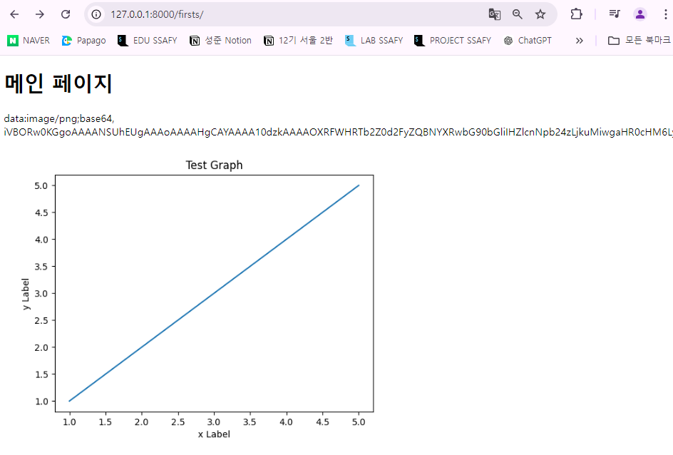
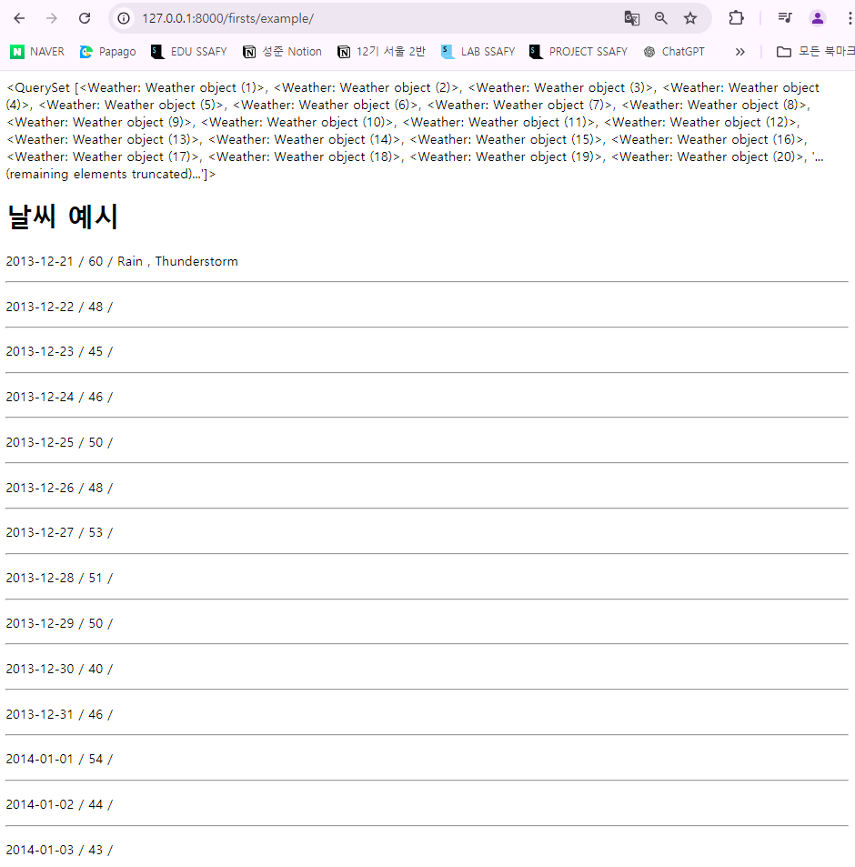

# 목표

Django에서 데이터 사이언스 패키지 사용하기

- Matplotlib, Pandas, Numpy를 Django에서 구동

# 이유:

Django에서 데이터 사이언스 패키지를 사용하는 이유

- 결과를 웹 페이지에서 보여주기 위함

# 기본 그래프 출력

- 아래 더미 데이터를 하드코딩 하자
    
    ```python
    x = [1, 2, 3, 4, 5]
    y = [1, 2, 3, 4, 5]
    ```
    
- Matplotlib을 활용해 그래프를 생성하고 화면을 출력하자

## View에서 Template으로 이미지 전달하기

- View에서 Template으로 이미지 형식의 데이터를 직접 전달할 수 없음
- 저장된 이미지의 경로를 전달해 Template에서 출력해야 함
- Matplotlib의 그래프를 버퍼에 이미지 형식으로 저장 후 저장된 경로를 전달
    - Buffer : 임시로 데이터를 저장하는 공간
- Python `BytesIO` Class
    - 파이썬의 내장 모듈인 `io` 모듈에 포함된 클래스
    - 메모리 내에 데이터를 저장 및 조작할 수 있는 기능 제공

```python
# firsts/urls.py

from django.contrib import admin
from django.urls import path, include
from . import views

app_name = 'firsts'
urlpatterns = [
    **path('', views.index, name='index'),**
]
```

```python
# firsts/views.py

from django.shortcuts import render
import matplotlib.pyplot as plt

# io: 입출력 연산을 위한 Python 표준 라이브러리
# BytesIO: 메모리 내에서 이진 데이터를 파일처럼 다룰 수 있는 버퍼를 제공
from io import BytesIO
import base64

# [참고] 터미널 에러
# UserWarning: Starting a Matplotlib GUI outside of the main thread will likely fail.
# plt 생성과 실제 화면을 그리는 곳이 서로 다른 곳에서 동작해 오류가 날 수 있다는 경고문
# 백엔드를 Agg로 설정해 해결할 수 있음

# - Agg 설정 : GUI 없이 서버 환경에서 그래프를 생성하겟다
plt.switch_backend('Agg')

def index(request):
    x = [1, 2, 3, 4, 5]
    y = [1, 2, 3, 4, 5]

    plt.clf()               # 그래프 초기화

    plt.plot(x, y)          # 그래프 그리기
    plt.title('Test Graph') # 그래프 이름
    plt.ylabel('y Label')   # y축 라벨
    plt.xlabel('x Label')   # x축 라벨

    # plt.show()            # 예전 출력 방식 (새 창으로 뜨는 문제)

# 1. 그려진 객체를 반환 받아서 넘기기 -> 지원 X
# 2. 이미지로 저장해서 반환하기 -> 간단하지만 용량 부담이 큼
# 3. 버퍼(임시 저장 공간)을 활용

    # 1. 비어있는 버퍼 생성
    buffer = BytesIO()

    # 2. 버퍼에 그래프를 저장
    plt.savefig(buffer, format='png') # jpg도 가능

    # 3. 버퍼의 내용을 base64를 활용해 인코딩
    image_base64 = base64.b64encode(buffer.getvalue()).decode('utf-8').replace('\n', '')
    # 버퍼에 가져와서 이진 데이터로 바꿔준 후 우리가 볼 수 있는 파일로 변환 후 오류 예방을 위해 줄바꿈 등을 대체
    # print(image_base64)

    # 4. 변환 완료 후에는 buffer를 닫아줌
    buffer.close()

    # 5. 내보내기
    # 이미지 데이터: 경로를 포함하고 있음
    context = {
        # 저장된 이미지의 경로를 전달
        'chart_image': f'data:image/png;base64, {image_base64}'
    }
    
    return render(request, 'firsts/index.html', context)
```

```html
<!-- firsts/index.html -->

<!DOCTYPE html>
<html lang="en">
<head>
  <meta charset="UTF-8">
  <meta name="viewport" content="width=device-width, initial-scale=1.0">
  <title>Document</title>
</head>
<body>
  <h1>메인 페이지</h1>
  {{ chart_image }}
  ****
</body>
</html>
```



## CSV 파일 활용하기

- 다운로드 받은 `test_data.csv` 를 pandas의 dataframe으로 구성
- 날짜 별 데이터를 DB에 저장
- 고려 사항
    - 사용자의 어떤 요청이 왔을 때 데이터를 저장할까?
    - 저장 요청이 두 번 온다면 중복된 데이터 처리는?
    - DB 테이블의 필드 구성은 어떻게 할까?

```
[firsts/data/test_data.csv] <- 사용하는 앱이 하나라면 앱에, 여럿이라면 base에

Date,TempAvgF,Events
2013-12-21,60,"Rain , Thunderstorm"
2013-12-22,48, 
2013-12-23,45, 
2013-12-24,46, 
2013-12-25,50, 
2013-12-26,48, 
2013-12-27,53, 
2013-12-28,51, 
2013-12-29,50, 
2013-12-30,40, 
2013-12-31,46, 
2014-01-01,54, 
2014-01-02,44, 
2014-01-03,43, 
2014-01-04,57, 
2014-01-05,47, 
2014-01-06,29, 
2014-01-07,35, 
2014-01-08,47,Rain
2014-01-09,62,Fog
2014-01-10,65,Rain
2014-01-11,62, 
2014-01-12,57,Rain
2014-01-13,57, 
2014-01-14,57, 
2014-01-15,52, 
2014-01-16,56, 
2014-01-17,54, 
2014-01-18,54, 
2014-01-19,59, 
2014-01-20,64, 
2014-01-21,51, 
2014-01-22,54, 
2014-01-23,42,"Rain , Snow"
2014-01-24,33, 
2014-01-25,48, 
2014-01-26,60, 
2014-01-27,47,Rain
...
```

```coq
# firsts/urls.py

from django.contrib import admin
from django.urls import path, include
from . import views

app_name = 'firsts'
urlpatterns = [
    path('', views.index, name='index'),
    **path('example/', views.example, name='example'),**
]
```

```python
# firsts/views.py

from django.shortcuts import render
import pandas as pd 
from .models import Weather

def example(reqeust):
    # 1. csv 파일을 읽기 (pandas)
    csv_path = 'firsts/data/test_data.csv' # 경로 
    df = pd.read_csv(csv_path)
    # print(df)

    # 2. DB에 저장 (복습용: 사실 안 해도 됨)
    # - 필드를 데이터를 보고 생성하는 연습
    # - DB 관련 로직을 구현하는 연습
    # - 중복된 데이터는 저장하지 않도록 구성
    for index, row in df.iterrows(): # 앞의 인덱스와 자료가 한 줄씩 들어옴
        # 저장하는 로직을 바로 구현하면 중복 저장되는 문제가 생길 수도
        # 해당 날짜에 데이터가 저장되어 있는지 확인하는 로직 필요
        # 왜 날짜 데이터냐: 날짜 데이터가 유일하게 구분 가능한 필드이기 때문
        if Weather.objects.filter(date=row['Date']).exists():
            continue
        weather = Weather(
            date=row['Date'],
            temp_avg_f=row['TempAvgF'],
            # Events 필드는 결측치를 포함하고 있기 때문에
            # - 아래 조건 처럼 여러 조건을 활용
            events=row['Events'] if pd.notna(row['Events']) else ""
        )
        weather.save()
    
    weathers = Weather.objects.all()
    context = {
        'weathers': weathers,
    }

    return render(reqeust, 'firsts/example.html', context)
```

```html
<!-- firsts/example.html -->

<!DOCTYPE html>
<html lang="en">
<head>
  <meta charset="UTF-8">
  <meta name="viewport" content="width=device-width, initial-scale=1.0">
  <title>Document</title>
</head>
<body>
  {{ weathers }}
  <h1>날씨 예시</h1>
  
    <p>{{ weather.date|date:"Y-m-d" }} / {{ weather.temp_avg_f }} / {{ weather.events }}</p>
    <hr>
  
</body>
</html>
```

