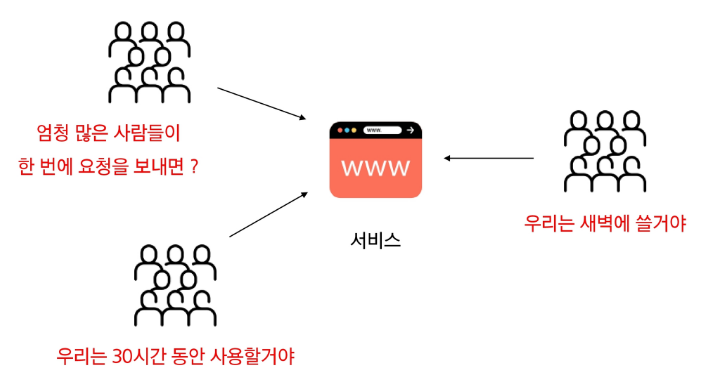
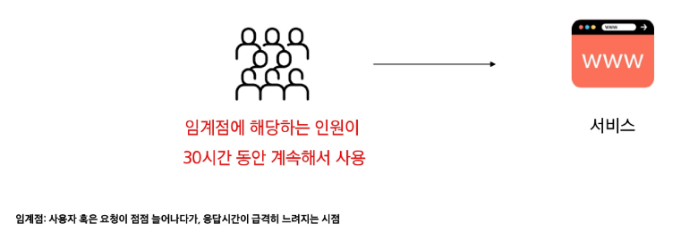
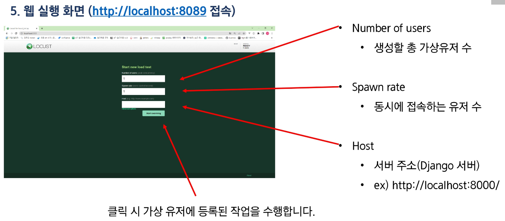
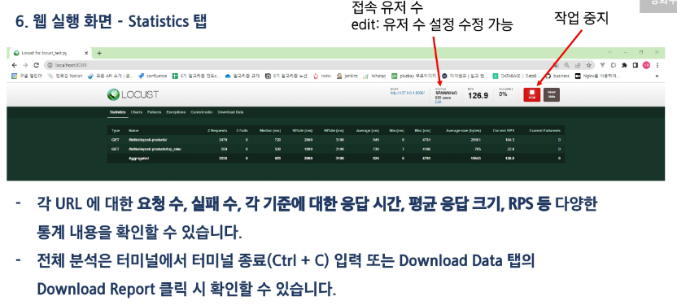
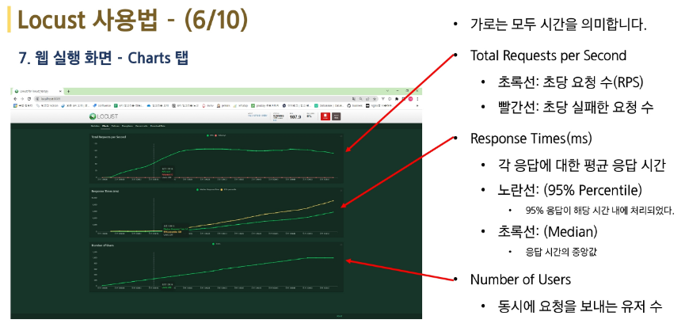
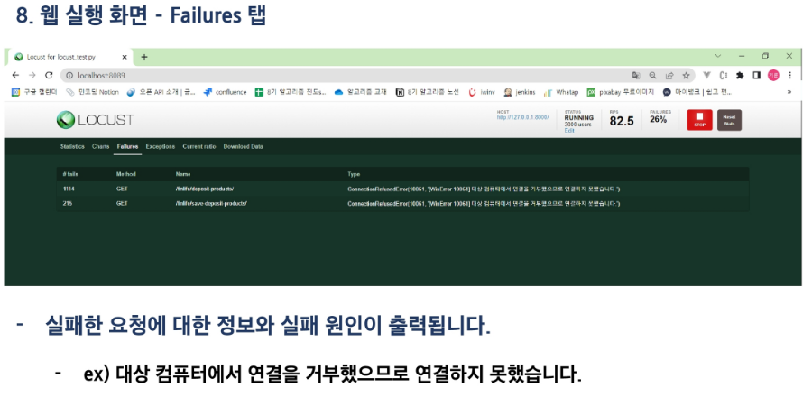
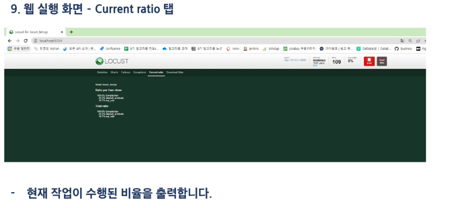
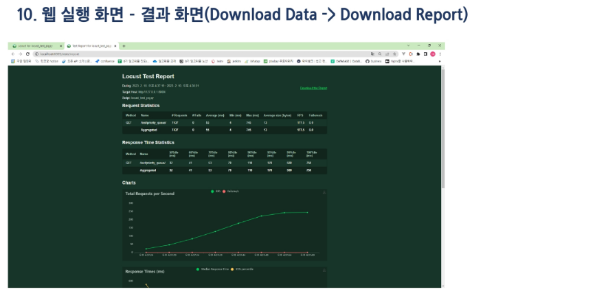
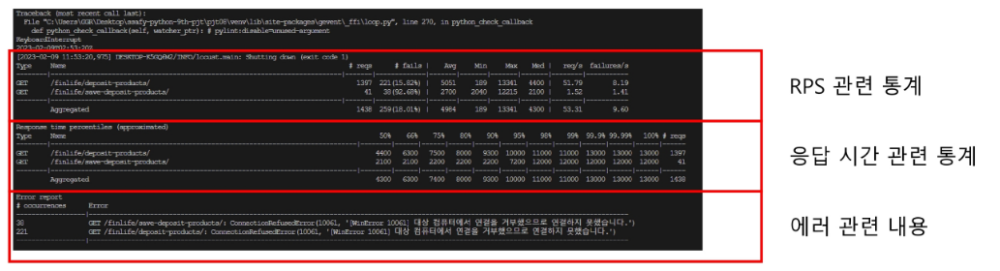

# Django에서 알고리즘 구현 및 성능 측정

# 테스트

- 원하는 기능이 모두 구현되었는지 확인하고, 숨겨져 있는 결함을 찾는 행동
- 여러 가지 도구를 활용하여, 버그를 찾아내고 , 신뢰성, 보안, 성능 등을 검증하는 중요한 단계
- 테스트의 종류를 매우 많으니, 상황에 맞게 필요한 테스트를 검색해서 사용해야 함

유닛 테스트

- 내가 개발한 개별 함수, 클래스 등이 잘 동작하는가

회귀 테스트

- 기존 코드들은 버그가 없는가

통합 테스트

- 여러 시스템을 붙였을 때 잘 동작하는가

## 성능 테스트

- 핵심적인 테스트 중 하나
- 특정 상황에서 시스템이 어느 정도 수준을 보이는가, 
혹은 어떻게 대처를 하는가를 테스트 하는 과정

### **목적**

- 여러 테스트를 통해 성능 저하가 발생하는 요인을 발견하고 제거
- 시장에 출시되기 전에 발생할 수 있는 위험과 개선 사항을 파악
- 안정적이고 신뢰할 수 있는 제품을 빠르게 만들기 위함

### **예시**



### 부하 테스트

시스템의 임계점의 부하가 계속될 때 문제가 없는가



**목적**:

시스템의 신뢰도와 성능을 측정

### 스트레스 테스트

시스템에 과부하가 오면 어떻게 작동할까


**목적:**

장애 조치와 복구 절차가 효과적이고 효율적인지 확인

### 부하 테스트 vs 스트레스 테스트

|  | **부하 테스트** | **스트레스 테스트** |
| --- | --- | --- |
| **도메인** | 성능 테스트의 하위 집합 | 성능 테스트의 하위 집합 |
| **테스트 목적** | 전체 시스템의 성능 확인 | 중단점에서의 동작,
복구 가능성 확인 |
| **테스트 방법** | 임계점까지의 
가상 유저 수를 유지하며 모니터링 | 중단점 이상까지
가상 유저를 점진적으로 증가 |
| **테스트 대상** | 전체 시스템 | 식별된 트랜잭션에만 집중하며 테스트 |
| **테스트 완료 시기** | 예상 부하가 모두 적용된 경우 | 시스템 동작이 중단되었을 경우 |
| **결과** | 부하 분산 문제
최대 성능
시간 당 서버 처리량 및 응답 시간
최대 동시 사용자 수 등 | 안정성
복구 가능성 |

# API 성능 테스트

## Locust

- 오픈 소스 부하 테스트 도구
- 테스트 중 메뚜기 떼가 웹 사이트를 공격한다는 의미로 착안된 이름
- 수많은 사용자들이 동시에 접속할 때 어떤 일이 벌어지는 지를 확인할 수 있는 도구
- 파이썬 언어로 테스트 시나리오를 간편하게 작성 가능
- 결과를 웹에서 확인할 수 있는 UI를 지원

### Lucust 사용법

1. Django 서버 실행

1. vscode 터미널 추가 & Locust 설치 및 실행
    
    ```bash
    (venv) $ pip install locust
    (venv) $ locust -f ./locust_test.py
    ```
    

1. Locust 정상 실행 시 아래와 같이 접속할 수 있는 URL이 출력됨
    
    ```bash
    $ locust -f ./locust_test.py 
    [2024-11-08 09:39:32,559] 2층PC104/INFO/locust.main: Starting web interface at **http://0.0.0.0:8089** (accepting connections from all network interfaces)   
    [2024-11-08 09:39:32,569] 2층PC104/INFO/locust.main: Starting Locust 2.17.0
    [2024-11-08 09:40:05,384] 2층PC104/INFO/locust.runners: Ramping to 100 users at a rate of 10.00 per second
    test start
    test start
    test start
    
    ```
    
    - http://0.0.0.0:8089 로 접속하면 에러가 남
        - http://localhost:8089/ 로 접속할 것

1. 웹 실행 화면
    
    
    











1. 콘솔 종료 화면
    - 콘솔에서 Locust 종료 (Ctrl + C)
        - 아래와 같이 전체 요청에 대한 분석을 콘솔에서 확인 가능
    
    
    

### 테스트 주의 사항

- 정석적으로는, 서버에 배포된 API 또는 프로그램에 부하 테스트를 해야함
- 하지만 오늘은 PC에서 작동 중인 서버로 요청을 보내는 것
    - PC의 성능에 따라 결과가 매우 달라짐
    - 현재 서버가 작동 중인 PC에서 테스트를 진행하므로, 테스트 중 다른 조작을 하면 안 됨