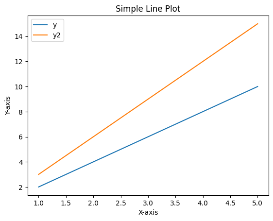

## 1. 필요 패키지 설치 및 import

```python
import numpy as np
import pandas as pd
import matplotlib.pyplot as plt
```

---

## 2. matplotlib 기본 사용법(라인 그래프 그리기)

```python
import matplotlib.pyplot as plt

# 데이터 생성
x = [1, 2, 3, 4, 5]  # x 좌표값
y = [2, 4, 6, 8, 10]  # y 좌표값

# 그래프 그리기
plt.plot(x, y)

# 그래프에 제목과 축 레이블 추가
plt.title('Simple Line Plot')
plt.xlabel('X-axis')
plt.ylabel('Y-axis')

# 그래프 표시
plt.show()
```


---

# 3. 두 가지 선 그리기

```python
# 데이터 생성
x = [1, 2, 3, 4, 5]  # x 좌표값
y = [2, 4, 6, 8, 10]  # y 좌표값
y2 = [3, 6, 9, 12, 15] # y2 좌표값

# 그래프 그리기
plt.plot(x, y, label='y')
plt.plot(x, y2, label='y2')

# 범례 추가
plt.legend()

# 그래프에 제목과 축 레이블 추가
plt.title('Simple Line Plot')
plt.xlabel('X-axis')
plt.ylabel('Y-axis')

# 그래프 표시
plt.show()
```



---

## 4. 막대 그래프 그리기

- 범주형 데이터를 시각화하기 위해 사용되며, 주로 범주 간의 비교를 위해 사용됨
- 각 막대는 독립적이며, 막대 간의 간격이 존재합니다.
- ex) 다양한 제품의 판매량 비교

```python
import matplotlib.pyplot as plt

# 데이터 생성
x = ['A', 'B', 'C', 'D', 'E']  # 카테고리
y = [3, 7, 2, 5, 9]  # 값

# 그래프 그리기
plt.bar(x, y)

# 그래프에 제목과 축 레이블 추가
plt.title('Bar Plot')
plt.xlabel('Category')
plt.ylabel('Value')

# 그래프 표시
plt.show()
```


---

## 5. 히스토그램 그리기

- 연속된 데이터의 분포를 시각화하기 위해 사용됨
- 데이터를 구간으로 나누고, 각 구간에 속하는 데이터의 빈도수 또는 밀도를 나타냄
- ex) 시험 점수의 분포, 연령대에 따른 인구 분포 등

```python
import matplotlib.pyplot as plt
import numpy as np

# 데이터 생성
data = np.random.randn(1000)  # 랜덤한 데이터

# 그래프 그리기
plt.hist(data, bins=30)

# 그래프에 제목과 축 레이블 추가
plt.title('Histogram')
plt.xlabel('Value')
plt.ylabel('Frequency')

# 그래프 표시
plt.show()
```


---

## 6. 데이터와 함께 활용해보기

- csv 파일을 읽어와 Pandas DataFrame 생성하기

```python
# Numpy 를 활용한 csv file open
def file_open_by_numpy():
# np.loadtxt(구분자 = ',', 데이터 타입: string)
np_arr = np.loadtxt('data/test_data.CSV', delimiter=",", encoding='cp949', dtype=str)
return np_arr

arr = file_open_by_numpy()

# 첫 번째 열을 헤더로 하는 데이터 프레임 생성
header = arr[0, :]  # 첫 번째 행을 헤더로 사용
data = arr[1:, :]  # 첫 번째 행을 제외한 나머지 데이터

df = pd.DataFrame(data, columns=header)
df.head()
```

|  | 이름 | 나이 | 성별 | 직업 | 사는곳 |
| --- | --- | --- | --- | --- | --- |
| 0 | 김현우 | 25 | 남 | 교수 | 경상남도 |
| 1 | 이태현 | 28 | 여 | 군인 | 경상북도 |
| 2 | 박현준 | 36 | 남 | 기자 | 서울/경기 |
| 3 | 최성민 | 34 | 남 | 리포터 | 강원도 |
| 4 | 정준우 | 45 | 남 | 모델 | 강원도 |

```python
df.dtypes
'''
이름     object
나이     object
성별     object
직업     object
사는곳    object
dtype: object
'''
```

```python
# 나이 필드를 숫자 형식으로 변환
df['나이'] = df['나이'].astype(int)

# 나이에 대한 히스토그램 출력
df['나이'].plot(kind='hist', bins=10)

# 그래프 제목 설정
plt.title('Age Distribution')

# x축 레이블 설정
plt.xlabel('Age')

# y축 레이블 설정
plt.ylabel('Count')

# 그래프 출력
plt.show()
```

