# Template Syntax

DOM을 기본 구성요소 인스턴스의 데이터에 선언적으로 바인딩할 수 있는, 
HTML 기반 템플릿 구문을 사용

## 종류

### Text Interpolation

**`<p>Message: {{ msg }}</p>`**

- 데이터 바인딩의 가장 기본적인 형태
- 이중 중괄호 구문 (콧수염 구문)을 사용
- 콧수염 구문은 해당 구성 요소 인스턴스의 `msg` 속성 값으로 대체
- `msg` 속성이 변경될 때마다 업데이트 됨

### **Raw HTML**

**`<div v-html="rawHtml"></div>`**

**`const rawHtml = ref('<span style="color:red">This should be red.</span>')`**

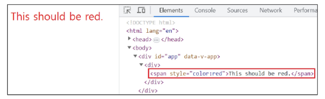

- 콧수염 구문은 데이터를 일반 텍스트로 해석하기 때문에,
실제 HTML을 출력하려면 `v-html` 을 사용해야 함

### Attribute Bindings

```jsx
<div v-bind:id="dynamicId></div>

const dynamicId = ref(’my-id’)
```

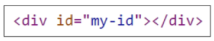

- 콧수염 구문은 HTML 속성 내에서 사용할 수 없기 때문에 `v-bind`를 사용
- HTML의 `id` 속성 값을 vue의 `dynamicId` 속성과 동기화 되도록 함
- 바인딩 값이 `null` 이나 `undefind` 인 경우 렌더링 요소에서 제거됨

### JavaScript Expressions

```jsx
{{ number + 1 }}

{{ ok ? 'YES' : 'NO' }}

{{ message.split('').reverse().join('' }}

<div v-bind:id="`list-${id}`"></div>
```

- Vue는 모든 데이터 바인딩 내에서 JavaScript 표현식의 모든 기능을 지원
- Vue 템플릿에서 JavaScript 표현식을 사용할 수 있는 위치
    1. 콧수염 구문 내부
    2. 모든 directive의 속성 값 (`v-` 로 시작하는 특수 속성)

**Expressions 주의 사항**

- 각 바인딩에는 하나의 단일 표현식만 포함될 수 있음
    - 표현식은 값으로 평가할 수 있는 코드 조각 (return 뒤에 사용할 수 있는 코드여야 함)
    
- 작동하지 않는 경우

```html
<!-- 표현식이 아닌 선언식 -->
{{ const number = 1 }}

<!-- 제어문은 삼항 표현식을 사용해야 함 -->
{{ if (ok) {return message} }}
```

# Directive

`v-` 접두사가 있는 특수 속성

### Directive 특징

- Directive의 속성 값은 단일 JavaScript 표현식이어야 함
(`v-for` , `v-on` 제외)
- 표현식 값이 변경될 때 DOM에 반응적으로 업데이트를 적용

- 예시
    
    ```jsx
    **<p v-if="seen">Hi there</p>**
    ```
    

## Directive 전체 구문

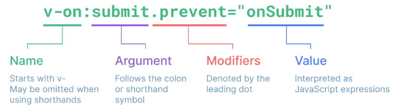

### Directive - Arguments

- 일부 directive는 directive 뒤에콜론(`:`) 으로 표시되는 인자를 사용할 수 있음
- 아래 예시의 `href`는 HTML `<a>` 요소의 `href` 속성 값을 myUrl 값에 바인딩하도록 하는 `v-bind`의 인자
    
    ```jsx
    **<a v-bind:href="myUrl">Link</a>**
    ```
    

- 아래 예시의 click은 이벤트 수신할 이벤트 이름을 작성하는 `v-on` 의 인자
    
    ```jsx
    **<button v-on:click="doSomething">button</button>**
    ```
    

### Directive - Modifiers

- `. (dot)` 로 표시되는 특수 접미사로, directive가  특별한 방식으로 바인딩되어야 함을 나타냄
- 아래 예시의 `.prevent` 는 발생한 이벤트에서 `event.preventDefault()`를 호출하도록 `v-on`에 지시하는 modifier
    
    ```jsx
    **<form v-on:submit.prevent="onSubmit">**
      <input type="submit">
    </form>
    ```
    

```jsx
<body>
  <div id="app">
    **<p v-if="seen">Hi there</p>**

    **<a v-bind:href="myUrl">Link</a>**

    **<button v-on:click="doSomething">button</button>

    <form v-on:submit.prevent="onSubmit">**
      <input type="submit">
    </form>
  </div>

  <script src="https://unpkg.com/vue@3/dist/vue.global.js"></script>
  <script>
    const { createApp, ref } = Vue

    const app = createApp({
      setup() {
        **const seen = ref(false) // 여부에 따라 p태그가 생기고 사라짐**
        const myUrl = 'https://www.google.co.kr/'
        const doSomething = function () {
          console.log('button clicked')
        }
        const onSubmit = function () {
          console.log('form submitted')
        }
        return {
          seen,
          myUrl,
          doSomething,
          onSubmit
        }
      }
    })

    app.mount('#app')
  </script>
</body>
```

## Built-in Directives

- `v-text`
- `v-show`
- `v-if`
- `v-for`

# Dynamically data binding

## `v-bind`

하나 이상의 속성 또는 컴포넌트 데이터를 표현식에 동적으로 바인딩

### **Attribute Bindings**

**속성 바인딩**

- HTML의 속성 값을 Vue의 상태 속성 값과 동기화 되도록 함

```jsx
<div id="app">
  
  <a v-bind:href="myUrl">Move to url</a>
  <p>Dynamic Attr</p>
</div>
```

- `v-bind` shorthand - `:` (약어)

```jsx
<div id="app">
  
  <a :href="myUrl">Move to url</a>
  <p>Dynamic Attr</p>
</div>
```

**Dynamic attribute name (동적 인자 이름)**

- 대괄호(`[]`)로 감싸서 directive argument에 javaSciprt 표현식을 사용할 수 있음
- 표현식에 따라 동적으로 평가된 값이 최종 argument 값으로 사용됨
    
    `<button :[key]="myValue"></button>`
    
    - 대괄호 안에 작성하는 이름은 반드시 소문자로만 구성 가능
    (브라우저가 속성 이름을 소문자로 강제 변환하기 때문)

```jsx
<body>
  <div id="app">
    
    <a :href="myUrl">Move to url</a>
    <p :[dynamicattr]="dynamicValue">Dynamic Attr</p>
  </div>

  <script src="https://unpkg.com/vue@3/dist/vue.global.js"></script>
  <script>
    const { createApp, ref } = Vue

    const app = createApp({
      setup() {
        const imageSrc = ref('https://picsum.photos/200')
        const myUrl = ref('https://www.google.co.kr/')
        const dynamicattr = ref('title')
        const dynamicValue = ref('Hello Vue.js')
        return {
          imageSrc,
          myUrl,
          dynamicattr,
          dynamicValue
        }
      }
    })

    app.mount('#app')
  </script>
</body>
```

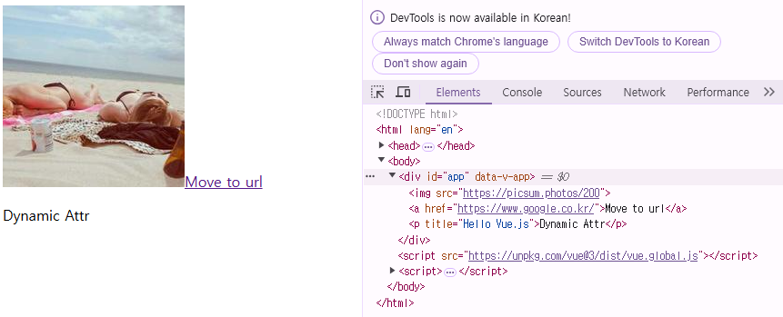

### Class and Style Bindings

- `class`와 `style`은 모두 HTML 속성이므로 다른 속성과 마찬가지로, 
`v-bind`를 사용하여 동적으로 문자열 값을 할당할 수 있음
- Vue는 `class` 및 `style` 속성 값을 `v-bind`로 사용할 때 
객체 또는 배열을 활용하여 작성할 수 있도록 함
    
    → 단순히 문자열 연결을 사용하여 이러한 값을 생성하는 것은
        번거롭고 오류가 발생하기가 쉽기 때문
    

### Binding HTML Classes

**Binding to Object**

**객체를 `:class`에 전달하여 클래스를 동적으로 전환할 수 있음**

1. isActive의 Boolean 값에 의해 active 클래스의 존재가 결정됨
    
    ```jsx
    const isActive = ref(true)
    
    <div :class="{ active:isActive }">Text</div>
    ```
    

1. `:class` directive를 일반 클래스 속성과 함께 사용 가능
    
    ```jsx
    const isActive = ref(true)
    const hasInfo = ref(true)
    
    <div class="static" :class="{ active: isActive, 'text-primary': hasInfo }">Text</div>
    // <div class="static text-primary">Text</div>
    ```
    

1. 반드시 inline 방식으로 작성하지 않아도 됨
    - 반응형 변수를 활용해 객체를 한 번에 작성하는 방법

```jsx
const isActive = ref(true)
const hasInfo = ref(true)
const classObj = ref({
  active: isActive,
  'text-primary': hasInfo,
})

<div class="static" :class="classObj">Text</div>
```

**Binding to Array**

1. `:class` 를 배열에 바인딩하여 클래스 목록을 적용할 수 있음
    
    ```jsx
    const activeClass = ref('active')
    const infoClass = ref('text-primary')
    
    <div :class="[activeClass, infoClass]">Text</div>
    // <div class="active text-primary">Text</div>
    ```
    

1. 배열 구문 내에서 객체 구문을 사용하는 경우
    
    ```jsx
    <div :class="[{ active: isActive }, infoClass]">Text</div>
    ```
    

```jsx
<!DOCTYPE html>
<html lang="en">

<head>
  <meta charset="UTF-8">
  <meta name="viewport" content="width=device-width, initial-scale=1.0">
  <title>Document</title>
  <style>
    .active {
      color: crimson;
    }

    .text-primary {
      color: blue;
    }
  </style>
</head>

<body>
  <div id="app">

    <!-- Binding to Objects -->
    <div :class="{ active:isActive }">Text</div>
    <div class="static" :class="{ active: isActive, 'text-primary': hasInfo }">Text</div>
    <div class="static" :class="classObj">Text</div>

    <!-- Binding to Arrays -->
    <div :class="[activeClass, infoClass]">Text</div>
    <div :class="[{ active: isActive }, infoClass]">Text</div>

  </div>

  <script src="https://unpkg.com/vue@3/dist/vue.global.js"></script>
  <script>
    const { createApp, ref } = Vue

    const app = createApp({
      setup() {
        const isActive = ref(true)
        const hasInfo = ref(true)
        const classObj = ref({
          active: isActive,
          'text-primary': hasInfo,
        })
        const activeClass = ref('active')
        const infoClass = ref('text-primary')
        return {
          isActive,
          hasInfo,
          classObj,

          activeClass,
          infoClass
        }
      }
    })

    app.mount('#app')
  </script>
</body>

</html>
```

### Binding Inline Styles

**Binding to Object**

1. `:style` 은 JavaScript 객체 값에 대한 바인딩을 지원 (HTML `style` 속성에 해당)
    
    ```jsx
    const activeColor = ref('crimson')
    const fontSize = ref(50)
    
    <div :style="{ color: activeColor, fontSize: fontSize + 'px' }">Text</div>
    // <div style="color: crimson; font-size: 50px;">Text</div>  
    ```
    

1. 실제 CSS에서 사용하는 것처럼 `:style` 은 `kebab-cased` 키 문자열도 지원
(단 camelCase 작성을 권장)
    
    ```jsx
    <div :style="{ 'font-size': fontSize + 'px' }">Text</div>
    
    // <div style="font-size: 50px;">Text</div>
    ```
    

1. 반드시 inline 방식으로 작성하지 않아도 됨
    - 반응형 변수를 활용해 객체를 한 번에 작성하는 방법
    
    ```jsx
    const styleObj = ref({
      color: activeColor,
      fontSize: fontSize.value + 'px'
    })
    
    <div :style="styleObj">Text</div>
    // <div style="color: crimson; font-size: 50px;">Text</div>  
    ```
    

### Binding Inline Style

**Binding to Arrays**

- 여러 스타일 객체를 배열에 작성해서 `:style` 을 바인딩할 수 있음
- 작성한 객체는 병합되어 동일한 요소에 적용
    
    ```jsx
    const styleObj2 = ref({
      color: 'blue',
      border: '1px solid black'
    })
    
    <div :style="[styleObj, styleObj2]">Text</div>
    ```
    

```jsx
<!DOCTYPE html>
<html lang="en">

<head>
  <meta charset="UTF-8">
  <meta name="viewport" content="width=device-width, initial-scale=1.0">
  <title>Document</title>
  <style>
  </style>
</head>

<body>
  <div id="app">
  <!-- Binding to Objects -->
    <div :style="{ color: activeColor, fontSize: fontSize + 'px' }">Text</div>
    <div :style="{ color: activeColor, 'font-size': fontSize + 'px' }">Text</div>
    <div style="color: crimson; font-size: 50px;">Text</div>  
    <div :style="styleObj">Text</div>

    <!-- Binding to Arrays -->
    <div :style="[styleObj, styleObj2]">Text</div>
  </div>

  <script src="https://unpkg.com/vue@3/dist/vue.global.js"></script>
  <script>
    const { createApp, ref } = Vue

    const app = createApp({
      setup() {
        const activeColor = ref('crimson')
        const fontSize = ref(50)
        const styleObj = ref({
          color: activeColor,
          fontSize: fontSize.value + 'px'
        })

        const styleObj2 = ref({
          color: 'blue',
          border: '1px solid black'
        })
        return {
          activeColor,
          fontSize,
          styleObj,
          styleObj2
        }
      }
    })

    app.mount('#app')
  </script>
</body>

</html>

```

# Event Handling

## `v-on`

DOM 요소에 이벤트 리스너를 연결 및 수신

### `v-on` 구성

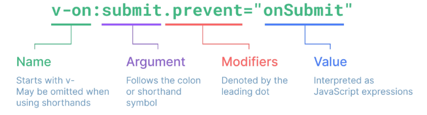

`v-on:event="handler"`

- **handler 종류**
    1. Inline handlers : 이벤트가 트리거 될 때 실행 될 JavaScript 코드
    2. Method handlers : 컴포넌트에 정의된 메서드 이름

- **`v-on` shorthand (약어)**
    - `@`
        
        `@event="handler"`
        

### Inline Handler

- 주로 간단한 상황에 사용
    
    ```jsx
    const count = ref(0)
    
    <button @click="count++">Add 1</button>
    <p>Count: {{ count }}</p>
    ```
    

**Inline Handlers 에서의 메서드 호출**

- 메서드 이름에 직접 바인딩하는 대신, Inline Handlers에서 메서드를 호출할 수도 있음
- 이렇게 하면 기본 이벤트 대신 사용자 지정 인자를 전달할 수 있음
    
    ```jsx
    const greeting = function (message) {
      console.log(message)
    }
        
    <button @click="greeting('hello')">Say hello</button>
    <button @click="greeting('bye')">Say bye</button>
    ```
    
    
    

**Inline Handlers에서의 event 인자에 접근하기**

- Inline Handlers에서 원래 DOM 이벤트에 접근하기
- `$event` 변수를 사용해서 메서드에 전달
    
    ```jsx
    const warning = function (message, event) {
      console.log(message)
      console.log(event)
    }
    
    <button @click="warning('경고입니다', $event)">Submit</button>
    ```
    
    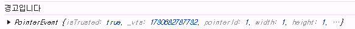
    

### Method Handlers

**Inline handlers로는 불가능한 대부분의 상황에서 사용**

```jsx
const name = ref('Alice')
const myFunc = function (event) {
  console.log(event)
  console.log(event.currentTarget)
  console.log(name.value)
}

<button @click="myFunc">Hello</button>
```

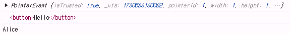

## Event Modifiers

- Event Modifiers를 활용해 
`event.preventDefault()` 와 같은 구문을 메서드에서 작성하지 않도록 함
- `stop` , `prevent` , `self` 등 다양한 modifiers를 제공

→ 메서드는 DOM 이벤트에 대한 처리보다는, 데이터에 관한 논리를 작성하는 것에 집중할 것

```jsx
<form @submit.prevent="onSubmit">
  <input type="submit">
</form>
<a @click.stop.prevent="onLink">...</a>
```

- Modifiers는 chained 되게끔 작성할 수 있으며
이 떄는 작성된 순서로 실행되기 때문에, 작성 순서에 유의할 것

### **`.prevent`**

```jsx
const onSubmit = function () {
  console.log('onSubmit')
}

<!-- event modifiers -->
<form @submit.prevent="onSubmit">
  <input type="submit">
</form>
```

### Key Modifiers

- 키보드 이벤트를 수신할 때 특정 키에 관한 별도 modifiers를 사용할 수 있음
- 예시
    - key가 Enter일 때만 onSubmit 이벤트를 호출하기
        
        `input @keyup.enter="onSubmit">`
        

# Form Input Bindings

`form`을 처리할 때 사용자가 `input` 에 입력하는 값을
실시간으로 JavaScript 상태에 동기화해야 하는 경우 (양방향 바인딩)

**양방향 바인딩 방법**

1. `v-bind`와 `v-on`을 함께 사용
2. `v-model` 사용

## `v-bind` with `v-on`

1. `v-bind` 를 사용하여 input 요소의 value 속성 값을 입력 값으로 사용
2. `v-on` 을 사용하여 `input` 이벤트가 발생할 때마다 `input` 요소의 `value` 값을 별도 반응형 변수에 저장하는 핸들러를 호출
    
    ```jsx
    <body>
      <div id="app">
        <p>{{ inputText1 }}</p>
        <input :value="inputText1" @input="onInput">
    
        <p>{{ }}</p>
        <input>
    
      </div>
    
      <script src="https://unpkg.com/vue@3/dist/vue.global.js"></script>
      <script>
        const { createApp, ref } = Vue
    
        const app = createApp({
          setup() {
            const inputText1 = ref('')
            const onInput = function (event) {
              inputText1.value = event.currentTarget.value
            }
            return {
              inputText1,
              onInput,
            }
          }
        })
    
        app.mount('#app')
      </script>
    </body>
    ```
    
    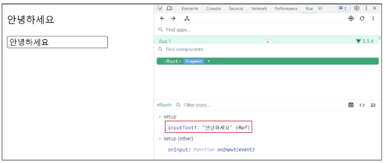
    

## `v-model`

`form input` 요소 또는 컴포넌트에서 양방향 바인딩을 만듦

### `v-model` 사용

- 사용자 입력 데이터와 반응형 변수를 실시간 동기화
    
    ```jsx
    <body>
      <div id="app">
        <p>{{ inputText1 }}</p>
        <input :value="inputText1" @input="onInput">
    
        **<p>{{ inputText2 }}</p>
        <input v-model="inputText2">**
    
      </div>
    
      <script src="https://unpkg.com/vue@3/dist/vue.global.js"></script>
      <script>
        const { createApp, ref } = Vue
    
        const app = createApp({
          setup() {
            const inputText1 = ref('')
            const onInput = function (event) {
              inputText1.value = event.currentTarget.value
            }
    
            const inputText2 = ref('')
            return {
              inputText1,
              onInput,
              **inputText2**
            }
          }
        })
    
        app.mount('#app')
      </script>
    </body>
    ```
    

→ IME가 필요한 언어(한국어, 중국어, 일본어 등)의 경우 `v-model` 이 제대로 업데이트되지 않음

→ 해당 언어에 대해 올바르게 응답하려면 `v-bind` 와 `v-on` 방법을 사용해야 함

## `v-model` 활용

- `v-model` 은 단순 Text input뿐만 아니라 `Checkbox, Radio, Select` 등
다양한 타입의 사용자 입력 방식과 함께 사용 가능

### `Checkbox` 활용

1. 단일 체크박스와 boolean 값 활용
    
    ```jsx
    <input type="checkbox" id="checkbox" v-model="checked">
    <label for="checkbox">{{ checked }}</label>
        
    const checked = ref(false)
    ```
    
    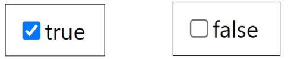
    

1. 여러 체크 박스와 배열 활용
    - 해당 배열에는 현재 선택된 체크 박스의 값이 포함됨
    
    ```jsx
    <!-- multiple checkbox -->
    <div>Checked names: {{ checkedNames }}</div>
    
    <input type="checkbox" id="alice" value="Alice" v-model="checkedNames">
    <label for="alice">Alice</label>
    
    <input type="checkbox" id="bella" value="Bella" v-model="checkedNames">
    <label for="bella">Bella</label>
    
    const checkedNames = ref([])
    ```
    
    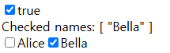
    

### `Select` 활용

- `select` 에서 `v-model` 표현식의 초기 값이 어떤 `option` 과도 일치하지 않는 경우,
`select` 요소는 선택되지 않은(unselected) 상태로 렌더링 됨
    
    ```jsx
    <select v-model="selected">
      <option disabled value="">Please select one</option>
      <option>Alice</option>
      <option>Bella</option>
      <option>Cathy</option>
    </select>
    
    const selected = ref('')
    ```
    
    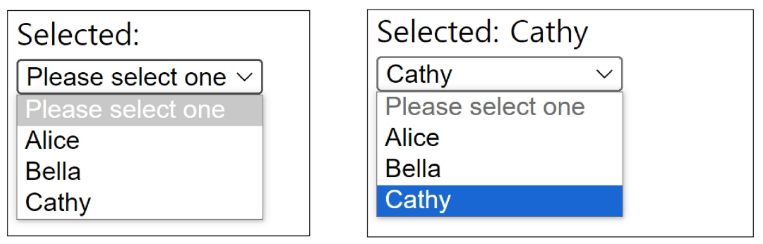
    

# 참고

## 접두어 `$`

### `$` 가 붙은 변수

- Vue 인스턴스 내에서 제공되는 내부 변수
    
    → 사용자가 지정한 반응형 변수나 메서드와 구분하기 위함
    
    → 주로 Vue 인스턴스 내부 상태를 다룰 때 사용
    

## IME

`Input Method Editor` 

- 사용자가 입력 장치에서 기본적으로 사용할 수 없는 문자(비영어권 언어)를 입력할 수 있또록 하는 운영 체제 구성 프로그램
- 일반적으로 키보드 키보다 자모가 더 많은 언어에서 사용해야 함

→ IME가 동작하는 방식과 Vue의 양방향 바인딩(`v-model`) 동작 방식이 상충하기 떄문에,
    한국어 입력 시 예상대로 동작하지 않았던 것