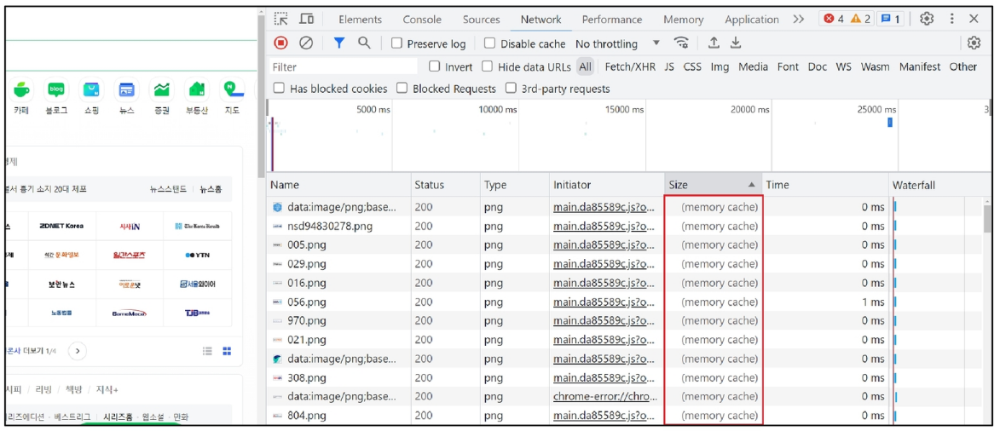
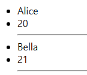
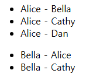
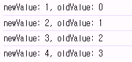
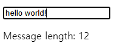
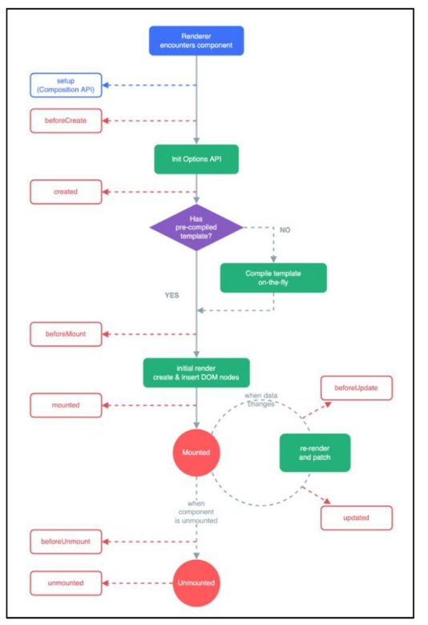
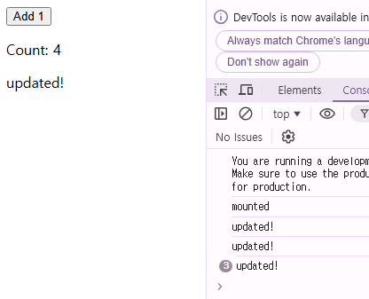

# Computed Property

## `computed()`

계산된 속성을 정의하는 함수

→ 미리 계산된 속성을 사용하여 템플릿에서 표현식을 단순하게 하고, 불필요한 반복 연산을 줄임

### `computed()` 가 필요한 경우

- 할 일이 남았는지 여부에 따라 다른 메시지를 출력하기
    
    ```html
    const todos = ref([
      { text: 'Vue 실습' },
      { text: '자격증 공부' },
      { text: 'TIL 작성' }
    ])
            
    <h2>남은 할 일</h2>
    <p>{{ todos.length > 0 ? '아직 남았다' : '퇴근!' }}</p>
    ```
    

→ 템플릿이 복잡해지며 todos에 따라 계산을 수행하게 됨

→ 만약 이 계산을 템플릿에 여러번 사용하는 경우에는 반복이 발생

- **`computed` 적용 후**
    - 반응형 데이터를 포함하는 복잡한 로직의 경우 
    `computed`를 활용하여 미리 값을 계산하여 계산된 값을 사용
    
    ```html
    const restOfTodos = computed(() => {
      return todos.value.length > 0 ? '아직 남았다' : '퇴근!'
    })
            
    <h2>남은 할 일</h2>
    <p>{{ restOfTodos }}</p>
    ```
    

### `computed` 특징

- 반환되는 값은 `computed ref` 이며 일반 `refs` 와 유사하게 
계산된 결과를 `.value` 로 참조할 수 있음 (템플릿에서는 `.value` 생략 가능)
- `computed` 속성은의존된 반응형 데이터를 자동으로 추적
- 의존하는 데이터가 변경될 때만 재평가
    - `restOfTodos`의 계산은 `todos` 에 의존하고 있음
    - 따라서 `todos` 가 변경될 때만 `restOfTodos` 가 업데이트 됨

### `computed` 주의 사항

- `computed` 는 읽기 전용 속성임
    
    ```html
    // computed 주의사항
    const a = ref(0)
    const abc = computed(() => {
      return a.value + 1
    })
    console.log(abc.value) // 1
    // computed는 읽기 전용이기 때문에 아래 코드는 경고가 발생한다.
    // Write operation failed: computed value is readonly
    console.log(abc.value++) // 1
    ```
    

## `Computed` vs `Methods`

**`computed` 속성 대신 `method` 로도 동일한 기능을 정의할 수 있음**

```html
const restOfTodos = computed(() => {
  return todos.value.length > 0 ? '아직 남았다' : '퇴근!'
})

const getRestOfTodos = function () {
  return todos.value.length > 0 ? '아직 남았다' : '퇴근!'
}

<h2>남은 할 일</h2>
<p>{{ restOfTodos }}</p>
<p>{{ getRestOfTodos() }}</p>
```

- **`computed` 속성은 의존된 반응형 데이터를 기반으로 캐시(cached) 됨**
    - 의존하는 데이터가 변경된 경우에만 재평가 됨
    - 즉 의존된 반응형 데이터가 변경되지 않는 한, 이미 계산된 결과에 대한 여러 참조는 
    다시 평가할 필요 없이 이전에 계산된 결과를 즉시 반환
- **반면 `method` 호출은 다시 렌더링이 발생할 때마다 항상 함수를 실행**

### Cache (캐시)

- 데이터나 결과를 일시적으로 저장해 두는 임시 저장소
- 이후에 같은 데이터나 결과를 다시 계산하지 않고 빠르게 접근할 수 있도록 함

**예시**

- 웹 페이지의 캐시 데이터
    - 과거 방문한 적이 있는 페이지에 다시 접속할 경우
    - 페이지 일부 데이터를 브라우저 캐시에 저장 후 같은 페이지에 다시 요청 시 
    모든 데이터를 다시 응답 받는 것이 아닌 
    일부 캐시 된 데이터를 사용하여 더 빠르게 웹 페이지를 렌더링
    
    
    

### `computed` 와 `method` 의 적절한 사용처

- **`computed` : 의존된 데이터가 변경되면 자동으로 업데이트**
    - 의존하는 데이터에 따라 결과가 바뀌는 계산된 속성을 만들 때 유용
    - 동일한 의존성을 가진 여러 곳에서 사용할 때 계산 결과를 캐싱하여 중복 계산 방지
- **`method` : 호출해야만 실행 됨**
    - 단순히 특정 동작을 수행하는 함수를 정의할 때 사용
    - 데이터에 의존하는지 여부와 관계 없이, 항상 동일한 결과를 반환하는 함수

→ 무조건 `computed` 만 사용하는 것이 아닌, 
    사용 목적과 상황에 맞게 `computed` 와 `method`를 적절히 조합하여 사용

# Conditional Rendering

```html
<!-- if else -->
const isSeen = ref(true)

<p v-if="isSeen">true일때 보여요</p>
<p v-else>false일때 보여요</p>
<button @click="isSeen = !isSeen">토글</button>
```

## `v-if`

표현식 값의 `true` / `false` 를 기반으로 요소를 조건부로 렌더링

## `v-else`

`v-else` directive를 사용하여 `v-if` 에 대한 `else` 블록을 나타낼 수 있음

## `v-else-if`

`v-else-if` directive를 사용해 `v-if` 에 대한 `else if` 블록을 나타낼 수 있음

```html
<!-- else if -->
const name = ref('Cathy')
 
<div v-if="name === 'Alice'">Alice입니다</div>
<div v-else-if="name === 'Bella'">Bella입니다</div>
<div v-else-if="name === 'Cathy'">Cathy입니다</div>
<div v-else>아무도 아닙니다.</div>
```

### 여러 요소에 대한 `v-if` 적용

- HTML template 요소에 `v-if` 를 사용하여, 하나 이상의 요소에 대해 적용할 수 있음
(`v-else`, `v-else-if` 모두 적용 가능)
    
    ```html
    <!-- v-if on <template> -->
    const name = ref('Cathy')
    
    <template v-if="name === 'Cathy'">
      <div>Cathy입니다</div>
      <div>나이는 30살입니다</div>
    </template>
    ```
    

**HTML `<template>` element**

- 페이지가 로드될 때 렌더링 되지 않지만, 
JavaScript를 사용하여 나중에 문서에서 사용할 수 있또록 하는 HTML을 보유하기 위한 메커니즘
    
    → 보이지 않는 `wrapper` 역할
    

## `v-if` vs `v-show`

### `v-show`

표현식 값의 `true/false` 를 기반으로 요소의 가시성을 전환

```html
<!-- v-show -->
const isShow = ref(false)

<div v-show="isShow">v-show</div>
<div style="display: none;">v-show</div>
```

- `v-show` 요소는 항상 DOM에 렌더링 되어있음
- CSS `display` 속성만 전환하기 때문

### `v-if` 와 `v-show` 의 적절한 사용처

- `v-if` (Cheap initial load / Expensive toggle)
    - 초기 조건이 `false` 인 경우 아무 작업도 수행하지 않음
    - 대신 토글 비용이 높음
- `v-show` (Expensive initial load / Cheap Toggle)
    - 초기 조건에 관계 없이 항상 렌더링
    - 초기 렌더링 비용이 더 높음
    

→ **콘텐츠를 매우 자주 전환해야 하는 경우에는 `v-show`를,
    실행 중에 조건이 변경되지 않는 경우에는 `v-if` 를 권장**

# List Rendering

## `v-for`

**소스 데이터를 기반으로 요소 또는 템플릿 블록을 여러 번 렌더링**
(소스 데이터: `Array, Object, Number, String, Iterable` )

### `v-for` 구조

- `v-for` 는 `alias in expression` 형식의 특수 구문을 사용
    
    ```html
    <div v-for="item in items">
      {{ item.text }}
    </div>
    ```
    
- 인덱스 (객체에서는 key)에 대한 별칭을 지정할 수 있음
    
    ```html
    <div v-for="(item, index) in arr"></div>
    
    <div v-for="value in object"></div>
    <div v-for="(value, key) in object"></div>
    <div v-for="(value, key, index) in object"></div>
    ```
    

### `v-for` 예시

**배열 반복**

```html
<!-- v-for -->
const myArr = ref([
  { name: 'Alice', age: 20 },
  { name: 'Bella', age: 21 }
])

<div v-for="(item, index) in myArr">
  {{ index }} / {{ item }} 
</div>

/*
0 / { "name": "Alice", "age": 20 }
1 / { "name": "Bella", "age": 21 }
*/
```

**객체 반복**

```html
const myObj = ref({
  name: 'Cathy',
  age: 30
})

<div v-for="(value, key, index) in myObj">
  {{ value }} / {{ key }} / {{ index }}
</div>

/*
Cathy / name / 0
30 / age / 1
*/
```

### 여러 요소에 대한 `v-for` 적용

HTML template 요소에 `v-for` 를 사용하여 하나 이상의 요소에 대해 반복 렌더링 할 수 있음

```html
<!-- v-for on <template> -->
const myArr = ref([
  { name: 'Alice', age: 20 },
  { name: 'Bella', age: 21 }
])

<ul>
  <template v-for="item in myArr">
    <li>{{ item.name }}</li>
    <li>{{ item.age }}</li>
    <hr>
  </template>
</ul>
```



### 중첩된 `v-for`

각 `v-for` 의 하위 영역(scope)은 상위 영역에 접근할 수 있음

```html
// nested v-for
const myInfo = ref([
  { name: 'Alice', age: 20, friends: ['Bella', 'Cathy', 'Dan'] },
  { name: 'Bella', age: 21, friends: ['Alice', 'Cathy'] }
])
    
<ul v-for="item in myInfo">
  <li v-for="friend in item.friends">
    {{ item.name }} - {{ friend }}
  </li>
</ul>
```



## `v-for` with key

**반드시 `v-for` 와 `key`를 함께 사용한다**

내부 컴포넌트의 상태를 일관되게 하여 데이터의 예측 가능한 행동을 유지하기 위함

### `v-for` 와 `key`

`key` 는 반드시 각 요소에 대한 고유한 값을 나타낼 수 있는 식별자여야 함

```html
<!-- 
  "올바른 key 사용법"

  1. 권장되는 key 값
  - 데이터베이스의 고유 ID
  - 항목의 고유한 식별자
  - 변경되지 않는 속성 값

  2. 피해야 할 사항
  - 배열의 인덱스를 key로 사용하는 것
  - 객체를 key로 사용하는 것
-->

<!-- Maintaining State with key -->
<!-- key 속성은 Vue의 내부 Virtual DOM 알고리즘이 노드를 식별하는 데 필수적인 힌트를 제공 -->
<!-- 에러가 발생하지 않더라도 key 속성을 사용하는 것이 Vue 애플리케이션의 안정성과 성능을 위해 매우 중요 -->
const items = ref([
  { id: id++, name: 'Alice' },
  { id: id++, name: 'Bella' }
])

<div v-for="item in items" :key="item.id">
  {{ item.name }}
</div>
```

**내장 특수 속성 `key`**

- `number` 또는 `string` 으로만 사용해야 함
- Vue의 내부 가상 DOM 알고리즘이 이전 목록과 새 노드 목록을 비교할 때
각 node를 식별하는 용도로 사용
    
    → Vue 내부 동작 관련된 부분이기에, 최대한 작성하려고 노력할 것
    

## `v-for` with `v-if`

**동일 요소에 `v-for` 와 `v-if` 를 함께 사용하지 않는다**

: 동일한 요소에서 `v-if` 가 `v-for` 보다 우선 순위가 더 높기 때문

**→ `v-if` 에서의 조건은 `v-for` 범위의 변수에 접근할 수 없음**

### `v-for` 와 `v-if` 문제 상황

- todo 데이터 중 이미 처리한 `(isComplete === true) todo` 만 출력하기
    
    ```html
    let id = 0
    
    const todos = ref([
      { id: id++, name: '복습', isComplete: true },
      { id: id++, name: '예습', isComplete: false },
      { id: id++, name: '저녁식사', isComplete: true },
      { id: id++, name: '노래방', isComplete: false }
    ])
    
    <!-- [Bad] v-for with v-if -->
    <!-- 동일 요소에 v-for와 v-if를 함께 사용하지 않는다. -->
    <ul>
      <li v-for="todo in todos" v-if="!todo.isComplete" :key="todo.id">
        {{ todo.name }}
      </li>
    </ul>
    
    **// Uncaught TypeError: Cannot read properties of undefined (reading 'get')**
    ```
    
- `v-if` 가 더 높은 우선 순위를 가지므로,
`v-for` 범위의 `todo` 데이터를 `v-if`에서 사용할 수 없음
(`todo` 가 정의되기 전에 `v-if` 가 동작해버림)

### `v-for`와 `v-if` 해결법

1. **`computed` 활용**
    
    `computed` 를 활용해 이미 필터링 된 목록을 반환하여 반복하도록 설정
    
    ```html
    <!-- [Good] computed 활용 -->
    <!-- 해결책 1. computed를 활용해 이미 필터링 된 목록을 반환하여 반복 -->
    
    let id = 0
    
    const todos = ref([
      { id: id++, name: '복습', isComplete: true },
      { id: id++, name: '예습', isComplete: false },
      { id: id++, name: '저녁식사', isComplete: true },
      { id: id++, name: '노래방', isComplete: false }
    ])
    
    const completeTodos = computed(() => {
      return todos.value.filter((todo) => !todo.isComplete)
      // todo.isComplete가 false인 애들만 반환해 배열 생성
    })
    console.log(completeTodos.value)
        
    
    <ul>
      <li v-for="todo in completeTodos" :key="todo.id">
        {{ todo.name }}
      </li>
    </ul>
    ```
    

1. **`v-for` 와 `<template>` 요소 활용**
    
    `v-for`와 `template` 요소를 사용하여 `v-if` 위치로 이동
    
    ```html
    <!-- [Good] template 활용 -->
    <!-- 해결책 2. template 요소를 사용하여 v-for와 v-if의 위치를 분리 -->
    let id = 0
    
    const todos = ref([
      { id: id++, name: '복습', isComplete: true },
      { id: id++, name: '예습', isComplete: false },
      { id: id++, name: '저녁식사', isComplete: true },
      { id: id++, name: '노래방', isComplete: false }
    ])
    
    const completeTodos = computed(() => {
      return todos.value.filter((todo) => !todo.isComplete)
      // todo.isComplete가 false인 애들만 반환해 배열 생성
    })
    console.log(completeTodos.value)
    
    <ul>
      <template v-for="todo in todos" :key="todo.id">
        <li v-if="!todo.isComplete">
          {{ todo.name }}
        </li>
      </template>
    </ul>
    ```
    

# Wathcers

## `watch()`

**하나 이상의 반응형 데이터를 감시하고, 감시하는 데이터가 변경되면 콜백 함수를 호출**

### `watch` 구조

```jsx
watch(source, (newValue, oldValue) => {
	// do something
}) 
```

- **첫 번째 인자 `source` :**
    - `watch` 가 감시하는 대상 (반응형 변수, 값을 반환하는 함수 등)

- **두 번째 인자 `callback function` :**
    
    `source` 가 변경될 때 호출되는 콜백 함수
    
    1. `newValue`
    2. `oldValue` (optional)

### `watch` 기본 동작

```html
<button @click="count++">Add 1</button>
<p>Count: {{ count }}</p>

const count = ref(0)

watch(count, (newValue, oldValue) => {
  console.log(`newValue: ${newValue}, oldValue: ${oldValue}`)
})
```



### `watch` 예시

- 감시하는 변수에 변화가 생겼을 때 연관 데이터 업데이트하기
    
    ```html
    <input v-model="message">
    <p>Message length: {{ messageLength }}</p>
    
    const message = ref('')
    const messageLength = ref(0)
    
    watch(message, (newValue) => {
      messageLength.value = newValue.length
    })
    ```
    
    
    

### 여러 `source` 를 감시하는 `watch`

배열을 활용해 여러 대상을 감시할 수 있음

```html
watch([foo, bar], ([newFoo, newBar], [prevFoo, prevBar]) => {
	/* ... */
})
```

## `Computed` vs `Watchers`

|  | **`Computed`** | **`Watchers`** |
| --- | --- | --- |
| **공통점** | 데이터의 변화를 감지하고 처리 | 데이터의 변화를 감지하고 처리 |
| **동작** | 의존하는 데이터 속성의 
**계산된 값을 반환** | 특정 데이터 속성의 변화를 감시하고 
**작업을 수행**  (`side-effects`) |
| **사용 목적** | 계산된 값을 캐싱하여 
재사용 중복 계산 방지 | 데이터 변화에 따른 
특정 작업을 수행 |
| **사용 예시** | 연산 된 길이, 
필터링 된 목록 계산 등 | DOM 변경, 
다른 비동기 작업 수행, 
외부 API와 연동 등 |

**→ `computed`와 `watch` 모두 의존(감시)하는 원본 데이터를 직접 변경하지 않음**

# Lifecycle Hooks

**Vue 컴포넌트의 생성부터 소멸까지 각 단계에서 실행되는 함수**

### Lifecycle Hooks Diagram

- 컴포넌트의 생애 주기 중간 중간에 함수를 제공
    
    → 개발자는 컴포넌트의 특정 시점에 원하는 로직을 실행할 수 있음
    
    
    

### Lifecycle Hooks 활용 예시

**Mounting**

1. Vue 컴포넌트 인스턴스가 초기 렌더링 및 DOM 요소 생성이 완료된 후 특정 로직을 수행하기
    
    ```html
    const { createApp, ref, onMounted } = Vue
    
    const app = createApp({
    setup() {
      const count = ref(0)
      const message = ref(null)
      onMounted(() => {
        console.log('mounted')
      })
    }
    ```
    

1. 반응형 데이터의 변경으로 인해 컴포넌트의 DOM이 업데이트된 후 특정 로직을 수행하기
    
    ```html
    <div id="app">
      <button @click="count++">Add 1</button>
      <p>Count: {{ count }}</p>
      <p>{{ message }}</p>
    </div>
    
    const app = createApp({
    setup() {
      const count = ref(0)
      const message = ref(null)
      onMounted(() => {
        console.log('mounted')
      })
      onUpdated(() => {
        console.log('updated!')
      })
    }
    
    ```
    
    
    

### 주요 Lifecycle Hooks

- 생성 단계 / 마운트 단계 / 업데이트 단계 / 소멸 단계 등 다양한 단계 존재
- 가장 일반적으로 사용되는 것은 `onMounted`, `onUpdated`, `onUnmounted`

# Vue Style Guide

Vue의 스타일 가이드 규칙은 우선 순위에 따라 4가지 범주로 나뉨

- **우선순위 A : 필수 (Essential)**
    - 오류를 방지하는 데 도움이 되므로 어떤 경우에도 규칙을 학습하고 준수
        - `v-for`에 `key` 작성하기, 동일 요소에 `v-if`와 `v-for` 함께 사용하지 말기
- **우선순위 B : 적극 권장 (Strongly Recommended)**
    - 가독성 및/또는 개발자 경험을 햐앙시킴
    - 규칙을 어겨도 코드는 여전히 실행되겠지만, 정당한 사유가 있어야 규칙 위반 가능
- **우선순위 C : 권장 (Recommended)**
    - 일관성을 보장하도록 임의의 선택을 할 수 있음
- **우선순위 D : 주의 필요 (Use with Caution)**
    - 잠재적 위험 특성을 고려함

# 참고

## `computed` 주의 사항

### **`computed` 의 반환 값은 변경하지 말 것**

- `computed` 의 반환 값은 의존하는 데이터의 파생된 값
    - 이미 의존하는 데이터에 의해 계산이 완료된 값
- 일종의 snapshot이며 의존하는 데이터가 변경될 때만 새 snapshot이 생성됨
- 계산된 값은 읽기 전용으로 취급되어야 하며, 변경되어서는 안 됨
- 대신 새 값을 얻기 위해서는 의존하는 데이터를 업데이트 해야 함

### `computed` 사용 시 원본 배열 변경하지 말 거

- `computed`에서 `reverse()` 및 `sort()` 사용 시 원본 배열을 변경하기 때문에,
원본 배열의 복사본을 만들어서 진행해야 함
    
    ```html
    return [...numbers].reverse()
    ```
    

## Lifecycle Hooks 주의 사항

### Lifecycle Hooks는 동기적으로 작성할 것

1. 컴포넌트 상태의 일관성 유지
    - 컴포넌트의 생명 주기 동안 상태가 예측 가능하고, 일관되게 유지되도록 보장
    - 비동기적으로 실행될 경우, 
    컴포넌트의 상태가 예상치 못한 시점에 변경될 수 있어 버그 발생 가능성이 높아짐

1. Vue 내부 매커니즘과의 동기화
    - Vue의 내부 로직은 컴포넌트의 라이프 사이클에 맞춰 최적화돼 있음
    - 동기적 실행을 통해 
    Vue의 내부 프로세스와 개발자가 작성한 코드가 정확히 동기화될 수 있음
    
    - 비동기적으로 작성한 Lifecycle Hooks 예시
        
        ```html
        setTimeout(() => {
        	onMounted(() => {
        		console.log('이 코드는 실행되지 않습니다')
        	})
        ), 100)
        ```
        

## 배열과 `v-for` 관련

### 배열 변경 관련 메서드

- **`v-for` 와 배열을 함께 사용 시 배열의 메서드를 주의해서 사용해야 함**

1. **변화 메서드**
    - 호출하는 원본 배열을 변경
    - `push(), pop(), shift(), unshift(), splice(), sort(), reverse()`

1. **배열 교체**
    - 원본 배열을 수정하지 않고 항상 새 배열을 반환
    - `filter(), concat(), slice()`

### `v-for`와 배열을 활용해 필터링/정렬 활용하기

**원본 데이터를 수정하거나 교체하지 않고,
필터링하거나 정렬된 새로운 데이터를 표시하는 방법**

1. `computed` 활용
    - 원본 기반으로 필터링 된 새로운 결과를 생성
        
        ```html
        <!-- 1. computed 활용 -->
        <!-- 
          - 단순 배열의 필터링/정렬에 적합
         -->
        <ul>
          <li v-for="num in evenNumbers">
            {{ num }}
          </li>
        </ul>
            
          const numbers = ref([1, 2, 3, 4, 5])
        
          // 1. computed를 사용한 짝수 필터링
          const evenNumbers = computed(() => {
            return numbers.value.filter((number) => number % 2 === 0)
          })
        ```
        

1. `method` 활용 
    - `computed`가 불가능한 중첩된 `v-for`에 경우 사용
        
        ```html
        <!-- 2. method (computed가 불가능한 중첩된 v-for 경우) -->
        <!-- 
          - 중첩된 v-for에서 사용
          - 매개변수가 필요한 경우 사용
        -->
        <ul v-for="numbers in numberSets">
          <li v-for="num in evenNumberSets(numbers)">
            {{ num }}
          </li>
        </ul>
        
        const app = createApp({
          setup() {
            const numberSets = ref([
              [1, 2, 3, 4, 5],
              [6, 7, 8, 9, 10]
            ])
            
            // 2. method를 사용한 짝수 필터링
            const evenNumberSets = function (numbers) {
              return numbers.filter((number) => number % 2 === 0)
            }
          }
        })
        ```
        

### 주의: 배열의 인덱스를 `v-for`의 `key`로 사용하지 말 거

```html
<div v-for="(item, index) in items" :key="index">
	<!-- content -->
</div>
```

- 인덱스는 식별자가 아닌 배열의 항목 위치만 나타내기 때문
- 만약 새 요소가 배열의 끝이 아닌 위치에 삽입되면
이미 반복한 구성 요소 데이터가 함께 업데이트 되지 않기 때문

**→ 직접 고유한 값을 만들어내는 메서드를 생성하거나,
    외부 라이브러리 등을 활용하는 등 식별자 역할을 할 수 있는 값을 만들어 사용**