# Passing Props

## Props

**부모 컴포넌트로부터 자식 컴포넌트로 데이터를 전달하는데 사용하는데 사용되는 속성**

**동일한 데이터, 하지만 다른 컴포넌트**

- 동일한 사진 데이터가 한 화면에 다양한 위치에서 여러 번 출력되고 있음
- 하지만 해당 페이지를 구성하는 컴포넌트가 여러 개라면, 
각 컴포넌트가 개별적으로 동일한 데이터를 관리해야 할까?
- 그렇게 한다면 사진을 변경해야 할 때 모든 컴포넌트에 대해 변경 요청을 해야 함
    
    → 공통된 부모 컴포넌트에서 관리하자
    
    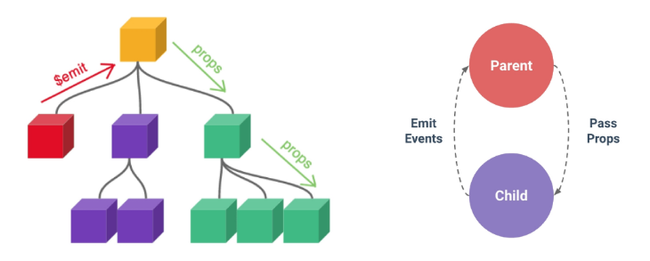
    
    **부모는 자식에게 데이터를 전달(Pass Props)하며,
    자식은 자신에게 일어난 일을  부모에게 알림(Emit event)**
    

### Props 특징

- 부모 속성이 업데이트되면 자식으로 전달 되지만, 그 반대는 안 됨
- 즉 자식 컴포넌트 내부에서 `props`를 변경하려고 시도해서는 안 되며 불가능
- 또한 부모 컴포넌트가 업데이트될 때마다 
이를 사용하는 자식 컴포넌트의 모든 `props`가 최신 값으로 업데이트 됨

**→ 부모 컴포넌트에서만 변경하고, 이를 내려 받는 자식 컴포넌트는 자연스럽게 갱신**

### One-Way Data Flow

모든 `props`는 자식 속성과 부모 속성 사이에 하향식 단방향 바인딩을 형성 (one-way-down binding)

**단방향인 이유**

- 하위 컴포넌트가 실수로 상위 컴포넌트의 상태를 변경하여
앱에서의 데이터 흐름을 이해하기 어렵게 만드는 것을 방지하기 위함

→ 데이터 흐름의 일관성 및 단순화

## `Props` 선언

### 사전 준비

1. vue 프로젝트 생성
    
    `npm create vue@latest`
    
2. 초기 생성된 컴포넌트 모두 삭제 (`App.vue` 제외)
3. `src/assets` 내부 파일 모두 삭제
4. `main.js` 내 `import '/assets/main.css'` 삭제
5. `App > Parent > ParentChild` 컴포넌트 관계 작성
    - `App` 컴포넌트 작성
        
        ```html
        <!-- App.vue -->
        
        <template>
          <div>
            <Parent />
          </div>
        </template>
        
        <script setup>
        import Parent from '@/components/Parent.vue';
        </script>
        
        <style scoped>
        </style>
        ```
        
    
    - `Parent` 컴포넌트 작성
        
        ```html
        <!-- Parent.vue -->
        
        <template>
          <div>
            <ParentChild />
          </div>
        </template>
        
        <script setup>
        import ParentChild from '@/components/ParentChild.vue';
        </script>
        
        <style scoped>
        </style>
        ```
        
    
    - `ParentChild` 컴포넌트 작성
        
        ```html
        <!-- ParentChild.vue -->
        
        <template>
          <div></div>
        </template>
        
        <script setup>
        </script>
        
        <style scoped>
        </style>
        ```
        

### Props 작성

- **부모 컴포넌트 `Parent`에서 자식 컴포넌트 `ParentChild` 에 보낼 `props` 작성**
    
    
    
    ```html
    <!-- Parent.vue -->
    
    <template>
      <div>
        <ParentChild
          my-msg="message"
        />
      </div>
    </template>
    
    <script setup>
    import ParentChild from '@/components/ParentChild.vue';
    </script>
    
    <style scoped>
    </style>
    ```
    

### Props 선언

**부모 컴포넌트에서 내려 보낸 `props` 를 사용하기 위해서는,
자식 컴포넌트에서 명시적인 `props` 선언이 필요**

- `defineProps()` 를 사용하여 `props` 를 선언
- `defineProps()`에 작성하는 인자의 데이터 타입에 따라 선언 방식이 나뉨
    
    ```html
    <!-- ParentChild.vue -->
    
    <template>
      <div></div>
    </template>
    
    <script setup>
    // 내려받은 props를 선언
    defineProps()
    </script>
    
    <style scoped>
    </style>
    ```
    

1. **”문자열 배열”을 사용한 선언**
    - 배열의 문자열 요소로 `props` 선언
    - 문자열 요소의 이름은 전달된 `props`의 이름
        
        ```html
        <!-- ParentChild.vue -->
        
        <template>
          <div>
            {{ myMsg }}
          </div>
        </template>
        
        <script setup>
        // 내려받은 props를 선언 (문자열 배열을 활용한 방법)
        defineProps(['myMsg'])
        </script>
        
        <style scoped>
        </style>
        ```
        
        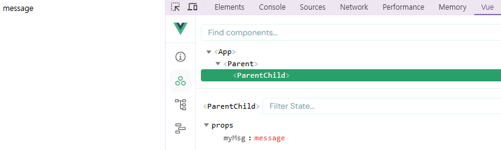
        
        - HTML의 영역 / JS의 영역을 고려해서 이름을 지어야 함
            - JS는 `-` 기준으로 그 뒤의 문자열을 대문자로 바꿈
        
2. **”객체”를 사용한 선언**
    - 각 객체 속성의 키가 전달받은 `props` 이름이 되며, 객체 속성의 값은 
    값이 될 데이터의 타입에 해당하는 생성자 함수(`Number`, `String`…)여야 함
        
        ```html
        <!-- ParentChild.vue -->
        
        <template>
          <div>
            {{ myMsg }}
          </div>
        </template>
        
        <script setup>
        // 내려받은 props를 선언 (객체를 활용한 방법)
        defineProps({
          myMsg: String
        })
        </script>
        
        <style scoped>
        </style>
        ```
        
        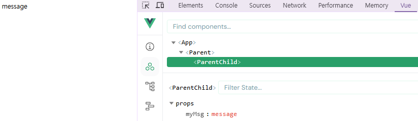
        

### props 데이터 사용

- `props` 선언 후 템플릿에서 반응형 변수와 같은 방식으로 활용
    
    ```html
    <!-- ParentChild.vue -->
    
    <template>
      <div>
        <p>{{ myMsg }}</p>
      </div>
    </template>
    ```
    

- `props` 객체를 반환하므로, 필요한 경우 JavaScript에서 접근 가능
    
    ```html
    <script setup>
    // props 데이터를 활용하려는 경우
    const props = defineProps({myMsg: String})
    console.log(props)        // Proxy(Object) {myMsg: 'message'}
    console.log(props.myMsg)  // message
    </script>
    ```
    

- `props` 출력 결과 확인

### 한 단계 더 `props` 내려 보내기

- `ParentChild` 컴포넌트를 부모로 갖는 `ParentGrandChild` 컴포넌트 생성 및 등록
    
    ```html
    <!-- ParentGrandChild.vue -->
    
    <template>
      <div></div>
    </template>
    
    <script setup>
    </script>
    
    <style scoped>
    </style>
    ```
    
    ```html
    <!-- ParentChild.vue -->
    
    <template>
      <div>
        <p>{{ myMsg }}</p>
        <ParentGrandChild />
      </div>
    </template>
    
    <script setup>
    import ParentGrandChild from '@/components/ParentGrandChild.vue';
    
    // 내려받은 props를 선언 (객체를 활용한 방법)
    defineProps({
      myMsg: String
    })
    </script>
    
    <style scoped>
    </style>
    ```
    

- `ParentChild` 컴포넌트에서 `Parent`로부터 받은 `myMsg`를 `ParentGrandChild`에게 전달
    
    ```html
    <!-- ParentChild.vue -->
    
    <template>
      <div>
        <p>{{ myMsg }}</p>
        **<!-- v-bind를 이용한 동적 props -->
        <ParentGrandChild
          :my-msg="myMsg"  
        />**
      </div>
    </template>
    
    <script setup>
    import ParentGrandChild from '@/components/ParentGrandChild.vue';
    
    // 내려받은 props를 선언 (객체를 활용한 방법)
    defineProps({
      myMsg: String
    })
    </script>
    
    <style scoped>
    </style>
    ```
    
    ```html
    <!-- ParentGrandChild.vue -->
    
    <template>
      <div>
        <p>{{ myMsg}}</p>
      </div>
    </template>
    
    <script setup>
    defineProps({
      myMsg: String
      })
    </script>
    
    <style scoped>
    </style>
    ```
    
- 출력 결과 확인
    
    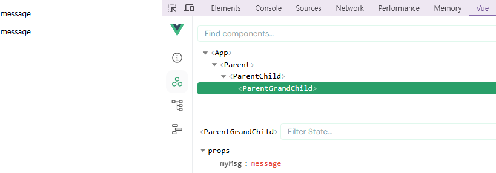
    
- `ParentGrandChild`가 받아서 출력하는 `props`는 `Parent`에 정의되어 있는 `props`이며
`Parent`가 `props`를 변경할 경우, 
이를 전달받고 있는 `ParentChild, ParentGrandChild` 에서도 모두 업데이트 됨

## Props 세부 사항

### 1. Props Name Casing

- 자식 컴포넌트로 전달 시 (→ kebab-case)
    
    `<ParentChild my-msg="message" />`
    
    - 기술적으로 camelCase도 가능하나, 
    HTML 속성 표기법과 동일하게 kebab-case로 작성할 것을 권장

- 선언 및 템플릿 참조 시 (→ camelCase)
    
    `defineProps({myMsg: String})`
    
    `<p>{{ myMsg }}</p>`
    

### 2. Static props & Dynamic props

- 지금까지 작성한 것은 Static(정적) props
- `v-bind`를 사용하여 동적으로 할당된 props를 사용할 수 있음

1. Dynamic props 정의
    
    ```html
    <!-- Parent.vue -->
    
    <template>
      <div>
        <ParentChild
          my-msg="message"
          :dynamic-props="name"
        />
      </div>
    </template>
    
    <script setup>
    import ParentChild from '@/components/ParentChild.vue';
    import ParentItem from '@/components/ParentItem.vue';
    
    import { ref } from 'vue'
    const name = ref('Alice')
    </script>
    
    <style scoped>
    </style>
    ```
    

1. Dynamic props 선언 및 출력
    
    ```html
    <!-- ParentChild.vue -->
    
    <template>
      <div>
        <p>{{ myMsg }}</p>
        <p>{{ dynamicProps }}</p>
        <!-- v-bind를 이용한 동적 props -->
        <ParentGrandChild
          :my-msg="myMsg"  
        />
      </div>
    </template>
    
    <script setup>
    import ParentGrandChild from '@/components/ParentGrandChild.vue';
    
    // 내려받은 props를 선언 (객체를 활용한 방법)
    defineProps({
      myMsg: String,
      dynamicProps: String,
    })
    </script>
    
    <style scoped>
    </style>
    ```
    

1. Dynamic props 출력 확인
    
    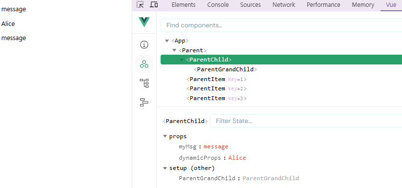
    

## Props 활용

### 다른 디렉티브와 함께 사용

- v-for와 함께 사용하여 반복되는 요소를 props로 전달하기

1. `ParentItem` 컴포넌트 생성 및 `Parent`의 하위 컴포넌트로 등록
    
    ```html
    <!-- ParentItem.vue -->
    
    <template>
      <div>
      </div>
    </template>
    
    <script setup>
    </script>
    
    <style scoped>
    </style>
    ```
    
    ```html
    <!-- Parent.vue -->
    
    <template>
      <div>
        <ParentChild
          my-msg="message"
          :dynamic-props="name"
        />
        **<ParentItem />**
      </div>
    </template>
    
    <script setup>
    import ParentChild from '@/components/ParentChild.vue';
    **import ParentItem from '@/components/ParentItem.vue';**
    
    import { ref } from 'vue'
    const name = ref('Alice')
    </script>
    
    <style scoped>
    </style>
    ```
    

1. 데이터 정의 및 v-for 디렉티브의 반복 요소로 활용
    
    각 반복 요소를 props로 내려 보내기
    
    ```html
    <!-- Parent.vue -->
    
    <template>
      <div>
        <ParentChild
          my-msg="message"
          :dynamic-props="name"
        />
        <ParentItem
          v-for="item in items"
          :key="item.id"
          :my-prop="item"
        />
      </div>
    </template>
    
    <script setup>
    import ParentChild from '@/components/ParentChild.vue';
    import ParentItem from '@/components/ParentItem.vue';
    
    import { ref } from 'vue'
    const name = ref('Alice')
    const items = ref([
      {id: 1, name: '사과'},
      {id: 2, name: '바나나'},
      {id: 3, name: '딸기'},
    ])
    </script>
    
    <style scoped>
    </style>
    ```
    

1. props 선언 및 출력 결과 확인
    
    ```html
    <!-- ParentItem.vue -->
    
    <template>
      <div>
        <p>{{ myProp.id }}</p>
        <p>{{ myProp.name }}</p>
      </div>
    </template>
    
    <script setup>
    defineProps({
      myProp: Object,
    })
    </script>
    
    <style scoped>
    </style>
    ```
    
    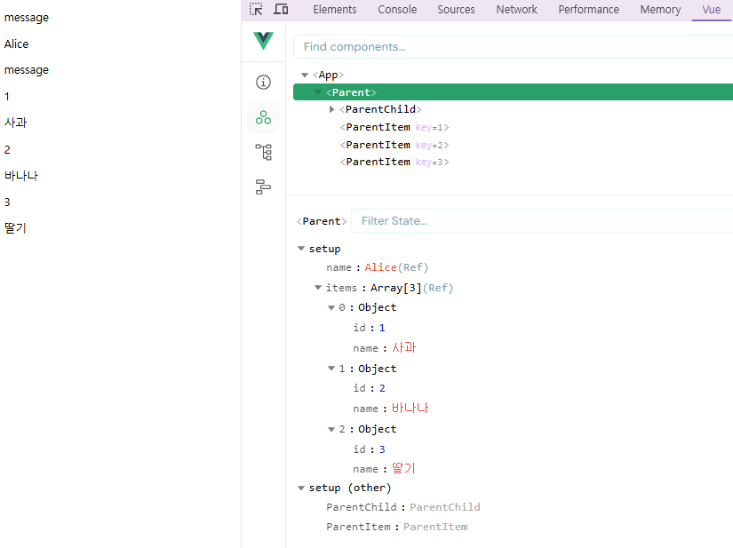
    

# Component Events

## Emit

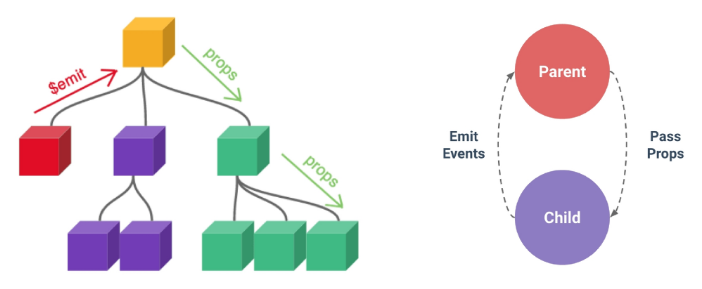

부모는 자식에게 데이터를 전달(Pass Props)하며,
자식은 자신에게 일어난 일을 부모에게 알림(Emit event)

→ 부모가 props 데이터를 변경하도록 소리쳐야 함

### `$emit()`

자식 컴포넌트가 이벤트를 발생시켜, 부모 컴포넌트로 데이터를 전달하는 역할의 메서드

- `$` 표시는 Vue 인스턴스의 내부 변수들을 가리킴
- Life cycle hooks, 인스턴스 메서드 등 내부 특정 속성에 접근할 때 사용

**`emit()` 메서드 구조**

`$emit(event, ...args)`

- `event` : 커스텀 이벤트 이름
- `args` : 추가 인자

## 이벤트 발신 및 수신

- `$emit` 을 사용하여 템플릿 표현식에서 직접 사용자 정의 이벤트를 발신
    
    `<button @click="$emit('someEvent')">클릭</button>`
    

- 그런 다음 부모는 `v-on`을 사용해서 수신할 수 있음
    
    `<ParentComp @some-event="someCallback" />`
    

### 이벤트 발신 및 수신하기

1. `ParentChild`에서 `someEvent`라는 이름의 사용자 정의 이벤트를 발신
    
    ```html
    <!-- ParentChild.vue -->
    
    <template>
      <div>
        <p>{{ myMsg }}</p>
        <p>{{ dynamicProps }}</p>
        **<button @click="$emit('someEvent')">클릭</button>**
    
        <!-- v-bind를 이용한 동적 props -->
        <ParentGrandChild
          :my-msg="myMsg"  
        />
      </div>
    </template>
    
    <script setup>
    import ParentGrandChild from '@/components/ParentGrandChild.vue';
    
    // 내려받은 props를 선언 (객체를 활용한 방법)
    defineProps({
      myMsg: String,
      dynamicProps: String,
    })
    </script>
    
    <style scoped>
    </style>
    ```
    

1. `ParentChild`의 부모 `Parent`는 `v-on`을 사용하여  발신된 이벤트를 수신
    - 수신 후처리할 로직 및 콜백함수 호출
    
    ```html
    <!-- Parent.vue -->
    
    <template>
      <div>
        <ParentChild
          my-msg="message"
          :dynamic-props="name"
          **@some-event="someCallback"**
        />
        <ParentItem
          v-for="item in items"
          :key="item.id"
          :my-prop="item"
        />
      </div>
    </template>
    
    <script setup>
    import ParentChild from '@/components/ParentChild.vue';
    import ParentItem from '@/components/ParentItem.vue';
    
    import { ref } from 'vue'
    const name = ref('Alice')
    const items = ref([
      {id: 1, name: '사과'},
      {id: 2, name: '바나나'},
      {id: 3, name: '딸기'},
    ])
    **const someCallback = function () {
      console.log('ParentChild가 발신한 이벤트를 수신!')
    }**
    </script>
    
    <style scoped>
    </style>
    ```
    

1. 이벤트 수신 결과
    
    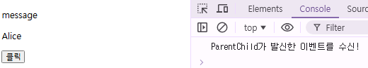
    

## emit 이벤트 선언

- `defineEmits()`를 사용하여 발신할 이벤트를 선언
- `props`와 마찬가지로 `defineEmits()` 에 작성하는 인자의 데이터 타입에 따라 선언 방식이 나뉨
(배열, 객체)
- `defineEmits()`는 `$emit` 대신 사용할 수 있는 동등한 함수를 반환
(`script`에서는 `$emit` 메서드를 접근할 수 없기 때문

### 이벤트 선언 활용

- 이벤트 선언 방식으로 추가 버튼 작성 및 결과 확인
    
    ```html
    <!-- ParentChild.vue -->
    
    <template>
      <div>
        <p>{{ myMsg }}</p>
        <p>{{ dynamicProps }}</p>
        **<button @click="buttonClick">클릭</button>**
    
        <!-- v-bind를 이용한 동적 props -->
        <ParentGrandChild
          :my-msg="myMsg"  
        />
      </div>
    </template>
    
    <script setup>
    import ParentGrandChild from '@/components/ParentGrandChild.vue';
    
    // 내려받은 props를 선언 (객체를 활용한 방법)
    defineProps({
      myMsg: String,
      dynamicProps: String,
    })
    
    **const emit = defineEmits(['someEvent'])
    const buttonClick = function () {
      emit('someEvent')
    }**
    </script>
    
    <style scoped>
    </style>
    ```
    
    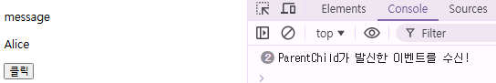
    

## 이벤트 전달

### 이벤트 인자 (Event Arguments)

**이벤트 발신 시 추가 인자를 전달하여 값을 제공할 수 있음**

### 이벤트 인자 전달 활용

- `ParentChild`에서 이벤트를 발신하여 `Parent`로 추가 인자 전달하기
    
    ```html
    <!-- ParentChild.vue -->
    
    <template>
      <div>
        <p>{{ myMsg }}</p>
        <p>{{ dynamicProps }}</p>
        <button @click="buttonClick">클릭</button>
        **<button @click="emitArgs">추가 인자 전달</button>**
        <!-- v-bind를 이용한 동적 props -->
        <ParentGrandChild
          :my-msg="myMsg"  
        />
      </div>
    </template>
    
    <script setup>
    import ParentGrandChild from '@/components/ParentGrandChild.vue';
    
    // 내려받은 props를 선언 (객체를 활용한 방법)
    defineProps({
      myMsg: String,
      dynamicProps: String,
    })
    
    **const emit = defineEmits(['someEvent', 'emitArgs'])**
    const buttonClick = function () {
      emit('someEvent')
    }
    **const emitArgs = function () {
      emit('emitArgs', 1, 2, 3)
    }**
    </script>
    
    <style scoped>
    </style>
    ```
    

1. `ParentChild`에서 발신한 이벤트를 `Parent`에서 수신
    
    ```html
    <!-- Parent.vue -->
    
    <template>
      <div>
        <ParentChild
          my-msg="message"
          :dynamic-props="name"
          @some-event="someCallback"
          **@emit-args="getNumbers"**
        />
        <ParentItem
          v-for="item in items"
          :key="item.id"
          :my-prop="item"
        />
      </div>
    </template>
    
    <script setup>
    import ParentChild from '@/components/ParentChild.vue';
    import ParentItem from '@/components/ParentItem.vue';
    
    import { ref } from 'vue'
    const name = ref('Alice')
    const items = ref([
      {id: 1, name: '사과'},
      {id: 2, name: '바나나'},
      {id: 3, name: '딸기'},
    ])
    const someCallback = function () {
      console.log('ParentChild가 발신한 이벤트를 수신!')
    }
    **const getNumbers = function (...args) {
      console.log(args)
      console.log(`ParentChild가 전달한 추가 인자 ${args}를 수신!`)
    }**
    </script>
    
    <style scoped>
    </style>
    ```
    

1. 추가 인자 전달 확인
    
    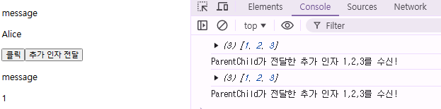
    

## 이벤트 세부 사항

### Event Name Casing

- 선언 및 발신 시 (→ camelCase)
    
    ```html
    <button @click="$emit('someEvent')">클릭</button>
    <button @click="emitArgs">추가 인자 전달</button>
    
    const emit = defineEmits(['someEvent', 'emitArgs'])
    ```
    

- 부모 컴포넌트에서 수신 시 (→ kebab-case)
    
    ```html
    <ParentChild
      my-msg="message"
      :dynamic-props="name"
      **@some-event="someCallback"
      @emit-args="getNumbers"**
    />
    ```
    

## emit 이벤트 활용

### emit 이벤트 실습

- 최하단 컴포넌트 `ParentGrandChild`에서 
`Parent` 컴포넌트의 `name 변수` 변경 요청하기

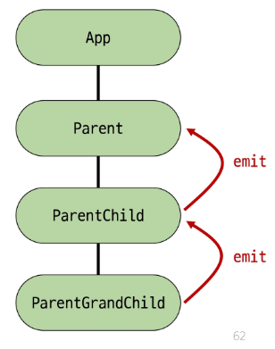

### emit 이벤트 실습 구현

1. `ParentGrandChild`에서 이름 변경을 요청하는 이벤트 발신
    
    ```html
    <!-- ParentGrandChild.vue -->
    
    <template>
      <div>
        <p>{{ myMsg }}</p>
        **<button @click="updateName">이름 변경</button>**
      </div>
    </template>
    
    <script setup>
    defineProps({
      myMsg: String
      })
    
    **const emit = defineEmits(['updateName'])
    const updateName = function () {
      emit('updateName')
    }**
    </script>
    
    <style scoped>
    </style>
    ```
    

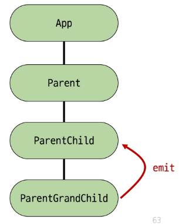

1. 이벤트 수신 후 이름 변경을 요청하는 이벤트 발신
    
    ```html
    <!-- ParentChild.vue -->
    
    <template>
      <div>
        <p>{{ myMsg }}</p>
        <p>{{ dynamicProps }}</p>
        <button @click="buttonClick">클릭</button>
        <button @click="emitArgs">추가 인자 전달</button>
        <!-- v-bind를 이용한 동적 props -->
        <ParentGrandChild
          :my-msg="myMsg"
          **@update-name="updateName"**  
        />
      </div>
    </template>
    
    <script setup>
    import ParentGrandChild from '@/components/ParentGrandChild.vue';
    
    // 내려받은 props를 선언 (객체를 활용한 방법)
    defineProps({
      myMsg: String,
      dynamicProps: String,
    })
    
    **const emit = defineEmits(['someEvent', 'emitArgs', 'updateName'])**
    const buttonClick = function () {
      emit('someEvent')
    }
    const emitArgs = function () {
      emit('emitArgs', 1, 2, 3)
    }
    **const updateName = function () {
      emit('updateName')
    }**
    </script>
    
    <style scoped>
    </style>
    ```
    

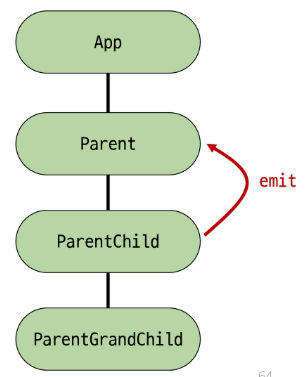

1. 이벤트 수신 후 이름 변수 변경 메서드 호출
    - 해당 변수를 `props`로 받는 모든 곳에서 자동 업데이트
    
    ```html
    <!-- Parent.vue -->
    
    <template>
      <div>
        <ParentChild
          my-msg="message"
          :dynamic-props="name"
          @some-event="someCallback"
          @emit-args="getNumbers"
          **@update-name="updateName"**
        />
        <ParentItem
          v-for="item in items"
          :key="item.id"
          :my-prop="item"
        />
      </div>
    </template>
    
    <script setup>
    import ParentChild from '@/components/ParentChild.vue';
    import ParentItem from '@/components/ParentItem.vue';
    
    import { ref } from 'vue'
    const name = ref('Alice')
    const items = ref([
      {id: 1, name: '사과'},
      {id: 2, name: '바나나'},
      {id: 3, name: '딸기'},
    ])
    const someCallback = function () {
      console.log('ParentChild가 발신한 이벤트를 수신!')
    }
    const getNumbers = function (...args) {
      console.log(args)
      console.log(`ParentChild가 전달한 추가 인자 ${args}를 수신!`)
    }
    **const updateName = function () {
      name.value = 'Bella'
    }**
    </script>
    
    <style scoped>
    </style>
    ```
    

1. 버튼 클릭 후 결과 확인
    
    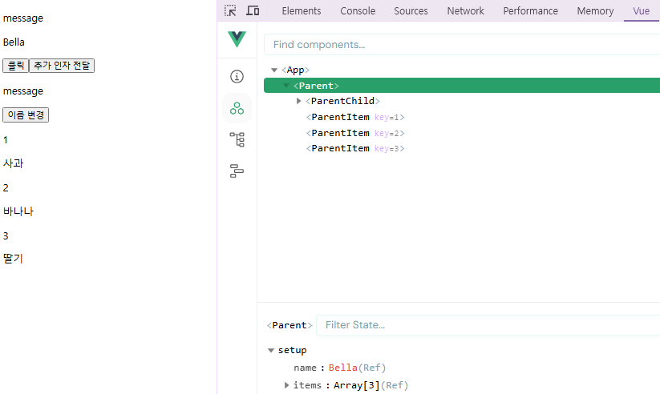
    

# 참고

## 정적 & 동적 props 주의 사항

```html
<!-- 정적 props로 문자열 “1”을 전달 -->
<SomeComponent num-props="1" />

<!-- 동적 props로 숫자 1을 전달 -->
<SomeComponent :num-props="1" />
```

## Props & Emit 객체 선언 문법

### Props 선언 시 객체 선언 문법을 권장하는 이유

- 컴포넌트를 가독성 좋게 문서화하는데 도움이 되며,
다른 개발자가 잘못된 유형을 전달할 때에 브라우저 콘솔에 경고를 출력하도록 함
- 추가로 props에 대한 유효성 검사로써 활용 가능
    
    ```jsx
    defineProps ({
    	// 여러 타입 허용
    	propB: [String, Number],
    	// 문자열 필수
    	probC: {
    		type: String,
    		required: true
    	},
    	// 기본 값ㅇ르 가지는 숫자형
    	propD: {
    		type: Number,
    		default: 10
    	},
    ...
    ```
    

### emit 이벤트도 객체 선언 문법으로 작성 가능

- emit 이벤트 또한 객체 구문으로 선언된 경우 유효성을 검사할 수 있음
    
    ```jsx
    const emit = defineEmits({
    	// 유효성 검사 없음
    	click: null,
    	// submit 이벤트 유효성 검사
    	submit: ({ email, password }) => {
    		if (email && password) {
    			return true
    		} else {
    			console.warn('submit 이벤트가 옳지 않음')
    			return false
    		}
    	}
    })
    const submitForm = function (email, password) {
    	emit('submit', { email, password })
    }
    ```