# State Management

**State Management : 상태 관리**

Vue 컴포넌트는 이미 반응형 상태를 관리하고 있음

→ 상태 === 데이터

### 컴포넌트 구조의 단순화

- 상태(state)
    - 앱 구동에 필요한 기본 데이터
- 뷰(View)
    - 상태를 선언적으로 매핑하여 시각화
- 기능(Actions)
    - 뷰에서 사용자 입력에 대해 반응적으로 
    상태를 변경할 수 있게 정의된  동작
        
        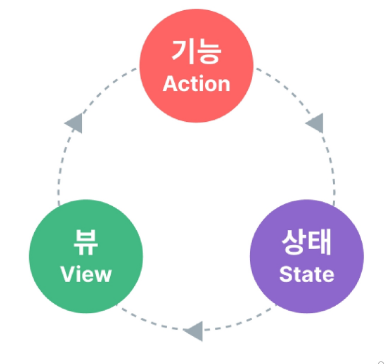
        

```html
<template>
	<!-- 뷰 View -->
	<div>{{ count }}</div>
</template>

<script setup>
import { ref } from 'vue'

// 상태 State
const count = ref(0)

// 기능 Actions
const increment = function () {
	count.value++
}
<script>
```

**→ 단방향 데이터 흐름의 간단한 표현**

### 상태 관리의 단순성이 무너지는 시점

**여러 컴포넌트가 상태를 공유할 때**

1. **여러 뷰가 동일한 상태에 종속되는 경우**
    - 공유 상태를 공통 조상 컴포넌트로 끌어올린 다음 props로 전달하는 것
    - 하지만 계층 구조가 깊어질 경우 비효율적, 관리가 어려워짐
        
        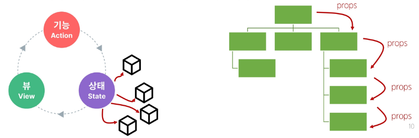
        

1. **서로 다른 뷰의 기능이 동일한 상태를 변경시켜야 하는 경우**
    - 발신(emit)된 이벤트를 통해 상태의 여러 복사본을 변경 및 동기화 하는 것
    - 마찬가지로 관리의 패턴이 깨지기 쉽고, 유지 관리할 수 없는 코드가 됨
        
        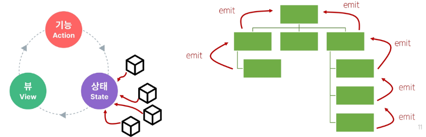
        

### 해결책

**각 컴포넌트의 공유 상태를 추출하여, 전역에서 참조할 수 있는 저장소에서 관리**

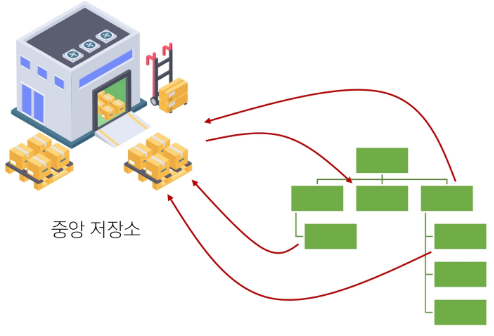

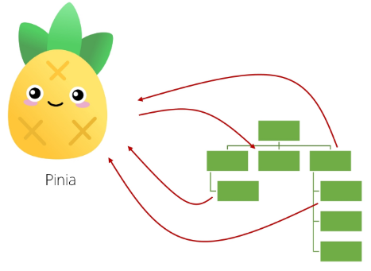

- 컴포넌트 트리는 하나의 큰 View가 되고,
모든 컴포넌트는 트리 계층 구조에 관계 없이 상태에 접근하거나 기능을 사용할 수 있음
    
    → Vue의 공식 상태 관리 라이브러리 **“Pinia”**
    
    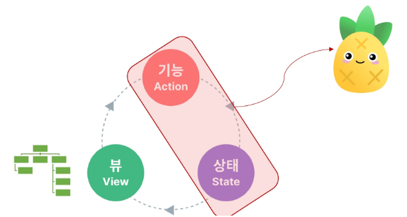
    

# State management library (Pinia)

## Pinia

**Vue의 공식 상태 관리 라이브러리**

### Pinia 설치

- Vite 프로젝트 빌드 시 Pinia 라이브러리 추가
    
    ```bash
    $ npm create vue@latest
    
    > npx
    > create-vue
    
    Vue.js - The Progressive JavaScript Framework
    
    √ Project name: ... vue-project
    √ Add TypeScript? ... No / Yes
    √ Add JSX Support? ... No / Yes
    **√ Add Vue Router for Single Page Application development? ... No / Yes**
    √ Add Pinia for state management? ... No / Yes
    √ Add Vitest for Unit Testing? ... No / Yes
    √ Add an End-to-End Testing Solution? » No
    √ Add ESLint for code quality? » No
    ```
    

### Vue 프로젝트 구조 변화

- stores 폴더 신규 생성

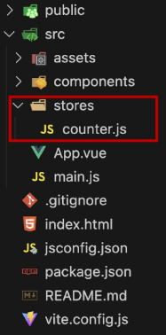

## Pinia 구조

```jsx
// stores/counter.js

import { ref, computed } from 'vue'
import { defineStore } from 'pinia'

export const useCounterStore = defineStore('counter', () => {
  const count = ref(0)
  const doubleCount = computed(() => count.value * 2)
  function increment() {
    count.value++
  }

  return { count, doubleCount, increment }
})
```

### Pinia 구성 요소

1. **`store`**
    - 중앙 저장소
    - 모든 컴포넌트가 공유하는 상태, 기능 등이 작성됨
    
    → `defineStore()`의 반환 값의 이름은
        `use`와 `store`를 사용하는 것을권장
    
    → `defineStore()`의 첫번째 인자는 
        애플리케이션 전체에 설쳐 사용하는 
        store 고유 ID
    

```jsx
// stores/counter.js

import { ref, computed } from 'vue'
import { defineStore } from 'pinia'

**export const useCounterStore = defineStore('counter', () => {
  const count = ref(0)
  const doubleCount = computed(() => count.value * 2)
  function increment() {
    count.value++
  }

  return { count, doubleCount, increment }
})**
```

1. **`state`**
    - 반응형 상태(데이터)
    - `=== ref()`

```jsx
// stores/counter.js

import { ref, computed } from 'vue'
import { defineStore } from 'pinia'

export const useCounterStore = defineStore('counter', () => {
  **const count = ref(0)**
  const doubleCount = computed(() => count.value * 2)
  function increment() {
    count.value++
  }

  return { count, doubleCount, increment }
})
```

1. **`getters`**
    - 계산된 값
    - `=== computed()`
    

```jsx
// stores/counter.js

import { ref, computed } from 'vue'
import { defineStore } from 'pinia'

export const useCounterStore = defineStore('counter', () => {
  const count = ref(0)
  **const doubleCount = computed(() => count.value * 2)**
  function increment() {
    count.value++
  }

  return { count, doubleCount, increment }
})
```

1. **`actions`**
    - 메서드
    - `=== function()`
    

```jsx
// stores/counter.js

import { ref, computed } from 'vue'
import { defineStore } from 'pinia'

export const useCounterStore = defineStore('counter', () => {
  const count = ref(0)
  const doubleCount = computed(() => count.value * 2)
  **function increment() {
    count.value++
  }**

  return { count, doubleCount, increment }
})
```

1. **`plugin`**
    - 애플리케이션의 상태 관리에 필요한 추가 기능을 제공하거나 확장하는 도구나 모듈
    - 애플리케이션의 상태 관리를 더욱 간편하고 유연하게 만들어주며
    패키지 매니저로 설치 이후 별도 설정을 통해 추가됨

- **`Setup Stores`의 반환 값**
    - pinia의 상태들을 사용하려면 반드시 반환해야 함
    - `store`에서는 공유하지 않는 private한 상태 속성을 가지지 않음

**Pinia 구성 요소 정리**

- Pinia는 `store`라는 저장소를 가짐
- `store`는 `state`, `getters`, `actions`으로 이루어지며,
각각 `ref()`, `computed()`, `function()`과 동일함

## Pinia 구성 요소 활용

### State

- 각 컴포넌트 깊이에 관계 없이 `store` 인스턴스로 `state`에 접근하여 직접 읽고 쓸 수 있음
- 만약 `store`에 `state`를 정의하지 않았다면, 컴포넌트에서 새로 추가할 수 없음
    
    ```html
    <!-- App.vue -->
    
    <script setup>
    import HelloWorld from './components/HelloWorld.vue'
    import TheWelcome from './components/TheWelcome.vue'
    
    // 1. 중앙 저장소 가져오기
    import { useCounterStore } from '@/stores/counter';
    
    // 2. 중앙 저장소를 활용해 인스턴스 생성
    const store = useCounterStore()
    
    // 3. 중앙 저장소의 상태를 참조
    console.log(store.count) // 0
    
    // 각 컴포넌트에서는 중앙 저장소에 새로운 상태를 생성할 수 없음
    // store.ssafy = 'ssafy'
    </script>
    
    <template>
    	<div>
    		<p>state : {{ store.count }}</p>
    	</div>
    </template>
    ```
    

### Getters

- `store`의 모든 `getters` 또한 `state`처럼 직접 접근할 수 있음
    
    ```html
    <!-- App.vue -->
    
    <script setup>
    import HelloWorld from './components/HelloWorld.vue'
    import TheWelcome from './components/TheWelcome.vue'
    import { useCounterStore } from '@/stores/counter';
    
    const store = useCounterStore()
    
    // 3. 중앙 저장소의 getters 참조
    console.log(store.doubleCount)
    </script>
    
    <template>
    	<div>
        <p>getters : {{ store.doubleCount }}</p>
    	</div>
    </template>
    ```
    

### Actions

- `store`의 모든 `actions` 또한 직접 접근 및 호출할 수 있음
- `getters`와 달리 `state` 조작, 비동기, API 호출이나 다른 로직을 진행할 수 있음
    
    ```html
    <!-- App.vue -->
    
    <script setup>
    import HelloWorld from './components/HelloWorld.vue'
    import TheWelcome from './components/TheWelcome.vue'
    import { useCounterStore } from '@/stores/counter';
    
    const store = useCounterStore()
    
    // 3. 중앙 저장소의 getters 참조
    console.log(store.doubleCount)
    </script>
    
    <template>
      <div>
        <p>state : {{ store.count }}</p>
        <p>getters : {{ store.doubleCount }}</p>
        <button @click="store.increment()">+++</button>
      </div>
     </template>
    ```
    

### Vue devtools로 Pinia 구성 요소 확인하기

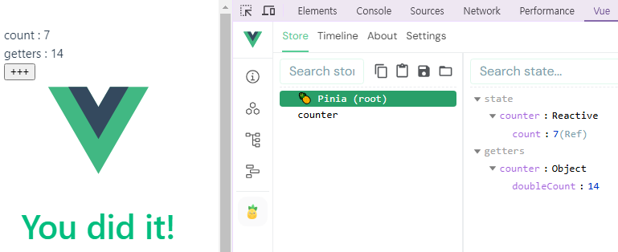

# Pinia 실습

## Pinia를 활용한 Todo 프로젝트 구현

- Todo CRUD 구현
- Todo 개수 계산
    - 완료된 Todo 개수

**컴포넌트 구성**

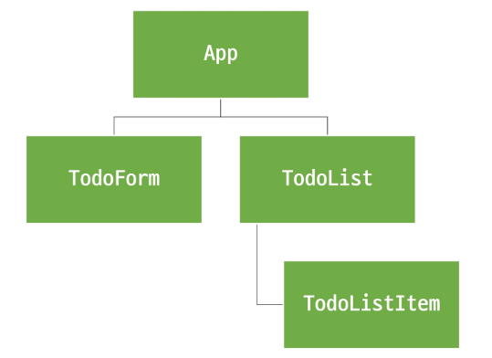

### 사전 준비

1. **초기 설정**
    - 초기 생성된 컴포넌트 모두 삭제 (App.vue 제외)
    - `src/assets` 내부 파일 모두 삭제
    - `main.js` 에서 `import './assets/main.css'` 코드 삭제

1. **TodoListItem 컴포넌트 작성**
    
    ```html
    <!-- TodoListItem.vue -->
    
    <template>
      <div>
        TodoListItem
      </div>
    </template>
    ```
    

1. **TodoList 컴포넌트 작성 및 TodoListItem 컴포넌트 등록**
    
    ```html
    <!-- TodoList.vue -->
    
    <template>
      <div>
        <TodoListItem />
      </div>
    </template>
    
    <script setup>
    import TodoListItem from '@/components/TodoListItem.vue';
    </script>
    ```
    

1. **TodoForm 컴포넌트 작성**
    
    ```html
    <!-- TodoForm.vue -->
    
    <template>
      <div>
        TodoForm
      </div>
    </template>
    ```
    

1. **App 컴포넌트에 TodoList, TodoForm 컴포넌트 등록**
    
    ```html
    <!-- App.vue -->
    
    <template>
      <h1>TodoProject</h1>
      <TodoList />
      <TodoForm />
    </template>
    
    <script setup>
    import TodoForm from '@/components/TodoForm.vue';
    import TodoList from '@/components/TodoList.vue';
    </script>
    ```
    

1. **컴포넌트 구성 확인**
    
    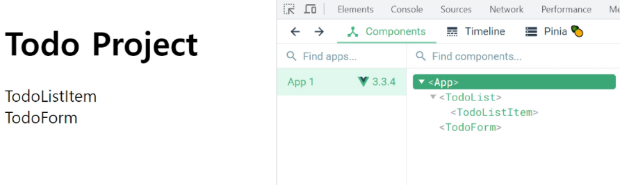
    

## Read Todo

1. **`store`에 임시 todos 목록 `state`를 정의**
    
    ```jsx
    // stores/counter.js
    
    import { ref, computed } from 'vue'
    import { defineStore } from 'pinia'
    
    export const useCounterStore = defineStore('counter', () => {
      let id = 0
      const todos = ref([
        { id: id++, text: '할 일1', isDone: false },
        { id: id++, text: '할 일2', isDone: false },
      ])
    
      return { todos }
    })
    ```
    

1. **`store`의 `todos state`를 참조**
    - 하위 컴포넌트인 TodoListItem을 반복하면서 개별 todo를 props로 전달
    
    ```html
    <!-- TodoList.vue -->
    
    <template>
      <div>
        <TodoListItem
          v-for="todo in store.todos"
          :key="todo.id"
          :todo="todo"
        />
      </div>
    </template>
    
    <script setup>
    import TodoListItem from '@/components/TodoListItem.vue';
    import { useCounterStore } from '@/stores/counter';
    
    const store = useCounterStore()
    console.log(store.todos)
    </script>
    ```
    

1. **props 정의 후 데이터 출력 확인**
    
    ```html
    <!-- TodoListItem.vue -->
    
    <template>
      <div>
        {{ todo.text }}
      </div>
    </template>
    
    <script setup>
    defineProps({
      todo: Object,
    })
    </script>
    
    <style scoped>
    
    </style>
    ```
    
    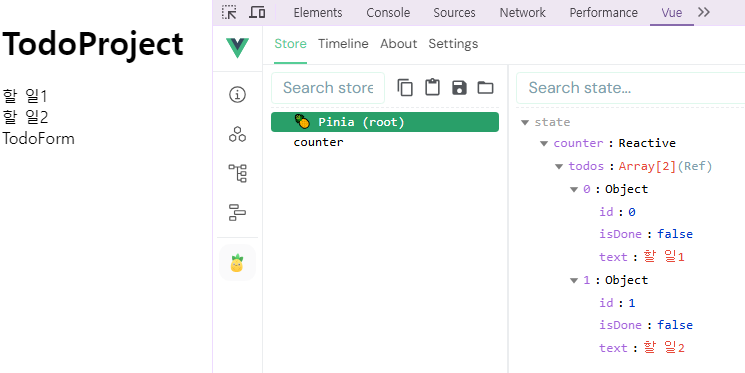
    

## Create Todo

1. **todos 목록에 todo를 생성 및 추가하는 addTodo 액션 정의**
    
    ```jsx
    // stores/counter.js
    
    import { ref, computed } from 'vue'
    import { defineStore } from 'pinia'
    
    export const useCounterStore = defineStore('counter', () => {
      let id = 0
      const todos = ref([
        { id: id++, text: '할 일1', isDone: false },
        { id: id++, text: '할 일2', isDone: false },
      ])
    
      const addTodo = function (todoText) {
        todos.value.push({
          id: id++,
          text: todoText,
          isDone: false,
        })
      }
      return { todos, addTodo }
    })
    
    ```
    

1. **TodoForm에서 실시간으로 입력되는 사용자 데이터를 
양방향 바인딩하여 반응형 변수로 할당**
    
    ```html
    <!-- TodoForm.vue -->
    
    <template>
      <div>
        <form>
          <input type="text" v-model="todoText">
          <input type="submit">
        </form>
      </div>
    </template>
    
    <script setup>
    import { ref } from 'vue'
    
    const todoText = ref('')
    </script>
    ```
    

1. **submit 이벤트가 발생했을 때,
사용자 입력 텍스트를 인자로 전달하여 `store`에 정의한 addTodo 액션 메서드를 호출**
    
    ```html
    <!-- TodoForm.vue -->
    
    <template>
      <div>
        <form @submit.prevent="createTodo(todoText)">
          <input type="text" v-model="todoText">
          <input type="submit">
        </form>
      </div>
    </template>
    
    <script setup>
    import { useCounterStore } from '@/stores/counter';
    const store = useCounterStore()
    
    import { ref } from 'vue'
    const todoText = ref('')
    
    const createTodo = function (todoText) {
      store.addTodo(todoText)
    }
    </script>
    ```
    

1. **form 요소를 선택하여 todo 입력 후, input 데이터를 초기화할 수 있도록 처리**
    
    ```html
    <!-- TodoForm.vue -->
    
    <template>
      <div>
        **<form @submit.prevent="createTodo(todoText)" ref="formElem">**
          <input type="text" v-model="todoText">
          <input type="submit">
        </form>
      </div>
    </template>
    
    <script setup>
    import { useCounterStore } from '@/stores/counter';
    const store = useCounterStore()
    
    import { ref } from 'vue'
    const todoText = ref('')
    **const formElem = ref(null) // form 요소 선택**
    
    // 중앙 저장소의 addTodo 액션을 직접 호출해도 되지만
    // 굳이 createTodo를 만들어서 호출하는 이유는
    // addTodo 호출 전후로 추가 로직을 작성할 수 있기 때문
    **const createTodo = function (todoText) {
      store.addTodo(todoText)
      formElem.value.reset()  // input 값 초기화
    }**
    </script>
    
    <style scoped>
    
    </style>
    ```
    

1. **결과 확인**
    
    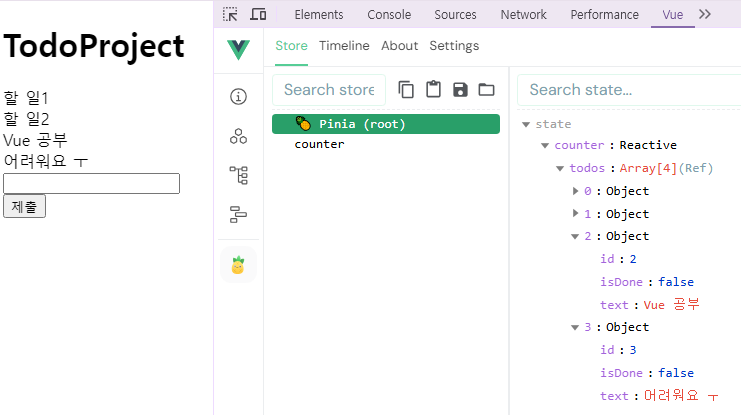
    

## Delete Todo

1. todos 목록에서 특정 todo를 삭제하는 deleteTodo 액션 정의
    
    ```jsx
    // stores/counter.js
    
    import { ref, computed } from 'vue'
    import { defineStore } from 'pinia'
    
    export const useCounterStore = defineStore('counter', () => {
      let id = 0
      const todos = ref([
        { id: id++, text: '할 일1', isDone: false },
        { id: id++, text: '할 일2', isDone: false },
      ])
    
      const addTodo = function (todoText) {
        todos.value.push({
          id: id++,
          text: todoText,
          isDone: false,
        })
      }
    
      **const deleteTodo = function() {
    
      }
      return { todos, addTodo, deleteTodo }**
    })
    
    ```
    

1. 각 todo에 삭제 버튼을 작성
    - 버튼을 클릭하면 선택된 todo의 id를 인자로 전달해 deleteTodo 메서드 호출
    
    ```html
    <!-- TodoListItem.vue -->
    
    <template>
      <div>
        <span>{{ todo.text }}</span>
        <button @click="store.deleteTodo(todo.id)">DELETE</button>
      </div>
    </template>
    
    <script setup>
    import { useCounterStore } from '@/stores/counter';
    
    defineProps({
      todo: Object,
    })
    
    const store = useCounterStore()
    </script>
    ```
    

1. 전달받은 todo의 id 값을 활용해 선택된 todo의 인덱스를 구함
    - 특정 인덱스 todo를 삭제 후 todos 배열을 재설정
    
    ```jsx
    // stores/counter.js
    
    import { ref, computed } from 'vue'
    import { defineStore } from 'pinia'
    
    export const useCounterStore = defineStore('counter', () => {
      let id = 0
      const todos = ref([
        { id: id++, text: '할 일1', isDone: false },
        { id: id++, text: '할 일2', isDone: false },
      ])
    
      const addTodo = function (todoText) {
        todos.value.push({
          id: id++,
          text: todoText,
          isDone: false,
        })
      }
    
      **const deleteTodo = function(todoId) {
        const index = todos.value.findIndex((todo) => todo.id === todoId)
        todos.value.splice(index, 1)
      }**
      return { todos, addTodo, deleteTodo }
    })
    
    ```
    

1. 결과 확인

## Update Todo

- **각 Todo 상태의 isDone 속성을 변경하여 todo의 완료 유무 처리하기**
- **완료된 todo에는 취소선 스타일 적용하기**

1. todos 목록에서 특정 todo의 isDone 속성을 변경하는 updateTodo 액션 정의
    
    ```jsx
    // stores/counter.js
    
    import { ref, computed } from 'vue'
    import { defineStore } from 'pinia'
    
    export const useCounterStore = defineStore('counter', () => {
      let id = 0
      const todos = ref([
        { id: id++, text: '할 일1', isDone: false },
        { id: id++, text: '할 일2', isDone: false },
      ])
    
      const addTodo = function (todoText) {
        todos.value.push({
          id: id++,
          text: todoText,
          isDone: false,
        })
      }
    
      const deleteTodo = function(todoId) {
        const index = todos.value.findIndex((todo) => todo.id === todoId)
        todos.value.splice(index, 1)
      }
    
      **const updateTodo = function() {
    
      }**
      **return { todos, addTodo, deleteTodo, updateTodo }**
    })
    
    ```
    

1. todo 내용을 클릭하면 선택된 todo의 id를 인자로 전달해 updateTodo 메서드를 호출
    
    ```html
    <!-- TodoListItem.vue -->
    
    <template>
      <div>
        **<span @click="store.updateTodo(todo.id)">{{ todo.text }}</span>**
        <button @click="store.deleteTodo(todo.id)">DELETE</button>
      </div>
    </template>
    
    <script setup>
    import { useCounterStore } from '@/stores/counter';
    
    defineProps({
      todo: Object,
    })
    
    const store = useCounterStore()
    </script>
    ```
    

1. 전달받은 todo의 id 값을 활용해 선택된 todo와 동일 todo를 목록에서 검색
    - 일치하는 todo 데이터의 isDone 속성 값을 반대로 재할당 후 새로운 todo 목록 반환
    
    ```jsx
    import { ref, computed } from 'vue'
    import { defineStore } from 'pinia'
    
    export const useCounterStore = defineStore('counter', () => {
      let id = 0
      const todos = ref([
        { id: id++, text: '할 일1', isDone: false },
        { id: id++, text: '할 일2', isDone: false },
      ])
    
      const addTodo = function (todoText) {
        todos.value.push({
          id: id++,
          text: todoText,
          isDone: false,
        })
      }
    
      const deleteTodo = function(todoId) {
        const index = todos.value.findIndex((todo) => todo.id === todoId)
        todos.value.splice(index, 1)
      }
    
      **const updateTodo = function(selectedId) {
        todos.value = todos.value.map((todo) => {
          if (todo.id === selectedId) {
            todo.isDone = !todo.isDone
          }
          return todo
        })**
    
      }
      return { todos, addTodo, deleteTodo, updateTodo }
    })
    
    ```
    

1. todo 객체의 isDone 속성 값에 따라 스타일 바인딩 적용하기
    
    ```html
    <!-- TodoListItem.vue -->
    
    <template>
      <div>
        **<span @click="store.updateTodo(todo.id)" :class="{ 'is-done': todo.isDone}">**
          {{ todo.text }}
        **</span>**
        <button @click="store.deleteTodo(todo.id)">DELETE</button>
      </div>
    </template>
    
    <script setup>
    import { useCounterStore } from '@/stores/counter';
    
    defineProps({
      todo: Object,
    })
    
    const store = useCounterStore()
    </script>
    
    <style scoped>
    **.is-done {
      text-decoration: line-through;
    }**
    </style>
    ```
    

1. 결과 확인
    
    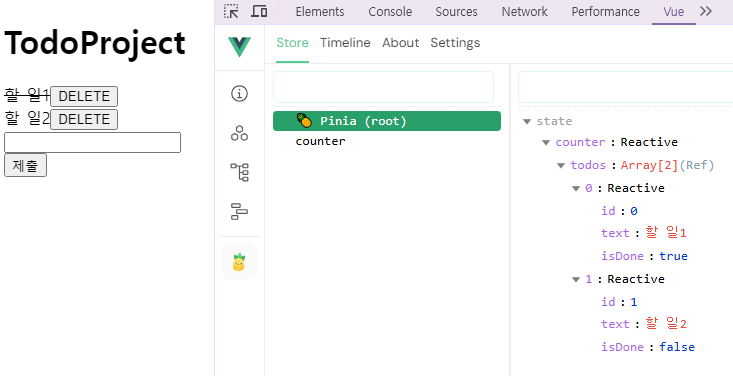
    

## Counting Todo

1. todos 배열의 길이 값을 반환하는 함수 doneTodosCount 작성 (getters)
    
    ```jsx
    // stores/counter.js
    
    import { ref, computed } from 'vue'
    import { defineStore } from 'pinia'
    
    export const useCounterStore = defineStore('counter', () => {
      let id = 0
      const todos = ref([
        { id: id++, text: '할 일1', isDone: false },
        { id: id++, text: '할 일2', isDone: false },
      ])
    
      const addTodo = function (todoText) {
        todos.value.push({
          id: id++,
          text: todoText,
          isDone: false,
        })
      }
    
      const deleteTodo = function(todoId) {
        const index = todos.value.findIndex((todo) => todo.id === todoId)
        todos.value.splice(index, 1)
      }
    
      const updateTodo = function(selectedId) {
        todos.value = todos.value.map((todo) => {
          if (todo.id === selectedId) {
            todo.isDone = !todo.isDone
          }
          return todo
        })
      }
    
      **const doneTodosCount = computed(() => {
        const doneTodos = todos.value.filter((todo) => todo.isDone)
        return doneTodos.length
      })**
    
      **return { todos, addTodo, deleteTodo, updateTodo, doneTodosCount }**
    })
    
    ```
    

1. App  컴포넌트에서 doneTodosCount getter를 참조
    
    ```html
    <!-- App.vue -->
    
    <template>
      <h1>TodoProject</h1>
      <h2>완료된 Todo : {{ store.doneTodosCount }}</h2>
      <TodoList />
      <TodoForm />
    </template>
    
    <script setup>
    import TodoForm from '@/components/TodoForm.vue';
    import TodoList from '@/components/TodoList.vue';
    
    import { useCounterStore } from './stores/counter';
    
    const store = useCounterStore()
    </script>
    ```
    
    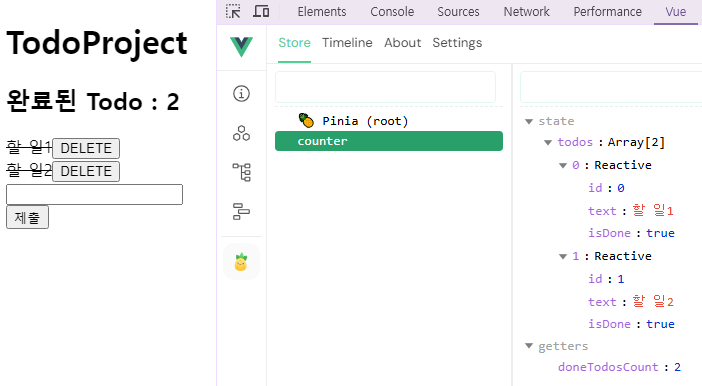
    

## Local Storage

**브라우저 내에 `key-value` 쌍을 저장하는 웹 스토리지 객체**

### Local Storage 특징

- 페이지를 새로 고침하고 브라우저를 다시 실행해도 데이터가 유지
- 쿠키와 다르게 네트워크 요청 시 서버로 전송되지 않음
- 여러 탭이나 창 간에 데이터를 공유할 수 있음

### Local Storage 사용 목적

- 웹 어플리케이션에서 사용자 설정, 상태 정보, 캐시 데이터 등을 클라이언트 측에서 보관하여 웹 사이트의 성능을 향상시키고 사용자 경험을 개선하기 위함

### pinia-plugin-persistedstate

- Pinia의 플러그인 중 하나
- 웹 어플리케이션의 상태(state)를 
브라우저의 local storage나 session storage에 영구적으로 저장하고, 복원하는 기능을 제공
- https://prazdevs.github.io/pinia-plugin-persistedstate/

**사용 방법**

1. **설치 및 등록**
    
    ```bash
    $ npm i pinia-plugin-persistedstate
    
    added 80 packages, and audited 223 packages in 4s
    
    51 packages are looking for funding
      run `npm fund` for details
    
    found 0 vulnerabilities
    ```
    
    ```jsx
    // main.js
    
    import { createApp } from 'vue'
    import { createPinia } from 'pinia'
    import App from './App.vue'
    **import piniaPluginPersistedstate from 'pinia-plugin-persistedstate'**
    
    const app = createApp(App)
    **const pinia = createPinia()**
    
    **pinia.use(piniaPluginPersistedstate)**
    
    // app.use(createPinia())
    **app.use(pinia)**
    
    app.mount('#app')
    ```
    
    - `defineStore()`의 3번째 인자로 관련 객체 추가
    
    ```jsx
    // stores/counter.js
    
    import { ref, computed } from 'vue'
    import { defineStore } from 'pinia'
    
    export const useCounterStore = defineStore('counter', () => {
      // ...
      return { todos, addTodo, deleteTodo, updateTodo, doneTodosCount }
    }, **{ persist: true }**)
    ```
    

1. 적용 결과 
    - (개발자 도구 → Application → Local Storage)
    - 브라우저의 Local Storage에 저장되는 todos state 확인
    
    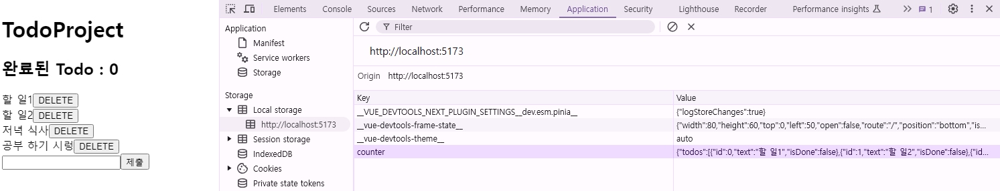
    

# 참고

## Pinia 활용 시점

### 이제 모든 데이터를 store에서 관리해야 하는가

- Pinia를 사용한다고 해서 모든 데이터를 state에 넣어야 하는 것은 아님
- `pass props`, `emit event`를 함께 사용하여 애플리케이션을 구성해야 함
- 상황에 따라 적절하게 사용하는 것이 필요

### Pinia, 언제 사용해야 하는가

- Pinia는 공유된 상태를 관리하는 데 유용하지만,
구조적인 개념에 대한 이해와 시작하는 비용이 큼
- 애플리케이션이 단순하다면 Pinia가 없는 것이 더 효율적일 수 있음
- 그러나 중대형 규모의 SPA를 구축하는 경우 Pinia는 자연스럽게 선택할 수 있는 단계가 오게 됨

→ 결과적으로 적절한 상황에서 활용했을 때, Pinia 효용을 극대화 할 수 있음