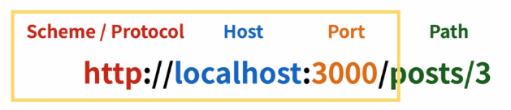
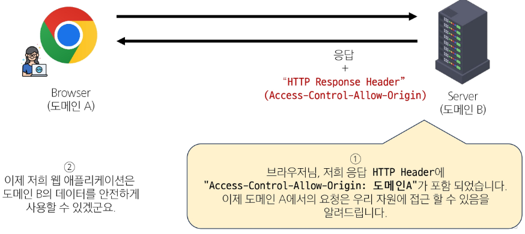
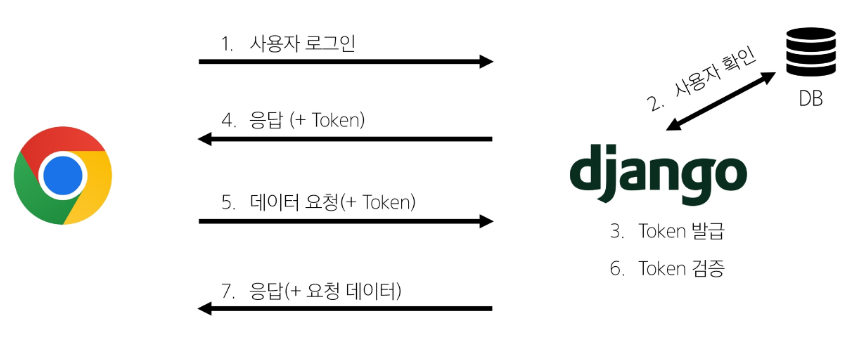
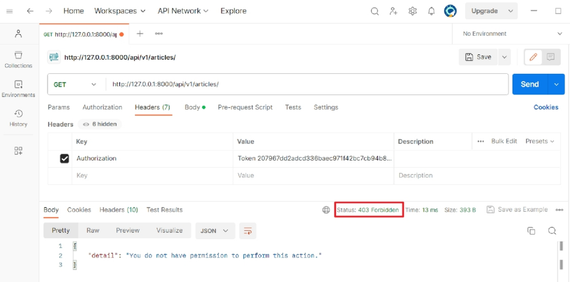

# 프로젝트 개요

**Vue와 DRF간 기본적인 요청과 응답**

https://github.com/SJLee-0525/learning/tree/master/vue/07-01-vue-with-drf

# CORS Policy

## SOP

`Same-Origin-Policy` : 동일 출처 정책

- 어떤 출처(Origin)에서 불러온 문서나 스크립트가 
다른 출처에서 가져온 리소스와 상호 작용하는 것을 제한하는 보안 방식
    
    → 다른 곳에서 가져온 자료는 일단 막음
    
- 웹 어플리케이션의 도메인이 다른 도메인의 리소스에 접근하는 것을 제어하여,
사용자의 개인 정보와 데이터의 보안을 보호하고, 잠재적인 보안 위협을 방지
- 잠재적으로 해로울 수 있는 문서를 분리함으로써, 공격받을 수 있는 경로를 줄임

### Origin

- URL의 Protocol, Host, Post를 모두 포함하여 출처라고 부름

**Same Origin 예시**

- 아래 세 영역이 일치하는 경우에만 동일 출처로 인정
    
    
    
    | **URL** | **결과** | **이유** |
    | --- | --- | --- |
    | **`http://localhost:3000/articles/`** | **성공** | **Path만 다름** |
    | **`http://localhost:3000/articles/3`** | **성공** | **Path만 다름** |
    | **`https://localhost:3000/articles/3`** | **실패** | **Protocol 다름** |
    | **`http://localhost:80/articles/3`** | **실패** | **Port 다름** |
    | **`http://yahuua:3000/articles/3`** | **실패** | **Host 다름** |

### CORS policy의 등장

- 기본적으로 웹 브라우저는 같은 출처에서만 요청하는 것을 허용하며,
다른 출ㅊ로의 요청은 보안상의 이유로 차단됨
    - SOP에 의해 다른 출처의 리소스와 상호작용 하는 것이 기본적으로 제한되기 때문
- 하지만 현대 웹 어플리케이션은 다양한 출처로부터 리소스를 요청하는 경우가 많기 때문에
CORS 정책이 필요하게 되었음
- 

**→ 웹 서버가 리소스에 대한 서로 다른 출처 간 접근을 허용하도록 선택할 수 있는 기능을 제공**

## CORS

**`Cross-Origin Resource Sharing` : 교차 출처 리소스 공유**

- 특정 출처에서 실행 중인 웹 어플리케이션이 
다른 출처의 자원에 접근할 수 있는 권한을 부여하도록 브라우저에 알려주는 체제

→ 만약 다른 출처의 리소스를 가져오기 위해서는
    이를 제공하는 서버가 브라우저에게 다른 출처지만 접근해도 된다는 사실을 알려야 함

**→ CORS policy (교차 출처 리소스 공유 정책)**

### CORS Policy

**`Cross-Origin Resource Sharing Policy` : 교차 출처 리소스 공유 정책**

- 다른 출처에서 온 리소스를 공유하는 것에 대한 정책
- 서버에서 설정되며, 브라우저가 해당 정책을 확인하여 요청이 허용되는지 여부를 결정

**→ 다른 출처의 리소스를 불러오려면, 
    그 다른 출처에서 올바른 `CORS header`를 포함한 응답을 반환해야 함**

### CORS 적용 방법



### CORS Policy 정리

- 웹 어플리케이션이 다른 도메인에 있는 리소스에 안전하게 접근할 수 있도록 
허용 또는 차단하는 보안 메커니즘
- 서버가 약속된 `CORS header`를 포함하여 응답한다면, 브라우저는 해당 요청을 허용

**→ 서버에서 `CORS header` 를 만들어야 함**

## CORS Headers 설정

- **Django에서는 `django-cors-headers` 라이브러리 활용**
    - 손쉽게 응답 객체에 `CORS header`를 추가해주는 라이브러리

1. **설치**
    
    ```bash
    $ pip install django-cors-headers
    ```
    

1. [**settings.py](http://settings.py) 설정 및 CORS를 허용할 프로젝트의 도메인 등록**
    
    ```python
    # Application definition
    INSTALLED_APPS = [
        'articles',
        'accounts',
        'rest_framework',
        **'corsheaders',**
        'django.contrib.admin',
        'django.contrib.auth',
        'django.contrib.contenttypes',
        'django.contrib.sessions',
        'django.contrib.messages',
        'django.contrib.staticfiles',
    ]
    
    MIDDLEWARE = [
        'django.middleware.security.SecurityMiddleware',
        'django.contrib.sessions.middleware.SessionMiddleware',
        **'corsheaders.middleware.CorsMiddleware',**
        'django.middleware.common.CommonMiddleware',
        'django.middleware.csrf.CsrfViewMiddleware',
        'django.contrib.auth.middleware.AuthenticationMiddleware',
        'django.contrib.messages.middleware.MessageMiddleware',
        'django.middleware.clickjacking.XFrameOptionsMiddleware',
    ]
    
    **CORS_ALLOWED_ORIGINS = [
        'http://127.0.0.1:5173',
        'http://localhost:5173',
    ]**
    
    ...
    ```
    

# 인증

### 인증

**`Authentication`** 

**수신된 요청을 해당 요청의 사용자 또는 자격 증명과 연결하는 메커니즘**

→ 누구인지를 확인하는 과정

### 권한

**`Permissions`**

**요청에 대한 접근 허용 또는 거부 여부를 알림**

### 인증과 권한

- 순서상 인증이 먼저 진행되며, 
수신 요청을 해당 요청의 사용자 또는 해당 요청이 서명된 토큰과 같은 자격 증명 자료와 연결
- 그런 다음 권한 및 제한 정책은 인증이 완료된 해당 자격 증명을 사용하여
요청을 허용해야 하는지를 결정

### DRF에서의 인증

- 인증은 항상 view 함수 시작 시, 권한 및 제한 확인이 발생하기 전,
다른 코드의 진행이 허용되기 전에 실행됨
    
    → 인증 자체로는 들어오는 요청을 허용하거나 거부할 수 없으며
        단순히 요청에 사용된 자격 증명만 식별한다는 점에 유의
    

### 승인되지 않은 응답 및 금지된 응답

- 인증되지 않은 요청이 권한을 거부하는 경우, 해당되는 두 가지 오류 코드를 응답
1. `HTTP 401 Unauthorized`
    - 요청된 리소스에 대한 유효한 인증 자격 증명이 없기 때문에,
    클라이언트 요청이 완료되지 않았음을 나타냄 (누구인지를 증명할 자료가 없음)

1. `HTTP 403 Forbidden (Permission Denied)`
    - 서버에 요청이 전달되었지만, 권한 때문에 거절되었다는 것을 의미
    - 401과 다른 점은 서버는 클라이언트가 누구인지 알고 있음

## 인증 정책 설정

### 전역 설정

- 프로젝트 전체에 적용되는 기본 인증 방식을 정의
- `DEFAULT_AUTHENTICATION_CLASSES` 를 사용
- 기본 값: `SessionAuthentication`과 `BasicAuthentication`
    
    ```python
    
    ```
    

### View 함수 별 설정

- `authentication_classes` 데코레이터를 사용
- 개별 view 함수에 지정하여 재정의
    
    ```python
    
    ```
    

### DRF가 제공하는 인증 체계

1. **`BasciAuthentication`**
2. **`TokenAuthentication`**
    - token 기반 HTTP 인증 체계
    - 기본 데스크톱 및 모바일 클라이언트와 같은 클라이언트-서버 설정에 적합
    
    → 서버가 인증된 사용자에게 토큰을 발급하고,
        사용자는 매 요청마다 발급 받은 토큰을 요청과 함께 보내 인증 과정을 거침
    
3. **`SessionAuthentication`**
4. **`RemoteUserAuthentication`**

## Token 인증 설정

### **`TokenAuthentication` 적용 과정**

1. **인증 클래스 설정**
    - **`TokenAuthentication`** 활성화 코드 작성
        
        → 전역 인증 정책을 token 방식으로 설정
        
    
    ```python
    # settings.py
    
    REST_FRAMEWORK = {
        # Authentication
        'DEFAULT_AUTHENTICATION_CLASSES': [
            'rest_framework.authentication.TokenAuthentication',
        ],
    }
    ```
    

1. **INSTALLED_APPS 추가**
    
    ```python
    # settings.py
    
    INSTALLED_APPS = [
    		...
        'rest_framework',
        **'rest_framework.authtoken',**
        ...
    ]
    ```
    

1. **Migrate 진행**
    
    `$ python [manage.py](http://manage.py/) migrate`
    

1. **토큰 생성 코드 작성**
    - accounts/signals.py 작성
        
        → 인증된 사용자에게 자동을 토큰을 생성해주는 역할
        
    
    ```python
    # accounts/signals.py
    
    from django.db.models.signals import post_save
    from django.dispatch import receiver
    from rest_framework.authtoken.models import Token
    from django.conf import settings
    
    @receiver(post_save, sender=settings.AUTH_USER_MODEL)
    def create_auth_token(sender, instance=None, created=False, **kwargs):
        if created:
            Token.objects.create(user=instance)
    ```
    

### 토큰 인증 방식 과정



## `Dj-Rest-Auth` 라이브러리

### `Dj-Rest-Auth`

**회원가입, 인증, 비밀번호 재설정, 사용자 세부 정보 검색, 회원 정보 수정 등
다양한 인증 관련 기능을 제공하는 라이브러리**

### `Dj-Rest-Auth` 설치 및 적용 (인증)

1. **설치**
    
    `$ pip install dj-rest-auth`
    

1. **INSTALLED_APPS 추가**
    
    ```python
    # settings.py
    
    INSTALLED_APPS = [
    		...
        'rest_framework',
        'rest_framework.authtoken',
        **'dj_rest_auth',**
        'corsheaders',
        ...
    ]
    ```
    

1. **URL 추가**
    
    ```python
    # my_api/urls.py
    
    from django.contrib import admin
    from django.urls import path, include
    
    urlpatterns = [
        path('admin/', admin.site.urls),
        path('api/v1/', include('articles.urls')),
        **path('accounts/', include('dj_rest_auth.urls')),**
    ]
    ```
    

### `Dj-Rest-Auth`의 Registration 기능 추가 설정

1. **패키지 추가 설치**
    
    `$ pip install 'dj-rest-auth[with-social]'`
    

1. **INSTALLED APPS 추가**
    
    ```python
    # settings.py
    
    INSTALLED_APPS = [
        'articles',
        'accounts',
        'rest_framework',
        'rest_framework.authtoken',
        'dj_rest_auth',
        'corsheaders',
        **'django.contrib.sites',
        'allauth',
        'allauth.account',
        'allauth.socialaccount',
        'dj_rest_auth.registration',**
        ...
     ]
     
     **SITE_ID = 1**
    ```
    

1. **관련 설정 코드 작성**
    
    ```python
    # settings.py
    
    MIDDLEWARE = [
    		...
        **'allauth.account.middleware.AccountMiddleware',**
    ]
    ```
    

1. **URL 추가**
    
    ```python
    # my_api/urls.py
    
    from django.contrib import admin
    from django.urls import path, include
    
    urlpatterns = [
        path('admin/', admin.site.urls),
        path('api/v1/', include('articles.urls')),
        path('accounts/', include('dj_rest_auth.urls')),
        **path('accounts/signup/', include('dj_rest_auth.registration.urls')),**
    ]
    ```
    

1. **Migrate 진행**

# 권한

## 권한 정책 설정

### 전역 설정

- 프로젝트 전체에 적용되는 기본 권한 방식을 정의
- `DEFAULT_PERMISSION_CLASSES` 를 사용
- 기본 값:  `rest_framework.permissions.AllowAny`
    
    ```python
    
    ```
    

### View 함수 별 설정

- `permission_classes` 데코레이터를 사용
- 개별 view에 지정하여 재정의
    
    ```python
    
    ```
    

### DRF가 제공하는 권한 정책

1. **`IsAuthenticated`**
    - 인증되지 않은 사용자에 대한 권한을 거부하고, 그렇지 않은 경우 권한을 허용
        
        → 등록된 사용자만 API에 액세스 할 수 있도록 하려는 경우에 적합
        
2. **`IsAdminUser`**
3. **`IsAuthenticatedOrReadOnly`**
4. **…**

## **`IsAuthenticated` 설정**

### **`IsAuthenticated` 권한 설정**

1. `DEFAULT_PERMISSION_CLASSES` 작성
    
    → 기본적으로 모든 view 함수에 대한 접근을 허용
    
    ```python
    # settings.py
    
    REST_FRAMEWORK = {
        # Authentication
        'DEFAULT_AUTHENTICATION_CLASSES': [
            'rest_framework.authentication.TokenAuthentication',
        ],
        **# permission
        'DEFAULT_PERMISSION_CLASSES': [
            'rest_framework.permissions.AllowAny',
        ],**
    }
    ```
    

1. **`permission_classes` 관련 코드 작성**
    - 전체 게시글 조회 및 생성시에만 인증된 사용자만 진행할 수 있도록 권한 설정
    
    ```python
    # articles/views.py
    
    from rest_framework.response import Response
    from rest_framework.decorators import api_view
    from rest_framework import status
    
    # permission Decorators
    from rest_framework.decorators import permission_classes
    from rest_framework.permissions import IsAuthenticated, IsAdminUser
    ```
    

### 권한 활용

- 만약 관리자만 전체 게시글 조회가 가능한 권한이 설정되었을 때
인증된 일반 사용자가 조회 요청을 할 경우 어떻게 되는지 응답 확인하기
1. **테스트를 위해 임시로 관리자 권한 클래스를 IsAdminUser로 변경**
    
    ```python
    # permission Decorators
    from rest_framework.decorators import permission_classes
    **from rest_framework.permissions import IsAuthenticated, IsAdminUser**
    
    @api_view(['GET', 'POST'])
    **@permission_classes([IsAdminUser])**
    def article_list(request):
    		pass
    ```
    

1. **전체 게시글 조회 요청**
    - 403 Forbidden 응답 확인
        
        
        

1. **IsAdminUser 삭제 후 IsAuthenticated 권한으로 복구**
    
    ```python
    # permission Decorators
    from rest_framework.decorators import permission_classes
    **from rest_framework.permissions import IsAuthenticated**
    
    @api_view(['GET', 'POST'])
    **@permission_classes([IsAuthenticated])**
    def article_list(request):
        pass
    ```
    

## 회원 가입

### 회원 가입 로직 구현

1. **SignUpView route 관련 코드 작성**

1. **App 컴포넌트에 SignUpView 컴포넌트로 이동하는 RouterLink 작성**

1. 회원가입 Form 작성l