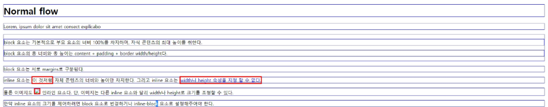

# CSS

웹 페이지의 디자인과 레이아웃을 구성하는 언어


### 스타일

1. **인라인 스타일 (Inline)**
    1. HTML 요소 안에 style 속성 값으로 작성
    
    
    
2. **내부 스타일 시트 (Internal)**
    - 하나의 html 안에서 쓸 거기에 많이 쓸 것
    
    
    
3. **외부 스타일 시트 (External)**
    - 별도 CSS 파일 생성 후 HTML link 태그를 사용해 불러오기
    - 확장성이 좋음
    
    
    

### CSS 선택자 (CSS Selectors)

HTML 요소를 선택해 스타일을 적용할 수 있도록 하는 선택자

- 전체 선택자 `*`
    
    HTML 모든 요소를 선택
    
- 요소 선택자:
    
    지정한 모든 태그를 선택
    
- 클래스 선택자 `.`
    
    주어진 클래스 속성을 가진 모든 요소를 선택
    
- 아이디 선택자 `#`
    
    주어진 아이디 속성을 가진 요소 선택
    
    문서에는 주어진 아이디를 가진 요소가 하나만 있어야 함
    
    
    
    
    

### CSS 결합자 특징

- **자손** 결합자 `_`  (space)
    
    첫 번째 요소의 자손 요소들 선택
    
    ex) `p span`은 `<p>` 안에 있는 모든 `<span>`을 선택(하위 레벨 상관 없이)
    
- **자식** 결합자 `>`
    
    첫 번째 요소의 직계 자식만 선택
    
    ex) `ul > li` 는 `<ul>` 안에 있는 모든 `<li>` 를 선택 
    *(만약 div가 중간에 튀어나오면 이후로는 적용 안 됨)*
    
    
    
    
    

### 명시도 (Specificity)

결과적으로 요소에 적용할 CSS 선언을 결정하기 위한 알고리즘

- CSS selector에 가중치를 계산해 어떤 스타일을 적용할 지 결정
- 동일한 요소를 가리키는 2개 이상의 CSS 규칙이 있는 경우
가장 높은 명시도를 가진 Selector가 승리하여 스타일이 적용


→ 동일한 h1 태그에 다음과 같이 스타일이 작성된다면 
red가 적용됨

### 계단식 (Cascade)

한 요소에 동일한 가중치를 가진 선택자가 적용될 때. CSS에서 마지막에 나오는 선언이 사용됨


→ h1에 purple이 적용됨

### 명시도 순위:

```jsx
1. Importance
  - ! important
2. Inline 스타일
3. 선택자
	- id 선택자 > class 선택자 > 요소 선택자
4. 소스 코드 선언 순서
```

**`!important`  : 다른 우선순위 규칙보다 우선하여 적용하는 키워드**

→ Cascade의 구조를 무시하고 강제로 스타일을 적용하는 방식이므로 사용을 권장하지 X

ex)


## CSS 상속:

기본적으로 CSS는 상속을 통해 부모 요소의 속성을 자식에게 상속해 재사용성을 높임

- **상속 되는 속성:**
    
    Text 관련 요소(font, color, text-align), opacity, visibility 등
    
- **상속 되지 않는 속성**
    
    Box model 관련 요소(width, height, border, box-sizing … )
    
    Position 관련 요소(position, top / right / bottom / left, z-index) 등
    

## CSS Box Model

웹 페이지의 모든 HTML 요소를 감싸는 사각형 상자 모델

- 원은 네모 박스를 깎은 것


- 웹 페이지 레이아웃은 박스로 구성됨


### BOX 타입:

1. Block box
2. Inline box
    
    → 타입에 따라 페이지에서의 배치 흐름 및 다른 박스와 관련해 박스가 동작하는 방식이 달라짐
    

### BOX 표시 타입

- Outer display type: 박스가 문서 흐름에서 어떻게 동작할 지를 결정
    1. **Block box**
        - 항상 새로운 행으로 나뉨
        - width와 height 속성 사용 가능
        - padding, margin, border로 인해 다른 요소를 상자로부터 밀어냄
        - width 속성을 지정하지 않으면 박스는 inline 방향으로 사용 가능한 공간을 모두 차지함
            - 상위 컨테이너 너비 100%로 채우는 것
        - 대표적인 block 타입 태그
            - `h1 ~ 6`, `p`, `div`
    2. **Inline box**
        - 새로운 행으로 넘어가지 않음
        - width와 height 속성을 사용할 수 없음
        - 수직 방향:
            - padding, margin, border가 적용되지만 다른 요소를 밀어낼 수 없음
        - 수평 방향
            - padding, margin, border가 적용되지만 다른 요소를 밀어낼 수 있음
        - 대표적인 inline 타입 태그
            - `a`, `img`, `span`, `strong`, `em`
        - 배치할 때 되도록 inline 요소를 그대로 쓰기보다는 `div` 등으로 감싸 사용하는 것이 좋음
    3. **inline-block**
        - inline과 block 요소 사이의 중간 지점을 제공하는 display 값
        - width 및 height 속성 사용 가능
        - padding, margin 및 border로 인해 다른 요소가 상자에서 밀려남
        - 새로운 행으로 넘어가지 않음
    
    
    

### Normal flow





- Inner display type: 박스 내부의 요소들이 어떻게 배치될 지를 결정
    - 속성: flex
    
    
    

### CSS BOX Model

웹 페이지의 모든 HTML 요소를 감싸는 사각형 상자 모델

→ 내용(content), 안쪽 여백(padding), 테두리(border), 외부 간격(margin)으로 구성돼 요소의 크기와 배치를 결정

**BOX 구성 요소**


**BOX 구성의 방향 별 속성 값**


### shorthand 속성

- **border**
    
    border-width, style, color를 한 번에 설정하기 위한 속성
    


- **margin & padding**
    
    4방향의 속성을 각각 지정하지 않고 한 번에 지정할 수 있는 속성
    


### The standart CSS box model

- 표준 상자 모델에서 width, height 속성 값을 설정하면 이 값은 content box의 크기를 조정하게 됨


- CSS는 border box가 아닌 content box의 크기를 width 값으로 지정


### The alternative CSS box model

- 대체 상자 모델에서 모든 width와 height는 실제 상자의 너비
- 실제 박스 크기를 정하기 위해 테두리와 패딩을 조정할 필요 없음


- **대체 상자 모델로 변경 - box-sizing 속성**


## 기타 display 속성

### inline-block

- inline과 block 요소 사이의 중간 지점을 제공하는 display 값
- width 및 height 속성 사용 가능
- padding, margin 및 border로 인해 다른 요소가 상자에서 밀려남
- 새로운 행으로 넘어가지 않음

→ 요소가 줄 바꿈 되는 것을 원하지 않으면서 너비와 높이를 적용하고 싶을 경우에 사용


### none

- 요소를 화면에 표시하지 않고, 공간조차 부여되지 않음


## CSS Layout

- 각 요소의 위치와 크기를 조정해 웹 페이지의 디자인을 결정하는 것
    
    → Display, Position, Flexbox 등
    

### CSS Position

- 요소를 Normal Flow에서 제거해 다른 위치로 배치하는 것

→ 다른 요소 위에 올리기, 화면의 특정 위치에 고정시키기

- **Position 이동 방향**


### Position 유형

```
**- static:
  - 요소를 Normal Flow에 따라 배치**
  - top, right, bottom, left 속성이 적용되지 않음 (z-index도)
  **- 기본 값**
  
**- relative:**
  **- 요소를 Normal Flow에 따라 배치**
  - 자신의 원래 위치(static)을 기준으로 이동
  - top, right, bottom, left 속성으로 위치를 조정
  **- 다른 요소의 레이아웃에 영향을 주지 않음(요소가 차지하는 공간은 static일 때와 같음)**
  
**- absolute:**
	**- 요소를 Normal Flow에서 제거**
	- **가장** **가까운 relative 부모 요소를 기준으로 이동**
	  - **만족하는 부모 요소가 없다면 body 태그를 기준으로 함**
	- top, right, bottom, left 속성으로 위치를 조정
	- **문서에서 요소가 차지하는 공간이 없어짐**
	
**- fixed**:
  **- 요소를 Normal Flow에서 제거**
  **- 현재 화면 영역(viewport)을 기준으로 이동**
  - **스크롤해도 항상 같은 위치에 유지됨**
  - top, right, bottom, left 속성으로 위치를 조정
  **- 문서에서 요소가 차지하는 공간이 없어짐**
  
**- sticky**
  **- relative와 fixed의 특성을 결합한 속성**
  - 스크롤 위치가 **임계점에 도달하기 전에는 relative처럼 동작**
  - 스크롤이 특정 **임계점에 도달하면 fixed처럼 동작해 화면에 고정됨**
  - 만약 **다음 sticky 요소가 나오면 다음 sticky 요소가 이전 sticky 요소의 자리를 대체**
	  - 이전 sticky 요소가 고정되어 있던 위치와 다음 sticky 요소가 고정되어야 할
		  위치가 겹치게 되기 때문
```

**Position absolute 활용**

### z-index

- 요소의 쌓임 순서(stack order)를 정의하는 속성
- 정수 값을 사용해 Z축 순서를 지정
- 값이 클 수록 요소가 위에 쌓이게 됨
- static이 아닌 요소에만 적용됨

**특징**

- 기본 값은 auto
- 부모요소의 z-index 값에 영향을 받음
- 같은 부모 내에서만 z-index 값을 비교
- 부모의 z-index가 낮으면 자식의 z-index가 아무리 높아도 부모보다 위로 올라갈 수 없음
- z-index 값이 같으면 HTML 문서 순서대로 쌓임

### Position의 목적

→ 전체 페이지에 대한 레이아웃을 구성하는 것보다는, **페이지 특정 항목의 위치를 조정하는 것**

### Inner display type

- Flexbox
- 박스 내부의 요소들이 어떻게 배치될 지를 결정
    
    
    

### CSS Flexbox

- 요소를 행과 열 형태로 배치하는 1차원 레이아웃 방식
    
    → 공간 배열 & 정렬
    

- **요소를 행과 열 형태로 배치하는 1차원 레이아웃 방식**
    
    
    

- **Flexbox 구성 요소**
    
    
    
    - **main axis (주 축)**
        - flex item들이 배치되는 기본 축
        - main start에서 시작해 main end 방향으로 배치
            
            
            
    
    - **cross axis (교차 축)**
        - **main axis에 수직인 축**
        - cross start에서 시작해 cross end 방향으로 배치 (기본 값)
        
        
        
    - **Flex Container:**
        - display: flex; 혹은 display: inline-flex; 가 설정된 부모 요소
        - 이 컨테이너의 1차 자식 요소들이 Flex Item이 됨
        - flexbox 속성 값들을 사용해 자식 요소 Flex Item들을 배치하는 주체
        
        
        
    
    - **Flex Item**
        - Flex Container 내부에 레이아웃 되는 항목
        
        
        

### Flexbox 속성 목록


- **Flex-Container 지정**
    - flex item은 기본적으로 행 (주 축의 기본 값인 가로 방향)으로 나열
    - flex item은 주 축의 시작 선에서 시작
    - flex item은 교차 축의 크기를 채우기 위해 늘어남
    
    
    

- **`flex-direction`**
    - flex item이 나열되는 방향을 지정
    - column으로 지정할 경우 주 축이 변경됨
    - `-reverse` 로 지정하면 flex item 배치의 시작 선과 끝 선이 서로 바뀜
    
    
    
- **`flex-wrap`**
    - flex item 목록이 flex contatiner의 한 행에 들어가지 않을 경우
    다른 행에 배치할지 여부 설정
    
    
    

- **`justify-content`**
    - 주 축을 따라 flex item과 주위에 공간을 분배
    
    
    
- **`align-content`**
    - 교차 축을 따라 flex item과 주위에 공간을 분배
        - flex-wrap이 warp 또는 wrap-reverse로 설정된 여러 행에만 적용됨
        - 한 줄 짜리 행에는 효과 없음(flex-wrap: nowrap으로 설정된 경우)
        
        
        

- **`align-items`**
    - 교차 축을 따라 flex item 행을 정렬
    
    
    

- **`align-self`**
    - 교차 축을 따라 개별 flex item을 정렬
    
    
    

- **`flex-grow`**
    - 남는 행 여백을 비율에 따라 각 flex item에 분배
        - 아이템이 컨테이너 내에서 확장하는 비율을 지정
    - flex-grow의 반대는 flex-shrink
    
    
    


- **`flex-basis`**
    - flex item의 초기 크기 값을 지정
    - flex-basis와 width값을 값을 동시에 적용한 경우 flex-basis가 우선
    
    
    
    
    

**justify-items / self 속성이 없는 이유**

- 필요 없기 때문.
- margin auto로 정렬 및 배치가 가능

### Flex 정리:

- **`flex-direction`**


- **`flex-wrap`**


- **`justify-content`**


- **`align-content`**


- **`align-items`**


- **`align-self`**


### 목적에 따른 속성 분류


### 반응형 레이아웃

다양한 디바이스와 화면 크기에 자동으로 적응하여 
콘텐츠를 최적으로 표시하는 웹 레이아웃 방식


### 마진 상쇄(Margin collapsing)

- 두 block 타입 요소의 margin top과 bottom이 만나 더 큰 margin으로 병합되는 현상

**이유**

- 복잡한 레이아웃에서 요소 간 간격을 일관되게 유지하기 위함
- 요소 간의 간격을 더 예측 가능하고 관리하기 쉽게 만듦
    
    **→ `일관성`, `단순화`**
    

### img / background-img

정렬됨, 정렬되지 않음

```html
<style>
  header {
    background-image: url('images/header.jpg');
  }

</style>
```

### 개인적인 참고자료

```html
<style> 
    * {
        display: block;
        display: inline;
        display: inline-block;
        display: flex;
        display: inline-flex;
        display: none

        box-sizing: content-box;
        box-sizing: border-box;

        flex-direction: row;
        flex-direction: row-reverse;
        flex-direction: column;
        flex-direction: column-reverse;

        flex-wrap: nowrap;
        flex-wrap: wrap;
        flex-wrap: wrap-reverse;

        flex-basis: 500px;

        flex-grow: 1;

        justify-content: center;

        align-content: center;
        align-items: center;
        align-self: center;
    }
</style>
```