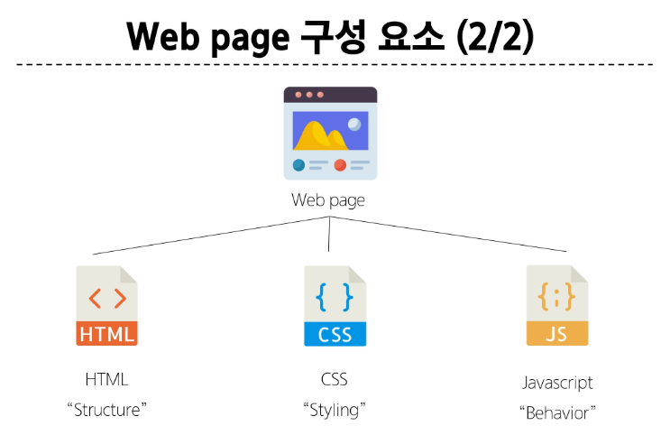
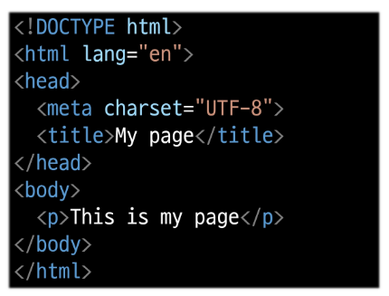
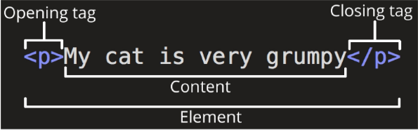
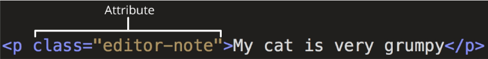

# HTML

- **World wide web:**
    
    인터넷으로 연결된 컴퓨터들이 정보를 공유하는 거대한 정보 공간
    

- **Web:**
    
    web site, web application 등을 통해 사용자들이 정보를 검색하고 상호 작용하는 기술
    

- **Web site:**
    
    여러 개의 web page가 모인 것으로 사용자들에게 정보나 서비스를 제공하는 공간
    

- **Web page:**
    
    HTML, CSS 등의 웹 기술을 이용해 만들어진 ‘web site’를 구성하는 하나의 요소
    



## 웹 구조화:

### HTML: HyperText Markup Language

웹 페이지의 의미와 구조를 정의하는 언어

- **HyperText**
    
    웹 페이지를 다른 페이지로 연결하는 링크:
    
    참조를 통해 사용자가 한 문서에서 다른 문서로 즉시 접근할 수 있는 텍스트
    
    - 비선형성,
    - 상호 연결성
    - 사용자 주도적 탐색

- **Markup Language**
    
    태그 등을 이용해 문서나 데이터의 구조를 명시하는 언어 (ex: HTML, Markdown)
    

### HTML 구조



- **<!DOCTYPE html>:**
    - 해당 문서가 html 문서라는 것을 나타냄
- **<html> </html>:**
    - 전체 페이지의 콘텐츠를 포함
- **<title> </title>:**
    - 브라우저 탬 및 즐겨찾기시 표시되는 제목으로 사용
- **<head> </head>:**
    - HTML 문서에 관련된 설명, 설정 등 컴퓨터가 식별하는 메타데이터를 작성
    - 사용자에게 보이지 않음
- **<body> </body>:**
    - HTML 문서의 내용을 나타냄
    - 페이지에 표시되는 모든 콘텐츠를 작성
    - 한 문서에 하나의 body 요소만 존재

**HTML Element(요소)**

- 하나의 요소는 여는 태그와 닫는 태그, 그리고 그 안의 내용으로 구성됨
- 닫는 태그는 태그 이름 앞에 슬래시가 포함됨
    - 닫는 태그가 없는 태그도 존재
        
        
        

**HTML Attributes(속성)**

- 사용자가 원하는 기준에 맞도록 요소를 설정하거나 다양한 방식으로 요소의 동작을 조절하기 위한 값
- **목적:**
    - 나타내고 싶지 않지만, 추가적인 기능, 내용을 담고 싶을 때 사용
    - CSS에서 스타일 적용을 위해 해당 요소를 선택하기 위한 값으로 활용
        
        
        

- **규칙**:
    1. 속성은 요소 이름과 속성 사이에 공백이 있어야 함
    2. 하나 이상의 속성들이 있는 경우엔 속성 사이에 공백으로 구분함
    3. 속성 값은 열고 닫는 따옴표로 감싸야 함

```html
<!DOCTYPE html>
<html lang="en">
<head>
  <meta charset="UTF-8">
  <meta name="viewport" content="width=device-width, initial-scale=1.0">
  <title>Document</title>
</head>
<body>
  <h1>대제목</h1>                                                              # 대제목
  <h1>대제목2 중복 가능합니다</h1>
  <h2>소제목</h2>                                                # 숫자가 커질수록 작아짐
  <p>My page</p>                                                                # 목차
  <a href="https://www.google.com/">구글</a>                              # 하이퍼 링크
  <p><em>This is Emphasis</em></p>                                           # 기울임체
  <p>This is <strong>Strong</strong></p>                                       # 볼드체
                 # 이미지 <src: source / alt: 대안>
         # 웹상의 이미지 불러오기
  <ol>                                                              # 순서가 있는 리스트
    <li>파이썬</li>                         # ol 태그 안에 li라는 자식 태그가 3개 들어있음
    <li>알고리즘</li>
    <li>웹</li>
  </ol>
  <ul>                                                             # 순서가 없는 리스트
    <li>파이썬</li>                         # ul 태그 안에 li라는 자식 태그가 3개 들어있음
    <li>알고리즘</li>
    <li>웹</li>
  </ul>
</body>
</html>
```

### HTML Text structure

HTML의 주요 목적 중 하나는 텍스트 구조와 의미를 제공하는 것

- **Heading & Paragraphs:**
    - `h1 ~ 6, p`
- **Lists:**
    - `ol, ul, li`
    - `ul` 순서가 없음
    - `ol` 순서가 있음
- **Emphasis & Importance:**
    - `em, strong`