## Bootstrap Grid System

웹 페이지의 레이아웃을 조정하는데 사용되는 **12개의 컬럼**으로 구성된 시스템

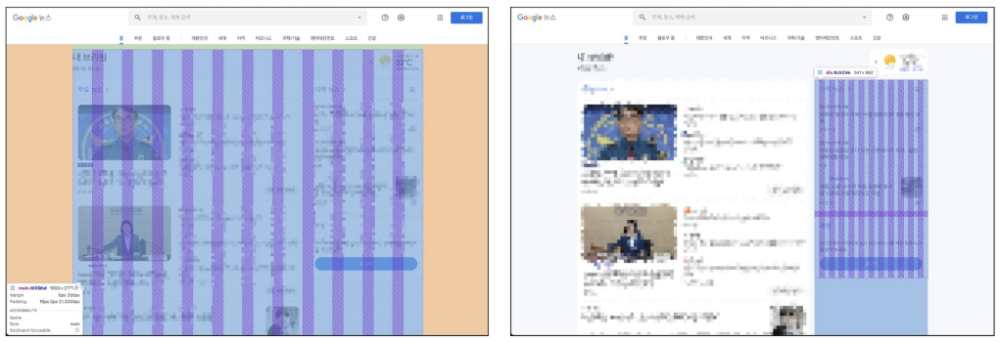

**Grid System 목적**

반응형 디자인을 지원해 웹 페이지를 모바일, 태블릿, 데스크탑 등 다양한 기기에서 적절하게 표시할 수 있도록 도움 

**반응형 웹 디자인 (Responsive Web Design)**

디바이스 종류나 화면 크기에 상관없이,
어디서든 일관된 레이아웃 및 사용자 경험을 제공하는 디자인 기술

### Grid system 기본 요소

1. **Container**
    - Column들을 담고 있는 공간
    
    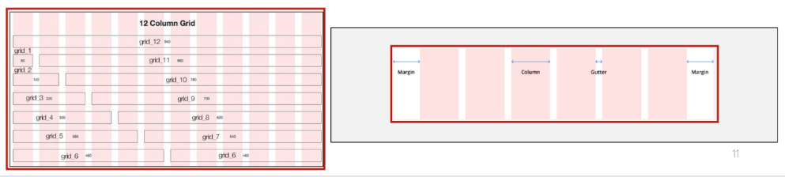
    

1. **ROW**
    - **1개의 row 안에 12개의 column 영역이 구성**
        
        → 각 요소는 12개 중 몇 개를 차지할 것인지 지정됨
        
    
    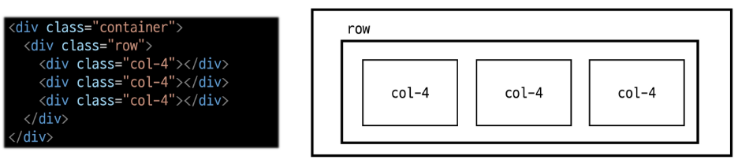
    

1. **Column**
    - 실제 컨텐츠를 포함하는 부분
    
    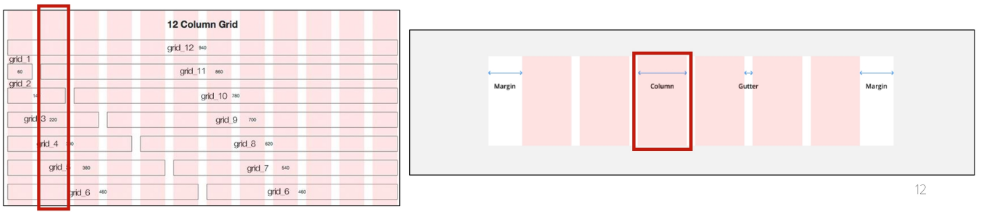
    

1. **Gutters**
    - Grid system에서 Column 사이의 여백 영역
    
    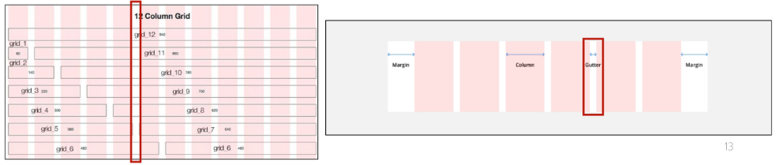
    
    - x축: padding | y축: margin으로 여백 생성
    
    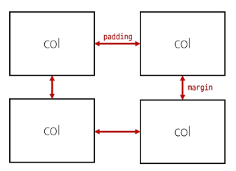
    

### 실습

**기본 (Basic)**

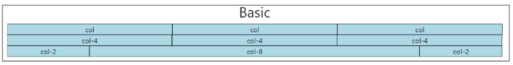

```html
<h2 class="text-center">Basic</h2>
<div class="container">
  <div class="row">
    <div class="box col">col</div>
    <div class="box col">col</div>
    <div class="box col">col</div>
  </div>
  <div class="row">
    <div class="box col-4">col-4</div>
    <div class="box col-4">col-4</div>
    <div class="box col-4">col-4</div>
  </div>
  <div class="row">
    <div class="box col-2">col-2</div>
    <div class="box col-8">col-8</div>
    <div class="box col-2">col-2</div>
  </div>
</div>
```

**중첩 (Nesting)**

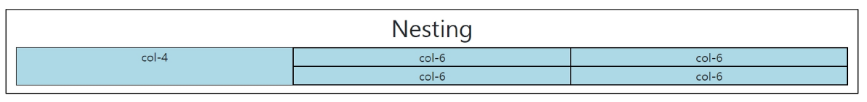

```html
<h2 class="text-center">Nesting</h2>
<div class="container">
  <div class="row">
    <div class="box col-4">col-4</div>
    <div class="box col-8">
      <div class="row">
        <div class="box col-6">col-6</div>
        <div class="box col-6">col-6</div>
        <div class="box col-6">col-6</div>
        <div class="box col-6">col-6</div>
      </div>
    </div>
  </div>
</div>
```

**상쇄 (Offset)**

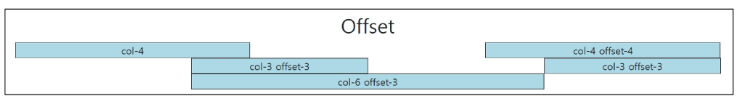

```html
<h2 class="text-center">Offset</h2>
<div class="container">
  <div class="row">
    <div class="box col-4">col-4</div>
    <div class="box col-4 offset-4">col-4 offset-4</div>
  </div>
  <div class="row">
    <div class="box col-3 offset-3">col-3 offset-3</div>
    <div class="box col-3 offset-3">col-3 offset-3</div>
  </div>
  <div class="row">
    <div class="box col-6 offset-3">col-6 offset-3</div>
		<!-- col / offset 은 서로 스타일이 다르기 때문에 누가 먼저 나오건 앞에 나오는 애에 영향을 주지 않음 -->
  </div>
</div>
```

**Gutters** 

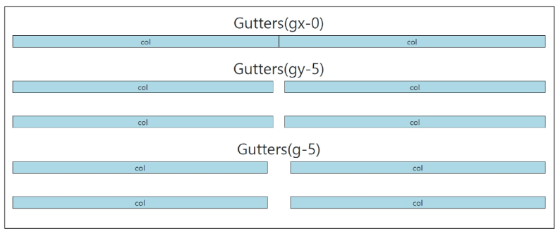

```html
# 거터는 좌우는 패딩 / 상하는 마진이니까 기억할 것!

<h2 class="text-center">Gutters(gx-0)</h2>
<div class="container">
  <div class="row gx-0">
    <!-- 거터는 row(행)이 컨트롤함 / x 좌우로 분리하기 -->
    <div class="col-6">
      <div class="box">col</div>
    </div>
    <div class="col-6">
      <div class="box">col</div>
    </div>
  </div>
</div>

<br>

<h2 class="text-center">Gutters(gy-5)</h2>
<div class="container">
  <div class="row gy-5">
    <!-- y 위아래로 분리하기 -->
    <div class="col-6">
      <div class="box">col</div>
    </div>
    <div class="col-6">
      <div class="box">col</div>
    </div>
    <div class="col-6">
      <div class="box">col</div>
    </div>
    <div class="col-6">
      <div class="box">col</div>
    </div>
  </div>
</div>

<br>

<h2 class="text-center">Gutters(g-5)</h2>
<div class="container">
  <div class="row g-5">
    <!-- 상하좌우 다 여백주기 -->
    <div class="col-6">
      <div class="box">col</div>
    </div>
    <div class="col-6">
      <div class="box">col</div>
    </div>
    <div class="col-6">
      <div class="box">col</div>
    </div>
    <div class="col-6">
      <div class="box">col</div>
    </div>
  </div>
</div>
```

---

## 반응형 웹 디자인 (Responsive Web Design)

디바이스 종류나 화면 크기에 상관없이,
어디서든 일관된 레이아웃 및 사용자 경험을 제공하는 디자인 기술

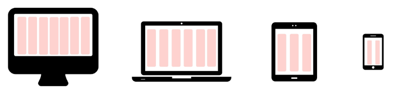

**Bootstrap grid system에서는 12개 column과 6개 breakpoint를 사용해 
반응형 웹 사이트를 구현**

### Grid system breakpoints

웹 페이지를 다양한 화면 크기에서 적절하게 배치하기 위한 분기점

→ 화면 너비에 따라 6개의 분기점 제공 (`xs` , `sm` , `md` , `lg` , `xl` , `xxl`)

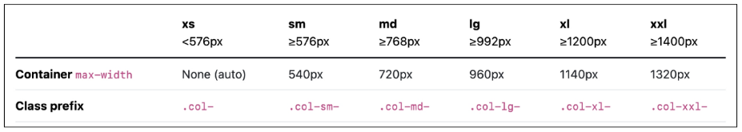

→ 각 breakpoints 마다 설정된 최대 너비 값 **이상으로** 화면이 커지면
    grid system 동작이 변경됨

### Media Query로 작성된 Grid system의 breakpoints

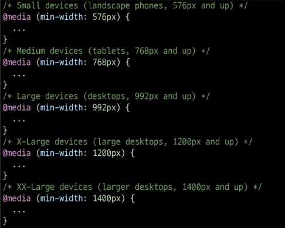

### 실습

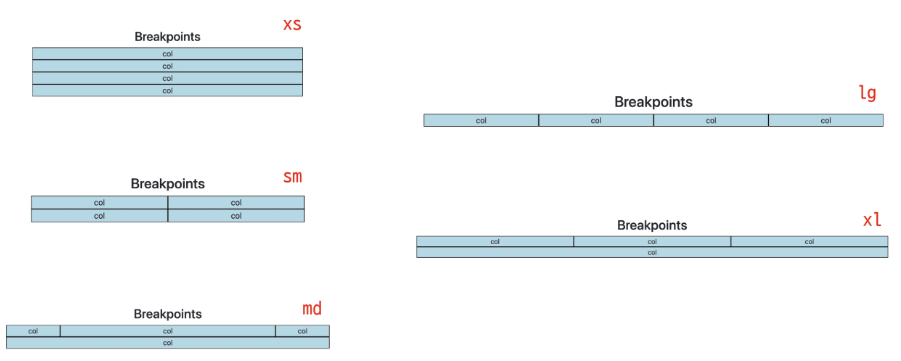

```html
<h2 class="text-center">Breakpoints</h2>
<div class="container">
  <div class="row">
    <div class="box col-12 col-sm-6 col-md-2 col-lg-3 col-xl-4">
      col
    </div>
    <div class="box col-12 col-sm-6 col-md-8 col-lg-3 col-xl-4">
      col
    </div>
    <div class="box col-12 col-sm-6 col-md-2 col-lg-3 col-xl-4">
      col
    </div>
    <div class="box col-12 col-sm-6 col-md-12 col-lg-3 col-xl-12">
      col
    </div>
  </div>
```

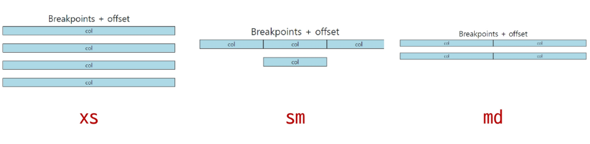

```html
<h2 class="text-center">Breakpoints + offset</h2>
<div class="row g-4">
  <div class="box col-12 col-sm-4 col-md-6">
    col
  </div>
  <div class="box col-12 col-sm-4 col-md-6">
    col
  </div>
  <div class="box col-12 col-sm-4 col-md-6">
    col
  </div>
  <div class="box col-12 col-sm-4 offset-sm-4 col-md-6 offset-md-0">
    col
  </div>
</div>
```

## CSS Layout 정리

- **Grid system**

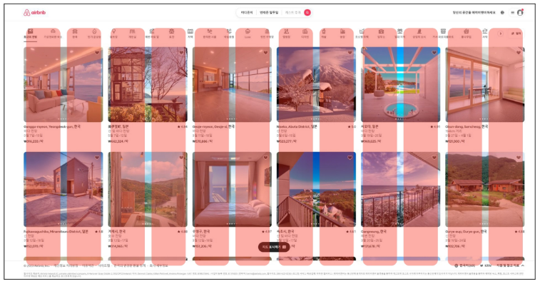

- **Flexbox**

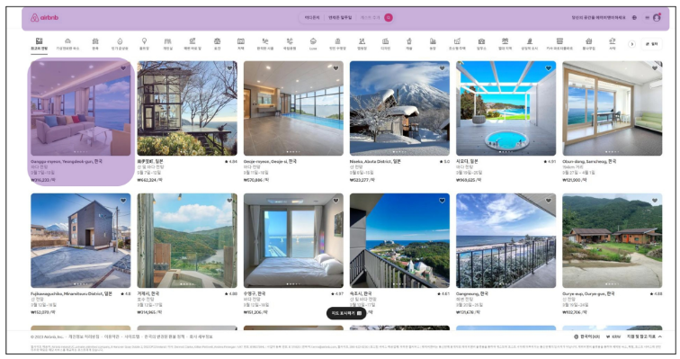

- **Position**

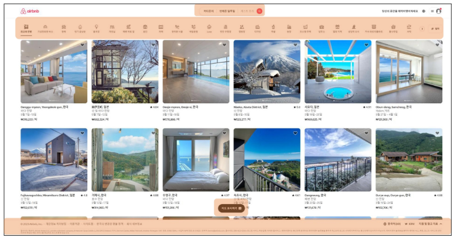

**CSS 레이아웃 기술들은 각각 고유한 특성관 장단점을 가지고 있음**

**이들은 상호 보완적이며, 특정 상황에 따라 적합한 도구가 달라짐**

**최적의 기술을 선택하고 효과적으로 활용하기 위해서는 다양한 실제 개발 경험이 필수**

## UI, UX

### UX (User Experience)

제품이나 서비스를 사용하는 사람들이 느끼는 전체적인 경험과 만족도를
개선하고 최적화하기 위한 디자인과 개발 분야

```html
- 백화점 1층에서 느껴지는 좋은 향수 향기
- 러쉬 매장 근처만 가도 맡을 수 있는 러쉬 향기
- 원하는 음악을 검색할 때, 검색 기능이 적절하게 작동하고 검색 결과가 정확하게 나오는 것
```

**UX 설계**

- 사람들의 마음과 생각을 이해하고 정리해서 제품에 녹여내는 과정
- 유저 리서치, 데이터 설계 및 정제, 유저 시나리오, 프로토타입 설계 등

### UI (User Interface)

서비스와 사용자 간의 상호작용을 가능하게 하는 
디자인 요소들을 개발하고 구현하는 분야

```html
- 리모컨
  - 사용자가 버튼을 누르면 tv가 켜지고 채널을 변경하거나 볼륨을 조절할 수 있음

- ATM
	- 사용자가 터치 스크린을 통해 사용자 정보를 입력하고 원하는 금액을 선택할 수 있음
	
- 웹 사이트
	- 사용자가 로그인 버튼을 누르면, 이동하는 화면의 디자인 및 레이아웃
```

**UI 설계**

- 예쁜 디자인보다는 사용자가 더 쉽고 편리하게 사용할 수 있도록 고려
- 이를 위해서는 디자인 시스템, 중간 산출물, 프로토타입 등이 필요

### The Grid System

- CSS가 아닌 편집 디자인에서 나온 개념으로
구성 요소들을 잘 배치해서 시각적으로 좋은 결과물을 만들기 위함
- 기본적으로 안쪽에 있는 요소들의 오와 열을 맞추는 것에서 기인
- 정보 구조와 배열을 체계적으로 작성해 정보의 질서를 부여하는 시스템

### Grid cards

row-cols 클래스를 사용해 행당 표시할 열(카드) 수를 손쉽게 제어할 수 있음

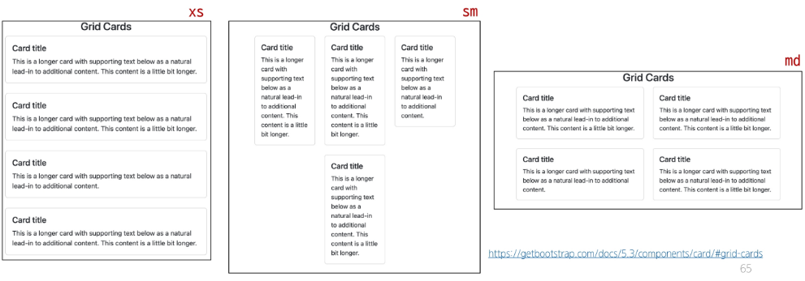

```html
<h2 class="text-center">Grid Cards</h2>
<div class="container">
  <div class="row row-cols-1 row-cols-md-2">
    <div class="col">
      <div class="card">
        <div class="card-body">
          <h5 class="card-title">Card title</h5>
          <p class="card-text">This is a longer card with supporting text below as a natural lead-in to additional
            content. This content is a little bit longer.</p>
        </div>
      </div>
    </div>
  </div>
```